# Guide de l'administrateur

**Plateforme Lumen3D — IRIBHM Microscopy Platform**

---

Ce document explique **tout ce qu'on peut faire depuis le panneau d'administration** du site.

Il est écrit pour quelqu'un qui **n'a jamais vu ce panneau** et qui **ne sait pas coder**. Aucune commande, aucun fichier à éditer : tout ce qui est décrit ici se fait à la souris, depuis un navigateur.

> **Deux règles à retenir avant de commencer**
>
> 1. **Rien n'est perdu tant que vous n'avez pas cliqué sur « Enregistrer »** (ou « Sauvegarder », ou « Publier »). Vous pouvez cliquer partout pour explorer.
> 2. **Le panneau ne touche jamais vos images.** Les fichiers de microscopie sont en lecture seule ; le panneau ne modifie que des réglages (noms, textes, couleurs, visibilité).

---

## Sommaire

**Prise en main**
- [1. Se connecter au panneau](#1-se-connecter-au-panneau)
- [2. Le tour du propriétaire](#2-le-tour-du-propriétaire)

**Les onglets, un par un**
- [3. Datasets — les jeux de données](#3-datasets--les-jeux-de-données)
- [4. Statistiques — qui consulte quoi](#4-statistiques--qui-consulte-quoi)
- [5. Plugins — les fonctions du visualiseur](#5-plugins--les-fonctions-du-visualiseur)
- [6. Catalogue — installer de nouveaux plugins](#6-catalogue--installer-de-nouveaux-plugins)
- [7. Sécurité — mot de passe et permissions](#7-sécurité--mot-de-passe-et-permissions)
- [8. Mises à jour — faire évoluer le site](#8-mises-à-jour--faire-évoluer-le-site)
- [9. Pipeline — préparer de nouvelles données](#9-pipeline--préparer-de-nouvelles-données)
- [10. Identité — le nom et le vocabulaire du site](#10-identité--le-nom-et-le-vocabulaire-du-site)
- [11. Pages — l'éditeur visuel](#11-pages--léditeur-visuel)
- [12. Apparence — les couleurs du site](#12-apparence--les-couleurs-du-site)
- [13. Mentions légales](#13-mentions-légales)

**Annexes**
- [A. Première installation (assistant de démarrage)](#annexe-a--première-installation)
- [B. En cas de problème](#annexe-b--en-cas-de-problème)
- [C. Petit glossaire](#annexe-c--petit-glossaire)

---
---

# 1. Se connecter au panneau

## 1.1. L'adresse

Le panneau d'administration n'est **pas** accessible depuis un lien du site public : il n'y a volontairement aucun bouton « Admin » sur les pages visibles par les visiteurs, et le panneau demande aussi aux moteurs de recherche de ne pas l'indexer.

Pour y accéder, il faut **taper l'adresse à la main** dans la barre du navigateur :

```
https://<adresse-du-site>/admpan.html
```

Remplacez `<adresse-du-site>` par l'adresse habituelle du site. Par exemple, si le site public est `https://microscopy.example.be`, le panneau est à `https://microscopy.example.be/admpan.html`.

> 💡 **Conseil :** mettez cette adresse en favori dans votre navigateur, vous n'aurez plus à la retenir.

## 1.2. Les identifiants

<!-- ─────────────────────────────────────────────────────────────
     À COMPLÉTER À LA MAIN
     ───────────────────────────────────────────────────────────── -->

> **Identifiants d'accès**
>
> - **Identifiant :** `……………………`
> - **Mot de passe :** `……………………`
>
> *(À compléter. Ne diffusez ces informations qu'aux personnes qui doivent réellement administrer le site.)*

## 1.3. L'écran de connexion

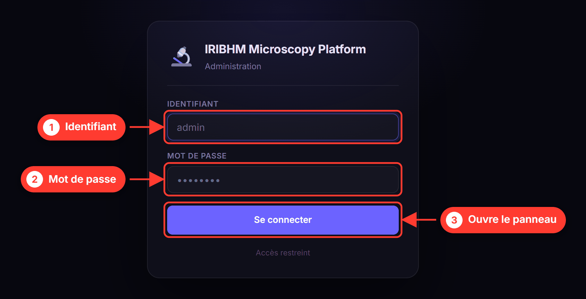

| | |
|---|---|
| **1** | Votre identifiant (par défaut `admin`). |
| **2** | Votre mot de passe. |
| **3** | Ouvre le panneau. La touche **Entrée** fait la même chose. |

Si les identifiants sont mauvais, un message rouge apparaît au-dessus des champs. Il n'y a pas de blocage après plusieurs essais : reprenez simplement.

**Ce qui se passe ensuite :** le navigateur reçoit un jeton de session qui vous garde connecté. Ce jeton n'est **pas** lisible par les pages du site, et il disparaît quand vous vous déconnectez ou quand le serveur redémarre. Si vous revenez le lendemain, il faudra probablement vous reconnecter — c'est normal.

> ⚠️ **Le mot de passe n'est écrit nulle part sur le serveur.** Il est transformé en une empreinte irréversible (voir §7). Personne — pas même l'hébergeur — ne peut le retrouver. **Si vous le perdez**, la seule solution est décrite en [Annexe B](#annexe-b--en-cas-de-problème).

---

# 2. Le tour du propriétaire

Une fois connecté, l'écran se divise en trois zones qui ne changent jamais.

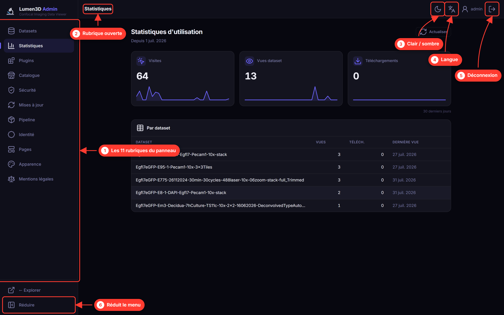

| | |
|---|---|
| **1** | **Le menu de gauche** — les 11 rubriques du panneau. C'est la colonne vertébrale : chaque chapitre de ce guide correspond à une de ces entrées. |
| **2** | **Le titre** rappelle la rubrique ouverte. |
| **3** | **Thème clair / sombre** — ne change que *votre* affichage du panneau, pas le site public. |
| **4** | **Langue** du panneau (français, anglais, espagnol). |
| **5** | **Déconnexion.** |
| **6** | **Réduire** — replie le menu en icônes seules pour gagner de la place. |

Tout en bas du menu, le lien **« ← Explorer »** ouvre le site public dans un nouvel onglet : pratique pour vérifier l'effet d'une modification.

## 2.1. La barre du haut en détail

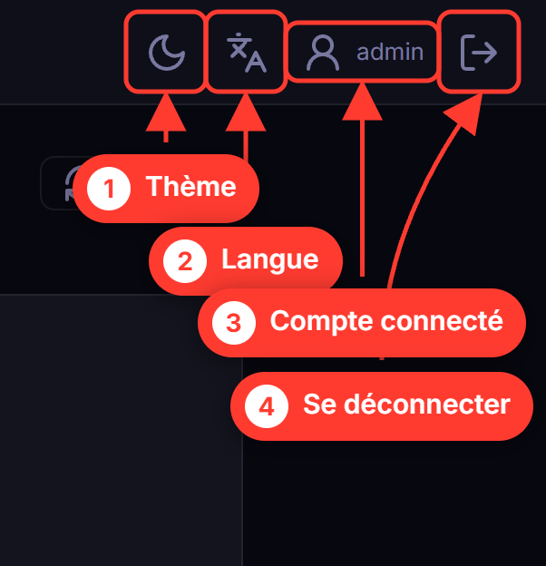

## 2.2. Le témoin « Modifications non sauvegardées »

Dès que vous changez quelque chose sans l'enregistrer, une pastille orange apparaît en haut :

> ● Modifications non sauvegardées

C'est un **rappel**, pas une erreur. Tant qu'elle est là, vos changements ne sont visibles que par vous. Si vous quittez la page, ils sont perdus.

## 2.3. Les onglets en un coup d'œil

| Onglet | À quoi ça sert | Fréquence d'usage |
|---|---|---|
| **Datasets** | Nommer, décrire, afficher ou masquer chaque jeu de données | Courant |
| **Statistiques** | Voir la fréquentation du site | Occasionnel |
| **Plugins** | Activer / désactiver les fonctions du visualiseur 3D | Rare |
| **Catalogue** | Installer de nouvelles fonctions | Rare |
| **Sécurité** | Changer le mot de passe | Rare |
| **Mises à jour** | Installer une nouvelle version du site | Occasionnel |
| **Pipeline** | Télécharger l'outil qui prépare les nouvelles données | Rare |
| **Identité** | Nom du site, vocabulaire, pied de page, menu | Rare |
| **Pages** | Modifier le contenu des pages (accueil, à propos…) | Courant |
| **Apparence** | Couleurs et police du site public | Rare |
| **Mentions légales** | Texte légal | Rare |

---

# 3. Datasets — les jeux de données

C'est l'onglet que vous ouvrirez le plus souvent. Il sert à **décrire** les jeux de données et à **choisir lesquels sont visibles** par le public.

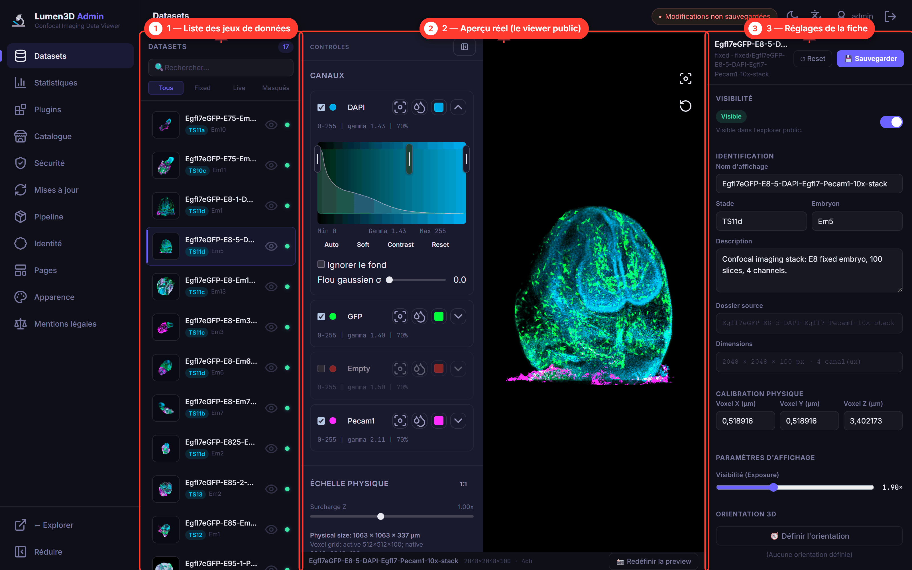

L'écran est divisé en **trois colonnes** :

1. **la liste** de tous les jeux de données ;
2. **l'aperçu** — le vrai visualiseur, exactement comme le voit un visiteur ;
3. **les réglages** du jeu de données sélectionné.

> ### 📌 Comment un jeu de données arrive-t-il ici ?
>
> Vous ne créez **pas** un jeu de données depuis le panneau. Le processus est :
>
> 1. les images brutes du microscope sont traitées par l'outil de préparation (voir [§9](#9-pipeline--préparer-de-nouvelles-données)) ;
> 2. le dossier produit est copié dans le dossier `DATA_WEB` du serveur (par FTP, ou par la personne qui gère le serveur) ;
> 3. **il apparaît immédiatement dans cette liste** — il n'y a rien à régénérer, aucun bouton à cliquer.
>
> Le panneau sert ensuite à lui donner un nom présentable et à décider s'il est public.

## 3.1. La colonne de gauche : trouver un jeu de données

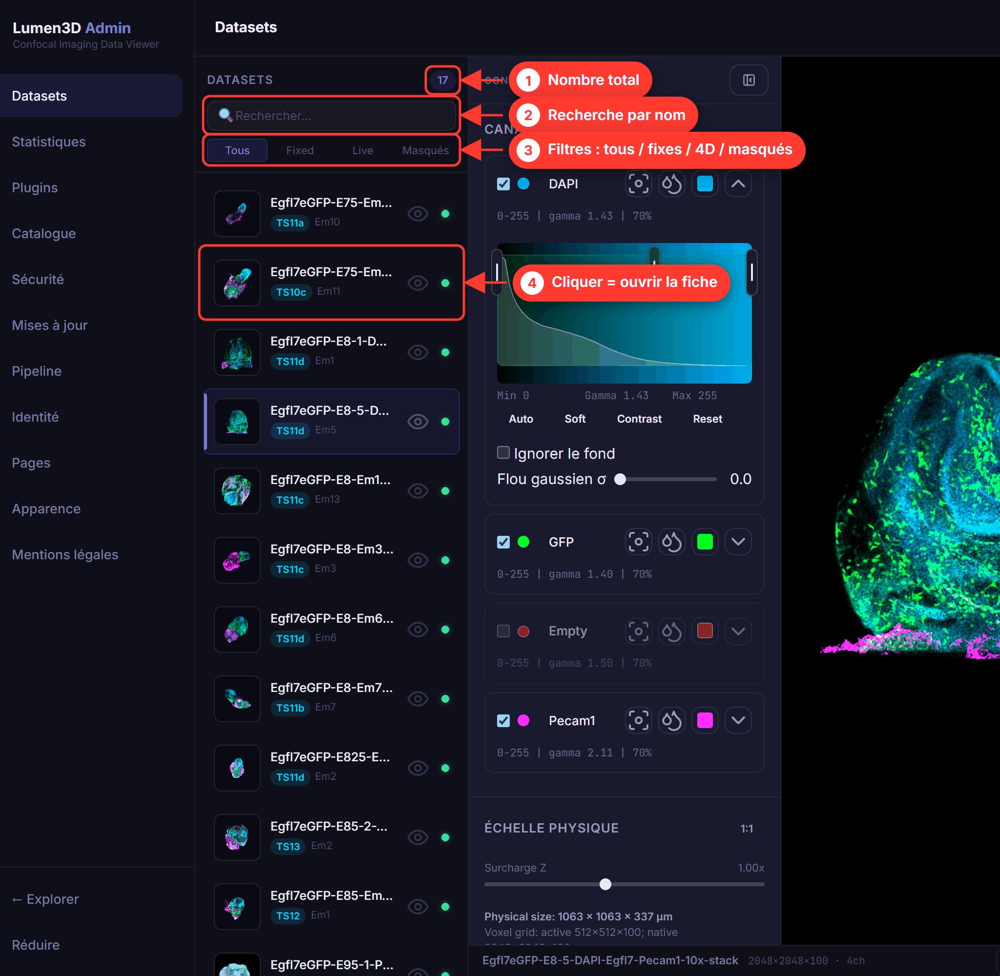

| | |
|---|---|
| **1** | Le nombre total de jeux de données présents sur le serveur. |
| **2** | **Recherche** — tapez un morceau de nom, la liste se filtre en direct. |
| **3** | **Filtres** — `Tous`, `Fixed` (volumes figés), `Live` (séries temporelles 4D), `Masqués` (ceux qui ne sont pas publics). |
| **4** | **Cliquez sur une vignette** pour ouvrir sa fiche. |

Sur chaque ligne, à droite du nom :

- **l'œil** indique si le jeu de données est visible du public ;
- **la pastille verte** signifie que ses fichiers sont complets et lisibles.

## 3.2. La colonne du milieu : l'aperçu

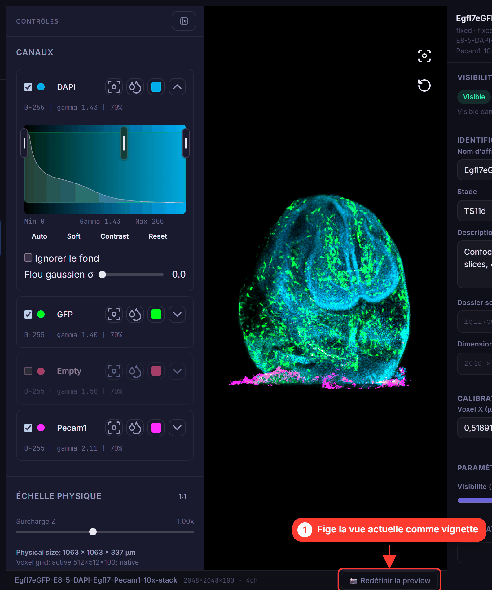

Ce n'est pas une image fixe : c'est **le vrai visualiseur 3D**, chargé dans le panneau. Vous pouvez faire tourner le volume, changer les couleurs des canaux, régler le contraste — exactement comme un visiteur.

> ⚠️ **Les réglages faits dans cet aperçu ne sont pas enregistrés.** C'est un bac à sable : il sert à vérifier à quoi ressemble le jeu de données. Les seuls réglages conservés sont ceux de la colonne de droite.

Le bouton **📸 Redéfinir la preview** (en bas à droite) fait une exception utile : il **fige la vue actuelle** et l'utilise comme vignette du jeu de données dans l'explorateur public. Orientez le volume comme vous voulez qu'il apparaisse, puis cliquez.

Le chargement d'un gros volume prend quelques secondes — c'est normal, les données font plusieurs gigaoctets et sont téléchargées morceau par morceau.

## 3.3. La colonne de droite : les réglages

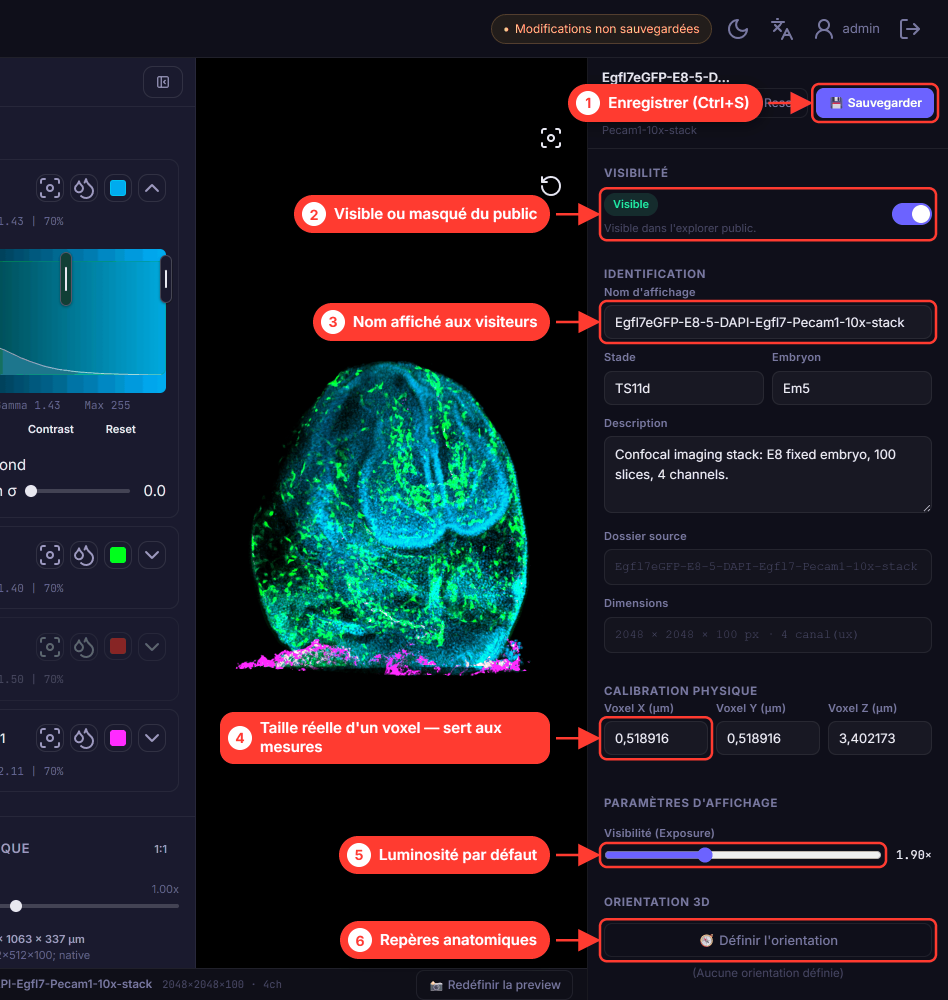

| | |
|---|---|
| **1** | **Sauvegarder** — enregistre. Raccourci : **Ctrl + S**. Le bouton **↺ Reset** annule vos changements non enregistrés. |
| **2** | **Visibilité** — l'interrupteur décide si le jeu de données apparaît dans l'explorateur public. |
| **3** | **Nom d'affichage** — le nom que verront les visiteurs. |
| **4** | **Calibration physique** — la taille réelle d'un voxel en micromètres. |
| **5** | **Visibilité (Exposure)** — la luminosité par défaut à l'ouverture. |
| **6** | **Orientation 3D** — voir §3.4. |

### Le détail de chaque champ

**Visibilité**
L'interrupteur en haut. `Visible` = tout le monde y a accès depuis l'explorateur. Masqué = il reste sur le serveur, reste accessible si on connaît son adresse exacte, mais n'apparaît plus dans les listes. Utile pour un jeu de données en cours de vérification, ou lié à un article pas encore publié.

**Identification**
- **Nom d'affichage** — remplacez le nom technique du dossier par quelque chose de lisible. C'est ce nom qui apparaît partout sur le site public.
- **Stade** et **Embryon** — les deux étiquettes qui servent à filtrer dans l'explorateur. Elles sont pré-remplies automatiquement à partir du nom du dossier ; corrigez-les si la détection s'est trompée.
- **Description** — texte libre affiché sur la fiche publique. Indiquez ce qui aide un collègue : marquages utilisés, conditions, particularités.
- **Dossier source** et **Dimensions** — en gris, **non modifiables**. Ce sont des informations lues dans les fichiers.

**Calibration physique — ⚠️ le champ le plus important**
Les trois valeurs `Voxel X / Y / Z` donnent la taille réelle d'un point de l'image, en micromètres. **Toutes les mesures faites par les visiteurs en dépendent** : l'outil de mesure de distance, la barre d'échelle, les dimensions affichées.

Ces valeurs sont lues automatiquement dans le fichier du microscope et sont normalement justes. **Ne les modifiez que si vous avez une raison précise de croire qu'elles sont fausses** — une valeur erronée rend fausses toutes les mesures publiées à partir de ce jeu de données, sans aucun avertissement.

Notez que `Voxel Z` est souvent bien plus grand que X et Y (par exemple `0,52 / 0,52 / 3,40`) : c'est normal, l'espacement entre deux coupes est plus grand que la résolution dans le plan.

**Paramètres d'affichage**
Le curseur **Visibilité (Exposure)** règle la luminosité à l'ouverture. Si un jeu de données paraît trop sombre au premier coup d'œil, montez-le. Les visiteurs peuvent toujours l'ajuster ensuite de leur côté.

## 3.4. Définir l'orientation anatomique

Le bouton **🧭 Définir l'orientation** sert à indiquer où se trouvent l'avant, le haut et la droite du spécimen. Une fois défini, les visiteurs voient un repère à trois axes dans le visualiseur.

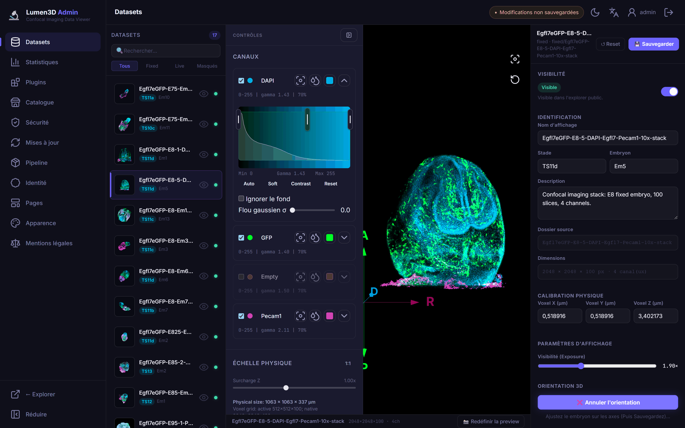

Trois axes colorés apparaissent sur le volume :

| Axe | Couleur | Signification |
|---|---|---|
| **A / P** | vert | Antérieur ↔ Postérieur (avant / arrière) |
| **D / V** | bleu | Dorsal ↔ Ventral (dos / ventre) |
| **L / R** | rouge | Gauche ↔ Droite |

**Comment faire :**

1. cliquez sur **🧭 Définir l'orientation** ;
2. faites tourner le volume dans l'aperçu jusqu'à ce que le spécimen soit correctement aligné sur les axes affichés ;
3. cliquez sur **💾 Sauvegarder** en haut de la colonne de droite.

Le bouton devient **✕ Annuler l'orientation** pendant l'opération : il permet de sortir sans rien changer.

## 3.5. Quand aucun jeu de données n'est sélectionné

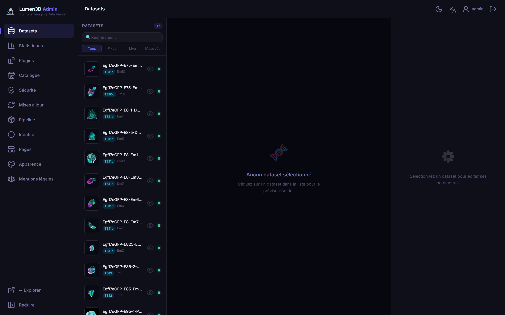

C'est l'écran d'accueil de l'onglet. Cliquez simplement sur une vignette à gauche.

---

# 4. Statistiques — qui consulte quoi

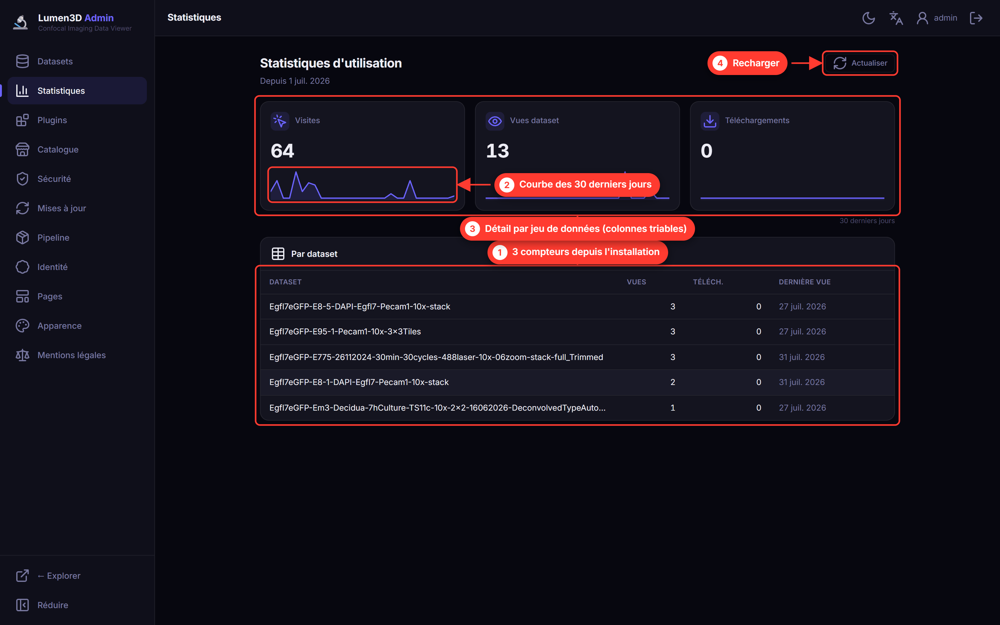

| | |
|---|---|
| **1** | Trois compteurs cumulés depuis l'installation. |
| **2** | La petite courbe montre les **30 derniers jours**. |
| **3** | Le détail **par jeu de données**. Cliquez sur un en-tête de colonne pour trier. |
| **4** | **Actualiser** — recharge les chiffres. |

**Ce que comptent les trois compteurs :**

- **Visites** — nombre d'ouvertures d'une page du site.
- **Vues dataset** — nombre de fois qu'un jeu de données a été ouvert dans le visualiseur. C'est l'indicateur le plus parlant.
- **Téléchargements** — nombre de fichiers récupérés depuis le centre de téléchargement.

Le tableau du bas indique, pour chaque jeu de données, le nombre de vues, de téléchargements et la date de dernière consultation.

> 🔒 **Aucune donnée personnelle n'est collectée.** Ce sont de simples compteurs. Il n'y a ni cookie de suivi, ni adresse IP enregistrée, ni service externe (pas de Google Analytics). Rien ne sort du serveur.

---

# 5. Plugins — les fonctions du visualiseur

C'est le chapitre le plus technique, mais aussi celui qui donne le plus de contrôle. Prenez le temps de lire §5.1 : le reste en découle.

## 5.1. Qu'est-ce qu'un plugin, ici ?

Le visualiseur 3D est volontairement construit comme un **noyau minimal + des modules**. Presque tout ce qu'un visiteur peut faire — mesurer une distance, prendre une capture d'écran, régler l'histogramme d'un canal, choisir un mode de rendu — est fourni par un **plugin**, c'est-à-dire un petit module indépendant.

L'intérêt : vous pouvez **retirer ce qui ne sert pas** à votre laboratoire, et **ajouter** de nouvelles fonctions plus tard sans toucher au reste du site.

Chaque plugin occupe l'un des **trois emplacements** possibles :

| Emplacement | Où ça apparaît pour le visiteur | Exemples |
|---|---|---|
| **Outils** (barre d'outils) | Les boutons en haut du visualiseur | Mesure de distance, capture d'écran, mode présentation, centre de téléchargement |
| **Canaux** (par canal) | Les réglages sous chaque canal de fluorescence, dans la barre latérale | Histogramme, flou gaussien |
| **Modes de rendu** (shaders) | Le menu déroulant qui choisit comment le volume est dessiné | Fluorescence, Structure (DVR) |

## 5.2. L'écran

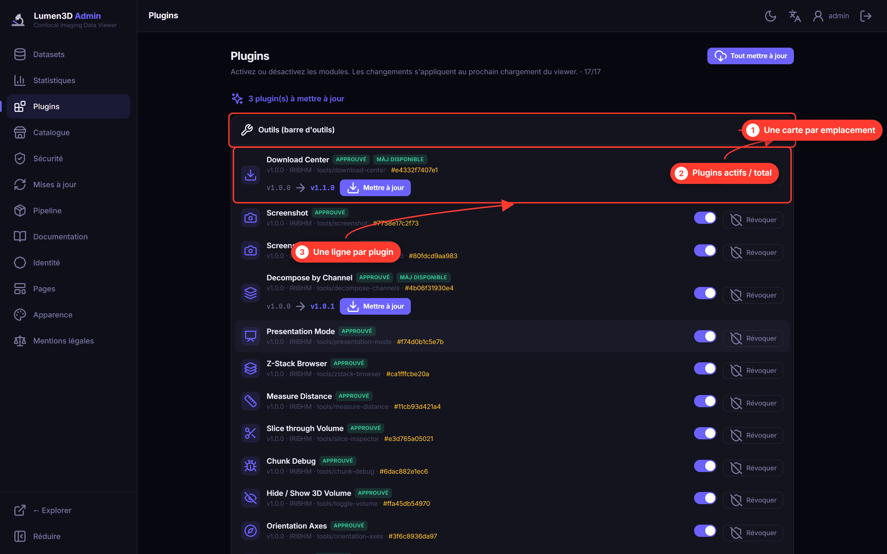

| | |
|---|---|
| **1** | Une carte par emplacement. |
| **2** | Le compteur `actifs / total` de cette catégorie. |
| **3** | Le nom du plugin, suivi de son **niveau de confiance**. |
| **4** | Version · auteur · dossier · **empreinte** du code. |
| **5** | L'interrupteur qui active ou désactive le plugin. |

Zoom sur une ligne :

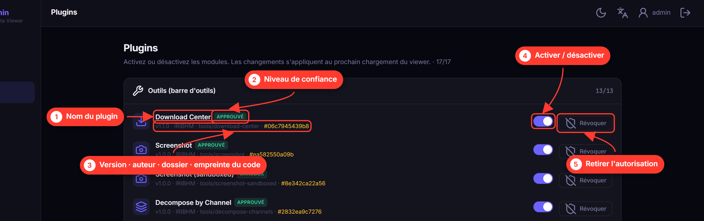

## 5.3. Activer ou désactiver un plugin

Basculez simplement l'interrupteur. Le changement est enregistré immédiatement (un petit message de confirmation apparaît en bas) et prend effet **au prochain chargement du visualiseur** — demandez à un visiteur de recharger sa page, ou rechargez l'aperçu de l'onglet Datasets.

Désactiver un plugin ne le supprime pas : il reste sur le serveur et vous pouvez le réactiver à tout moment.

> 🔒 **Une seule protection existe : il doit toujours rester au moins un mode de rendu actif.** Si vous essayez de désactiver le dernier, le panneau refuse et affiche « Au moins un mode de rendu doit rester actif ». Sans mode de rendu, le visualiseur n'aurait plus rien pour dessiner le volume.

## 5.4. Les niveaux de confiance — pourquoi ils existent

C'est le point important de ce chapitre.

Un plugin est du **vrai code informatique qui s'exécute dans le navigateur des visiteurs**. Un plugin malveillant pourrait afficher n'importe quoi, ou détourner ce que fait la page. La plateforme part donc du principe inverse de l'habitude : **par défaut, un plugin n'a pas le droit de s'exécuter**. Il faut que vous, administrateur, l'autorisiez explicitement.

Chaque plugin porte donc une étiquette :

| Étiquette | Signification | Ce que ça implique |
|---|---|---|
| **`intégré`** | Livré avec la version officielle du site, et son code correspond exactement à celui qui a été publié | De confiance. Rien à faire. |
| **`approuvé`** | Vous l'avez autorisé à s'exécuter normalement dans la page | De confiance parce que **vous** l'avez décidé. |
| **`sandbox`** | Autorisé, mais **enfermé dans un bac à sable** : il tourne isolé, sans accès au reste de la page ni au panneau | Le mode le plus sûr. |
| **`dev`** | Machine de développement uniquement | N'apparaît pas sur un site en production. |
| **`non fiable`** | **Refusé.** Le plugin n'est pas chargé du tout | Voir §5.5. |

**L'empreinte** (le code du type `#06c7945439b8` affiché sous chaque nom) est une signature du contenu exact des fichiers. Votre autorisation est **liée à cette empreinte précise**. Si quelqu'un modifie ne serait-ce qu'un caractère du plugin, l'empreinte change, l'autorisation devient caduque et le plugin repasse automatiquement en **non fiable**. C'est ce qui empêche qu'un plugin approuvé soit remplacé en douce par autre chose.

## 5.5. Approuver un plugin non fiable

Vous verrez ce cas si quelqu'un dépose un plugin directement sur le serveur (par FTP par exemple) au lieu de passer par le Catalogue.

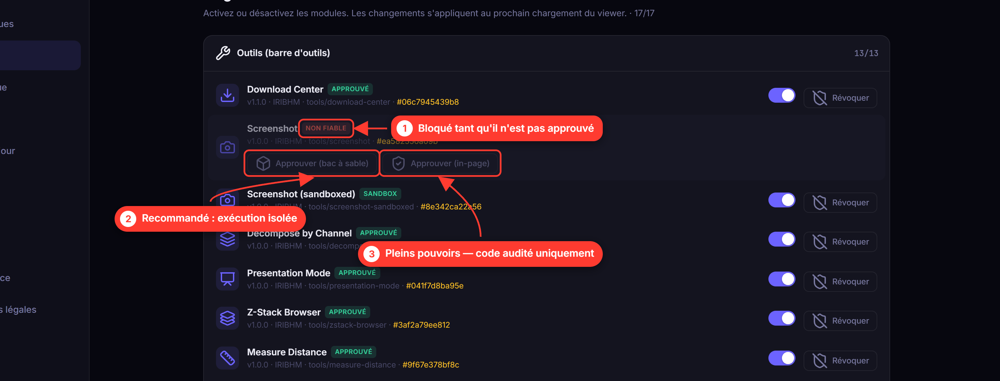

| | |
|---|---|
| **1** | L'étiquette rouge **NON FIABLE**. Tant qu'elle est là, le plugin n'est **pas** chargé — il est comme absent pour les visiteurs. |
| **2** | **Approuver (bac à sable)** — le plugin tourne isolé. **C'est le choix recommandé.** |
| **3** | **Approuver (in-page)** — le plugin tourne avec les pleins pouvoirs de la page. |

**La procédure, étape par étape :**

1. cliquez sur l'un des deux boutons ;
2. une fenêtre récapitule ce que vous approuvez et affiche **l'empreinte** du code ;
3. le panneau vous demande de **retaper votre mot de passe administrateur** ;
4. le plugin devient actif au prochain chargement du visualiseur.

> ❓ **Pourquoi redemander le mot de passe ?**
> Parce qu'approuver un plugin est la seule action qui autorise du code extérieur à s'exécuter. Même si quelqu'un s'asseyait devant votre écran alors que vous êtes connecté, il ne pourrait pas approuver un plugin sans connaître aussi votre mot de passe.

> ⚠️ **Quand choisir « in-page » plutôt que « bac à sable » ?**
> Presque jamais, sauf si vous avez lu le code vous-même ou s'il vient d'une personne de confiance de votre équipe. Notez que les plugins de type **canal** et **mode de rendu** ne peuvent techniquement pas être mis en bac à sable : ils doivent dialoguer directement avec la carte graphique. Le niveau d'exigence est donc plus élevé pour eux.

**Retirer une autorisation :** le bouton **Révoquer** sur la ligne du plugin. Il redevient immédiatement non fiable et cesse d'être chargé.

## 5.6. Les plugins livrés d'origine

| Plugin | Emplacement | Ce que ça fait pour le visiteur |
|---|---|---|
| **Fluorescence** | Rendu | Le rendu par défaut : chaque canal émet sa couleur, comme sur un microscope à fluorescence |
| **Structure (DVR)** | Rendu | Un rendu volumique avec profondeur et ombrage, qui fait mieux ressortir les formes |
| **Histogram Controls** | Canal | L'histogramme d'intensité + les curseurs min / max / gamma |
| **Gaussian Filter** | Canal | Un curseur de flou pour lisser le bruit d'un canal |
| **Measure Distance** | Outil | Cliquer deux points sur le volume pour obtenir la distance réelle en µm |
| **Slice through Volume** | Outil | Une coupe plane, orientable librement, à travers le volume |
| **Z-Stack Browser** | Outil | Parcourir les coupes une par une, comme une pile d'images |
| **Decompose by Channel** | Outil | Afficher les canaux côte à côte plutôt que superposés |
| **Download Center** | Outil | Récupérer les fichiers, mesures, métadonnées et exports du jeu de données |
| **Screenshot** | Outil | Capturer la vue 3D en image PNG |
| **Presentation Mode** | Outil | Plein écran sans interface, pour projeter |
| **Orientation Axes** | Outil | Le repère anatomique A/P · D/V · L/R (voir §3.4) |
| **Toggle Grid / Axes / Volume** | Outils | Afficher ou masquer la grille, les axes, le volume |
| **Chunk Debug** | Outil | Outil de diagnostic technique. **Peut être désactivé sans risque** sur un site en production |

---

# 6. Catalogue — installer de nouveaux plugins

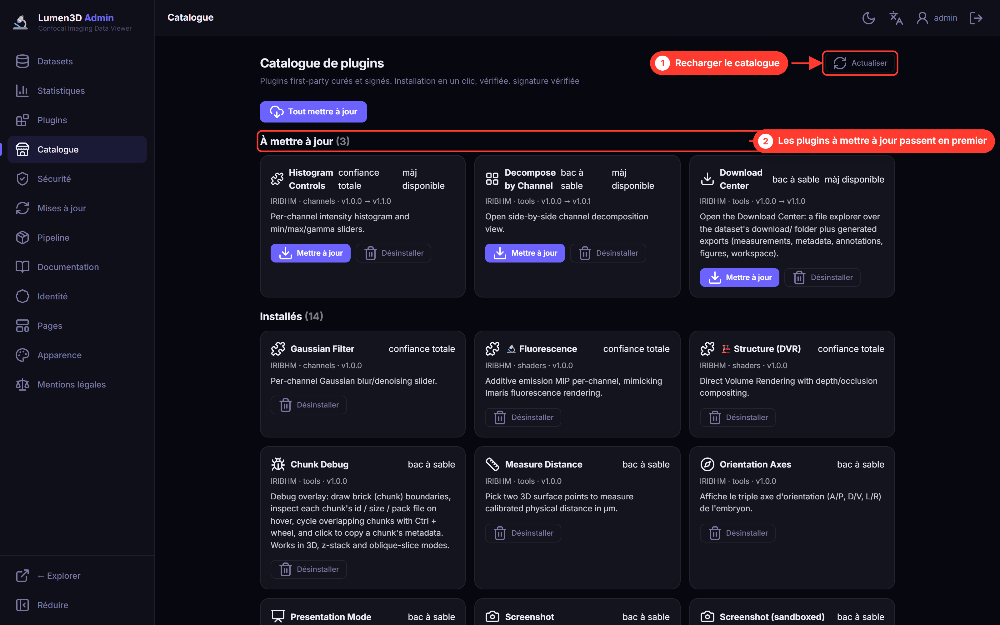

Le Catalogue fonctionne comme un magasin d'applications : il liste les plugins officiels disponibles, et vous les installez d'un clic.

Les plugins sont répartis en trois sections : **Installés**, **Disponibles**, et éventuellement **Incompatibles**.

## 6.1. Installer un plugin

1. trouvez la carte du plugin dans **Disponibles** ;
2. cliquez sur **⬇ Installer** ;
3. **retapez votre mot de passe** administrateur ;
4. le plugin est téléchargé, vérifié, installé et **automatiquement approuvé** — vous n'avez rien à faire dans l'onglet Plugins.

Pendant l'installation, le serveur contrôle que le fichier téléchargé correspond bien, au bit près, à ce que le catalogue annonce. Si le moindre écart est détecté, **l'installation est annulée** plutôt que d'installer quelque chose de douteux.

La mention **« signature vérifiée »** en haut de page confirme que le catalogue lui-même est authentique.

## 6.2. Désinstaller

Le bouton **🗑 Désinstaller** sur la carte du plugin, puis confirmation. Les fichiers sont retirés du serveur. Vous pouvez toujours réinstaller ensuite depuis le Catalogue.

Un refus est possible dans un seul cas : si c'est le **dernier mode de rendu** installé (même raison qu'en §5.3).

## 6.3. Les étiquettes des cartes

| Étiquette | Signification |
|---|---|
| **`bac à sable`** | Ce plugin s'exécutera isolé. C'est le cas des plugins de la barre d'outils. |
| **`confiance totale`** | Ce plugin s'exécutera avec les pleins droits de la page. Inévitable pour les modes de rendu et les réglages de canaux, qui pilotent directement la carte graphique. |
| **`incompatible`** | Ce plugin demande une version du site plus récente (ou plus ancienne) que la vôtre. Le bouton d'installation est grisé. Faites une mise à jour (voir §8) et il redeviendra installable. |

---

# 7. Sécurité — mot de passe et permissions

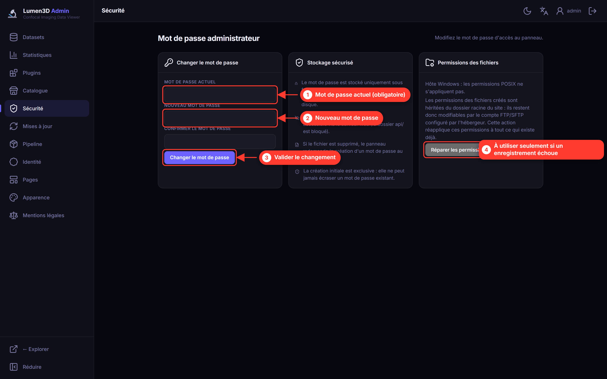

| | |
|---|---|
| **1** | Votre mot de passe **actuel** — obligatoire. |
| **2** | Le nouveau mot de passe, à saisir deux fois. |
| **3** | Valider. |
| **4** | **Réparer les permissions** — à n'utiliser qu'en cas de problème (§7.3). |

## 7.1. Changer le mot de passe

Remplissez les trois champs et cliquez sur **Changer le mot de passe**. Il faut connaître l'ancien : cela empêche quelqu'un qui trouverait votre session ouverte de vous verrouiller dehors.

Vous **restez connecté** après le changement. Vos autres sessions, elles, ne sont pas fermées automatiquement.

> 💡 **Conseil pour choisir un mot de passe.** Le panneau accepte techniquement 4 caractères, mais visez plutôt **12 caractères ou plus**. Une phrase facile à retenir vaut mieux qu'un mot compliqué : `microscope-embryon-2026` est nettement plus solide que `M1cr0!`.

## 7.2. Comment le mot de passe est stocké

La carte **Stockage sécurisé** résume les garanties, qui méritent d'être comprises :

- **Le mot de passe n'est jamais écrit en clair.** Le serveur n'en garde qu'une empreinte irréversible (procédé standard : PBKDF2 avec sel). Depuis cette empreinte, on ne peut pas remonter au mot de passe.
- **Le fichier d'identifiants n'est jamais servi par le site.** Même en tapant son adresse exacte dans un navigateur, on obtient une erreur.
- **Si le fichier est supprimé**, le panneau repropose la création d'un mot de passe au prochain accès. C'est la porte de secours en cas d'oubli (voir [Annexe B](#annexe-b--en-cas-de-problème)).
- **La création initiale ne peut jamais écraser un mot de passe existant.** Personne ne peut « réinstaller » le site par-dessus pour vous en déloger.

## 7.3. Réparer les permissions

Cette carte n'est utile que sur certains hébergements mutualisés, où le site tourne sous un compte système différent de celui du FTP. Résultat : des fichiers créés par le site deviennent illisibles ou non modifiables.

**Symptôme :** un enregistrement échoue sans raison apparente dans un autre onglet.

Dans ce cas seulement, cliquez sur **Réparer les permissions**. L'opération est sans danger et réapplique les droits d'accès corrects à l'ensemble des fichiers. Un message indique le nombre d'entrées corrigées.

Sur un serveur Windows, la carte affiche simplement que les permissions POSIX ne s'appliquent pas — c'est normal, il n'y a rien à faire.

---

# 8. Mises à jour — faire évoluer le site

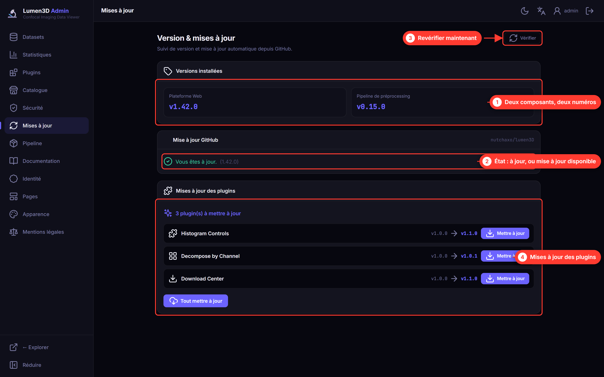

| | |
|---|---|
| **1** | La version installée de la plateforme. |
| **2** | L'état : *à jour*, ou *mise à jour disponible*. |
| **3** | **Vérifier** — refait la recherche immédiatement. |

Trois numéros de version sont affichés — c'est normal, ce sont trois composants indépendants :

- **Plateforme Web** — le site lui-même. **C'est celui qui compte.**
- **Serveur de dev** — l'outil de développement local.
- **Préprocessing** — l'outil de préparation des données (voir §9).

## 8.1. Lancer une mise à jour

Quand une nouvelle version existe, les **notes de version** s'affichent : lisez-les, elles décrivent ce qui change.

1. cliquez sur **⬇ Mettre à jour maintenant** ;
2. **un rapport de vérification apparaît** — c'est une étape importante, détaillée ci-dessous ;
3. cliquez sur **✓ Confirmer la mise à jour** ;
4. laissez faire : une barre d'étapes défile.

**Le rapport de vérification** indique, avant que quoi que ce soit ne soit installé :

- combien de plugins resteront compatibles ;
- lesquels seront **mis en quarantaine** parce qu'ils ne fonctionnent pas encore avec la nouvelle version. Ils ne sont pas supprimés : ils se réactiveront tout seuls dès qu'une mise à jour les rendra compatibles ;
- si quelque chose **bloque** la mise à jour, auquel cas le bouton de confirmation n'apparaît pas.

**Les étapes qui défilent ensuite :** Vérifications → Sauvegarde → Téléchargement → Intégrité → Préparation → Contrôle de démarrage → Plan de basculement → Basculement → Redémarrage du serveur.

Le serveur redémarre à la fin : **vous devrez vous reconnecter.** C'est normal.

## 8.2. Les garde-fous

La mise à jour est conçue pour qu'une panne ne puisse pas casser le site :

- **Une sauvegarde complète est faite avant tout.**
- **Le fichier téléchargé est vérifié** (empreinte + signature électronique de l'auteur) avant d'être utilisé. Un fichier altéré est rejeté.
- **La nouvelle version est testée avant d'être mise en service.** Si elle ne démarre pas, **le site revient automatiquement à l'ancienne version.** Vous verrez alors le message « restauration automatique effectuée » — le site fonctionne toujours, il n'y a rien à réparer.
- **Vos données sont préservées :** les jeux de données (`DATA_WEB`), vos identifiants, vos statistiques, vos réglages d'Identité, de Pages et d'Apparence ne sont jamais touchés par une mise à jour.

## 8.3. Messages possibles

| Message | Ce que ça veut dire |
|---|---|
| **Vous êtes à jour** | Rien à faire. |
| **Limite de l'API GitHub atteinte** | Trop de vérifications en peu de temps. Réessayez dans quelques minutes. Sans gravité. |
| **Impossible de contacter GitHub** | Problème de réseau côté serveur. Réessayez plus tard. |
| **Aucune release publiée** | Aucune version n'est encore publiée publiquement. |
| **Le magasin de certificats est inutilisable** | Configuration de l'hébergeur. À signaler à la personne qui gère le serveur. |

---

# 9. Pipeline — préparer de nouvelles données

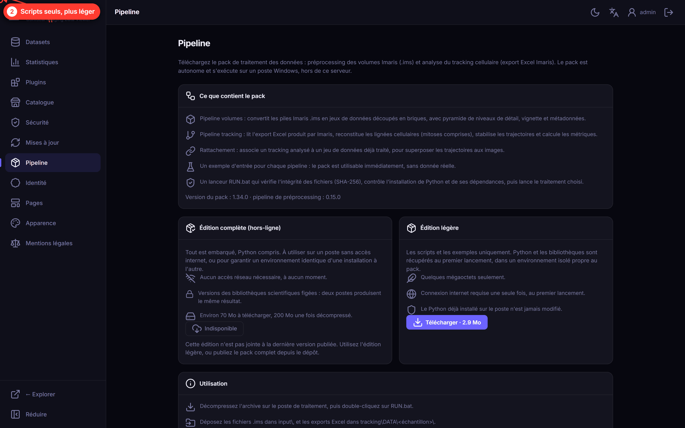

Cet onglet ne traite **rien** sur le serveur. Il vous fait **télécharger un outil** que vous exécuterez sur un ordinateur puissant, typiquement le poste d'analyse du laboratoire.

**Pourquoi séparer ?** Convertir un volume de microscopie demande énormément de mémoire vive — comptez environ **32 Go de RAM** pour un volume de 3789 × 3789 × 178. Aucun serveur web mutualisé ne peut faire ça.

## 9.1. Ce que contient le pack

- **Pipeline volumes** — convertit les piles Imaris `.ims` en jeux de données découpés en briques, avec pyramide de niveaux de détail, vignette et métadonnées.
- **Pipeline tracking** — lit l'export Excel produit par Imaris, reconstitue les lignées cellulaires (mitoses comprises), stabilise les trajectoires et calcule les métriques.
- **Rattachement** — associe un tracking analysé à un jeu de données déjà traité, pour superposer les trajectoires aux images.
- **Un exemple d'entrée pour chaque pipeline** — le pack est utilisable immédiatement, sans donnée réelle, pour se faire la main.
- **Un lanceur `RUN.bat`** qui vérifie l'intégrité des fichiers, contrôle l'installation de Python et lance le traitement choisi.

## 9.2. Quelle édition choisir

| | **Édition complète** | **Édition légère** |
|---|---|---|
| Taille | ~70 Mo (200 Mo décompressé) | quelques Mo |
| Internet | **Jamais nécessaire** | Requis **une seule fois**, au premier lancement |
| Python | Embarqué, versions figées | Récupéré au premier lancement, dans un environnement isolé |
| Pour qui | Poste hors ligne, ou pour garantir des résultats identiques d'une installation à l'autre | Poste connecté, usage courant |

L'édition légère ne modifie **jamais** le Python déjà installé sur le poste : elle travaille dans son propre coin.

## 9.3. Comment s'en servir

1. décompressez l'archive sur le poste de traitement ;
2. double-cliquez sur **`RUN.bat`** ;
3. déposez les fichiers `.ims` dans `input\`, et les exports Excel dans `tracking\DATA\<échantillon>\` ;
4. ⚠️ **le nom du fichier Excel doit contenir l'intervalle entre images** (par exemple `30min`) — l'analyse y lit sa base de temps ;
5. copiez le dossier produit dans le `DATA_WEB\` du serveur ;
6. il apparaît aussitôt dans l'onglet Datasets.

---

# 10. Identité — le nom et le vocabulaire du site

Cet onglet permet de renommer entièrement le site, sans toucher au code. C'est ce qui permet à la même plateforme de servir un laboratoire d'embryologie ou un institut de neurosciences.

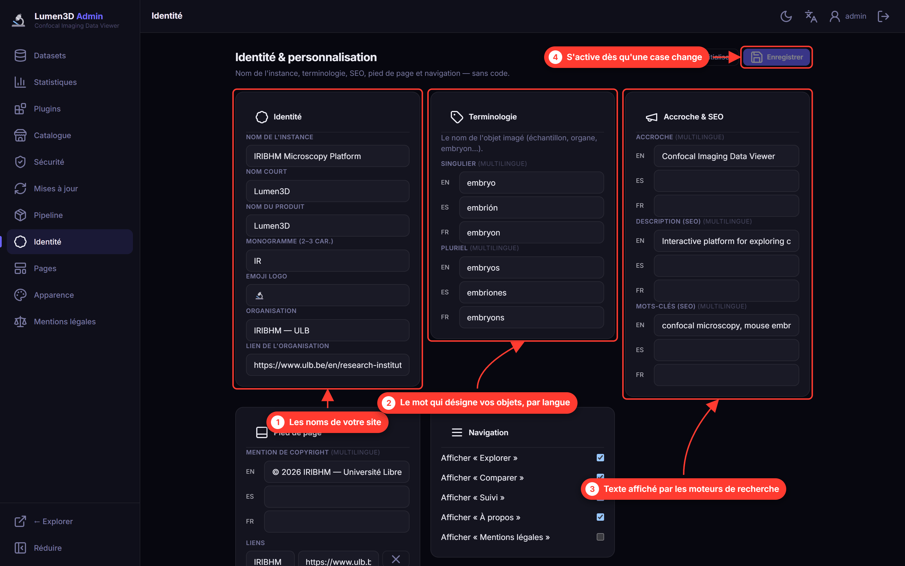

| | |
|---|---|
| **1** | Les noms de votre site. |
| **2** | Le mot qui désigne vos objets d'étude, **par langue**. |
| **3** | Le texte affiché par les moteurs de recherche. |
| **4** | **Enregistrer** — s'active dès qu'un champ change. |

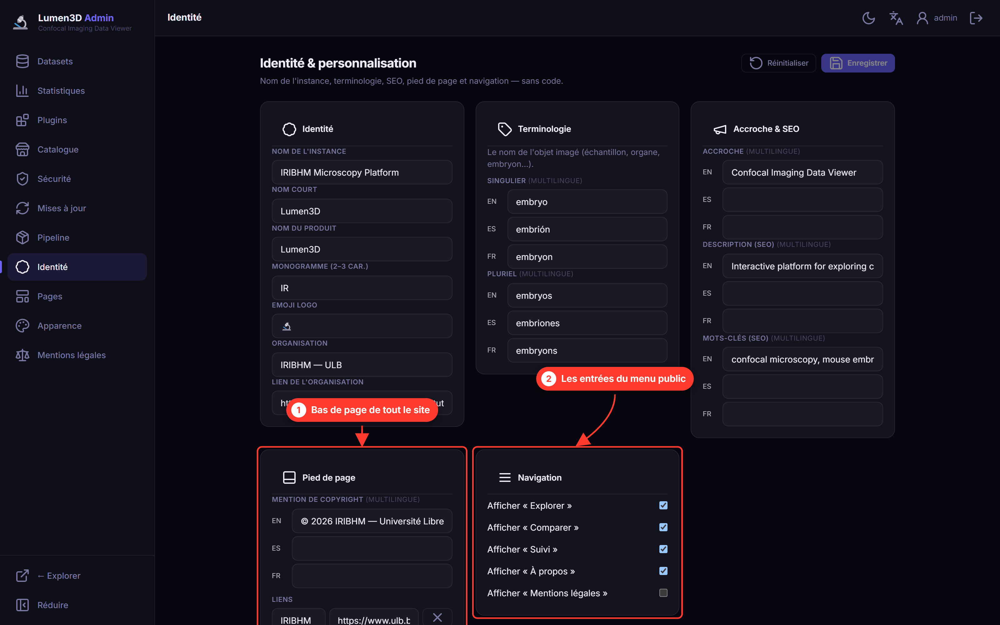

## 10.1. Les champs multilingues

Les champs marqués **(MULTILINGUE)** affichent une ligne par langue : `EN`, `ES`, `FR`.

**Remplissez toujours `EN` au minimum.** C'est la version de secours : si un visiteur consulte le site en espagnol et que le champ `ES` est vide, c'est le texte anglais qui s'affiche — jamais un blanc.

## 10.2. Carte « Identité »

| Champ | À quoi ça sert | Exemple |
|---|---|---|
| **Nom de l'instance** | Le nom complet, utilisé dans les titres de page | `IRIBHM Microscopy Platform` |
| **Nom court** | Utilisé là où la place manque | `Lumen3D` |
| **Nom du produit** | Le nom du logiciel dans les textes | `Lumen3D` |
| **Monogramme** | 2–3 lettres pour la pastille du logo | `IR` |
| **Emoji logo** | L'emoji affiché à côté du nom | 🔬 |
| **Organisation** | Votre laboratoire ou institution | `IRIBHM — ULB` |
| **Lien de l'organisation** | L'adresse de son site | `https://…` |

## 10.3. Carte « Terminologie » — la plus utile

C'est ici que le site s'adapte à votre domaine. Vous définissez **le mot qui désigne ce que vous imagez**, au singulier et au pluriel, dans chaque langue.

Ce mot est ensuite **repris automatiquement dans toute l'interface publique** : titres, filtres, statistiques, descriptions. Si vous écrivez `embryon / embryons`, le site parlera d'embryons. Si vous écrivez `échantillon / échantillons`, il parlera d'échantillons — partout, sans autre modification.

## 10.4. Carte « Accroche & SEO »

- **Accroche** — le sous-titre affiché sous le nom du site.
- **Description (SEO)** — le résumé qu'affichent Google et les réseaux sociaux. Deux phrases claires suffisent.
- **Mots-clés (SEO)** — quelques termes séparés par des virgules.

## 10.5. Carte « Pied de page »

- **Mention de copyright** — le texte en bas de chaque page.
- **Liens** — les liens du pied de page. **+ Ajouter un lien** pour en créer un (libellé + adresse), la croix pour en retirer un.

## 10.6. Carte « Navigation »

Les cases décident quelles entrées apparaissent dans le menu du site public : *Explorer*, *Comparer*, *Suivi*, *À propos*, *Mentions légales*.

Décocher une entrée la retire du menu sans supprimer la page.

> ⚠️ **Attention à « Mentions légales ».** Cette case est décochée par défaut. Si vous rédigez vos mentions légales (§13), pensez à revenir ici pour les rendre accessibles.

---

# 11. Pages — l'éditeur visuel

C'est la fonction la plus riche du panneau. Elle permet de **modifier le contenu des pages du site comme dans un logiciel de mise en page**, sans écrire une ligne de code.

## 11.1. Choisir une page

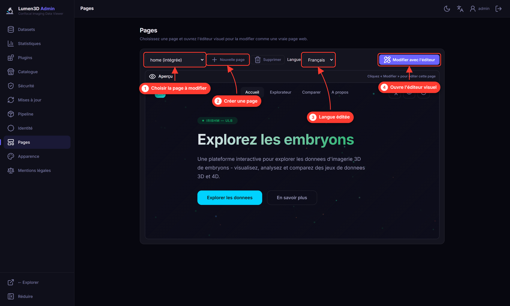

| | |
|---|---|
| **1** | La page à modifier. |
| **2** | **Nouvelle page** — crée une page supplémentaire. |
| **3** | La **langue** que vous éditez. |
| **4** | **Modifier avec l'éditeur** — ouvre l'éditeur visuel. |

Le bouton **🗑 Supprimer** efface une page que vous avez créée. Il reste grisé sur `home` et `about` : ces deux pages ne peuvent pas être supprimées, seulement remises à leur modèle d'origine depuis l'éditeur.

Deux pages existent d'origine : **`home`** (l'accueil) et **`about`** (À propos). La mention *(intégrée)* signifie qu'elles utilisent encore le modèle fourni : dès votre première publication, votre version prend le relais.

## 11.2. L'éditeur

L'éditeur s'ouvre **dans son propre onglet de navigateur** pour disposer de tout l'écran.

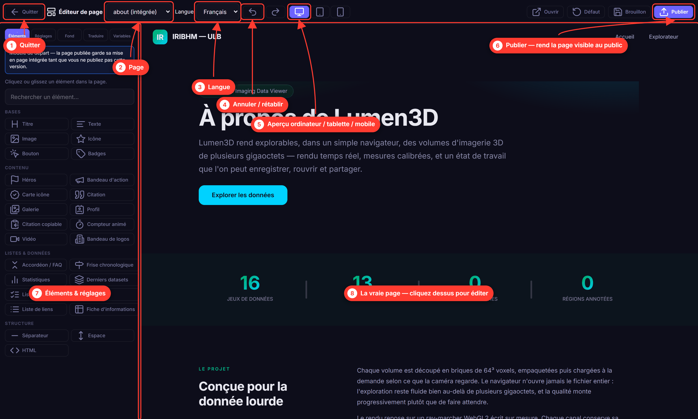

| | |
|---|---|
| **1** | **Quitter** — revient au panneau. |
| **2** | La page en cours d'édition. |
| **3** | La langue éditée. |
| **4** | **Annuler / Rétablir** (`Ctrl+Z` / `Ctrl+Y`). |
| **5** | Aperçu **ordinateur / tablette / mobile**. |
| **6** | **Publier** — rend la version visible au public. |
| **7** | La **barre latérale** : éléments à insérer, et réglages de ce qui est sélectionné. |
| **8** | **La vraie page.** Ce n'est pas une maquette : c'est votre page réelle, avec son vrai menu, son vrai pied de page et son vrai thème. Ce que vous voyez est exactement ce que verront les visiteurs. |

## 11.3. La barre du haut en détail

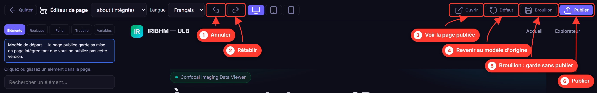

| | |
|---|---|
| **1 – 2** | **Annuler** et **Rétablir**. |
| **3** | **Ouvrir** — affiche la page publiée dans un nouvel onglet, pour comparer. |
| **4** | **Défaut** — revient au modèle d'origine. ⚠️ Efface votre mise en page. |
| **5** | **Brouillon** — enregistre sans publier. Vous pouvez fermer et reprendre plus tard. |
| **6** | **Publier** — met votre version en ligne. |

> 📌 **La différence à retenir : Brouillon ≠ Publier.**
> Tant que vous n'avez pas cliqué sur **Publier**, les visiteurs continuent de voir l'ancienne version. Vous pouvez donc travailler plusieurs jours en enregistrant des brouillons, sans rien casser.

## 11.4. Ajouter un élément

L'onglet **Éléments** de la barre latérale contient tout ce qui peut être posé dans une page.

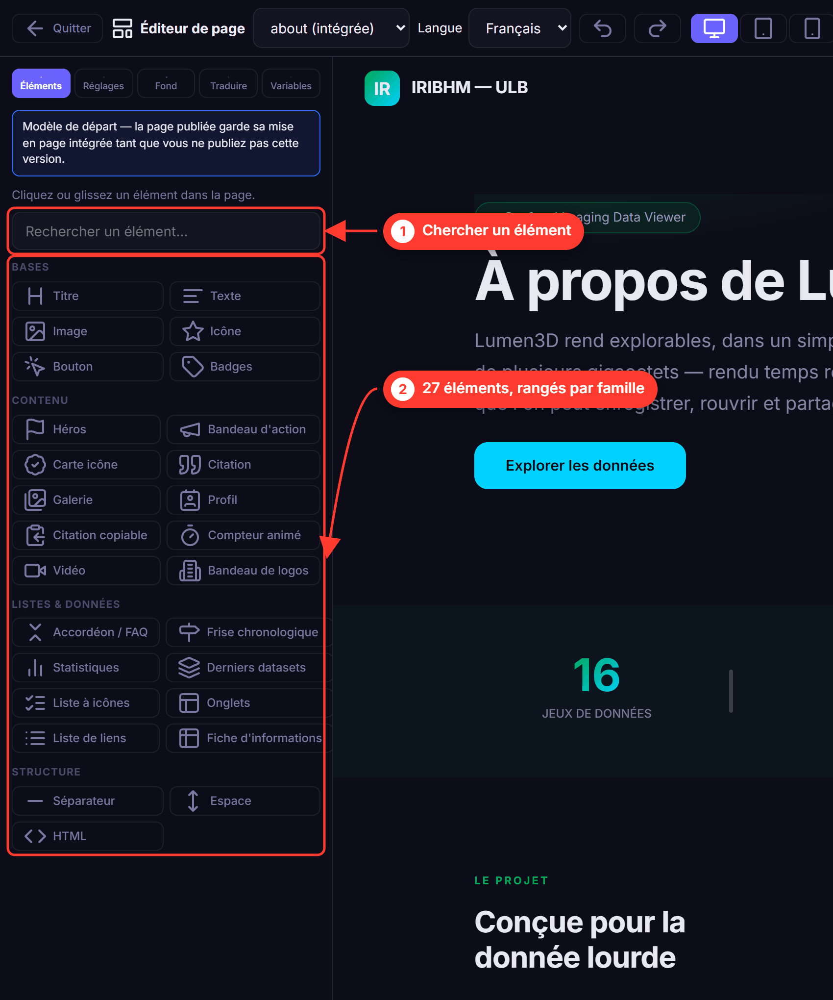

Deux façons de faire :

- **cliquer** sur un élément : il s'ajoute à la fin de la page ;
- **le faire glisser** à l'endroit voulu : des zones de dépôt apparaissent pendant le déplacement.

Le champ **Rechercher un élément** filtre la liste — pratique, il y en a 27.

### Les 27 éléments disponibles

**Bases** — les briques élémentaires

| Élément | Ce que c'est |
|---|---|
| **Titre** | Un titre de section |
| **Texte** | Un paragraphe |
| **Image** | Une image |
| **Icône** | Un pictogramme |
| **Bouton** | Un bouton cliquable |
| **Badges** | De petites étiquettes colorées |

**Contenu** — les blocs de présentation

| Élément | Ce que c'est |
|---|---|
| **Héros** | Le grand bandeau d'introduction en haut de page |
| **Bandeau d'action** | Un encart qui invite à cliquer |
| **Carte icône** | Une carte : icône + titre + texte |
| **Citation** | Une citation mise en valeur |
| **Galerie** | Plusieurs images en grille |
| **Profil** | Une fiche de personne (photo, nom, fonction) |
| **Citation copiable** | Une référence bibliographique avec bouton « copier » |
| **Compteur animé** | Un chiffre qui défile à l'affichage |
| **Vidéo** | Une vidéo intégrée |
| **Bandeau de logos** | Une rangée de logos partenaires |

**Listes & données**

| Élément | Ce que c'est |
|---|---|
| **Accordéon / FAQ** | Des questions qui se déplient |
| **Frise chronologique** | Une suite d'étapes datées |
| **Statistiques** | Une rangée de chiffres clés |
| **Derniers datasets** | **Se remplit tout seul** avec vos jeux de données récents |
| **Liste à icônes** | Une liste à puces illustrées |
| **Onglets** | Du contenu réparti en onglets |
| **Liste de liens** | Une liste de liens |
| **Fiche d'informations** | Un tableau libellé / valeur |

**Structure**

| Élément | Ce que c'est |
|---|---|
| **Séparateur** | Un trait horizontal |
| **Espace** | Un espace vide réglable |
| **HTML** | Du code HTML libre — **réservé aux utilisateurs avertis** |

> 💡 **Les éléments qui se remplissent seuls.** *Derniers datasets* et *Statistiques* peuvent puiser directement dans les données du site : nombre de jeux de données, de spécimens, de cellules suivies, de régions annotées. Le chiffre se met à jour tout seul quand vous ajoutez des données — vous n'aurez jamais à revenir corriger la page.

## 11.5. Modifier un élément existant

**Cliquez dessus dans la page.** Il se cerne de vert et la barre latérale bascule sur ses réglages.

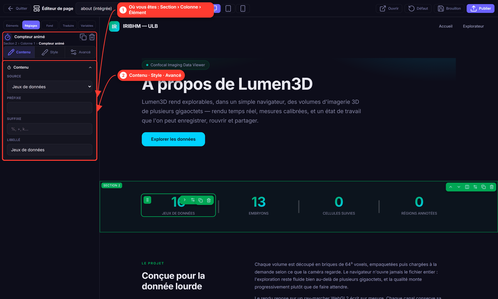

| | |
|---|---|
| **1** | Le **fil d'Ariane** : `Section 2 › Colonne 1 › Compteur animé`. Il vous dit exactement où vous êtes, et chaque niveau est cliquable. |
| **2** | Les trois onglets de réglages : **Contenu**, **Style**, **Avancé**. |

### La mini-barre d'outils

Chaque élément sélectionné affiche une petite barre verte :

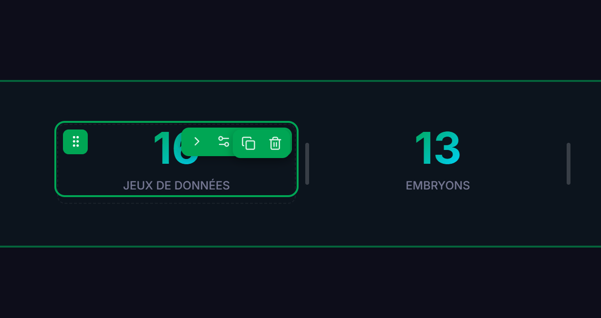

De gauche à droite :

| Icône | Action |
|---|---|
| **⠿** (points) | **Poignée de déplacement** — maintenez et glissez pour déplacer l'élément |
| **›** (chevron) | **Sélectionner le parent** — passe à la colonne, puis à la section |
| **⚙** (curseurs) | Ouvre les réglages |
| **⧉** (carrés) | **Dupliquer** |
| **🗑** (corbeille) | **Supprimer** |

La section qui contient l'élément affiche aussi sa propre barre en haut à droite : monter, descendre, **découper en colonnes**, réglages, dupliquer, supprimer.

### Les trois onglets de réglages

**Contenu** — ce qui est écrit : les textes, les images, les liens, la source des données. C'est l'onglet que vous utiliserez le plus.

**Style** — l'apparence : couleurs, tailles, espacements, alignement, arrondis.

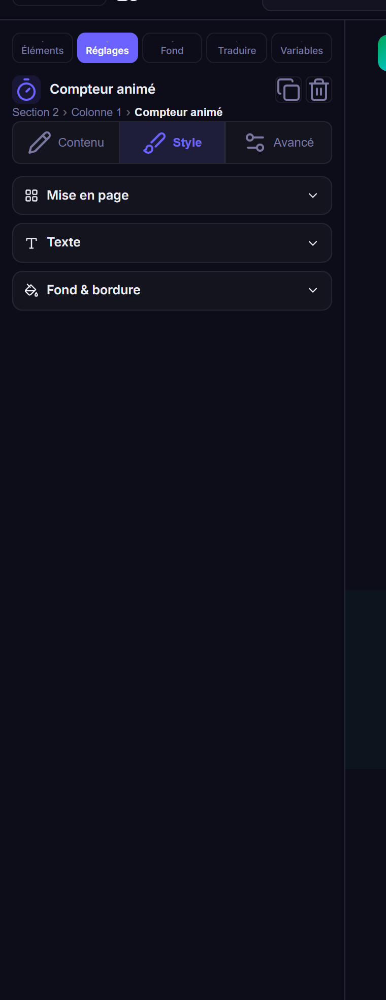

**Avancé** — les options fines : marges, comportement au survol, **visibilité selon l'appareil** (masquer un élément sur mobile, par exemple), CSS personnalisé.

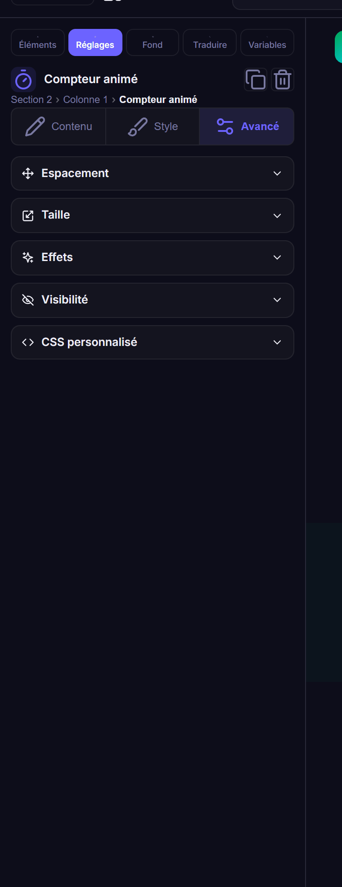

> 💡 **Modifier un texte encore plus vite :** double-cliquez directement sur le texte dans la page et tapez. **Entrée** valide, **Échap** annule.

### Les raccourcis clavier de l'éditeur

| Raccourci | Action |
|---|---|
| `Ctrl + Z` | Annuler |
| `Ctrl + Y` *(ou `Ctrl + Shift + Z`)* | Rétablir |
| `Ctrl + S` | Enregistrer un brouillon |
| `Ctrl + D` | Dupliquer l'élément sélectionné |
| `Ctrl + C` / `Ctrl + V` | Copier / coller un élément |
| `Suppr` *(ou `Retour arrière`)* | Supprimer l'élément sélectionné |
| `Échap` | Désélectionner |

*(Sur Mac, remplacez `Ctrl` par `Cmd`.)* Ces raccourcis sont désactivés pendant que vous tapez dans un champ de texte — vous pouvez donc écrire normalement.

## 11.6. Organiser la page : sections et colonnes

Une page est construite en trois niveaux :

```
Page
 └─ Section          (une bande horizontale, sur toute la largeur)
     └─ Colonne      (un découpage vertical de la section)
         └─ Élément  (un titre, une image, un bouton…)
```

Pour découper une section en colonnes, sélectionnez-la (cliquez sur sa zone, ou utilisez le chevron **›** depuis un élément) et utilisez l'icône de découpage dans sa barre d'outils. Six dispositions sont proposées :

| | Disposition |
|---|---|
| **1** | Une seule colonne pleine largeur |
| **2** | Deux colonnes égales |
| **3** | Trois colonnes égales |
| **4** | Quatre colonnes égales |
| **⅔ ⅓** | Une large à gauche, une étroite à droite |
| **⅓ ⅔** | Une étroite à gauche, une large à droite |

Sur un téléphone, les colonnes **se remettent automatiquement les unes sous les autres**. Vous n'avez rien à faire pour ça.

## 11.7. Vérifier sur mobile

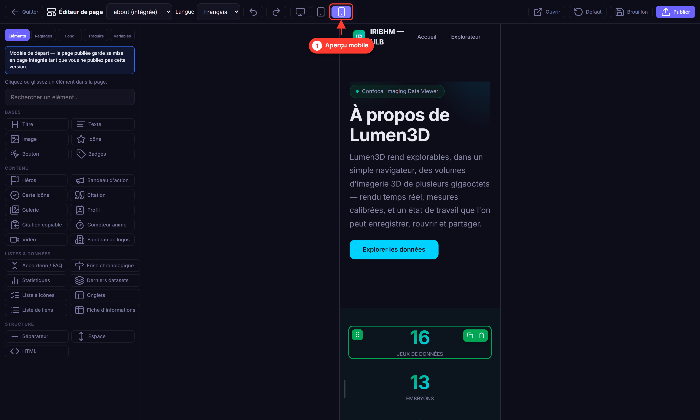

Les trois icônes (ordinateur / tablette / mobile) redimensionnent l'aperçu. **Prenez l'habitude de vérifier en mobile avant de publier** : une bonne partie des visiteurs consultent le site depuis un téléphone.

## 11.8. Le fond animé

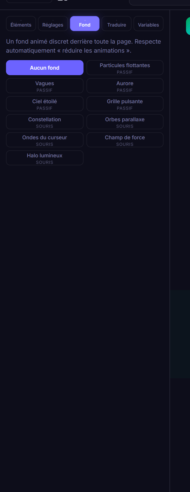

L'onglet **Fond** ajoute un décor animé discret derrière toute la page.

- **Aucun fond** — fond uni.
- **Souris** — l'animation réagit au déplacement du curseur.
- **Passif** — l'animation se déroule seule.

Le réglage respecte automatiquement la préférence système « réduire les animations » des personnes sensibles au mouvement.

## 11.9. Traduire une page

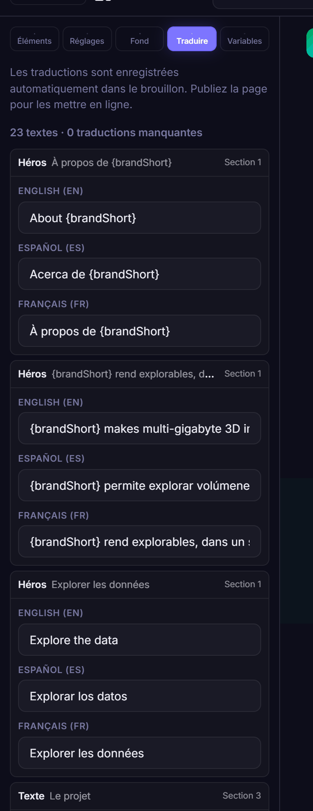

L'onglet **Traduire** liste **tous les textes de la page** et signale ceux qui manquent dans les autres langues, avec un compteur du type *« 24 textes · 7 traductions manquantes »*.

C'est un vrai gain de temps : au lieu de rouvrir chaque élément un par un pour chercher ce qui n'est pas traduit, vous voyez tout d'un coup et remplissez à la suite.

**Méthode conseillée :** rédigez toute la page dans une langue, puis passez sur cet onglet pour la traduire d'un bloc.

## 11.10. Les variables

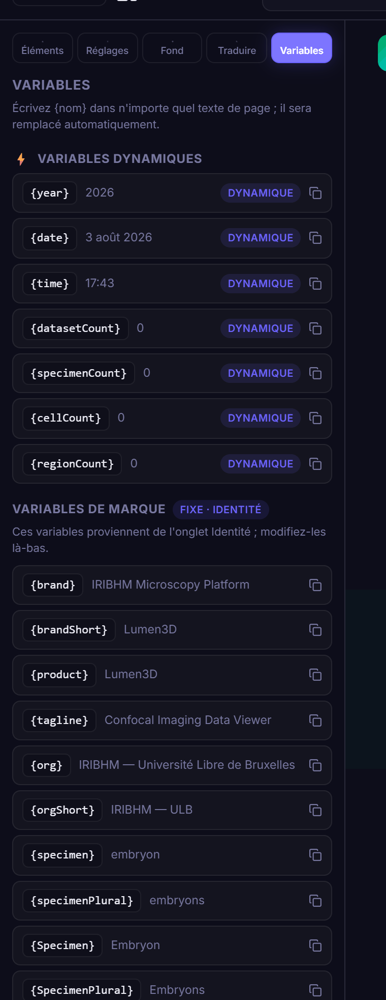

Une **variable** est un texte que vous définissez une fois et réutilisez partout.

**Comment ça marche :**

1. dans l'onglet **Variables**, créez une variable : un nom (par exemple `contact`) et une valeur (`microscopy@ulb.be`) ;
2. dans n'importe quel texte de la page, écrivez `{contact}` ;
3. à l'affichage, c'est la valeur qui apparaît.

**À quoi ça sert :** le jour où l'adresse change, vous la corrigez à un seul endroit et **toutes les pages se mettent à jour**. Idéal pour une adresse e-mail, un numéro de téléphone, un nom de responsable ou une référence d'article.

Règles de nommage : commencez par une lettre, puis lettres, chiffres ou `_`, 32 caractères maximum.

Des variables existent déjà pour les informations de l'onglet Identité : `{brand}` (le nom du site), `{specimen}` (votre objet d'étude), `{org}` (l'organisation), `{year}` (l'année). Elles se mettent à jour toutes seules.

## 11.11. Créer une nouvelle page

1. dans l'onglet **Pages**, cliquez sur **+ Nouvelle page** ;
2. donnez-lui un titre et une adresse courte (le *slug*, par exemple `protocoles`) ;
3. construisez-la dans l'éditeur ;
4. **Publier** ;
5. pour la rendre accessible depuis le menu, rendez-vous dans **Identité → Navigation**.

La page est alors accessible à l'adresse `https://<votre-site>/page.html?slug=protocoles`.

## 11.12. Marche à suivre recommandée

1. **Modifier avec l'éditeur**
2. Faire ses modifications
3. **Brouillon** régulièrement (comme dans un traitement de texte)
4. Vérifier en **aperçu mobile**
5. Compléter l'onglet **Traduire**
6. **Publier**
7. **Ouvrir** pour vérifier le résultat en ligne

---

# 12. Apparence — les couleurs du site

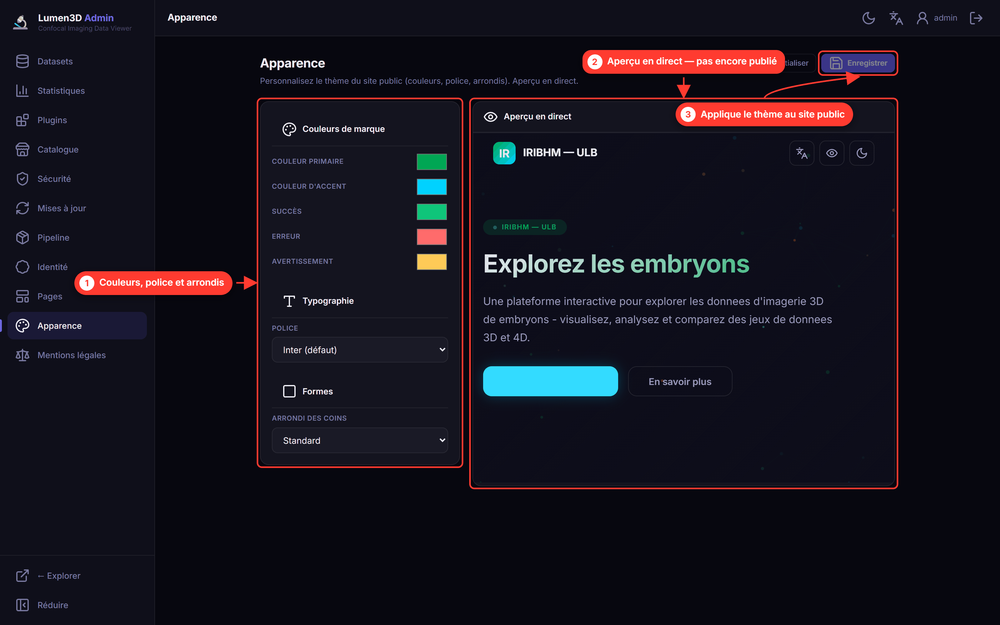

| | |
|---|---|
| **1** | Couleurs, police et arrondis. |
| **2** | **Aperçu en direct** — ce que vous voyez **n'est pas encore publié**. |
| **3** | **Enregistrer** — applique le thème au site public. |

## 12.1. Les couleurs

| Couleur | Où elle apparaît |
|---|---|
| **Primaire** | La couleur dominante : boutons principaux, liens, éléments actifs |
| **Accent** | La couleur secondaire, pour les mises en valeur |
| **Succès** | Les confirmations (vert par défaut) |
| **Erreur** | Les messages d'erreur (rouge par défaut) |
| **Avertissement** | Les alertes (orange par défaut) |

Cliquez sur un carré de couleur pour ouvrir le sélecteur. **L'aperçu de droite se met à jour instantanément**, ce qui permet d'essayer sans risque.

> 💡 **Gardez les couleurs Succès / Erreur / Avertissement proches du vert / rouge / orange.** Ce sont des repères universels : un message d'erreur en vert désoriente les visiteurs.

## 12.2. Typographie et formes

- **Police** — la police de caractères du site public.
- **Arrondi des coins** — de anguleux à très arrondi, sur les boutons et les cartes.

## 12.3. Publier le thème

Rien n'est appliqué au site public tant que vous n'avez pas cliqué sur **Enregistrer**. Le bouton **Réinitialiser** revient au thème d'origine.

> ⚠️ **Vérifiez le contraste.** Une couleur primaire très claire sur fond clair devient illisible. Après enregistrement, ouvrez le site public et vérifiez que tout se lit bien, en thème clair **et** en thème sombre.

---

# 13. Mentions légales

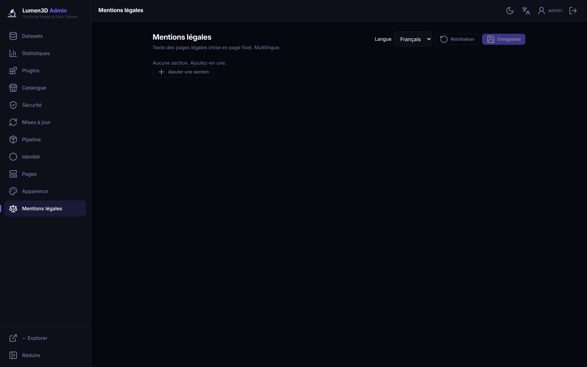

Un éditeur simple, à mise en page fixe, pour le texte légal du site.

**Fonctionnement :**

- **+ Ajouter une section** crée un bloc : un **titre** et un **texte**.
- Les sections s'affichent dans l'ordre où vous les créez.
- Le sélecteur **Langue** en haut permet de rédiger la version de chaque langue.
- **Enregistrer** publie.

**Sections habituelles :** éditeur du site, hébergeur, propriété intellectuelle, données personnelles, contact.

> ⚠️ **Deux choses à ne pas oublier :**
> 1. la page reste invisible tant que vous n'avez pas coché **« Afficher Mentions légales »** dans **Identité → Navigation** ;
> 2. le contenu juridique dépend de votre pays et de votre institution — rapprochez-vous du service compétent plutôt que de recopier un modèle trouvé en ligne.

---
---

# Annexe A — Première installation

Cette annexe ne concerne que la **toute première mise en service** d'un site neuf. Si votre site fonctionne déjà, vous ne verrez jamais ces écrans.

Quand aucun compte administrateur n'existe encore, l'ouverture de `admpan.html` déclenche un assistant en **5 étapes**.

## Étape 1 — Compte administrateur

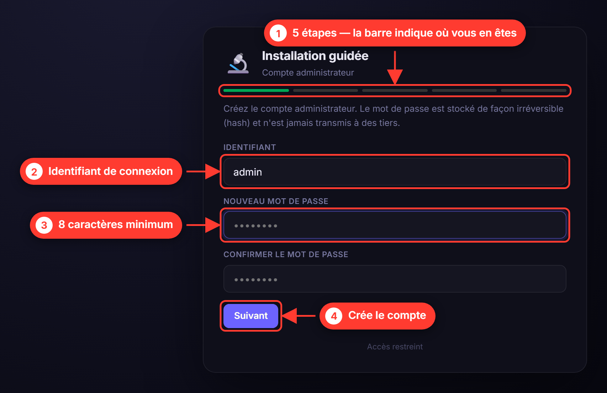

C'est **la seule étape obligatoire**. Les suivantes peuvent être passées et refaites plus tard depuis les onglets correspondants.

Le mot de passe doit faire **8 caractères minimum**.

> 🔒 **Cette création est exclusive :** elle ne peut jamais écraser un compte existant. Si un mot de passe est déjà configuré, cet écran ne s'affiche pas du tout.

## Étape 2 — Identité

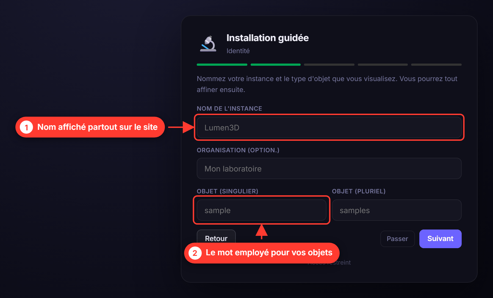

Le nom de l'instance, l'organisation, et le mot qui désigne vos objets d'étude. Modifiable ensuite dans **Identité** (§10).

## Étape 3 — Thème

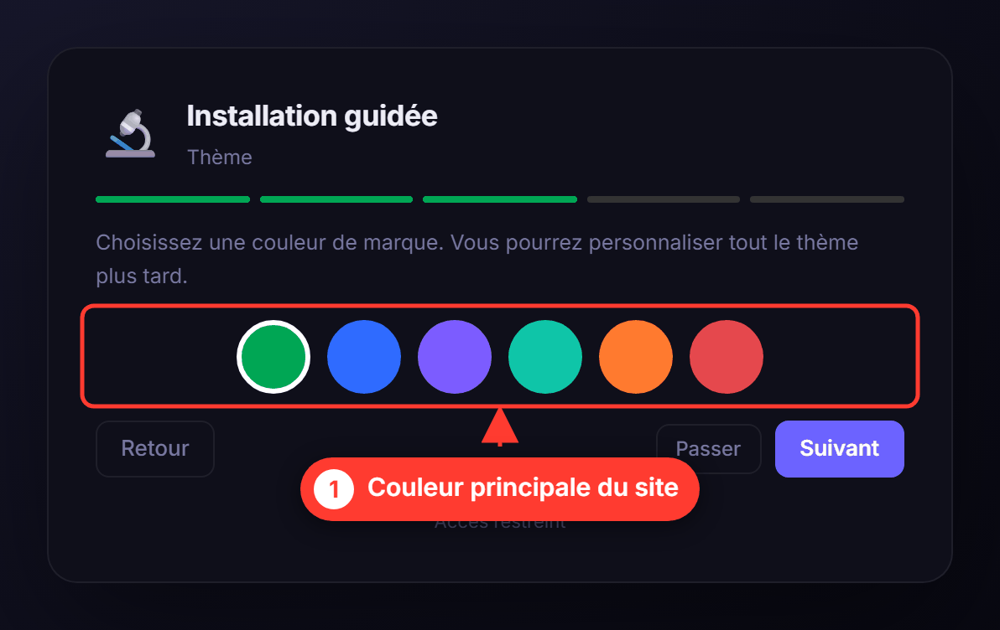

Une couleur dominante parmi six propositions. Affinable ensuite dans **Apparence** (§12).

## Étape 4 — Textes

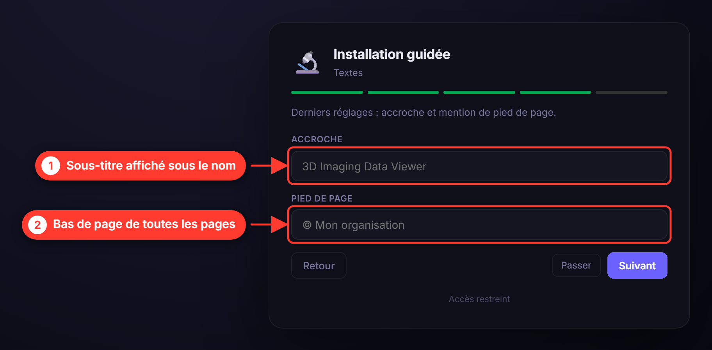

L'accroche et la mention de pied de page. Modifiables ensuite dans **Identité** (§10).

## Étape 5 — Plugins

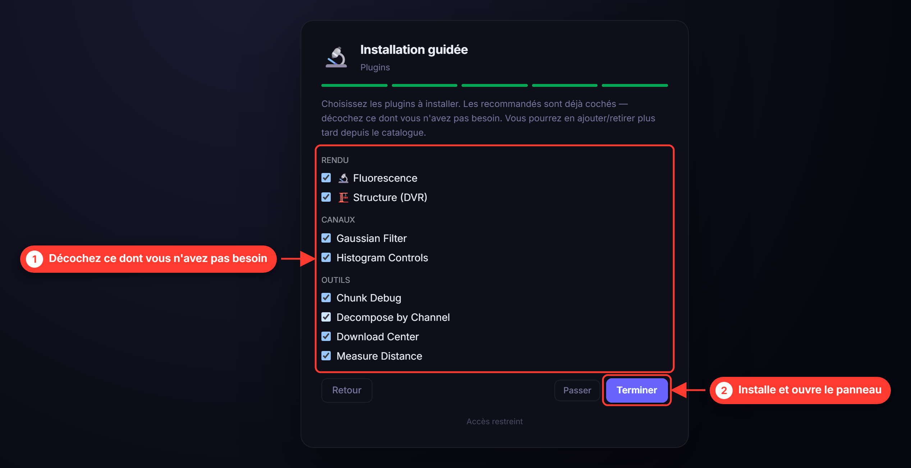

La sélection des fonctions à installer. Les recommandées sont déjà cochées ; décochez ce dont vous n'avez pas besoin. Modifiable ensuite dans **Catalogue** (§6) et **Plugins** (§5).

**Terminer** installe la sélection et ouvre le panneau.

---

# Annexe B — En cas de problème

### « J'ai oublié le mot de passe administrateur »

Il est **impossible** de le retrouver : le serveur n'en garde qu'une empreinte irréversible.

La solution demande un accès aux fichiers du serveur (FTP, SFTP, ou le gestionnaire de fichiers de l'hébergeur) :

1. supprimer — ou mieux, **renommer** — le fichier `api/admin_credential.json` ;
2. rouvrir `admpan.html` : l'assistant de première installation réapparaît ;
3. créer un nouveau mot de passe.

**Rien d'autre n'est perdu** : ni les jeux de données, ni les pages, ni les réglages.

> ⚠️ Pendant ce court laps de temps, n'importe qui ouvrant la page pourrait créer le compte à votre place. Faites-le d'une traite.

### « J'ai modifié quelque chose et le site est cassé »

| Onglet | Comment revenir en arrière |
|---|---|
| **Identité** | Bouton **Réinitialiser** |
| **Apparence** | Bouton **Réinitialiser** |
| **Pages** | Bouton **Défaut** dans l'éditeur, puis **Publier** |
| **Mentions légales** | Bouton **Réinitialiser** |
| **Datasets** | Bouton **↺ Reset** (avant d'avoir sauvegardé) |

### « Un jeu de données n'apparaît pas dans la liste »

1. vérifiez qu'il est bien dans `DATA_WEB/fixed/`, `DATA_WEB/live/` ou `DATA_WEB/tracking/` ;
2. vérifiez que son dossier contient bien un fichier `metadata.json` ;
3. rechargez la page du panneau.

Il n'y a **aucun catalogue à régénérer** : la liste est reconstruite à chaque affichage.

### « Une fonction a disparu du visualiseur »

Regardez l'onglet **Plugins** : le plugin correspondant est probablement désactivé, ou passé en **non fiable** après une modification de ses fichiers. Voir §5.5.

### « Un enregistrement échoue sans message clair »

Essayez **Sécurité → Réparer les permissions** (§7.3). C'est la cause la plus fréquente sur les hébergements mutualisés.

### « La mise à jour a échoué »

Si le message dit *« restauration automatique effectuée »*, **il n'y a rien à faire** : le site est revenu à sa version précédente et fonctionne. Réessayez plus tard, ou signalez le message d'erreur.

### « Le panneau est illisible / les menus déroulants sont blancs sur blanc »

Faites un **rechargement forcé** : `Ctrl + Shift + R` (Windows) ou `Cmd + Shift + R` (Mac). Le navigateur garde parfois d'anciens fichiers en mémoire après une mise à jour.

---

# Annexe C — Petit glossaire

| Terme | Ce que ça veut dire ici |
|---|---|
| **Canal** | Un marquage fluorescent (DAPI, GFP, Pecam1…). Un jeu de données en contient souvent plusieurs, superposés. |
| **Voxel** | L'équivalent d'un pixel, en trois dimensions. Sa taille réelle est donnée par la calibration (§3.3). |
| **Brique** | Un petit cube de volume (64×64×64 voxels). Le site les charge à la demande, ce qui lui permet d'afficher des volumes de plusieurs gigaoctets sans tout télécharger. |
| **LOD** | *Level of Detail*. Plusieurs résolutions du même volume : le site affiche d'abord une version grossière, puis affine. |
| **Fixed / Live / Tracking** | Les trois types de jeux de données : volume figé, série temporelle 4D, trajectoires cellulaires. |
| **Plugin** | Un module qui ajoute une fonction au visualiseur (§5.1). |
| **Bac à sable** | Un mode d'exécution isolé : le plugin fonctionne, mais ne peut pas accéder au reste de la page. |
| **Empreinte** | Une signature du contenu exact d'un fichier. Si le fichier change d'un seul caractère, l'empreinte change. |
| **Slug** | L'adresse courte d'une page (`protocoles` dans `page.html?slug=protocoles`). |
| **Section / Colonne / Élément** | Les trois niveaux de construction d'une page (§11.6). |
| **Brouillon** | Une version enregistrée mais **pas encore visible** du public. |
| **SEO** | Les textes qu'affichent les moteurs de recherche et les réseaux sociaux. |

---

*Document généré à partir de la version **1.34.0** de la plateforme. Les captures d'écran proviennent d'une instance réelle ; les couleurs peuvent différer si le thème a été modifié.*
