# Comment lire ce guide {.unnumbered}

::: lead
Ce document explique **tout ce qu'on peut faire depuis le panneau d'administration** du site.
Il est écrit pour quelqu'un qui **n'a jamais vu ce panneau** et qui **ne sait pas coder** : aucune commande, aucun fichier à éditer, tout se fait à la souris, dans un navigateur.
:::

::: remember
**Deux règles à retenir avant de commencer**

1. **Rien n'est perdu tant que vous n'avez pas cliqué sur [Enregistrer]{.ui}** (ou [Sauvegarder]{.ui}, ou [Publier]{.ui}). Vous pouvez cliquer partout pour explorer. Seules exceptions, signalées chaque fois : l'œil de visibilité d'un dataset, l'ajout d'une image à la galerie et les mises à jour de données agissent tout de suite.
2. **Le panneau ne modifie jamais les pixels de vos images.** Les valeurs du niveau natif sont conservées voxel pour voxel. Il règle des noms, des textes, des couleurs, la visibilité ; il peut aussi **ajouter ou reconstruire des fichiers dérivés** (import, mise à jour des données, galerie), toujours sur demande.
:::

## Le panneau en quatre groupes

Le menu de gauche range les 15 onglets en **quatre groupes**, selon ce que vous êtes en train de faire. Ce guide suit le même ordre.

| Groupe | Onglets | Chapitres |
|---|---|---|
| **Prise en main** | Connexion, tour du panneau | 1 – 2 |
| **Données** | Datasets · Import · Mises à jour des données · Types de données · Statistiques | 3 – 7 |
| **Site public** | Identité · Apparence · Pages · Mentions légales | 8 – 11 |
| **Extensions** | Plugins · Catalogue | 12 – 13 |
| **Système** | Mises à jour (et page *Notes de version*) · Pipeline · Sécurité · Documentation | 14 – 17 |
| **Annexes** | Première installation · En cas de problème · Glossaire | A – C |

## Comment lire ce guide

:::: cards
::: card
#### 🚀 Je viens d'arriver
Chapitres **1 et 2**, puis l'**annexe B** (« En cas de problème »). Dix minutes suffisent.
:::
::: card
#### 📦 J'ai de nouvelles données
Chapitre **4** (Import), puis **3** (Datasets) pour les nommer et les rendre publiques.
:::
::: card
#### 🛠 Je maintiens le site
Chapitres **5**, **12 à 14** : mises à jour des données, plugins, version de la plateforme.
:::
::::

Les mots entre crochets bleus, comme [Enregistrer]{.ui}, sont **les textes exacts affichés à l'écran**. Les cercles rouges numérotés des captures renvoient au tableau placé juste dessous. Toutes les captures montrent un jeu de démonstration.

# 1. Se connecter au panneau

::: chapter-intro
- Le panneau n'a **aucun lien** depuis le site public : on tape son adresse.
- Un identifiant, un mot de passe, et c'est parti pour **8 heures** de session.
- Après trop d'essais ratés, le panneau fait **attendre 15 minutes**.
:::

## 1.1. L'adresse

Le panneau d'administration n'est **pas** accessible depuis un lien du site public : il n'y a volontairement aucun bouton « Admin » sur les pages visibles, et le panneau demande aux moteurs de recherche de ne pas l'indexer.

Pour y accéder, il faut **taper l'adresse à la main** dans la barre du navigateur :

```
https://<adresse-du-site>/admpan.html
```

Remplacez `<adresse-du-site>` par l'adresse habituelle du site. Par exemple, si le site public est `https://microscopy.example.be`, le panneau est à `https://microscopy.example.be/admpan.html`.

::: tip
Mettez cette adresse en favori dans votre navigateur : vous n'aurez plus à la retenir.
:::

## 1.2. Les identifiants

::: note
**Identifiants d'accès**

- **Identifiant :** [ ]{.field-line}
- **Mot de passe :** [ ]{.field-line}

*(À compléter. Ne diffusez ces informations qu'aux personnes qui doivent réellement administrer le site.)*
:::

Dans la version PDF de ce guide, vous pouvez imprimer cette page et écrire à la main, ou garder le fichier à l'abri.

## 1.3. L'écran de connexion

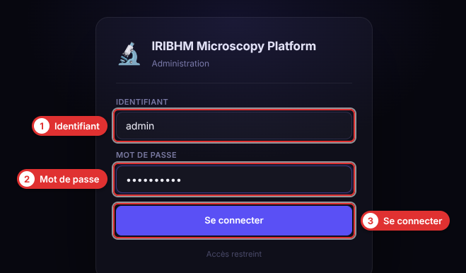{.shot width=62%}

::: legend
| n | ce que c'est |
|-|----------------------|
| 1 | Votre **identifiant** (`admin` par défaut). |
| 2 | Votre **mot de passe**. |
| 3 | [Se connecter]{.ui} ouvre le panneau. La touche <kbd>Entrée</kbd> fait la même chose. |
:::

C'est un vrai formulaire : le gestionnaire de mots de passe de votre navigateur (Chrome, Firefox…) peut mémoriser et remplir **l'identifiant et le mot de passe**.

Si les identifiants sont mauvais, le message « Identifiants incorrects. » s'affiche au-dessus des champs.

## 1.4. Essais répétés et durée de session

::: warning
**Le panneau se protège des essais répétés.** Chaque échec est compté **avant** la vérification du mot de passe, par adresse : après **10 échecs en 15 minutes**, l'accès est bloqué pendant **15 minutes** (« Trop de tentatives. Réessayez plus tard. »). Un plafond global de 200 essais par 15 minutes protège aussi le site contre une attaque venue de plusieurs adresses.
:::

- Un mauvais identifiant coûte **le même temps** qu'un mauvais mot de passe : on ne peut pas deviner quels comptes existent.
- La session dure **8 heures**, puis il faut se reconnecter. Elle s'arrête aussi à chaque changement de mot de passe.
- Le jeton de session n'est **pas** lisible par les pages du site ; il disparaît à la déconnexion.

::: tech
Derrière un serveur « proxy inverse », le serveur doit connaître l'adresse du proxy (option `--trusted-proxy`, variable `LUMEN_TRUSTED_PROXIES` ou fichier `api/trusted-proxies.json`). Sinon, tous les visiteurs ressemblent au proxy et se partagent le même compteur d'essais. C'est un réglage d'hébergement, à demander à la personne qui gère le serveur.
:::

::: warning
**Le mot de passe n'est écrit nulle part sur le serveur.** Il est transformé en une empreinte irréversible (voir chapitre 16). Personne, pas même l'hébergeur, ne peut le retrouver. **Si vous le perdez**, la seule solution est décrite en [annexe B](#annexe-b--en-cas-de-problème).
:::

# 2. Le tour du propriétaire

::: chapter-intro
- Un menu de gauche en **4 groupes**, une barre du haut, une zone de travail.
- Une pastille orange vous prévient quand **vous avez des modifications non sauvegardées**.
- <kbd>Ctrl</kbd> + <kbd>S</kbd> enregistre l'onglet ouvert.
:::

Une fois connecté, l'écran se divise en trois zones qui ne changent jamais : le **menu**, la **barre du haut**, et la **zone de travail** où s'affiche l'onglet choisi.

## 2.1. Le menu de gauche

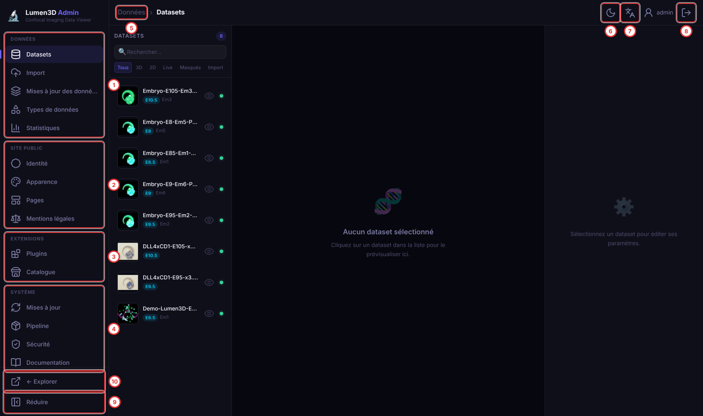{.shot width=88%}

::: legend
| n | ce que c'est |
|-|----------------------|
| 1 | Groupe **Données** : Datasets, Import, Mises à jour des données, Types de données, Statistiques. |
| 2 | Groupe **Site public** : Identité, Apparence, Pages, Mentions légales. |
| 3 | Groupe **Extensions** : Plugins, Catalogue. |
| 4 | Groupe **Système** : Mises à jour, Pipeline, Sécurité, Documentation. |
| 5 | **Fil d'Ariane** : « groupe › onglet » ouvert. |
| 6 | **Thème** clair / sombre du panneau (votre affichage seulement). |
| 7 | **Langue** du panneau : français, anglais, espagnol, néerlandais. |
| 8 | **Déconnexion.** |
| 9 | [Réduire]{.ui} : replie le menu en icônes pour gagner de la place (le choix est mémorisé). |
| 10 | [← Explorer]{.ui} : ouvre le site public dans un nouvel onglet, pratique pour vérifier l'effet d'une modification. |
:::

Le bouton [Réduire]{.ui} replie le menu en icônes seules. Un **petit point coloré** apparaît à côté de [Mises à jour]{.ui} quand une nouvelle version de la plateforme existe. Un autre apparaît à côté d'[Import]{.ui} quand un transfert est en cours.

Sur un téléphone, le menu devient un tiroir (bouton [Menu]{.ui}). Le panneau reste pensé pour un **écran large** : l'éditeur de datasets en particulier.

## 2.2. La barre du haut

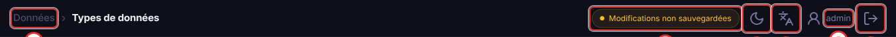{.shot width=88%}

::: legend
| n | ce que c'est |
|-|----------------------|
| 1 | Le **fil d'Ariane** : groupe puis onglet. |
| 2 | La pastille orange **« Modifications non sauvegardées »**. |
| 3 | Le **thème** du panneau. |
| 4 | La **langue** du panneau. |
| 5 | Votre **nom d'utilisateur**. |
| 6 | La **déconnexion**. |
:::

## 2.3. Les modifications non sauvegardées

Dès que vous changez quelque chose sans l'enregistrer, la pastille orange apparaît. C'est un **rappel**, pas une erreur : tant qu'elle est là, vos changements ne sont visibles que par vous.

- Elle est calculée **onglet par onglet** (Datasets, Types de données, Identité, Apparence, Mentions légales, Pages). Elle ne s'allume plus parce que vous avez seulement **ouvert** un dataset.
- Si vous changez d'onglet avec des modifications en attente : « Modifications non sauvegardées. Continuer sans sauvegarder ? ». Répondre oui **abandonne vraiment** les modifications.
- <kbd>Ctrl</kbd> + <kbd>S</kbd> (<kbd>Cmd</kbd> + <kbd>S</kbd> sur Mac) **enregistre l'onglet visible** : Datasets, Types de données, Identité, Apparence, Mentions légales.

::: note
**Session expirée pendant que vous travaillez ?** Le panneau remet l'écran de connexion avec le message « Session expirée : vos modifications non enregistrées sont conservées. Reconnectez-vous pour continuer. ». Les onglets restent en place derrière : après reconnexion, vous retrouvez votre travail.
:::

Quand un **import est en cours**, la déconnexion et les liens qui quittent le panneau demandent une confirmation (chapitre 4). Les onglets se chargent à leur première ouverture : une première visite peut prendre une fraction de seconde.

## 2.4. Les onglets en un coup d'œil

| Onglet | À quoi ça sert | Fréquence |
|---|---|---|
| **Datasets** | Nommer, décrire, orienter, afficher ou masquer chaque jeu de données | Courant |
| **Import** | Envoyer le dossier produit par le pipeline, depuis le navigateur | Courant |
| **Mises à jour des données** | Mettre les jeux de données publiés au format de données courant | Occasionnel |
| **Types de données** | Le nom public des trois catégories (3D, 2D, Live) | Rare |
| **Statistiques** | Voir la fréquentation du site | Occasionnel |
| **Identité** | Nom du site, vocabulaire, pied de page, menu | Rare |
| **Apparence** | Couleurs, police et arrondis du site public | Rare |
| **Pages** | Modifier le contenu des pages (accueil, à propos…) | Courant |
| **Mentions légales** | Texte légal | Rare |
| **Plugins** | Activer, désactiver, approuver les fonctions du visualiseur | Rare |
| **Catalogue** | Installer, mettre à jour, désinstaller des fonctions | Rare |
| **Mises à jour** | Mettre la **plateforme**, les plugins et le pack Pipeline à jour | Occasionnel |
| **Pipeline** | Télécharger l'outil qui prépare les nouvelles données | Rare |
| **Sécurité** | Mot de passe et permissions | Rare |
| **Documentation** | Lire et télécharger les guides publiés | Occasionnel |

::: warning
**Deux onglets commencent par « Mises à jour », et ils ne font pas la même chose.** [Mises à jour des données]{.ui} (groupe Données) met à niveau le **format des jeux de données** publiés. [Mises à jour]{.ui} (groupe Système) met à jour **le logiciel** : plateforme, plugins, pack de traitement.
:::

# 3. Datasets — les jeux de données

::: chapter-intro
- C'est l'onglet que vous ouvrirez le plus souvent : il **décrit** les jeux de données et décide **lesquels sont publics**.
- Trois colonnes : la **liste**, l'**aperçu** (le vrai visualiseur), les **réglages**.
- Un dataset arrive par l'onglet **Import** (ou par FTP) ; ici, on le rend présentable.
:::

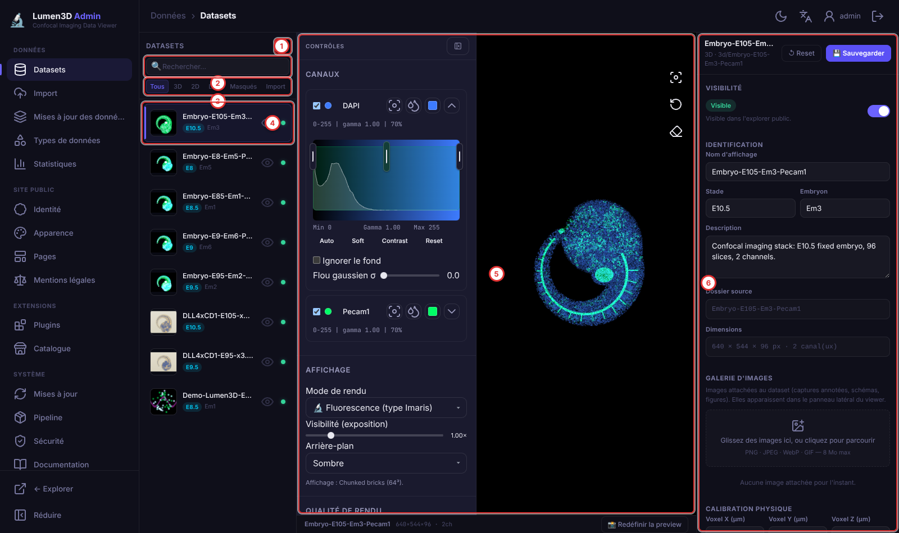{.shot width=88%}

::: legend
| n | ce que c'est |
|-|----------------------|
| 1 | Le nombre total de jeux de données. |
| 2 | La **recherche** : nom, stade, spécimen. |
| 3 | Les **filtres** par type (voir §3.2). |
| 4 | Le dataset sélectionné dans la liste. |
| 5 | L'**aperçu** : le vrai visualiseur, avec la barre latérale des canaux. |
| 6 | Les **réglages** du dataset (colonne de droite). |
:::

::: analogy
**Une bibliothèque et ses fiches.** Les volumes sont les livres, posés sur les rayons par le pipeline. Cet onglet n'écrit pas les livres : il remplit **la fiche** de chacun (titre lisible, description, orientation, image de couverture) et décide s'il est **en rayon public** ou en réserve.
:::

## 3.1. Comment un jeu de données arrive-t-il ici ?

Vous ne **créez** pas un jeu de données depuis le panneau. Il y a deux voies :

::: steps
1. Les images brutes du microscope sont traitées par le **pipeline** (chapitre 15).
2. Le dossier produit est envoyé au serveur : soit par l'onglet **Import** (glisser-déposer dans le navigateur, chapitre 4), soit copié dans `DATA_WEB` par FTP.
3. Il **apparaît immédiatement** dans cette liste : il n'y a rien à régénérer, aucun bouton à cliquer.
:::

::: warning
Un dataset **publié par l'Import** arrive **masqué** de l'explorateur public. Il faut venir ici, l'ouvrir et activer [Visibilité]{.ui} (ou cliquer l'œil de sa ligne). Un dataset copié par FTP, lui, est visible d'emblée.
:::

## 3.2. La colonne de gauche : trouver un jeu de données

:::::: cols-wide-right
::::: col
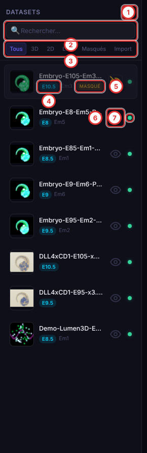{.shot width=100%}
:::::
::::: col
::: legend
| n | ce que c'est |
|-|----------------------|
| 1 | Le **nombre** de jeux de données. |
| 2 | La **recherche** : un morceau de nom, la liste se filtre en direct ; la croix efface. |
| 3 | Les **filtres** : [Tous]{.ui}, **un filtre par type de données** ([3D]{.ui}, [2D]{.ui}, [Live]{.ui}), [Masqués]{.ui} et [Import]{.ui}. |
| 4 | Le **stade** de l'embryon. |
| 5 | Le badge **masqué** : ce dataset n'est pas public. |
| 6 | L'**œil** : montre ou masque le dataset **immédiatement**, sans passer par [Sauvegarder]{.ui}. |
| 7 | Le **point coloré** : [Configuré]{.ui} (vert) ou [Non configuré]{.ui} (ambre). |
:::
:::::
::::::

- Les noms des filtres de type sont **ceux que vous avez choisis** dans l'onglet Types de données (chapitre 6). Il y a **trois** types : le suivi de cellules est une couche d'un dataset *Live*, pas un type à part.
- Le filtre [Import]{.ui} montre les datasets dont le transfert n'est pas publié (§3.10).
- Le **point coloré n'est pas un contrôle d'intégrité** : vert veut dire que le dataset a déjà été enregistré au moins une fois depuis ce panneau (ou possède une vignette) ; ambre qu'il ne l'a jamais été.

::: note
L'œil change la visibilité **tout de suite** (toast « Dataset masqué de l'explorer. » ou « Dataset visible dans l'explorer. »). C'est la seule modification d'un dataset qui ne passe pas par [Sauvegarder]{.ui}.
:::

Une liste vide affiche « Aucun dataset trouvé. ». Si la liste ne peut pas se charger : « Impossible de charger les datasets. Vérifiez que PHP est actif. » et un bouton [Réessayer]{.ui}.

## 3.3. La colonne du milieu : l'aperçu

:::::: cols-wide-right
::::: col
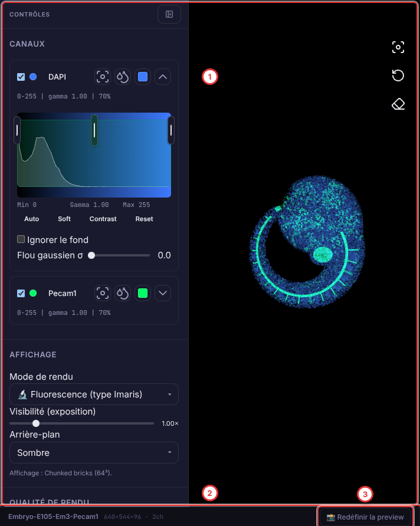{.shot width=100%}
:::::
::::: col
::: legend
| n | ce que c'est |
|-|----------------------|
| 1 | Le **visualiseur 3D** (ou 2D pour une photographie), tel que le voit un visiteur. |
| 2 | Le nom du dataset et ses **dimensions** (`X×Y×Z · n canaux`, ou `X×Y px`). |
| 3 | [📸 Redéfinir la preview]{.ui} : fige la vue actuelle comme **vignette** du dataset dans l'explorateur. |
:::
:::::
::::::

Vous pouvez faire tourner le volume, changer les couleurs, régler le contraste : exactement comme un visiteur. Le chargement d'un gros volume prend quelques secondes (les données arrivent par petits blocs).

::: note
Seuls les plugins qui acceptent d'être **embarqués** (contexte « panel ») se chargent dans l'aperçu : Presentation Mode, Download Center, Screenshot et quelques autres n'y apparaissent pas. **Ce n'est pas un bug** (voir chapitre 12).
:::

::: tip
**Redéfinir la preview** : orientez le volume comme vous voulez qu'il apparaisse dans l'explorateur, puis cliquez. Le bouton passe par « Capture… » puis « Enregistrement… » ; un toast confirme « Preview mise à jour ✓ ».
:::

### Ce que l'aperçu enregistre, et ce qu'il oublie

Certains réglages faits dans l'aperçu sont **récupérés par le panneau** et enregistrés quand vous cliquez [Sauvegarder]{.ui} :

- les **réglages de canaux** : nom, couleur, min / max / gamma, affiché ou masqué ;
- la **luminosité** (Exposure) ;
- l'**orientation** si vous êtes en train de la définir (§3.8).

Tout le reste — position de la caméra, mode de rendu, qualité, fond, plan de coupe — sert à regarder et **n'est pas conservé**.

## 3.4. La colonne de droite : les réglages

:::::: cols-wide-right
::::: col
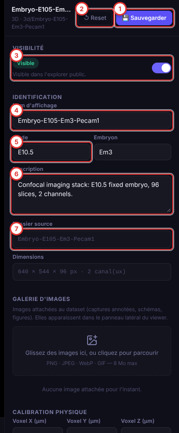{.shot width=100%}
:::::
::::: col
::: legend
| n | ce que c'est |
|-|----------------------|
| 1 | [Sauvegarder]{.ui} (<kbd>Ctrl</kbd> + <kbd>S</kbd>) : enregistre le formulaire. |
| 2 | [↺ Reset]{.ui} : annule vos changements non enregistrés. |
| 3 | **Visibilité** : l'interrupteur applique **tout de suite**. |
| 4 | **Nom d'affichage** : le nom que verront les visiteurs. |
| 5 | **Stade** (et **Embryon**, à côté) : les étiquettes de filtrage. |
| 6 | **Description** : texte libre de la fiche publique. |
| 7 | **Dossier source** (et **Dimensions**) : en gris, non modifiables. |
:::
:::::
::::::

En-tête de la colonne : le nom du dataset et, dessous, « type · identifiant » (par exemple « 3D · 3d/Embryo-E105-Em3-Pecam1 »).

**Visibilité** — une pastille [Visible]{.ui} (« Visible dans l'explorer public. ») ou [Masqué]{.ui} (« Absent de l'explorer public. »). Un dataset masqué reste sur le serveur et reste atteignable par son adresse exacte, mais n'apparaît plus dans les listes. Utile pendant une vérification, ou pour un article pas encore publié.

**Identification**

- **Nom d'affichage** — remplace le nom technique du dossier. Si vous le **videz**, l'ancien nom est conservé.
- **Stade** et **Embryon** (le libellé reprend le mot de votre Terminologie) — pré-remplis depuis le nom du dossier ; corrigez si la détection s'est trompée. Le stade numérique est recalculé à l'enregistrement.
- **Description** — ce qui aide un collègue : marquages, conditions, particularités.
- **Dossier source** et **Dimensions** — lus dans les fichiers. Pour un volume : « X × Y × Z px · n canal(ux) » ; pour une photographie : « X × Y px · 0,xxx µm/px » ou « non calibré ».

::: tech
[Sauvegarder]{.ui} **fusionne** le formulaire dans `metadata.json` (écriture atomique, sous verrou). Le **type** et l'**identifiant** d'un dataset ne sont jamais modifiés depuis le panneau. Résultat : toast « Dataset sauvegardé ✓ » ou « Erreur lors de la sauvegarde. ».
:::

Un dataset mal formé est **refusé** plutôt que monté de travers : toast « Dataset malformé, montage refusé (raison) », avec une raison parmi : réponse vide, identifiant manquant, type invalide, dimensions manquantes ou invalides, canaux manquants, bloc image manquant ou invalide.

## 3.5. La galerie d'images

Une galerie permet d'attacher à un dataset des **captures annotées, schémas, figures**. Elles apparaissent dans le visualiseur, en bas à droite, sous forme de vignettes qui s'agrandissent au clic.

:::::: cols-wide-right
::::: col
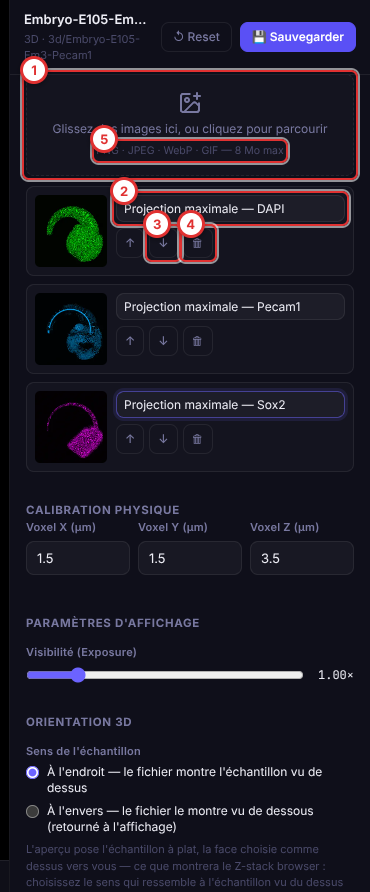{.shot width=100%}
:::::
::::: col
::: legend
| n | ce que c'est |
|-|----------------------|
| 1 | La **zone de dépôt** : glissez des images, ou cliquez pour parcourir. |
| 2 | La **légende** (optionnelle, 400 caractères). |
| 3 | ↑ ↓ : **déplacer** l'image dans l'ordre d'affichage. |
| 4 | 🗑 : **supprimer** l'image (confirmation, puis « Image supprimée ✓ »). |
| 5 | Formats : PNG, JPEG, WebP, GIF — 8 Mo max. |
:::
:::::
::::::

- **40 images au maximum** par dataset (« Maximum 40 images par dataset. »).
- Les **octets sont envoyés tout de suite** à l'ajout. L'**ordre** et les **légendes** sont enregistrés par [Sauvegarder]{.ui}.
- Le format est reconnu d'après le **contenu réel** du fichier, jamais d'après son nom. Le plafond de 8 Mo suit la limite du serveur si elle est plus basse.
- Les miniatures (320 px) sont fabriquées par le serveur pour que la liste reste légère.
- Un dataset **réimporté en remplacement garde sa galerie** (chapitre 4).
- Sur un import non publié, la zone est désactivée : « Publiez l'import pour pouvoir lui attacher des images. ».

Erreurs possibles : « « X » : format non supporté (PNG, JPEG, WebP, GIF). », « « X » dépasse 8 MB. », « Envoi de « X » impossible : … », « Suppression impossible. ».

## 3.6. Calibration physique et affichage

:::::: cols-wide-right
::::: col
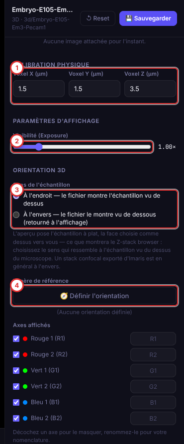{.shot width=100%}
:::::
::::: col
::: legend
| n | ce que c'est |
|-|----------------------|
| 1 | **Voxel X / Y / Z** : la taille réelle d'un voxel, en µm. |
| 2 | **Visibilité (Exposure)** : la luminosité à l'ouverture. |
| 3 | **Sens de l'échantillon** (§3.8). |
| 4 | [🧭 Définir l'orientation]{.ui} (§3.8). |
:::
:::::
::::::

**Calibration physique — le champ le plus important.** Les trois valeurs `Voxel X / Y / Z` (pas de 0,001) donnent la taille réelle d'un point de l'image, en micromètres. **Toutes les mesures des visiteurs en dépendent** : outil de distance, barre d'échelle, dimensions affichées.

::: warning
Ces valeurs sont lues dans le fichier du microscope et sont normalement justes. **Ne les modifiez que si vous avez une raison précise de les croire fausses** : une valeur erronée fausse toutes les mesures publiées, sans aucun avertissement. Une valeur vide ou 0 est ignorée (l'ancienne est conservée).
:::

`Voxel Z` est souvent bien plus grand que X et Y (par exemple `0,52 / 0,52 / 3,40`) : c'est normal, l'écart entre deux coupes dépasse la résolution dans le plan.

**Paramètres d'affichage** — le curseur **Visibilité (Exposure)** (de 0,20× à 5,00×) règle la luminosité à l'ouverture ; il suit celui de l'aperçu. Si un dataset paraît trop sombre, montez-le : les visiteurs pourront toujours l'ajuster.

Ces deux sections sont **masquées pour une photographie 2D** (§3.9).

## 3.7. Configurer les canaux

Un volume contient plusieurs **canaux**, un par marquage fluorescent. C'est ici que vous décidez à quoi ils ressemblent **par défaut**. Les réglages se font dans la **barre latérale de l'aperçu** et sont enregistrés par [Sauvegarder]{.ui}.

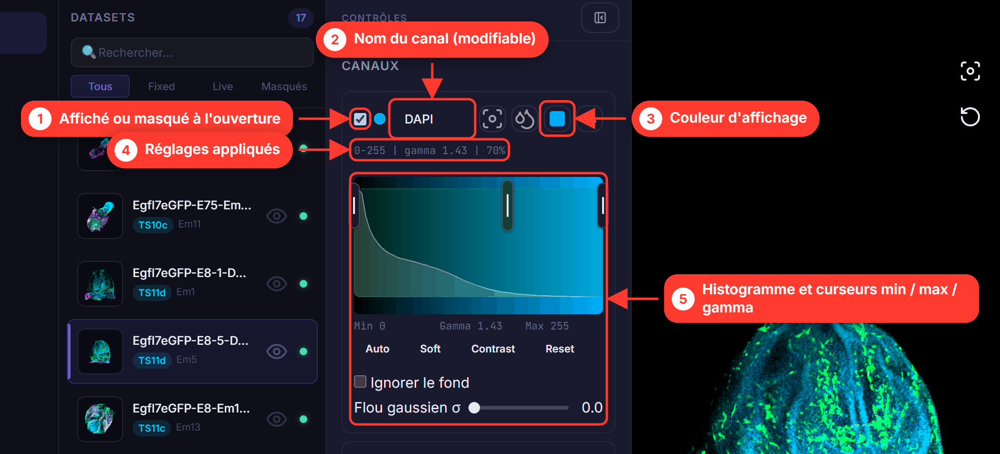{.shot width=70%}

::: legend
| n | ce que c'est |
|-|----------------------|
| 1 | La **case à cocher** : canal affiché ou masqué à l'ouverture. |
| 2 | Le **nom** du canal : cliquez et tapez pour le renommer. |
| 3 | La **couleur** d'affichage. |
| 4 | Le **résumé** des réglages (min–max, gamma, opacité). |
| 5 | Le **panneau détaillé** : histogramme et curseurs, via le chevron. |
:::

- **Le nom.** Les canaux arrivent nommés « Canal 1 », « Canal 2 »… Remplacez-les par le marquage réel : `DAPI`, `GFP`, `Pecam1`.
- **La couleur.** Certaines sont attribuées d'après le nom : `DAPI` devient bleu, `GFP` vert, `Pecam1` magenta. Sinon, couleurs de repli : vert, magenta, bleu, rouge.
- **Affiché ou masqué.** Décochez un canal peu informatif (vide, autofluorescence) : il reste disponible, mais le visiteur ne le voit pas d'abord.
- **Min / max / gamma.** L'histogramme montre la répartition des intensités ; les poignées règlent seuil bas, seuil haut et gamma. [Auto]{.ui}, [Soft]{.ui}, [Contrast]{.ui} proposent des réglages tout faits, [Reset]{.ui} revient au départ.
- **Isoler le canal** est un interrupteur : un second appui rétablit l'affichage d'avant.

::: warning
**Ces réglages sont cosmétiques, pas destructifs.** Ils changent l'*affichage*, jamais les données. N'oubliez pas [Sauvegarder]{.ui} : sans lui, les réglages de canaux sont perdus en changeant de dataset.
:::

## 3.8. L'orientation du spécimen

La section **Orientation 3D** a quatre réglages, de haut en bas : le **sens de l'échantillon**, le **repère de référence**, les **axes affichés** et la **vue par défaut**.

{.shot width=88%}

::: legend
| n | ce que c'est |
|-|----------------------|
| 1 | **Sens de l'échantillon** : deux boutons radio. |
| 2 | [🧭 Définir l'orientation]{.ui} : place le gizmo d'axes dans l'aperçu. |
| 3 | **Axes affichés** : cocher, masquer, renommer. |
| 4 | **Vue par défaut** : la pose d'ouverture du dataset. |
| 5 | [📌 Utiliser la vue actuelle]{.ui} : capture la pose de l'aperçu. |
:::

### Sens de l'échantillon

Deux choix : « À l'endroit — le fichier montre l'échantillon vu de dessus » (par défaut) ou « À l'envers — le fichier le montre vu de dessous (retourné à l'affichage) ».

::: tip
Un stack confocal exporté d'Imaris est **en général à l'envers**. Choisissez le sens qui ressemble à l'échantillon **vu du dessus du microscope**.
:::

Dès que vous cochez un choix, l'aperçu **se couche à plat** (animation d'environ une seconde), la face choisie comme *dessus* tournée vers vous : c'est ce que montrera le Z-stack browser.

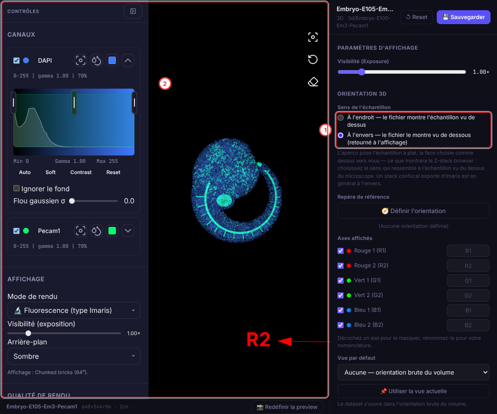{.shot width=88%}

Le sens est pris en compte par la vue initiale, le bouton de réinitialisation de la vue, la vue « 3d » et le Z-stack browser. Il **ne modifie ni le repère ni la vue par défaut**.

### Repère de référence et axes

Le bouton [🧭 Définir l'orientation]{.ui} (qui devient [❌ Annuler l'orientation]{.ui}) sert à indiquer où se trouvent l'avant, le haut et la droite du spécimen. Il repart de l'alignement déjà enregistré. Trois axes colorés apparaissent sur le volume, dans l'aperçu (voir la figure ci-dessus).

| Axe | Couleur | Affiché |
|---|---|---|
| **Rouge 1 / Rouge 2** | rouge | R1 / R2 |
| **Vert 1 / Vert 2** | vert | G1 / G2 |
| **Bleu 1 / Bleu 2** | bleu | B1 / B2 |

Les axes **n'imposent aucune nomenclature** : dans la liste **Axes affichés**, décochez un axe pour le masquer, ou renommez-le (12 caractères, par exemple « antérieur », « dorsal »). Les changements se voient en direct dans l'aperçu.

**Comment faire :**

::: steps
1. Cliquez [🧭 Définir l'orientation]{.ui} (statut : « Ajustez le spécimen sur les axes (Puis Sauvegardez)… »).
2. Faites tourner le volume jusqu'à ce que le spécimen soit aligné sur les axes.
3. Cliquez [💾 Sauvegarder]{.ui}. Le statut devient « Orientation définie ✓ ».
:::

[❌ Annuler l'orientation]{.ui} sort sans rien changer. Sans orientation : « (Aucune orientation définie) ».

### Vue par défaut

La liste **Vue par défaut** choisit comment le dataset **s'ouvre** : « Aucune — orientation brute du volume », ou l'un des six préréglages « face à la caméra, haut en haut » qui reprennent **vos noms d'axes** (par exemple « Rouge 1 face à la caméra, Vert 1 en haut »), ou « Personnalisée (vue capturée) ».

Le bouton [📌 Utiliser la vue actuelle]{.ui} capture la pose faite dans l'aperçu (toast « Vue par défaut définie — sauvegardez pour l'appliquer. »). Avec une vue par défaut, le dataset s'ouvre **directement dans cette pose, sans afficher les axes**.

::: note
Les réglages d'orientation dépendent du plugin **Orientation Axes** (chapitre 12) : s'il manque, le panneau l'indique (« Le plugin « Orientation Axes » ne répond pas — installez-le pour définir la vue par défaut. »). La vue est enregistrée comme une pose *anatomique* : affiner le repère plus tard ne la périme pas.
:::

::: warning
Un dataset dont le sens a été basculé sous la version 1.55.7 de la plateforme a un repère faussé : **définissez de nouveau son orientation**.
:::

## 3.9. Les photographies 2D

Un dataset de type **2D** est **une photographie calibrée** de stéréomicroscope. L'aperçu ouvre la page 2D ; la colonne de droite s'adapte.

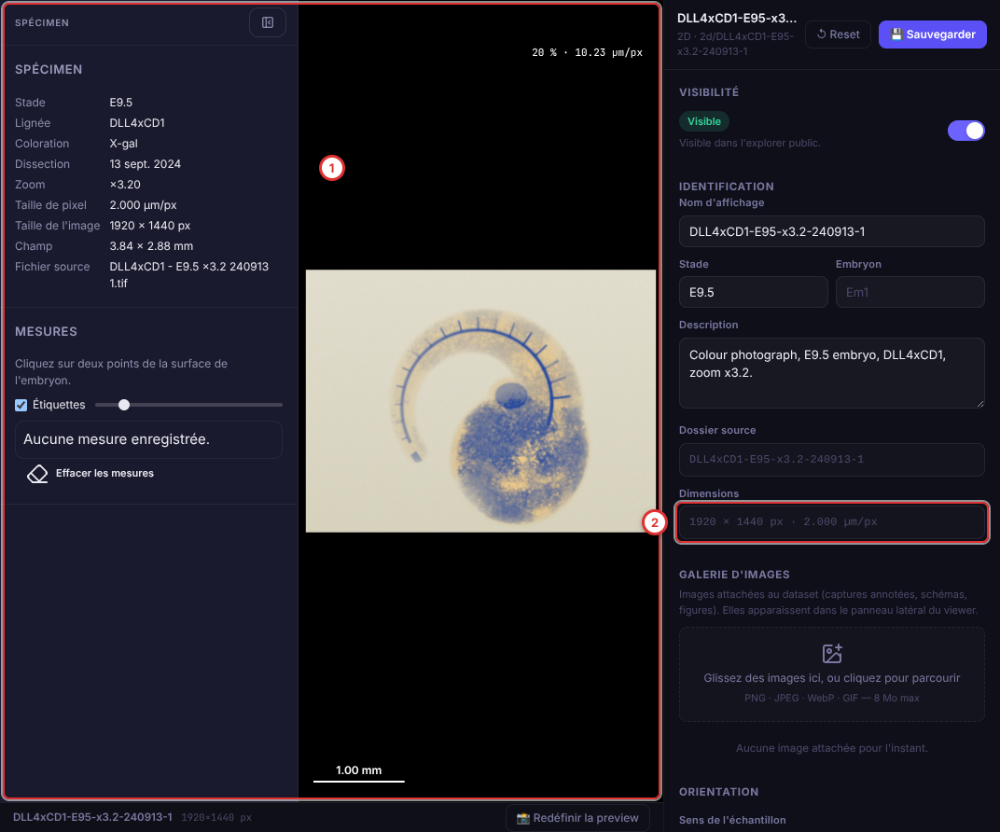{.shot width=88%}

::: legend
| n | ce que c'est |
|-|----------------------|
| 1 | L'**aperçu 2D** : photographie, barre d'échelle, panneau « Spécimen ». |
| 2 | **Dimensions** : « X × Y px · 0,xxx µm/px » (ou « non calibré »). |
:::

- **Calibration physique** et **Paramètres d'affichage** sont **absents**.
- La section s'appelle **Orientation** : rotation et miroir (plugin Orientation 2D), pas d'axes ni de vue par défaut.
- Pas de canaux : aucun n'est fabriqué à l'enregistrement.

## 3.10. Les datasets en cours d'import

Un dataset en cours d'envoi apparaît **dans cette liste** (filtre [Import]{.ui}), avec une pastille d'état à la place de l'œil. L'ouvrir affiche un **bandeau d'état** en haut de la colonne de droite.

:::::: cols-wide-right
::::: col
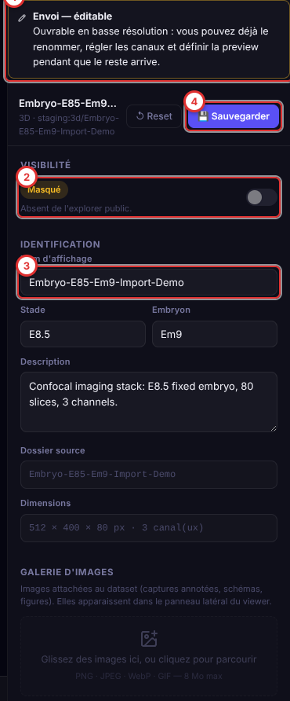{.shot width=100%}
:::::
::::: col
::: legend
| n | ce que c'est |
|-|----------------------|
| 1 | Le **bandeau d'état** (icône, état, phrase d'aide). |
| 2 | **Visibilité** : grisée, un import n'est pas encore public. |
| 3 | Les champs d'identification : **modifiables** dès que l'état est « éditable ». |
| 4 | [Sauvegarder]{.ui}. |
:::
:::::
::::::

| État | Ce que vous pouvez faire dans l'onglet Datasets |
|---|---|
| **Envoi — non éditable** | Rien : formulaire verrouillé, aperçu remplacé par un message. |
| **Envoi — éditable** | Tout éditer **sauf** Visibilité et Galerie. |
| **Envoyé — à publier** | Idem. Publier se fait dans l'onglet Import. |
| **Interrompu** | Rien : formulaire verrouillé. |

Le bandeau et le formulaire se **mettent à jour tout seuls** quand l'état change. Le bouton [Éditer]{.ui} de l'onglet Import ouvre directement le bon dataset, ici.

## 3.11. Quand aucun jeu de données n'est sélectionné

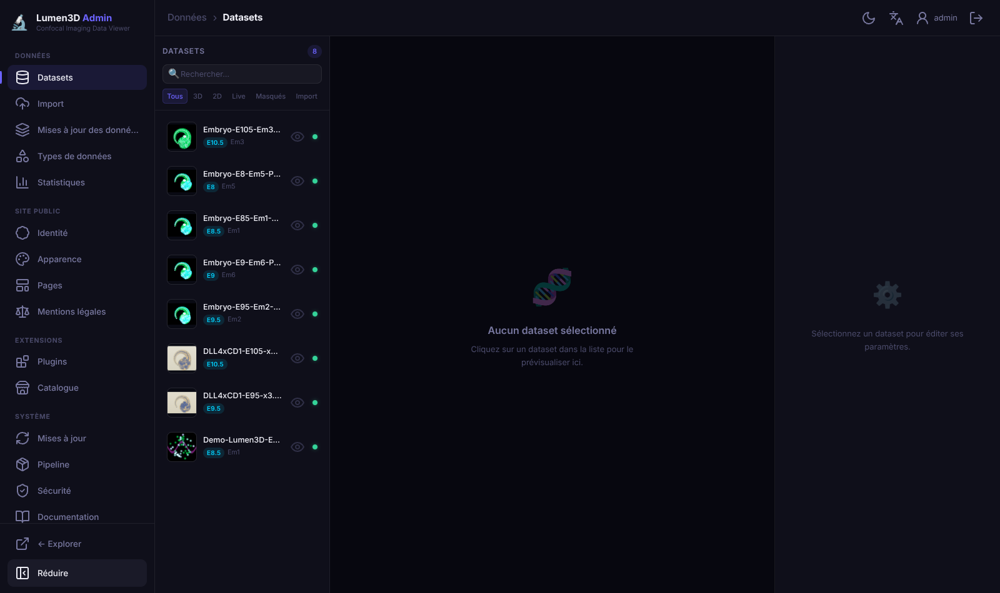{.shot width=80%}

C'est l'écran d'accueil de l'onglet : « Aucun dataset sélectionné — Cliquez sur un dataset dans la liste pour le prévisualiser ici. ». Il n'existe **pas** de bouton de suppression de dataset ni de « régénération du catalogue » : supprimer est une opération sur les fichiers du serveur, voulue ainsi, et la liste est recalculée à chaque affichage.

# 4. Import — envoyer des données depuis le navigateur

::: chapter-intro
- Vous **glissez le dossier** produit par le pipeline : plus besoin de FTP.
- Le transfert est **repris** là où il s'est arrêté, et **vérifié** octet par octet.
- Rien n'est public avant votre clic sur [Publier]{.ui} (puis sur l'œil, dans Datasets).
:::

::: analogy
**Un colis suivi, livré dans une consigne.** Vos fichiers voyagent dans une zone privée du serveur, inaccessible par URL. À l'arrivée, le serveur **pèse et contrôle** le colis. Vous seul décidez ensuite de le **mettre en rayon** (Publier), puis de l'**ouvrir au public** (l'œil).
:::

## 4.1. L'onglet vide

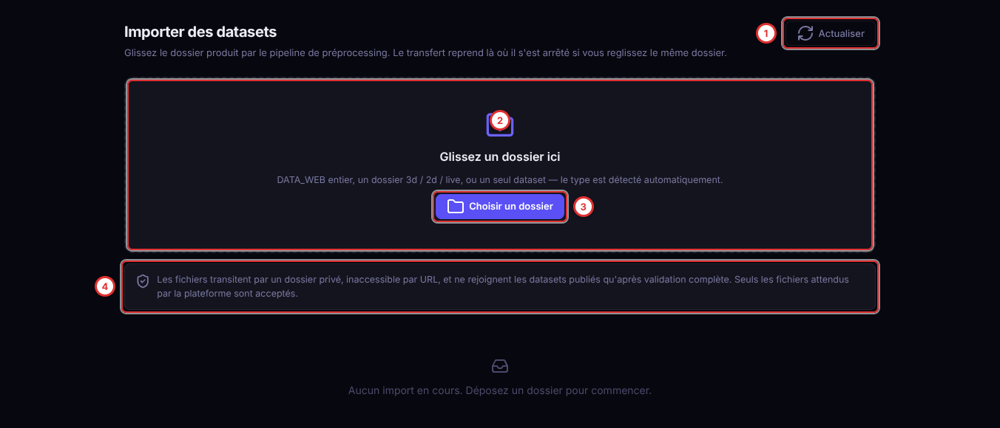{.shot width=88%}

::: legend
| n | ce que c'est |
|-|----------------------|
| 1 | [Actualiser]{.ui} : relit les imports en attente côté serveur. |
| 2 | La **zone de dépôt** : glissez-y un dossier (ou cliquez n'importe où dedans). |
| 3 | [Choisir un dossier]{.ui} : le sélecteur de dossier du navigateur. |
| 4 | Le **bandeau de sécurité** : zone privée, validation avant publication, fichiers attendus seulement. |
:::

Vous pouvez déposer **le `DATA_WEB` entier**, un dossier `3d` / `2d` / `live`, ou **un seul dataset** : le type est lu dans le `metadata.json` de chaque dataset, à n'importe quelle profondeur. Il faut déposer **le dossier du dataset, pas son contenu** : le nom du dossier devient l'identifiant.

::: tip
Un dossier lâché **à côté** de la zone est ignoré : le navigateur ne quitte pas la page et le transfert en cours n'est pas perdu.
:::

## 4.2. Un transfert en cours

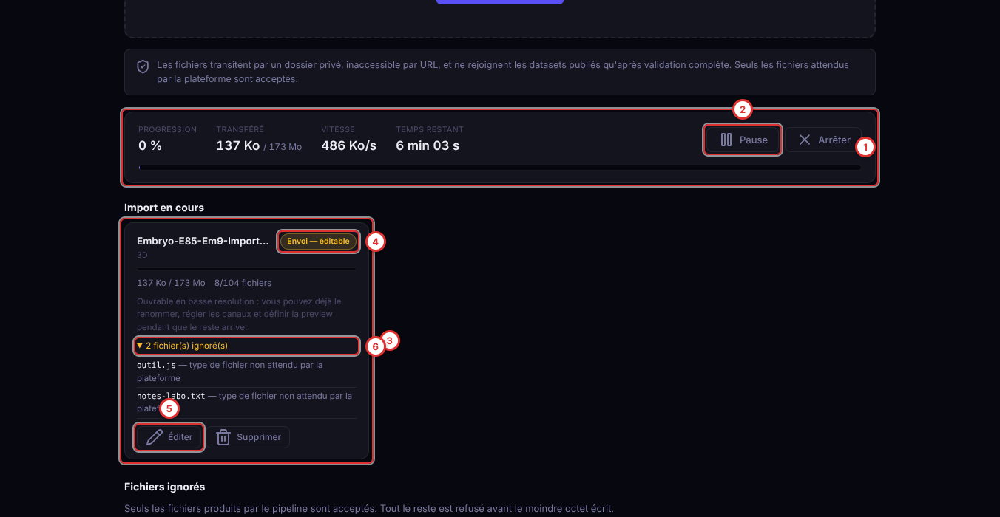{.shot width=88%}

::: legend
| n | ce que c'est |
|-|----------------------|
| 1 | La **progression globale** : [Progression]{.ui}, [Transféré]{.ui}, [Vitesse]{.ui}, [Temps restant]{.ui}, et la barre. |
| 2 | [Pause]{.ui} (devient [Reprendre]{.ui}) ; à côté, [Arrêter]{.ui}. |
| 3 | La **carte d'un dataset** : nom, type, octets, nombre de fichiers. |
| 4 | La **pastille d'état** (voir §4.3). |
| 5 | [Éditer]{.ui} : ouvre le dataset dans l'onglet Datasets, avant la fin du transfert. |
| 6 | Le menu **« n fichier(s) ignoré(s) »** : ce qui a été refusé dans ce dataset. |
:::

- [Arrêter]{.ui} demande confirmation : « Les fichiers déjà envoyés sont conservés et le transfert reprendra si vous reglissez le dossier. ».
- [Réessayer]{.ui} apparaît s'il reste des fichiers en échec.
- Si le réseau tombe : « Connexion perdue : le transfert reprendra tout seul dès que le réseau revient. ».
- La mention « déjà publié » apparaît si un dataset publié porte le même nom.

## 4.3. Les cinq états d'un import

| État | Ce que ça veut dire | Que faire |
|---|---|---|
| **Envoi — non éditable** | Les fichiers indispensables à l'ouverture ne sont pas tous arrivés (métadonnées, manifeste, vignette, niveau le plus grossier). | Attendre. |
| **Envoi — éditable** | « Ouvrable en basse résolution : vous pouvez déjà le renommer, régler les canaux et définir la preview pendant que le reste arrive. » | [Éditer]{.ui}, [Sauvegarder]{.ui}. |
| **Envoyé — à publier** | « Transfert complet et intégrité vérifiée. Publiez-le pour le déplacer vers les datasets publiés. » | [Éditer]{.ui}, [Vérifier]{.ui}, [Publier]{.ui}, [Supprimer]{.ui}. |
| **Interrompu** | « Reglissez le même dossier pour reprendre là où le transfert s'est arrêté. » | Reglisser le **même dossier**. |
| **Publié** | Déplacé vers les datasets publiés, **masqué** du public jusqu'à ce que vous l'activiez. | Aller dans Datasets. |

::: warning
Un import **interrompu** n'est pas gardé indéfiniment : la carte affiche « purge dans {d} », et au bout de **7 jours** sans reprise le serveur libère la place. Un import « Envoyé — à publier » n'est, lui, **jamais** purgé automatiquement.
:::

::: why
**Pourquoi « éditable » si tôt ?** Les fichiers partent par **paliers** : d'abord `metadata.json`, le manifeste et la vignette, puis le niveau le plus grossier de chaque canal, les niveaux intermédiaires, le natif, enfin `planes/`, `mips/` et `download/`. Après les deux premiers paliers, un dataset est ouvrable et éditable, **des minutes** après le début d'un transfert qui peut durer des heures. Le `metadata.json` que vous éditez est alors **verrouillé** : la suite du transfert ne l'écrase pas.
:::

## 4.4. Quand le transfert est terminé

{.shot width=88%}

::: legend
| n | ce que c'est |
|-|----------------------|
| 1 | La carte du dataset : 100 %, tous les fichiers. |
| 2 | L'état **Envoyé — à publier**. |
| 3 | [Éditer]{.ui} : renommer, régler canaux et orientation. |
| 4 | [Vérifier]{.ui} : lance la validation d'intégrité. |
| 5 | [Publier]{.ui} : déplace le dataset vers les datasets publiés. |
| 6 | [Supprimer]{.ui} : efface les fichiers déjà envoyés. |
:::

**[Vérifier]{.ui}** relit tout ce qui est arrivé et contrôle que chaque index de briques pointe vers des paquets bien présents. Toast « Dataset valide ✓ », ou « Validation échouée : » suivi de codes (par exemple `missing_pack:…` : un paquet manque ; `truncated_pack:…` : un paquet est tronqué ; `incomplete_files` ; `stray_files` ; `index_hash_mismatch`).

**[Publier]{.ui}** : toast « Dataset publié ✓ (masqué de l'explorer — activez-le dans l'onglet Datasets) ».

::: warning
**Publier ne rend pas le dataset public.** Il arrive **masqué**. Allez dans Datasets, ouvrez-le, activez [Visibilité]{.ui}.
:::

**Remplacer un dataset déjà publié** : si le nom existe déjà, le panneau demande « Un dataset publié porte déjà ce nom. Le remplacer ? Sa galerie d'images et les champs que vous avez renseignés (nom, orientation, légendes…) sont conservés quand le nouvel import ne les fournit pas. ». Après remplacement, un toast liste ce qui a été conservé (la galerie, etc.).

**[Supprimer]{.ui}** : « Supprimer définitivement les fichiers déjà envoyés pour ce dataset ? », puis « Import supprimé. ». Disponible dans tous les états sauf **Publié**.

## 4.5. Les fichiers ignorés

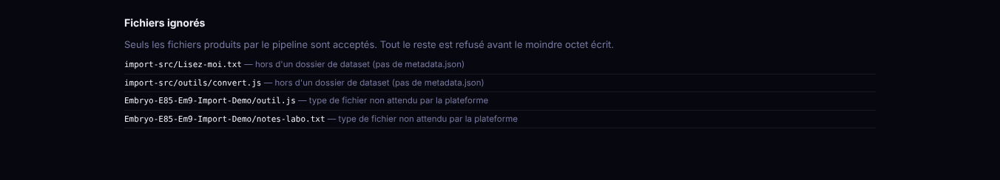{.shot width=88%}

Seuls les fichiers que produit le pipeline sont acceptés. **Tout le reste est refusé avant le moindre octet écrit** : les `.php` et `.js`, les fichiers cachés, les chemins remontants (`../`), les fichiers hors d'un dossier de dataset.

| Raison affichée | Ce que ça veut dire |
|---|---|
| type de fichier non attendu par la plateforme | Le pipeline n'écrit pas ce genre de fichier. |
| hors d'un dossier de dataset (pas de metadata.json) | Le fichier n'est pas dans un dataset. |
| chemin refusé, taille invalide | Nom ou taille inacceptable. |
| élément(s) illisible(s) lors de la lecture du dossier | Permissions locales à vérifier. |

Ce sont des **avertissements**, pas des blocages : le reste de l'import continue.

## 4.6. Le dock flottant

Dès qu'un import est à signaler, un petit **dock** s'ancre en bas à droite, **dans tous les onglets** : vous pouvez travailler ailleurs pendant que ça envoie. Il a trois tailles, mémorisées dans le navigateur.

:::: cols
::: col
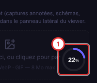{.shot width=70%}

| n | ce que c'est |
|-|----------------------|
| 1 | Anneau de progression et pourcentage. Un clic l'agrandit. |
:::
::: col
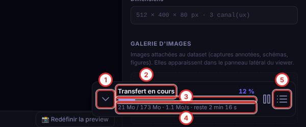{.shot width=88%}

| n | ce que c'est |
|-|----------------------|
| 1 | Chevron : réduire en bulle. |
| 2–4 | Titre d'état, barre, vitesse et temps restant. |
| 5 | [Détails]{.ui} : ouvre le panneau. |
:::
::::

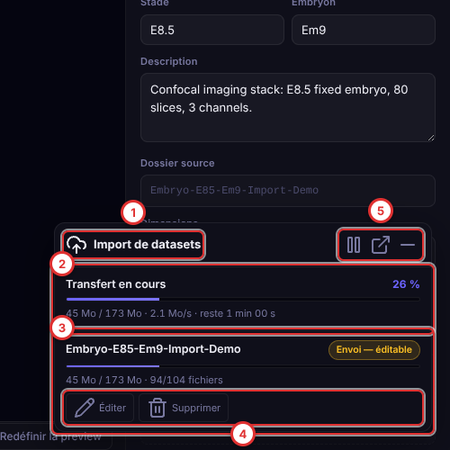{.shot width=70%}

::: legend
| n | ce que c'est |
|-|----------------------|
| 1 | Titre « Import de datasets ». |
| 2 | La progression globale. |
| 3 | Une **ligne par dataset** : nom, état, barre, octets, fichiers. |
| 4 | [Éditer]{.ui}, [Publier]{.ui}, [Supprimer]{.ui}. |
| 5 | Ouvrir l'onglet Import, réduire. |
:::

Titres d'état du dock : « Transfert en cours », « Transfert en pause », « Transfert terminé », « Terminé avec {n} fichier(s) en échec », « Connexion perdue, reprise automatique », « Imports en attente »…

## 4.7. Quitter pendant un transfert

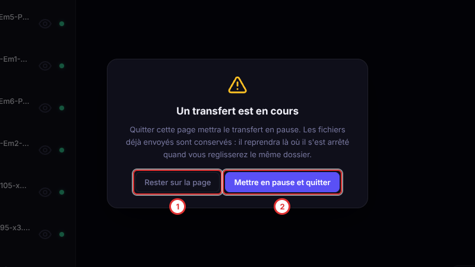{.shot width=70%}

::: legend
| n | ce que c'est |
|-|----------------------|
| 1 | [Rester sur la page]{.ui} : le transfert continue. |
| 2 | [Mettre en pause et quitter]{.ui} : le transfert est mis en pause, les fichiers envoyés sont gardés. |
:::

Ce message apparaît quand vous cliquez la **déconnexion** ou un lien qui quitte le panneau. Fermer ou recharger l'onglet déclenche la boîte de dialogue habituelle du navigateur ; le transfert est mis en pause avant. Pour reprendre : **reglissez le même dossier**.

## 4.8. Sous le capot

::: tech
- Le transfert tourne dans un **Web Worker** : l'interface reste fluide. Blocs bruts de **8 Mio** (réduits sur un hôte PHP aux limites strictes : « Taille de bloc réduite à {n} — relancez le dossier pour reprendre. »), **4 blocs en parallèle**.
- Chaque bloc porte une **empreinte SHA-256** vérifiée **avant** écriture. Un **journal serveur** retient les blocs reçus : reglisser le même dossier reprend **au bloc près** ; un fichier déjà complet n'est pas renvoyé.
- Le journal est le même sous les deux serveurs (Python ou PHP) : un import commencé sous l'un peut reprendre sous l'autre.
- Formats acceptés : les **formats 2 à 4** (`planes/`, `mips/`, briques v3 et `index.bin`).
:::

## 4.9. Si quelque chose se passe mal

| Message | Que faire |
|---|---|
| Aucun fichier détecté dans ce dépôt. | Le dossier est vide ou illisible : refaites le dépôt. |
| Aucun dataset trouvé : le dossier doit contenir un metadata.json. | Déposez le dossier produit par le pipeline. |
| Déposez le DOSSIER du dataset, pas son contenu… | Reglissez le dossier parent. |
| Type de dataset introuvable… | `metadata.json` doit déclarer `"type"` : `3d`, `2d` ou `live`. |
| Les imports exigent une connexion sécurisée (HTTPS, ou localhost)… | Ouvrez le panneau en `https://` : les empreintes SHA-256 l'exigent. |
| Espace disque insuffisant sur le serveur (… requis, … libres) | Libérez de la place. Le contrôle est fait **avant** d'envoyer. |
| « X » dépasse la taille qu'accepte le serveur pour un fichier. | Limite du serveur, à voir avec l'hébergeur. |
| Session expirée — reconnectez-vous puis reglissez le dossier. | Reconnectez-vous, reglissez. |
| Échec sur {chemin} / {n} fichier(s) n'ont pas pu être envoyés. | [Réessayer]{.ui}, ou reglissez le dossier. |
| Le serveur ne répond pas… / Le moteur de transfert n'a pas pu démarrer. | Vérifiez la connexion, rechargez la page, reglissez. |
| Tout est déjà envoyé — rien à transférer. | Information : le dataset est déjà complet. |

# 5. Mises à jour des données — le format des jeux de données

::: chapter-intro
- Un jeu de données publié a un **format** (1 à 4). Le format courant est le **4**.
- Cet onglet les met à niveau **sur place**, comme une mise à jour de logiciel.
- Vous choisissez **qui travaille** : ce navigateur ou le serveur. Rien n'est obligatoire.
:::

::: analogy
**Le déménagement d'une bibliothèque vers de nouveaux rayonnages.** Les livres (vos pixels) ne changent pas ; on ajoute des **index** et des **tablettes mieux rangées** pour qu'ils sortent plus vite. Si le déménagement s'interrompt, on reprend à la caisse où l'on s'était arrêté.
:::

## 5.1. Pourquoi et pour qui

Chaque dataset volumique (`3d`, `live`) porte un **format de données** (`formatVersion`, absent = format 1). Un dataset sorti du pipeline **0.21.0** est déjà au **format 4** : il n'a **rien** à faire. Les **photographies 2D** ne sont jamais concernées.

::: note
**Les mises à jour de données ne sont pas nécessaires pour que le site fonctionne.** Le visualiseur lit toujours les formats 1, 2, 3 et 4 ; le Studio retombe sur les briques si `planes/` manque. Elles **accélèrent** certaines opérations du Studio et **améliorent** la qualité d'affichage.
:::

## 5.2. Les trois étapes

Elles s'enchaînent dans l'ordre : un dataset en format 1 reçoit les trois.

| Étape | Titre à l'écran | Ce qu'elle crée | Ce que ça apporte |
|---|---|---|---|
| **1 → 2** | Copie par plans du niveau natif (coupes XY rapides dans le Studio) | `planes/` : un fichier par plan z, tuiles PNG 512² sans perte (≈ 1,3× le niveau natif en place disque). Les briques ne sont pas touchées. | Une coupe XY native lit **un plan** au lieu d'une couche de 64 plans : des dizaines de fois moins d'octets, résultat identique au pixel. |
| **2 → 3** | Projections maximales de chaque couche de briques (figures z-stack de toute la pile rapides) | `mips/` : une projection maximale par couche de 64 plans. | Une figure z-stack sur toute la pile lit ~3 paquets au lieu d'environ 150. |
| **3 → 4** | Pyramide de briques v3 : réduite aussi en Z, bordure d'un voxel, index binaire | **Reconstruit** `bricks/` : briques 66³ avec bordure, niveaux réduits aussi en Z, `index.bin`. | Filtrage sans couture, détail local (« Zoom detail »), atlas plus légers pour 1 à 2 canaux. |

::: warning
**L'étape 3 → 4 reconstruit l'arbre `bricks/`.** Le **niveau natif est conservé voxel pour voxel** ; les niveaux plus grossiers sont recalculés. L'ancien arbre est supprimé **après** le changement de version. Pour des données précieuses, gardez une copie de sauvegarde, comme pour toute opération sur des fichiers.
:::

## 5.3. Vue d'ensemble de l'onglet

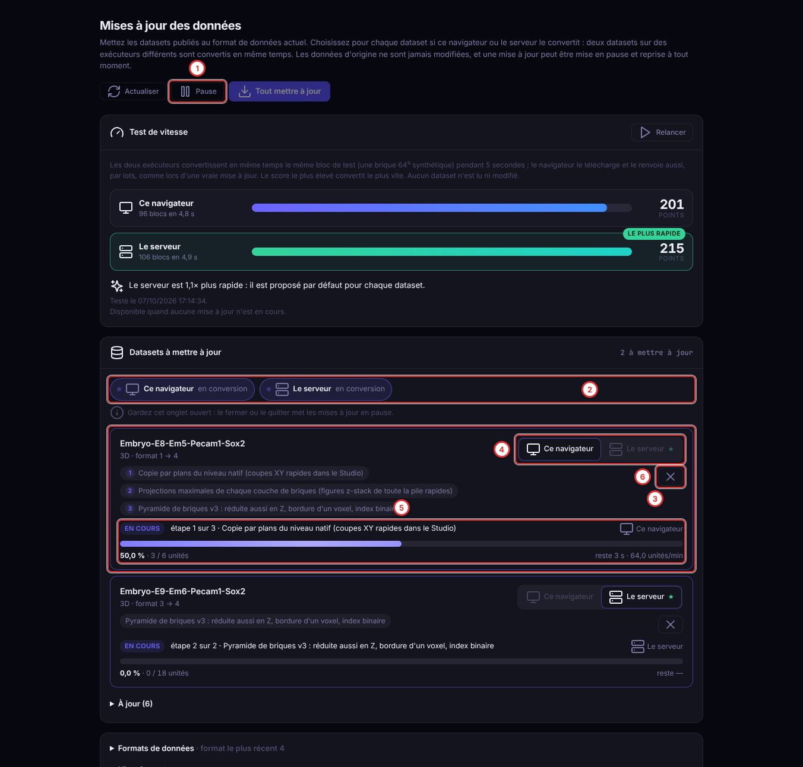{.shot width=88%}

::: legend
| n | ce que c'est |
|-|----------------------|
| 1 | [Pause]{.ui} (ou [Reprendre]{.ui}) ; à côté [Actualiser]{.ui} et [Tout mettre à jour]{.ui}. |
| 2 | La **bande des deux files** : une pastille par exécutant, avec son état. |
| 3 | La **carte d'un dataset** : nom, type, « format 1 → 4 », unités et taille estimées, **étapes** numérotées. |
| 4 | Le **sélecteur d'exécutant** : [Ce navigateur]{.ui} ou [Le serveur]{.ui}. |
| 5 | La zone de **progression** : « étape i sur n », barre, pourcentage, unités faites, **temps restant**, unités par minute. |
| 6 | La croix : **annuler** : « Abandonner la progression de cette mise à jour ? Le jeu de données reste tel quel. » |
:::

De haut en bas : l'en-tête et ses boutons, la carte **Test de vitesse**, la carte **Datasets à mettre à jour**, puis trois volets repliables : **À jour**, **Formats de données**, **Historique**. [Tout mettre à jour]{.ui} traite tous les datasets prêts, un par exécutant à la fois.

Tout à jour : « Tous les datasets sont au dernier format. ». Aucun volume publié : « Aucun jeu de données volumique publié. ».

## 5.4. Ce navigateur ou le serveur ?

Deux « exécutants » peuvent faire le travail :

| Exécutant | Qui calcule | Ce qu'il faut |
|---|---|---|
| **Ce navigateur** | Votre navigateur télécharge les briques, les recompose (Web Workers) et renvoie le résultat **unité par unité**. | Un navigateur qui sait compresser, relire les PNG à l'identique et encoder du WebP sans perte. |
| **Le serveur** | Le serveur convertit lui-même, par petites requêtes bornées dans le temps. Adapté aux hébergements mutualisés. | Décodage (et, pour l'étape 3 → 4, encodage) du WebP sans perte (GD de PHP ou Pillow de Python), zlib, NumPy côté Python, au moins 128 Mio par requête et 10 s d'exécution. |

- Le choix se fait **par dataset**, **avant** de démarrer ; il est **verrouillé pendant l'exécution**, modifiable entre deux exécutions.
- Un exécutant incapable est **grisé**, avec une info-bulle qui dit pourquoi (par exemple « le serveur ne sait pas décoder les images WebP sans perte »).
- Chaque exécutant a **sa propre file** : un dataset sur le navigateur et un autre sur le serveur se convertissent **en même temps**.
- Une étape que l'exécutant choisi ne sait pas faire est confiée à l'autre. Si aucun ne peut : « aucun exécuteur » en rouge.
- La pastille **★** marque l'exécutant **le plus rapide au test de vitesse**.
- Les deux écrivent dans **le même journal** côté serveur : on peut changer d'exécutant et reprendre.

::: tip
Sur un hébergement mutualisé où l'option [Le serveur]{.ui} est grisée, **[Ce navigateur]{.ui} fonctionne toujours** : c'est lui qui travaille, le serveur ne fait que stocker.
:::

## 5.5. Le test de vitesse

Un seul bouton : [Lancer le test (5 s)]{.ui} (puis [Relancer]{.ui}). Pendant 5 secondes (deux barres en course, une par exécutant), le navigateur **et** le serveur convertissent **en même temps** le même bloc synthétique (une brique 64³ livrée avec la plateforme). **Aucun dataset n'est lu ni modifié.**

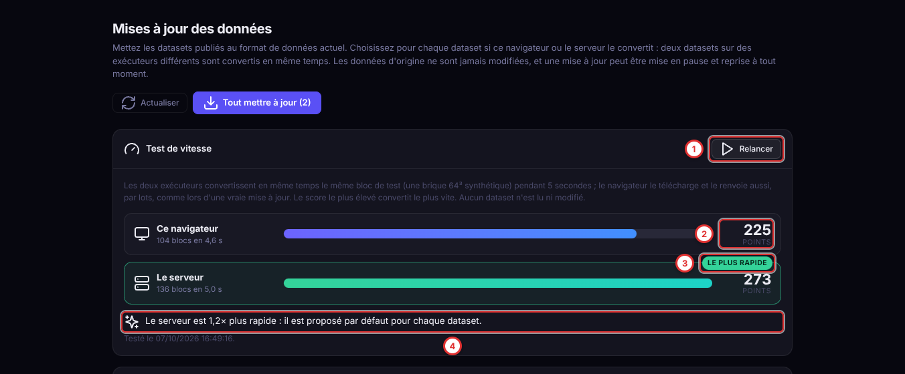{.shot width=88%}

::: legend
| n | ce que c'est |
|-|----------------------|
| 1 | [Relancer]{.ui} le test. |
| 2 | Le score de **Ce navigateur**. |
| 3 | Le badge **Le plus rapide**. |
| 4 | Le **verdict** : « Le serveur est 1,2× plus rapide : il est proposé par défaut pour chaque dataset. » |
:::

Si les deux sont aussi rapides : « Les deux exécuteurs sont aussi rapides : choisissez librement. ». Un côté inutilisable affiche **sa raison** au lieu d'un score. Le résultat est conservé dans ce navigateur (« Testé le … »). Le test est indisponible pendant une mise à jour.

## 5.6. Lancer une mise à jour, pas à pas

::: steps
1. (Facultatif) Lancez le **test de vitesse**.
2. Pour chaque dataset, choisissez l'**exécutant** (la ★ est proposée d'office).
3. Cliquez [Mettre à jour]{.ui}, ou [Tout mettre à jour (n)]{.ui}.
4. **Gardez l'onglet ouvert** jusqu'à la fin : « le fermer ou le quitter met les mises à jour en pause ».
5. Un toast « {nom} mis à jour au format {v} » confirme chaque dataset terminé.
:::

Le bouton principal s'appelle [Réparer]{.ui} si le dataset se dit à jour mais que sa structure est manquante ou invalide (pastille « réparation »), [Reprendre]{.ui} si un travail est en pause, [Réessayer]{.ui} après un échec.

## 5.7. Pendant la conversion

États affichés : **En attente de son tour** (« prochain sur le serveur »), **En cours**, **Mise en pause…**, **En pause** (avec la cause : onglet quitté, page fermée, session expirée, serveur injoignable), **Assemblage** (« Assemblage des plans x/y », « assemblage et publication… »), **Échec** (avec la cause).

- **[Pause]{.ui}** met toutes les files en pause ; **[Reprendre]{.ui}** repart là où elles s'étaient arrêtées.
- **Quitter l'onglet** : « Une mise à jour est en cours. Quitter cet onglet la met en pause (vous pourrez la reprendre). Quitter ? ». **Rien n'est perdu** : le journal serveur permet de reprendre après un rechargement, une coupure ou un changement d'exécutant.

::: warning
**Ne lancez pas la même mise à jour dans plusieurs onglets**, et ne relancez pas en boucle. En version 1.59.1, un afflux de requêtes avait conduit un hébergeur à **bannir l'adresse** d'un opérateur. Depuis la 1.59.2, **toutes** les requêtes de l'onglet passent par un **régulateur** (6 en vol au plus ; depuis la 1.59.3, 4 à 6 par seconde, car chaque unité lit toutes ses données d'entrée en une seule requête ; il ralentit et marque une pause quand l'hôte répond lentement ou renvoie 429 / 503). Vous pouvez voir : « L'hébergeur répond lentement : les requêtes sont ralenties pour qu'il ne bloque pas cette adresse. » ou « Connexion perdue — en attente du réseau, rien n'est perdu. ». **Laissez faire.**
:::

## 5.8. Les volets du bas

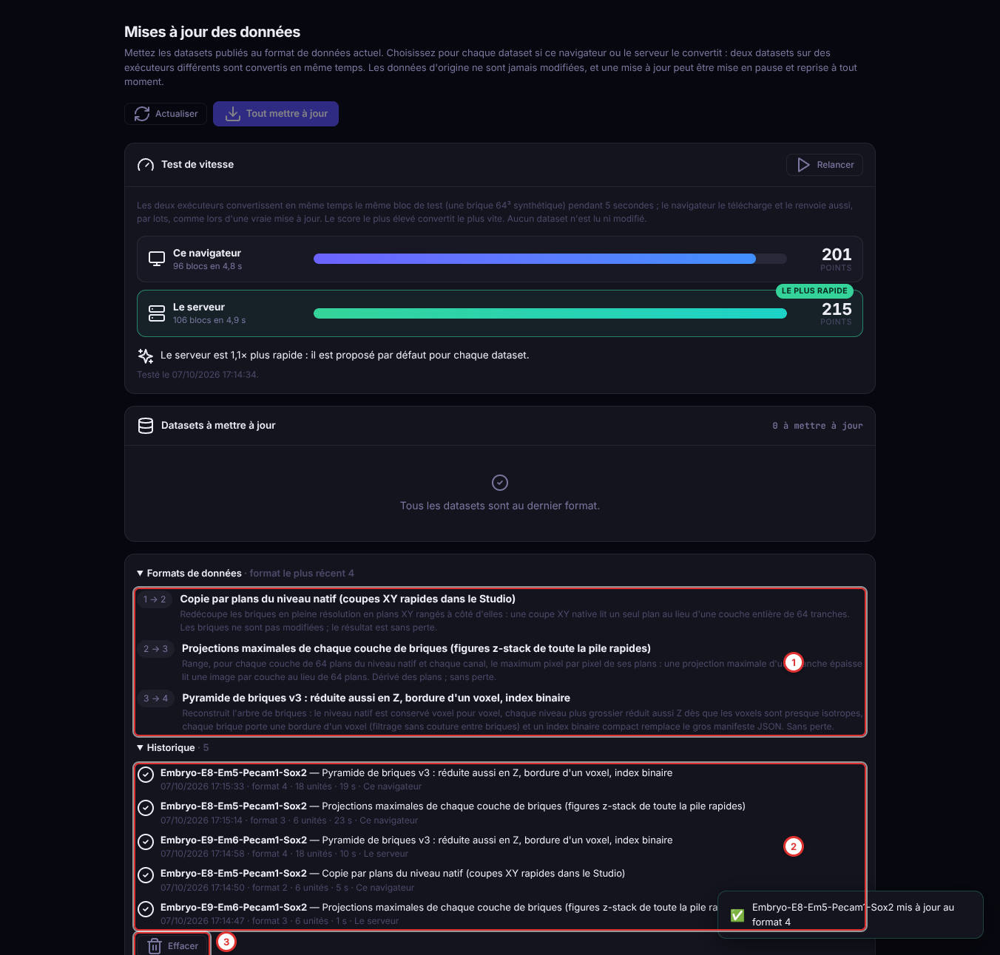{.shot width=88%}

::: legend
| n | ce que c'est |
|-|----------------------|
| 1 | **Formats de données** : le format le plus récent (4) et la liste des trois mises à jour (« 1 → 2 »…). |
| 2 | **Historique** : les 20 dernières opérations, mémorisées dans ce navigateur. |
| 3 | [Effacer]{.ui} : vide l'historique. |
:::

Une ligne d'historique indique « format {v} · {n} unités · {durée} · {exécutant} », ou la **raison de l'échec**. Le volet **À jour (n)** liste les datasets déjà au bon format.

## 5.9. Garde-fous et erreurs

- **Disque** : le panneau refuse de démarrer si le résultat ne tient pas (« espace disque insuffisant sur le serveur (requis / libre) »).
- **Données d'origine** : jamais modifiées avant la bascule finale ; l'étape finale est **reprenable** et se fait sous le même verrou que l'éditeur de dataset.
- **Dataset retraité entre-temps** : « le jeu de données a été retraité depuis le début de la mise à jour » → [Réessayer]{.ui} repart de zéro. Un dataset supprimé n'est **jamais recréé**.
- **Serveur trop lent pour une unité** (hébergement mutualisé) : l'étape bascule seule **dans le navigateur** après deux requêtes mortes.

| Message | Que faire |
|---|---|
| Session expirée — reconnectez-vous puis reprenez. | Reconnectez-vous, [Reprendre]{.ui}. |
| Échec de la mise à jour de {nom} : … | Lisez la cause ; [Réessayer]{.ui}, ou changez d'exécutant. |
| Aucun exécuteur ne peut réaliser toutes les étapes de : … | Essayez [Ce navigateur]{.ui}, ou retraitez avec le pipeline. |
| Mise à jour de {nom} arrêtée : le serveur ne peut pas convertir une unité dans son délai. | Relancez-la dans ce navigateur. |
| Impossible de lire l'état des mises à jour. | [Actualiser]{.ui}. |

# 6. Types de données — le nom public de chaque catégorie

::: chapter-intro
- La plateforme range chaque dataset dans l'une de **trois catégories** : 3D, 2D, Live.
- Vous décidez du **mot** que le public voit pour chacune.
- Vous ne changez **que des noms affichés** : jamais un dossier, une adresse ou un fichier.
:::

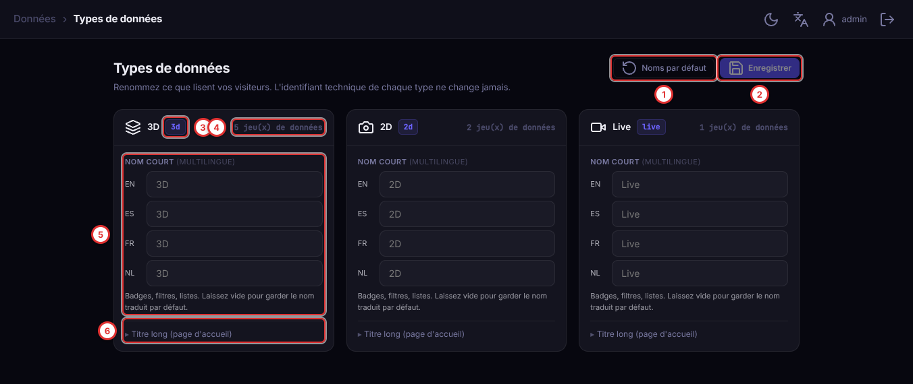{.shot width=88%}

::: legend
| n | ce que c'est |
|-|----------------------|
| 1 | [Noms par défaut]{.ui} : vide les champs (il faut ensuite [Enregistrer]{.ui}). |
| 2 | [Enregistrer]{.ui} (<kbd>Ctrl</kbd> + <kbd>S</kbd>), actif seulement s'il y a une modification. |
| 3 | L'**identifiant technique** du type (`3d`, `2d`, `live`) : non modifiable. |
| 4 | Le nombre de **jeux de données** publiés de ce type. |
| 5 | **Nom court (multilingue)** : une ligne par langue (EN, FR, ES, NL). |
| 6 | **Titre long (page d'accueil)** : volet repliable. |
:::

| Catégorie | Ce qu'elle contient | Nom par défaut (français) |
|---|---|---|
| **3D** (`3d`) | Un volume figé : pile d'images 3D multicanal | 3D · « Imagerie 3D » |
| **2D** (`2d`) | Une photographie calibrée de stéréomicroscope | 2D · « Imagerie 2D » |
| **Live** (`live`) | Une série temporelle 4D, avec éventuellement le suivi de ses cellules | Live · « Imagerie en direct » |

- **Nom court** — pastilles, filtres, listes. **Titre long** — grandes cartes de la page d'accueil.
- **Laissez un champ vide pour garder le nom par défaut** : la plateforme retombe alors sur sa propre traduction, dans la langue du visiteur.
- [Noms par défaut]{.ui} demande « Rétablir les noms traduits par défaut pour tous les types ? ». Il **vide** les champs, il n'écrit pas de texte figé.
- Résultat : toast « Noms des types enregistrés. » (ou « Échec de l'enregistrement. »).

::: note
**Ce que cet onglet ne change pas.** Ni les dossiers du serveur (`DATA_WEB/3d/`, `DATA_WEB/2d/`, `DATA_WEB/live/`), ni les adresses des pages, ni les liens déjà enregistrés par vos visiteurs, ni rien dans les datasets. Il **ne crée pas** de catégorie : les trois types sont ceux que le logiciel sait afficher. Le suivi cellulaire n'est **pas** un type : c'est une couche d'un dataset Live.
:::

Les variables de page `{type3d}`, `{type2d}` et `{typeLive}` (chapitre 10) reprennent ces noms. L'onglet n'écrit que le bloc `datasetTypes` de la configuration : il n'écrase pas ce que vous avez fait dans Identité. Il vous prévient si vous le quittez avec des modifications.

# 7. Statistiques — qui consulte quoi

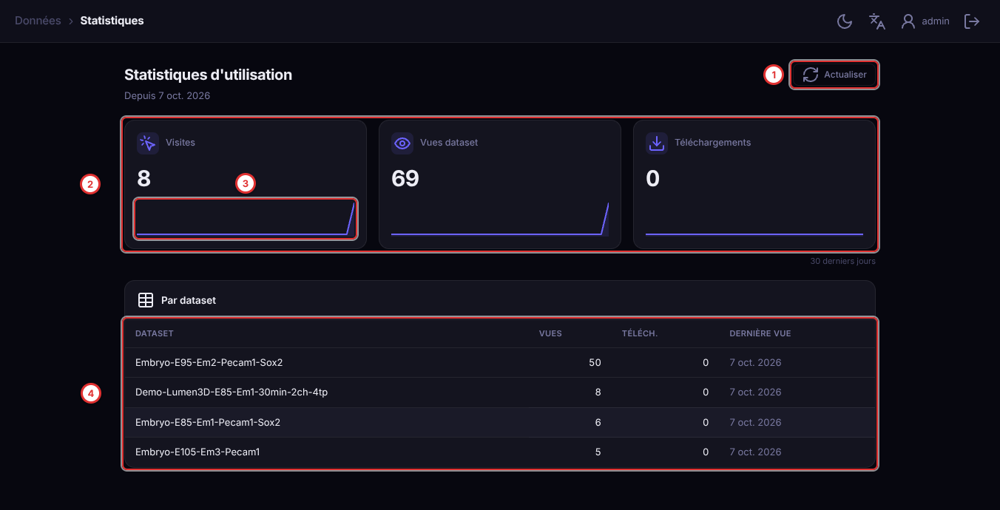{.shot width=88%}

::: legend
| n | ce que c'est |
|-|----------------------|
| 1 | [Actualiser]{.ui} : recharge les chiffres. |
| 2 | Trois **compteurs** cumulés depuis l'installation. |
| 3 | La petite courbe des **30 derniers jours**. |
| 4 | Le détail **par jeu de données** ; cliquez un en-tête (Dataset, Vues, Téléch.) pour trier. |
:::

- **Visites** — ouvertures d'une page du site.
- **Vues dataset** — fois où un jeu de données a été ouvert dans le visualiseur : l'indicateur le plus parlant.
- **Téléchargements** — fichiers récupérés depuis le Download Center.

Le tableau « Par dataset » donne vues, téléchargements et dernière consultation. Sans donnée : « Aucune donnée d'utilisation pour le moment. ». Renommer un type ne change pas ces chiffres.

::: note
**Aucune donnée personnelle n'est collectée.** Ce sont de simples compteurs : ni cookie de suivi, ni adresse IP enregistrée, ni service externe. Rien ne sort du serveur. Le serveur limite en outre le débit des balises de statistiques.
:::

# 8. Identité — le nom et le vocabulaire du site

::: chapter-intro
- Renommer **entièrement** le site, sans toucher au code.
- Le **mot** qui désigne vos objets d'étude (embryon, échantillon, organe…) est repris **partout**.
- Chaque texte existe **par langue** : EN, FR, ES, NL.
:::

C'est ce qui permet à la même plateforme de servir un laboratoire d'embryologie ou un institut de neurosciences. Titre réel de la page : « Identité & personnalisation ».

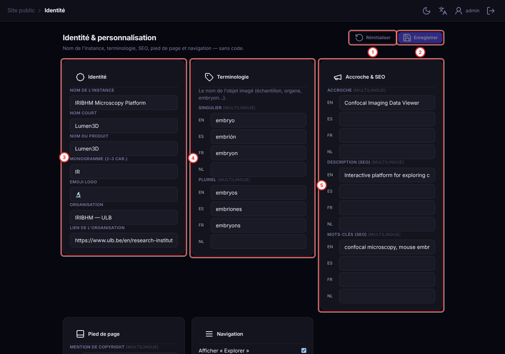{.shot width=88%}

::: legend
| n | ce que c'est |
|-|----------------------|
| 1 | [Réinitialiser]{.ui} : revient aux valeurs par défaut (« Le contenu métier sera retiré. »). |
| 2 | [Enregistrer]{.ui} : actif dès qu'un champ change. |
| 3 | Carte **Identité** : les noms de votre site. |
| 4 | Carte **Terminologie** : le mot qui désigne vos objets d'étude. |
| 5 | Carte **Accroche & SEO**. |
| 6 | Un champ **multilingue** : une ligne par langue. |
:::

## 8.1. Les champs multilingues

Les champs **(MULTILINGUE)** affichent **une ligne par langue disponible** : `EN`, `FR`, `ES`, `NL`.

::: tip
**Remplissez toujours `EN` au minimum.** C'est la version de secours : si un visiteur lit le site en néerlandais et que `NL` est vide, il voit le texte anglais, jamais un blanc.
:::

## 8.2. Carte « Identité »

| Champ | À quoi ça sert | Exemple |
|---|---|---|
| **Nom de l'instance** | Le nom complet, utilisé dans les titres de page | `IRIBHM Microscopy Platform` |
| **Nom court** | Utilisé là où la place manque | `Lumen3D` |
| **Nom du produit** | Le nom du logiciel dans les textes | `Lumen3D` |
| **Monogramme (2–3 car.)** | Les lettres de la pastille du logo | `IR` |
| **Emoji logo** | L'emoji affiché à côté du nom | 🔬 |
| **Organisation** | Votre laboratoire ou institution | `IRIBHM — ULB` |
| **Lien de l'organisation** | L'adresse de son site | `https://…` |

## 8.3. Carte « Terminologie » — la plus utile

Vous définissez **le mot qui désigne ce que vous imagez** (« Le nom de l'objet imagé (échantillon, organe, embryon…). »), au **singulier** et au **pluriel**, dans chaque langue.

Ce mot est ensuite repris **automatiquement** dans toute l'interface publique : titres, filtres, statistiques, descriptions. Écrivez `embryon / embryons` et le site parlera d'embryons ; écrivez `échantillon / échantillons`, et il parlera d'échantillons. Partout, sans autre modification. Dans l'éditeur de Datasets, le champ s'appelle « Embryon » ou « Échantillon »… selon votre choix.

## 8.4. Cartes « Accroche & SEO », « Pied de page » et « Navigation »

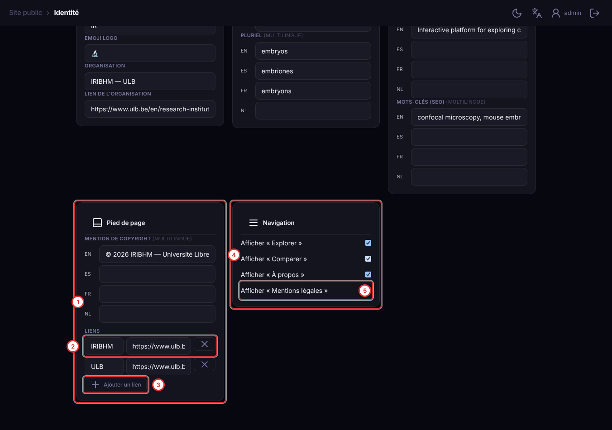{.shot width=88%}

::: legend
| n | ce que c'est |
|-|----------------------|
| 1 | Carte **Pied de page** : la mention de copyright (par langue). |
| 2 | Un **lien** du pied de page : [Libellé]{.ui} + adresse ; la croix le retire. |
| 3 | [Ajouter un lien]{.ui}. |
| 4 | Carte **Navigation**. |
| 5 | Les cases qui décident des entrées du menu public. |
:::

- **Accroche** — le sous-titre affiché sous le nom du site.
- **Description (SEO)** — le résumé qu'affichent Google et les réseaux sociaux : deux phrases claires suffisent.
- **Mots-clés (SEO)** — quelques termes séparés par des virgules.
- **Navigation** — les cases « Afficher « Explorer » », « Afficher « Comparer » », « Afficher « À propos » », « Afficher « Mentions légales » ». Décocher retire l'entrée du menu **sans supprimer la page**.

::: warning
**« Mentions légales » est décochée par défaut.** Si vous rédigez vos mentions (chapitre 11), revenez ici pour la cocher : la page reste invisible sinon.
:::

::: note
Les **pages personnalisées** créées dans l'onglet Pages sont ajoutées **toutes seules** au menu à leur première publication (chapitre 10) : il n'y a plus rien à cocher ici pour elles.
:::

Réinitialiser demande « Réinitialiser l'identité aux valeurs par défaut ? ». Toasts : « Identité enregistrée. » / « Identité réinitialisée. ». L'enregistrement ne réécrit **que les clés de cet onglet** : une modification faite entre-temps dans Types de données ou Pages n'est pas écrasée. <kbd>Ctrl</kbd> + <kbd>S</kbd> enregistre ; un avertissement s'affiche si vous quittez avec des modifications.

# 9. Apparence — les couleurs du site

::: chapter-intro
- Couleurs, police et arrondis du **site public**, avec **aperçu en direct**.
- Rien n'est appliqué avant [Enregistrer]{.ui}.
- Les boutons restent **lisibles** : le contraste est calculé pour vous.
:::

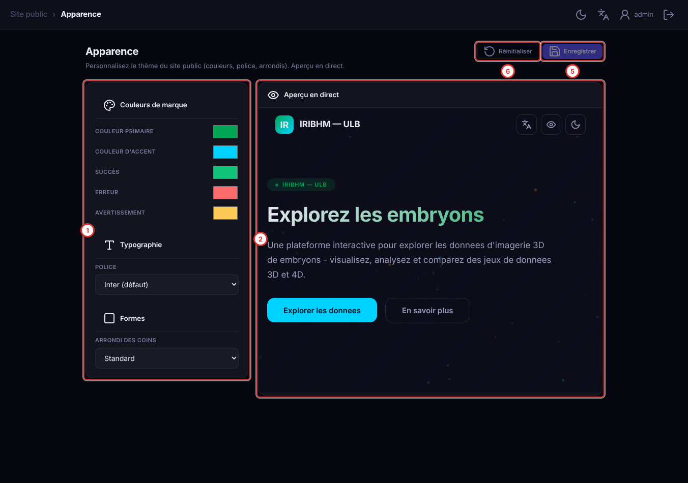{.shot width=88%}

::: legend
| n | ce que c'est |
|-|----------------------|
| 1 | **Couleurs de marque**. |
| 2 | **Typographie** : la police. |
| 3 | **Formes** : l'arrondi des coins. |
| 4 | **Aperçu en direct** : pas encore publié. |
| 5 | [Enregistrer]{.ui} : applique le thème au site public. |
| 6 | [Réinitialiser]{.ui} : « Réinitialiser le thème aux valeurs par défaut ? ». |
:::

## 9.1. Les couleurs

| Couleur | Où elle apparaît |
|---|---|
| **Couleur primaire** | La dominante : boutons principaux, liens, éléments actifs |
| **Couleur d'accent** | La secondaire, pour les mises en valeur |
| **Succès** | Les confirmations (vert par défaut) |
| **Erreur** | Les messages d'erreur (rouge par défaut) |
| **Avertissement** | Les alertes (orange par défaut) |

Cliquez sur un carré de couleur pour ouvrir le sélecteur : **l'aperçu se met à jour instantanément**. Les boutons principaux sont dérivés de la couleur de l'instance et respectent le contraste **WCAG AA** ; le thème enregistré s'applique avant le premier affichage.

::: tip
Gardez Succès / Erreur / Avertissement **proches du vert / rouge / orange** : ce sont des repères universels.
:::

## 9.2. Typographie et formes

- **Police** — Inter (par défaut), Système, Grotesque, Serif, Arrondie.
- **Arrondi des coins** — Standard, Net, Doux, Rond : de anguleux à très arrondi, sur boutons et cartes.

## 9.3. Publier le thème

Rien n'est appliqué au site public avant [Enregistrer]{.ui} (« Thème enregistré. » / « Échec de l'enregistrement du thème. »). <kbd>Ctrl</kbd> + <kbd>S</kbd> fonctionne ; l'onglet vous prévient si vous le quittez avec des modifications.

::: warning
**Vérifiez le contraste.** Une couleur primaire très claire sur fond clair devient illisible. Après enregistrement, ouvrez le site public et vérifiez que tout se lit, en thème clair **et** sombre.
:::

# 10. Pages — l'éditeur visuel

::: chapter-intro
- Modifier le contenu des pages du site **comme dans un logiciel de mise en page**.
- Brouillon enregistré tout seul ; **rien n'est public avant [Publier]{.ui}**.
- 27 éléments, sections, colonnes, traduction, variables : sans écrire une ligne de code.
:::

C'est la fonction la plus riche du panneau.

## 10.1. Choisir une page

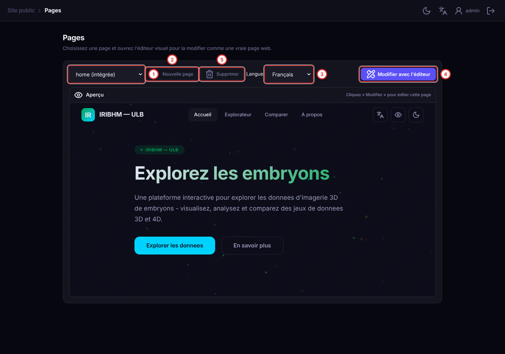{.shot width=88%}

::: legend
| n | ce que c'est |
|-|----------------------|
| 1 | La **page** à modifier. |
| 2 | [Nouvelle page]{.ui}. |
| 3 | La **langue** que vous éditez. |
| 4 | [Modifier avec l'éditeur]{.ui} : ouvre l'éditeur plein écran. |
| 5 | [Supprimer]{.ui} : efface une page que vous avez créée. |
:::

Deux pages existent d'origine : **`home`** (l'accueil) et **`about`** (À propos). La mention *(intégrée)* signifie qu'elles utilisent encore le modèle fourni : dès votre première publication, votre version prend le relais. Elles ne peuvent **pas** être supprimées (« réinitialisez-les » depuis l'éditeur).

Les modèles d'accueil et À propos ne contiennent plus de carte « Tracking » ni « Wholemount » : ces catégories n'existent plus.

## 10.2. L'éditeur

L'éditeur s'ouvre **dans son propre onglet** pour disposer de tout l'écran.

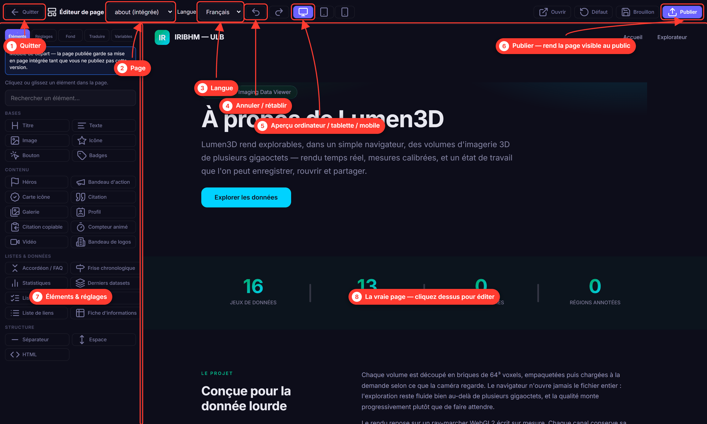{.shot width=88%}

::: legend
| n | ce que c'est |
|-|----------------------|
| 1 | **Quitter** : revient au panneau. |
| 2 | La page en cours d'édition. |
| 3 | La langue éditée. |
| 4 | **Annuler / Rétablir** (<kbd>Ctrl</kbd> + <kbd>Z</kbd> / <kbd>Ctrl</kbd> + <kbd>Y</kbd>). |
| 5 | Aperçu **ordinateur / tablette / mobile**. |
| 6 | **Publier** : rend la version visible au public. |
| 7 | La **barre latérale** : éléments à insérer, réglages de la sélection. |
| 8 | **La vraie page** : son vrai menu, son vrai pied de page, son vrai thème. |
:::

### La barre du haut

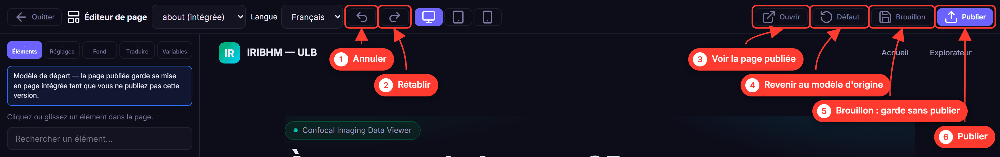{.shot width=88%}

::: legend
| n | ce que c'est |
|-|----------------------|
| 1 – 2 | **Annuler** et **Rétablir**. |
| 3 | **Ouvrir** : affiche la page publiée dans un nouvel onglet, pour comparer. |
| 4 | **Défaut** : revient au modèle d'origine. Efface votre mise en page. |
| 5 | **Brouillon** : enregistre sans publier. |
| 6 | **Publier** : met votre version en ligne. |
:::

::: remember
**Brouillon ≠ Publier.** Tant que vous n'avez pas cliqué [Publier]{.ui}, les visiteurs voient l'ancienne version. Vous pouvez travailler plusieurs jours sans rien casser.
:::

### L'indicateur d'enregistrement

L'éditeur enregistre **automatiquement le brouillon**, jamais la version publiée. Une pastille dit où vous en êtes :

| Pastille | Sens |
|---|---|
| ● Non enregistré | Des modifications attendent. |
| ✓ Enregistré hh:mm | Le brouillon est à jour. |
| ⚠ Échec de la sauvegarde auto, cliquez pour réessayer | Nouvelle tentative automatique, et au retour du réseau. |
| 🔒 Ouverte dans un autre onglet, cliquez pour reprendre | Verrou entre deux onglets d'édition de la **même page**. |
| ⚠ Page illisible — rechargez avant de modifier | Le contenu n'a pas pu être lu. |

- Reprendre la main sur une page ouverte ailleurs demande « Cette page est ouverte dans un autre onglet. Enregistrer ici écrasera ses modifications. Continuer ? ».
- Une sauvegarde venue d'un onglet **périmé** est **refusée** plutôt que d'écraser une version plus récente.
- Changer de page enregistre d'abord l'ancienne ; si cela échoue : « Les dernières modifications de cette page n'ont pas pu être enregistrées. Changer de page quand même ? ». Quitter : « Modifications non enregistrées. Quitter sans publier ? ».

## 10.3. Ajouter un élément

L'onglet **Éléments** de la barre latérale contient tout ce qui peut être posé dans une page.

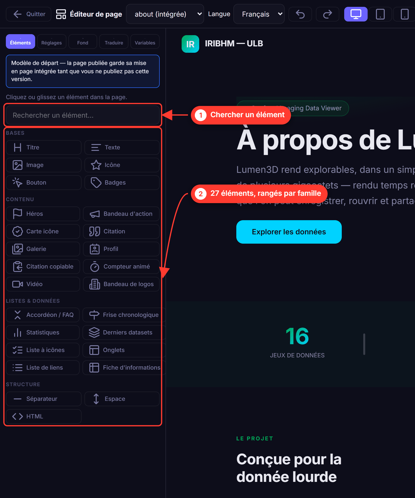{.shot width=50%}

- **Cliquez** sur un élément : il s'ajoute à la fin de la page.
- **Glissez-le** à l'endroit voulu : des zones de dépôt apparaissent.

Le champ **Rechercher un élément** filtre la liste : il y en a **27**.

**Bases**

| Élément | Ce que c'est |
|---|---|
| **Titre** | Un titre de section |
| **Texte** | Un paragraphe |
| **Image** | Une image |
| **Icône** | Un pictogramme |
| **Bouton** | Un bouton cliquable |
| **Badges** | De petites étiquettes colorées |

**Contenu**

| Élément | Ce que c'est |
|---|---|
| **Héros** | Le grand bandeau d'introduction |
| **Bandeau d'action** | Un encart qui invite à cliquer |
| **Carte icône** | Icône + titre + texte |
| **Citation** | Une citation mise en valeur |
| **Galerie** | Plusieurs images en grille |
| **Profil** | Une fiche de personne |
| **Citation copiable** | Une référence avec bouton « copier » |
| **Compteur animé** | Un chiffre qui défile |
| **Vidéo** | Une vidéo intégrée |
| **Bandeau de logos** | Une rangée de logos partenaires |

**Listes & données**

| Élément | Ce que c'est |
|---|---|
| **Accordéon / FAQ** | Des questions qui se déplient |
| **Frise chronologique** | Une suite d'étapes datées |
| **Statistiques** | Une rangée de chiffres clés |
| **Derniers datasets** | **Se remplit tout seul** avec vos jeux de données récents |
| **Liste à icônes** | Une liste à puces illustrées |
| **Onglets** | Du contenu réparti en onglets |
| **Liste de liens** | Une liste de liens |
| **Fiche d'informations** | Un tableau libellé / valeur |

**Structure**

| Élément | Ce que c'est |
|---|---|
| **Séparateur** | Un trait horizontal |
| **Espace** | Un espace vide réglable |
| **HTML** | Du code HTML libre — **réservé aux utilisateurs avertis** |

::: tip
**Les éléments qui se remplissent seuls.** *Derniers datasets* et *Statistiques* puisent dans les données du site : nombre de jeux de données, de spécimens, de cellules suivies. Le chiffre se met à jour quand vous ajoutez des données.
:::

::: note
L'élément **HTML** est nettoyé par **liste blanche** : liens, vidéo/audio et bordures de tableaux sont conservés ; scripts, gestionnaires d'évènements, SVG et liens dangereux sont retirés.
:::

## 10.4. Modifier un élément existant

**Cliquez dessus dans la page** : il se cerne de vert et la barre latérale bascule sur ses réglages.

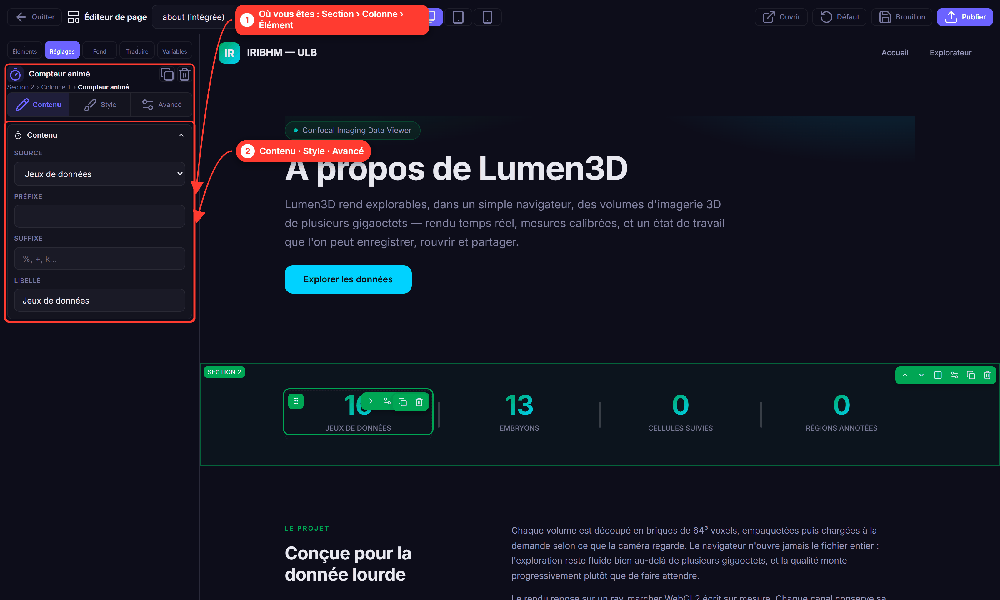{.shot width=88%}

::: legend
| n | ce que c'est |
|-|----------------------|
| 1 | Le **fil d'Ariane** : `Section 2 › Colonne 1 › Compteur animé`. Chaque niveau est cliquable. |
| 2 | Les trois onglets de réglages : **Contenu**, **Style**, **Avancé**. |
:::

### Les mini-barres d'outils

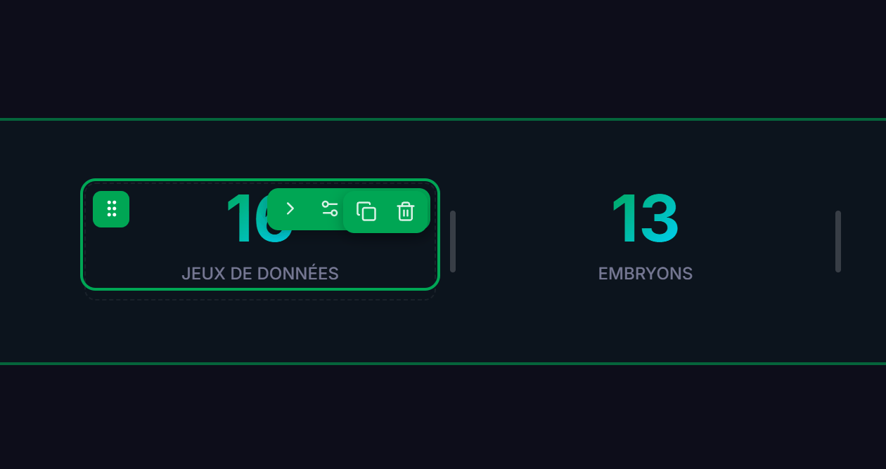{.shot width=60%}

**Une seule barre est visible à la fois** : celle du niveau le plus intérieur sous votre curseur (élément, puis colonne, puis section).

| Niveau | Boutons |
|---|---|
| **Élément** | ⠿ poignée de déplacement · ⧉ dupliquer · 🗑 supprimer |
| **Colonne** | ‹ › déplacer · ⚙ réglages · ⧉ · 🗑 |
| **Section** | ⌃ ⌄ monter / descendre · ▥ ajouter une colonne · ⚙ réglages · ⧉ · 🗑 |

### Les trois onglets de réglages

**Contenu** — ce qui est écrit : textes, images, liens, source des données. **Style** — couleurs, tailles, espacements, alignement, arrondis. **Avancé** — marges, comportement au survol, **visibilité selon l'appareil**, CSS personnalisé.

:::: cols
::: col
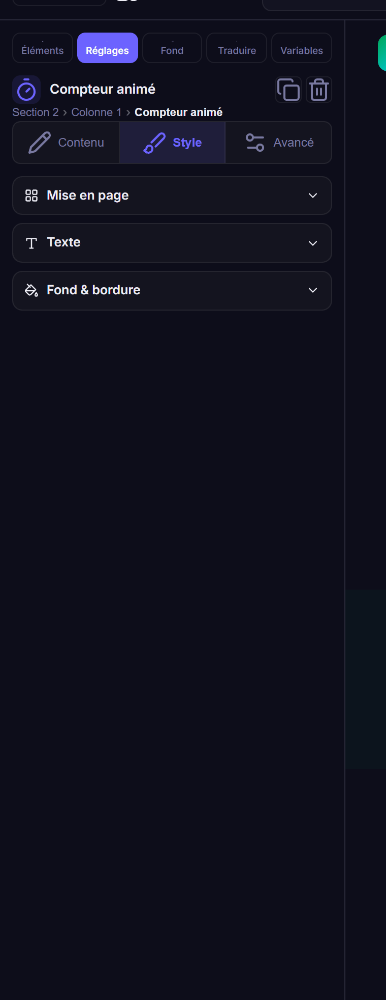{.shot width=88%}
:::
::: col
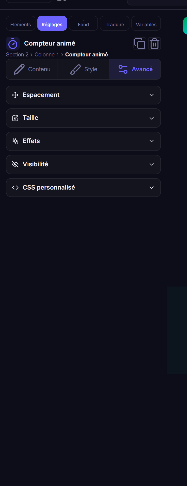{.shot width=88%}
:::
::::

::: tip
Pour modifier un texte plus vite, **double-cliquez** dessus dans la page et tapez. <kbd>Entrée</kbd> valide, <kbd>Échap</kbd> annule.
:::

### Les raccourcis clavier

| Raccourci | Action |
|---|---|
| <kbd>Ctrl</kbd> + <kbd>Z</kbd> | Annuler |
| <kbd>Ctrl</kbd> + <kbd>Y</kbd> (ou <kbd>Ctrl</kbd> + <kbd>Maj</kbd> + <kbd>Z</kbd>) | Rétablir |
| <kbd>Ctrl</kbd> + <kbd>S</kbd> | Enregistrer un brouillon |
| <kbd>Ctrl</kbd> + <kbd>D</kbd> | Dupliquer l'élément sélectionné |
| <kbd>Ctrl</kbd> + <kbd>C</kbd> / <kbd>V</kbd> | Copier / coller un élément |
| <kbd>Suppr</kbd> (ou <kbd>Retour arrière</kbd>) | Supprimer l'élément |
| <kbd>Échap</kbd> | Désélectionner |

Sur Mac, remplacez <kbd>Ctrl</kbd> par <kbd>Cmd</kbd>. Les raccourcis sont désactivés pendant que vous tapez dans un champ.

## 10.5. Sections, colonnes et mobile

Une page est construite en trois niveaux : **Section** (une bande sur toute la largeur) › **Colonne** (un découpage vertical) › **Élément**.

Six dispositions de colonnes : **1** (pleine largeur), **2**, **3**, **4** colonnes égales, **⅔ ⅓** et **⅓ ⅔**. Sur un téléphone, les colonnes **se remettent automatiquement les unes sous les autres**.

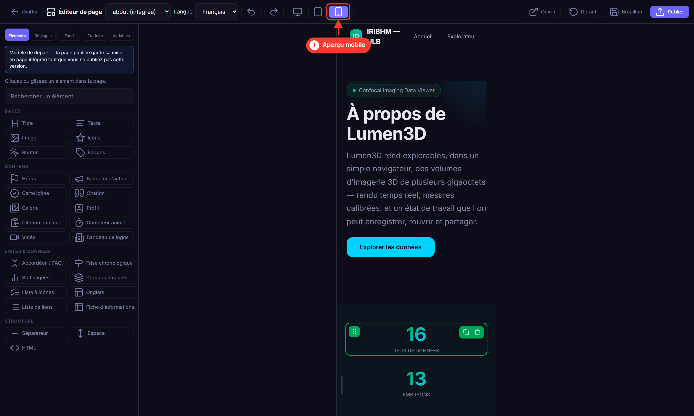{.shot width=70%}

Les trois icônes (ordinateur / tablette / mobile) redimensionnent l'aperçu. **Vérifiez en mobile avant de publier** : une bonne partie des visiteurs sont sur téléphone.

## 10.6. Fond animé, traduction, variables

:::: cols3
::: col
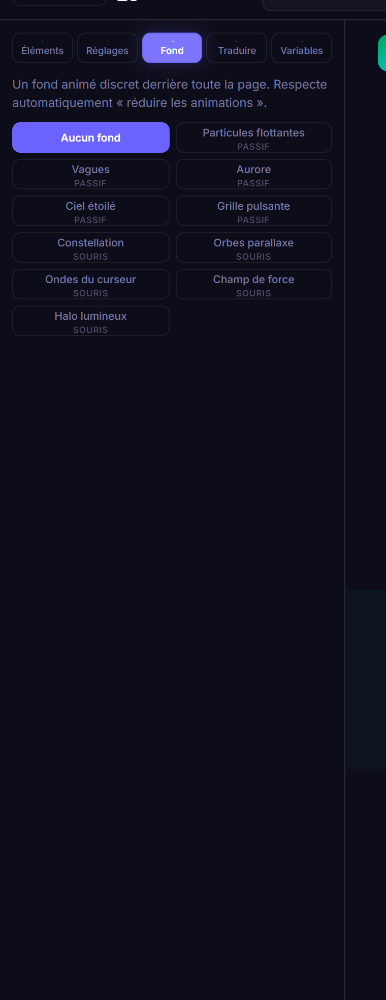{.shot width=88%}

**Fond** : *Aucun fond*, *Souris* (réagit au curseur), *Passif* (se déroule seul). Respecte la préférence « réduire les animations ».
:::
::: col
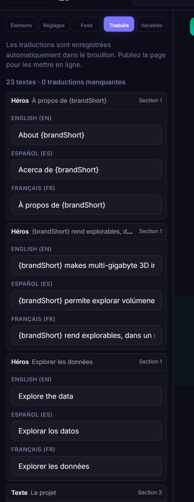{.shot width=88%}

**Traduire** liste **tous les textes** de la page et signale ceux qui manquent (« 24 textes · 7 traductions manquantes »).
:::
::: col
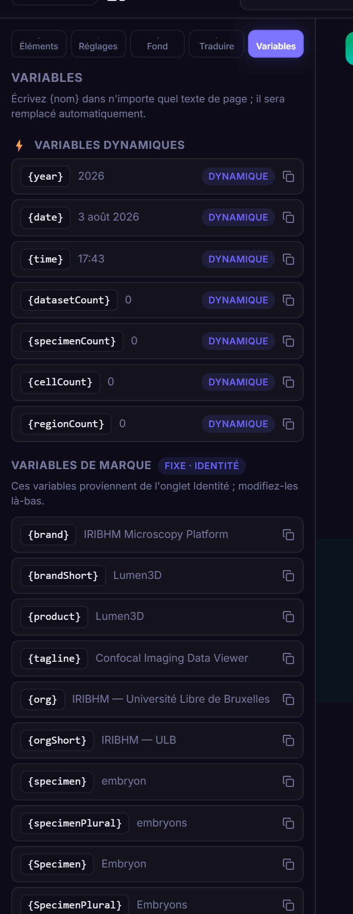{.shot width=88%}

**Variables** : un texte défini **une fois**, réutilisé partout avec `{nom}`.
:::
::::

**Méthode conseillée pour traduire** : rédigez toute la page dans une langue, puis passez sur l'onglet Traduire pour la traduire d'un bloc.

**Les variables** — créez-en une (nom, par exemple `contact` ; valeur, `microscopy@ulb.be`), écrivez `{contact}` dans n'importe quel texte, et la valeur s'affiche. Le jour où l'adresse change, vous la corrigez à **un seul endroit**. Règles de nom : une lettre, puis lettres, chiffres ou `_`, 32 caractères au plus.

Des variables existent déjà : `{brand}` (nom du site), `{specimen}` (votre objet d'étude), `{org}`, `{year}`, et pour les catégories `{type3d}`, `{type2d}`, `{typeLive}` (chapitre 6).

## 10.7. Créer une nouvelle page

::: steps
1. Dans l'onglet **Pages**, cliquez [Nouvelle page]{.ui}.
2. Répondez aux **deux invites** : « Identifiant de la page (lettres, chiffres, tirets) : » (minuscules, chiffres, `-`, `_`, 64 caractères) puis « Libellé dans le menu : ».
3. Construisez la page dans l'éditeur.
4. Cliquez **Publier**.
:::

Toast : « Page créée. Elle apparaîtra dans le menu après publication. ». La page est ajoutée au menu **masquée** ; elle devient **visible à la première publication** : **rien à cocher dans Identité**. Elle est alors à l'adresse `https://<votre-site>/page.html?slug=protocoles` (pour l'identifiant `protocoles`).

Erreurs : « Identifiant invalide. », « Cette page existe déjà. ». Supprimer demande « Supprimer cette page ? » et efface vraiment le fichier de configuration.

## 10.8. Marche à suivre recommandée

::: steps
1. **Modifier avec l'éditeur**, faire ses modifications.
2. **Brouillon** de temps en temps (en plus de l'enregistrement automatique).
3. Vérifier en **aperçu mobile**.
4. Compléter l'onglet **Traduire**.
5. **Publier**, puis **Ouvrir** pour vérifier le résultat en ligne.
:::

# 11. Mentions légales

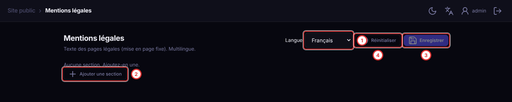{.shot width=88%}

::: legend
| n | ce que c'est |
|-|----------------------|
| 1 | Le sélecteur **Langue**. |
| 2 | [Ajouter une section]{.ui} : un **titre** et un **texte**. |
| 3 | [Enregistrer]{.ui} : publie. |
| 4 | [Réinitialiser]{.ui}. |
:::

Un éditeur simple, à mise en page fixe, pour le texte légal. Les sections s'affichent dans l'ordre où vous les créez ; chacune a un « Titre de section », un « Texte… » et un bouton [Supprimer]{.ui}. Sans section : « Aucune section. Ajoutez-en une. ». Résultat : « Mentions légales enregistrées. ». <kbd>Ctrl</kbd> + <kbd>S</kbd> enregistre.

**Sections habituelles :** éditeur du site, hébergeur, propriété intellectuelle, données personnelles, contact.

::: warning
**Deux choses à ne pas oublier.** (1) La page reste invisible tant que la case « Afficher « Mentions légales » » n'est pas cochée dans **Identité › Navigation**. (2) Le contenu juridique dépend de votre pays et de votre institution : rapprochez-vous du service compétent plutôt que de recopier un modèle trouvé en ligne.
:::

# 12. Plugins — les fonctions du visualiseur

::: chapter-intro
- Presque tout ce qu'un visiteur peut faire est fourni par un **plugin**, un petit module indépendant.
- **Par défaut, un plugin n'a pas le droit de s'exécuter** : c'est vous qui l'autorisez.
- Vous pouvez en **retirer** ce qui ne sert pas, et en **ajouter** plus tard.
:::

C'est le chapitre le plus technique, mais aussi celui qui donne le plus de contrôle. Prenez le temps de lire §12.1 : le reste en découle.

## 12.1. Qu'est-ce qu'un plugin, ici ?

::: analogy
**Un établi et ses outils.** Le visualiseur est un établi minimal. Mesurer une distance, prendre une capture, régler un histogramme, choisir un mode de rendu : chaque fonction est **un outil rangé sur l'établi**. Vous décidez lesquels sont posés dessus.
:::

Chaque plugin occupe l'un des **trois emplacements** :

| Emplacement | Où ça apparaît pour le visiteur | Exemples |
|---|---|---|
| **Outils** (barre d'outils) | Les boutons en haut du visualiseur | Mesure de distance, capture d'écran, mode présentation |
| **Canaux** (par canal) | Les réglages sous chaque canal de fluorescence | Histogramme, flou gaussien |
| **Modes de rendu** (shaders) | Le menu déroulant qui choisit comment le volume est dessiné | Fluorescence, Natural Fluorescence, Structure (DVR) |

## 12.2. L'écran

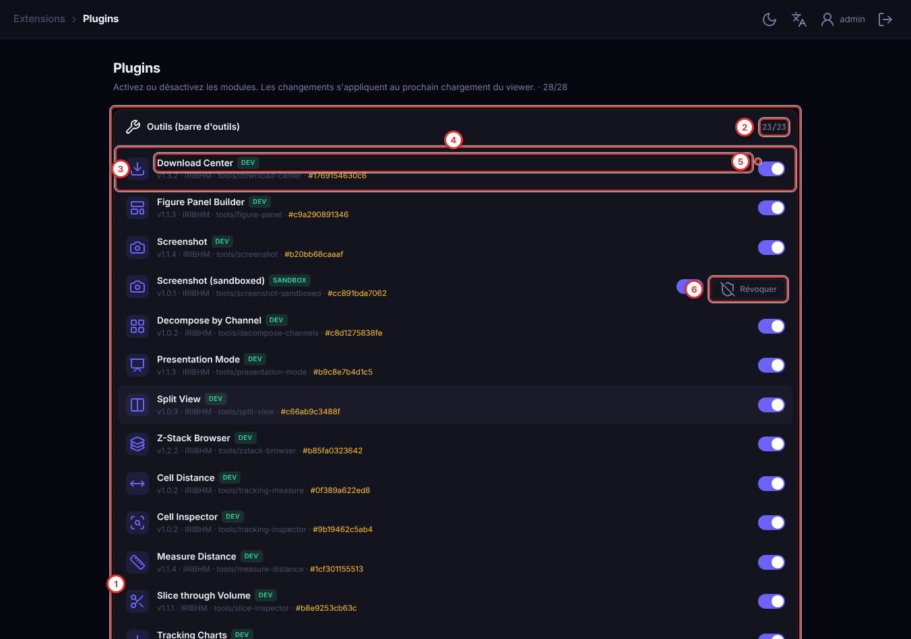{.shot width=88%}

::: legend
| n | ce que c'est |
|-|----------------------|
| 1 | Une **carte par emplacement** (Outils, Canaux, Modes de rendu). |
| 2 | Le compteur `actifs / total` de la carte. |
| 3 | Une **ligne par plugin**. |
| 4 | Le **nom** et le **niveau de confiance**. |
| 5 | L'**interrupteur** actif / inactif. |
| 6 | **Révoquer** (sur un plugin que vous avez approuvé). |
:::

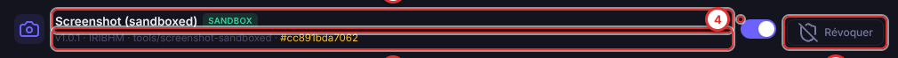{.shot width=88%}

::: legend
| n | ce que c'est |
|-|----------------------|
| 1 | Le **nom** du plugin. |
| 2 | Son **niveau de confiance**. |
| 3 | Version · auteur · dossier · **empreinte** du code. |
| 4 | L'interrupteur qui **active ou désactive**. |
| 5 | [Révoquer]{.ui} : retire l'autorisation (§12.5). Absent sur un plugin `intégré`. |
:::

Liste vide : « Aucun plugin installé — Les plugins s'installent à la demande depuis le catalogue. » avec un bouton [Ouvrir le catalogue]{.ui}. Si la liste ne charge pas : « Impossible de charger la liste des plugins. » et [Réessayer]{.ui}.

## 12.3. Activer ou désactiver un plugin

Basculez l'interrupteur. Le changement est enregistré immédiatement et prend effet **au prochain chargement du visualiseur** : demandez à un visiteur de recharger sa page, ou rechargez l'aperçu de l'onglet Datasets. Désactiver ne supprime rien : vous pouvez réactiver à tout moment.

::: warning
**L'interrupteur n'est pas toujours là.** Un plugin **non fiable** n'en a pas : il faut d'abord l'approuver (§12.5). Un plugin **protégé** (le dernier mode de rendu actif) ou **incompatible** en a un, grisé.
:::

::: note
**Une seule protection** : il doit toujours rester **au moins un mode de rendu actif**. Si vous essayez de désactiver le dernier : « Au moins un mode de rendu doit rester actif ».
:::

## 12.4. Les niveaux de confiance — pourquoi ils existent

Un plugin est du **vrai code** qui s'exécute dans le navigateur des visiteurs. Un plugin malveillant pourrait afficher n'importe quoi. La plateforme part donc du principe inverse de l'habitude : **par défaut, un plugin n'a pas le droit de s'exécuter**. Chaque plugin porte une étiquette :

| Étiquette | Signification | Ce que ça implique |
|---|---|---|
| **`intégré`** | Livré avec la version officielle du site, code identique à celui publié | De confiance. Rien à faire. |
| **`approuvé`** | Vous l'avez autorisé à s'exécuter dans la page | De confiance parce que **vous** l'avez décidé. |
| **`sandbox`** | Autorisé, mais **enfermé dans un bac à sable** : isolé du reste de la page et du panneau | Le mode le plus sûr. |
| **`dev`** | Plugin local d'une machine de développement lancée avec le drapeau `--dev-trust-local` | N'existe pas sur un site en production. Sans ce drapeau, un clone n'a **aucun** plugin local de confiance. |
| **`non fiable`** | **Refusé** : le plugin n'est pas chargé du tout | Voir §12.5. |
| **`protégé`** | Le dernier mode de rendu actif | L'interrupteur est grisé. |
| **`incompatible`** | Il demande une autre version de la plateforme | Grisé ; voir chapitre 14. |
| **`màj disponible`** | Une version plus récente et compatible existe | Voir §12.6. |

**L'empreinte** (le code du type `#06c7945439b8`, sous chaque nom) signe le contenu exact des fichiers. Votre autorisation est **liée à cette empreinte précise** : si quelqu'un modifie un caractère du plugin, l'empreinte change, l'autorisation devient caduque et le plugin repasse en **non fiable**. Un plugin approuvé ne peut donc pas être remplacé en douce.

## 12.5. Approuver un plugin non fiable

Vous verrez ce cas si quelqu'un dépose un plugin sur le serveur (par FTP) au lieu de passer par le Catalogue.

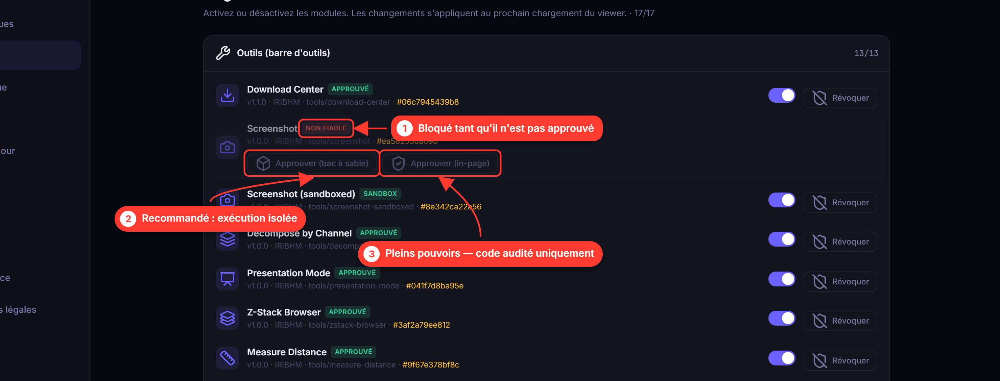{.shot width=88%}

::: legend
| n | ce que c'est |
|-|----------------------|
| 1 | L'étiquette rouge **NON FIABLE** : le plugin n'est pas chargé. |
| 2 | [Approuver (bac à sable)]{.ui} : le plugin tourne isolé. **Choix recommandé.** |
| 3 | [Approuver (in-page)]{.ui} : le plugin tourne avec les pleins pouvoirs de la page. |
:::

::: steps
1. Cliquez l'un des deux boutons.
2. Une fenêtre récapitule ce que vous approuvez : **empreinte** du code et **capacités** accordées.
3. Le panneau demande de **retaper votre mot de passe** : « Confirmez votre mot de passe administrateur pour approuver : ».
4. « Plugin approuvé ✓ (rechargez le viewer) » : actif au prochain chargement.
:::

::: why
**Pourquoi redemander le mot de passe ?** Approuver est la seule action qui autorise du code extérieur à s'exécuter. Même si quelqu'un s'asseyait devant votre écran ouvert, il ne pourrait pas approuver sans votre mot de passe.
:::

::: warning
**« In-page » plutôt que « bac à sable » ?** Presque jamais, sauf si vous avez lu le code ou s'il vient d'une personne de confiance. Les plugins de **canal** et de **mode de rendu** ne peuvent techniquement pas être mis en bac à sable : ils dialoguent directement avec la carte graphique.
:::

Messages : « Mot de passe incorrect. », « Le contenu du plugin a changé — rechargez la liste et revérifiez. » (l'empreinte a bougé entre-temps), « Approbation révoquée ✓ » après [Révoquer]{.ui}.

## 12.6. Mettre à jour un plugin

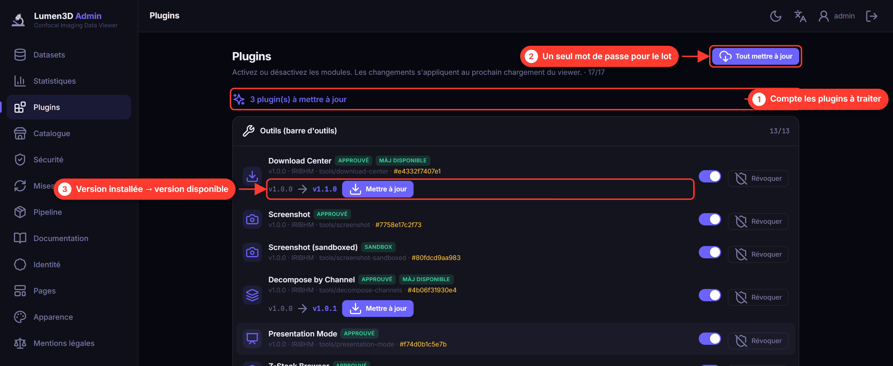{.shot width=88%}

::: legend
| n | ce que c'est |
|-|----------------------|
| 1 | Le **bandeau** compte les plugins concernés. |
| 2 | [Tout mettre à jour]{.ui} : à partir de deux plugins ; **un seul mot de passe** pour le lot. |
| 3 | La ligne : étiquette **màj disponible**, trajet `v1.0.0 → v1.1.0`, bouton. |
:::

Le bouton n'apparaît que si **une version plus récente existe ET qu'elle se déclare compatible** avec votre plateforme. Sinon la raison est affichée : mettez d'abord la plateforme à jour (chapitre 14).

La copie qui fonctionne est **mise de côté, pas supprimée** : si quoi que ce soit échoue ensuite, elle est remise en place. La même action existe dans le **Catalogue** et dans **Mises à jour** : les trois onglets lisent la même source.

## 12.7. Dans un panneau, une vue divisée, l'aperçu

Un plugin doit déclarer qu'il sait **être piloté de l'extérieur** pour se charger quand la page est **embarquée** : aperçu de l'onglet Datasets, panneaux de la page *Comparer*, volets de la vue divisée. Sinon il n'est chargé que sur la page complète.

Les plugins **« page seulement »** — Presentation Mode, Download Center, Decompose by Channel, Screenshot, Chunk Debug, Split View, Figure Panel Builder, Tracking Charts, Cell Distance — n'apparaissent donc pas dans l'aperçu. **Ce n'est pas un bug.**

Un plugin peut aussi être **limité à des types** de données : les cinq plugins 2D ne se chargent que sur une photographie ; les cinq plugins de suivi, uniquement sur un dataset Live qui possède un suivi.

## 12.8. Les 28 plugins du catalogue

Ces plugins ne sont **pas** livrés avec le site : ils s'installent à la demande (assistant de première installation, étape 5, ou onglet Catalogue). Une installation neuve dont on aurait tout décoché n'en aurait aucun.

**Modes de rendu**

| Plugin | Ce que ça fait pour le visiteur |
|---|---|
| **Fluorescence** | Le rendu par défaut : chaque canal émet sa couleur, comme sur un microscope à fluorescence |
| **Natural Fluorescence** | Chaque fluorophore brille de sa couleur ; les structures denses masquent ce qui est derrière |
| **Structure (DVR)** | Rendu volumique avec profondeur et ombrage, qui fait ressortir les formes |

**Canaux**

| Plugin | Ce que ça fait |
|---|---|
| **Histogram Controls** | L'histogramme d'intensité et les curseurs min / max / gamma |
| **Gaussian Filter** | Un curseur de flou pour lisser le bruit d'un canal |

**Outils (volumes et séries temporelles)**

| Plugin | Ce que ça fait |
|---|---|
| **Measure Distance** | Cliquer deux points pour obtenir la distance réelle en µm |
| **Slice through Volume** | Une coupe plane orientable à travers le volume |
| **Z-Stack Browser** | Parcourir les coupes : ouverture à plat animée, cran 3D, rognage haut / bas, barre d'épaisseur réglable, curseur « Rotation » |
| **Decompose by Channel** | Afficher les canaux côte à côte |
| **Download Center** | Récupérer fichiers, mesures, métadonnées, exports |
| **Screenshot** | Capturer la vue 3D en PNG |
| **Screenshot (sandboxed)** | La même capture, en bac à sable : l'exemple de plugin isolé |
| **Presentation Mode** | Plein écran sans interface, pour projeter |
| **Orientation Axes** | Le repère rouge / vert / bleu 1-2, renommables (§3.8) |
| **Toggle Grid**, **Toggle Axes**, **Hide / Show 3D Volume** | Afficher ou masquer la grille, les axes, le volume |
| **Chunk Debug** | Diagnostic technique. **Peut être désactivé sans risque** en production |

**Outils des photographies 2D**

| Plugin | Ce que ça fait |
|---|---|
| **Calibrated Grid** | Une grille calibrée en µm ou mm sur la photographie |
| **Display Adjustments** | Luminosité, contraste, gamma (affichage seulement) |
| **Orientation 2D** | Rotation et miroir de la photographie |
| **Split View** | Deux vues côte à côte |
| **Figure Panel Builder** | Composer plusieurs photographies en une figure à l'échelle commune |

**Outils du suivi cellulaire (séries Live avec suivi)**

| Plugin | Ce que ça fait |
|---|---|
| **Tracking Trails** | Les trajectoires sur le volume |
| **Tracking Surface** | La surface de l'embryon dans le volume |
| **Cell Inspector** | Métriques, lignée, voisins d'une cellule |
| **Tracking Charts** | Graphiques de population, vitesse, mitoses |
| **Cell Distance** | Distances entre cellules |

::: note
**Slice through Volume** et **Z-Stack Browser** sont **exclusifs** : ouvrir l'un ferme l'autre.
:::

# 13. Catalogue — installer de nouveaux plugins

::: chapter-intro
- Le Catalogue fonctionne comme un **magasin d'applications** : plugins officiels, signés.
- Installer = un clic + votre **mot de passe** ; le plugin est vérifié, installé et **approuvé**.
- Une installation est **annulée** au moindre écart avec ce que le catalogue annonce.
:::

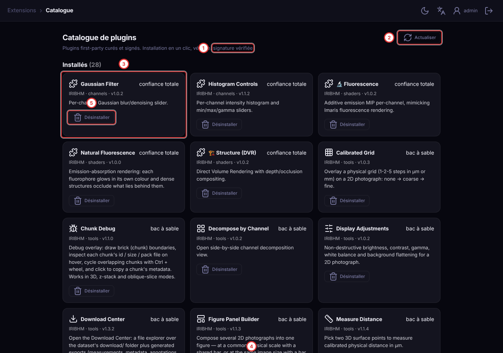{.shot width=88%}

::: legend
| n | ce que c'est |
|-|----------------------|
| 1 | **Signature vérifiée** : le catalogue est authentifié. |
| 2 | [Actualiser]{.ui}. |
| 3 | Une **carte de plugin** (nom, emplacement, version, description). |
| 4 | Les **capacités** demandées. |
| 5 | [Désinstaller]{.ui}. |
:::

Les plugins sont répartis en sections : **À mettre à jour** (en premier, s'il y en a), **Installés**, **Disponibles**, éventuellement **Incompatibles**.

## 13.1. Installer un plugin

::: steps
1. Trouvez la carte du plugin dans **Disponibles**.
2. Cliquez [⬇ Installer]{.ui}.
3. « Installer ce plugin ? Confirmez avec votre mot de passe administrateur : ».
4. « Installation en cours (téléchargement + vérification)… » puis « Plugin installé et approuvé ✓ ».
:::

Le serveur contrôle que le fichier correspond **au bit près** à ce que le catalogue annonce. Au moindre écart, l'installation est **annulée** (« Échec de l'installation (vérification échouée). »). Autres messages : « Mot de passe incorrect. », « Déjà installé. ».

En haut de page, **« signature vérifiée »** (catalogue authentifié) ou **« non signé »** (aucune clé configurée : seule l'empreinte sha256 est contrôlée).

::: why
**Catalogue plus ancien refusé (anti-retour-arrière).** Chaque catalogue signé porte un **numéro de série croissant**. Le serveur refuse un catalogue plus ancien qu'un catalogue déjà accepté : « Catalogue refusé : il est plus ancien (n° … ) qu'un catalogue déjà accepté par ce serveur (n° … ). Il pourrait réinstaller des versions de plugins corrigées depuis. ». Il n'y a **rien à faire** de votre côté, et ce message ne se contourne pas.
:::

## 13.2. Mettre à jour, désinstaller

Un plugin installé dont une version plus récente **et** compatible existe passe dans **À mettre à jour** : sa carte affiche `v1.0.0 → v1.1.0` et un bouton [Mettre à jour]{.ui} à côté de [Désinstaller]{.ui} (vérifiez sur lequel vous cliquez). [Tout mettre à jour]{.ui} traite le lot avec un seul mot de passe.

[🗑 Désinstaller]{.ui} demande « Désinstaller ce plugin ? » puis « Plugin désinstallé. » ; les fichiers sont retirés du serveur et vous pouvez réinstaller ensuite. **Un seul refus** : le **dernier mode de rendu** (« Impossible : dernier mode de rendu. »).

## 13.3. Les étiquettes des cartes

| Étiquette | Signification |
|---|---|
| **`bac à sable`** | « Exécuté isolé (bac à sable) » : c'est le cas des plugins de la barre d'outils. |
| **`confiance totale`** | « Confiance totale en page (shaders/canaux) » : inévitable pour les modes de rendu et les réglages de canaux, qui pilotent la carte graphique. |
| **`màj disponible`** | Une version plus récente et compatible existe. |
| **`incompatible`** | N'apparaît que sur un plugin **non installé** : il demande une autre version de la plateforme. Le bouton d'installation est grisé : mettez la plateforme à jour (chapitre 14). |

::: note
Un plugin **déjà installé** ne porte jamais l'étiquette `incompatible` : celui qui tourne chez vous fonctionne ; seule sa version suivante peut attendre. Un paquet qui déclare un type de données exige une plateforme **récente** (1.51 à 1.53) : un site non mis à jour verra « incompatible » sur les plugins récents.
:::

États du catalogue : « Catalogue indisponible : … », « Catalogue inaccessible. », « Aucun plugin dans le catalogue. », « Aucune source de catalogue configurée… ».

# 14. Mises à jour — faire évoluer le site

::: chapter-intro
- Cet onglet met à jour **le logiciel** : la plateforme, les plugins, et vous signale le **pack Pipeline**.
- Avant l'installation, un **rapport de vérification** dit ce qui sera touché.
- Une version qui ne démarre pas est **remplacée automatiquement** par l'ancienne.
:::

::: warning
**Ne confondez pas** avec l'onglet [Mises à jour des données]{.ui} (chapitre 5), qui met à niveau le **format** de vos jeux de données.
:::

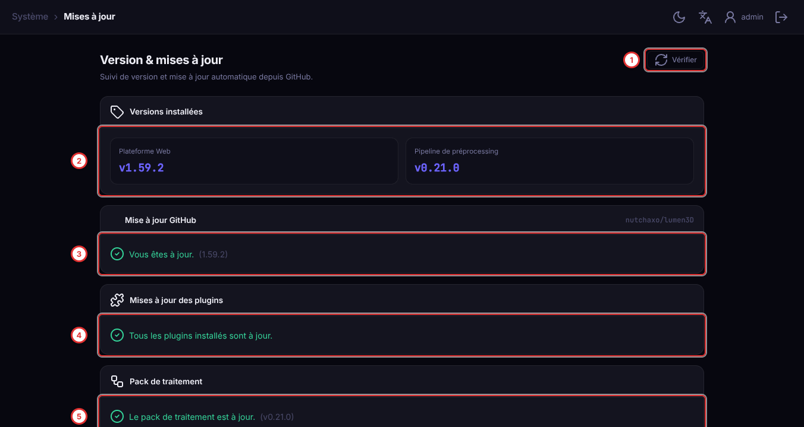{.shot width=88%}

::: legend
| n | ce que c'est |
|-|----------------------|
| 1 | [Vérifier]{.ui} : relance les trois contrôles. |
| 2 | **Versions installées** : Plateforme Web et Pipeline de préprocessing. |
| 3 | **Mise à jour GitHub** : « Vous êtes à jour. » ou « Mise à jour disponible : vX ». |
| 4 | **Mises à jour des plugins**. |
| 5 | **Pack de traitement** : le pack Pipeline est-il à jour ? |
:::

Deux numéros de version sont affichés, deux composants indépendants : **Plateforme Web** (le site : **c'est celui qui compte**) et **Pipeline de préprocessing** (l'outil du chapitre 15, qui évolue à son rythme). Une valeur inconnue n'est pas affichée.

## 14.1. Lancer une mise à jour de la plateforme

Quand une nouvelle version existe, ses **notes de version** s'affichent. Lisez-les : elles décrivent ce qui change.

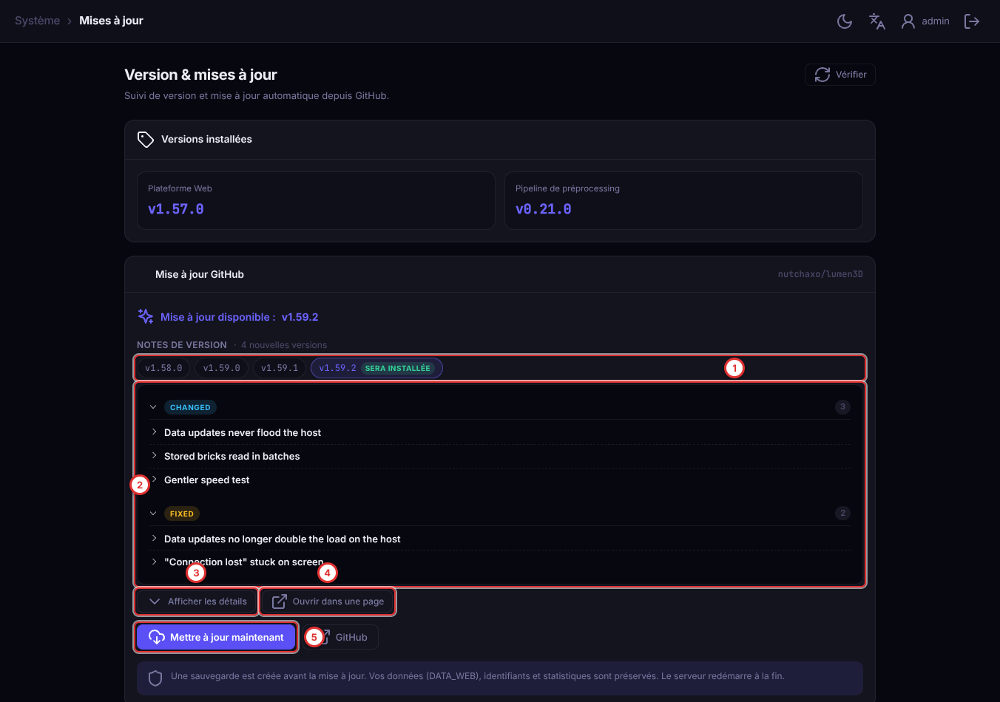{.shot width=88%}

::: legend
| n | ce que c'est |
|-|----------------------|
| 1 | Une **pastille par version** apportée ; la dernière est marquée « sera installée ». |
| 2 | Les notes de la version choisie, en **arbre repliable** (ADDED, OPTIMIZED, FIXED, CHANGED). |
| 3 | [Afficher les détails]{.ui} / [Titres seulement]{.ui}. |
| 4 | [Ouvrir dans une page]{.ui} : la page *Notes de version* (§14.3). |
| 5 | [Mettre à jour maintenant]{.ui}. |
:::

Si votre site a **sauté plusieurs versions**, chacune a sa pastille (« 4 nouvelles versions ») : vous lisez ce que **chaque** version apporte, pas seulement la dernière. Les notes sont en **anglais** depuis la 1.55.0 (les plus anciennes sont en français).

::: steps
1. Cliquez [Mettre à jour maintenant]{.ui}.
2. Le **rapport de vérification** apparaît (ci-dessous).
3. Cliquez [Confirmer la mise à jour]{.ui}.
4. Laissez faire : une barre d'étapes défile.
:::

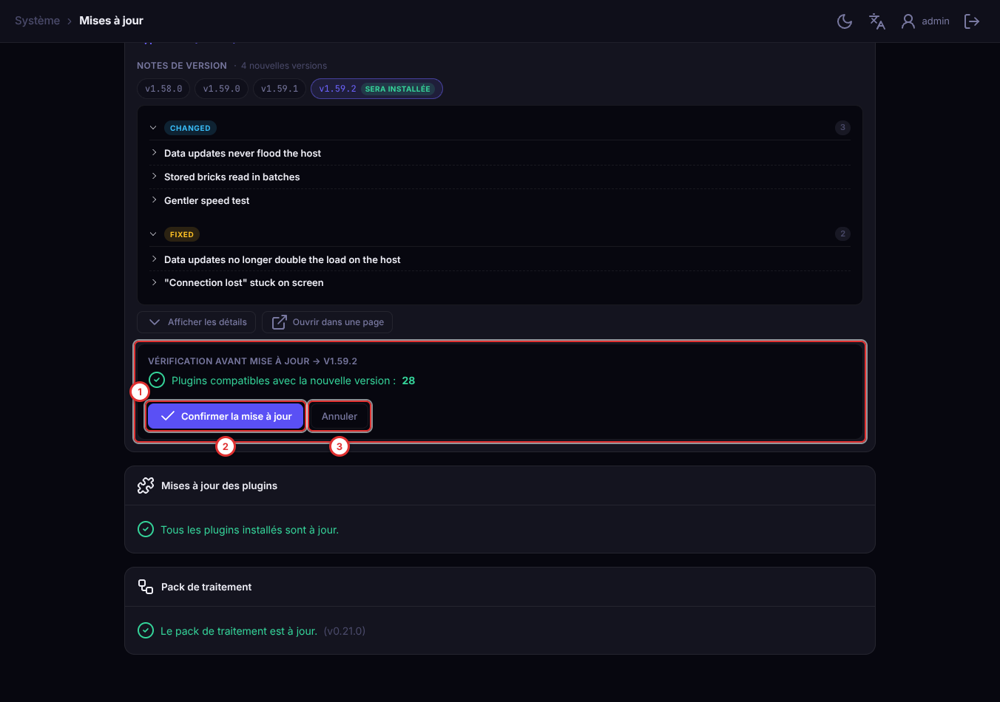{.shot width=88%}

::: legend
| n | ce que c'est |
|-|----------------------|
| 1 | Le **rapport** : plugins compatibles avec la nouvelle version, plugins mis en quarantaine, blocage éventuel. |
| 2 | [Confirmer la mise à jour]{.ui} : n'apparaît pas si quelque chose **bloque**. |
| 3 | [Annuler]{.ui}. |
:::

Le rapport indique, **avant** que rien ne soit installé : combien de plugins resteront compatibles ; lesquels seront **mis en quarantaine** parce qu'ils ne fonctionnent pas encore avec la nouvelle version (ils ne sont pas supprimés et **se réactivent tout seuls** dès qu'une mise à jour les rend compatibles) ; si quelque chose bloque.

Les étapes qui défilent : **Vérifications → Sauvegarde → Téléchargement → Intégrité → Préparation → Contrôle de démarrage → Plan de basculement → Basculement → Redémarrage du serveur**. Le serveur redémarre : **reconnectez-vous**. Le succès n'est annoncé que quand la **nouvelle version répond réellement**.

## 14.2. Les garde-fous

- **Une sauvegarde complète** est faite avant tout.
- **Le fichier téléchargé est vérifié**, et c'est **obligatoire** : seule l'archive nommée d'après la version, listée dans `SHA256SUMS` signé (signature Ed25519, clé épinglée), est appliquée. Jamais le zip « source » de GitHub. Sinon : « Cette version ne peut pas être vérifiée (aucune empreinte pour son archive) et n'a pas été appliquée. » avec la raison.
- **La nouvelle version est testée avant d'être mise en service.** Si elle ne démarre pas : « restauration automatique effectuée » : le site fonctionne toujours, rien à réparer.
- **Vos données sont préservées** : `DATA_WEB`, identifiants, statistiques, réglages Identité / Pages / Apparence. Aucun retraitement des jeux de données n'est exigé.
- **Chaque version publiée a passé toute la suite de tests** avant d'être construite.

::: tech
La **première** mise à jour vers une version ≥ 1.57 se vérifie par somme de contrôle seulement (la clé de signature n'était pas encore dans l'ancienne version) ; les suivantes vérifient la signature. Les lignes `.htaccess` **hors** du bloc `# BEGIN LUMEN3D` / `# END LUMEN3D` survivent aux mises à jour ; la mise à jour vers la 1.57 remplace **une fois** le `.htaccess` racine (ressaisissez alors une éventuelle ligne d'hébergeur, type `AddHandler`).
:::

| Message | Ce que ça veut dire |
|---|---|
| Vous êtes à jour | Rien à faire. |
| Limite de l'API GitHub atteinte | Trop de vérifications en peu de temps ; réessayez dans quelques minutes. |
| Impossible de contacter GitHub | Problème de réseau côté serveur ; réessayez plus tard. |
| Aucune release publiée sur GitHub | Aucune version n'est encore publiée. |
| Le magasin de certificats de PHP est inutilisable | À signaler à la personne qui gère le serveur (fichier `cacert.pem` à téléverser). |
| Mise à jour terminée avec succès. Le serveur a redémarré — reconnectez-vous. | Succès ; [Compris]{.ui} ferme la carte « Dernière mise à jour ». |
| La nouvelle version n'a pas démarré — restauration automatique effectuée. | Le site est revenu à l'ancienne version ; il n'y a rien à réparer. |
| Le serveur ne répond plus. Vérifiez logs/update-pivot-*.log. | Rechargez ; à signaler si ça persiste. |

## 14.3. La page « Notes de version »

Le bouton [Ouvrir dans une page]{.ui} ouvre, dans un nouvel onglet, `admpan.html?changelog=1` : une page **sans menu**, pour lire à l'aise.

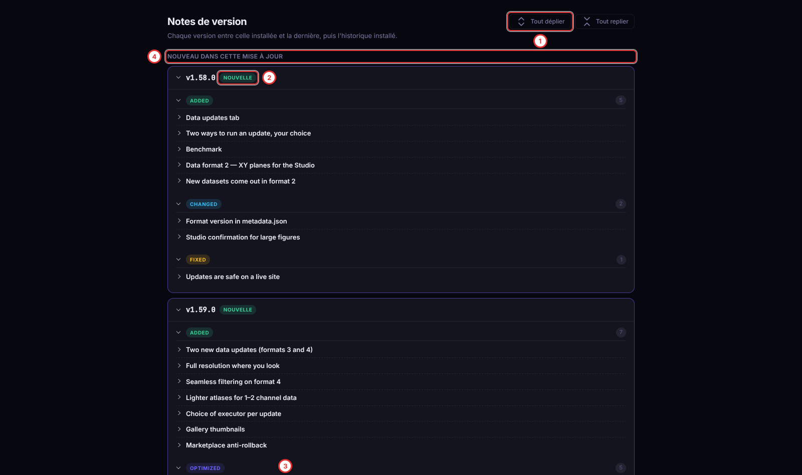{.shot width=88%}

::: legend
| n | ce que c'est |
|-|----------------------|
| 1 | [Tout déplier]{.ui} (et [Tout replier]{.ui}). |
| 2 | L'étiquette **nouvelle** : une version à venir. |
| 3 | L'étiquette **sera installée** : la plus récente. |
| 4 | Le groupe « Nouveau dans cette mise à jour ». |
:::

Si vous êtes à jour : « Rien à installer : vous êtes à jour. ». Chaque version, chaque section et chaque entrée se plie séparément. Pendant le chargement : « Chargement des notes de version… » ; en cas d'échec : « Notes de version indisponibles. ».

## 14.4. Mettre à jour les plugins

Une carte **Mises à jour des plugins** répond à la même question pour les modules : « {n} plugin(s) à mettre à jour », avec [Tout mettre à jour]{.ui} (un seul mot de passe). Un plugin dont la nouvelle version exige une plateforme plus récente apparaît dans une seconde liste, **« Mises à jour qui attendent la plateforme »**, avec la raison : il n'est pas escamoté.

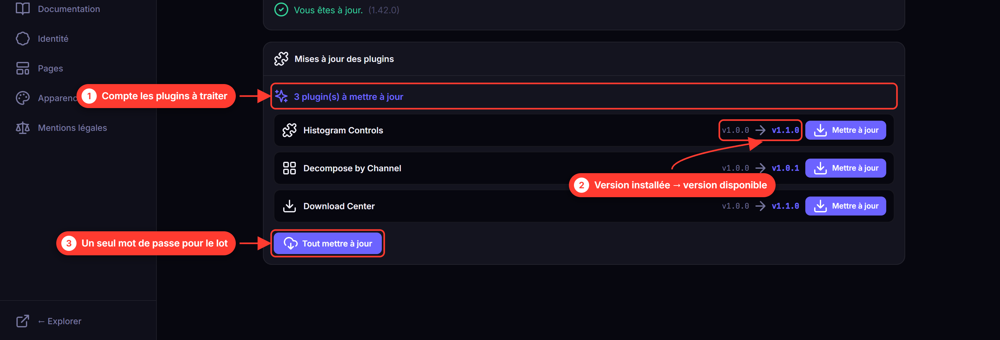{.shot width=88%}

::: legend
| n | ce que c'est |
|-|----------------------|
| 1 | Le **nombre** de plugins à traiter. |
| 2 | Pour chacun : la version installée et la version vers laquelle on irait. |
| 3 | [Tout mettre à jour]{.ui} : un seul mot de passe pour le lot. |
:::

## 14.5. Le pack de traitement

La carte **Pack de traitement** compare le pack Pipeline **installé ici** et celui joint à la **dernière release GitHub**. États : « Le pack de traitement est à jour. (v0.21.0) » ou « Nouveau pack de traitement : vX (ici : vY) » avec [Télécharger le pack]{.ui}.

Il s'installe **sur le poste de traitement, pas sur ce serveur** : téléchargez-le et remplacez le dossier utilisé là-bas. **La plateforme n'a pas besoin d'être mise à jour** pour obtenir un pack plus récent. Si GitHub est injoignable : « Impossible de joindre GitHub pour vérifier le pack de traitement. ».

# 15. Pipeline — préparer de nouvelles données

::: chapter-intro
- Cet onglet ne traite **rien** sur le serveur : il vous fait **télécharger un pack**.
- Le pack s'exécute sur un **ordinateur puissant**, typiquement le poste d'analyse.
- Le dossier produit s'envoie ensuite par l'onglet **Import**.
:::

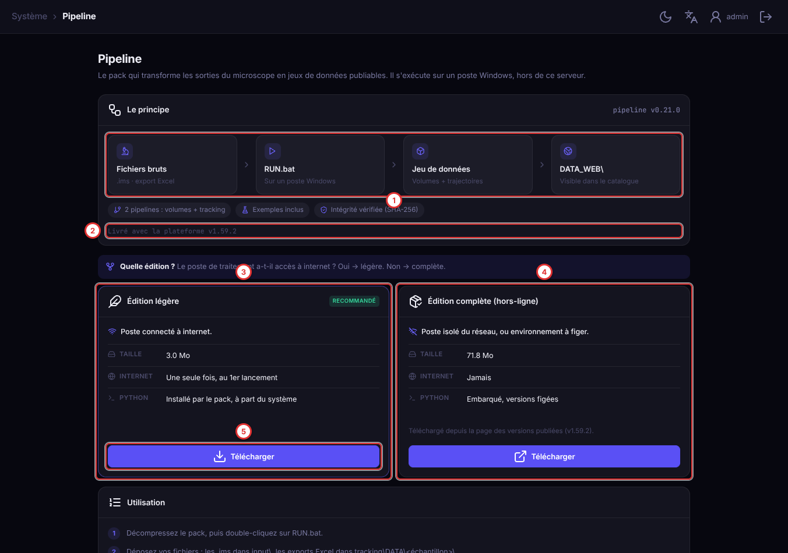{.shot width=88%}

::: legend
| n | ce que c'est |
|-|----------------------|
| 1 | Le **trajet des données** en quatre étapes. |
| 2 | « Livré avec la plateforme vX » : la version du pack livrée avec ce site. |
| 3 | **Édition légère** (recommandée). |
| 4 | **Édition complète** (hors-ligne). |
| 5 | [Télécharger]{.ui}. |
:::

**Pourquoi séparer ?** Convertir un volume demande énormément de mémoire vive : comptez environ **32 Go de RAM** pour un volume de 3789 × 3789 × 178. Aucun serveur web mutualisé ne peut faire ça.

## 15.1. Le principe

| Étape | Ce que c'est |
|---|---|
| **Fichiers bruts** | Ce qui sort du microscope : `.ims` pour les volumes, export Excel pour le suivi, `.tif` pour les photographies |
| **`RUN.bat`** | Le lanceur, sur un poste Windows |
| **Jeu de données** | Ce que le pack produit : volumes découpés, photographie, trajectoires |
| **`DATA_WEB\`** | Le dossier du serveur : le dataset apparaît aussitôt dans le catalogue |

Le pack contient **deux pipelines** (volumes avec tracking, analyse de tracking), l'**import de photographies 2D**, des exemples d'entrée (utilisable tout de suite pour se faire la main), et un lanceur qui **vérifie sa propre intégrité** (SHA-256).

::: note
**Deux numéros, et c'est normal.** L'en-tête affiche `pipeline v0.21.0` : la version **du pack**, pas celle du site. Le pipeline 0.21.0 écrit **directement le format 4** (aucune mise à jour de données à faire sur ses sorties), **conserve la curation** faite dans le panneau quand on retraite un dataset (masqué, nom, orientation…) et **publie tout ou rien**.
:::

Quand une version plus récente du pack est publiée, un **bandeau** apparaît en tête : « Nouvelle version du pack : v… — Ce serveur propose la v…. Téléchargez la nouvelle ci-dessous — la plateforme n'a pas besoin d'être mise à jour pour ça. » avec [Télécharger la v…]{.ui} ; pour l'édition légère, [Version installée]{.ui} garde accessible le pack du serveur.

## 15.2. Quelle édition choisir

Une seule question : **le poste de traitement a-t-il accès à internet ?**

| | **Édition légère** *(recommandée)* | **Édition complète** *(hors-ligne)* |
|---|---|---|
| Pour qui | Poste connecté à internet | Poste isolé du réseau, ou environnement à figer |
| Taille | ~3 Mo | ~70 Mo (≈ 200 Mo décompressé) |
| Internet | **une seule fois**, au premier lancement | **jamais** |
| Python | installé par le pack, à part du système | embarqué, versions figées |

L'édition légère ne modifie **jamais** le Python déjà installé sur le poste.

::: warning
L'édition complète est jointe à la version publiée sur GitHub, pas au site. Si elle est indisponible, le panneau le dit (« Cette édition n'est pas jointe à la dernière version publiée. Utilisez l'édition légère… ») et l'édition légère reste téléchargeable.
:::

## 15.3. Comment s'en servir

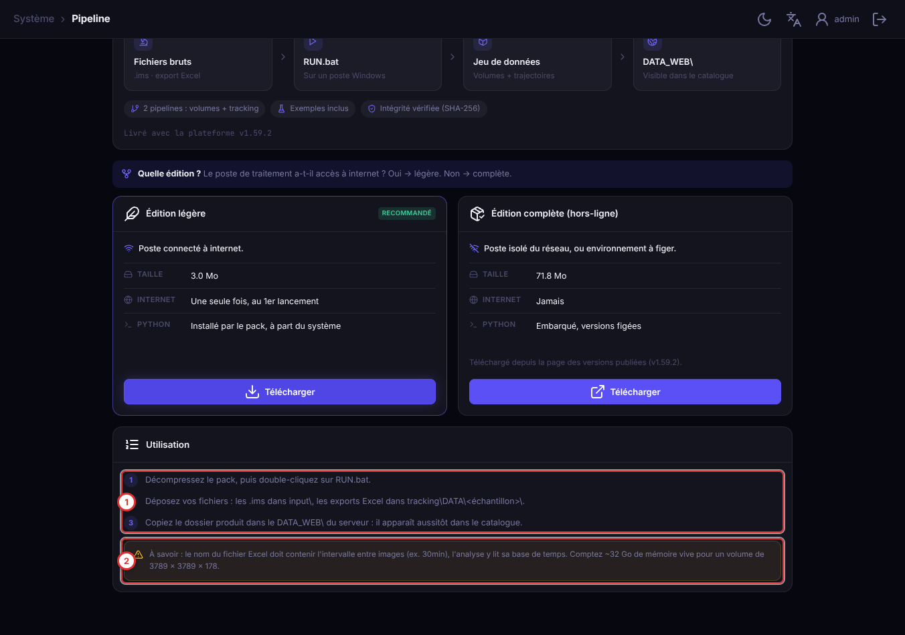{.shot width=88%}

::: legend
| n | ce que c'est |
|-|----------------------|
| 1 | Les trois étapes d'**utilisation**. |
| 2 | La mise en garde : le nom du fichier Excel doit contenir l'intervalle entre images. |
:::

::: steps
1. Décompressez l'archive sur le poste de traitement, double-cliquez **`RUN.bat`**.
2. Déposez les `.ims` dans `input\` et les exports Excel dans `tracking\DATA\<échantillon>\`.
3. Copiez le dossier produit dans le `DATA_WEB\` du serveur, **ou, sans accès FTP, glissez-le dans l'onglet Import** (chapitre 4). Il apparaît aussitôt dans le catalogue.
:::

::: warning
**Le nom du fichier Excel doit contenir l'intervalle entre images** (par exemple `30min`) : l'analyse y lit sa base de temps.
:::

Le menu du lanceur propose : **[1]** Preprocessing de volumes Imaris (`.ims` → `output\`, tracking inclus) ; **[2]** Analyse de tracking Imaris (Excel → `tracking\OUTPUT\`) ; **[3]** Import de photographies 2D (`.tif` → `output\2d\`) ; **[4]** Attacher un tracking à un dataset déjà traité ; **[5]** Vérifier l'environnement seulement ; **[0]** Quitter.

::: see
Le détail de ce que fait chaque étape (nettoyage du bruit, pyramide, briques, suivi) est dans la **documentation complète**, chapitres 4 à 8.
:::

# 16. Sécurité — mot de passe et permissions

::: chapter-intro
- Changer le mot de passe demande l'**ancien**.
- Un changement **déconnecte toutes vos autres sessions**.
- Le mot de passe n'est **jamais** stocké en clair.
:::

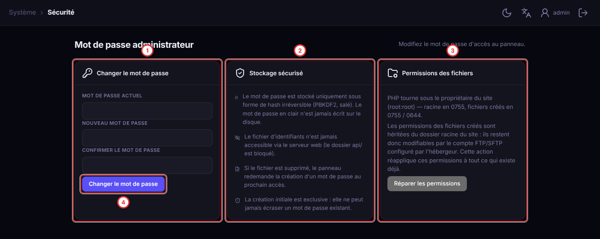{.shot width=88%}

::: legend
| n | ce que c'est |
|-|----------------------|
| 1 | **Changer le mot de passe** : actuel, nouveau, confirmation. |
| 2 | **Stockage sécurisé** : comment il est gardé. |
| 3 | **Permissions des fichiers** : l'état, et [Réparer les permissions]{.ui}. |
| 4 | [Changer le mot de passe]{.ui}. |
:::

## 16.1. Changer le mot de passe

Remplissez les trois champs et cliquez [Changer le mot de passe]{.ui}. Il faut connaître l'ancien : cela empêche quelqu'un qui trouverait votre session ouverte de vous verrouiller dehors.

- **8 caractères minimum** (« Mot de passe trop court (8 caractères minimum). »).
- Autres messages : « Les mots de passe ne correspondent pas. », « Mot de passe actuel incorrect. », « Échec du changement de mot de passe. », puis « Mot de passe modifié ✓ ».
- Vous **restez connecté**, mais **toutes les autres sessions sont fermées**. Les mots de passe déjà stockés sont ré-empreints avec un coût plus élevé à la prochaine connexion.

::: tip
Visez **12 caractères ou plus**. Une phrase facile à retenir vaut mieux qu'un mot compliqué : `microscope-embryon-2026` est nettement plus solide que `M1cr0!`.
:::

## 16.2. Comment le mot de passe est stocké

- **Jamais en clair.** Le serveur n'en garde qu'une empreinte irréversible (PBKDF2 avec sel). Depuis l'empreinte, on ne remonte pas au mot de passe.
- **Le fichier d'identifiants n'est jamais servi.** Même en tapant son adresse exacte, on obtient une erreur.
- **Si le fichier est supprimé**, le panneau repropose la création d'un mot de passe : c'est la porte de secours (annexe B).
- **La création initiale ne peut jamais écraser** un mot de passe existant.
- **Les essais répétés sont freinés** (§1.4) et les sessions durent 8 heures.

## 16.3. Réparer les permissions

Utile sur certains hébergements mutualisés, où le site tourne sous un compte système différent de celui du FTP : des fichiers créés par le site deviennent illisibles ou non modifiables. **Symptôme :** un enregistrement échoue sans raison apparente.

La ligne d'état dit par exemple « PHP (www-data) ≠ propriétaire du site (…) » ou « PHP tourne sous le propriétaire du site (…) ». Dans le premier cas, cliquez [Réparer les permissions]{.ui} : l'opération est sans danger et réapplique les droits corrects (toast « {n} entrées corrigées ({failed} échecs). »). Sur un serveur Windows : « Hôte Windows : les permissions POSIX ne s'appliquent pas. » : rien à faire.

# 17. Documentation — les guides de la plateforme

::: chapter-intro
- C'est ici que vous trouverez **ce document**, et tous ceux qui seront publiés.
- Ils viennent du **dépôt du projet** : un guide corrigé arrive **sans mise à jour du site**.
- **Votre langue** est choisie d'office.
:::

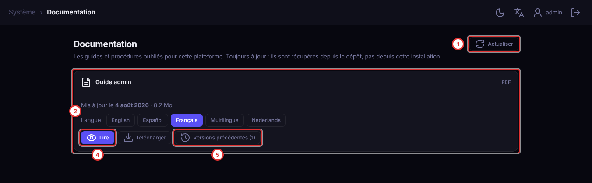{.shot width=88%}

::: legend
| n | ce que c'est |
|-|----------------------|
| 1 | [Actualiser]{.ui} : relit la liste depuis le dépôt. |
| 2 | Une **carte par document**, toutes langues et versions confondues. |
| 3 | La **langue** proposée (la vôtre est choisie d'office). |
| 4 | [Lire]{.ui} : ouvre le document dans le panneau ; à côté, [Télécharger]{.ui}. |
| 5 | [Versions précédentes]{.ui}. |
:::

## 17.1. D'où viennent ces documents

Pas de cette installation : ils sont publiés dans le dépôt et récupérés à l'affichage. Si le serveur ne peut pas joindre GitHub, la liste ne s'affiche pas et un bandeau vous dit pourquoi (« Impossible de contacter GitHub pour lire la liste des documents. ») ; ce n'est pas une panne du site, seulement de cette liste. Autres messages : « Limite de l'API GitHub atteinte… », « Le dossier DOCS/ n'existe pas encore dans le dépôt. ».

La liste est mise en mémoire **dix minutes** : un document publié à l'instant peut mettre un moment à apparaître. [Actualiser]{.ui} force la relecture.

## 17.2. Choisir la langue et lire

Les langues disponibles (Français, English, Nederlands, Español, Deutsch, Italiano, Português, Multilingue) s'affichent en boutons. Le choix se fait dans cet ordre : **votre langue d'interface**, sinon **l'anglais**, sinon **Multilingue**, sinon la première disponible : jamais une carte vide parce qu'une traduction manque.

[Versions précédentes]{.ui} déplie les anciennes éditions : un document corrigé **ne remplace pas** l'ancien, il s'ajoute. [Lire]{.ui} affiche le document dans le panneau ; [Nouvel onglet]{.ui} l'ouvre en grand, [Fermer]{.ui} referme.

::: note
**Tous les formats ne s'affichent pas.** PDF, images (`png`, `jpg`) et texte (`txt`, `md`) se lisent dans le panneau. Les autres (Word, classeur, archive) n'ont pas de bouton [Lire]{.ui} : ils se téléchargent. C'est un choix de sécurité.
:::

## 17.3. Publier un document

Réservé à la personne qui gère le dépôt, mais bon à savoir pour demander la bonne chose. Un document se publie en déposant un fichier dans le dossier `DOCS/` du dépôt, nommé selon une règle stricte :

```
261007 - GUIDE-ADMIN - FR.pdf
└─┬──┘   └────┬────┘   └┬┘
  │           │         └── la langue
  │           └──────────── l'identifiant du document, le même d'une version à l'autre
  └──────────────────────── la date AAMMJJ : c'est le numéro de version
```

- **La date** classe les versions : la plus récente est proposée, les autres restent accessibles. Ce guide, daté du **7 octobre 2026**, devient « la plus récente » face aux éditions d'août 2026.
- **L'identifiant** doit rester **identique** d'une version à l'autre, sinon le panneau y voit deux documents différents.
- Un fichier qui ne suit pas la règle est **signalé comme ignoré** (« Fichiers ignorés (nom non conforme) ») en bas de l'onglet : une faute de frappe se voit.

# Annexe A — Première installation

::: chapter-intro
- Elle ne concerne que la **toute première mise en service** d'un site neuf.
- Un assistant en **5 étapes** ; seule la première est obligatoire.
- Le mot de passe de l'étape 1 sert aussi aux installations de plugins de l'étape 5.
:::

Quand aucun compte administrateur n'existe, l'ouverture de `admpan.html` déclenche l'**Installation guidée**. Une barre de 5 segments montre l'avancement ; en bas : [Retour]{.ui}, [Passer]{.ui}, [Suivant]{.ui} (puis [Terminer]{.ui}). Si vous cliquez [Passer]{.ui}, l'assistant se termine tout de suite : les valeurs déjà saisies sont gardées, **les étapes suivantes ne sont pas faites** (donc **aucun plugin n'est installé** si vous passez avant l'étape 5 : faites-le dans Catalogue).

## Étape 1 — Compte administrateur

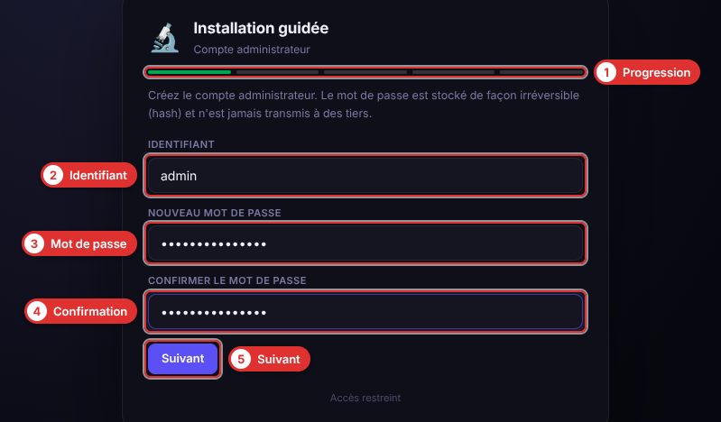{.shot width=75%}

::: legend
| n | ce que c'est |
|-|----------------------|
| 1 | La **progression** (5 segments). |
| 2 | **Identifiant** (`admin` par défaut). |
| 3 | **Nouveau mot de passe** : **8 caractères minimum**. |
| 4 | **Confirmer le mot de passe**. |
| 5 | [Suivant]{.ui}. |
:::

C'est **la seule étape obligatoire**. La création est **exclusive** : elle ne peut jamais écraser un compte existant (« Un mot de passe existe déjà. Rechargez la page pour vous connecter. »). La session est ouverte ensuite : vous ne vous reconnectez pas. Erreurs : « Mot de passe trop court (8 caractères minimum). », « Les mots de passe ne correspondent pas. ».

## Étape 2 — Identité

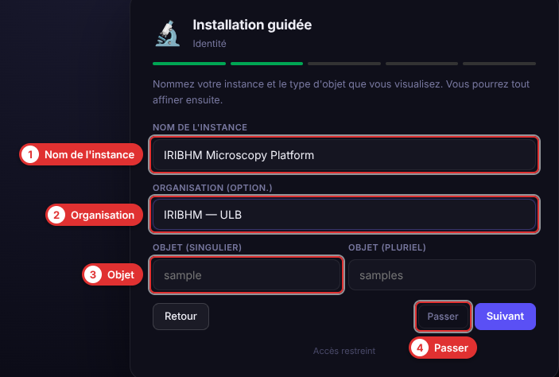{.shot width=75%}

::: legend
| n | ce que c'est |
|-|----------------------|
| 1 | **Nom de l'instance**. |
| 2 | **Organisation** (optionnelle). |
| 3 | **Objet (singulier)** et **(pluriel)** : le mot qui désigne vos objets d'étude. |
| 4 | [Passer]{.ui}. |
:::

Modifiable ensuite dans **Identité** (chapitre 8).

## Étape 3 — Thème

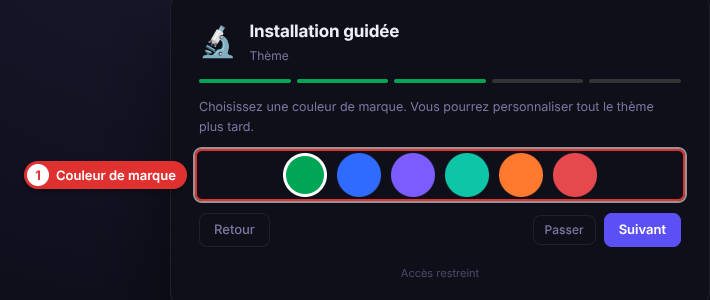{.shot width=75%}

Une **couleur de marque** parmi six (vert présélectionné). Affinable ensuite dans **Apparence** (chapitre 9).

## Étape 4 — Textes

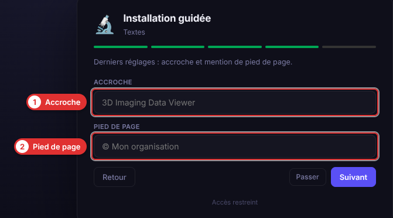{.shot width=75%}

L'**accroche** et la **mention de pied de page**. Modifiables ensuite dans **Identité**.

## Étape 5 — Plugins

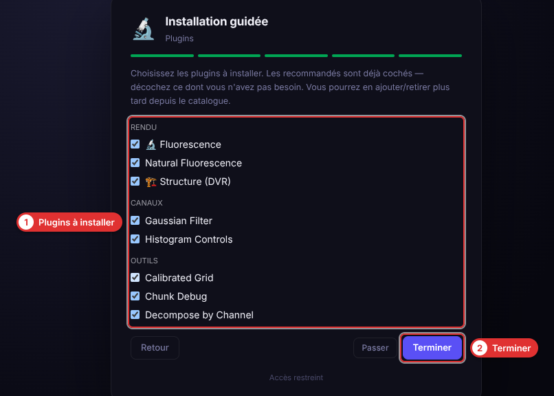{.shot width=75%}

La liste, groupée **Rendu / Canaux / Outils**, vient du catalogue signé (« Chargement du catalogue… »). Les plugins recommandés sont **déjà cochés** ; décochez ce dont vous n'avez pas besoin. Un plugin incompatible est grisé « (incompatible) ». Si le catalogue est injoignable : « Catalogue indisponible — vous pourrez installer des plugins plus tard depuis l'onglet Catalogue. ».

[Terminer]{.ui} installe la sélection (« Installation des plugins… (i/n) », « {n} plugin(s) installé(s). ») et ouvre le panneau. **Le mot de passe de l'étape 1 autorise ces installations** : rien n'est demandé deux fois.

::: note
L'assistant n'écrit que la marque, l'objet, l'organisation, le pied de page et le thème choisi.
:::

# Annexe B — En cas de problème

::: chapter-intro
- Presque tout se **défait** par un bouton « Réinitialiser » ou « Reset ».
- Un transfert interrompu **reprend** si vous reglissez le même dossier.
- Les messages « restauration automatique effectuée » **ne demandent rien**.
:::

### « J'ai oublié le mot de passe administrateur »

Il est **impossible** de le retrouver : le serveur n'en garde qu'une empreinte irréversible. La solution demande un accès aux fichiers du serveur (FTP, SFTP, gestionnaire de fichiers de l'hébergeur) :

::: steps
1. Supprimez, ou mieux **renommez**, le fichier `api/admin_credential.json`.
2. Rouvrez `admpan.html` : l'assistant de première installation réapparaît.
3. Créez un nouveau mot de passe.
:::

**Rien d'autre n'est perdu** : ni datasets, ni pages, ni réglages. Pendant ce court laps de temps, n'importe qui ouvrant la page pourrait créer le compte à votre place : faites-le d'une traite.

### « Trop de tentatives. Réessayez plus tard. »

Après 10 échecs en 15 minutes, l'accès est bloqué 15 minutes. Attendez, puis reprenez avec le bon mot de passe. Derrière un proxy, voir §1.4.

### « J'ai modifié quelque chose et le site est cassé »

| Onglet | Comment revenir en arrière |
|---|---|
| **Identité** | [Réinitialiser]{.ui} |
| **Apparence** | [Réinitialiser]{.ui} |
| **Pages** | [Défaut]{.ui} dans l'éditeur, puis **Publier** |
| **Mentions légales** | [Réinitialiser]{.ui} |
| **Types de données** | [Noms par défaut]{.ui}, puis [Enregistrer]{.ui} |
| **Datasets** | [↺ Reset]{.ui} (avant d'avoir sauvegardé) ; l'œil se rebascule |
| **Mises à jour des données** | La croix **annuler** : le dataset reste tel quel |
| **Import** | [Supprimer]{.ui} efface les fichiers envoyés (jamais un dataset publié) |

### « Un jeu de données n'apparaît pas dans la liste »

1. Regardez les filtres : [Masqués]{.ui} et [Import]{.ui} cachent des lignes ; revenez sur [Tous]{.ui}.
2. S'il vient d'un **import** : [Publier]{.ui}, puis **activez la visibilité** (un dataset publié par l'Import est masqué par défaut).
3. Vérifiez qu'il est bien dans `DATA_WEB/3d/`, `DATA_WEB/2d/` ou `DATA_WEB/live/` (noms de dossiers imposés ; renommer un *type* ne change que l'affichage) et que son dossier contient un `metadata.json`.
4. Rechargez la page. Il n'y a **aucun catalogue à régénérer**.

Sur un hébergement PHP, si l'onglet est entièrement vide, c'est que la réponse de la liste n'a pas pu se lire : demandez à la personne qui gère le serveur de vérifier `api/datasets.php?action=list`.

### « Mon import s'est arrêté » / « Connexion perdue »

- **Connexion perdue** : rien à faire, le transfert reprend tout seul quand le réseau revient.
- **Import interrompu** (onglet fermé, panne) : **reglissez le même dossier**. Il reprend au bloc près. Sans reprise, le serveur libère la place après **7 jours**.
- **Espace disque insuffisant** : libérez de la place, puis reglissez.
- **Une validation échoue** (`missing_pack`, `truncated_pack`…) : reglissez le dossier pour renvoyer ce qui manque, puis [Vérifier]{.ui} de nouveau.

### « L'option Le serveur est grisée dans Mises à jour des données »

L'hébergement ne sait pas décoder (ou encoder) le WebP sans perte, n'a pas NumPy ou zlib, ou limite trop la mémoire ou le temps. L'info-bulle donne la raison. **Utilisez [Ce navigateur]{.ui}** : il fonctionne partout.

### « Mon adresse a été bloquée par l'hébergeur pendant une mise à jour de données »

Laissez **un seul onglet** ouvert, ne relancez pas en boucle, attendez : le régulateur réseau ralentit tout seul (6 requêtes en vol au plus) et reprend. Si le blocage persiste, contactez l'hébergeur.

### « Une fonction a disparu du visualiseur »

Regardez l'onglet **Plugins** : le plugin est probablement désactivé, ou passé en **non fiable** après une modification de ses fichiers (§12.5). Dans l'aperçu de Datasets, les plugins « page seulement » sont absents : c'est normal (§12.7).

### « Un enregistrement échoue sans message clair »

Essayez **Sécurité › [Réparer les permissions]{.ui}** (§16.3) : c'est la cause la plus fréquente sur les hébergements mutualisés.

### « La mise à jour a échoué »

Si le message dit « restauration automatique effectuée », **il n'y a rien à faire** : le site est revenu à sa version précédente. Réessayez plus tard, ou signalez le message d'erreur.

### « Le panneau est illisible / les menus déroulants sont blancs sur blanc »

Faites un **rechargement forcé** : <kbd>Ctrl</kbd> + <kbd>Maj</kbd> + <kbd>R</kbd> (Windows) ou <kbd>Cmd</kbd> + <kbd>Maj</kbd> + <kbd>R</kbd> (Mac). Le navigateur garde parfois d'anciens fichiers en mémoire.

Un onglet qui ne charge pas affiche « Impossible de charger cet onglet. Rechargez la page. ».

# Annexe C — Petit glossaire

::: chapter-intro
- Les mots techniques croisés dans ce guide, **en une ligne chacun**.
- Classés par thème : données, extensions, pages, sécurité.
:::

### Les données

| Terme | Ce que ça veut dire ici |
|---|---|
| **Canal** | Un marquage fluorescent (DAPI, GFP, Pecam1…). Un jeu de données en contient souvent plusieurs, superposés. |
| **Voxel** | L'équivalent d'un pixel en trois dimensions. Sa taille réelle est donnée par la calibration (§3.6). |
| **Brique** | Un petit cube de volume (64×64×64 voxels, ou 66³ avec bordure au format 4). Le site les charge à la demande pour afficher des volumes de plusieurs gigaoctets sans tout télécharger. |
| **LOD** | *Level of Detail* : plusieurs résolutions du même volume. Le site affiche d'abord une version grossière, puis affine. |
| **Type de jeu de données** | L'une des trois catégories : `3d` (volume figé), `2d` (photographie calibrée), `live` (série temporelle 4D, avec éventuellement le suivi de ses cellules). Ce sont les dossiers du serveur ; le nom vu du public se règle dans **Types de données** (chapitre 6). |
| **Format de données** (`formatVersion`) | Le « niveau d'aménagement » d'un dataset publié, de 1 à 4 (courant : 4). Se met à niveau dans **Mises à jour des données**. |
| **Plans** (`planes/`) | Format 2 : une copie du niveau natif **plan par plan** (PNG sans perte), pour des coupes XY rapides dans le Studio. |
| **Projections de couche** (`mips/`) | Format 3 : la projection maximale de chaque couche de 64 plans, pour des figures z-stack rapides. |
| **Pyramide de briques v3** | Format 4 : briques 66³ avec bordure d'un voxel, niveaux réduits aussi en Z, `index.bin`. Apporte le filtrage sans couture et le « Zoom detail ». |
| **Sens de l'échantillon** | Réglage qui dit si le fichier montre l'échantillon vu de dessus (« à l'endroit ») ou de dessous (« à l'envers »). |
| **Vue par défaut** | La pose dans laquelle un dataset s'ouvre, enregistrée depuis l'aperçu. |

### Les transferts et les mises à jour de données

| Terme | Ce que ça veut dire ici |
|---|---|
| **Staging / import en attente** | La zone privée où arrivent les fichiers d'un import, jamais servie par URL, avant votre clic sur [Publier]{.ui}. |
| **Exécutant** | Qui fait le calcul d'une mise à jour de données : **ce navigateur** ou **le serveur**. Chacun a sa file. |
| **Régulateur réseau** | Le garde-fou qui limite le nombre de requêtes envoyées à l'hébergeur (6 en vol, 4 à 6 par seconde) pour éviter qu'il bloque votre adresse. |
| **Journal** | Le carnet tenu par le serveur de ce qui est déjà arrivé ou converti : il permet de **reprendre** au bon endroit. |

### Les extensions, les pages, la sécurité

| Terme | Ce que ça veut dire ici |
|---|---|
| **Plugin** | Un module qui ajoute une fonction au visualiseur (§12.1). |
| **Bac à sable** | Un mode d'exécution isolé : le plugin fonctionne, mais ne peut pas accéder au reste de la page. |
| **Empreinte** | Une signature du contenu exact d'un fichier : si le fichier change d'un caractère, l'empreinte change. |
| **Slug** | L'adresse courte d'une page (`protocoles` dans `page.html?slug=protocoles`). |
| **Section / Colonne / Élément** | Les trois niveaux de construction d'une page (§10.5). |
| **Brouillon** | Une version enregistrée mais **pas encore visible** du public. |
| **SEO** | Les textes qu'affichent les moteurs de recherche et les réseaux sociaux. |

---

*Document écrit pour la version **1.59.3** de la plateforme (pipeline 0.21.0, format de données 4). Les captures d'écran montrent un jeu de démonstration (embryons synthétiques) ; les couleurs peuvent différer si le thème a été modifié.*
