# Administrator's guide

**Lumen3D platform — IRIBHM Microscopy Platform**

---

This document explains **everything you can do from the site's admin panel**.

It is written for someone who has **never seen this panel** and who **does not write code**. No commands, no files to edit: everything described here is done with the mouse, from a browser.

> **Two rules worth remembering before you start**
>
> 1. **Nothing is lost until you click "Save"** (or "Publish"). Feel free to click around and explore.
> 2. **The panel never touches your images.** The microscopy files are read-only; the panel only changes settings (names, texts, colours, visibility).

---

## Contents

**Getting started**

- [1. Signing in to the panel](#1-signing-in-to-the-panel)
- [2. The lay of the land](#2-the-lay-of-the-land)

**The tabs, one by one**

- [3. Datasets](#3-datasets)
- [4. Statistics — who looks at what](#4-statistics--who-looks-at-what)
- [5. Plugins — the viewer's features](#5-plugins--the-viewers-features)
- [6. Catalog — installing new plugins](#6-catalog--installing-new-plugins)
- [7. Security — password and permissions](#7-security--password-and-permissions)
- [8. Updates — moving the site forward](#8-updates--moving-the-site-forward)
- [9. Pipeline — preparing new data](#9-pipeline--preparing-new-data)
- [10. Identity — the site's name and vocabulary](#10-identity--the-sites-name-and-vocabulary)
- [11. Pages — the visual editor](#11-pages--the-visual-editor)
- [12. Appearance — the site's colours](#12-appearance--the-sites-colours)
- [13. Legal](#13-legal)

**Appendices**

- [A. First-time setup (guided wizard)](#appendix-a--first-time-setup)
- [B. When something goes wrong](#appendix-b--when-something-goes-wrong)
- [C. Small glossary](#appendix-c--small-glossary)

---

# 1. Signing in to the panel

## 1.1. The address

The admin panel is **not** reachable from any link on the public site: there is deliberately no "Admin" button on the pages visitors see, and the panel also asks search engines not to index it.

To reach it you have to **type the address by hand** in the browser's address bar:

```
https://<site-address>/admpan.html
```

Replace `<site-address>` with the site's usual address. For example, if the public site is `https://microscopy.example.be`, the panel is at `https://microscopy.example.be/admpan.html`.

> 💡 **Tip:** bookmark this address in your browser and you will never have to remember it.

## 1.2. The credentials

<!-- ─────────────────────────────────────────────────────────────
     TO BE FILLED IN BY HAND
     ───────────────────────────────────────────────────────────── -->

> **Access credentials**
>
> - **Username:** `……………………`
> - **Password:** `……………………`
>
> *(To be filled in. Share these only with the people who genuinely need to administer the site.)*

In the PDF edition of this guide, those two blanks are **real input fields**: click into them, type, then save the PDF (`Ctrl + S`) to keep what you wrote.

## 1.3. The sign-in screen

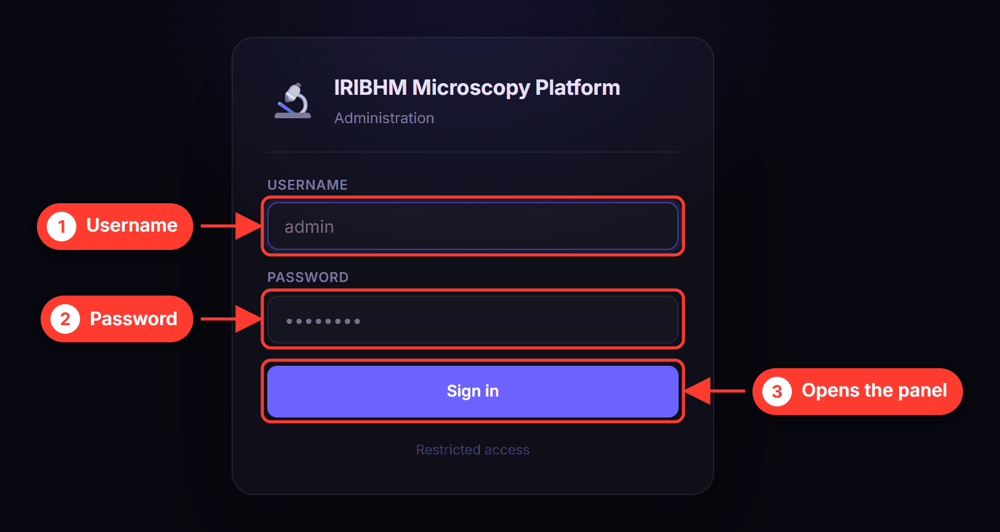

| | |
|---|---|
| **1** | Your username (`admin` by default). |
| **2** | Your password. |
| **3** | Opens the panel. The **Enter** key does the same. |

If the credentials are wrong, a red message appears above the fields. There is no lock-out after several attempts: simply try again.

**What happens next:** the browser receives a session token that keeps you signed in. That token is **not** readable by the site's pages, and it disappears when you sign out or when the server restarts. If you come back the next day you will probably have to sign in again — that is normal.

> ⚠️ **The password is written nowhere on the server.** It is turned into an irreversible fingerprint (see §7). Nobody — not even the host — can recover it. **If you lose it**, the only way out is described in [Appendix B](#appendix-b--when-something-goes-wrong).

---

# 2. The lay of the land

Once you are signed in, the screen splits into three areas that never change.

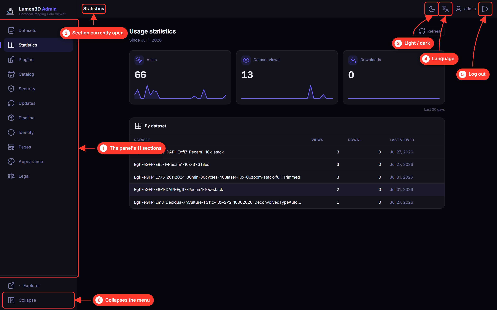

| | |
|---|---|
| **1** | **The left menu** — the panel's 11 sections. It is the backbone: each chapter of this guide matches one of these entries. |
| **2** | **The title** reminds you which section is open. |
| **3** | **Light / dark theme** — changes only *your* view of the panel, not the public site. |
| **4** | **Language** of the panel (English, French, Spanish, Dutch). |
| **5** | **Sign out.** |
| **6** | **Collapse** — folds the menu down to icons to gain room. |

At the very bottom of the menu, the **"← Explorer"** link opens the public site in a new tab: handy for checking the effect of a change.

## 2.1. The top bar in detail

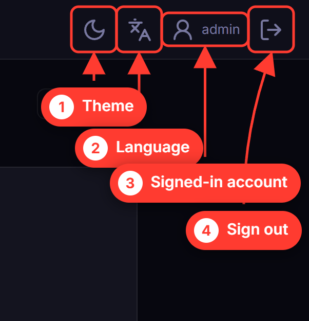

## 2.2. The "Unsaved changes" indicator

As soon as you change something without saving it, an orange pill appears at the top:

> ● Unsaved changes

It is a **reminder**, not an error. While it is there, your changes are visible only to you. If you leave the page, they are lost.

## 2.3. The tabs at a glance

| Tab | What it is for | How often |
|---|---|---|
| **Datasets** | Name, describe, show or hide each dataset | Often |
| **Statistics** | See how much the site is used | Occasionally |
| **Plugins** | Enable / disable the 3D viewer's features | Rarely |
| **Catalog** | Install new features | Rarely |
| **Security** | Change the password | Rarely |
| **Updates** | Install a new version of the site | Occasionally |
| **Pipeline** | Download the tool that prepares new data | Rarely |
| **Identity** | Site name, vocabulary, footer, menu | Rarely |
| **Pages** | Edit page content (home, about…) | Often |
| **Appearance** | Colours and font of the public site | Rarely |
| **Legal** | Legal text | Rarely |

---

# 3. Datasets

This is the tab you will open most often. It is where you **describe** the datasets and **choose which ones are visible** to the public.

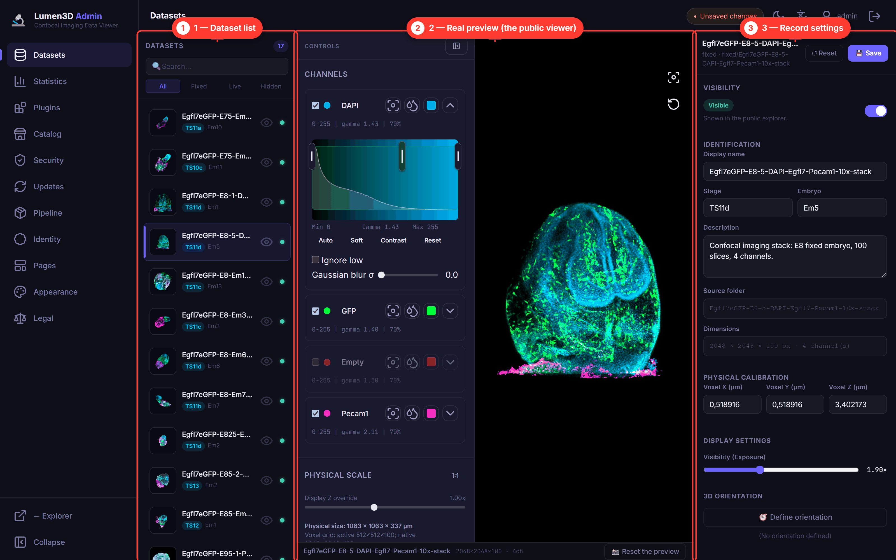

The screen is split into **three columns**:

1. **the list** of every dataset;
2. **the preview** — the real viewer, exactly as a visitor sees it;
3. **the settings** of the selected dataset.

> ### 📌 How does a dataset get here?
>
> You do **not** create a dataset from the panel. The process is:
>
> 1. the raw microscope images are processed by the preparation tool (see [§9](#9-pipeline--preparing-new-data));
> 2. the resulting folder is copied into the server's `DATA_WEB` folder (over FTP, or by whoever runs the server);
> 3. **it appears in this list immediately** — there is nothing to regenerate, no button to press.
>
> The panel is then used to give it a presentable name and to decide whether it is public.

## 3.1. The left column: finding a dataset

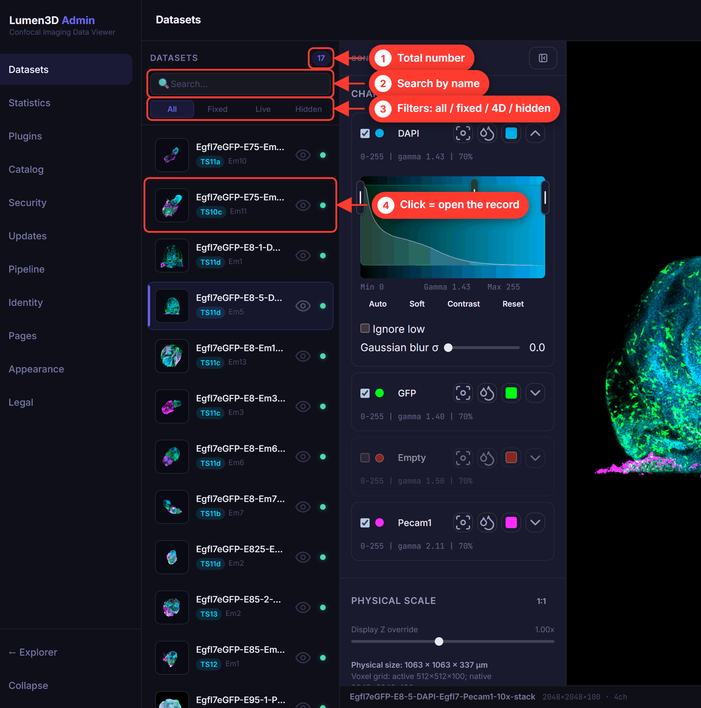

| | |
|---|---|
| **1** | The total number of datasets on the server. |
| **2** | **Search** — type part of a name and the list filters as you type. |
| **3** | **Filters** — `All`, `Fixed` (still volumes), `Live` (4D time series), `Hidden` (the ones that are not public). |
| **4** | **Click a thumbnail** to open its record. |

On each row, to the right of the name:

- **the eye** shows whether the dataset is visible to the public;
- **the green dot** means its files are complete and readable.

## 3.2. The middle column: the preview

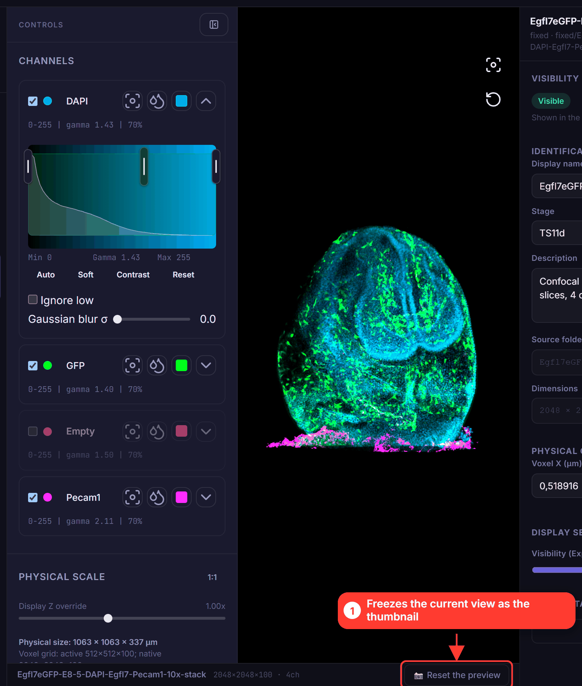

This is not a still image: it is **the real 3D viewer**, loaded inside the panel. You can rotate the volume, change channel colours, adjust the contrast — exactly like a visitor.

> ### 📌 This preview is more than a preview
>
> Some settings made here are **picked up by the panel** and stored with the dataset when you click **Save**:
>
> - the **channel settings** — name, colour, min / max / gamma, shown or hidden (see §3.4);
> - the **brightness** (Exposure);
> - the **orientation** if you are in the middle of defining it (see §3.5).
>
> Everything else — camera position, render mode, quality, background, clipping plane — is for looking only and **is not kept**.
>
> That is why the **"Unsaved changes"** pill can appear simply because you nudged a slider in the preview. If you did not mean to change anything, click **↺ Reset** rather than Save.

The **📸 Reset the preview** button (bottom right) **freezes the current view** and uses it as the dataset's thumbnail in the public explorer. Orient the volume the way you want it to appear, then click.

Loading a large volume takes a few seconds — that is normal, the data runs to several gigabytes and is downloaded piece by piece.

## 3.3. The right column: the settings

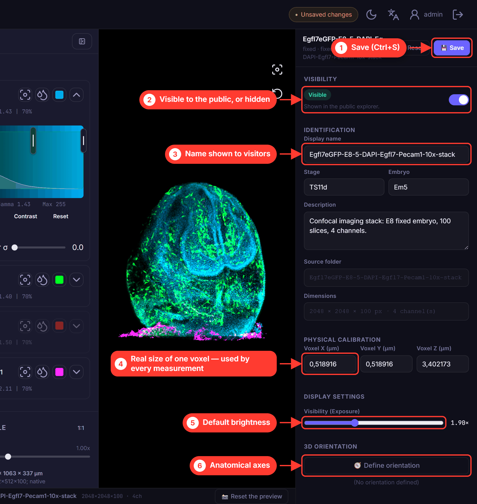

| | |
|---|---|
| **1** | **Save** — stores your changes. Shortcut: **Ctrl + S**. The **↺ Reset** button discards unsaved changes. |
| **2** | **Visibility** — the switch decides whether the dataset appears in the public explorer. |
| **3** | **Display name** — the name visitors will see. |
| **4** | **Physical calibration** — the real size of one voxel in micrometres. |
| **5** | **Visibility (Exposure)** — the default brightness on opening. |
| **6** | **3D orientation** — see §3.5. |

### Each field in detail

**Visibility**
The switch at the top. `Visible` = everyone can reach it from the explorer. Hidden = it stays on the server and remains reachable if you know its exact address, but no longer shows up in any list. Useful for a dataset still being checked, or tied to a paper that is not out yet.

**Identification**

- **Display name** — replace the folder's technical name with something readable. This is the name that appears everywhere on the public site.
- **Stage** and **Specimen** — the two labels used for filtering in the explorer. They are pre-filled automatically from the folder name; correct them if the detection got it wrong.
- **Description** — free text shown on the public record. Write what would help a colleague: markers used, conditions, anything unusual.
- **Source folder** and **Dimensions** — greyed out, **not editable**. They are read from the files.

**Physical calibration — ⚠️ the most important field**
The three `Voxel X / Y / Z` values give the real size of one point of the image, in micrometres. **Every measurement made by visitors depends on them**: the distance tool, the scale bar, the dimensions shown.

These values are read automatically from the microscope file and are normally correct. **Only change them if you have a specific reason to believe they are wrong** — a wrong value silently invalidates every measurement published from that dataset.

Note that `Voxel Z` is often much larger than X and Y (for example `0.52 / 0.52 / 3.40`): that is normal, the spacing between two slices is larger than the in-plane resolution.

**Display settings**
The **Visibility (Exposure)** slider sets the brightness on opening. If a dataset looks too dark at first glance, raise it. Visitors can always adjust it on their side afterwards.

## 3.4. Configuring the channels

A microscopy dataset holds several **channels** — one per fluorescent marker. This is where you decide what they look like **by default**, that is, what a visitor sees when they open the dataset and touch nothing.

These settings are made in the **preview's sidebar** (middle column), and are stored with the rest of the record when you click **💾 Save**.

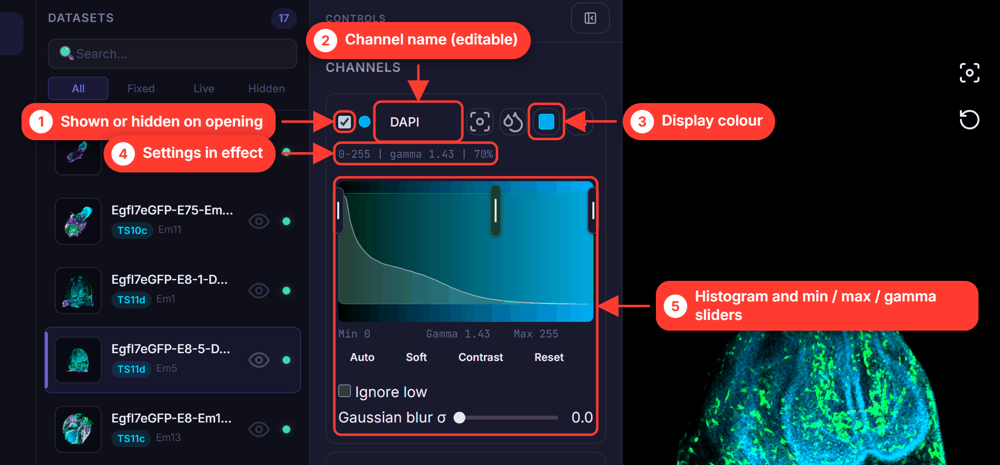

| | |
|---|---|
| **1** | **The checkbox** — is the channel shown or hidden on opening? |
| **2** | **The channel name** — click into it and type to rename it. |
| **3** | **The channel's display colour.** |
| **4** | The **summary** of the settings in effect (min–max, gamma, opacity). |
| **5** | The **detailed panel**: histogram and sliders. Open it with the ⌄ chevron at the right of the row. |

### What you can set

**The name.** Channels often arrive named `Channel 1`, `Channel 2`… Replace them with the actual marker — `DAPI`, `GFP`, `Pecam1`. That is the name visitors will see.

**The colour.** The coloured button opens a palette. Pick colours that separate the markers clearly.

> 💡 Some colours are assigned automatically from the channel name: a channel called `DAPI` turns blue, `GFP` green, `Pecam1` magenta. Renaming a channel properly is therefore often enough to get the right colour.

**Shown or hidden.** Untick a channel that carries little information (an empty channel, an autofluorescence one): it stays available, but the visitor does not see it at first. This is the single most useful setting for a clean first impression.

**Min / max / gamma.** In the detailed panel, the histogram shows how intensities are distributed and the three handles set the low threshold, the high threshold and the gamma. The **Auto**, **Soft** and **Contrast** buttons offer ready-made settings; **Reset** goes back to the start.

> ⚠️ **These settings are cosmetic, not destructive.** They change how the data is *displayed*, never the data itself. A visitor can readjust everything on their side; you are only setting the starting point.

**Remember to click 💾 Save** in the right column: without it, your channel settings are lost as soon as you switch dataset.

## 3.5. Defining the anatomical orientation

The **🧭 Define orientation** button is how you state where the front, the top and the right of the specimen are. Once defined, visitors see a three-axis marker in the viewer.

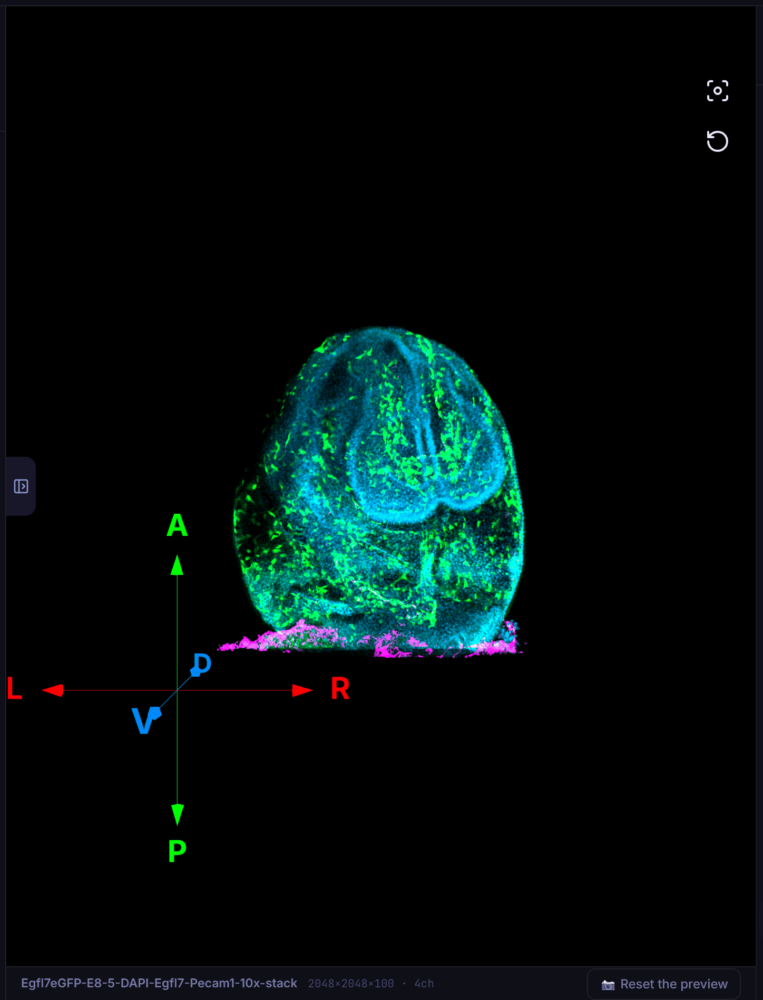

Three coloured axes appear on the volume:

| Axis | Colour | Meaning |
|---|---|---|
| **A / P** | green | Anterior ↔ Posterior (front / back) |
| **D / V** | blue | Dorsal ↔ Ventral (back / belly) |
| **L / R** | red | Left ↔ Right |

**How to do it:**

1. click **🧭 Define orientation**;
2. rotate the volume in the preview until the specimen lines up correctly with the axes shown;
3. click **💾 Save** at the top of the right column.

The button turns into **✕ Cancel orientation** while you work: it lets you leave without changing anything.

## 3.6. When no dataset is selected

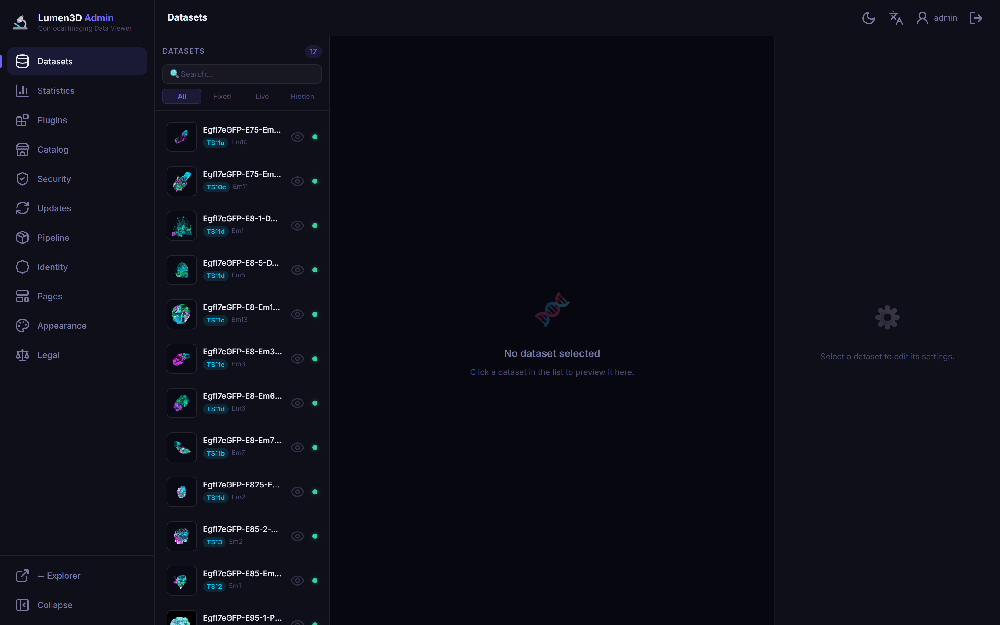

This is the tab's welcome screen. Just click a thumbnail on the left.

---

# 4. Statistics — who looks at what

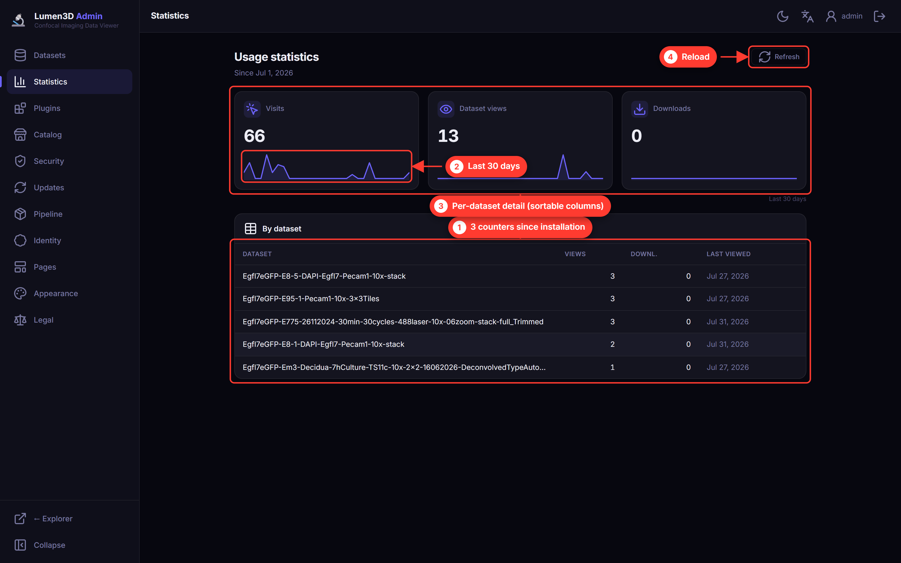

| | |
|---|---|
| **1** | Three counters, cumulative since installation. |
| **2** | The small curve shows the **last 30 days**. |
| **3** | The breakdown **per dataset**. Click a column header to sort. |
| **4** | **Refresh** — reloads the figures. |

**What the three counters count:**

- **Visits** — how many times a page of the site was opened.
- **Dataset views** — how many times a dataset was opened in the viewer. This is the most meaningful figure.
- **Downloads** — how many files were fetched from the download centre.

The table at the bottom gives, for each dataset, the number of views, downloads and the date it was last consulted.

> 🔒 **No personal data is collected.** These are plain counters. There is no tracking cookie, no IP address recorded, no external service (no Google Analytics). Nothing leaves the server.

---

# 5. Plugins — the viewer's features

This is the most technical chapter, but also the one that gives you the most control. Take the time to read §5.1: the rest follows from it.

## 5.1. What is a plugin here?

The 3D viewer is deliberately built as a **minimal core + modules**. Almost everything a visitor can do — measure a distance, take a screenshot, adjust a channel's histogram, pick a render mode — is provided by a **plugin**, that is, a small independent module.

The point: you can **remove what your lab does not use**, and **add** new features later without touching the rest of the site.

Each plugin occupies one of **three possible placements**:

| Placement | Where the visitor sees it | Examples |
|---|---|---|
| **Tools** (toolbar) | The buttons at the top of the viewer | Distance measurement, screenshot, presentation mode, download centre |
| **Channels** (per channel) | The controls under each fluorescence channel, in the sidebar | Histogram, Gaussian blur |
| **Render modes** (shaders) | The dropdown that picks how the volume is drawn | Fluorescence, Structure (DVR) |

## 5.2. The screen

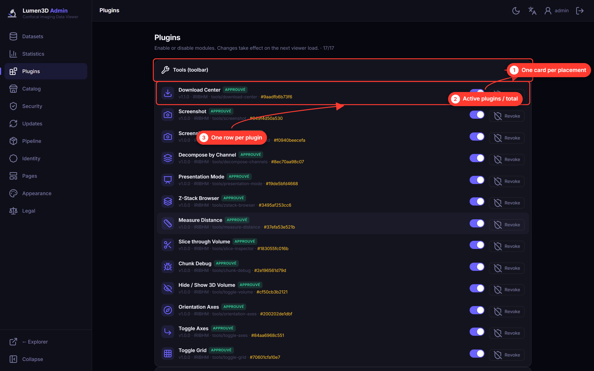

| | |
|---|---|
| **1** | One card per placement (Tools, Channels, Render modes). |
| **2** | That category's `active / total` counter. |
| **3** | One row per plugin. |

A closer look at one row:

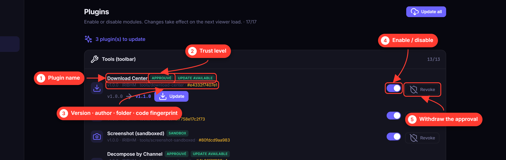

| | |
|---|---|
| **1** | The plugin's **name**. |
| **2** | Its **trust level** (see §5.4). |
| **3** | Version · author · folder · code **fingerprint**. |
| **4** | The switch that **enables or disables** the plugin. |
| **5** | **Revoke** — withdraws permission to run (see §5.5). |

## 5.3. Enabling or disabling a plugin

Just flip the switch. The change is saved immediately (a small confirmation appears at the bottom) and takes effect **the next time the viewer loads** — ask a visitor to reload their page, or reload the preview in the Datasets tab.

Disabling a plugin does not delete it: it stays on the server and you can re-enable it at any time.

> 🔒 **There is exactly one guard rail: at least one render mode must stay active.** If you try to disable the last one, the panel refuses and shows "At least one render mode must stay active." Without a render mode, the viewer would have nothing left to draw the volume with.

## 5.4. Trust levels — why they exist

This is the important part of the chapter.

A plugin is **real code that runs in your visitors' browsers**. A malicious plugin could display anything, or hijack what the page does. The platform therefore takes the opposite of the usual stance: **by default, a plugin is not allowed to run.** You, the administrator, must explicitly allow it.

Each plugin therefore carries a label:

| Label | Meaning | What it implies |
|---|---|---|
| **`bundled`** | Shipped with the official version of the site, and its code matches exactly what was published | Trusted. Nothing to do. |
| **`approved`** | You allowed it to run normally in the page | Trusted because **you** decided so. |
| **`sandbox`** | Allowed, but **locked inside a sandbox**: it runs isolated, with no access to the rest of the page or to the panel | The safest mode. |
| **`dev`** | Development machine only | Never appears on a production site. |
| **`untrusted`** | **Refused.** The plugin is not loaded at all | See §5.5. |

**The fingerprint** (the `#06c7945439b8`-style code shown under each name) is a signature of the exact file contents. Your approval is **tied to that precise fingerprint**. If anyone changes so much as one character of the plugin, the fingerprint changes, the approval lapses and the plugin drops back to **untrusted** automatically. That is what stops an approved plugin from being quietly swapped for something else.

## 5.5. Approving an untrusted plugin

You will meet this case if someone drops a plugin straight onto the server (over FTP, say) instead of going through the Catalog.

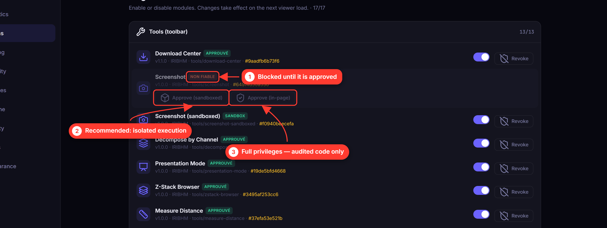

| | |
|---|---|
| **1** | The red **UNTRUSTED** label. While it is there the plugin is **not** loaded — as far as visitors are concerned it does not exist. |
| **2** | **Approve (sandboxed)** — the plugin runs isolated. **This is the recommended choice.** |
| **3** | **Approve (in-page)** — the plugin runs with the page's full privileges. |

**The procedure, step by step:**

1. click one of the two buttons;
2. a dialog summarises what you are approving and shows the code's **fingerprint**;
3. the panel asks you to **retype your administrator password**;
4. the plugin becomes active the next time the viewer loads.

> ❓ **Why ask for the password again?**
> Because approving a plugin is the one action that lets outside code run. Even if someone sat down at your screen while you were signed in, they could not approve a plugin without also knowing your password.

> ⚠️ **When should you pick "in-page" over "sandboxed"?**
> Almost never, unless you have read the code yourself or it comes from someone you trust on your team. Note that **channel** and **render mode** plugins cannot technically be sandboxed: they have to talk to the graphics card directly. The bar is therefore higher for them.

**Withdrawing an approval:** the **Revoke** button on the plugin's row. It immediately becomes untrusted again and stops being loaded.

## 5.6. The plugins shipped by default

| Plugin | Placement | What it does for the visitor |
|---|---|---|
| **Fluorescence** | Render | The default render: each channel emits its colour, as on a fluorescence microscope |
| **Structure (DVR)** | Render | A volume render with depth and shading, which brings out shapes better |
| **Histogram Controls** | Channel | The intensity histogram + the min / max / gamma sliders |
| **Gaussian Filter** | Channel | A blur slider to smooth out a channel's noise |
| **Measure Distance** | Tool | Click two points on the volume to get the real distance in µm |
| **Slice through Volume** | Tool | A freely orientable cutting plane through the volume |
| **Z-Stack Browser** | Tool | Step through the slices one by one, like a stack of images |
| **Decompose by Channel** | Tool | Show the channels side by side rather than superimposed |
| **Download Center** | Tool | Fetch the dataset's files, measurements, metadata and exports |
| **Screenshot** | Tool | Capture the 3D view as a PNG |
| **Presentation Mode** | Tool | Full screen with no interface, for projecting |
| **Orientation Axes** | Tool | The A/P · D/V · L/R anatomical marker (see §3.5) |
| **Toggle Grid / Axes / Volume** | Tools | Show or hide the grid, the axes, the volume |
| **Chunk Debug** | Tool | A technical diagnostic tool. **Safe to disable** on a production site |

---

# 6. Catalog — installing new plugins

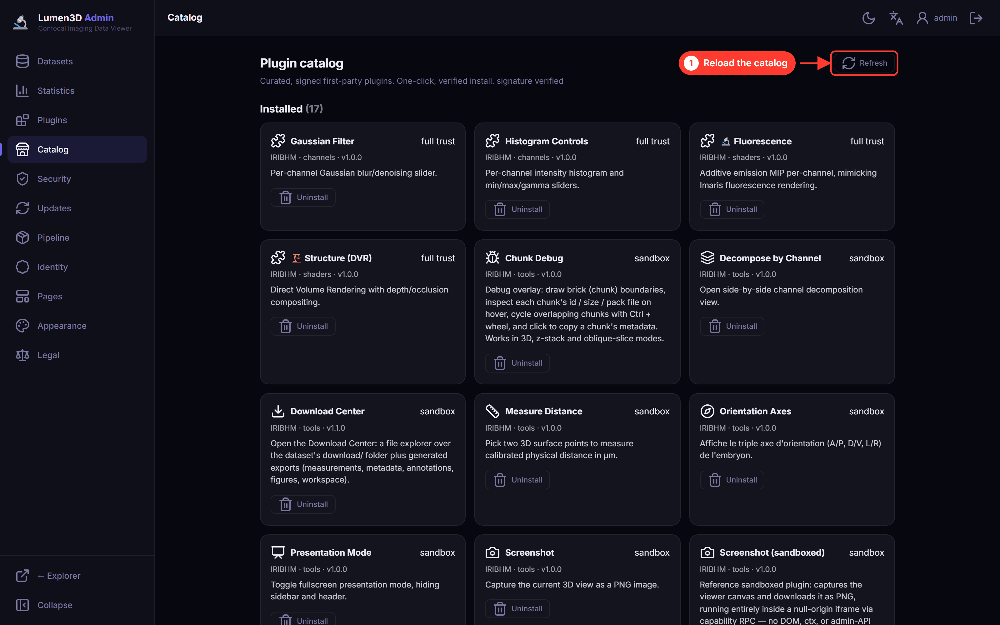

The Catalog works like an app store: it lists the official plugins available, and you install them in one click.

Plugins are split into three sections: **Installed**, **Available**, and possibly **Incompatible**.

## 6.1. Installing a plugin

1. find the plugin's card under **Available**;
2. click **⬇ Install**;
3. **retype your administrator password**;
4. the plugin is downloaded, verified, installed and **automatically approved** — there is nothing for you to do in the Plugins tab.

During installation the server checks that the downloaded file matches, bit for bit, what the catalog announced. If there is the slightest discrepancy, **the installation is cancelled** rather than installing something questionable.

The **"signature verified"** note at the top of the page confirms that the catalog itself is authentic.

## 6.2. Uninstalling

The **🗑 Uninstall** button on the plugin's card, then confirm. The files are removed from the server. You can always reinstall later from the Catalog.

A refusal is possible in exactly one case: if it is the **last render mode** installed (same reason as in §5.3).

## 6.3. The labels on the cards

| Label | Meaning |
|---|---|
| **`sandbox`** | This plugin will run isolated. That is the case for toolbar plugins. |
| **`full trust`** | This plugin will run with the page's full rights. Unavoidable for render modes and channel controls, which drive the graphics card directly. |
| **`incompatible`** | This plugin needs a newer (or older) version of the site than yours. The install button is greyed out. Run an update (see §8) and it becomes installable again. |

---

# 7. Security — password and permissions

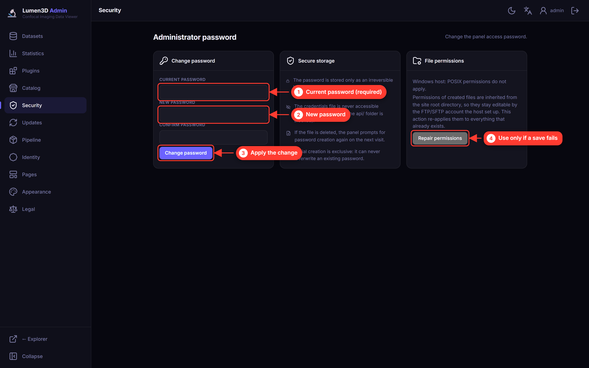

| | |
|---|---|
| **1** | Your **current** password — required. |
| **2** | The new password, typed twice. |
| **3** | Confirm. |
| **4** | **Repair permissions** — only to be used if there is a problem (§7.3). |

## 7.1. Changing the password

Fill the three fields and click **Change password**. You need to know the old one: that stops anyone who finds your session open from locking you out.

You **stay signed in** after the change. Your other sessions, however, are not closed automatically.

> 💡 **Advice on picking a password.** The panel technically accepts 4 characters, but aim for **12 or more**. An easy-to-remember phrase beats a complicated word: `microscope-embryo-2026` is far stronger than `M1cr0!`.

## 7.2. How the password is stored

The **Secure storage** card sums up the guarantees, which are worth understanding:

- **The password is never written in clear text.** The server keeps only an irreversible fingerprint (a standard method: salted PBKDF2). You cannot work back from that fingerprint to the password.
- **The credentials file is never served by the site.** Even typing its exact address into a browser returns an error.
- **If the file is deleted**, the panel offers to create a password again on the next visit. That is the escape hatch if you forget it (see [Appendix B](#appendix-b--when-something-goes-wrong)).
- **Initial creation is exclusive: it can never overwrite an existing password.** Nobody can "reinstall" over the top to lock you out.

## 7.3. Repairing permissions

This card is only useful on some shared hosts, where the site runs under a different system account from the FTP one. The result: files created by the site become unreadable or uneditable.

**Symptom:** a save fails for no apparent reason in another tab.

In that case only, click **Repair permissions**. The operation is harmless and re-applies the correct access rights to every file. A message reports how many entries were fixed.

On a Windows server the card simply states that POSIX permissions do not apply — that is normal, there is nothing to do.

---

# 8. Updates — moving the site forward

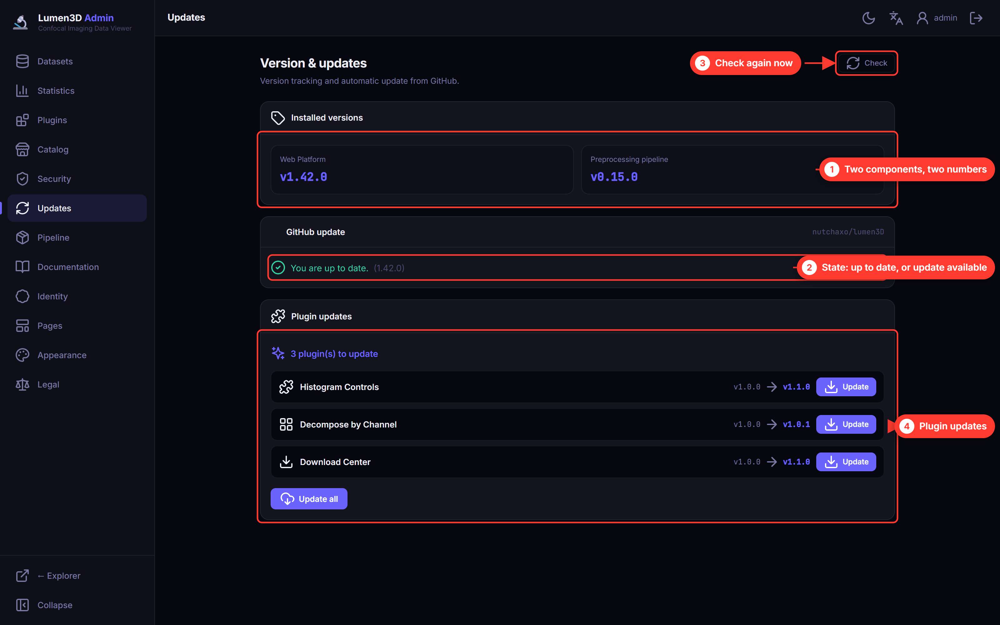

| | |
|---|---|
| **1** | The installed version of the platform. |
| **2** | The state: *up to date*, or *update available*. |
| **3** | **Check** — runs the search again immediately. |

Three version numbers are shown — that is normal, they are three independent components:

- **Web Platform** — the site itself. **This is the one that matters.**
- **Dev server** — the local development tool.
- **Preprocessing** — the data preparation tool (see §9).

## 8.1. Running an update

When a new version exists, the **release notes** are shown: read them, they describe what changes.

1. click **⬇ Update now**;
2. **a check report appears** — an important step, detailed below;
3. click **✓ Confirm update**;
4. let it run: a row of steps scrolls past.

**The check report** tells you, before anything is installed:

- how many plugins will stay compatible;
- which ones will be **quarantined** because they do not work with the new version yet. They are not deleted: they re-enable themselves as soon as an update makes them compatible again;
- whether anything **blocks** the update, in which case the confirm button does not appear.

**The steps that then scroll past:** Checks → Backup → Download → Integrity → Staging → Boot check → Swap plan → Switching over → Server restart.

The server restarts at the end: **you will have to sign in again.** That is normal.

## 8.2. The safety nets

The update is designed so that a failure cannot break the site:

- **A full backup is taken first.**
- **The downloaded file is verified** (fingerprint + the author's electronic signature) before being used. A tampered file is rejected.
- **The new version is tested before going live.** If it fails to start, **the site automatically returns to the old version.** You will see the message "automatic rollback done" — the site still works, there is nothing to repair.
- **Your data is preserved:** the datasets (`DATA_WEB`), your credentials, your statistics and your Identity, Pages and Appearance settings are never touched by an update.

## 8.3. Possible messages

| Message | What it means |
|---|---|
| **You are up to date** | Nothing to do. |
| **GitHub API rate limit reached** | Too many checks in a short time. Retry in a few minutes. Harmless. |
| **Unable to reach GitHub** | A network problem on the server side. Retry later. |
| **No release published** | No version has been published publicly yet. |
| **The certificate store is unusable** | A host configuration issue. Report it to whoever runs the server. |

---

# 9. Pipeline — preparing new data

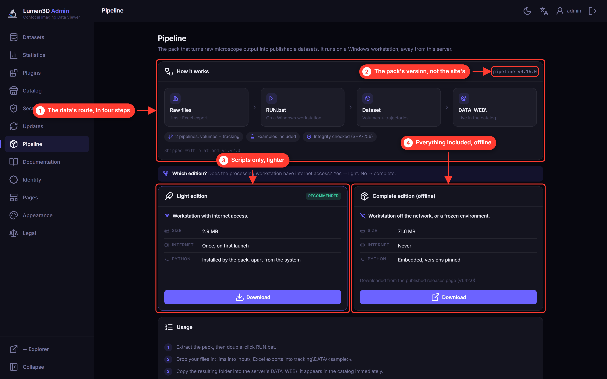

This tab processes **nothing** on the server. It gives you **a tool to download** and run on a powerful computer, typically the lab's analysis workstation.

**Why separate them?** Converting a microscopy volume needs an enormous amount of RAM — reckon on about **32 GB** for a 3789 × 3789 × 178 volume. No shared web server can do that.

## 9.1. What the pack contains

- **Volume pipeline** — converts Imaris `.ims` stacks into brick-chunked datasets, with a level-of-detail pyramid, thumbnail and metadata.
- **Tracking pipeline** — reads the Excel export produced by Imaris, reconstructs cell lineages (mitoses included), stabilises the trajectories and computes the metrics.
- **Attachment** — links an analysed tracking run to an already-processed dataset, so the trajectories overlay the images.
- **One example input per pipeline** — the pack is usable straight away, with no real data, to get the hang of it.
- **A `RUN.bat` launcher** that checks file integrity, verifies the Python installation and runs the chosen pipeline.

## 9.2. Which edition to choose

| | **Complete edition** | **Light edition** |
|---|---|---|
| Size | ~70 MB (200 MB extracted) | a few MB |
| Internet | **Never needed** | Needed **once**, on first launch |
| Python | Embedded, versions pinned | Fetched on first launch, into an isolated environment |
| For whom | An offline workstation, or to guarantee identical results across installations | A connected workstation, everyday use |

The light edition **never** modifies the Python already installed on the workstation: it works in its own corner.

## 9.3. How to use it

1. extract the archive on the processing workstation;
2. double-click **`RUN.bat`**;
3. drop the `.ims` files into `input\`, and the Excel exports into `tracking\DATA\<sample>\`;
4. ⚠️ **the Excel filename must contain the interval between frames** (for example `30min`) — the analysis reads its time base from it;
5. copy the resulting folder into the server's `DATA_WEB\`;
6. it appears in the Datasets tab straight away.

---

# 10. Identity — the site's name and vocabulary

This tab lets you rename the site entirely, without touching any code. It is what lets the same platform serve an embryology lab or a neuroscience institute.

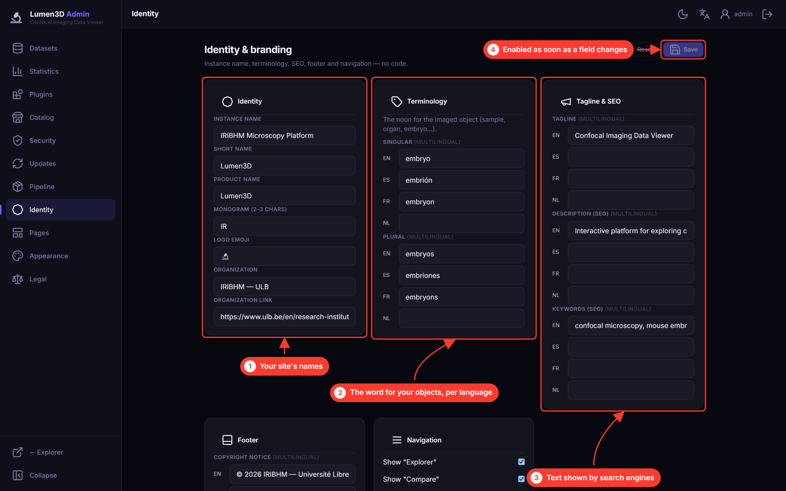

| | |
|---|---|
| **1** | Your site's names. |
| **2** | The word for the objects you study, **per language**. |
| **3** | The text shown by search engines. |
| **4** | **Save** — becomes active as soon as a field changes. |

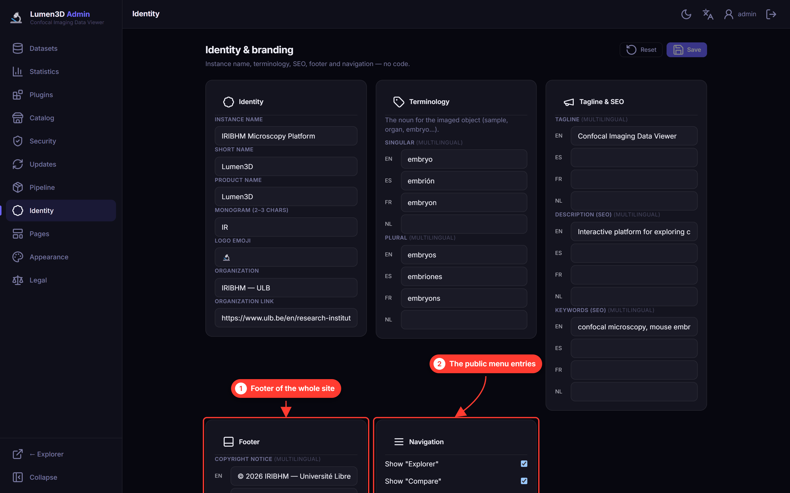

## 10.1. The multilingual fields

Fields marked **(MULTILINGUAL)** show one row per language: `EN`, `ES`, `FR`, `NL`.

**Always fill in `EN` at the very least.** It is the fallback: if a visitor browses the site in Spanish and the `ES` field is empty, the English text is shown — never a blank.

## 10.2. The "Identity" card

| Field | What it is for | Example |
|---|---|---|
| **Instance name** | The full name, used in page titles | `IRIBHM Microscopy Platform` |
| **Short name** | Used where space is tight | `Lumen3D` |
| **Product name** | The software's name in running text | `Lumen3D` |
| **Monogram** | 2–3 letters for the logo badge | `IR` |
| **Logo emoji** | The emoji shown next to the name | 🔬 |
| **Organization** | Your lab or institution | `IRIBHM — ULB` |
| **Organization link** | The address of its website | `https://…` |

## 10.3. The "Terminology" card — the most useful one

This is where the site adapts to your field. You define **the word for what you image**, singular and plural, in each language.

That word is then **picked up automatically throughout the public interface**: titles, filters, statistics, descriptions. Write `embryo / embryos` and the site talks about embryos. Write `sample / samples` and it talks about samples — everywhere, with no other change.

## 10.4. The "Tagline & SEO" card

- **Tagline** — the subtitle shown under the site's name.
- **Description (SEO)** — the summary Google and social networks display. Two clear sentences are enough.
- **Keywords (SEO)** — a few comma-separated terms.

## 10.5. The "Footer" card

- **Copyright notice** — the text at the bottom of every page.
- **Links** — the footer links. **+ Add link** creates one (label + address), the cross removes one.

## 10.6. The "Navigation" card

The checkboxes decide which entries appear in the public site's menu: *Explorer*, *Compare*, *Tracking*, *About*, *Legal*.

Unticking an entry removes it from the menu without deleting the page.

> ⚠️ **Watch out for "Legal".** That box is unticked by default. If you write your legal notice (§13), remember to come back here to make it reachable.

---

# 11. Pages — the visual editor

This is the panel's richest feature. It lets you **edit the site's page content as you would in a page-layout program**, without writing a line of code.

## 11.1. Picking a page

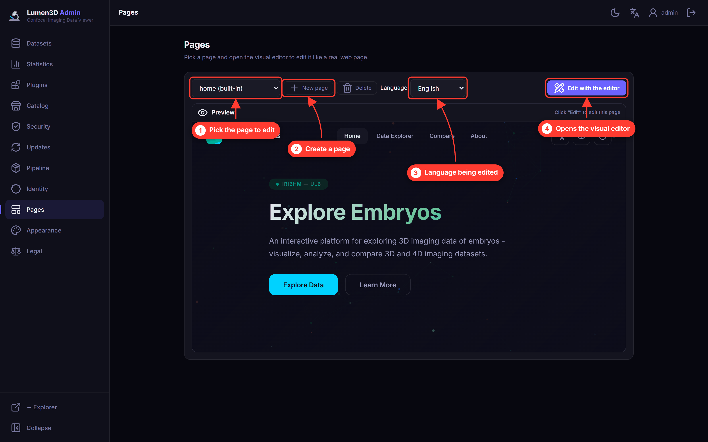

| | |
|---|---|
| **1** | The page to edit. |
| **2** | **New page** — creates an extra page. |
| **3** | The **language** you are editing. |
| **4** | **Edit with the editor** — opens the visual editor. |

The **🗑 Delete** button erases a page you created. It stays greyed out on `home` and `about`: those two cannot be deleted, only reset to their original template from the editor.

Two pages exist out of the box: **`home`** and **`about`**. The *(built-in)* note means they still use the supplied template: from your first publish onwards, your version takes over.

## 11.2. The editor

The editor opens **in its own browser tab** so it has the whole screen.

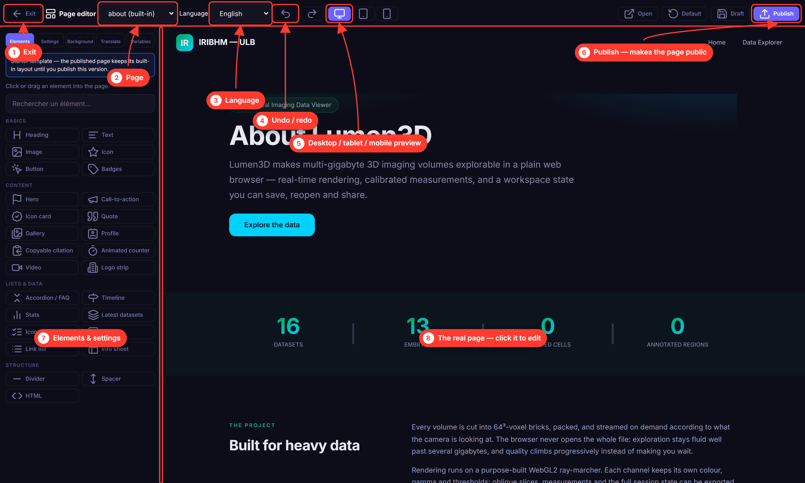

| | |
|---|---|
| **1** | **Exit** — back to the panel. |
| **2** | The page being edited. |
| **3** | The language being edited. |
| **4** | **Undo / Redo** (`Ctrl+Z` / `Ctrl+Y`). |
| **5** | **Desktop / tablet / mobile** preview. |
| **6** | **Publish** — makes the version visible to the public. |
| **7** | The **sidebar**: elements to insert, and the settings of whatever is selected. |
| **8** | **The real page.** This is not a mock-up: it is your actual page, with its real menu, real footer and real theme. What you see is exactly what visitors will see. |

## 11.3. The top bar in detail

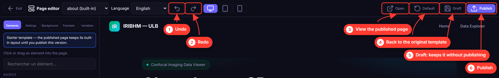

| | |
|---|---|
| **1 – 2** | **Undo** and **Redo**. |
| **3** | **Open** — shows the published page in a new tab, for comparison. |
| **4** | **Default** — returns to the original template. ⚠️ Erases your layout. |
| **5** | **Draft** — saves without publishing. You can close and come back later. |
| **6** | **Publish** — puts your version online. |

> 📌 **The distinction to remember: Draft ≠ Publish.**
> Until you click **Publish**, visitors keep seeing the old version. You can therefore work for days saving drafts, without breaking anything.

## 11.4. Adding an element

The sidebar's **Elements** tab holds everything that can be placed in a page.

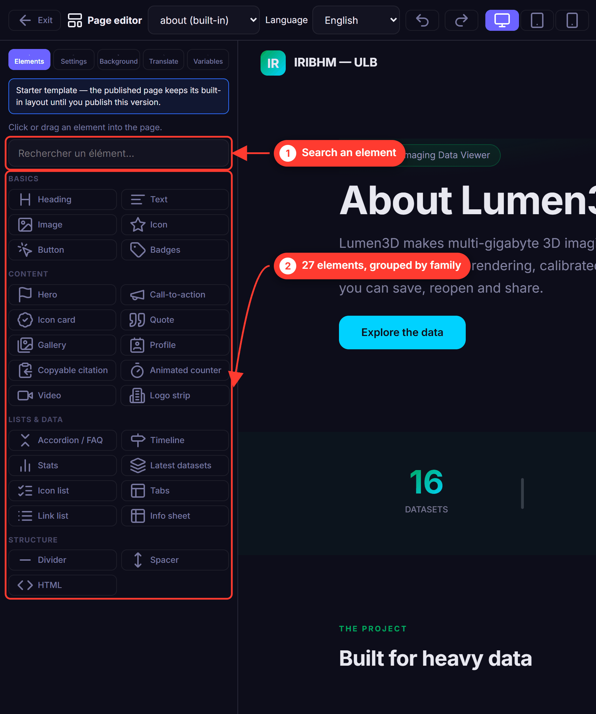

Two ways to go about it:

- **click** an element: it is appended at the end of the page;
- **drag** it where you want it: drop zones appear while you move.

The **Search an element** field filters the list — handy, since there are 27.

### The 27 available elements

**Basics** — the elementary bricks

| Element | What it is |
|---|---|
| **Heading** | A section title |
| **Text** | A paragraph |
| **Image** | An image |
| **Icon** | A pictogram |
| **Button** | A clickable button |
| **Badges** | Small coloured labels |

**Content** — the presentation blocks

| Element | What it is |
|---|---|
| **Hero** | The big introductory banner at the top of a page |
| **Call-to-action** | A panel inviting a click |
| **Icon card** | A card: icon + title + text |
| **Quote** | A highlighted quotation |
| **Gallery** | Several images in a grid |
| **Profile** | A person's card (photo, name, role) |
| **Copyable citation** | A bibliographic reference with a "copy" button |
| **Animated counter** | A number that counts up on display |
| **Video** | An embedded video |
| **Logo strip** | A row of partner logos |

**Lists & data**

| Element | What it is |
|---|---|
| **Accordion / FAQ** | Questions that unfold |
| **Timeline** | A sequence of dated steps |
| **Stats** | A row of key figures |
| **Latest datasets** | **Fills itself** with your recent datasets |
| **Icon list** | An illustrated bullet list |
| **Tabs** | Content split across tabs |
| **Link list** | A list of links |
| **Info sheet** | A label / value table |

**Structure**

| Element | What it is |
|---|---|
| **Divider** | A horizontal rule |
| **Spacer** | An adjustable empty gap |
| **HTML** | Free-form HTML — **for advanced users only** |

> 💡 **The elements that fill themselves.** *Latest datasets* and *Stats* can draw straight from the site's data: number of datasets, of specimens, of tracked cells, of annotated regions. The figure updates by itself when you add data — you will never have to come back and correct the page.

## 11.5. Editing an existing element

**Click it in the page.** It gets a green outline and the sidebar switches to its settings.

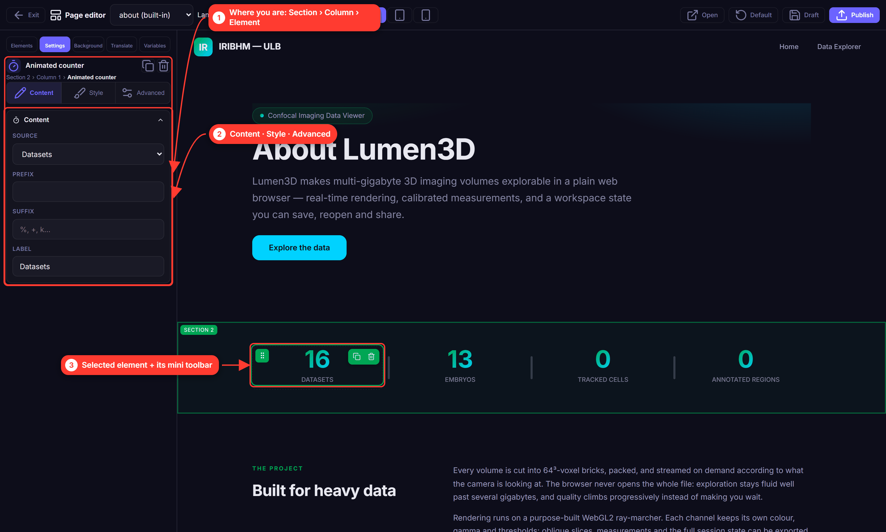

| | |
|---|---|
| **1** | The **breadcrumb**: `Section 2 › Column 1 › Animated counter`. It tells you exactly where you are, and every level is clickable. |
| **2** | The three settings tabs: **Content**, **Style**, **Advanced**. |

### The mini toolbars

A small green bar appears on the block under your cursor:


**Only one bar is visible at a time**: the one belonging to the innermost level under your cursor. Hover an element and you get the element's bar; leave the element but stay inside the column and you get the column's; move into the section's margin and you get the section's.

**An element's bar**

| Icon | Action |
|---|---|
| **⠿** (dots, on the left) | **Drag handle** — hold and drag to move the element |
| **⧉** | **Duplicate** |
| **🗑** | **Delete** |

**A column's bar**

| Icon | Action |
|---|---|
| **‹** **›** | Move the column left / right |
| **⚙** | Column settings |
| **⧉** · **🗑** | Duplicate · Delete |

**A section's bar**

| Icon | Action |
|---|---|
| **⌃** **⌄** | Move the section up / down the page |
| **▥** | **Add a column** |
| **⚙** | Section settings |
| **⧉** · **🗑** | Duplicate · Delete |

> 💡 **To reach a column or a section without hunting for the right hover zone**, use the sidebar's **breadcrumb** (callout 1 above): `Section 2 › Column 1 › Animated counter`. Every level is clickable and selects that block directly.

### The three settings tabs

**Content** — what is written: the texts, the images, the links, the data source. This is the tab you will use most.

**Style** — the look: colours, sizes, spacing, alignment, corner radius.

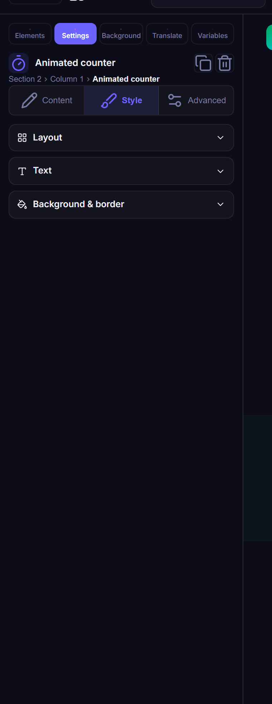

**Advanced** — the fine-grained options: margins, hover behaviour, **per-device visibility** (hiding an element on mobile, for instance), custom CSS.

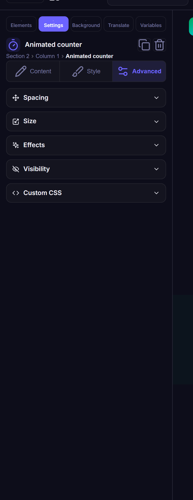

> 💡 **An even faster way to edit text:** double-click the text directly in the page and type. **Enter** confirms, **Esc** cancels.

### The editor's keyboard shortcuts

| Shortcut | Action |
|---|---|
| `Ctrl + Z` | Undo |
| `Ctrl + Y` *(or `Ctrl + Shift + Z`)* | Redo |
| `Ctrl + S` | Save a draft |
| `Ctrl + D` | Duplicate the selected element |
| `Ctrl + C` / `Ctrl + V` | Copy / paste an element |
| `Delete` *(or `Backspace`)* | Delete the selected element |
| `Esc` | Deselect |

*(On a Mac, replace `Ctrl` with `Cmd`.)* These shortcuts are disabled while you are typing in a text field, so you can write normally.

## 11.6. Organising the page: sections and columns

A page is built on three levels:

```
Page
 └─ Section         (a horizontal band, full width)
     └─ Column      (a vertical split of the section)
         └─ Element (a heading, an image, a button…)
```

To split a section into columns, select it (click its area, or use the **›** chevron from an element) and use the split icon in its toolbar. Six layouts are offered:

| | Layout |
|---|---|
| **1** | A single full-width column |
| **2** | Two equal columns |
| **3** | Three equal columns |
| **4** | Four equal columns |
| **⅔ ⅓** | A wide one on the left, a narrow one on the right |
| **⅓ ⅔** | A narrow one on the left, a wide one on the right |

On a phone, columns **automatically stack one under the other**. You do not have to do anything for that.

## 11.7. Checking on mobile

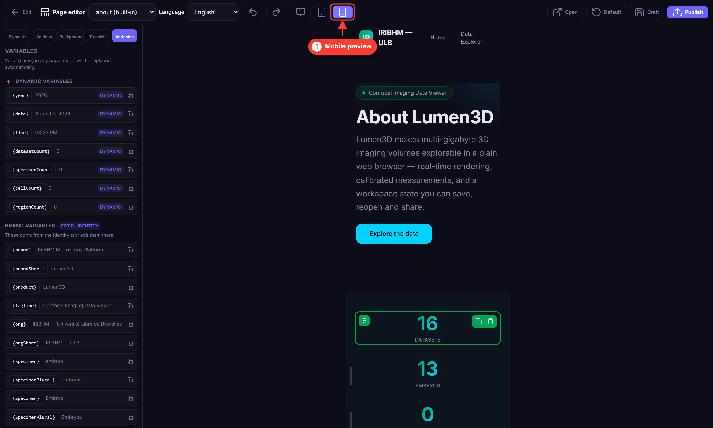

The three icons (desktop / tablet / mobile) resize the preview. **Get into the habit of checking on mobile before publishing**: a good share of visitors browse the site from a phone.

## 11.8. The animated background

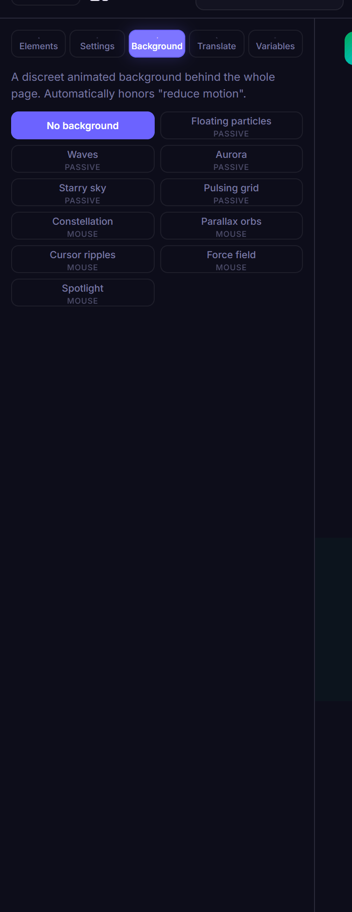

The **Background** tab adds a discreet animated backdrop behind the whole page.

- **No background** — plain background.
- **Mouse** — the animation reacts to cursor movement.
- **Passive** — the animation runs on its own.

The setting automatically honours the system "reduce motion" preference of people sensitive to movement.

## 11.9. Translating a page

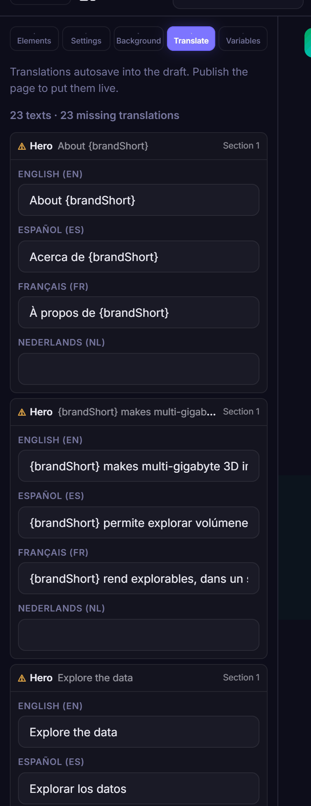

The **Translate** tab lists **every text on the page** and flags the ones missing in other languages, with a counter such as *"24 texts · 7 missing translations"*.

It is a real time-saver: instead of reopening each element one by one hunting for what is untranslated, you see everything at once and fill it in as you go.

**Suggested method:** write the whole page in one language, then switch to this tab and translate it in one pass.

## 11.10. Variables

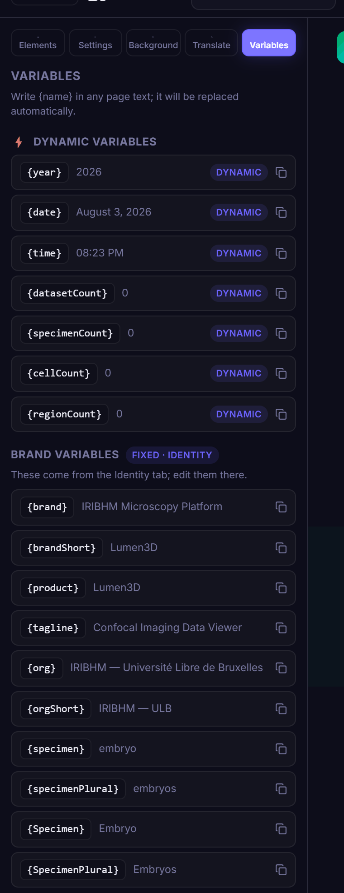

A **variable** is a piece of text you define once and reuse everywhere.

**How it works:**

1. in the **Variables** tab, create a variable: a name (say `contact`) and a value (`microscopy@ulb.be`);
2. in any page text, write `{contact}`;
3. on display, the value appears.

**What it is for:** the day the address changes, you correct it in one place and **every page updates**. Ideal for an email address, a phone number, the name of a contact person, or a paper reference.

Naming rules: start with a letter, then letters, digits or `_`, 32 characters maximum.

Variables already exist for the Identity tab's information: `{brand}` (the site's name), `{specimen}` (your object of study), `{org}` (the organisation), `{year}` (the year). They update by themselves.

## 11.11. Creating a new page

1. in the **Pages** tab, click **+ New page**;
2. give it a title and a short address (the *slug*, e.g. `protocols`);
3. build it in the editor;
4. **Publish**;
5. to make it reachable from the menu, go to **Identity → Navigation**.

The page is then reachable at `https://<your-site>/page.html?slug=protocols`.

## 11.12. Recommended workflow

1. **Edit with the editor**
2. Make your changes
3. **Draft** regularly (as in a word processor)
4. Check the **mobile preview**
5. Complete the **Translate** tab
6. **Publish**
7. **Open** to check the result online

---

# 12. Appearance — the site's colours

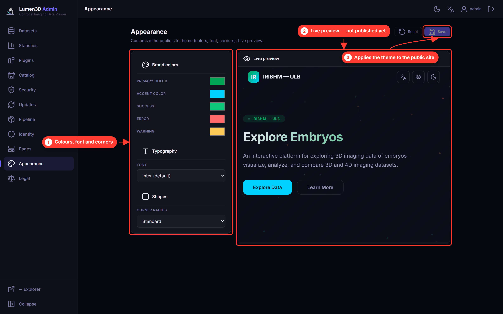

| | |
|---|---|
| **1** | Colours, font and corner radius. |
| **2** | **Live preview** — what you see is **not published yet**. |
| **3** | **Save** — applies the theme to the public site. |

## 12.1. The colours

| Colour | Where it appears |
|---|---|
| **Primary** | The dominant colour: main buttons, links, active elements |
| **Accent** | The secondary colour, for highlights |
| **Success** | Confirmations (green by default) |
| **Error** | Error messages (red by default) |
| **Warning** | Alerts (orange by default) |

Click a colour square to open the picker. **The preview on the right updates instantly**, so you can experiment safely.

> 💡 **Keep the Success / Error / Warning colours close to green / red / orange.** Those are universal cues: an error message in green disorients visitors.

## 12.2. Typography and shapes

- **Font** — the typeface of the public site.
- **Corner radius** — from sharp to very rounded, on buttons and cards.

## 12.3. Publishing the theme

Nothing is applied to the public site until you click **Save**. The **Reset** button returns to the original theme.

> ⚠️ **Check the contrast.** A very light primary colour on a light background becomes unreadable. After saving, open the public site and check that everything reads well, in light **and** dark theme.

---

# 13. Legal

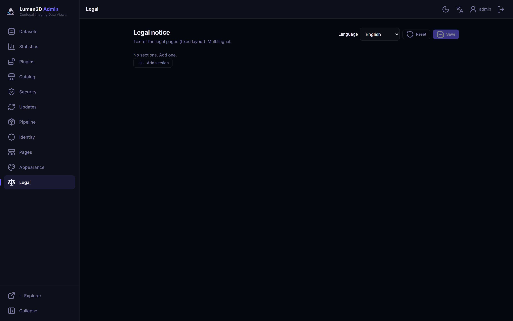

A simple, fixed-layout editor for the site's legal text.

**How it works:**

- **+ Add section** creates a block: a **title** and a **text**.
- Sections appear in the order you create them.
- The **Language** selector at the top lets you write each language's version.
- **Save** publishes.

**Usual sections:** site publisher, host, intellectual property, personal data, contact.

> ⚠️ **Two things not to forget:**
>
> 1. the page stays invisible until you tick **"Show Legal"** under **Identity → Navigation**;
> 2. legal content depends on your country and your institution — talk to the relevant department rather than copying a template found online.

---

# Appendix A — First-time setup

This appendix only concerns the **very first commissioning** of a brand-new site. If your site is already running, you will never see these screens.

When no administrator account exists yet, opening `admpan.html` triggers a **5-step** wizard.

## Step 1 — Administrator account

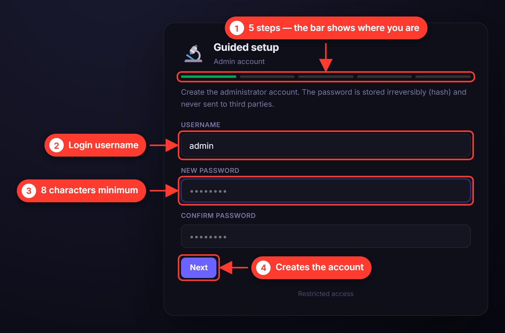

This is **the only mandatory step**. The following ones can be skipped and redone later from the corresponding tabs.

The password must be **at least 8 characters**.

> 🔒 **This creation is exclusive:** it can never overwrite an existing account. If a password is already configured, this screen does not appear at all.

## Step 2 — Identity

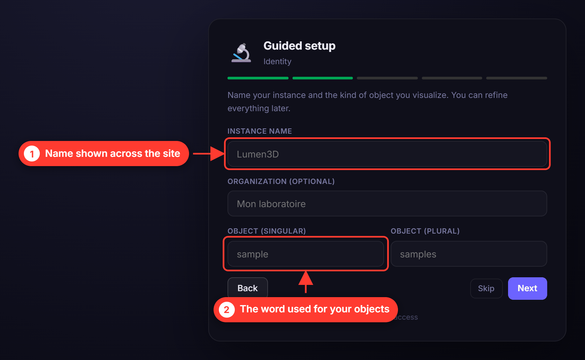

The instance name, the organisation, and the word for the objects you study. Editable afterwards under **Identity** (§10).

## Step 3 — Theme

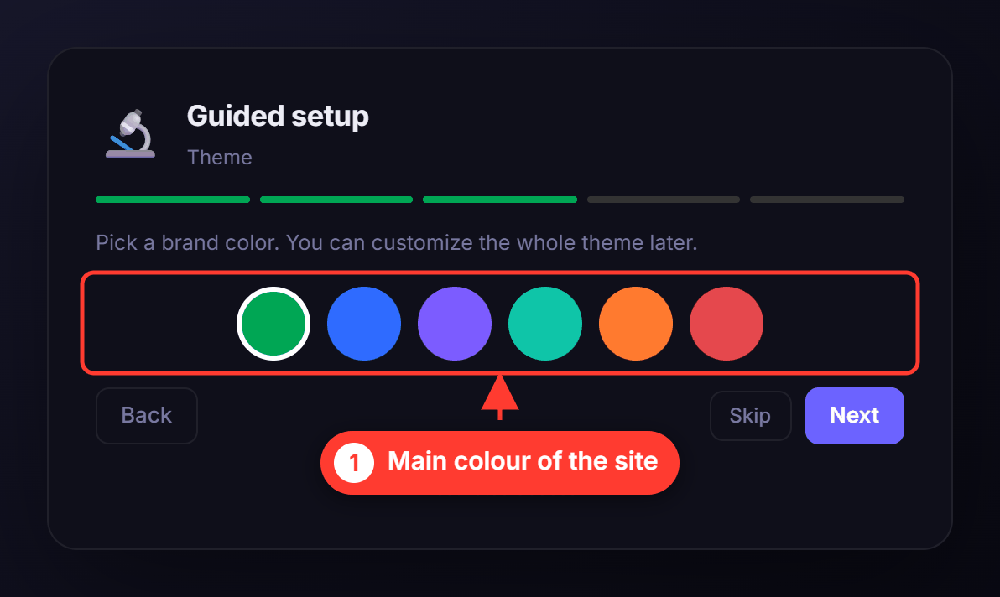

One dominant colour out of six suggestions. Refinable afterwards under **Appearance** (§12).

## Step 4 — Texts

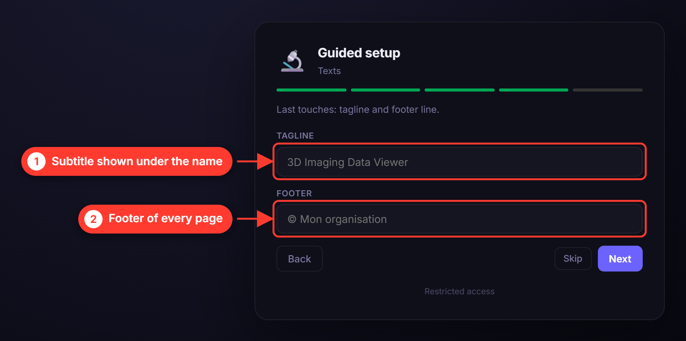

The tagline and the footer line. Editable afterwards under **Identity** (§10).

## Step 5 — Plugins

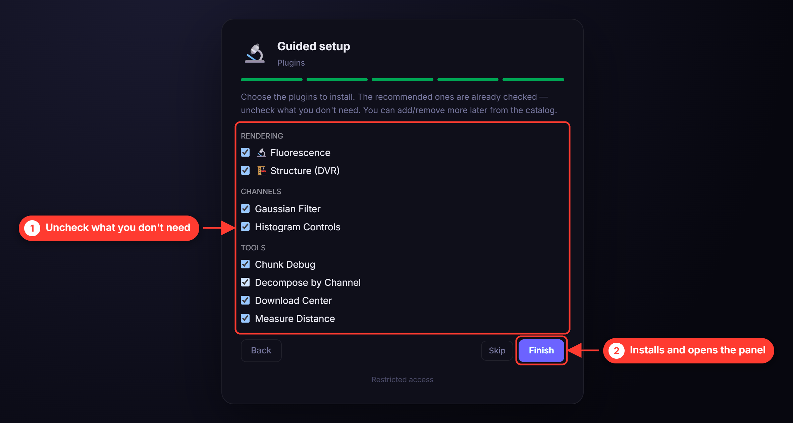

The selection of features to install. The recommended ones are already ticked; untick what you do not need. Editable afterwards under **Catalog** (§6) and **Plugins** (§5).

**Finish** installs the selection and opens the panel.

---

# Appendix B — When something goes wrong

### "I forgot the administrator password"

It is **impossible** to recover: the server keeps only an irreversible fingerprint.

The fix needs access to the server's files (FTP, SFTP, or the host's file manager):

1. delete — or better, **rename** — the file `api/admin_credential.json`;
2. reopen `admpan.html`: the first-time setup wizard reappears;
3. create a new password.

**Nothing else is lost**: not the datasets, not the pages, not the settings.

> ⚠️ During that short window, anyone opening the page could create the account instead of you. Do it in one go.

### "I changed something and the site is broken"

| Tab | How to go back |
|---|---|
| **Identity** | **Reset** button |
| **Appearance** | **Reset** button |
| **Pages** | **Default** button in the editor, then **Publish** |
| **Legal** | **Reset** button |
| **Datasets** | **↺ Reset** button (before you have saved) |

### "A dataset does not appear in the list"

1. check that it really is in `DATA_WEB/fixed/`, `DATA_WEB/live/` or `DATA_WEB/tracking/`;
2. check that its folder contains a `metadata.json` file;
3. reload the panel page.

There is **no catalog to regenerate**: the list is rebuilt every time it is displayed.

### "A feature has disappeared from the viewer"

Look at the **Plugins** tab: the corresponding plugin is probably disabled, or has dropped to **untrusted** after its files were modified. See §5.5.

### "A save fails with no clear message"

Try **Security → Repair permissions** (§7.3). That is the most common cause on shared hosting.

### "The update failed"

If the message says *"automatic rollback done"*, **there is nothing to do**: the site went back to its previous version and works. Try again later, or report the error message.

### "The panel is unreadable / dropdowns are white on white"

Do a **hard reload**: `Ctrl + Shift + R` (Windows) or `Cmd + Shift + R` (Mac). The browser sometimes holds on to old files after an update.

---

# Appendix C — Small glossary

| Term | What it means here |
|---|---|
| **Channel** | A fluorescent marker (DAPI, GFP, Pecam1…). A dataset often holds several, superimposed. |
| **Voxel** | The three-dimensional equivalent of a pixel. Its real size is given by the calibration (§3.3). |
| **Brick** | A small cube of volume (64×64×64 voxels). The site loads them on demand, which is how it can show volumes of several gigabytes without downloading everything. |
| **LOD** | *Level of Detail*. Several resolutions of the same volume: the site shows a coarse version first, then refines. |
| **Fixed / Live / Tracking** | The three kinds of dataset: still volume, 4D time series, cell trajectories. |
| **Plugin** | A module that adds a feature to the viewer (§5.1). |
| **Sandbox** | An isolated execution mode: the plugin works, but cannot reach the rest of the page. |
| **Fingerprint** | A signature of a file's exact contents. If the file changes by a single character, the fingerprint changes. |
| **Slug** | A page's short address (`protocols` in `page.html?slug=protocols`). |
| **Section / Column / Element** | The three levels a page is built from (§11.6). |
| **Draft** | A version that is saved but **not yet visible** to the public. |
| **SEO** | The texts that search engines and social networks display. |

---

*Document generated from version **1.36.0** of the platform. The screenshots come from a real instance; colours may differ if the theme has been changed.*
