# How to read this guide {.unnumbered}

::: lead
This document explains **everything you can do from the site's admin panel**.
It is written for someone who has **never seen this panel** and who **cannot code**: no commands, no files to edit, everything is done with the mouse, in a browser.
:::

::: remember
**Two rules to remember before you start**

1. **Nothing is lost until you click [Save]{.ui}** (or [Publish]{.ui}). Feel free to click around and explore. The only exceptions, flagged each time they come up: a dataset's visibility eye, adding an image to the gallery, and data updates, which take effect immediately.
2. **The panel never changes the pixels of your images.** The values of the native level are kept voxel for voxel. It sets names, texts, colours and visibility; it can also **add or rebuild derived files** (import, data updates, gallery), always on request.
:::

## The panel in four groups

The left-hand menu arranges the 15 tabs into **four groups**, according to what you are doing. This guide follows the same order.

| Group | Tabs | Chapters |
|---|---|---|
| **Getting started** | Signing in, tour of the panel | 1 – 2 |
| **Data** | Datasets · Import · Data updates · Data types · Statistics | 3 – 7 |
| **Public site** | Identity · Appearance · Pages · Legal | 8 – 11 |
| **Extensions** | Plugins · Catalog | 12 – 13 |
| **System** | Updates (and the *Release notes* page) · Pipeline · Security · Documentation | 14 – 17 |
| **Appendices** | First-time setup · When something goes wrong · Glossary | A – C |

## Where to start

:::: cards
::: card
#### 🚀 I have just arrived
Chapters **1 and 2**, then **appendix B** ("When something goes wrong"). Ten minutes is enough.
:::
::: card
#### 📦 I have new data
Chapter **4** (Import), then **3** (Datasets) to name it and make it public.
:::
::: card
#### 🛠 I maintain the site
Chapters **5**, **12 to 14**: data updates, plugins, platform version.
:::
::::

Words in blue brackets, like [Save]{.ui}, are **the exact texts shown on screen**. The numbered red circles on the screenshots refer to the table right below them. All screenshots show a demonstration dataset.

# 1. Signing in to the panel

::: chapter-intro
- The panel has **no link** from the public site: you type its address.
- A user name, a password, and you have a **8-hour** session.
- After too many failed attempts, the panel makes you **wait 15 minutes**.
:::

## 1.1. The address

The admin panel is **not** reachable from a link on the public site: there is deliberately no "Admin" button on the visible pages, and the panel asks search engines not to index it.

To reach it, you have to **type the address by hand** in the browser's address bar:

```
https://<site-address>/admpan.html
```

Replace `<site-address>` with the site's usual address. For example, if the public site is `https://microscopy.example.be`, the panel is at `https://microscopy.example.be/admpan.html`.

::: tip
Bookmark this address in your browser: you will not have to remember it.
:::

## 1.2. Your credentials

::: note
**Access credentials**

- **User name:** [ ]{.field-line}
- **Password:** [ ]{.field-line}

*(To be filled in. Share this information only with the people who genuinely need to administer the site.)*
:::

In the PDF version of this guide, you can print this page and write by hand, or keep the file somewhere safe.

## 1.3. The sign-in screen

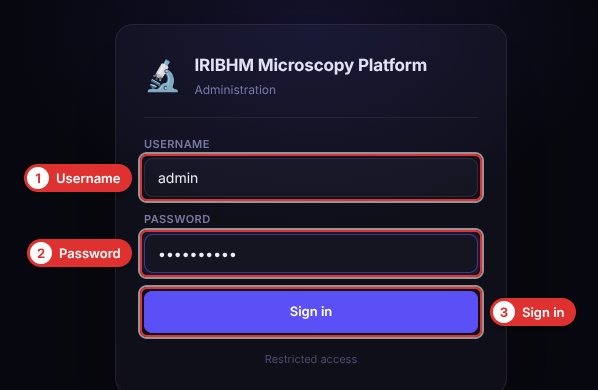{.shot width=62%}

::: legend
| n | what it is |
|-|----------------------|
| 1 | Your **user name** (`admin` by default). |
| 2 | Your **password**. |
| 3 | [Sign in]{.ui} opens the panel. The <kbd>Enter</kbd> key does the same. |
:::

This is a real form: your browser's password manager (Chrome, Firefox…) can remember and fill in **both the user name and the password**.

If the credentials are wrong, the message "Incorrect credentials." appears above the fields.

## 1.4. Repeated attempts and session length

::: warning
**The panel protects itself against repeated attempts.** Each failure is counted **before** the password is checked, per address: after **10 failures in 15 minutes**, access is blocked for **15 minutes** ("Trop de tentatives. Réessayez plus tard." — this server message is always in French). A site-wide ceiling of 200 attempts per 15 minutes also protects the site against an attack coming from several addresses.
:::

- A wrong user name costs **the same time** as a wrong password: nobody can guess which accounts exist.
- The session lasts **8 hours**, then you must sign in again. It also ends whenever the password is changed.
- The session token is **not** readable by the site's pages; it disappears when you sign out.

::: tech
Behind a "reverse proxy" server, the server must know the proxy's address (the `--trusted-proxy` option, the `LUMEN_TRUSTED_PROXIES` variable or the `api/trusted-proxies.json` file). Otherwise every visitor looks like the proxy and they all share the same attempt counter. This is a hosting setting, to be requested from the person who manages the server.
:::

::: warning
**The password is not written anywhere on the server.** It is turned into an irreversible fingerprint (see chapter 16). Nobody, not even the host, can recover it. **If you lose it**, the only solution is described in [appendix B](#appendix-b--when-something-goes-wrong).
:::

# 2. A tour of the panel

::: chapter-intro
- A left-hand menu in **4 groups**, a top bar, a work area.
- An orange badge warns you when you have **unsaved changes**.
- <kbd>Ctrl</kbd> + <kbd>S</kbd> saves the open tab.
:::

Once you are signed in, the screen is split into three areas that never change: the **menu**, the **top bar**, and the **work area** where the chosen tab is displayed.

## 2.1. The left-hand menu

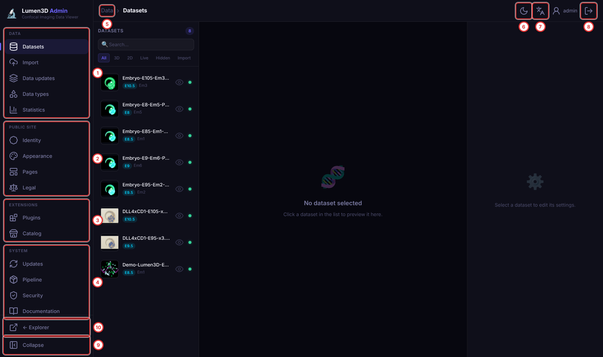{.shot width=88%}

::: legend
| n | what it is |
|-|----------------------|
| 1 | **Data** group: Datasets, Import, Data updates, Data types, Statistics. |
| 2 | **Public site** group: Identity, Appearance, Pages, Legal. |
| 3 | **Extensions** group: Plugins, Catalog. |
| 4 | **System** group: Updates, Pipeline, Security, Documentation. |
| 5 | **Breadcrumb**: the open "group › tab". |
| 6 | Light / dark **theme** of the panel (your display only). |
| 7 | **Language** of the panel: French, English, Spanish, Dutch. |
| 8 | **Sign out.** |
| 9 | [Collapse]{.ui}: folds the menu into icons to save room (your choice is remembered). |
| 10 | [← Explorer]{.ui}: opens the public site in a new tab, handy to check the effect of a change. |
:::

The [Collapse]{.ui} button folds the menu into icons only. A **small coloured dot** appears next to [Updates]{.ui} when a new version of the platform exists. Another appears next to [Import]{.ui} while a transfer is running.

On a phone, the menu becomes a drawer ([Menu]{.ui} button). The panel is still designed for a **wide screen**: the dataset editor in particular.

## 2.2. The top bar

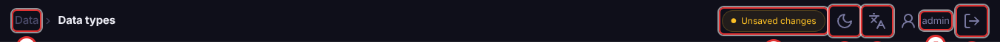{.shot width=88%}

::: legend
| n | what it is |
|-|----------------------|
| 1 | The **breadcrumb**: group then tab. |
| 2 | The orange **"Unsaved changes"** badge. |
| 3 | The panel's **theme**. |
| 4 | The panel's **language**. |
| 5 | Your **user name**. |
| 6 | **Sign out**. |
:::

## 2.3. Unsaved changes

As soon as you change something without saving it, the orange badge appears. It is a **reminder**, not an error: as long as it is there, your changes are visible only to you.

- It is computed **tab by tab** (Datasets, Data types, Identity, Appearance, Legal, Pages). It no longer lights up just because you **opened** a dataset.
- If you switch tab with changes pending: "Unsaved changes. Continue without saving?". Answering yes **really discards** the changes.
- <kbd>Ctrl</kbd> + <kbd>S</kbd> (<kbd>Cmd</kbd> + <kbd>S</kbd> on Mac) **saves the visible tab**: Datasets, Data types, Identity, Appearance, Legal.

::: note
**Session expired while you were working?** The panel brings back the sign-in screen with the message "Session expired, your unsaved changes are kept. Sign in again to continue.". The tabs stay in place behind it: after signing in again, your work is still there.
:::

While an **import is running**, signing out and links that leave the panel ask for confirmation (chapter 4). Tabs load the first time you open them: a first visit may take a fraction of a second.

## 2.4. The tabs at a glance

| Tab | What it is for | How often |
|---|---|---|
| **Datasets** | Name, describe, orient, show or hide each dataset | Frequent |
| **Import** | Send the folder produced by the pipeline, from the browser | Frequent |
| **Data updates** | Bring published datasets to the current data format | Occasional |
| **Data types** | The public name of the three categories (3D, 2D, Live) | Rare |
| **Statistics** | See how much the site is visited | Occasional |
| **Identity** | Site name, vocabulary, footer, menu | Rare |
| **Appearance** | Colours, font and rounded corners of the public site | Rare |
| **Pages** | Edit the content of pages (home, about…) | Frequent |
| **Legal** | Legal text | Rare |
| **Plugins** | Enable, disable, approve the viewer's features | Rare |
| **Catalog** | Install, update, uninstall features | Rare |
| **Updates** | Update the **platform**, plugins and the Pipeline pack | Occasional |
| **Pipeline** | Download the tool that prepares new data | Rare |
| **Security** | Password and permissions | Rare |
| **Documentation** | Read and download the published guides | Occasional |

::: warning
**Two tabs have "Updates" in their name, and they do not do the same thing.** [Data updates]{.ui} (Data group) upgrades the **format of the published datasets**. [Updates]{.ui} (System group) updates **the software**: platform, plugins, processing pack.
:::

# 3. Datasets

::: chapter-intro
- This is the tab you will open most often: it **describes** the datasets and decides **which ones are public**.
- Three columns: the **list**, the **preview** (the real viewer), the **settings**.
- A dataset arrives through the **Import** tab (or by FTP); here, you make it presentable.
:::

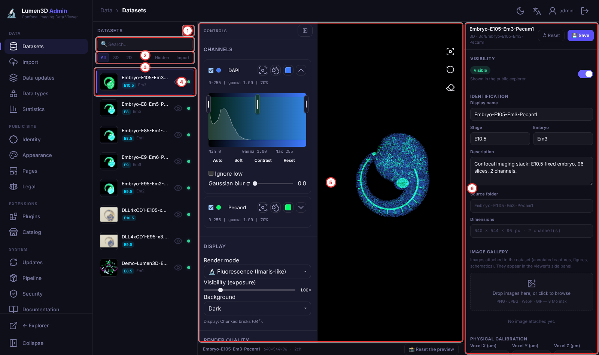{.shot width=88%}

::: legend
| n | what it is |
|-|----------------------|
| 1 | The total number of datasets. |
| 2 | The **search**: name, stage, specimen. |
| 3 | The **filters** by type (see §3.2). |
| 4 | The dataset selected in the list. |
| 5 | The **preview**: the real viewer, with the channel sidebar. |
| 6 | The dataset's **settings** (right-hand column). |
:::

::: analogy
**A library and its catalogue cards.** The volumes are the books, put on the shelves by the pipeline. This tab does not write the books: it fills in **the card** for each one (readable title, description, orientation, cover image) and decides whether it is **on the public shelves** or in storage.
:::

## 3.1. How does a dataset get here?

You do not **create** a dataset from the panel. There are two routes:

::: steps
1. The microscope's raw images are processed by the **pipeline** (chapter 15).
2. The resulting folder is sent to the server: either through the **Import** tab (drag and drop in the browser, chapter 4), or copied into `DATA_WEB` by FTP.
3. It **appears immediately** in this list: there is nothing to regenerate, no button to click.
:::

::: warning
A dataset **published by the Import** arrives **hidden** from the public explorer. You must come here, open it and switch on [Visibility]{.ui} (or click the eye on its row). A dataset copied by FTP, on the other hand, is visible straight away.
:::

## 3.2. The left-hand column: finding a dataset

:::::: cols-wide-right
::::: col
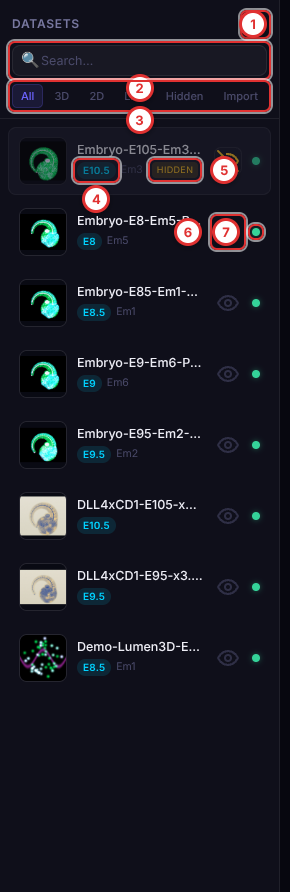{.shot width=100%}
:::::
::::: col
::: legend
| n | what it is |
|-|----------------------|
| 1 | The **number** of datasets. |
| 2 | The **search**: type part of a name and the list filters live; the cross clears it. |
| 3 | The **filters**: [All]{.ui}, **one filter per data type** ([3D]{.ui}, [2D]{.ui}, [Live]{.ui}), [Hidden]{.ui} and [Import]{.ui}. |
| 4 | The embryo's **stage**. |
| 5 | The **hidden** badge: this dataset is not public. |
| 6 | The **eye**: shows or hides the dataset **immediately**, without going through [Save]{.ui}. |
| 7 | The **coloured dot**: [Configured]{.ui} (green) or [Not configured]{.ui} (amber). |
:::
:::::
::::::

- The names of the type filters are **the ones you chose** in the Data types tab (chapter 6). There are **three** types: cell tracking is a layer of a *Live* dataset, not a separate type.
- The [Import]{.ui} filter shows datasets whose transfer is not published (§3.10).
- The **coloured dot is not an integrity check**: green means the dataset has already been saved at least once from this panel (or has a thumbnail); amber means it never has.

::: note
The eye changes visibility **right away** (toast "Dataset hidden from the explorer." or "Dataset visible in the explorer."). It is the only change to a dataset that does not go through [Save]{.ui}.
:::

An empty list shows "No dataset found.". If the list cannot load: "Unable to load the datasets. Check that PHP is running." and a [Retry]{.ui} button.

## 3.3. The middle column: the preview

:::::: cols-wide-right
::::: col
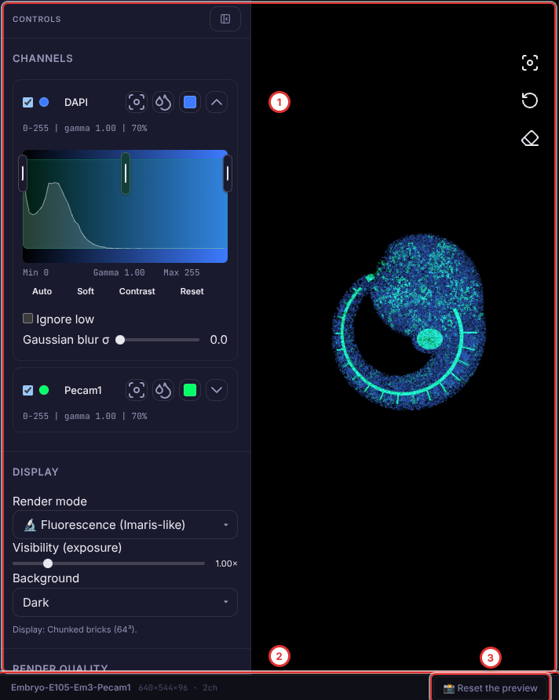{.shot width=100%}
:::::
::::: col
::: legend
| n | what it is |
|-|----------------------|
| 1 | The **3D viewer** (or 2D for a photograph), as a visitor sees it. |
| 2 | The dataset's name and its **dimensions** (`X×Y×Z · n channels`, or `X×Y px`). |
| 3 | [📸 Reset the preview]{.ui}: freezes the current view as the dataset's **thumbnail** in the explorer. |
:::
:::::
::::::

You can rotate the volume, change colours, adjust contrast: exactly like a visitor. Loading a large volume takes a few seconds (the data arrives in small blocks).

::: note
Only plugins that agree to be **embedded** ("panel" context) load in the preview: Presentation Mode, Download Center, Screenshot and a few others do not appear there. **This is not a bug** (see chapter 12).
:::

::: tip
**Reset the preview**: orient the volume the way you want it to appear in the explorer, then click. The button goes through "Capturing…" then "Saving…"; a toast confirms "Preview updated ✓".
:::

### What the preview saves, and what it forgets

Some settings made in the preview are **picked up by the panel** and saved when you click [Save]{.ui}:

- the **channel settings**: name, colour, min / max / gamma, shown or hidden;
- the **brightness** (Exposure);
- the **orientation** if you are in the middle of defining it (§3.8).

Everything else — camera position, render mode, quality, background, cutting plane — is for looking around and is **not kept**.

## 3.4. The right-hand column: the settings

:::::: cols-wide-right
::::: col
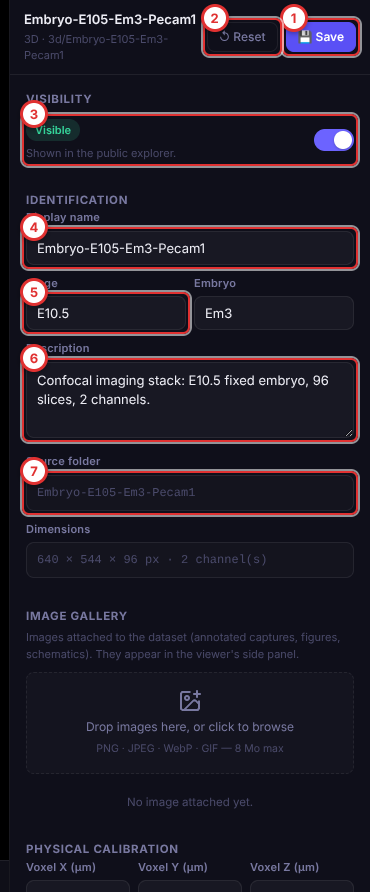{.shot width=100%}
:::::
::::: col
::: legend
| n | what it is |
|-|----------------------|
| 1 | [Save]{.ui} (<kbd>Ctrl</kbd> + <kbd>S</kbd>): saves the form. |
| 2 | [↺ Reset]{.ui}: cancels your unsaved changes. |
| 3 | **Visibility**: the switch applies **immediately**. |
| 4 | **Display name**: the name visitors will see. |
| 5 | **Stage** (and **Embryo**, next to it): the filtering labels. |
| 6 | **Description**: free text for the public sheet. |
| 7 | **Source folder** (and **Dimensions**): in grey, not editable. |
:::
:::::
::::::

Column header: the dataset's name and, below it, "type · identifier" (for example "3D · 3d/Embryo-E105-Em3-Pecam1").

**Visibility** — a [Visible]{.ui} badge ("Shown in the public explorer.") or [Hidden]{.ui} ("Not shown in the public explorer."). A hidden dataset stays on the server and can still be reached by its exact address, but no longer appears in lists. Useful during a check, or for a paper not yet published.

**Identification**

- **Display name** — replaces the folder's technical name. If you **empty** it, the previous name is kept.
- **Stage** and **Embryo** (the label uses the word from your Terminology) — pre-filled from the folder name; correct them if the detection got it wrong. The numeric stage is recomputed on save.
- **Description** — whatever helps a colleague: stainings, conditions, peculiarities.
- **Source folder** and **Dimensions** — read from the files. For a volume: "X × Y × Z px · n channel(s)"; for a photograph: "X × Y px · 0.xxx µm/px" or "Uncalibrated".

::: tech
[Save]{.ui} **merges** the form into `metadata.json` (atomic write, under a lock). A dataset's **type** and **identifier** are never changed from the panel. Result: toast "Dataset saved ✓" or "Error while saving.".
:::

A malformed dataset is **refused** rather than mounted wrongly: toast "Malformed dataset, mount refused (reason)", with one of these reasons: empty response, missing identifier, invalid type, missing or invalid dimensions, missing channels, missing or invalid image block.

## 3.5. The image gallery

A gallery lets you attach **annotated captures, diagrams and figures** to a dataset. They appear in the viewer, bottom right, as thumbnails that enlarge on click.

:::::: cols-wide-right
::::: col
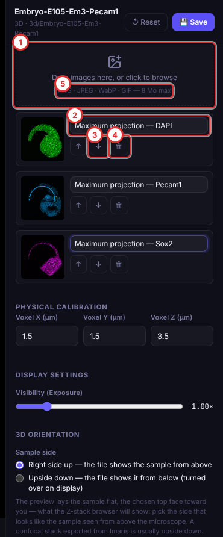{.shot width=100%}
:::::
::::: col
::: legend
| n | what it is |
|-|----------------------|
| 1 | The **drop zone**: drag images in, or click to browse. |
| 2 | The **caption** (optional, 400 characters). |
| 3 | ↑ ↓: **move** the image in the display order. |
| 4 | 🗑: **delete** the image (confirmation, then "Image deleted ✓"). |
| 5 | Formats: PNG, JPEG, WebP, GIF — 8 MB max. |
:::
:::::
::::::

- **40 images at most** per dataset ("Maximum 40 images per dataset.").
- The **bytes are sent immediately** when you add them. The **order** and the **captions** are saved by [Save]{.ui}.
- The format is recognised from the file's **real content**, never from its name. The 8 MB ceiling follows the server's limit if that is lower.
- Thumbnails (320 px) are made by the server so the list stays light.
- A dataset **re-imported as a replacement keeps its gallery** (chapter 4).
- On an unpublished import, the zone is disabled: "Publish the import before attaching images to it.".

Possible errors: "“X”: unsupported format (PNG, JPEG, WebP, GIF).", "“X” exceeds 8 MB.", "Could not upload “X”: …", "Could not delete the image.".

## 3.6. Physical calibration and display

:::::: cols-wide-right
::::: col
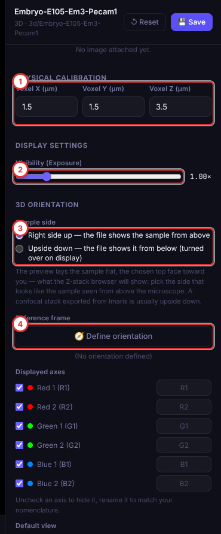{.shot width=100%}
:::::
::::: col
::: legend
| n | what it is |
|-|----------------------|
| 1 | **Voxel X / Y / Z**: the real size of a voxel, in µm. |
| 2 | **Visibility (Exposure)**: the brightness on opening. |
| 3 | **Sample side** (§3.8). |
| 4 | [🧭 Define orientation]{.ui} (§3.8). |
:::
:::::
::::::

**Physical calibration — the most important field.** The three values `Voxel X / Y / Z` (step of 0.001) give the real size of a point of the image, in micrometres. **All the visitors' measurements depend on them**: the distance tool, the scale bar, the dimensions shown.

::: warning
These values are read from the microscope file and are normally correct. **Change them only if you have a specific reason to believe they are wrong**: a wrong value skews every published measurement, without any warning. An empty value or 0 is ignored (the previous one is kept).
:::

`Voxel Z` is often much larger than X and Y (for example `0.52 / 0.52 / 3.40`): this is normal, the gap between two slices exceeds the in-plane resolution.

**Display settings** — the **Visibility (Exposure)** slider (from 0.20× to 5.00×) sets the brightness on opening; it follows the one in the preview. If a dataset looks too dark, raise it: visitors can still adjust it.

These two sections are **hidden for a 2D photograph** (§3.9).

## 3.7. Configuring the channels

A volume contains several **channels**, one per fluorescent staining. This is where you decide what they look like **by default**. The settings are made in the **preview's sidebar** and saved by [Save]{.ui}.

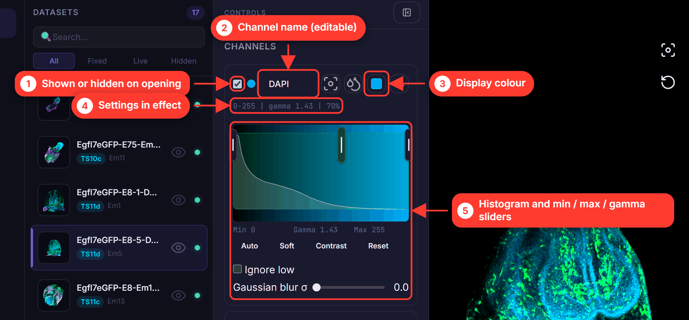{.shot width=70%}

::: legend
| n | what it is |
|-|----------------------|
| 1 | The **checkbox**: channel shown or hidden on opening. |
| 2 | The channel's **name**: click and type to rename it. |
| 3 | The display **colour**. |
| 4 | The settings **summary** (min–max, gamma, opacity). |
| 5 | The **detailed panel**: histogram and sliders, through the chevron. |
:::

- **The name.** Channels arrive named "Channel 1", "Channel 2"…. Replace them with the real staining: `DAPI`, `GFP`, `Pecam1`.
- **The colour.** Some are assigned from the name: `DAPI` becomes blue, `GFP` green, `Pecam1` magenta. Otherwise, fallback colours: green, magenta, blue, red.
- **Shown or hidden.** Untick an uninformative channel (empty, autofluorescence): it stays available, but the visitor does not see it first.
- **Min / max / gamma.** The histogram shows the distribution of intensities; the handles set the low threshold, the high threshold and the gamma. [Auto]{.ui}, [Soft]{.ui}, [Contrast]{.ui} offer ready-made settings, [Reset]{.ui} goes back to the start.
- **Solo channel** is a switch: pressing it a second time restores the previous display.

::: warning
**These settings are cosmetic, not destructive.** They change the *display*, never the data. Do not forget [Save]{.ui}: without it, channel settings are lost when you switch dataset.
:::

## 3.8. The specimen's orientation

The **3D orientation** section has four settings, from top to bottom: the **sample side**, the **reference frame**, the **displayed axes** and the **default view**.

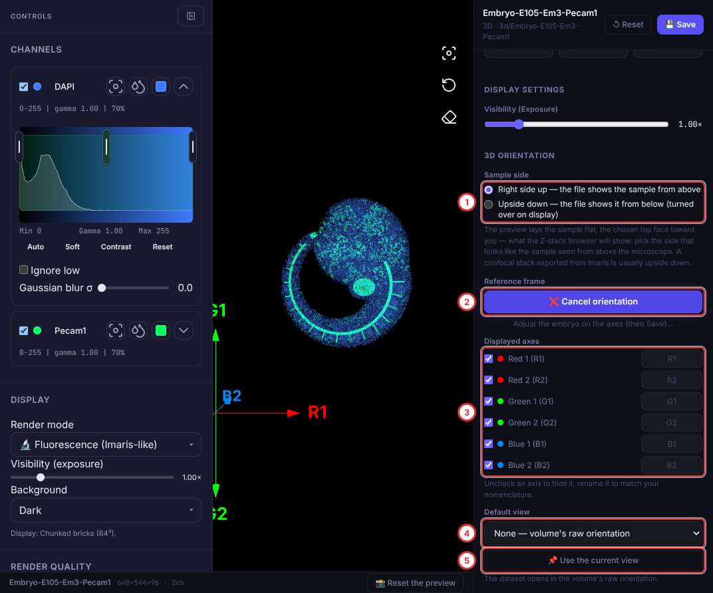{.shot width=88%}

::: legend
| n | what it is |
|-|----------------------|
| 1 | **Sample side**: two radio buttons. |
| 2 | [🧭 Define orientation]{.ui}: places the axes gizmo in the preview. |
| 3 | **Displayed axes**: tick, hide, rename. |
| 4 | **Default view**: the dataset's opening pose. |
| 5 | [📌 Use the current view]{.ui}: captures the preview's pose. |
:::

### Sample side

Two choices: "Right side up — the file shows the sample from above" (default) or "Upside down — the file shows it from below (turned over on display)".

::: tip
A confocal stack exported from Imaris is **usually upside down**. Choose the side that looks like the sample **seen from the top of the microscope**.
:::

As soon as you tick a choice, the preview **lies flat** (an animation of about a second), with the face chosen as the *top* turned towards you: this is what the Z-stack browser will show.

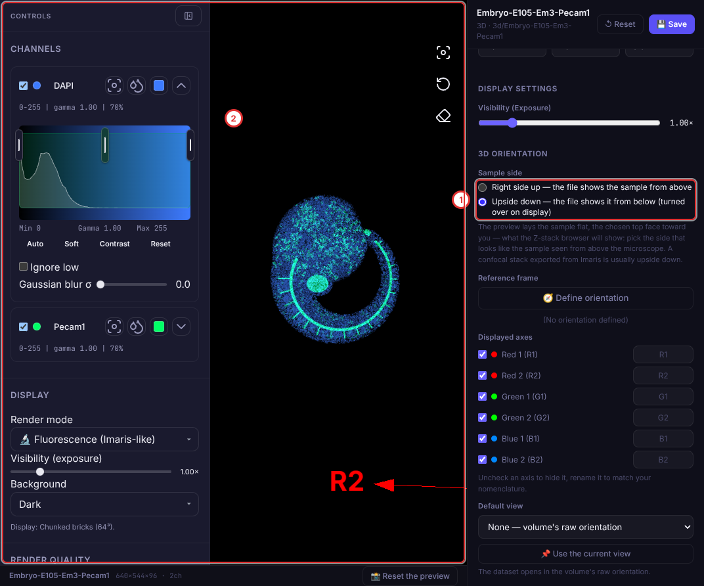{.shot width=88%}

The side is taken into account by the initial view, the view reset button, the "3d" view and the Z-stack browser. It **does not change the frame or the default view**.

### Reference frame and axes

The [🧭 Define orientation]{.ui} button (which becomes [❌ Cancel orientation]{.ui}) is used to indicate where the front, top and right of the specimen are. It starts from the alignment already saved. Three coloured axes appear on the volume, in the preview (see the figure above).

| Axis | Colour | Shown as |
|---|---|---|
| **Red 1 / Red 2** | red | R1 / R2 |
| **Green 1 / Green 2** | green | G1 / G2 |
| **Blue 1 / Blue 2** | blue | B1 / B2 |

The axes **impose no nomenclature**: in the **Displayed axes** list, untick an axis to hide it, or rename it (12 characters, for example "anterior", "dorsal"). Changes are visible live in the preview.

**How to do it:**

::: steps
1. Click [🧭 Define orientation]{.ui} (status: "Adjust the embryo on the axes (then Save)...").
2. Rotate the volume until the specimen is aligned with the axes.
3. Click [💾 Save]{.ui}. The status becomes "Orientation defined ✓".
:::

[❌ Cancel orientation]{.ui} leaves without changing anything. With no orientation: "(No orientation defined)".

### Default view

The **Default view** list chooses how the dataset **opens**: "None — volume's raw orientation", or one of the six "facing the camera, up" presets that use **your axis names** (for example "Red 1 facing the camera, Green 1 up"), or "Custom (captured view)".

The [📌 Use the current view]{.ui} button captures the pose set in the preview (toast "Default view set — save to apply it."). With a default view, the dataset opens **directly in that pose, without showing the axes**.

::: note
The orientation settings depend on the **Orientation Axes** plugin (chapter 12): if it is missing, the panel says so ("The “Orientation Axes” plugin is not responding — install it to define a default view."). The view is stored as an *anatomical* pose: refining the frame later does not make it obsolete.
:::

::: warning
A dataset whose side was switched under version 1.55.7 of the platform has a skewed frame: **define its orientation again**.
:::

## 3.9. 2D photographs

A **2D** dataset is **one calibrated photograph** from a stereomicroscope. The preview opens the 2D page; the right-hand column adapts.

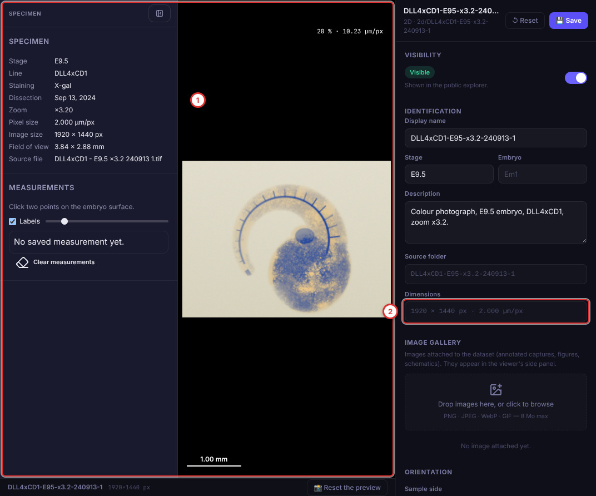{.shot width=88%}

::: legend
| n | what it is |
|-|----------------------|
| 1 | The **2D preview**: photograph, scale bar, "Specimen" panel. |
| 2 | **Dimensions**: "X × Y px · 0.xxx µm/px" (or "Uncalibrated"). |
:::

- **Physical calibration** and **Display settings** are **absent**.
- The section is called **Orientation**: rotation and mirror (2D Orientation plugin), with no axes or default view.
- No channels: none is created on save.

## 3.10. Datasets being imported

A dataset being sent appears **in this list** (the [Import]{.ui} filter), with a status badge in place of the eye. Opening it shows a **status banner** at the top of the right-hand column.

:::::: cols-wide-right
::::: col
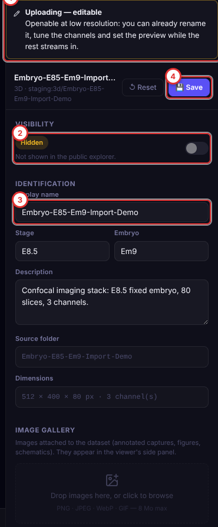{.shot width=100%}
:::::
::::: col
::: legend
| n | what it is |
|-|----------------------|
| 1 | The **status banner** (icon, state, help sentence). |
| 2 | **Visibility**: greyed out, an import is not public yet. |
| 3 | The identification fields: **editable** as soon as the state is "editable". |
| 4 | [Save]{.ui}. |
:::
:::::
::::::

| State | What you can do in the Datasets tab |
|---|---|
| **Uploading — not editable** | Nothing: form locked, preview replaced by a message. |
| **Uploading — editable** | Edit everything **except** Visibility and Gallery. |
| **Uploaded — ready to publish** | Same. Publishing is done in the Import tab. |
| **Interrupted** | Nothing: form locked. |

The banner and the form **update by themselves** when the state changes. The [Edit]{.ui} button in the Import tab opens the right dataset, here.

## 3.11. When no dataset is selected

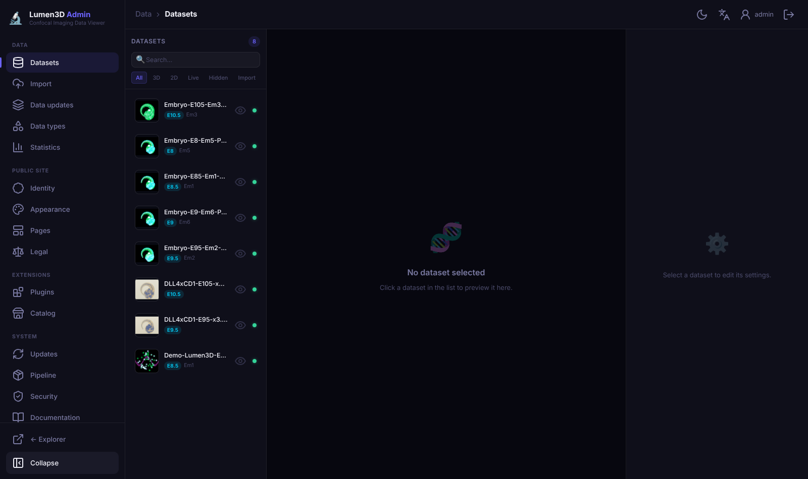{.shot width=80%}

This is the tab's welcome screen: "No dataset selected — Click a dataset in the list to preview it here.". There is **no** button to delete a dataset or to "regenerate the catalog": deleting is an operation on the server's files, deliberately, and the list is recomputed every time it is displayed.

# 4. Import — sending data from the browser

::: chapter-intro
- You **drag in the folder** produced by the pipeline: no more FTP.
- The transfer is **resumed** where it stopped, and **verified** byte by byte.
- Nothing is public until you click [Publish]{.ui} (then the eye, in Datasets).
:::

::: analogy
**A tracked parcel, delivered to a locker.** Your files travel to a private area of the server, unreachable by URL. On arrival, the server **weighs and checks** the parcel. Only you then decide to **put it on the shelves** (Publish), then to **open it to the public** (the eye).
:::

## 4.1. The empty tab

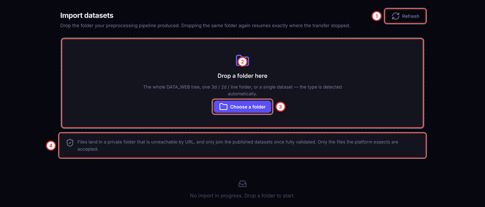{.shot width=88%}

::: legend
| n | what it is |
|-|----------------------|
| 1 | [Refresh]{.ui}: re-reads the pending imports on the server. |
| 2 | The **drop zone**: drag a folder into it (or click anywhere in it). |
| 3 | [Choose a folder]{.ui}: the browser's folder picker. |
| 4 | The **security banner**: private area, validation before publication, only expected files. |
:::

You can drop **the whole `DATA_WEB`**, a `3d` / `2d` / `live` folder, or **a single dataset**: the type is read from each dataset's `metadata.json`, at any depth. You must drop **the dataset's folder, not its contents**: the folder name becomes the identifier.

::: tip
A folder dropped **beside** the zone is ignored: the browser does not leave the page and the transfer in progress is not lost.
:::

## 4.2. A transfer in progress

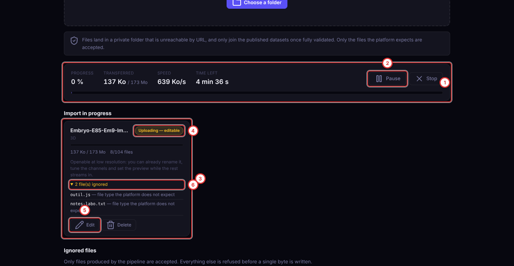{.shot width=88%}

::: legend
| n | what it is |
|-|----------------------|
| 1 | The **overall progress**: [Progress]{.ui}, [Transferred]{.ui}, [Speed]{.ui}, [Time left]{.ui}, and the bar. |
| 2 | [Pause]{.ui} (becomes [Resume]{.ui}); next to it, [Stop]{.ui}. |
| 3 | A **dataset card**: name, type, bytes, number of files. |
| 4 | The **status badge** (see §4.3). |
| 5 | [Edit]{.ui}: opens the dataset in the Datasets tab, before the transfer ends. |
| 6 | The **"n file(s) ignored"** menu: what was refused in this dataset. |
:::

- [Stop]{.ui} asks for confirmation: "Files already uploaded are kept, and the transfer resumes if you drop the folder again.".
- [Retry]{.ui} appears if some files are still failing.
- If the network drops: "Connection lost. The transfer resumes by itself when the network returns.".
- The "already published" mention appears if a published dataset has the same name.

## 4.3. The five states of an import

| State | What it means | What to do |
|---|---|---|
| **Uploading — not editable** | The files needed to open it have not all arrived (metadata, manifest, thumbnail, coarsest level). | Wait. |
| **Uploading — editable** | "Openable at low resolution: you can already rename it, tune the channels and set the preview while the rest streams in." | [Edit]{.ui}, [Save]{.ui}. |
| **Uploaded — ready to publish** | "Transfer complete and integrity verified. Publish it to move it into the published datasets." | [Edit]{.ui}, [Check]{.ui}, [Publish]{.ui}, [Delete]{.ui}. |
| **Interrupted** | "Drop the same folder again to resume where the transfer stopped." | Drop the **same folder** again. |
| **Published** | Moved into the published datasets, **hidden** from the public until you enable it. | Go to Datasets. |

::: warning
An **interrupted** import is not kept forever: the card shows "purged in {d}", and after **7 days** without resuming the server frees the space. An "Uploaded — ready to publish" import, on the other hand, is **never** purged automatically.
:::

::: why
**Why "editable" so early?** The files go in **tiers**: first `metadata.json`, the manifest and the thumbnail, then the coarsest level of each channel, the intermediate levels, the native level, and finally `planes/`, `mips/` and `download/`. After the first two tiers, a dataset can be opened and edited, **minutes** after the start of a transfer that may last hours. The `metadata.json` you edit is then **locked**: the rest of the transfer does not overwrite it.
:::

## 4.4. When the transfer is finished

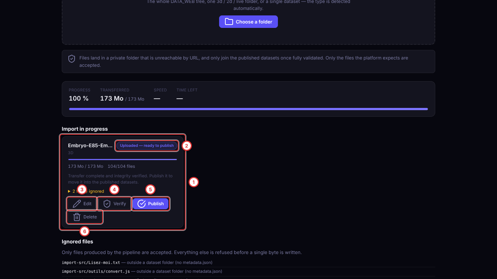{.shot width=88%}

::: legend
| n | what it is |
|-|----------------------|
| 1 | The dataset card: 100 %, all files. |
| 2 | The **Uploaded — ready to publish** state. |
| 3 | [Edit]{.ui}: rename, set channels and orientation. |
| 4 | [Check]{.ui}: runs the integrity validation. |
| 5 | [Publish]{.ui}: moves the dataset into the published datasets. |
| 6 | [Delete]{.ui}: erases the files already sent. |
:::

**[Check]{.ui}** re-reads everything that arrived and checks that every brick index points to packs that are really present. Toast "Dataset valid ✓", or "Validation failed:" followed by codes (for example `missing_pack:…`: a pack is missing; `truncated_pack:…`: a pack is truncated; `incomplete_files`; `stray_files`; `index_hash_mismatch`).

**[Publish]{.ui}**: toast "Dataset published ✓ (hidden from the explorer — enable it in the Datasets tab)".

::: warning
**Publishing does not make the dataset public.** It arrives **hidden**. Go to Datasets, open it, switch on [Visibility]{.ui}.
:::

**Replacing an already published dataset**: if the name already exists, the panel asks "A published dataset already has this name. Replace it? Its image gallery and the fields you filled in (name, orientation, captions…) are kept when the new import does not provide them.". After the replacement, a toast lists what was kept (the gallery, etc.).

**[Delete]{.ui}**: "Permanently delete the files already uploaded for this dataset?", then "Import deleted.". Available in every state except **Published**.

## 4.5. Ignored files

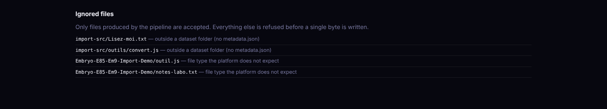{.shot width=88%}

Only the files the pipeline produces are accepted. **Everything else is refused before a single byte is written**: `.php` and `.js` files, hidden files, upward paths (`../`), files outside a dataset folder.

| Reason shown | What it means |
|---|---|
| file type not expected by the platform | The pipeline does not write this kind of file. |
| outside a dataset folder (no metadata.json) | The file is not inside a dataset. |
| path refused, invalid size | Unacceptable name or size. |
| unreadable item(s) while reading the folder | Local permissions to check. |

These are **warnings**, not blocks: the rest of the import carries on.

## 4.6. The floating dock

As soon as an import needs reporting, a small **dock** anchors at the bottom right, **in every tab**: you can work elsewhere while it uploads. It has three sizes, remembered in the browser.

:::: cols
::: col
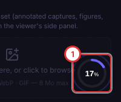{.shot width=70%}

| n | what it is |
|-|----------------------|
| 1 | Progress ring and percentage. One click enlarges it. |
:::
::: col
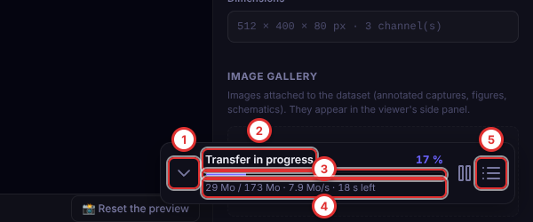{.shot width=88%}

| n | what it is |
|-|----------------------|
| 1 | Chevron: shrink to a bubble. |
| 2–4 | Status title, bar, speed and time left. |
| 5 | [Details]{.ui}: opens the panel. |
:::
::::

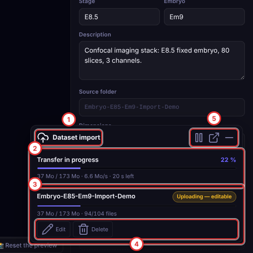{.shot width=70%}

::: legend
| n | what it is |
|-|----------------------|
| 1 | Title "Dataset import". |
| 2 | The overall progress. |
| 3 | One **row per dataset**: name, state, bar, bytes, files. |
| 4 | [Edit]{.ui}, [Publish]{.ui}, [Delete]{.ui}. |
| 5 | Open the Import tab, shrink. |
:::

The dock's status titles: "Transfer in progress", "Transfer paused", "Transfer complete", "Finished with {n} failed file(s)", "Connection lost, resuming automatically", "Pending imports"…

## 4.7. Leaving during a transfer

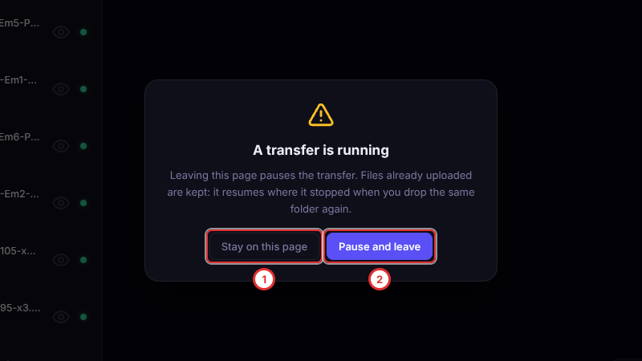{.shot width=70%}

::: legend
| n | what it is |
|-|----------------------|
| 1 | [Stay on this page]{.ui}: the transfer continues. |
| 2 | [Pause and leave]{.ui}: the transfer is paused, the files sent are kept. |
:::

This message appears when you click **sign out** or a link that leaves the panel. Closing or reloading the tab triggers the browser's usual dialog; the transfer is paused beforehand. To resume: **drop the same folder again**.

## 4.8. Under the hood

::: tech
- The transfer runs in a **Web Worker**: the interface stays smooth. Raw blocks of **8 MiB** (reduced on a PHP host with strict limits: "Block size reduced to {n} — drop the folder again to resume."), **4 blocks in parallel**.
- Each block carries a **SHA-256 fingerprint** checked **before** writing. A **server journal** remembers the blocks received: dropping the same folder again resumes **to the nearest block**; a file already complete is not sent again.
- The journal is the same under both servers (Python or PHP): an import started under one can resume under the other.
- Accepted formats: **formats 2 to 4** (`planes/`, `mips/`, v3 bricks and `index.bin`).
:::

## 4.9. If something goes wrong

| Message | What to do |
|---|---|
| No file detected in this drop. | The folder is empty or unreadable: drop it again. |
| No dataset found: the folder must contain a metadata.json. | Drop the folder produced by the pipeline. |
| Drop the dataset FOLDER, not its contents… | Drop the parent folder. |
| Dataset type not found… | `metadata.json` must declare `"type"`: `3d`, `2d` or `live`. |
| Imports require a secure connection (HTTPS, or localhost)… | Open the panel over `https://`: the SHA-256 fingerprints require it. |
| Not enough disk space on the server (… needed, … free) | Free up some space. The check is made **before** sending. |
| "X" is larger than the server accepts for one file. | A server limit, to discuss with the host. |
| Session expired — sign in again, then drop the folder once more. | Sign in again, drop the folder again. |
| Failure on {path} / {n} file(s) could not be sent. | [Retry]{.ui}, or drop the folder again. |
| The server is not responding… / The transfer engine failed to start. | Check the connection, reload the page, drop the folder again. |
| Everything is already uploaded — nothing to transfer. | Information: the dataset is already complete. |

# 5. Data updates — the datasets' format

::: chapter-intro
- A published dataset has a **format** (1 to 4). The current format is **4**.
- This tab upgrades them **in place**, like a software update.
- You choose **who does the work**: this browser or the server. Nothing is mandatory.
:::

::: analogy
**Moving a library to new shelving.** The books (your pixels) do not change; we add **indexes** and **better-arranged shelves** so they come out faster. If the move is interrupted, we pick up at the crate where we stopped.
:::

## 5.1. Why, and for whom

Each volume dataset (`3d`, `live`) carries a **data format** (`formatVersion`, absent = format 1). A dataset that came out of pipeline **0.21.0** is already in **format 4**: it has **nothing** to do. **2D photographs** are never concerned.

::: note
**Data updates are not needed for the site to work.** The viewer always reads formats 1, 2, 3 and 4; the Studio falls back to the bricks if `planes/` is missing. They **speed up** some Studio operations and **improve** display quality.
:::

## 5.2. The three steps

They follow one another in order: a dataset in format 1 receives all three.

| Step | Title on screen | What it creates | What it brings |
|---|---|---|---|
| **1 → 2** | Plane copy of the native level (fast XY slices in the Studio) | `planes/`: one file per z plane, lossless 512² PNG tiles (≈ 1.3× the native level in disk space). The bricks are not touched. | A native XY slice reads **one plane** instead of a layer of 64 planes: tens of times fewer bytes, pixel-identical result. |
| **2 → 3** | Maximum projections of each layer of bricks (fast z-stack figures over the whole stack) | `mips/`: one maximum projection per layer of 64 planes. | A z-stack figure over the whole stack reads ~3 packs instead of about 150. |
| **3 → 4** | Brick pyramid v3: reduced in Z too, one-voxel border, binary index | **Rebuilds** `bricks/`: 66³ bricks with a border, levels reduced in Z too, `index.bin`. | Seamless filtering, local detail ("Zoom detail"), lighter atlases for 1 to 2 channels. |

::: warning
**The 3 → 4 step rebuilds the `bricks/` tree.** The **native level is kept voxel for voxel**; the coarser levels are recomputed. The old tree is deleted **after** the version change. For precious data, keep a backup copy, as for any operation on files.
:::

## 5.3. Overview of the tab

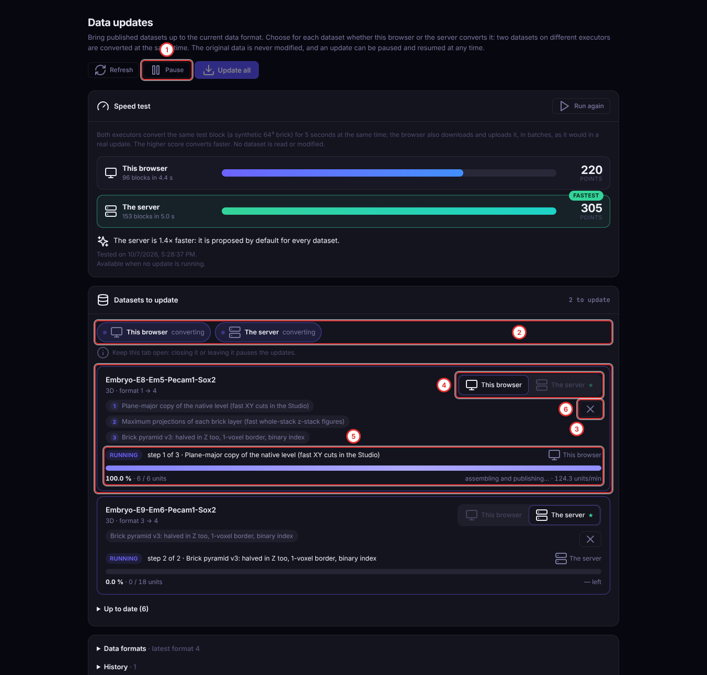{.shot width=88%}

::: legend
| n | what it is |
|-|----------------------|
| 1 | [Pause]{.ui} (or [Resume]{.ui}); next to it [Refresh]{.ui} and [Update all]{.ui}. |
| 2 | The **two-queue strip**: one badge per executor, with its state. |
| 3 | A **dataset card**: name, type, "format 1 → 4", estimated units and size, numbered **steps**. |
| 4 | The **executor selector**: [This browser]{.ui} or [The server]{.ui}. |
| 5 | The **progress** area: "step i of n", bar, percentage, units done, **time left**, units per minute. |
| 6 | The cross: **cancel**: "Discard the progress of this update? The dataset stays as it was." |
:::

From top to bottom: the header and its buttons, the **Speed test** card, the **Datasets to update** card, then three collapsible sections: **Up to date**, **Data formats**, **History**. [Update all]{.ui} processes every ready dataset, one per executor at a time.

All up to date: "Every dataset is in the latest format.". No published volume: "No published volume dataset.".

## 5.4. This browser or the server?

Two "executors" can do the work:

| Executor | Who computes | What is needed |
|---|---|---|
| **This browser** | Your browser downloads the bricks, reassembles them (Web Workers) and sends the result back **unit by unit**. | A browser that can compress, re-read PNGs identically and encode lossless WebP. |
| **The server** | The server converts by itself, in small time-bounded requests. Suited to shared hosting. | Lossless WebP decoding (and, for the 3 → 4 step, encoding) (PHP's GD or Python's Pillow), zlib, NumPy on the Python side, at least 128 MiB per request and 10 s of execution. |

- The choice is made **per dataset**, **before** starting; it is **locked while running**, and can be changed between runs.
- An executor that cannot do the job is **greyed out**, with a tooltip saying why (for example "the server cannot decode lossless WebP images").
- Each executor has **its own queue**: one dataset on the browser and another on the server convert **at the same time**.
- A step the chosen executor cannot do is handed to the other. If neither can: "no executor" in red.
- The **★** badge marks the executor that was **fastest in the speed test**.
- Both write to **the same journal** on the server: you can switch executor and resume.

::: tip
On shared hosting where the [The server]{.ui} option is greyed out, **[This browser]{.ui} always works**: it does the work, the server merely stores.
:::

## 5.5. The speed test

A single button: [Run the test (5 s)]{.ui} (then [Run again]{.ui}). For 5 seconds (two racing bars, one per executor), the browser **and** the server convert **at the same time** the same synthetic block (a 64³ brick shipped with the platform). **No dataset is read or modified.**

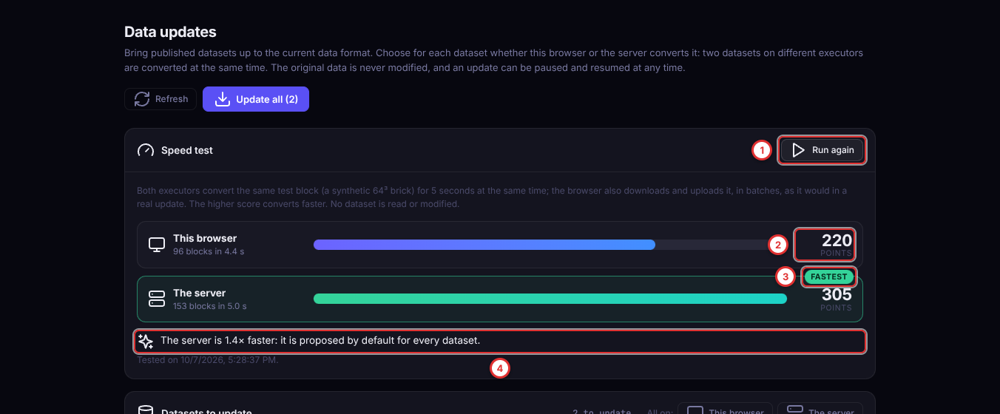{.shot width=88%}

::: legend
| n | what it is |
|-|----------------------|
| 1 | [Run again]{.ui} the test. |
| 2 | The score of **This browser**. |
| 3 | The **Fastest** badge. |
| 4 | The **verdict**: "The server is 1.2× faster: it is proposed by default for every dataset." |
:::

If both are equally fast: "Both executors are as fast: pick either.". A side that cannot be used shows **its reason** instead of a score. The result is kept in this browser ("Tested on …"). The test is unavailable while an update is running.

## 5.6. Running an update, step by step

::: steps
1. (Optional) Run the **speed test**.
2. For each dataset, choose the **executor** (the ★ one is suggested by default).
3. Click [Update]{.ui}, or [Update all (n)]{.ui}.
4. **Keep the tab open** until the end: "closing it or leaving it pauses the updates".
5. A toast "{name} updated to format {v}" confirms each finished dataset.
:::

The main button is called [Repair]{.ui} if the dataset says it is up to date but its structure is missing or invalid ("repair" badge), [Resume]{.ui} if a job is paused, [Retry]{.ui} after a failure.

## 5.7. During the conversion

States shown: **Waiting for its turn** ("next on the server"), **Running**, **Pausing…**, **Paused** (with the cause: tab left, page closed, session expired, server unreachable), **Assembling** ("Assembling planes x/y", "assembling and publishing…"), **Failed** (with the cause).

- **[Pause]{.ui}** pauses all queues; **[Resume]{.ui}** restarts where they stopped.
- **Leaving the tab**: "An update is running. Leaving this tab pauses it (you can resume later). Leave?". **Nothing is lost**: the server journal lets you resume after a reload, a cut or a change of executor.

::: warning
**Do not start the same update in several tabs**, and do not restart it in a loop. In version 1.59.1, a flood of requests led a host to **ban an operator's address**. Since 1.59.2, **all** the tab's requests go through a **governor** (6 in flight at most, 10 to 16 per second; it slows down and pauses when the host answers slowly or returns 429 / 503). You may see: "The host is answering slowly: requests are paced down so that it does not block this address." or "Connection lost — waiting for the network, nothing is lost.". **Let it run.**
:::

## 5.8. The bottom sections

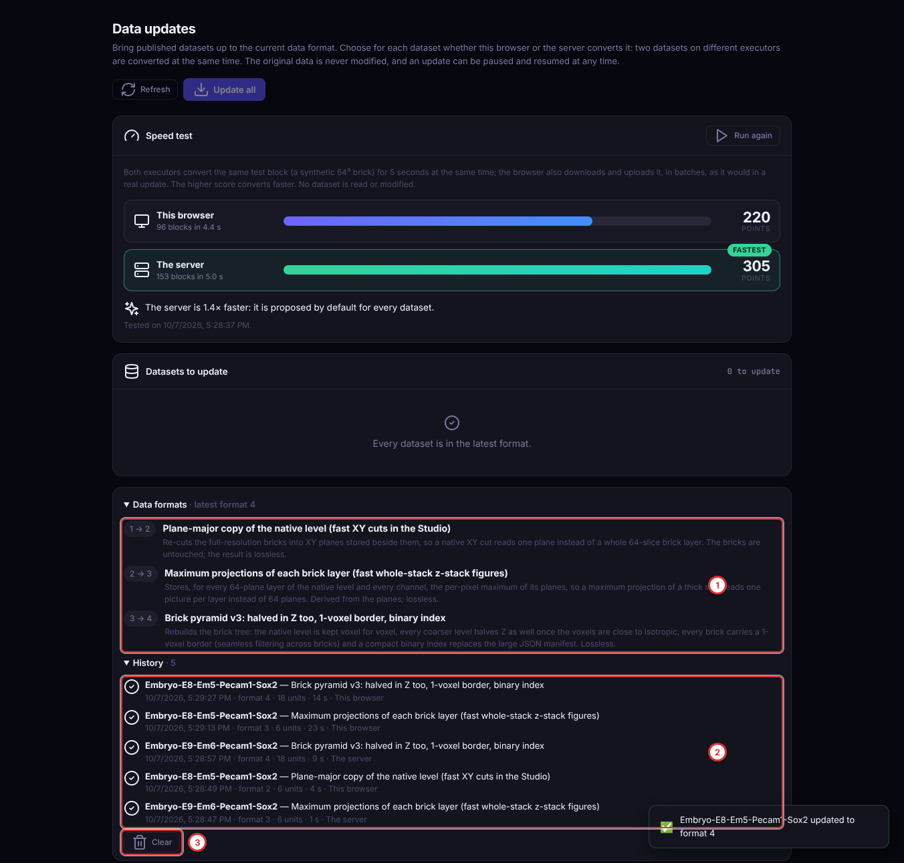{.shot width=88%}

::: legend
| n | what it is |
|-|----------------------|
| 1 | **Data formats**: the most recent format (4) and the list of the three updates ("1 → 2"…). |
| 2 | **History**: the last 20 operations, remembered in this browser. |
| 3 | [Clear]{.ui}: empties the history. |
:::

A history row reads "format {v} · {n} units · {duration} · {executor}", or shows the **reason for the failure**. The **Up to date (n)** section lists the datasets already in the right format.

## 5.9. Safeguards and errors

- **Disk**: the panel refuses to start if the result will not fit ("not enough disk space on the server (needed / free)").
- **Original data**: never modified before the final switch; the final step is **resumable** and runs under the same lock as the dataset editor.
- **Dataset re-processed in the meantime**: "the dataset was re-processed since the update started" → [Retry]{.ui} starts again from zero. A deleted dataset is **never re-created**.
- **Server too slow for one unit** (shared hosting): the step switches **to the browser** by itself after two dead requests.

| Message | What to do |
|---|---|
| Session expired — sign in again, then resume. | Sign in again, [Resume]{.ui}. |
| Update of {name} failed: … | Read the cause; [Retry]{.ui}, or change executor. |
| Neither executor can run every step of: … | Try [This browser]{.ui}, or re-process with the pipeline. |
| Update of {name} stopped: the server cannot convert a unit in time. | Run it again in this browser. |
| Could not read the update status. | [Refresh]{.ui}. |

# 6. Data types — the public name of each category

::: chapter-intro
- The platform files every dataset under one of **three categories**: 3D, 2D, Live.
- You decide the **word** the public sees for each one.
- You change **display names only**: never a folder, an address or a file.
:::

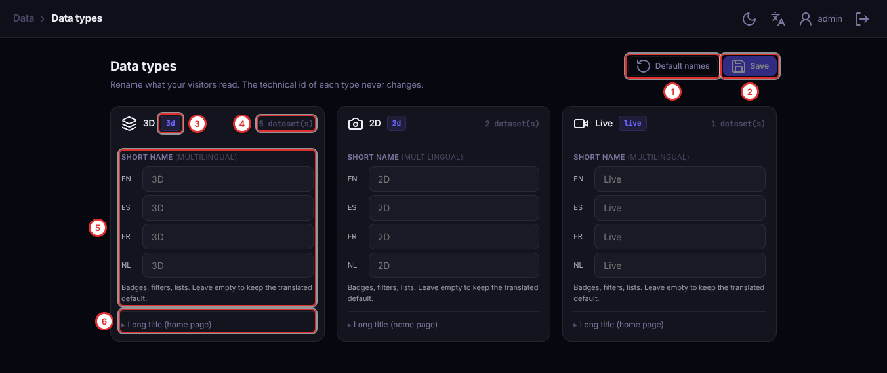{.shot width=88%}

::: legend
| n | what it is |
|-|----------------------|
| 1 | [Default names]{.ui}: empties the fields (you must then [Save]{.ui}). |
| 2 | [Save]{.ui} (<kbd>Ctrl</kbd> + <kbd>S</kbd>), active only if something changed. |
| 3 | The type's **technical identifier** (`3d`, `2d`, `live`): not editable. |
| 4 | The number of published **datasets** of this type. |
| 5 | **Short name (multilingual)**: one row per language (EN, FR, ES, NL). |
| 6 | **Long title (home page)**: collapsible section. |
:::

| Category | What it contains | Default name (English) |
|---|---|---|
| **3D** (`3d`) | A fixed volume: a multichannel 3D image stack | 3D · "3D imaging" |
| **2D** (`2d`) | A calibrated stereomicroscope photograph | 2D · "2D imaging" |
| **Live** (`live`) | A 4D time series, possibly with its cell tracking | Live · "Live imaging" |

- **Short name** — badges, filters, lists. **Long title** — the large cards on the home page.
- **Leave a field empty to keep the default name**: the platform then falls back on its own translation, in the visitor's language.
- [Default names]{.ui} asks "Restore the default translated names for every type?". It **empties** the fields; it does not write fixed text.
- Result: toast "Type names saved." (or "Save failed.").

::: note
**What this tab does not change.** Not the server folders (`DATA_WEB/3d/`, `DATA_WEB/2d/`, `DATA_WEB/live/`), nor the page addresses, nor the links your visitors have already saved, nor anything inside the datasets. It **does not create** categories: the three types are the ones the software knows how to display. Cell tracking is **not** a type: it is a layer of a Live dataset.
:::

The page variables `{type3d}`, `{type2d}` and `{typeLive}` (chapter 10) pick up these names. The tab writes only the `datasetTypes` block of the configuration: it does not overwrite what you did in Identity. It warns you if you leave it with changes.

# 7. Statistics — who looks at what

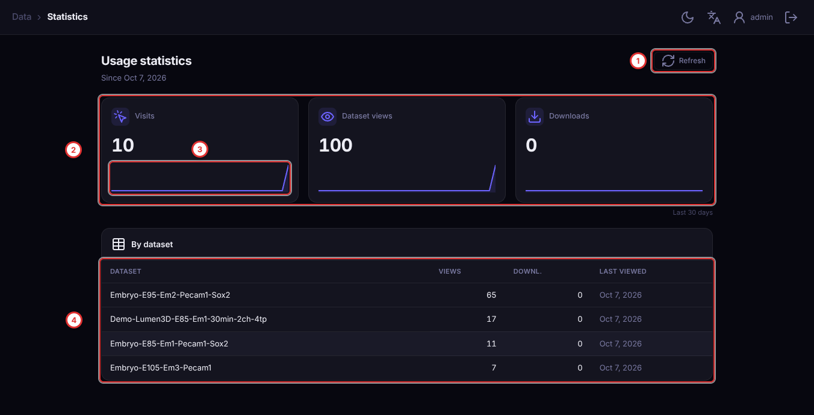{.shot width=88%}

::: legend
| n | what it is |
|-|----------------------|
| 1 | [Refresh]{.ui}: reloads the figures. |
| 2 | Three **counters**, cumulative since installation. |
| 3 | The small curve of the **last 30 days**. |
| 4 | The detail **by dataset**; click a header (Dataset, Views, Downl.) to sort. |
:::

- **Visits** — openings of a page of the site.
- **Dataset views** — times a dataset was opened in the viewer: the most telling indicator.
- **Downloads** — files fetched from the Download Center.

The "By dataset" table gives views, downloads and last visit. With no data: "No usage data yet.". Renaming a type does not change these figures.

::: note
**No personal data is collected.** These are simple counters: no tracking cookie, no IP address stored, no external service. Nothing leaves the server. The server also rate-limits the statistics beacons.
:::

# 8. Identity — the site's name and vocabulary

::: chapter-intro
- Rename the site **entirely**, without touching the code.
- The **word** for your objects of study (embryo, sample, organ…) is used **everywhere**.
- Every text exists **per language**: EN, FR, ES, NL.
:::

This is what lets the same platform serve an embryology lab or a neuroscience institute. The page's real title: "Identity & branding".

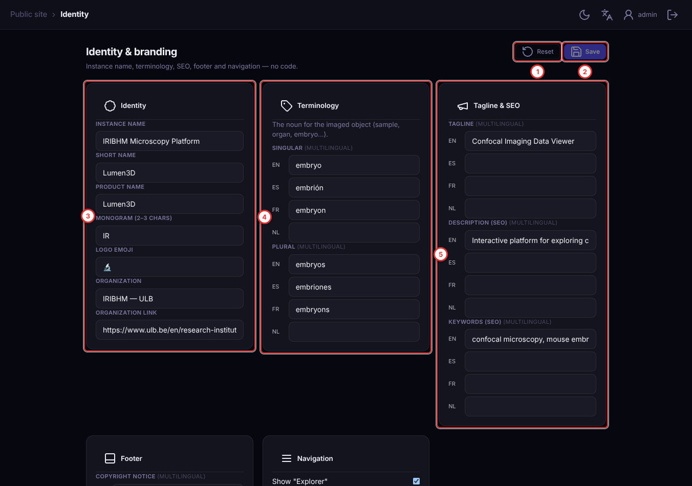{.shot width=88%}

::: legend
| n | what it is |
|-|----------------------|
| 1 | [Reset]{.ui}: goes back to the default values ("Business content will be removed."). |
| 2 | [Save]{.ui}: active as soon as a field changes. |
| 3 | **Identity** card: your site's names. |
| 4 | **Terminology** card: the word for your objects of study. |
| 5 | **Tagline & SEO** card. |
| 6 | A **multilingual** field: one row per language. |
:::

## 8.1. Multilingual fields

**(MULTILINGUAL)** fields show **one row per available language**: `EN`, `FR`, `ES`, `NL`.

::: tip
**Always fill in at least `EN`.** It is the fallback version: if a visitor reads the site in Dutch and `NL` is empty, they see the English text, never a blank.
:::

## 8.2. The "Identity" card

| Field | What it is for | Example |
|---|---|---|
| **Instance name** | The full name, used in page titles | `IRIBHM Microscopy Platform` |
| **Short name** | Used where space is tight | `Lumen3D` |
| **Product name** | The software's name in texts | `Lumen3D` |
| **Monogram (2–3 chars)** | The letters in the logo badge | `IR` |
| **Logo emoji** | The emoji shown next to the name | 🔬 |
| **Organization** | Your laboratory or institution | `IRIBHM — ULB` |
| **Organization link** | The address of its website | `https://…` |

## 8.3. The "Terminology" card — the most useful

You define **the word for what you image** ("The noun for the imaged object (sample, organ, embryo…)."), in the **singular** and the **plural**, in each language.

This word is then used **automatically** throughout the public interface: titles, filters, statistics, descriptions. Write `embryo / embryos` and the site will talk about embryos; write `sample / samples`, and it will talk about samples. Everywhere, with no other change. In the Datasets editor, the field is called "Embryo" or "Sample"… depending on your choice.

## 8.4. The "Tagline & SEO", "Footer" and "Navigation" cards

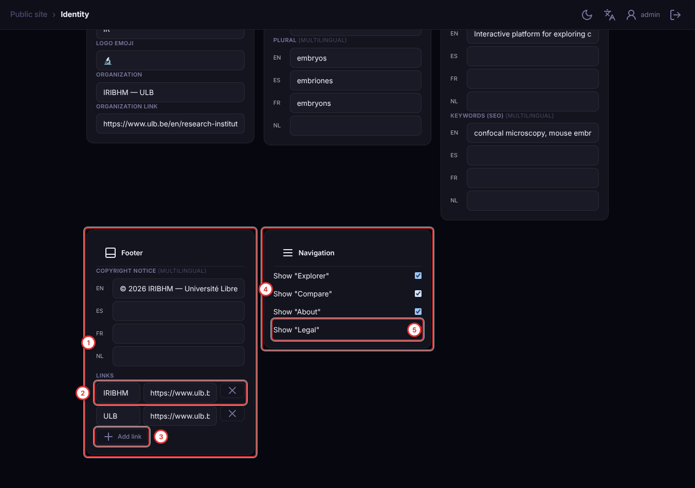{.shot width=88%}

::: legend
| n | what it is |
|-|----------------------|
| 1 | **Footer** card: the copyright notice (per language). |
| 2 | A footer **link**: [Label]{.ui} + address; the cross removes it. |
| 3 | [Add a link]{.ui}. |
| 4 | **Navigation** card. |
| 5 | The checkboxes that decide the public menu's entries. |
:::

- **Tagline** — the subtitle shown under the site's name.
- **Description (SEO)** — the summary shown by Google and social networks: two clear sentences are enough.
- **Keywords (SEO)** — a few terms separated by commas.
- **Navigation** — the boxes "Show "Explorer"", "Show "Compare"", "Show "About"", "Show "Legal"". Unticking removes the entry from the menu **without deleting the page**.

::: warning
**"Legal" is unticked by default.** If you write your legal notice (chapter 11), come back here to tick it: the page stays invisible otherwise.
:::

::: note
**Custom pages** created in the Pages tab are added to the menu **by themselves** on their first publication (chapter 10): there is nothing to tick here for them any more.
:::

Resetting asks "Reset identity to defaults? Business content will be removed.". Toasts: "Identity saved." / "Identity reset.". Saving rewrites **only this tab's keys**: a change made in the meantime in Data types or Pages is not overwritten. <kbd>Ctrl</kbd> + <kbd>S</kbd> saves; a warning appears if you leave with changes.

# 9. Appearance — the site's colours

::: chapter-intro
- Colours, font and rounded corners of the **public site**, with a **live preview**.
- Nothing is applied before [Save]{.ui}.
- Buttons stay **readable**: the contrast is computed for you.
:::

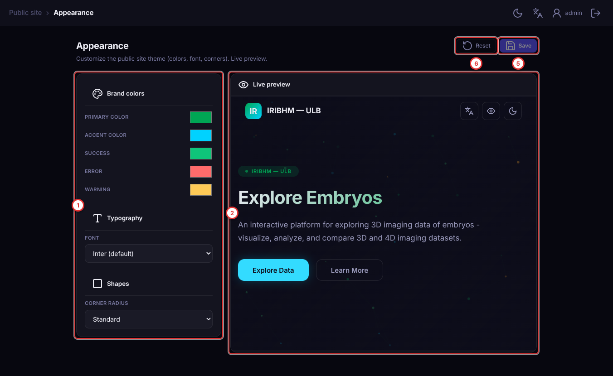{.shot width=88%}

::: legend
| n | what it is |
|-|----------------------|
| 1 | **Brand colors**. |
| 2 | **Typography**: the font. |
| 3 | **Shapes**: the roundness of corners. |
| 4 | **Live preview**: not yet published. |
| 5 | [Save]{.ui}: applies the theme to the public site. |
| 6 | [Reset]{.ui}: "Reset the theme to defaults?". |
:::

## 9.1. The colours

| Colour | Where it appears |
|---|---|
| **Primary color** | The dominant one: main buttons, links, active items |
| **Accent color** | The secondary one, for highlights |
| **Success** | Confirmations (green by default) |
| **Error** | Error messages (red by default) |
| **Warning** | Alerts (orange by default) |

Click a colour square to open the picker: **the preview updates instantly**. The main buttons are derived from the instance colour and respect **WCAG AA** contrast; the saved theme is applied before the first display.

::: tip
Keep Success / Error / Warning **close to green / red / orange**: they are universal cues.
:::

## 9.2. Typography and shapes

- **Font** — Inter (default), System, Grotesque, Serif, Rounded.
- **Corner radius** — Standard, Sharp, Soft, Round: from angular to very rounded, on buttons and cards.

## 9.3. Publishing the theme

Nothing is applied to the public site before [Save]{.ui} ("Theme saved." / "Failed to save the theme."). <kbd>Ctrl</kbd> + <kbd>S</kbd> works; the tab warns you if you leave it with changes.

::: warning
**Check the contrast.** A very light primary colour on a light background becomes unreadable. After saving, open the public site and check that everything reads well, in light **and** dark themes.
:::

# 10. Pages — the visual editor

::: chapter-intro
- Edit the content of the site's pages **as in page-layout software**.
- The draft is saved by itself; **nothing is public before [Publish]{.ui}**.
- 27 elements, sections, columns, translation, variables: without writing a line of code.
:::

This is the panel's richest feature.

## 10.1. Choosing a page

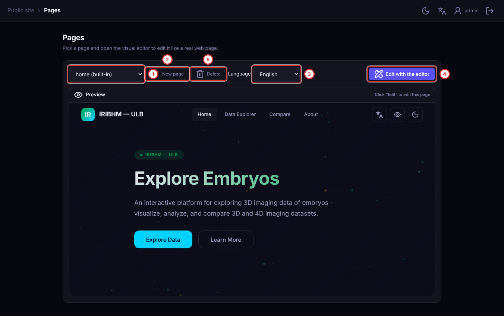{.shot width=88%}

::: legend
| n | what it is |
|-|----------------------|
| 1 | The **page** to edit. |
| 2 | [New page]{.ui}. |
| 3 | The **language** you are editing. |
| 4 | [Edit with the editor]{.ui}: opens the full-screen editor. |
| 5 | [Delete]{.ui}: erases a page you created. |
:::

Two pages exist from the start: **`home`** (the home page) and **`about`** (About). The *(built-in)* mention means they still use the supplied template: from your first publication, your version takes over. They **cannot** be deleted ("reset them" from the editor).

The home and About templates no longer contain a "Tracking" or "Wholemount" card: those categories no longer exist.

## 10.2. The editor

The editor opens **in its own tab** to use the whole screen.

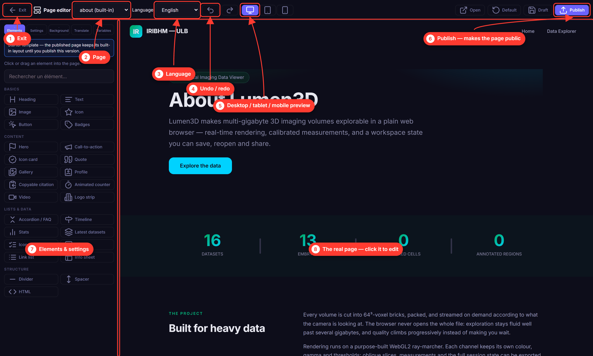{.shot width=88%}

::: legend
| n | what it is |
|-|----------------------|
| 1 | **Exit**: goes back to the panel. |
| 2 | The page being edited. |
| 3 | The language being edited. |
| 4 | **Undo / Redo** (<kbd>Ctrl</kbd> + <kbd>Z</kbd> / <kbd>Ctrl</kbd> + <kbd>Y</kbd>). |
| 5 | **Desktop / tablet / mobile** preview. |
| 6 | **Publish**: makes the version visible to the public. |
| 7 | The **sidebar**: elements to insert, settings of the selection. |
| 8 | **The real page**: its real menu, its real footer, its real theme. |
:::

### The top bar

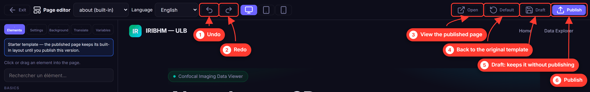{.shot width=88%}

::: legend
| n | what it is |
|-|----------------------|
| 1 – 2 | **Undo** and **Redo**. |
| 3 | **Open**: shows the published page in a new tab, for comparison. |
| 4 | **Default**: goes back to the original template. Erases your layout. |
| 5 | **Draft**: saves without publishing. |
| 6 | **Publish**: puts your version online. |
:::

::: remember
**Draft ≠ Publish.** Until you click [Publish]{.ui}, visitors see the old version. You can work for several days without breaking anything.
:::

### The save indicator

The editor **automatically saves the draft**, never the published version. A badge tells you where you stand:

| Badge | Meaning |
|---|---|
| ● Non enregistré | Changes are waiting. (Shown in French in every language.) |
| ✓ Enregistré hh:mm | The draft is up to date. (Shown in French in every language.) |
| ⚠ Autosave failed, click to retry | New automatic attempt, and when the network returns. |
| 🔒 Open in another tab, click to take over | Lock between two editing tabs of the **same page**. |
| ⚠ Page unreadable, reload before editing | The content could not be read. |

- Taking back control of a page open elsewhere asks "This page is open in another tab. Saving here will overwrite its changes. Continue?".
- A save coming from a **stale** tab is **refused** rather than overwriting a newer version.
- Switching page saves the old one first; if that fails: "The last changes to this page could not be saved. Switch page anyway?". Exiting: "Unsaved changes. Exit without publishing?".

## 10.3. Adding an element

The **Elements** tab of the sidebar contains everything that can be placed in a page.

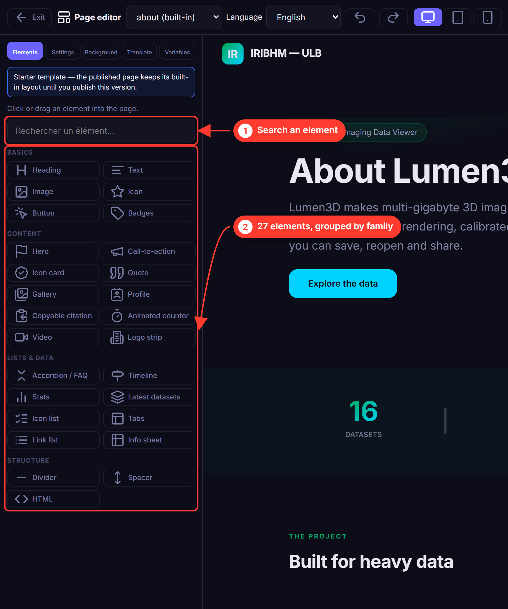{.shot width=50%}

- **Click** an element: it is added at the end of the page.
- **Drag it** to the wanted spot: drop zones appear.

The **Search an element…** field filters the list: there are **27**.

**Basics**

| Element | What it is |
|---|---|
| **Heading** | A section heading |
| **Text** | A paragraph |
| **Image** | An image |
| **Icon** | A pictogram |
| **Button** | A clickable button |
| **Badges** | Small coloured labels |

**Content**

| Element | What it is |
|---|---|
| **Hero** | The large introduction banner |
| **Call-to-action** | A panel that invites a click |
| **Icon card** | Icon + title + text |
| **Quote** | A highlighted quotation |
| **Gallery** | Several images in a grid |
| **Profile** | A person's card |
| **Copyable citation** | A reference with a "Copy" button |
| **Animated counter** | A number that counts up |
| **Video** | An embedded video |
| **Logo strip** | A row of partner logos |

**Lists & data**

| Element | What it is |
|---|---|
| **Accordion / FAQ** | Questions that unfold |
| **Timeline** | A sequence of dated steps |
| **Stats** | A row of key figures |
| **Latest datasets** | **Fills itself in** with your recent datasets |
| **Icon list** | A bulleted list with illustrations |
| **Tabs** | Content spread over tabs |
| **Link list** | A list of links |
| **Info sheet** | A label / value table |

**Structure**

| Element | What it is |
|---|---|
| **Divider** | A horizontal line |
| **Spacer** | An adjustable empty space |
| **HTML** | Free HTML code — **for experienced users only** |

::: tip
**Elements that fill themselves in.** *Latest datasets* and *Stats* draw on the site's data: number of datasets, specimens, tracked cells. The figure updates when you add data.
:::

::: note
The **HTML** element is cleaned by an **allow-list**: links, video/audio and table borders are kept; scripts, event handlers, SVG and dangerous links are removed.
:::

## 10.4. Editing an existing element

**Click it in the page**: it is outlined in green and the sidebar switches to its settings.

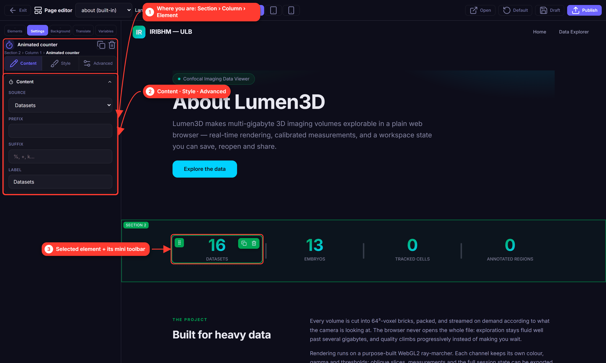{.shot width=88%}

::: legend
| n | what it is |
|-|----------------------|
| 1 | The **breadcrumb**: `Section 2 › Column 1 › Animated counter`. Each level is clickable. |
| 2 | The three settings tabs: **Content**, **Style**, **Advanced**. |
:::

### The mini toolbars

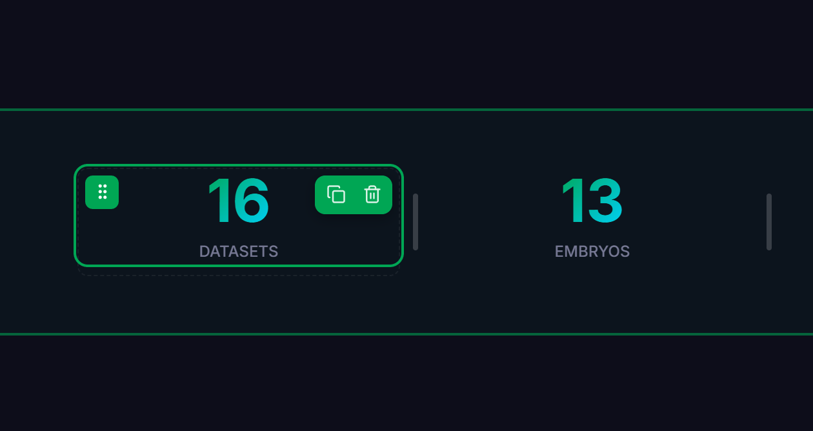{.shot width=60%}

**Only one toolbar is visible at a time**: the one for the innermost level under your cursor (element, then column, then section).

| Level | Buttons |
|---|---|
| **Element** | ⠿ move handle · ⧉ duplicate · 🗑 delete |
| **Column** | ‹ › move · ⚙ settings · ⧉ · 🗑 |
| **Section** | ⌃ ⌄ move up / down · ▥ add a column · ⚙ settings · ⧉ · 🗑 |

### The three settings tabs

**Content** — what is written: texts, images, links, data source. **Style** — colours, sizes, spacing, alignment, corner radii. **Advanced** — margins, hover behaviour, **visibility by device**, custom CSS.

:::: cols
::: col
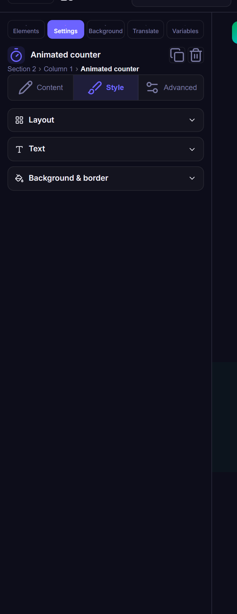{.shot width=88%}
:::
::: col
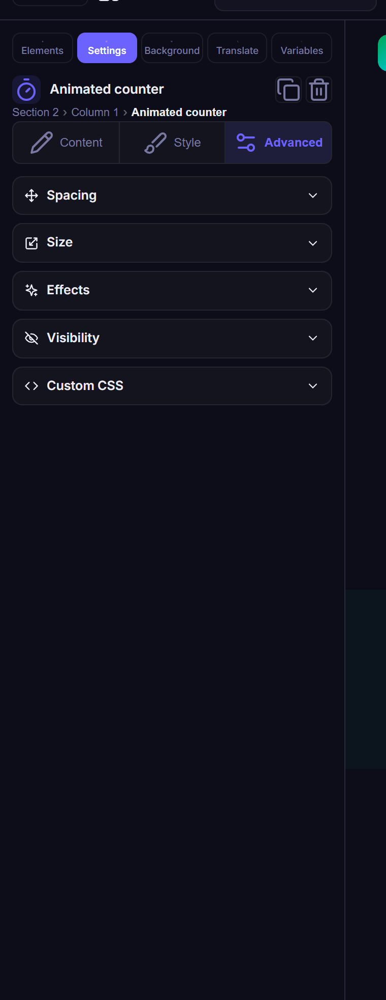{.shot width=88%}
:::
::::

::: tip
To edit a text faster, **double-click** it in the page and type. <kbd>Enter</kbd> confirms, <kbd>Esc</kbd> cancels.
:::

### Keyboard shortcuts

| Shortcut | Action |
|---|---|
| <kbd>Ctrl</kbd> + <kbd>Z</kbd> | Undo |
| <kbd>Ctrl</kbd> + <kbd>Y</kbd> (or <kbd>Ctrl</kbd> + <kbd>Shift</kbd> + <kbd>Z</kbd>) | Redo |
| <kbd>Ctrl</kbd> + <kbd>S</kbd> | Save a draft |
| <kbd>Ctrl</kbd> + <kbd>D</kbd> | Duplicate the selected element |
| <kbd>Ctrl</kbd> + <kbd>C</kbd> / <kbd>V</kbd> | Copy / paste an element |
| <kbd>Delete</kbd> (or <kbd>Backspace</kbd>) | Delete the element |
| <kbd>Esc</kbd> | Deselect |

On a Mac, replace <kbd>Ctrl</kbd> with <kbd>Cmd</kbd>. Shortcuts are disabled while you are typing in a field.

## 10.5. Sections, columns and mobile

A page is built on three levels: **Section** (a full-width band) › **Column** (a vertical split) › **Element**.

Six column layouts: **1** (full width), **2**, **3**, **4** equal columns, **⅔ ⅓** and **⅓ ⅔**. On a phone, the columns **automatically stack on top of each other**.

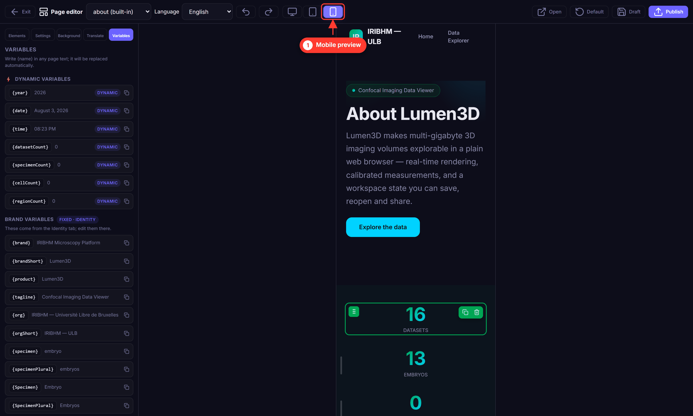{.shot width=70%}

The three icons (desktop / tablet / mobile) resize the preview. **Check on mobile before publishing**: a good share of visitors are on a phone.

## 10.6. Animated background, translation, variables

:::: cols3
::: col
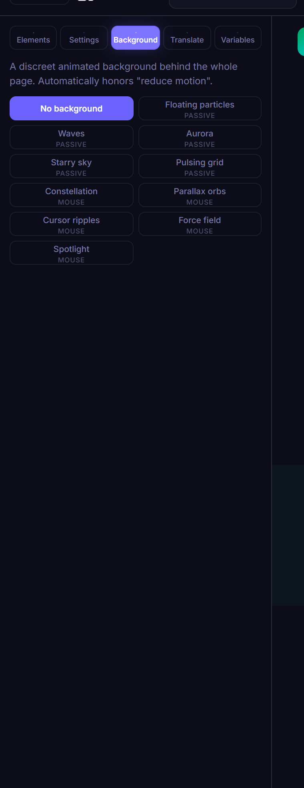{.shot width=88%}

**Background**: *No background*, *Mouse* (reacts to the cursor), *Passive* (plays by itself). Respects the "reduce motion" preference.
:::
::: col
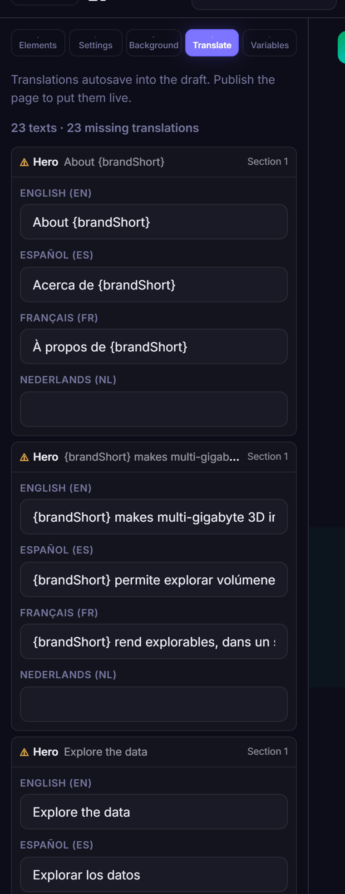{.shot width=88%}

**Translate** lists **all the texts** of the page and flags the missing ones ("24 texts · 7 missing translations").
:::
::: col
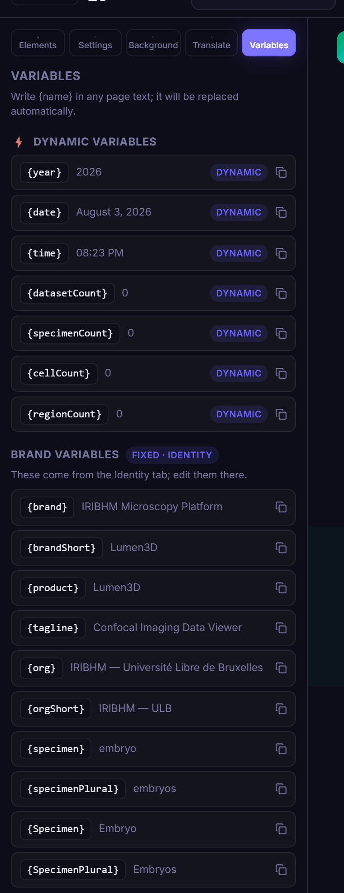{.shot width=88%}

**Variables**: a text defined **once**, reused everywhere with `{name}`.
:::
::::

**Recommended translation method**: write the whole page in one language, then go to the Translate tab to translate it in one go.

**Variables** — create one (name, for example `contact`; value, `microscopy@ulb.be`), write `{contact}` in any text, and the value is displayed. The day the address changes, you fix it in **one place only**. Naming rules: a letter, then letters, digits or `_`, 32 characters at most.

Some variables already exist: `{brand}` (site name), `{specimen}` (your object of study), `{org}`, `{year}`, and for the categories `{type3d}`, `{type2d}`, `{typeLive}` (chapter 6).

## 10.7. Creating a new page

::: steps
1. In the **Pages** tab, click [New page]{.ui}.
2. Answer the **two prompts**: "Page identifier (letters, digits, dashes):" (lowercase, digits, `-`, `_`, 64 characters) then "Menu label:".
3. Build the page in the editor.
4. Click **Publish**.
:::

Toast: "Page created. It will appear in the menu after publication.". The page is added to the menu **hidden**; it becomes **visible on first publication**: **nothing to tick in Identity**. It is then at the address `https://<your-site>/page.html?slug=protocols` (for the identifier `protocols`).

Errors: "Invalid identifier.", "This page already exists.". Deleting asks "Delete this page?" and really erases the configuration file.

## 10.8. Recommended workflow

::: steps
1. **Edit with the editor**, make your changes.
2. **Draft** from time to time (on top of the automatic save).
3. Check in **mobile preview**.
4. Complete the **Translate** tab.
5. **Publish**, then **Open** to check the result online.
:::

# 11. Legal

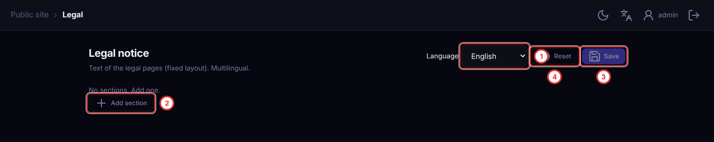{.shot width=88%}

::: legend
| n | what it is |
|-|----------------------|
| 1 | The **Language** selector. |
| 2 | [Add a section]{.ui}: a **title** and a **text**. |
| 3 | [Save]{.ui}: publishes. |
| 4 | [Reset]{.ui}. |
:::

A simple editor, with a fixed layout, for the legal text. Sections are displayed in the order you create them; each has a "Section title", a "Text…" and a [Delete]{.ui} button. With no section: "No sections. Add one.". Result: "Legal notice saved.". <kbd>Ctrl</kbd> + <kbd>S</kbd> saves.

**Usual sections:** site publisher, host, intellectual property, personal data, contact.

::: warning
**Two things not to forget.** (1) The page stays invisible as long as the box "Show "Legal"" is not ticked in **Identity › Navigation**. (2) Legal content depends on your country and your institution: ask the competent department rather than copying a template found online.
:::

# 12. Plugins — the viewer's features

::: chapter-intro
- Almost everything a visitor can do is provided by a **plugin**, a small independent module.
- **By default, a plugin is not allowed to run**: you are the one who authorises it.
- You can **remove** what is not useful, and **add** more later.
:::

This is the most technical chapter, but also the one that gives the most control. Take the time to read §12.1: the rest follows from it.

## 12.1. What is a plugin, here?

::: analogy
**A workbench and its tools.** The viewer is a minimal workbench. Measuring a distance, taking a capture, adjusting a histogram, choosing a render mode: each feature is **a tool stored on the workbench**. You decide which ones are put on it.
:::

Each plugin occupies one of **three slots**:

| Slot | Where it appears for the visitor | Examples |
|---|---|---|
| **Tools** (toolbar) | The buttons at the top of the viewer | Distance measurement, screenshot, presentation mode |
| **Channels** (per channel) | The settings under each fluorescence channel | Histogram, Gaussian blur |
| **Render modes** (shaders) | The drop-down menu that chooses how the volume is drawn | Fluorescence, Natural Fluorescence, Structure (DVR) |

## 12.2. The screen

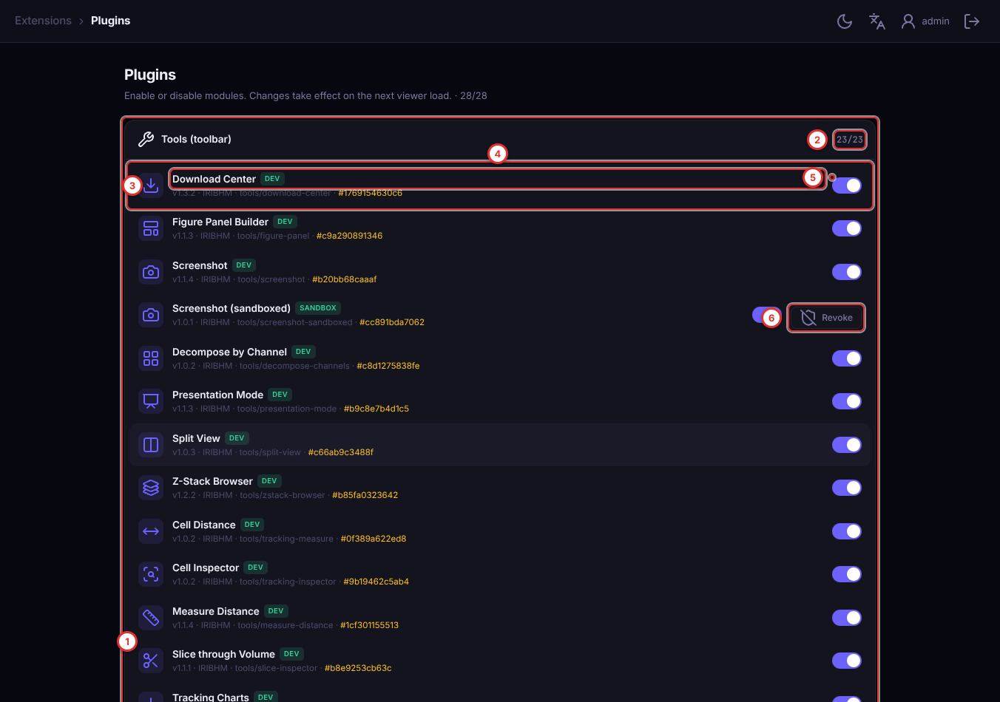{.shot width=88%}

::: legend
| n | what it is |
|-|----------------------|
| 1 | One **card per slot** (Tools, Channels, Render modes). |
| 2 | The card's `active / total` counter. |
| 3 | One **row per plugin**. |
| 4 | The **name** and the **trust level**. |
| 5 | The active / inactive **switch**. |
| 6 | **Revoke** (on a plugin you approved). |
:::

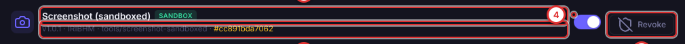{.shot width=88%}

::: legend
| n | what it is |
|-|----------------------|
| 1 | The plugin's **name**. |
| 2 | Its **trust level**. |
| 3 | Version · author · folder · code **fingerprint**. |
| 4 | The switch that **enables or disables**. |
| 5 | [Revoke]{.ui}: withdraws the authorisation (§12.5). Absent on a `bundled` plugin. |
:::

Empty list: "No plugin installed — Plugins are installed on demand from the catalog." with an [Open the catalog]{.ui} button. If the list does not load: "Could not load the plugin list." and [Retry]{.ui}.

## 12.3. Enabling or disabling a plugin

Flip the switch. The change is saved immediately and takes effect **the next time the viewer loads**: ask a visitor to reload their page, or reload the Datasets tab's preview. Disabling deletes nothing: you can re-enable at any time.

::: warning
**The switch is not always there.** An **untrusted** plugin has none: you must approve it first (§12.5). A **protected** plugin (the last active render mode) or an **incompatible** one has one, greyed out.
:::

::: note
**One safeguard only**: there must always be **at least one active render mode**. If you try to disable the last one: "At least one render mode must stay active.".
:::

## 12.4. Trust levels — why they exist

A plugin is **real code** that runs in the visitors' browsers. A malicious plugin could display anything. The platform therefore starts from the opposite of the usual assumption: **by default, a plugin is not allowed to run**. Each plugin carries a label:

| Label | Meaning | What it implies |
|---|---|---|
| **`bundled`** | Shipped with the site's official release, code identical to the published one | Trusted. Nothing to do. |
| **`approved`** | You allowed it to run in the page | Trusted because **you** decided so. |
| **`sandbox`** | Allowed, but **locked in a sandbox**: isolated from the rest of the page and from the panel | The safest mode. |
| **`dev`** | A local plugin on a development machine started with the `--dev-trust-local` flag | Does not exist on a production site. Without this flag, a clone has **no** trusted local plugin. |
| **`untrusted`** | **Refused**: the plugin is not loaded at all | See §12.5. |
| **`protected`** | The last active render mode | The switch is greyed out. |
| **`incompatible`** | It requires another version of the platform | Greyed out; see chapter 14. |
| **`update available`** | A newer, compatible version exists | See §12.6. |

**The fingerprint** (a code such as `#06c7945439b8`, under each name) signs the exact content of the files. Your authorisation is **tied to that exact fingerprint**: if someone changes a single character of the plugin, the fingerprint changes, the authorisation lapses and the plugin goes back to **untrusted**. An approved plugin therefore cannot be swapped behind your back.

## 12.5. Approving an untrusted plugin

You will meet this case if someone drops a plugin on the server (by FTP) instead of going through the Catalog.

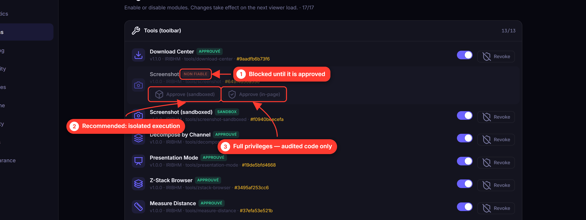{.shot width=88%}

::: legend
| n | what it is |
|-|----------------------|
| 1 | The red **UNTRUSTED** label: the plugin is not loaded. |
| 2 | [Approve (sandboxed)]{.ui}: the plugin runs isolated. **Recommended choice.** |
| 3 | [Approve (in-page)]{.ui}: the plugin runs with the full powers of the page. |
:::

::: steps
1. Click one of the two buttons.
2. A window summarises what you are approving: the code **fingerprint** and the **capabilities** granted.
3. The panel asks you to **retype your password**: "Confirm your admin password to approve:".
4. "Plugin approved ✓ (reload the viewer)": active on the next load.
:::

::: why
**Why ask for the password again?** Approving is the only action that allows outside code to run. Even if someone sat down at your open screen, they could not approve anything without your password.
:::

::: warning
**"In-page" rather than "sandboxed"?** Almost never, unless you have read the code or it comes from someone you trust. **Channel** and **render mode** plugins technically cannot be sandboxed: they talk directly to the graphics card.
:::

Messages: "Incorrect password.", "The plugin content changed — reload the list and re-check." (the fingerprint moved in the meantime), "Approval revoked ✓" after [Revoke]{.ui}.

## 12.6. Updating a plugin

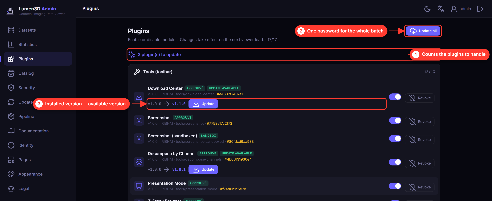{.shot width=88%}

::: legend
| n | what it is |
|-|----------------------|
| 1 | The **banner** counts the plugins concerned. |
| 2 | [Update all]{.ui}: from two plugins on; **a single password** for the batch. |
| 3 | The row: **update available** label, the `v1.0.0 → v1.1.0` path, button. |
:::

The button appears only if **a newer version exists AND it declares itself compatible** with your platform. Otherwise the reason is shown: update the platform first (chapter 14).

The copy that works is **set aside, not deleted**: if anything fails afterwards, it is put back. The same action exists in the **Catalog** and in **Updates**: the three tabs read the same source.

## 12.7. In a panel, a split view, the preview

A plugin must declare that it knows how to **be driven from outside** in order to load when the page is **embedded**: the Datasets tab's preview, the panels of the *Compare* page, the panes of the split view. Otherwise it is loaded only on the full page.

The **"page only"** plugins — Presentation Mode, Download Center, Decompose by Channel, Screenshot, Chunk Debug, Split View, Figure Panel Builder, Tracking Charts, Cell Distance — therefore do not appear in the preview. **This is not a bug.**

A plugin can also be **limited to data types**: the five 2D plugins load only on a photograph; the five tracking plugins only on a Live dataset that has tracking.

## 12.8. The 28 plugins of the catalog

These plugins are **not** shipped with the site: they are installed on demand (first-time setup wizard, step 5, or the Catalog tab). A fresh installation where everything was unticked would have none.

**Render modes**

| Plugin | What it does for the visitor |
|---|---|
| **Fluorescence** | The default rendering: each channel emits its colour, as on a fluorescence microscope |
| **Natural Fluorescence** | Each fluorophore glows in its own colour; dense structures hide what is behind them |
| **Structure (DVR)** | Volume rendering with depth and shading, which brings out shapes |

**Channels**

| Plugin | What it does |
|---|---|
| **Histogram Controls** | The intensity histogram and the min / max / gamma sliders |
| **Gaussian Filter** | A blur slider to smooth a channel's noise |

**Tools (volumes and time series)**

| Plugin | What it does |
|---|---|
| **Measure Distance** | Click two points to get the real distance in µm |
| **Slice through Volume** | An orientable flat cut through the volume |
| **Z-Stack Browser** | Browse the slices: animated flat opening, 3D notch, top / bottom trimming, adjustable thickness bar, "Rotation" slider |
| **Decompose by Channel** | Show the channels side by side |
| **Download Center** | Fetch files, measurements, metadata, exports |
| **Screenshot** | Capture the 3D view as a PNG |
| **Screenshot (sandboxed)** | The same capture, in a sandbox: the example of an isolated plugin |
| **Presentation Mode** | Full screen without interface, for projecting |
| **Orientation Axes** | The red / green / blue 1-2 frame, renamable (§3.8) |
| **Toggle Grid**, **Toggle Axes**, **Hide / Show 3D Volume** | Show or hide the grid, the axes, the volume |
| **Chunk Debug** | Technical diagnostics. **Can safely be disabled** in production |

**2D photograph tools**

| Plugin | What it does |
|---|---|
| **Calibrated Grid** | A grid calibrated in µm or mm over the photograph |
| **Display Adjustments** | Brightness, contrast, gamma (display only) |
| **Orientation 2D** | Rotation and mirror of the photograph |
| **Split View** | Two views side by side |
| **Figure Panel Builder** | Compose several photographs into one figure at a common scale |

**Cell-tracking tools (Live series with tracking)**

| Plugin | What it does |
|---|---|
| **Tracking Trails** | The trajectories over the volume |
| **Tracking Surface** | The embryo's surface inside the volume |
| **Cell Inspector** | Metrics, lineage, neighbours of a cell |
| **Tracking Charts** | Population, speed and mitosis charts |
| **Cell Distance** | Distances between cells |

::: note
**Slice through Volume** and **Z-Stack Browser** are **mutually exclusive**: opening one closes the other.
:::

# 13. Catalog — installing new plugins

::: chapter-intro
- The Catalog works like an **app store**: official, signed plugins.
- Installing = one click + your **password**; the plugin is verified, installed and **approved**.
- An installation is **cancelled** at the slightest difference from what the catalog announces.
:::

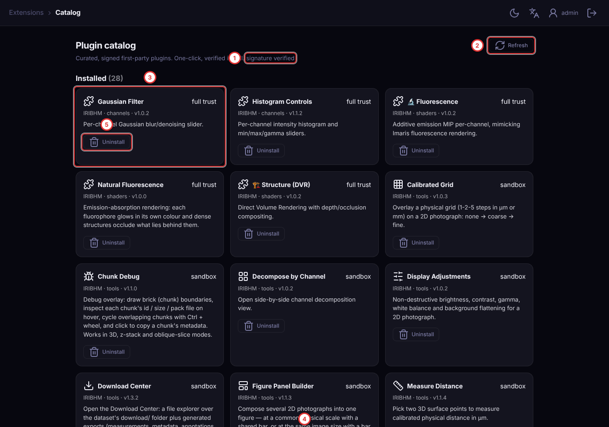{.shot width=88%}

::: legend
| n | what it is |
|-|----------------------|
| 1 | **Signature verified**: the catalog is authenticated. |
| 2 | [Refresh]{.ui}. |
| 3 | A **plugin card** (name, slot, version, description). |
| 4 | The **capabilities** requested. |
| 5 | [Uninstall]{.ui}. |
:::

Plugins are split into sections: **To update** (first, if there are any), **Installed**, **Available**, possibly **Incompatible**.

## 13.1. Installing a plugin

::: steps
1. Find the plugin's card in **Available**.
2. Click [⬇ Install]{.ui}.
3. "Install this plugin? Confirm with your admin password:".
4. "Installing (download + verification)…" then "Plugin installed and approved ✓".
:::

The server checks that the file matches **bit for bit** what the catalog announces. At the slightest difference, the installation is **cancelled** ("Install failed (verification failed)."). Other messages: "Wrong password.", "Already installed.".

At the top of the page, **"signature verified"** (catalog authenticated) or **"unsigned"** (no key configured: only the sha256 fingerprint is checked).

::: why
**Older catalog refused (anti-rollback).** Each signed catalog carries an **increasing serial number**. The server refuses a catalog older than one it has already accepted: "Catalog refused: it is older (no. … ) than a catalog this server already accepted. It could reinstall plugin versions that have since been fixed.". There is **nothing to do** on your side, and this message cannot be bypassed.
:::

## 13.2. Updating, uninstalling

An installed plugin for which a newer **and** compatible version exists moves to **To update**: its card shows `v1.0.0 → v1.1.0` and an [Update]{.ui} button next to [Uninstall]{.ui} (check which one you click). [Update all]{.ui} handles the batch with a single password.

[🗑 Uninstall]{.ui} asks "Uninstall this plugin?" then "Plugin uninstalled."; the files are removed from the server and you can reinstall afterwards. **One refusal only**: the **last render mode** ("Cannot: last render mode.").

## 13.3. The card labels

| Label | Meaning |
|---|---|
| **`sandbox`** | "Runs isolated (sandbox)": the case of toolbar plugins. |
| **`full trust`** | "Full in-page trust (shaders/channels)": unavoidable for render modes and channel settings, which drive the graphics card. |
| **`update available`** | A newer, compatible version exists. |
| **`incompatible`** | Appears only on a plugin that is **not installed**: it requires another version of the platform. The install button is greyed out: update the platform (chapter 14). |

::: note
A plugin that is **already installed** never carries the `incompatible` label: the one running on your site works; only its next version may have to wait. A package that declares a data type requires a **recent** platform (1.51 to 1.53): a site that has not been updated will show "incompatible" on recent plugins.
:::

Catalog states: "Catalog unavailable", "Catalog unreachable.", "No plugins in the catalog.", "No catalog source configured…".

# 14. Updates — moving the site forward

::: chapter-intro
- This tab updates **the software**: the platform, the plugins, and flags the **Pipeline pack**.
- Before installing, a **check report** says what will be affected.
- A version that does not start is **automatically replaced** by the old one.
:::

::: warning
**Do not confuse it** with the [Data updates]{.ui} tab (chapter 5), which upgrades the **format** of your datasets.
:::

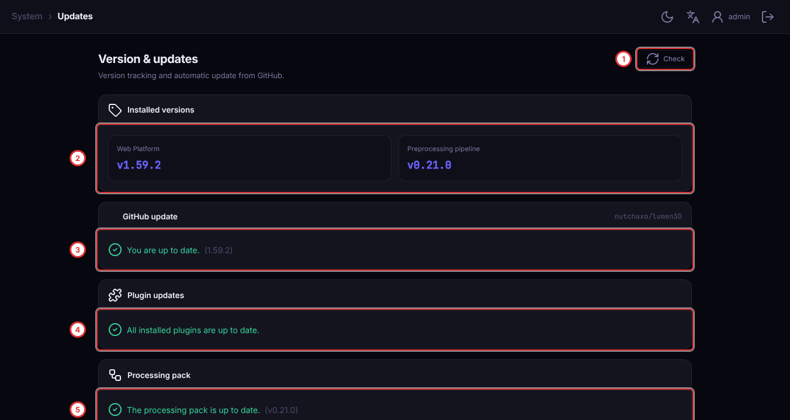{.shot width=88%}

::: legend
| n | what it is |
|-|----------------------|
| 1 | [Check]{.ui}: reruns the three checks. |
| 2 | **Installed versions**: Web Platform and Preprocessing pipeline. |
| 3 | **GitHub update**: "You are up to date." or "Update available: vX". |
| 4 | **Plugin updates**. |
| 5 | **Processing pack**: is the Pipeline pack up to date? |
:::

Two version numbers are shown, for two independent components: **Web Platform** (the site: **this is the one that counts**) and **Preprocessing pipeline** (the tool of chapter 15, which evolves at its own pace). An unknown value is not displayed.

## 14.1. Starting a platform update

When a new version exists, its **release notes** are displayed. Read them: they describe what changes.

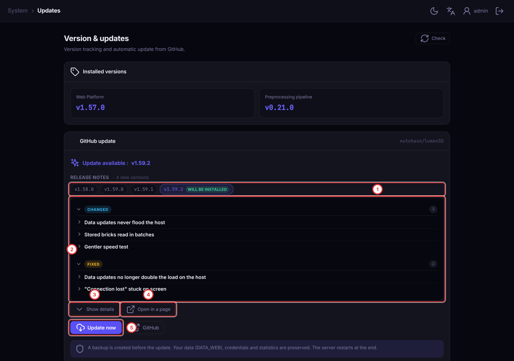{.shot width=88%}

::: legend
| n | what it is |
|-|----------------------|
| 1 | One **badge per version** brought; the last is marked "will be installed". |
| 2 | The notes of the chosen version, as a **collapsible tree** (ADDED, OPTIMIZED, FIXED, CHANGED). |
| 3 | [Show details]{.ui} / [Titles only]{.ui}. |
| 4 | [Open in a page]{.ui}: the *Release notes* page (§14.3). |
| 5 | [Update now]{.ui}. |
:::

If your site has **skipped several versions**, each has its badge ("4 new versions"): you read what **each** version brings, not just the last. The notes have been in **English** since 1.55.0 (the oldest are in French).

::: steps
1. Click [Update now]{.ui}.
2. The **check report** appears (below).
3. Click [Confirm update]{.ui}.
4. Let it run: a bar of steps scrolls by.
:::

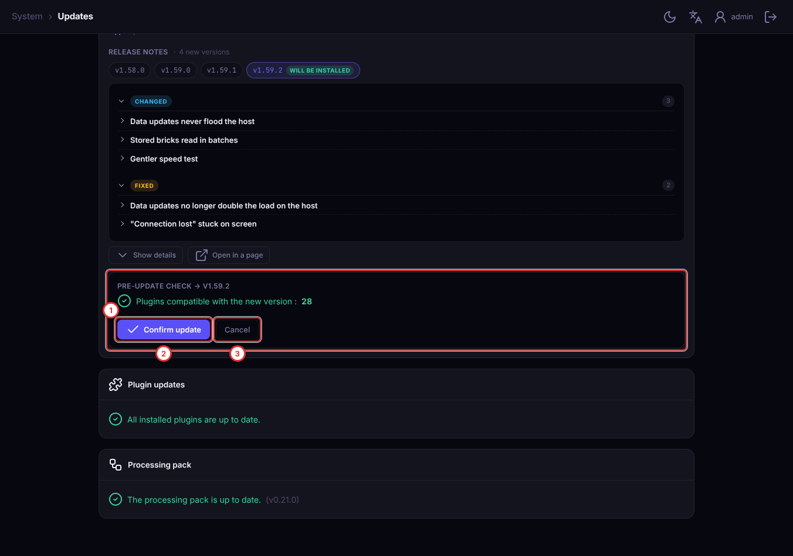{.shot width=88%}

::: legend
| n | what it is |
|-|----------------------|
| 1 | The **report**: plugins compatible with the new version, plugins quarantined, possible blockage. |
| 2 | [Confirm update]{.ui}: does not appear if something **blocks**. |
| 3 | [Cancel]{.ui}. |
:::

The report tells you, **before** anything is installed: how many plugins will remain compatible; which ones will be **quarantined** because they do not work with the new version yet (they are not deleted and **re-enable themselves** as soon as an update makes them compatible); whether something blocks.

The steps that scroll by: **Checks → Backup → Download → Integrity → Staging → Boot check → Swap plan → Switching over → Server restart**. The server restarts: **sign in again**. Success is announced only when the **new version really answers**.

## 14.2. The safeguards

- **A full backup** is made before anything else.
- **The downloaded file is verified**, and this is **mandatory**: only the archive named after the version, listed in the signed `SHA256SUMS` (Ed25519 signature, pinned key), is applied. Never GitHub's "source" zip. Otherwise: "This release cannot be verified (no checksum for its archive) and was not applied." with the reason.
- **The new version is tested before it goes live.** If it does not start: "automatic rollback done": the site still works, nothing to repair.
- **Your data is preserved**: `DATA_WEB`, credentials, statistics, Identity / Pages / Appearance settings. No re-processing of datasets is required.
- **Every published version has passed the whole test suite** before being built.

::: tech
The **first** update to a version ≥ 1.57 is verified by checksum only (the signing key was not yet in the old version); the following ones verify the signature. `.htaccess` lines **outside** the `# BEGIN LUMEN3D` / `# END LUMEN3D` block survive updates; the update to 1.57 replaces the root `.htaccess` **once** (re-enter any host-specific line then, such as an `AddHandler`).
:::

| Message | What it means |
|---|---|
| You are up to date | Nothing to do. |
| GitHub API rate limit reached | Too many checks in a short time; retry in a few minutes. |
| Unable to reach GitHub | A network problem on the server side; retry later. |
| No release published on GitHub yet. | No version has been published yet. |
| This host's PHP certificate store is unusable | Report it to the person who manages the server (a `cacert.pem` file to upload). |
| Update completed successfully. The server restarted — please sign in again. | Success; [Got it]{.ui} closes the "Last update" card. |
| The new version failed to start — automatic rollback done. The previous version is running. | The site is back on the old version; there is nothing to repair. |
| The server is not answering. Check logs/update-pivot-*.log and reload the page. | Reload; report it if it persists. |

## 14.3. The "Release notes" page

The [Open in a page]{.ui} button opens `admpan.html?changelog=1` in a new tab: a page **without a menu**, for comfortable reading.

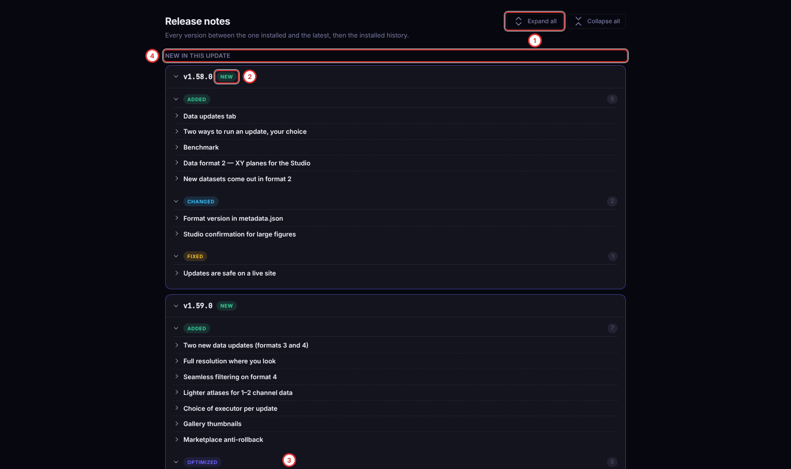{.shot width=88%}

::: legend
| n | what it is |
|-|----------------------|
| 1 | [Expand all]{.ui} (and [Collapse all]{.ui}). |
| 2 | The **new** label: an upcoming version. |
| 3 | The **will be installed** label: the most recent. |
| 4 | The "New in this update" group. |
:::

If you are up to date: "Nothing to install: you are up to date.". Each version, each section and each entry folds separately. While loading: "Loading release notes…"; on failure: "Release notes unavailable.".

## 14.4. Updating plugins

A **Plugin updates** card answers the same question for modules: "{n} plugin(s) to update", with [Update all]{.ui} (a single password). A plugin whose new version requires a newer platform appears in a second list, **"Updates waiting on the platform"**, with the reason: it is not hidden away.

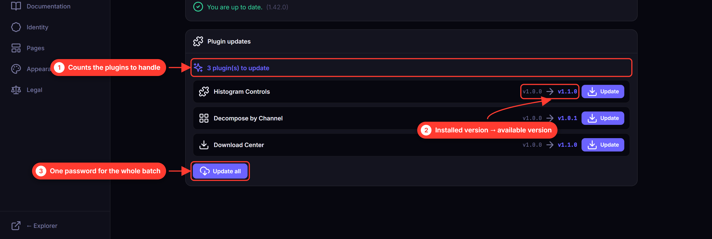{.shot width=88%}

::: legend
| n | what it is |
|-|----------------------|
| 1 | The **number** of plugins to handle. |
| 2 | For each: the installed version and the version it would go to. |
| 3 | [Update all]{.ui}: a single password for the batch. |
:::

## 14.5. The processing pack

The **Processing pack** card compares the Pipeline pack **installed here** with the one attached to the **latest GitHub release**. States: "The processing pack is up to date. (v0.21.0)" or "New processing pack: vX (here: vY)" with [Download the pack]{.ui}.

It installs **on the processing workstation, not on this server**: download it and replace the folder used there. **The platform does not need updating** to get a newer pack. If GitHub is unreachable: "Could not reach GitHub to check the processing pack.".

# 15. Pipeline — preparing new data

::: chapter-intro
- This tab processes **nothing** on the server: it has you **download a pack**.
- The pack runs on a **powerful computer**, typically the analysis workstation.
- The resulting folder is then sent through the **Import** tab.
:::

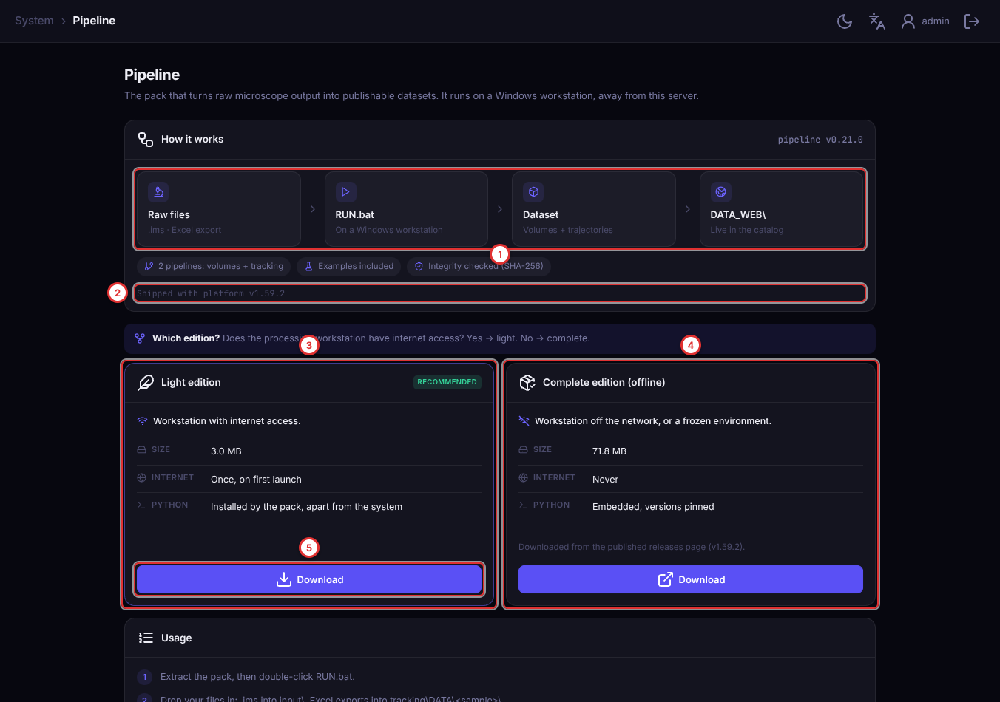{.shot width=88%}

::: legend
| n | what it is |
|-|----------------------|
| 1 | The **data path** in four steps. |
| 2 | "Shipped with platform vX": the pack version shipped with this site. |
| 3 | **Light edition** (recommended). |
| 4 | **Complete edition** (offline). |
| 5 | [Download]{.ui}. |
:::

**Why separate it?** Converting a volume takes an enormous amount of memory: count on about **32 GB of RAM** for a 3789 × 3789 × 178 volume. No shared web server can do that.

## 15.1. The principle

| Step | What it is |
|---|---|
| **Raw files** | What comes out of the microscope: `.ims` for volumes, Excel export for tracking, `.tif` for photographs |
| **`RUN.bat`** | The launcher, on a Windows workstation |
| **Dataset** | What the pack produces: tiled volumes, photograph, trajectories |
| **`DATA_WEB\`** | The server's folder: the dataset appears in the catalog immediately |

The pack contains **two pipelines** (volumes with tracking, tracking analysis), the **2D photograph import**, sample inputs (usable right away to get a feel for it), and a launcher that **checks its own integrity** (SHA-256).

::: note
**Two numbers, and that is normal.** The header shows `pipeline v0.21.0`: the version **of the pack**, not of the site. Pipeline 0.21.0 writes **format 4 directly** (no data update needed on its outputs), **keeps the curation** done in the panel when a dataset is re-processed (hidden, name, orientation…) and **publishes all or nothing**.
:::

When a newer version of the pack is published, a **banner** appears at the top: "New pack version: v… — This server offers v…. Download the new one below — the platform does not need updating for this." with [Download v…]{.ui}; for the light edition, [Installed version]{.ui} keeps the server's pack accessible.

## 15.2. Which edition to choose

A single question: **does the processing workstation have access to the internet?**

| | **Light edition** *(recommended)* | **Complete edition** *(offline)* |
|---|---|---|
| For whom | A workstation connected to the internet | A workstation off the network, or an environment to freeze |
| Size | ~3 MB | ~70 MB (≈ 200 MB unpacked) |
| Internet | **once**, on first launch | **never** |
| Python | installed by the pack, apart from the system | embedded, versions pinned |

The light edition **never** modifies the Python already installed on the workstation.

::: warning
The complete edition is attached to the version published on GitHub, not to the site. If it is unavailable, the panel says so ("This edition is not attached to the latest published release. Use the light edition…") and the light edition remains downloadable.
:::

## 15.3. How to use it

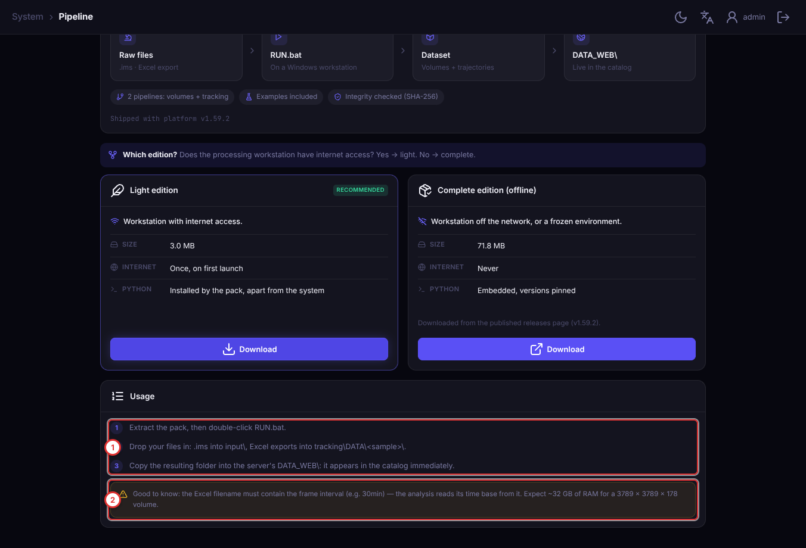{.shot width=88%}

::: legend
| n | what it is |
|-|----------------------|
| 1 | The three **usage** steps. |
| 2 | The warning: the Excel file name must contain the interval between frames. |
:::

::: steps
1. Unzip the archive on the processing workstation, double-click **`RUN.bat`**.
2. Drop the `.ims` files in `input\` and the Excel exports in `tracking\DATA\<sample>\`.
3. Copy the resulting folder into the server's `DATA_WEB\`, **or, without FTP access, drag it into the Import tab** (chapter 4). It appears in the catalog immediately.
:::

::: warning
**The Excel file name must contain the interval between frames** (for example `30min`): the analysis reads its time base from it.
:::

The launcher's menu offers: **[1]** Imaris volume preprocessing (`.ims` → `output\`, tracking included); **[2]** Imaris tracking analysis (Excel → `tracking\OUTPUT\`); **[3]** 2D photograph import (`.tif` → `output\2d\`); **[4]** Attach tracking to an already processed dataset; **[5]** Check the environment only; **[0]** Quit.

::: see
The detail of what each step does (noise cleaning, pyramid, bricks, tracking) is in the **full documentation**, chapters 4 to 8.
:::

# 16. Security — password and permissions

::: chapter-intro
- Changing the password requires the **old one**.
- A change **signs out all your other sessions**.
- The password is **never** stored in plain text.
:::

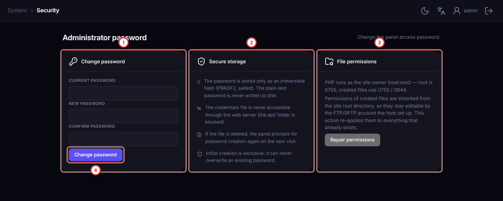{.shot width=88%}

::: legend
| n | what it is |
|-|----------------------|
| 1 | **Change password**: current, new, confirmation. |
| 2 | **Secure storage**: how it is kept. |
| 3 | **File permissions**: the state, and [Repair permissions]{.ui}. |
| 4 | [Change password]{.ui}. |
:::

## 16.1. Changing the password

Fill in the three fields and click [Change password]{.ui}. You must know the old one: this stops someone who finds your session open from locking you out.

- **8 characters minimum** ("Password too short (8 characters minimum).").
- Other messages: "The passwords do not match.", "Current password is incorrect.", "Failed to change the password.", then "Password changed ✓".
- You **stay signed in**, but **all other sessions are closed**. Passwords already stored are re-hashed at a higher cost at the next sign-in.

::: tip
Aim for **12 characters or more**. A phrase that is easy to remember beats a complicated word: `microscope-embryo-2026` is far stronger than `M1cr0!`.
:::

## 16.2. How the password is stored

- **Never in plain text.** The server keeps only an irreversible fingerprint (salted PBKDF2). You cannot get back to the password from the fingerprint.
- **The credentials file is never served.** Even by typing its exact address, you get an error.
- **If the file is deleted**, the panel offers to create a password again: this is the emergency door (appendix B).
- **The initial creation can never overwrite** an existing password.
- **Repeated attempts are slowed down** (§1.4) and sessions last 8 hours.

## 16.3. Repairing permissions

Useful on some shared hosts, where the site runs under a different system account from the one used for FTP: files created by the site become unreadable or not modifiable. **Symptom:** a save fails for no apparent reason.

The status line says, for example, "PHP (www-data) ≠ site owner (…)" or "PHP runs as the site owner (…)". In the first case, click [Repair permissions]{.ui}: the operation is harmless and reapplies the correct rights (toast "{n} entries fixed ({failed} failures)."). On a Windows server: "Windows host: POSIX permissions do not apply.": nothing to do.

# 17. Documentation — the platform's guides

::: chapter-intro
- This is where you will find **this document**, and all those that will be published.
- They come from the **project's repository**: a corrected guide arrives **without updating the site**.
- **Your language** is chosen automatically.
:::

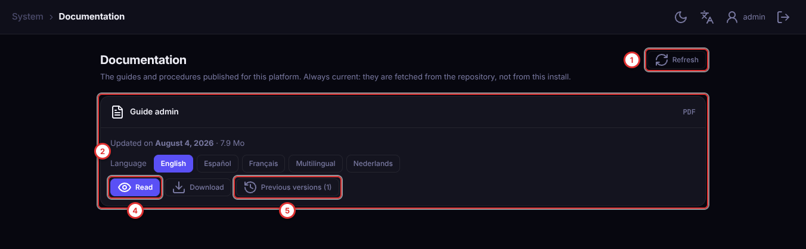{.shot width=88%}

::: legend
| n | what it is |
|-|----------------------|
| 1 | [Refresh]{.ui}: re-reads the list from the repository. |
| 2 | One **card per document**, all languages and versions combined. |
| 3 | The **language** offered (yours is chosen automatically). |
| 4 | [Read]{.ui}: opens the document in the panel; next to it, [Download]{.ui}. |
| 5 | [Previous versions]{.ui}. |
:::

## 17.1. Where these documents come from

Not from this installation: they are published in the repository and fetched when displayed. If the server cannot reach GitHub, the list is not shown and a banner tells you why ("Could not reach GitHub to read the document list."); this is not a failure of the site, only of this list. Other messages: "GitHub API rate limit reached…", "The DOCS/ folder does not exist in the repository yet.".

The list is cached for **ten minutes**: a document published just now may take a moment to appear. [Refresh]{.ui} forces a re-read.

## 17.2. Choosing the language and reading

The available languages (Français, English, Nederlands, Español, Deutsch, Italiano, Português, Multilingual) are shown as buttons. The choice is made in this order: **your interface language**, otherwise **English**, otherwise **Multilingual**, otherwise the first available: never an empty card because a translation is missing.

[Previous versions]{.ui} unfolds the older editions: a corrected document **does not replace** the old one, it is added to it. [Read]{.ui} displays the document in the panel; [New tab]{.ui} opens it full size, [Close]{.ui} closes it.

::: note
**Not every format can be displayed.** PDFs, images (`png`, `jpg`) and text (`txt`, `md`) are read in the panel. The others (Word, spreadsheet, archive) have no [Read]{.ui} button: they are downloaded. This is a security choice.
:::

## 17.3. Publishing a document

Reserved for the person who manages the repository, but good to know so you can ask for the right thing. A document is published by dropping a file in the repository's `DOCS/` folder, named according to a strict rule:

```
261007 - GUIDE-ADMIN - EN.pdf
└─┬──┘   └────┬────┘   └┬┘
  │           │         └── the language
  │           └──────────── the document's identifier, the same from one version to the next
  └──────────────────────── the date YYMMDD: this is the version number
```

- **The date** orders the versions: the most recent is offered, the others stay accessible. This guide, dated **7 October 2026**, becomes "the most recent" compared with the August 2026 editions.
- **The identifier** must stay **identical** from one version to the next, otherwise the panel sees two different documents.
- A file that does not follow the rule is **flagged as ignored** ("Files ignored (name does not match)") at the bottom of the tab: a typing mistake shows.

# Appendix A — First-time setup

::: chapter-intro
- It concerns only the **very first start-up** of a new site.
- A **5-step** wizard; only the first step is mandatory.
- The password from step 1 also authorises the plugin installations of step 5.
:::

When no administrator account exists, opening `admpan.html` triggers the **Guided setup**. A 5-segment bar shows progress; at the bottom: [Back]{.ui}, [Skip]{.ui}, [Next]{.ui} (then [Finish]{.ui}). If you click [Skip]{.ui}, the wizard ends immediately: values already entered are kept, **the following steps are not done** (so **no plugin is installed** if you skip before step 5: do it in Catalog).

## Step 1 — Admin account

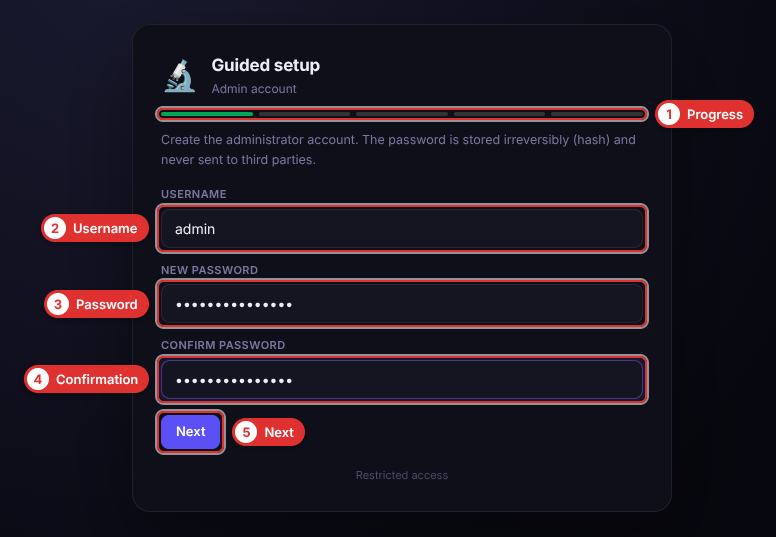{.shot width=75%}

::: legend
| n | what it is |
|-|----------------------|
| 1 | The **progress** (5 segments). |
| 2 | **User name** (`admin` by default). |
| 3 | **New password**: **8 characters minimum**. |
| 4 | **Confirm password**. |
| 5 | [Next]{.ui}. |
:::

This is **the only mandatory step**. The creation is **exclusive**: it can never overwrite an existing account ("A password already exists. Reload the page to sign in."). The session is opened afterwards: you do not sign in again. Errors: "Password too short (8 characters minimum).", "The passwords do not match.".

## Step 2 — Identity

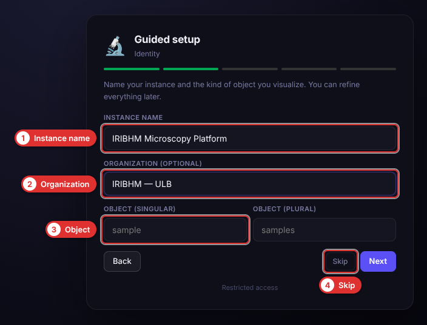{.shot width=75%}

::: legend
| n | what it is |
|-|----------------------|
| 1 | **Instance name**. |
| 2 | **Organization** (optional). |
| 3 | **Object (singular)** and **(plural)**: the word for your objects of study. |
| 4 | [Skip]{.ui}. |
:::

Editable afterwards in **Identity** (chapter 8).

## Step 3 — Theme

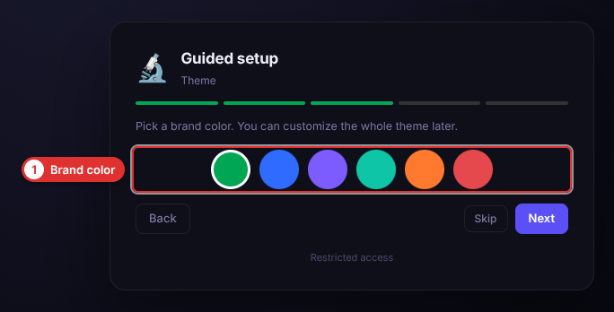{.shot width=75%}

One **brand colour** out of six (green preselected). Can be refined afterwards in **Appearance** (chapter 9).

## Step 4 — Texts

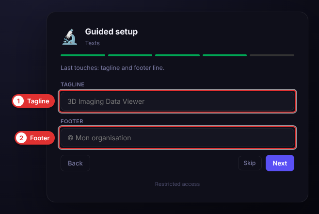{.shot width=75%}

The **tagline** and the **footer line**. Editable afterwards in **Identity**.

## Step 5 — Plugins

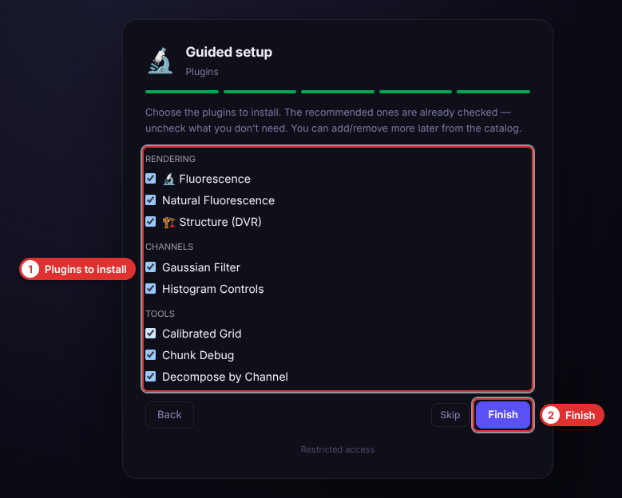{.shot width=75%}

The list, grouped **Rendering / Channels / Tools**, comes from the signed catalog ("Loading the catalog…"). Recommended plugins are **already ticked**; untick what you do not need. An incompatible plugin is greyed out "(incompatible)". If the catalog is unreachable: "Catalog unavailable — you can install plugins later from the Catalog tab.".

[Finish]{.ui} installs the selection ("Installing plugins… (i/n)", "{n} plugin(s) installed.") and opens the panel. **The step 1 password authorises these installations**: nothing is asked twice.

::: note
The wizard writes only the brand, the object, the organization, the footer and the chosen theme.
:::

# Appendix B — When something goes wrong

::: chapter-intro
- Almost everything can be **undone** with a "Reset" button.
- An interrupted transfer **resumes** if you drop the same folder again.
- "automatic rollback done" messages **require nothing from you**.
:::

### "I forgot the administrator password"

It is **impossible** to recover it: the server keeps only an irreversible fingerprint. The solution needs access to the server's files (FTP, SFTP, the host's file manager):

::: steps
1. Delete, or better **rename**, the file `api/admin_credential.json`.
2. Reopen `admpan.html`: the first-time setup wizard reappears.
3. Create a new password.
:::

**Nothing else is lost**: no datasets, no pages, no settings. During this short window, anyone opening the page could create the account in your place: do it in one go.

### "Trop de tentatives. Réessayez plus tard."

After 10 failures in 15 minutes, access is blocked for 15 minutes. Wait, then try again with the right password. Behind a proxy, see §1.4. (This server message is always shown in French.)

### "I changed something and the site is broken"

| Tab | How to go back |
|---|---|
| **Identity** | [Reset]{.ui} |
| **Appearance** | [Reset]{.ui} |
| **Pages** | [Default]{.ui} in the editor, then **Publish** |
| **Legal** | [Reset]{.ui} |
| **Data types** | [Default names]{.ui}, then [Save]{.ui} |
| **Datasets** | [↺ Reset]{.ui} (before saving); the eye can be flipped back |
| **Data updates** | The **cancel** cross: the dataset stays as it was |
| **Import** | [Delete]{.ui} erases the files sent (never a published dataset) |

### "A dataset does not appear in the list"

1. Look at the filters: [Hidden]{.ui} and [Import]{.ui} hide rows; go back to [All]{.ui}.
2. If it comes from an **import**: [Publish]{.ui}, then **switch on visibility** (a dataset published by the Import is hidden by default).
3. Check that it is really in `DATA_WEB/3d/`, `DATA_WEB/2d/` or `DATA_WEB/live/` (folder names are fixed; renaming a *type* changes only the display) and that its folder contains a `metadata.json`.
4. Reload the page. There is **no catalog to regenerate**.

On a PHP host, if the tab is entirely empty, the list's answer could not be read: ask the person who manages the server to check `api/datasets.php?action=list`.

### "My import stopped" / "Connection lost"

- **Connection lost**: nothing to do, the transfer resumes by itself when the network returns.
- **Interrupted import** (tab closed, outage): **drop the same folder again**. It resumes to the nearest block. Without a resume, the server frees the space after **7 days**.
- **Not enough disk space**: free up some room, then drop again.
- **A validation fails** (`missing_pack`, `truncated_pack`…): drop the folder again to resend what is missing, then [Check]{.ui} again.

### "The Server option is greyed out in Data updates"

The host cannot decode (or encode) lossless WebP, lacks NumPy or zlib, or limits memory or time too much. The tooltip gives the reason. **Use [This browser]{.ui}**: it works everywhere.

### "My address was blocked by the host during a data update"

Keep **a single tab** open, do not restart in a loop, wait: the network governor slows down by itself (6 requests in flight at most) and resumes. If the block persists, contact the host.

### "A feature has disappeared from the viewer"

Look at the **Plugins** tab: the plugin is probably disabled, or went to **untrusted** after its files were modified (§12.5). In the Datasets preview, "page only" plugins are absent: this is normal (§12.7).

### "A save fails without a clear message"

Try **Security › [Repair permissions]{.ui}** (§16.3): it is the most frequent cause on shared hosts.

### "The update failed"

If the message says "automatic rollback done", **there is nothing to do**: the site is back on its previous version. Try again later, or report the error message.

### "The panel is unreadable / the drop-down menus are white on white"

Do a **hard reload**: <kbd>Ctrl</kbd> + <kbd>Shift</kbd> + <kbd>R</kbd> (Windows) or <kbd>Cmd</kbd> + <kbd>Shift</kbd> + <kbd>R</kbd> (Mac). The browser sometimes keeps old files in memory.

A tab that does not load shows "Could not load this tab. Reload the page.".

# Appendix C — Small glossary

::: chapter-intro
- The technical words met in this guide, **one line each**.
- Sorted by theme: data, extensions, pages, security.
:::

### Data

| Term | What it means here |
|---|---|
| **Channel** | A fluorescent staining (DAPI, GFP, Pecam1…). A dataset often contains several, superimposed. |
| **Voxel** | The equivalent of a pixel in three dimensions. Its real size is given by the calibration (§3.6). |
| **Brick** | A small cube of volume (64×64×64 voxels, or 66³ with a border in format 4). The site loads them on demand to display volumes of several gigabytes without downloading everything. |
| **LOD** | *Level of Detail*: several resolutions of the same volume. The site first shows a coarse version, then refines. |
| **Dataset type** | One of the three categories: `3d` (fixed volume), `2d` (calibrated photograph), `live` (4D time series, possibly with its cell tracking). These are the server's folders; the name seen by the public is set in **Data types** (chapter 6). |
| **Data format** (`formatVersion`) | The "level of fitting-out" of a published dataset, from 1 to 4 (current: 4). Upgraded in **Data updates**. |
| **Planes** (`planes/`) | Format 2: a copy of the native level **plane by plane** (lossless PNG), for fast XY slices in the Studio. |
| **Layer projections** (`mips/`) | Format 3: the maximum projection of each layer of 64 planes, for fast z-stack figures. |
| **Brick pyramid v3** | Format 4: 66³ bricks with a one-voxel border, levels reduced in Z too, `index.bin`. Brings seamless filtering and "Zoom detail". |
| **Sample side** | A setting that says whether the file shows the sample from above ("right side up") or from below ("upside down"). |
| **Default view** | The pose in which a dataset opens, saved from the preview. |

### Transfers and data updates

| Term | What it means here |
|---|---|
| **Staging / pending import** | The private area where an import's files arrive, never served by URL, before you click [Publish]{.ui}. |
| **Executor** | Who does the computing for a data update: **this browser** or **the server**. Each has its own queue. |
| **Network governor** | The safeguard that limits the number of requests sent to the host (6 in flight, 10 to 16 per second) so that it does not block your address. |
| **Journal** | The notebook kept by the server of what has already arrived or been converted: it lets you **resume** in the right place. |

### Extensions, pages, security

| Term | What it means here |
|---|---|
| **Plugin** | A module that adds a feature to the viewer (§12.1). |
| **Sandbox** | An isolated way of running: the plugin works, but cannot reach the rest of the page. |
| **Fingerprint** | A signature of a file's exact content: if the file changes by one character, the fingerprint changes. |
| **Slug** | A page's short address (`protocols` in `page.html?slug=protocols`). |
| **Section / Column / Element** | The three building levels of a page (§10.5). |
| **Draft** | A version that is saved but **not yet visible** to the public. |
| **SEO** | The texts that search engines and social networks display. |

---

*Document written for version **1.59.2** of the platform (pipeline 0.21.0, data format 4). Screenshots show a demonstration dataset (synthetic embryos); colours may differ if the theme has been modified.*
