# Guía del administrador

**Plataforma Lumen3D — IRIBHM Microscopy Platform**

---

Este documento explica **todo lo que se puede hacer desde el panel de administración** del sitio.

Está escrito para alguien que **nunca ha visto este panel** y que **no sabe programar**. Ningún comando, ningún archivo que editar: todo lo que se describe aquí se hace con el ratón, desde un navegador.

> **Dos reglas que conviene recordar antes de empezar**
>
> 1. **No se pierde nada mientras no haya hecho clic en «Guardar»** (o «Publicar»). Puede hacer clic por todas partes para explorar.
> 2. **El panel nunca toca sus imágenes.** Los archivos de microscopía son de solo lectura; el panel solo modifica ajustes (nombres, textos, colores, visibilidad).

---

## Índice

**Primeros pasos**

- [1. Acceder al panel](#1-acceder-al-panel)
- [2. Un recorrido general](#2-un-recorrido-general)

**Las pestañas, una por una**

- [3. Datasets](#3-datasets)
- [4. Estadísticas — quién consulta qué](#4-estadísticas--quién-consulta-qué)
- [5. Plugins — las funciones del visor](#5-plugins--las-funciones-del-visor)
- [6. Catálogo — instalar nuevos plugins](#6-catálogo--instalar-nuevos-plugins)
- [7. Seguridad — contraseña y permisos](#7-seguridad--contraseña-y-permisos)
- [8. Actualizaciones — hacer evolucionar el sitio](#8-actualizaciones--hacer-evolucionar-el-sitio)
- [9. Pipeline — preparar nuevos datos](#9-pipeline--preparar-nuevos-datos)
- [10. Documentación — las guías de la plataforma](#10-documentación--las-guías-de-la-plataforma)
- [11. Identidad — el nombre y el vocabulario del sitio](#11-identidad--el-nombre-y-el-vocabulario-del-sitio)
- [12. Páginas — el editor visual](#12-páginas--el-editor-visual)
- [13. Apariencia — los colores del sitio](#13-apariencia--los-colores-del-sitio)
- [14. Aviso legal](#14-aviso-legal)

**Anexos**

- [A. Primera instalación (asistente guiado)](#anexo-a--primera-instalación)
- [B. Si algo va mal](#anexo-b--si-algo-va-mal)
- [C. Pequeño glosario](#anexo-c--pequeño-glosario)

---

# 1. Acceder al panel

## 1.1. La dirección

Al panel de administración **no** se llega desde ningún enlace del sitio público: no hay ningún botón «Admin» en las páginas que ven los visitantes, y el panel también pide a los buscadores que no lo indexen.

Para entrar hay que **escribir la dirección a mano** en la barra del navegador:

```
https://<dirección-del-sitio>/admpan.html
```

Sustituya `<dirección-del-sitio>` por la dirección habitual del sitio. Por ejemplo, si el sitio público es `https://microscopy.example.be`, el panel está en `https://microscopy.example.be/admpan.html`.

> 💡 **Consejo:** guarde esta dirección en los favoritos del navegador y no tendrá que recordarla.

## 1.2. Las credenciales

<!-- ─────────────────────────────────────────────────────────────
     A RELLENAR A MANO
     ───────────────────────────────────────────────────────────── -->

> **Credenciales de acceso**
>
> - **Usuario:** `……………………`
> - **Contraseña:** `……………………`
>
> *(A rellenar. Comparta estos datos únicamente con las personas que realmente deban administrar el sitio.)*

En la versión PDF de esta guía, esos dos huecos son **campos de escritura reales**: haga clic dentro, escriba y guarde el PDF (`Ctrl + S`) para conservar lo que haya escrito.

## 1.3. La pantalla de acceso

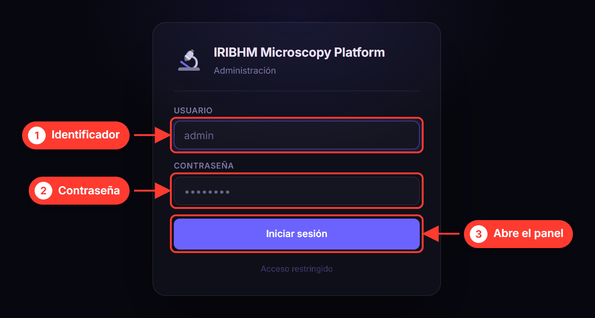

| | |
|---|---|
| **1** | Su usuario (`admin` por defecto). |
| **2** | Su contraseña. |
| **3** | Abre el panel. La tecla **Intro** hace lo mismo. |

Si las credenciales son incorrectas, aparece un mensaje rojo encima de los campos. No hay bloqueo tras varios intentos: simplemente vuelva a intentarlo.

**Lo que ocurre después:** el navegador recibe un testigo de sesión que lo mantiene conectado. Ese testigo **no** es legible por las páginas del sitio, y desaparece cuando cierra la sesión o cuando el servidor se reinicia. Si vuelve al día siguiente, probablemente tendrá que iniciar sesión de nuevo — es normal.

> ⚠️ **La contraseña no está escrita en ningún sitio del servidor.** Se transforma en una huella irreversible (véase §7). Nadie — ni siquiera el proveedor de alojamiento — puede recuperarla. **Si la pierde**, la única salida se describe en el [Anexo B](#anexo-b--si-algo-va-mal).

---

# 2. Un recorrido general

Una vez dentro, la pantalla se divide en tres zonas que nunca cambian.

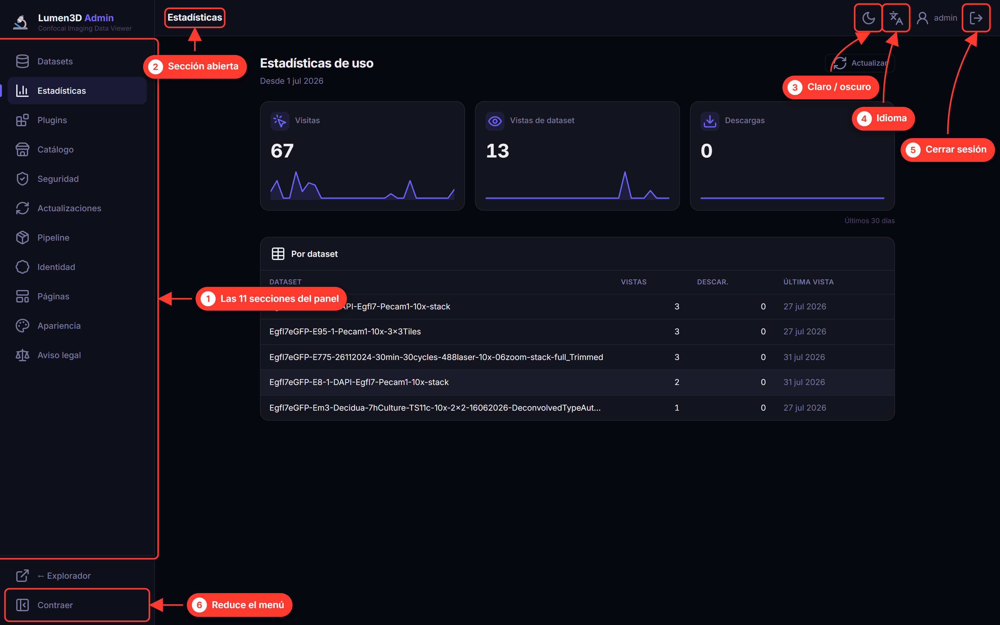

| | |
|---|---|
| **1** | **El menú de la izquierda** — las 12 secciones del panel. Es la columna vertebral: cada capítulo de esta guía corresponde a una de estas entradas. |
| **2** | **El título** recuerda qué sección está abierta. |
| **3** | **Tema claro / oscuro** — cambia solo *su* vista del panel, no el sitio público. |
| **4** | **Idioma** del panel (español, inglés, francés, neerlandés). |
| **5** | **Cerrar sesión.** |
| **6** | **Contraer** — pliega el menú a solo iconos para ganar espacio. |

Al final del menú, el enlace **«← Explorador»** abre el sitio público en una pestaña nueva: práctico para comprobar el efecto de un cambio.

## 2.1. La barra superior en detalle

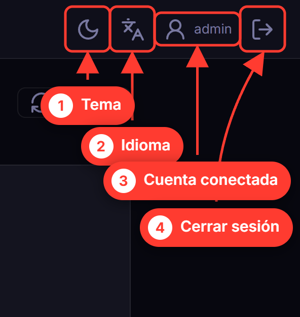

## 2.2. El indicador «Cambios sin guardar»

En cuanto modifica algo sin guardarlo, aparece arriba una marca naranja:

> ● Cambios sin guardar

Es un **recordatorio**, no un error. Mientras esté ahí, sus cambios solo los ve usted. Si abandona la página, se pierden.

## 2.3. Las pestañas de un vistazo

| Pestaña | Para qué sirve | Frecuencia |
|---|---|---|
| **Datasets** | Nombrar, describir, mostrar u ocultar cada conjunto de datos | Habitual |
| **Estadísticas** | Ver el uso del sitio | Ocasional |
| **Plugins** | Activar, desactivar y actualizar las funciones del visor 3D | Raro |
| **Catálogo** | Instalar, actualizar o desinstalar funciones | Raro |
| **Seguridad** | Cambiar la contraseña | Raro |
| **Actualizaciones** | Instalar una nueva versión del sitio, y actualizar los plugins | Ocasional |
| **Pipeline** | Descargar la herramienta que prepara los nuevos datos | Raro |
| **Documentación** | Leer y descargar las guías publicadas para la plataforma | Ocasional |
| **Identidad** | Nombre del sitio, vocabulario, pie de página, menú | Raro |
| **Páginas** | Modificar el contenido de las páginas (inicio, acerca de…) | Habitual |
| **Apariencia** | Colores y tipografía del sitio público | Raro |
| **Aviso legal** | Texto legal | Raro |

---

# 3. Datasets

Es la pestaña que abrirá con más frecuencia. Sirve para **describir** los conjuntos de datos y **elegir cuáles son visibles** para el público.

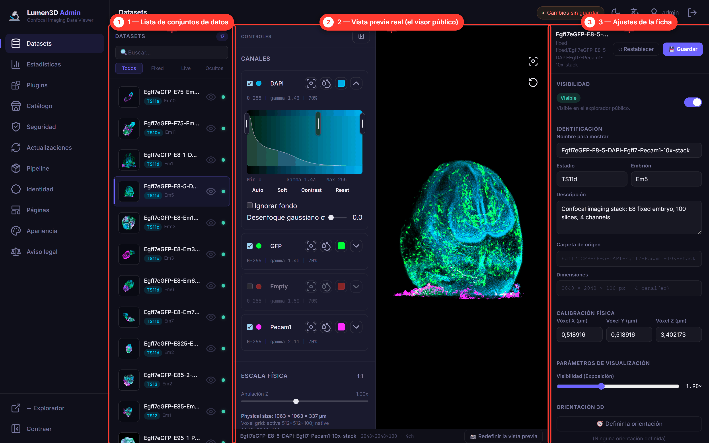

La pantalla se divide en **tres columnas**:

1. **la lista** de todos los conjuntos de datos;
2. **la vista previa** — el visor real, exactamente como lo ve un visitante;
3. **los ajustes** del conjunto seleccionado.

> ### 📌 ¿Cómo llega aquí un conjunto de datos?
>
> Usted **no** crea un conjunto de datos desde el panel. El proceso es:
>
> 1. las imágenes en bruto del microscopio se procesan con la herramienta de preparación (véase [§9](#9-pipeline--preparar-nuevos-datos));
> 2. la carpeta resultante se copia en la carpeta `DATA_WEB` del servidor (por FTP, o por quien gestione el servidor);
> 3. **aparece de inmediato en esta lista** — no hay nada que regenerar, ningún botón que pulsar.
>
> El panel sirve después para darle un nombre presentable y decidir si es público.

## 3.1. La columna izquierda: encontrar un conjunto de datos

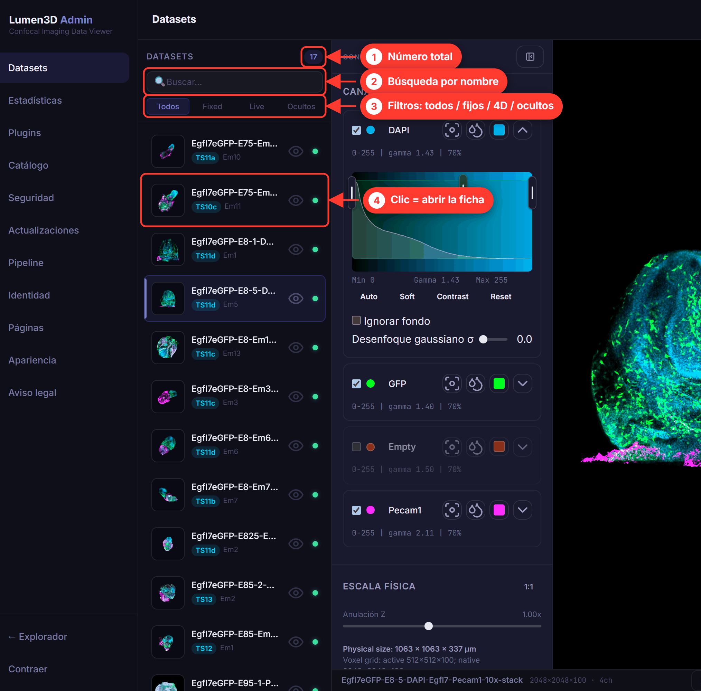

| | |
|---|---|
| **1** | El número total de conjuntos de datos en el servidor. |
| **2** | **Búsqueda** — escriba parte de un nombre y la lista se filtra al momento. |
| **3** | **Filtros** — `Todos`, `Fixed` (volúmenes fijos), `Live` (series temporales 4D), `Ocultos` (los que no son públicos). |
| **4** | **Haga clic en una miniatura** para abrir su ficha. |

En cada fila, a la derecha del nombre:

- **el ojo** indica si el conjunto es visible para el público;
- **el punto verde** significa que sus archivos están completos y son legibles.

## 3.2. La columna central: la vista previa

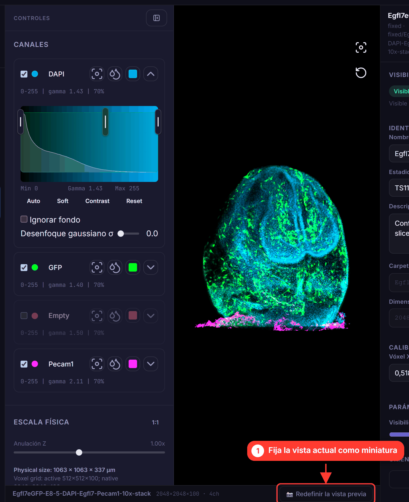

No es una imagen fija: es **el visor 3D real**, cargado dentro del panel. Puede girar el volumen, cambiar los colores de los canales, ajustar el contraste — exactamente como un visitante.

> ### 📌 Esta vista previa es más que una vista previa
>
> Algunos ajustes hechos aquí **los recoge el panel** y se guardan con el conjunto de datos cuando hace clic en **Guardar**:
>
> - los **ajustes de canales** — nombre, color, mín / máx / gamma, mostrado u oculto (véase §3.4);
> - la **luminosidad** (exposición);
> - la **orientación** si la está definiendo en ese momento (véase §3.5).
>
> Todo lo demás — posición de la cámara, modo de renderizado, calidad, fondo, plano de corte — sirve solo para mirar y **no se conserva**.
>
> Por eso la marca **«Cambios sin guardar»** puede aparecer simplemente porque ha tocado un control deslizante en la vista previa. Si no quería cambiar nada, haga clic en **↺ Restablecer** en lugar de Guardar.

El botón **📸 Redefinir la vista previa** (abajo a la derecha) **congela la vista actual** y la usa como miniatura del conjunto en el explorador público. Oriente el volumen como quiera que aparezca y luego haga clic.

Cargar un volumen grande tarda unos segundos — es normal, los datos ocupan varios gigabytes y se descargan por trozos.

## 3.3. La columna derecha: los ajustes

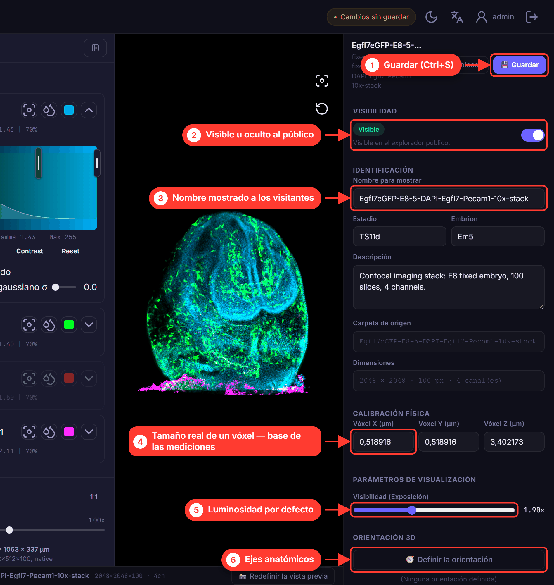

| | |
|---|---|
| **1** | **Guardar** — registra sus cambios. Atajo: **Ctrl + S**. El botón **↺ Restablecer** descarta los cambios sin guardar. |
| **2** | **Visibilidad** — el interruptor decide si el conjunto aparece en el explorador público. |
| **3** | **Nombre para mostrar** — el nombre que verán los visitantes. |
| **4** | **Calibración física** — el tamaño real de un vóxel en micrómetros. |
| **5** | **Visibilidad (Exposición)** — la luminosidad por defecto al abrir. |
| **6** | **Orientación 3D** — véase §3.5. |

### Cada campo en detalle

**Visibilidad**
El interruptor de arriba. `Visible` = todo el mundo puede acceder desde el explorador. Oculto = permanece en el servidor y sigue accesible si se conoce su dirección exacta, pero ya no aparece en las listas. Útil para un conjunto que aún se está revisando, o vinculado a un artículo todavía no publicado.

**Identificación**

- **Nombre para mostrar** — sustituya el nombre técnico de la carpeta por algo legible. Es el nombre que aparece en todo el sitio público.
- **Estadio** y **Espécimen** — las dos etiquetas que sirven para filtrar en el explorador. Se rellenan automáticamente a partir del nombre de la carpeta; corríjalas si la detección se ha equivocado.
- **Descripción** — texto libre mostrado en la ficha pública. Escriba lo que ayudaría a un colega: marcadores usados, condiciones, particularidades.
- **Carpeta de origen** y **Dimensiones** — en gris, **no modificables**. Se leen de los archivos.

**Calibración física — ⚠️ el campo más importante**
Los tres valores `Vóxel X / Y / Z` dan el tamaño real de un punto de la imagen, en micrómetros. **Todas las mediciones que hagan los visitantes dependen de ellos**: la herramienta de distancia, la barra de escala, las dimensiones mostradas.

Estos valores se leen automáticamente del archivo del microscopio y normalmente son correctos. **Modifíquelos solo si tiene una razón concreta para creer que están mal** — un valor erróneo invalida en silencio todas las mediciones publicadas a partir de ese conjunto.

Tenga en cuenta que `Vóxel Z` suele ser bastante mayor que X e Y (por ejemplo `0,52 / 0,52 / 3,40`): es normal, la separación entre dos cortes es mayor que la resolución en el plano.

**Parámetros de visualización**
El control **Visibilidad (Exposición)** ajusta la luminosidad al abrir. Si un conjunto parece demasiado oscuro a primera vista, súbala. Los visitantes siempre pueden ajustarla después por su cuenta.

## 3.4. Configurar los canales

Un conjunto de datos de microscopía contiene varios **canales** — uno por marcador fluorescente. Aquí decide qué aspecto tienen **por defecto**, es decir, lo que verá un visitante que abra el conjunto sin tocar nada.

Estos ajustes se hacen en la **barra lateral de la vista previa** (columna central), y se guardan con el resto de la ficha cuando hace clic en **💾 Guardar**.

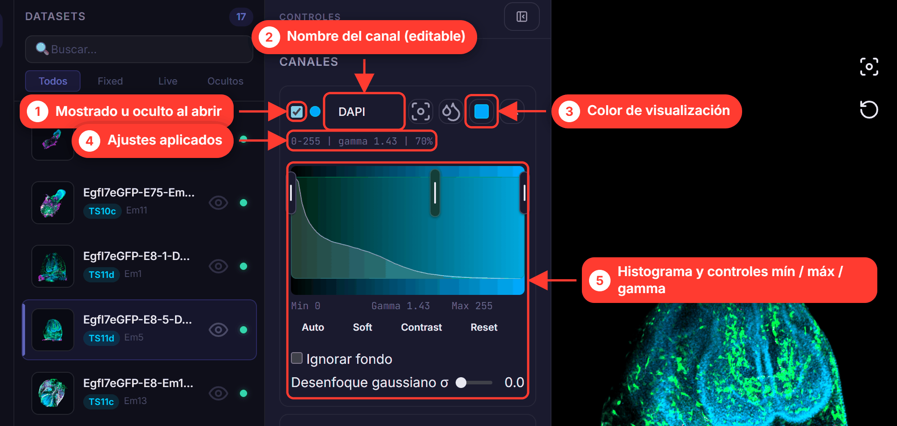

| | |
|---|---|
| **1** | **La casilla** — ¿el canal se muestra u oculta al abrir? |
| **2** | **El nombre del canal** — haga clic dentro y escriba para cambiarlo. |
| **3** | **El color de visualización** del canal. |
| **4** | El **resumen** de los ajustes aplicados (mín–máx, gamma, opacidad). |
| **5** | El **panel detallado**: histograma y controles. Se abre con la flecha ⌄ a la derecha de la fila. |

### Lo que puede ajustar

**El nombre.** Los canales suelen llegar como `Channel 1`, `Channel 2`… Sustitúyalos por el marcador real — `DAPI`, `GFP`, `Pecam1`. Ese es el nombre que verán los visitantes.

**El color.** El botón de color abre una paleta. Elija colores que separen bien los marcadores.

> 💡 Algunos colores se asignan automáticamente según el nombre del canal: un canal llamado `DAPI` se vuelve azul, `GFP` verde, `Pecam1` magenta. Renombrar bien un canal suele bastar para obtener el color correcto.

**Mostrado u oculto.** Desmarque un canal poco informativo (un canal vacío, uno de autofluorescencia): sigue disponible, pero el visitante no lo ve de entrada. Es el ajuste más útil para una primera impresión limpia.

**Mín / máx / gamma.** En el panel detallado, el histograma muestra el reparto de intensidades y los tres tiradores ajustan el umbral bajo, el umbral alto y la gamma. Los botones **Auto**, **Suave** y **Contraste** ofrecen ajustes ya hechos; **Restablecer** vuelve al inicio.

> ⚠️ **Estos ajustes son cosméticos, no destructivos.** Cambian cómo se *muestran* los datos, nunca los datos en sí. Un visitante puede reajustarlo todo por su cuenta; usted solo define el punto de partida.

**No olvide hacer clic en 💾 Guardar** en la columna derecha: sin eso, sus ajustes de canales se pierden al cambiar de conjunto.

## 3.5. Definir la orientación anatómica

El botón **🧭 Definir la orientación** sirve para indicar dónde están el frente, la parte superior y la derecha del espécimen. Una vez definida, los visitantes ven un marcador de tres ejes en el visor.

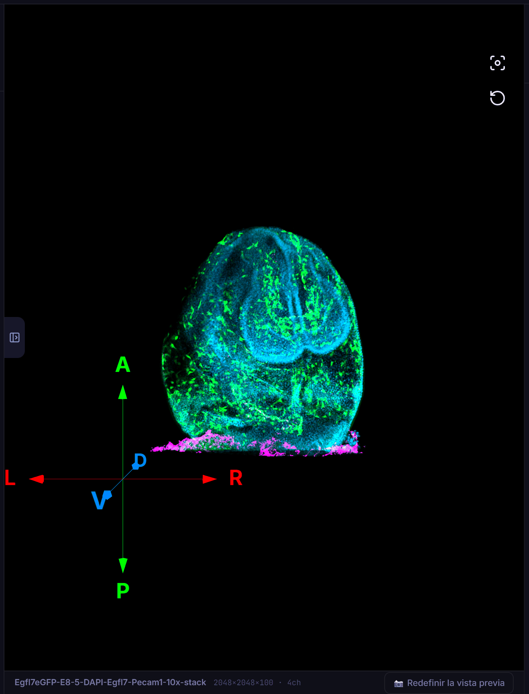

Aparecen tres ejes de color sobre el volumen:

| Eje | Color | Significado |
|---|---|---|
| **A / P** | verde | Anterior ↔ Posterior (delante / detrás) |
| **D / V** | azul | Dorsal ↔ Ventral (espalda / vientre) |
| **L / R** | rojo | Izquierda ↔ Derecha |

**Cómo hacerlo:**

1. haga clic en **🧭 Definir la orientación**;
2. gire el volumen en la vista previa hasta que el espécimen quede bien alineado con los ejes mostrados;
3. haga clic en **💾 Guardar** en la parte superior de la columna derecha.

El botón se convierte en **✕ Cancelar la orientación** mientras trabaja: permite salir sin cambiar nada.

## 3.6. Cuando no hay ningún conjunto seleccionado

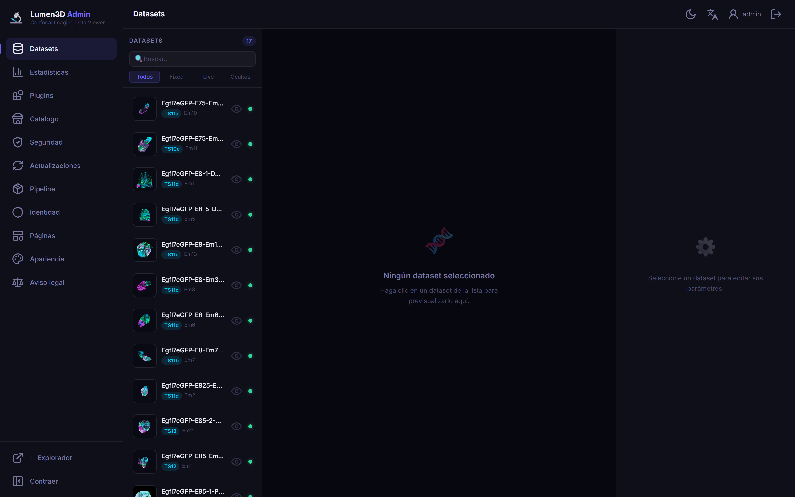

Es la pantalla de bienvenida de la pestaña. Basta con hacer clic en una miniatura de la izquierda.

---

# 4. Estadísticas — quién consulta qué

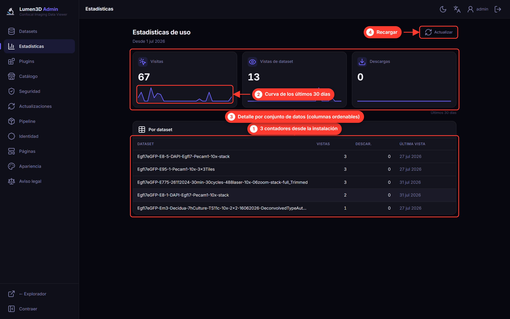

| | |
|---|---|
| **1** | Tres contadores acumulados desde la instalación. |
| **2** | La curva pequeña muestra los **últimos 30 días**. |
| **3** | El detalle **por conjunto de datos**. Haga clic en una cabecera de columna para ordenar. |
| **4** | **Actualizar** — vuelve a cargar las cifras. |

**Lo que cuentan los tres contadores:**

- **Visitas** — cuántas veces se ha abierto una página del sitio.
- **Vistas de dataset** — cuántas veces se ha abierto un conjunto en el visor. Es el indicador más elocuente.
- **Descargas** — cuántos archivos se han recogido del centro de descargas.

La tabla inferior indica, para cada conjunto, el número de vistas, de descargas y la fecha de la última consulta.

> 🔒 **No se recopila ningún dato personal.** Son simples contadores. No hay cookie de seguimiento, ni dirección IP registrada, ni servicio externo (nada de Google Analytics). Nada sale del servidor.

---

# 5. Plugins — las funciones del visor

Es el capítulo más técnico, pero también el que da más control. Tómese el tiempo de leer §5.1: el resto se deduce de ahí.

## 5.1. ¿Qué es un plugin aquí?

El visor 3D está construido deliberadamente como un **núcleo mínimo + módulos**. Casi todo lo que puede hacer un visitante — medir una distancia, hacer una captura de pantalla, ajustar el histograma de un canal, elegir un modo de renderizado — lo aporta un **plugin**, es decir, un pequeño módulo independiente.

La ventaja: puede **quitar lo que su laboratorio no usa** y **añadir** nuevas funciones más adelante sin tocar el resto del sitio.

Cada plugin ocupa una de las **tres ubicaciones** posibles:

| Ubicación | Dónde lo ve el visitante | Ejemplos |
|---|---|---|
| **Herramientas** (barra de herramientas) | Los botones de la parte superior del visor | Medición de distancia, captura de pantalla, modo presentación, centro de descargas |
| **Canales** (por canal) | Los controles bajo cada canal de fluorescencia, en la barra lateral | Histograma, desenfoque gaussiano |
| **Modos de renderizado** (shaders) | La lista que elige cómo se dibuja el volumen | Fluorescencia, Estructura (DVR) |

## 5.2. La pantalla

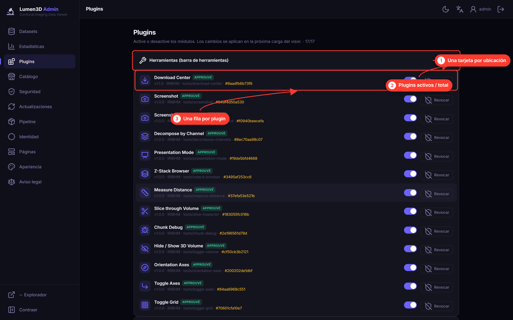

| | |
|---|---|
| **1** | Una tarjeta por ubicación (Herramientas, Canales, Modos de renderizado). |
| **2** | El contador `activos / total` de esa categoría. |
| **3** | Una fila por plugin. |

Ampliación de una fila:

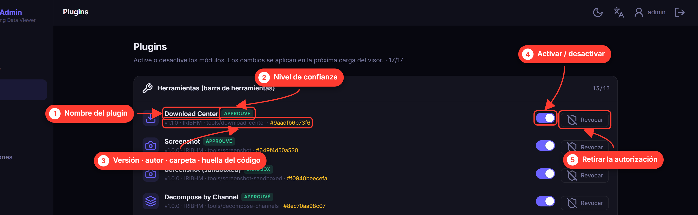

| | |
|---|---|
| **1** | El **nombre** del plugin. |
| **2** | Su **nivel de confianza** (véase §5.4). |
| **3** | Versión · autor · carpeta · **huella** del código. |
| **4** | El interruptor que **activa o desactiva** el plugin. |
| **5** | **Revocar** — retira la autorización de ejecución (véase §5.5). Solo aparece en un plugin que **usted** ha aprobado (etiqueta `aprobado` o `sandbox`): un plugin `integrado` no tiene ese botón. |

## 5.3. Activar o desactivar un plugin

Basta con mover el interruptor. El cambio se guarda de inmediato (aparece una confirmación breve abajo) y surte efecto **la próxima vez que se cargue el visor** — pida a un visitante que recargue su página, o recargue la vista previa de la pestaña Datasets.

Desactivar un plugin no lo borra: permanece en el servidor y puede volver a activarlo en cualquier momento.

> ⚠️ **El interruptor no siempre está.** Un plugin **no fiable** no lo tiene en absoluto — antes hay que aprobarlo (§5.5). Un plugin **protegido** (el último modo de renderizado activo) o **incompatible** sí lo tiene, pero atenuado.

> 🔒 **Existe una única protección: siempre debe quedar al menos un modo de renderizado activo.** Si intenta desactivar el último, el panel se niega y muestra «Al menos un modo de renderizado debe permanecer activo». Sin modo de renderizado, el visor no tendría con qué dibujar el volumen.

## 5.4. Los niveles de confianza — por qué existen

Este es el punto importante del capítulo.

Un plugin es **código real que se ejecuta en el navegador de sus visitantes**. Un plugin malicioso podría mostrar cualquier cosa, o secuestrar lo que hace la página. La plataforma adopta por tanto la postura contraria a la habitual: **por defecto, un plugin no tiene permiso para ejecutarse**. Usted, el administrador, debe autorizarlo explícitamente.

Cada plugin lleva por tanto una etiqueta:

| Etiqueta | Significado | Lo que implica |
|---|---|---|
| **`integrado`** | Viene con la versión oficial del sitio, y su código coincide exactamente con lo publicado | De confianza. Nada que hacer. |
| **`aprobado`** | Usted lo ha autorizado a ejecutarse normalmente en la página | De confianza porque **usted** lo ha decidido. |
| **`sandbox`** | Autorizado, pero **encerrado en un entorno aislado**: se ejecuta sin acceso al resto de la página ni al panel | El modo más seguro. |
| **`dev`** | Solo máquina de desarrollo | No aparece nunca en un sitio en producción. |
| **`no fiable`** | **Rechazado.** El plugin no se carga en absoluto | Véase §5.5. |

**La huella** (el código del tipo `#06c7945439b8` mostrado bajo cada nombre) es una firma del contenido exacto de los archivos. Su autorización está **ligada a esa huella concreta**. Si alguien modifica aunque sea un solo carácter del plugin, la huella cambia, la autorización caduca y el plugin vuelve automáticamente a **no fiable**. Eso es lo que impide que un plugin aprobado se sustituya en silencio por otra cosa.

## 5.5. Aprobar un plugin no fiable

Verá este caso si alguien deja un plugin directamente en el servidor (por FTP, por ejemplo) en lugar de pasar por el Catálogo.

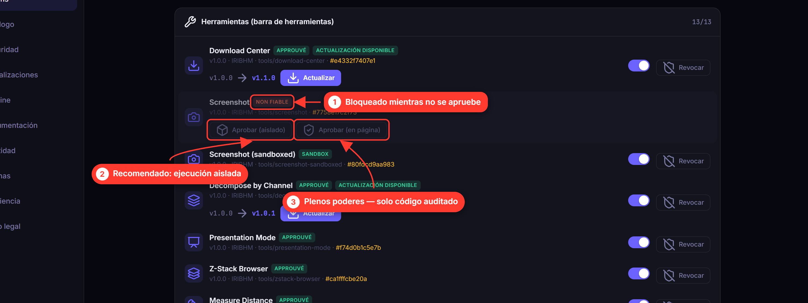

| | |
|---|---|
| **1** | La etiqueta roja **NO FIABLE**. Mientras esté ahí, el plugin **no** se carga — para los visitantes es como si no existiera. |
| **2** | **Aprobar (aislado)** — el plugin se ejecuta aislado. **Es la opción recomendada.** |
| **3** | **Aprobar (en página)** — el plugin se ejecuta con todos los privilegios de la página. |

**El procedimiento, paso a paso:**

1. haga clic en uno de los dos botones;
2. una ventana resume lo que va a aprobar y muestra la **huella** del código;
3. el panel le pide que **vuelva a escribir su contraseña de administrador**;
4. el plugin se activa la próxima vez que se cargue el visor.

> ❓ **¿Por qué volver a pedir la contraseña?**
> Porque aprobar un plugin es la única acción que permite ejecutar código externo. Aunque alguien se sentara ante su pantalla mientras usted está conectado, no podría aprobar un plugin sin conocer además su contraseña.

> ⚠️ **¿Cuándo elegir «en página» en lugar de «aislado»?**
> Casi nunca, salvo que haya leído el código usted mismo o venga de alguien de confianza de su equipo. Tenga en cuenta que los plugins de tipo **canal** y **modo de renderizado** no pueden aislarse técnicamente: deben comunicarse directamente con la tarjeta gráfica. El listón es por tanto más alto para ellos.

**Retirar una autorización:** el botón **Revocar** en la fila del plugin. Vuelve a ser no fiable de inmediato y deja de cargarse.

## 5.6. Actualizar un plugin

Desde esta misma pestaña, sin pasar por el Catálogo.

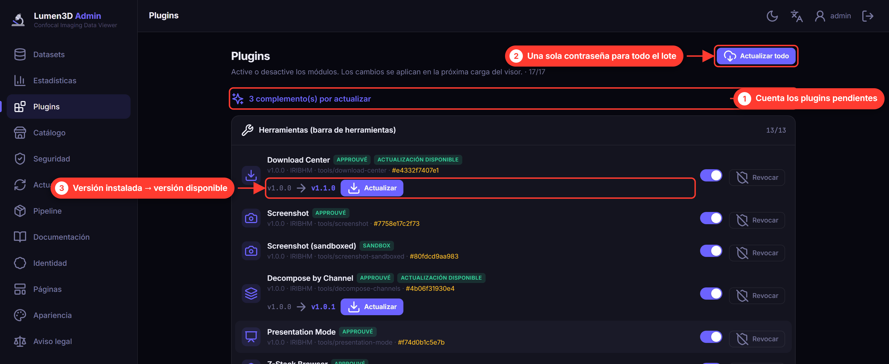

| | |
|---|---|
| **1** | El **aviso** cuenta los plugins afectados. Solo aparece si hay al menos uno. |
| **2** | **Actualizar todo** — solo aparece a partir de dos plugins. Una sola contraseña cubre el lote. |
| **3** | En la fila del plugin: la etiqueta **actualización disponible**, el trayecto `v1.0.0 → v1.1.0` y el botón. |

> 📌 **El botón solo aparece si se cumplen las dos condiciones**: existe una versión más reciente **y** esta se declara compatible con su versión del sitio. Si la nueva versión exige una plataforma más reciente, verá la razón en lugar del botón — actualice antes el sitio (§8).

Como en una instalación, el panel le pide su contraseña, descarga, verifica y sustituye. **La copia que funciona se aparta, no se borra**: si algo falla después de ese punto, se vuelve a poner en su sitio. Una actualización fallida nunca le deja con menos de lo que tenía.

> 💡 El mismo botón existe en el **Catálogo** (§6.2) y en **Actualizaciones** (§8.4). Las tres pestañas leen la misma fuente, así que no pueden contradecirse.

## 5.7. Los plugins que ofrece el Catálogo

Estos plugins **no** vienen con el sitio: se instalan bajo demanda, desde el asistente de primera instalación (paso 5) o más tarde desde el Catálogo (§6). Una instalación nueva en la que se hubiera desmarcado todo no tendría ninguno.

| Plugin | Ubicación | Qué aporta al visitante |
|---|---|---|
| **Fluorescencia** | Renderizado | El renderizado por defecto: cada canal emite su color, como en un microscopio de fluorescencia |
| **Estructura (DVR)** | Renderizado | Un renderizado volumétrico con profundidad y sombreado, que resalta mejor las formas |
| **Histogram Controls** | Canal | El histograma de intensidad + los controles mín / máx / gamma |
| **Gaussian Filter** | Canal | Un control de desenfoque para suavizar el ruido de un canal |
| **Measure Distance** | Herramienta | Hacer clic en dos puntos del volumen para obtener la distancia real en µm |
| **Slice through Volume** | Herramienta | Un plano de corte orientable libremente a través del volumen |
| **Z-Stack Browser** | Herramienta | Recorrer los cortes uno a uno, como una pila de imágenes |
| **Decompose by Channel** | Herramienta | Mostrar los canales uno al lado del otro en vez de superpuestos |
| **Download Center** | Herramienta | Recuperar los archivos, mediciones, metadatos y exportaciones del conjunto |
| **Screenshot** | Herramienta | Capturar la vista 3D como imagen PNG |
| **Presentation Mode** | Herramienta | Pantalla completa sin interfaz, para proyectar |
| **Orientation Axes** | Herramienta | El marcador anatómico A/P · D/V · L/R (véase §3.5) |
| **Toggle Grid / Axes / Volume** | Herramientas | Mostrar u ocultar la rejilla, los ejes, el volumen |
| **Screenshot (sandboxed)** | Herramienta | La misma captura de pantalla, pero ejecutada en un entorno aislado — el ejemplo de referencia de un plugin aislado |
| **Chunk Debug** | Herramienta | Herramienta de diagnóstico técnico. **Se puede desactivar sin riesgo** en un sitio en producción |

---

# 6. Catálogo — instalar nuevos plugins

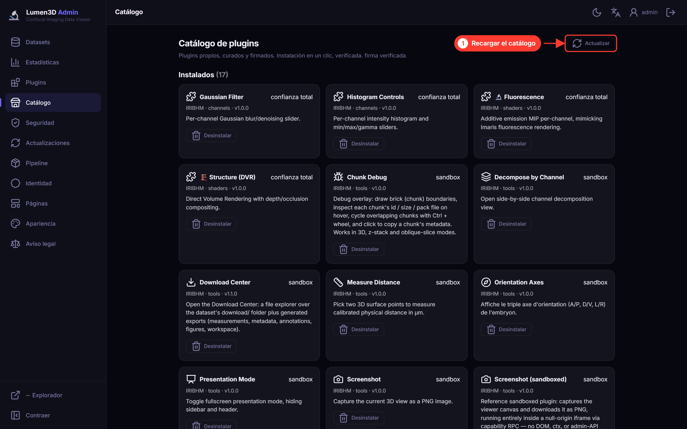

El Catálogo funciona como una tienda de aplicaciones: enumera los plugins oficiales disponibles y usted los instala con un clic.

Los plugins se reparten en cuatro secciones. **Para actualizar** aparece primero cuando hay alguno — una actualización urge, un plugin ya instalado no — y luego **Instalados**, **Disponibles** y, en su caso, **Incompatibles**.

## 6.1. Instalar un plugin

1. localice la tarjeta del plugin en **Disponibles**;
2. haga clic en **⬇ Instalar**;
3. **vuelva a escribir su contraseña** de administrador;
4. el plugin se descarga, se verifica, se instala y se **aprueba automáticamente** — no tiene que hacer nada en la pestaña Plugins.

Durante la instalación, el servidor comprueba que el archivo descargado coincide, bit a bit, con lo que anuncia el catálogo. Si detecta la menor diferencia, **la instalación se cancela** en vez de instalar algo dudoso.

En la parte superior, una mención indica el estado del catálogo: **«firma verificada»** (el catálogo está autenticado) o **«sin firmar»** (no hay ninguna clave de firma configurada en este servidor — solo se comprueba la huella sha256).

## 6.2. Actualizar

Un plugin instalado del que existe una versión más reciente **y** compatible sale de «Instalados» y pasa a **Para actualizar**, en la parte superior. Su tarjeta muestra entonces `v1.0.0 → v1.1.0` en lugar de la sola versión del catálogo, y un botón **Actualizar** se coloca junto a **Desinstalar**.

El botón **Actualizar todo**, arriba, trata el lote con una sola contraseña.

Es la misma acción que en las pestañas **Plugins** (§5.6) y **Actualizaciones** (§8.4) — hágala desde donde esté.

## 6.3. Desinstalar

El botón **🗑 Desinstalar** en la tarjeta del plugin, y luego confirmar. En un plugin que tiene una actualización pendiente, este botón va precedido de **Actualizar**: compruebe en cuál de los dos hace clic. Los archivos se retiran del servidor. Siempre puede reinstalarlo después desde el Catálogo.

Solo hay un caso en que se deniegue: si es el **último modo de renderizado** instalado (misma razón que en §5.3).

## 6.4. Las etiquetas de las tarjetas

| Etiqueta | Significado |
|---|---|
| **`sandbox`** | Este plugin se ejecutará aislado. Es el caso de los plugins de la barra de herramientas. |
| **`confianza total`** | Este plugin se ejecutará con todos los derechos de la página. Inevitable para los modos de renderizado y los controles de canal, que gobiernan directamente la tarjeta gráfica. |
| **`actualización disponible`** | Existe una versión más reciente **y** es compatible con su sitio. La tarjeta muestra `v1.0.0 → v1.1.0` y un botón **Actualizar**. |
| **`incompatible`** | Solo aparece en un plugin **no instalado**: requiere una versión del sitio más reciente (o más antigua) que la suya, y el botón de instalación está atenuado. Haga una actualización (véase §8) y volverá a poder instalarse. Un plugin **ya instalado** nunca lleva esta etiqueta — el que funciona en su sitio funciona; solo su versión siguiente puede tener que esperar. |

---

# 7. Seguridad — contraseña y permisos

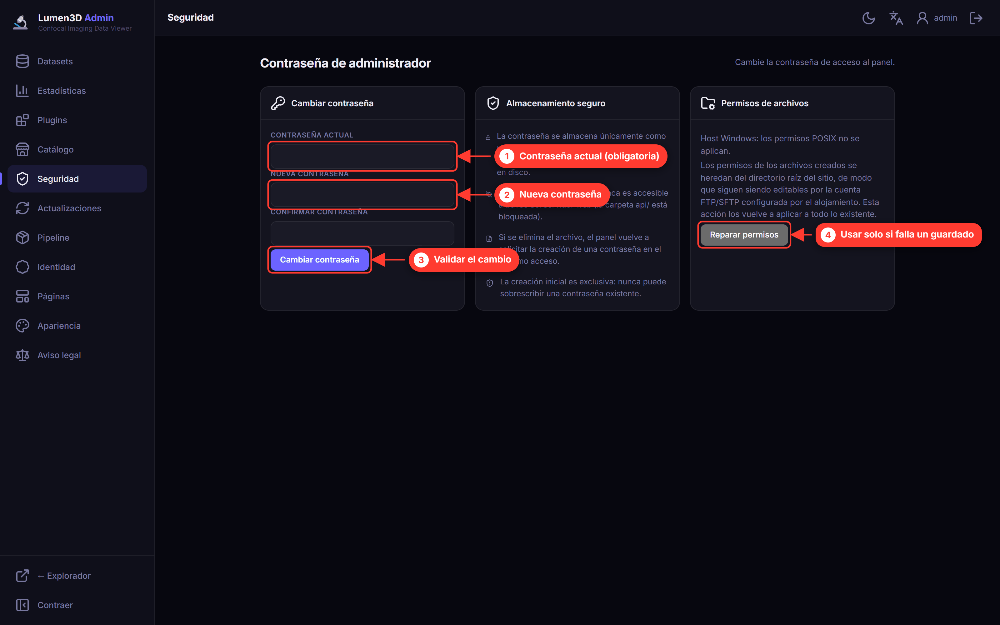

| | |
|---|---|
| **1** | Su contraseña **actual** — obligatoria. |
| **2** | La nueva contraseña, escrita dos veces. |
| **3** | Validar. |
| **4** | **Reparar permisos** — solo debe usarse si hay un problema (§7.3). |

## 7.1. Cambiar la contraseña

Rellene los tres campos y haga clic en **Cambiar contraseña**. Hay que conocer la antigua: eso impide que alguien que encuentre su sesión abierta lo deje fuera.

**Sigue conectado** tras el cambio. Sus otras sesiones, en cambio, no se cierran automáticamente.

> 💡 **Consejo para elegir una contraseña.** El panel acepta técnicamente 4 caracteres, pero apunte más bien a **12 o más**. Una frase fácil de recordar vale más que una palabra complicada: `microscopio-embrion-2026` es mucho más sólida que `M1cr0!`.

## 7.2. Cómo se almacena la contraseña

La tarjeta **Almacenamiento seguro** resume las garantías, que merece la pena entender:

- **La contraseña nunca se escribe en claro.** El servidor solo guarda una huella irreversible (un método estándar: PBKDF2 con sal). Desde esa huella no se puede volver a la contraseña.
- **El archivo de credenciales nunca lo sirve el sitio.** Aunque escriba su dirección exacta en un navegador, obtendrá un error.
- **Si se borra el archivo**, el panel vuelve a proponer crear una contraseña en el siguiente acceso. Es la salida de emergencia si la olvida (véase el [Anexo B](#anexo-b--si-algo-va-mal)).
- **La creación inicial es exclusiva: nunca puede sobrescribir una contraseña existente.** Nadie puede «reinstalar» por encima para dejarlo fuera.

## 7.3. Reparar los permisos

Esta tarjeta solo es útil en algunos alojamientos compartidos, donde el sitio se ejecuta bajo una cuenta de sistema distinta de la del FTP. Resultado: archivos creados por el sitio se vuelven ilegibles o no modificables.

**Síntoma:** un guardado falla sin motivo aparente en otra pestaña.

Solo en ese caso, haga clic en **Reparar permisos**. La operación es inofensiva y vuelve a aplicar los derechos de acceso correctos a todos los archivos. Un mensaje indica cuántas entradas se han corregido.

En un servidor Windows, la tarjeta indica simplemente que los permisos POSIX no se aplican — es normal, no hay nada que hacer.

---

# 8. Actualizaciones — hacer evolucionar el sitio

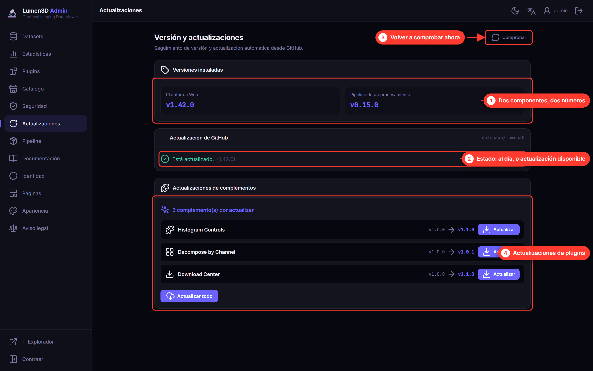

| | |
|---|---|
| **1** | La versión instalada de la plataforma. |
| **2** | El estado: *al día*, o *actualización disponible*. |
| **3** | **Comprobar** — repite la búsqueda de inmediato. |

Se muestran dos números de versión — son dos componentes independientes:

- **Plataforma Web** — el sitio en sí. **Es el que cuenta.**
- **Pipeline de preprocesamiento** — la herramienta de preparación de datos (véase §9). Evoluciona a su propio ritmo: un número menor que el del sitio no tiene nada de anormal.

Una línea cuyo valor se desconoce no se muestra en absoluto, en vez de mostrarse vacía.

## 8.1. Lanzar una actualización

Cuando existe una nueva versión, se muestran las **notas de la versión**: léalas, describen lo que cambia.

1. haga clic en **⬇ Actualizar ahora**;
2. **aparece un informe de comprobación** — un paso importante, detallado abajo;
3. haga clic en **✓ Confirmar actualización**;
4. deje que trabaje: va pasando una serie de etapas.

**El informe de comprobación** le indica, antes de instalar nada:

- cuántos plugins seguirán siendo compatibles;
- cuáles quedarán **en cuarentena** porque todavía no funcionan con la nueva versión. No se borran: se reactivan solos en cuanto una actualización los haga compatibles;
- si algo **bloquea** la actualización, en cuyo caso el botón de confirmación no aparece.

**Las etapas que van pasando:** Comprobaciones → Copia de seguridad → Descarga → Integridad → Preparación → Control de arranque → Plan de conmutación → Conmutación → Reinicio del servidor.

El servidor se reinicia al final: **tendrá que volver a iniciar sesión.** Es normal.

## 8.2. Las salvaguardas

La actualización está diseñada para que un fallo no pueda romper el sitio:

- **Antes de nada se hace una copia de seguridad completa.**
- **El archivo descargado se verifica** (huella + firma electrónica del autor) antes de usarse. Un archivo alterado se rechaza.
- **La nueva versión se prueba antes de ponerse en servicio.** Si no arranca, **el sitio vuelve automáticamente a la versión anterior.** Verá entonces el mensaje «restauración automática realizada» — el sitio sigue funcionando, no hay nada que reparar.
- **Sus datos se conservan:** los conjuntos de datos (`DATA_WEB`), sus credenciales, sus estadísticas y sus ajustes de Identidad, Páginas y Apariencia nunca se tocan en una actualización.

## 8.3. Mensajes posibles

| Mensaje | Qué significa |
|---|---|
| **Está actualizado** | Nada que hacer. |
| **Límite de la API de GitHub alcanzado** | Demasiadas comprobaciones en poco tiempo. Reinténtelo en unos minutos. Sin gravedad. |
| **No se pudo contactar con GitHub** | Un problema de red del lado del servidor. Reinténtelo más tarde. |
| **Aún no hay ninguna versión publicada** | Todavía no se ha publicado ninguna versión públicamente. |
| **El almacén de certificados es inutilizable** | Configuración del alojamiento. Comuníqueselo a quien gestione el servidor. |

## 8.4. Actualizar los plugins

Bajo la actualización del sitio, una tarjeta **Actualizaciones de complementos** responde a la misma pregunta para los módulos: «¿qué necesita actualizarse aquí?»

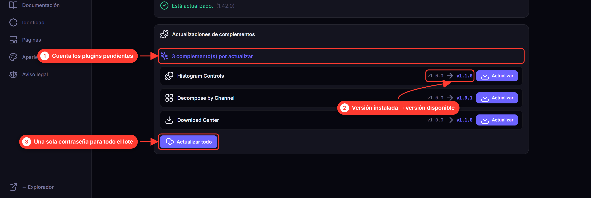

| | |
|---|---|
| **1** | El número de plugins afectados. |
| **2** | Para cada uno: la versión instalada y aquella a la que se pasaría. |
| **3** | **Actualizar todo** — una sola contraseña para el lote. |

Un plugin cuya nueva versión exige una plataforma más reciente aparece en una segunda lista, **«Actualizaciones a la espera de la plataforma»**, con la razón. No se escamotea: hacerlo desaparecer se leería como «nada que actualizar», y buscaría durante mucho tiempo por qué su plugin se queda atrás.

La misma acción existe en **Plugins** (§5.6) y **Catálogo** (§6.2).

---

# 9. Pipeline — preparar nuevos datos

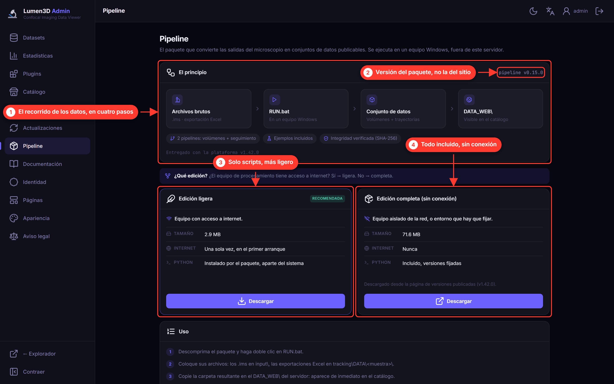

Esta pestaña **no procesa nada** en el servidor. Le hace **descargar un paquete** que ejecutará en un ordenador potente, normalmente la estación de análisis del laboratorio.

**¿Por qué separarlo?** Convertir un volumen de microscopía exige muchísima memoria — cuente con unos **32 GB de RAM** para un volumen de 3789 × 3789 × 178. Ningún servidor web compartido puede con eso.

## 9.1. El principio

La primera tarjeta resume el trayecto de los datos en cuatro etapas:

| | |
|---|---|
| **Archivos brutos** | lo que sale del microscopio: `.ims` para los volúmenes, una exportación Excel para el tracking |
| **`RUN.bat`** | el lanzador, en un equipo Windows |
| **Conjunto de datos** | lo que produce el paquete: volúmenes troceados + trayectorias |
| **`DATA_WEB\`** | la carpeta del servidor donde lo copia — aparece de inmediato en el catálogo |

El paquete contiene **dos pipelines** (volúmenes y tracking), **un ejemplo de entrada para cada uno** — así que se puede usar de inmediato, sin datos reales, para practicar — y un lanzador que **verifica su propia integridad** (SHA-256) antes de ejecutar nada.

> 📌 **Dos números, y es normal.** La cabecera de esta tarjeta muestra `pipeline v0.15.0`: es la versión **del paquete**, no la del sitio. Bajo las características, una línea recuerda con qué versión de la plataforma se entregó. El paquete sigue su propia numeración porque *es* la herramienta de preprocesamiento — no intente hacer coincidir ambas.

## 9.2. Qué edición elegir

Una sola pregunta lo decide: **¿tiene el equipo de procesamiento acceso a internet?**

| | **Edición ligera** *(recomendada)* | **Edición completa** *(sin conexión)* |
|---|---|---|
| Para quién | Equipo con acceso a internet | Equipo aislado de la red, o entorno que hay que fijar |
| Tamaño | unos pocos megabytes | ~70 MB (200 MB descomprimido) |
| Internet | **una sola vez**, en el primer arranque | **nunca** |
| Python | instalado por el paquete, aparte del sistema | incluido, versiones fijadas |

La edición ligera **nunca** modifica el Python ya instalado en el equipo: trabaja en su propio rincón.

> ⚠️ La edición completa va adjunta a la versión publicada en GitHub, no al sitio. Si no está disponible, el panel se lo indica y la edición ligera sigue descargable.

## 9.3. Cómo usarlo

1. descomprima el archivo en la estación de procesamiento;
2. haga doble clic en **`RUN.bat`**;
3. coloque los archivos `.ims` en `input\`, y las exportaciones Excel en `tracking\DATA\<muestra>\`;
4. ⚠️ **el nombre del archivo Excel debe contener el intervalo entre imágenes** (por ejemplo `30min`) — el análisis lee de ahí su base de tiempo;
5. copie la carpeta resultante en el `DATA_WEB\` del servidor;
6. aparece de inmediato en la pestaña Datasets.

---

# 10. Documentación — las guías de la plataforma

Aquí es donde encontrará este documento, y todos los que se publiquen después.

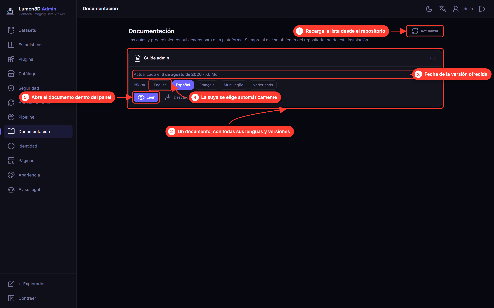

| | |
|---|---|
| **1** | **Actualizar** — vuelve a leer la lista desde el repositorio. |
| **2** | Una tarjeta por documento, con todos sus idiomas y versiones juntos. |
| **3** | La fecha de la versión propuesta, y su tamaño. |
| **4** | Los idiomas disponibles. **El suyo se elige de oficio.** |
| **5** | **Leer** — abre el documento en el panel. Al lado, **Descargar**. |

## 10.1. De dónde vienen estos documentos

**No de esta instalación.** Se publican en el repositorio del proyecto y se recuperan al mostrarlos. Consecuencia útil: una guía corregida le llega **sin actualizar el sitio**.

Consecuencia que también conviene conocer: si el servidor no puede contactar con GitHub, la lista no se muestra — un aviso le dice por qué. No es una avería del sitio, solo de esta lista.

> 💡 La lista se guarda en memoria durante diez minutos. Un documento publicado hace un instante puede por tanto tardar un momento en aparecer: **Actualizar** fuerza la relectura.

## 10.2. Elegir el idioma

Los idiomas disponibles se muestran como botones. El que aparece destacado es el que obtendrá si no toca nada.

La elección se hace en este orden: **su idioma de interfaz**, si no **el inglés**, si no la versión **Multilingüe**, si no el primero disponible. Así nunca tendrá una tarjeta vacía porque falte una traducción.

Hacer clic en otro idioma cambia el documento propuesto, y el historial de versiones lo sigue: cada idioma tiene el suyo.

## 10.3. Las versiones anteriores

Un documento corregido no sustituye al antiguo: se añade. La tarjeta propone siempre **la más reciente**, y un botón **Versiones anteriores** despliega las demás, con su fecha.

Es útil cuando un procedimiento ha cambiado y quiere recuperar lo que estaba escrito entonces.

## 10.4. Leer en el panel

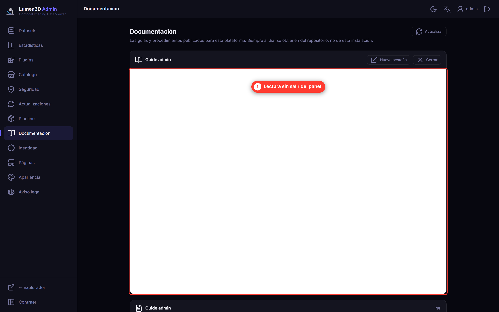

**Leer** muestra el documento en el panel. **Nueva pestaña** lo abre a pantalla completa, **Cerrar** cierra la vista previa.

> 📌 **No todos los formatos se muestran.** Los PDF, las imágenes y el texto se leen en el panel. Los demás formatos — un documento Word, una hoja de cálculo, un archivo comprimido — no tienen botón **Leer**: se descargan. No es un límite de visualización sino una decisión de seguridad, explicada al operador por la ausencia del botón en vez de por un mensaje de error.

## 10.5. Publicar un documento

Reservado a quien gestiona el repositorio, pero conviene saberlo para pedir lo correcto.

Un documento se publica dejando un archivo en la carpeta `DOCS/` del repositorio, con un nombre que sigue una regla estricta:

```
260803 - GUIDE-ADMIN - ES.pdf
└─┬──┘   └────┬────┘   └┬┘
  │           │         └── el idioma
  │           └──────────── el identificador del documento, el mismo de una versión a otra
  └──────────────────────── la fecha, en formato AAMMDD: es el número de versión
```

- **La fecha** ordena las versiones. Se propone la más reciente, las demás siguen accesibles.
- **El identificador** debe seguir siendo **idéntico** de una versión a otra: es lo que hace que dos archivos sean el mismo documento. Si cambia, el panel ve en ellos dos documentos distintos.
- **El idioma** decide lo que verá cada operador.

Un archivo que no siga esta regla no se publica: se **señala como ignorado** al final de la pestaña. Una errata se ve, por tanto, en vez de hacer desaparecer un documento en silencio.

---

# 11. Identidad — el nombre y el vocabulario del sitio

Esta pestaña permite renombrar por completo el sitio, sin tocar código. Es lo que permite que la misma plataforma sirva a un laboratorio de embriología o a un instituto de neurociencias.

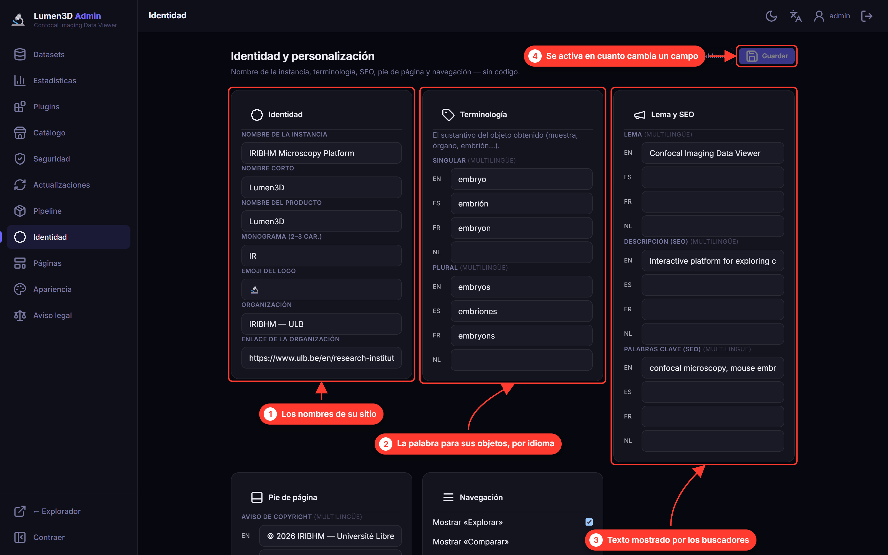

| | |
|---|---|
| **1** | Los nombres de su sitio. |
| **2** | La palabra que designa sus objetos de estudio, **por idioma**. |
| **3** | El texto que muestran los buscadores. |
| **4** | **Guardar** — se activa en cuanto cambia un campo. |

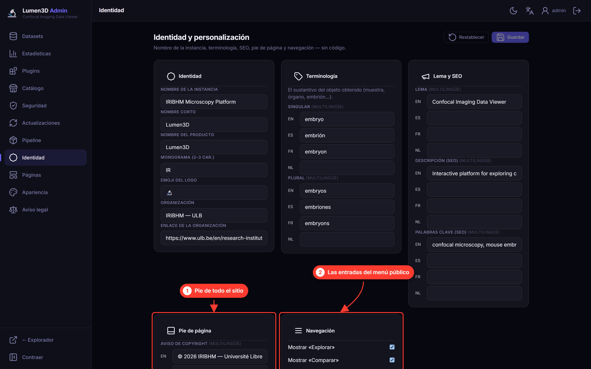

## 11.1. Los campos multilingües

Los campos marcados **(MULTILINGÜE)** muestran una fila por idioma: `EN`, `ES`, `FR`, `NL`.

**Rellene siempre `EN` como mínimo.** Es la versión de respaldo: si un visitante consulta el sitio en español y el campo `ES` está vacío, se muestra el texto en inglés — nunca un hueco.

## 11.2. Tarjeta «Identidad»

| Campo | Para qué sirve | Ejemplo |
|---|---|---|
| **Nombre de la instancia** | El nombre completo, usado en los títulos de página | `IRIBHM Microscopy Platform` |
| **Nombre corto** | Usado donde falta espacio | `Lumen3D` |
| **Nombre del producto** | El nombre del software en los textos | `Lumen3D` |
| **Monograma** | 2–3 letras para el distintivo del logotipo | `IR` |
| **Emoji del logo** | El emoji mostrado junto al nombre | 🔬 |
| **Organización** | Su laboratorio o institución | `IRIBHM — ULB` |
| **Enlace de la organización** | La dirección de su web | `https://…` |

## 11.3. Tarjeta «Terminología» — la más útil

Aquí es donde el sitio se adapta a su campo. Define **la palabra que designa lo que usted captura**, en singular y en plural, en cada idioma.

Esa palabra se **retoma automáticamente en toda la interfaz pública**: títulos, filtros, estadísticas, descripciones. Si escribe `embrión / embriones`, el sitio hablará de embriones. Si escribe `muestra / muestras`, hablará de muestras — en todas partes, sin ningún otro cambio.

## 11.4. Tarjeta «Lema y SEO»

- **Lema** — el subtítulo mostrado bajo el nombre del sitio.
- **Descripción (SEO)** — el resumen que muestran Google y las redes sociales. Dos frases claras bastan.
- **Palabras clave (SEO)** — unos cuantos términos separados por comas.

## 11.5. Tarjeta «Pie de página»

- **Aviso de copyright** — el texto al final de cada página.
- **Enlaces** — los enlaces del pie. **+ Añadir enlace** crea uno (etiqueta + dirección), la cruz retira uno.

## 11.6. Tarjeta «Navegación»

Las casillas deciden qué entradas aparecen en el menú del sitio público: *Explorar*, *Comparar*, *Seguimiento*, *Acerca de*, *Aviso legal*.

Desmarcar una entrada la retira del menú sin borrar la página.

> ⚠️ **Atención con «Aviso legal».** Esa casilla está desmarcada por defecto. Si redacta su aviso legal (§14), acuérdese de volver aquí para hacerlo accesible.

---

# 12. Páginas — el editor visual

Es la función más rica del panel. Permite **modificar el contenido de las páginas como en un programa de maquetación**, sin escribir una línea de código.

## 12.1. Elegir una página

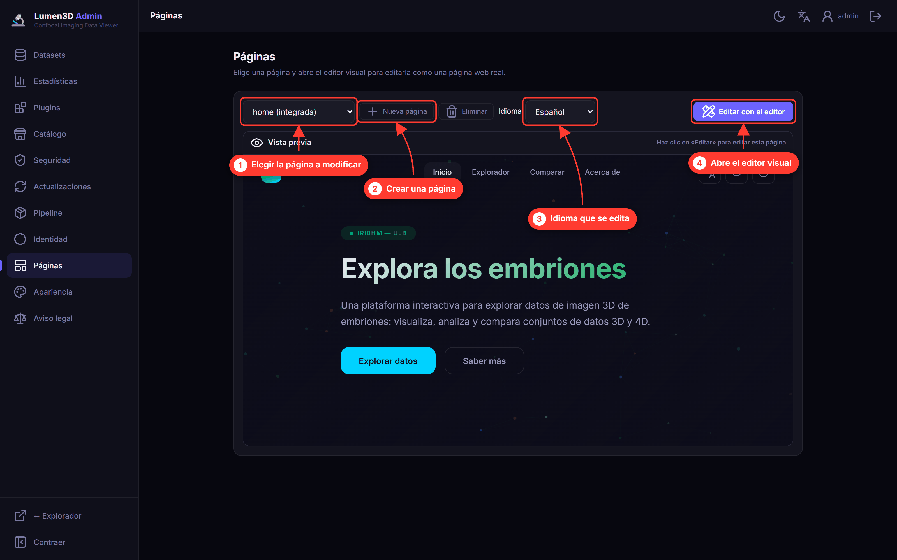

| | |
|---|---|
| **1** | La página que se va a modificar. |
| **2** | **Nueva página** — crea una página adicional. |
| **3** | El **idioma** que está editando. |
| **4** | **Editar con el editor** — abre el editor visual. |

El botón **🗑 Eliminar** borra una página creada por usted. Permanece atenuado en `home` y `about`: esas dos no pueden eliminarse, solo devolverse a su plantilla original desde el editor.

Existen dos páginas de origen: **`home`** y **`about`**. La mención *(integrada)* significa que aún usan la plantilla suministrada: desde su primera publicación, su versión toma el relevo.

## 12.2. El editor

El editor se abre **en su propia pestaña del navegador** para disponer de toda la pantalla.

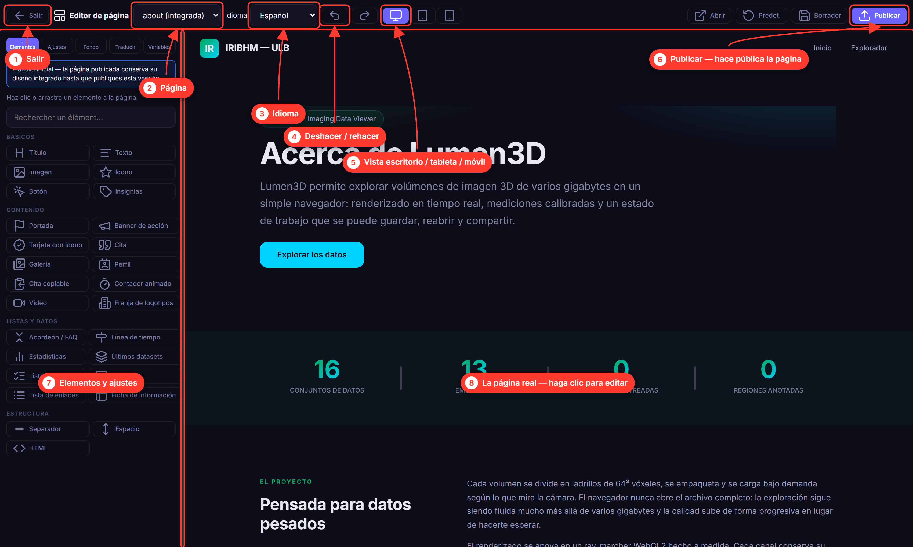

| | |
|---|---|
| **1** | **Salir** — vuelve al panel. |
| **2** | La página que se está editando. |
| **3** | El idioma que se está editando. |
| **4** | **Deshacer / Rehacer** (`Ctrl+Z` / `Ctrl+Y`). |
| **5** | Vista previa **escritorio / tableta / móvil**. |
| **6** | **Publicar** — hace visible la versión al público. |
| **7** | La **barra lateral**: elementos que insertar y ajustes de lo que esté seleccionado. |
| **8** | **La página real.** No es una maqueta: es su página real, con su menú real, su pie real y su tema real. Lo que ve es exactamente lo que verán los visitantes. |

## 12.3. La barra superior en detalle

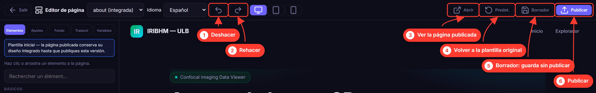

| | |
|---|---|
| **1 – 2** | **Deshacer** y **Rehacer**. |
| **3** | **Abrir** — muestra la página publicada en una pestaña nueva, para comparar. |
| **4** | **Predet.** — vuelve a la plantilla original. ⚠️ Borra su maquetación. |
| **5** | **Borrador** — guarda sin publicar. Puede cerrar y retomarlo más tarde. |
| **6** | **Publicar** — pone su versión en línea. |

> 📌 **La diferencia que hay que recordar: Borrador ≠ Publicar.**
> Mientras no haga clic en **Publicar**, los visitantes siguen viendo la versión anterior. Puede por tanto trabajar durante días guardando borradores, sin romper nada.

## 12.4. Añadir un elemento

La pestaña **Elementos** de la barra lateral contiene todo lo que se puede colocar en una página.

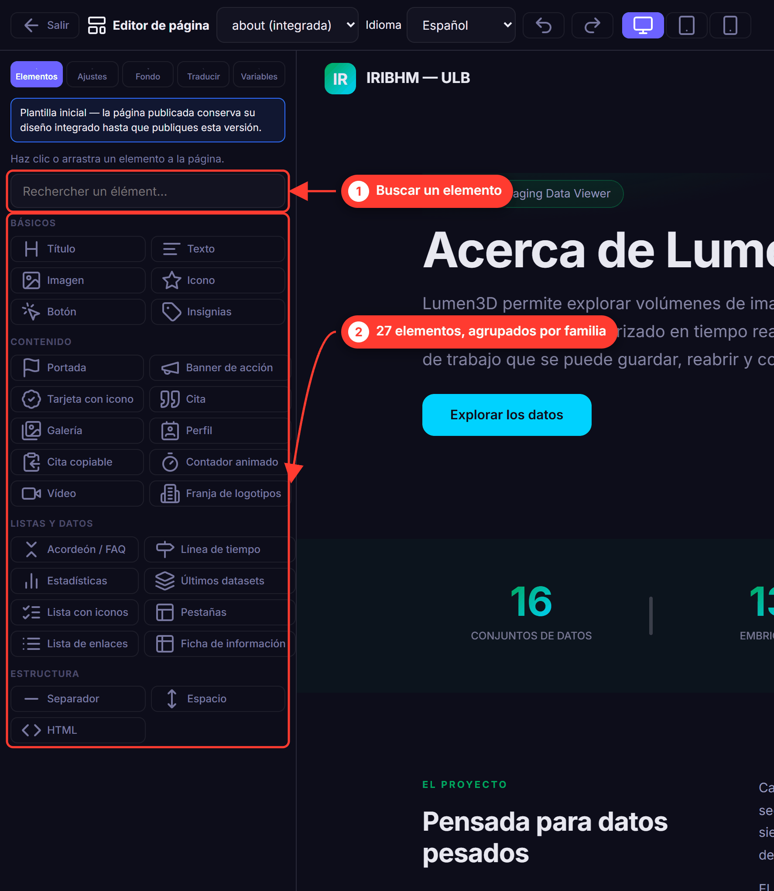

Dos maneras:

- **hacer clic** en un elemento: se añade al final de la página;
- **arrastrarlo** al lugar deseado: aparecen zonas de destino durante el desplazamiento.

El campo **Buscar un elemento** filtra la lista — práctico, porque hay 27.

### Los 27 elementos disponibles

**Básicos** — los ladrillos elementales

| Elemento | Qué es |
|---|---|
| **Título** | Un título de sección |
| **Texto** | Un párrafo |
| **Imagen** | Una imagen |
| **Icono** | Un pictograma |
| **Botón** | Un botón en el que se puede hacer clic |
| **Insignias** | Pequeñas etiquetas de color |

**Contenido** — los bloques de presentación

| Elemento | Qué es |
|---|---|
| **Portada** | La gran banda de introducción en la parte superior |
| **Banner de acción** | Un recuadro que invita a hacer clic |
| **Tarjeta con icono** | Una tarjeta: icono + título + texto |
| **Cita** | Una cita destacada |
| **Galería** | Varias imágenes en cuadrícula |
| **Perfil** | Una ficha de persona (foto, nombre, función) |
| **Cita copiable** | Una referencia bibliográfica con botón «copiar» |
| **Contador animado** | Una cifra que avanza al mostrarse |
| **Vídeo** | Un vídeo integrado |
| **Franja de logotipos** | Una fila de logotipos de socios |

**Listas y datos**

| Elemento | Qué es |
|---|---|
| **Acordeón / FAQ** | Preguntas que se despliegan |
| **Línea de tiempo** | Una sucesión de etapas fechadas |
| **Estadísticas** | Una fila de cifras clave |
| **Últimos datasets** | **Se rellena solo** con sus conjuntos recientes |
| **Lista con iconos** | Una lista de puntos ilustrada |
| **Pestañas** | Contenido repartido en pestañas |
| **Lista de enlaces** | Una lista de enlaces |
| **Ficha de información** | Una tabla etiqueta / valor |

**Estructura**

| Elemento | Qué es |
|---|---|
| **Separador** | Una línea horizontal |
| **Espacio** | Un hueco vacío ajustable |
| **HTML** | Código HTML libre — **reservado a usuarios avanzados** |

> 💡 **Los elementos que se rellenan solos.** *Últimos datasets* y *Estadísticas* pueden tomar los datos directamente del sitio: número de conjuntos, de especímenes, de células seguidas, de regiones anotadas. La cifra se actualiza sola cuando añade datos — nunca tendrá que volver a corregir la página.

## 12.5. Modificar un elemento existente

**Haga clic en él dentro de la página.** Se rodea de verde y la barra lateral pasa a sus ajustes.

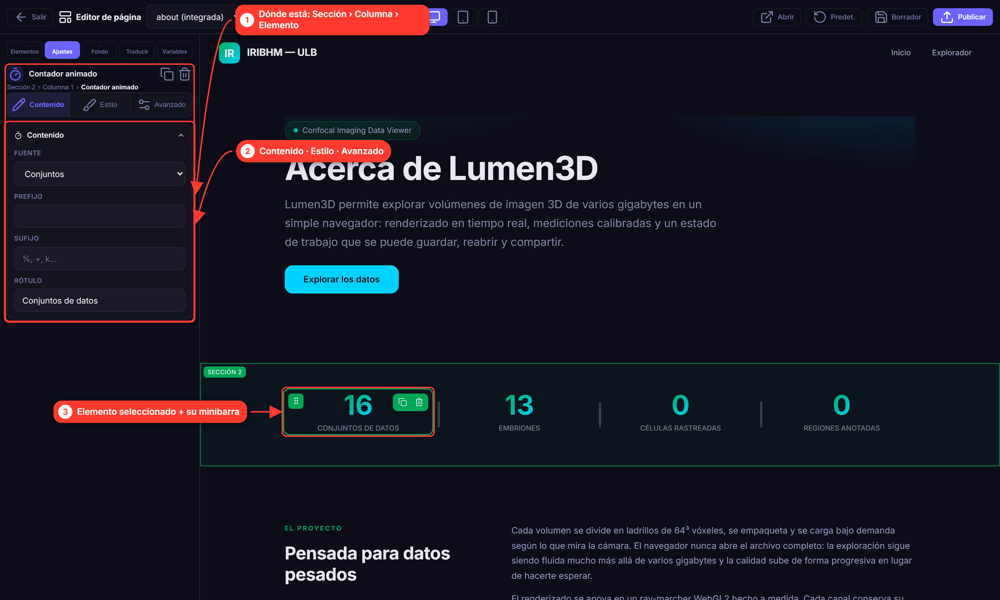

| | |
|---|---|
| **1** | La **ruta de navegación**: `Sección 2 › Columna 1 › Contador animado`. Le dice exactamente dónde está, y cada nivel es pulsable. |
| **2** | Las tres pestañas de ajustes: **Contenido**, **Estilo**, **Avanzado**. |

### Las minibarras de herramientas

Sobre el bloque bajo el cursor aparece una pequeña barra verde:

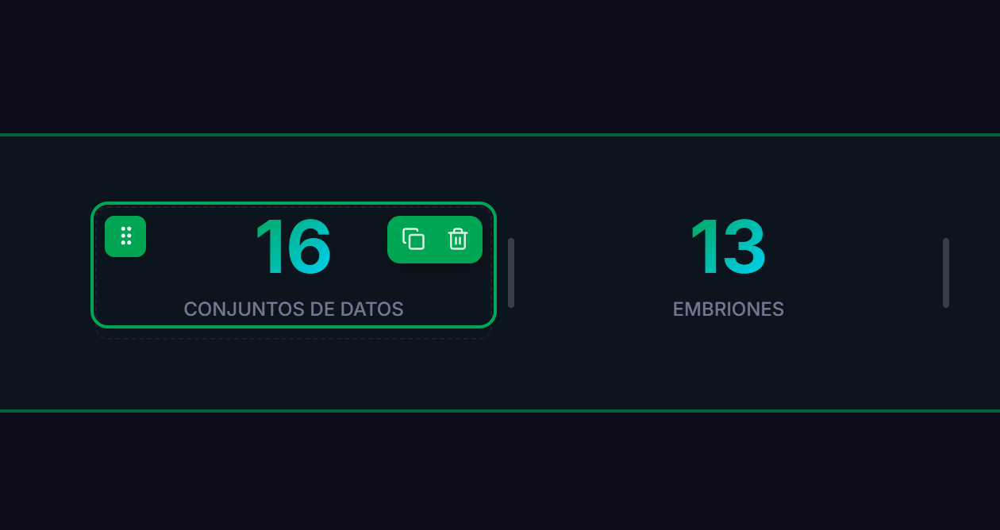

**Solo hay una barra visible a la vez**: la del nivel más interior bajo el cursor. Si pasa el ratón sobre un elemento, obtiene la barra del elemento; si sale del elemento pero sigue en la columna, la de la columna; si va al margen de la sección, la de la sección.

**Barra de un elemento**

| Icono | Acción |
|---|---|
| **⠿** (puntos, a la izquierda) | **Asa de desplazamiento** — mantenga y arrastre para mover el elemento |
| **⧉** | **Duplicar** |
| **🗑** | **Eliminar** |

**Barra de una columna**

| Icono | Acción |
|---|---|
| **‹** **›** | Mover la columna a la izquierda / derecha |
| **⚙** | Ajustes de la columna |
| **⧉** · **🗑** | Duplicar · Eliminar |

**Barra de una sección**

| Icono | Acción |
|---|---|
| **⌃** **⌄** | Subir / bajar la sección en la página |
| **▥** | **Añadir una columna** |
| **⚙** | Ajustes de la sección |
| **⧉** · **🗑** | Duplicar · Eliminar |

> 💡 **Para llegar a una columna o una sección sin buscar la zona correcta**, use la **ruta de navegación** de la barra lateral (marca 1 arriba): `Sección 2 › Columna 1 › Contador animado`. Cada nivel es pulsable y selecciona directamente ese bloque.

### Las tres pestañas de ajustes

**Contenido** — lo que está escrito: los textos, las imágenes, los enlaces, la fuente de datos. Es la pestaña que más usará.

**Estilo** — el aspecto: colores, tamaños, espaciados, alineación, redondeo.

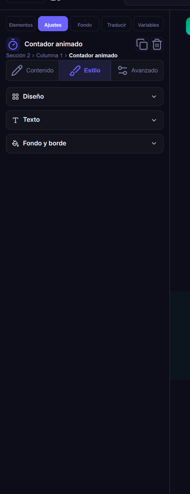

**Avanzado** — las opciones finas: márgenes, comportamiento al pasar el ratón, **visibilidad según el dispositivo** (ocultar un elemento en móvil, por ejemplo), CSS personalizado.

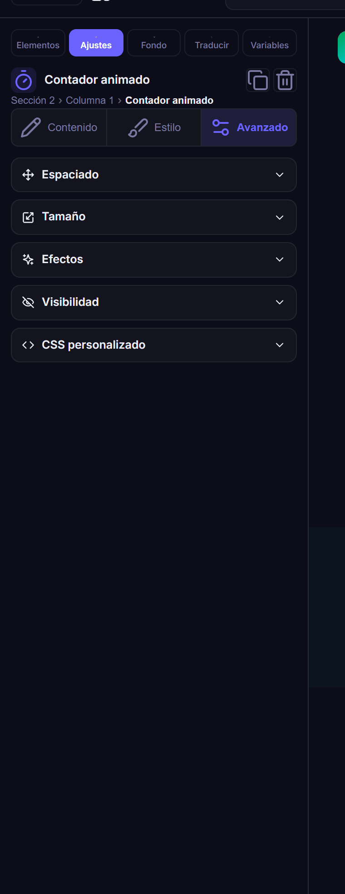

> 💡 **Modificar un texto aún más rápido:** haga doble clic directamente sobre el texto en la página y escriba. **Intro** valida, **Esc** cancela.

### Los atajos de teclado del editor

| Atajo | Acción |
|---|---|
| `Ctrl + Z` | Deshacer |
| `Ctrl + Y` *(o `Ctrl + Shift + Z`)* | Rehacer |
| `Ctrl + S` | Guardar un borrador |
| `Ctrl + D` | Duplicar el elemento seleccionado |
| `Ctrl + C` / `Ctrl + V` | Copiar / pegar un elemento |
| `Supr` *(o `Retroceso`)* | Eliminar el elemento seleccionado |
| `Esc` | Deseleccionar |

*(En Mac, sustituya `Ctrl` por `Cmd`.)* Estos atajos se desactivan mientras escribe en un campo de texto, así que puede escribir con normalidad.

## 12.6. Organizar la página: secciones y columnas

Una página se construye en tres niveles:

```
Página
 └─ Sección         (una banda horizontal, a todo lo ancho)
     └─ Columna     (una división vertical de la sección)
         └─ Elemento (un título, una imagen, un botón…)
```

Para dividir una sección en columnas, selecciónela (haga clic en su zona, o use la flecha **›** desde un elemento) y utilice el icono de división de su barra de herramientas. Se ofrecen seis disposiciones:

| | Disposición |
|---|---|
| **1** | Una sola columna a todo lo ancho |
| **2** | Dos columnas iguales |
| **3** | Tres columnas iguales |
| **4** | Cuatro columnas iguales |
| **⅔ ⅓** | Una ancha a la izquierda, una estrecha a la derecha |
| **⅓ ⅔** | Una estrecha a la izquierda, una ancha a la derecha |

En un teléfono, las columnas **se colocan automáticamente una debajo de otra**. No hay que hacer nada para eso.

## 12.7. Comprobar en móvil

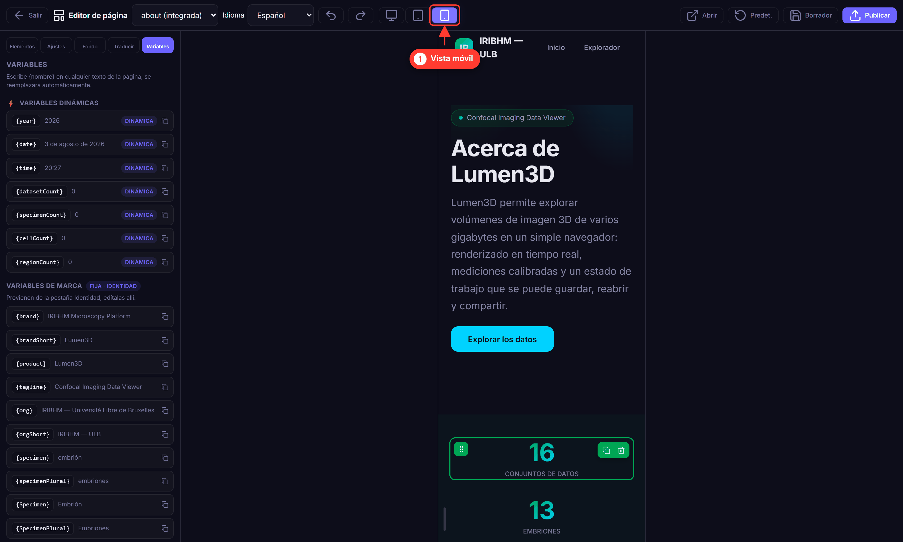

Los tres iconos (escritorio / tableta / móvil) redimensionan la vista previa. **Acostúmbrese a comprobar en móvil antes de publicar**: buena parte de los visitantes consultan el sitio desde un teléfono.

## 12.8. El fondo animado

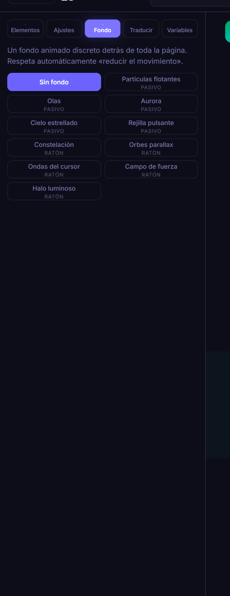

La pestaña **Fondo** añade un decorado animado discreto detrás de toda la página.

- **Sin fondo** — fondo liso.
- **Ratón** — la animación reacciona al movimiento del cursor.
- **Pasivo** — la animación transcurre sola.

El ajuste respeta automáticamente la preferencia del sistema «reducir el movimiento» de las personas sensibles al movimiento.

## 12.9. Traducir una página

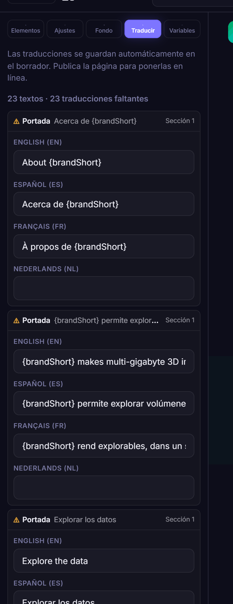

La pestaña **Traducir** enumera **todos los textos de la página** y señala los que faltan en los demás idiomas, con un contador del tipo *«24 textos · 7 traducciones que faltan»*.

Ahorra tiempo de verdad: en lugar de volver a abrir cada elemento uno por uno buscando lo que no está traducido, lo ve todo de golpe y lo rellena seguido.

**Método recomendado:** redacte toda la página en un idioma y luego pase a esta pestaña para traducirla de una vez.

## 12.10. Las variables

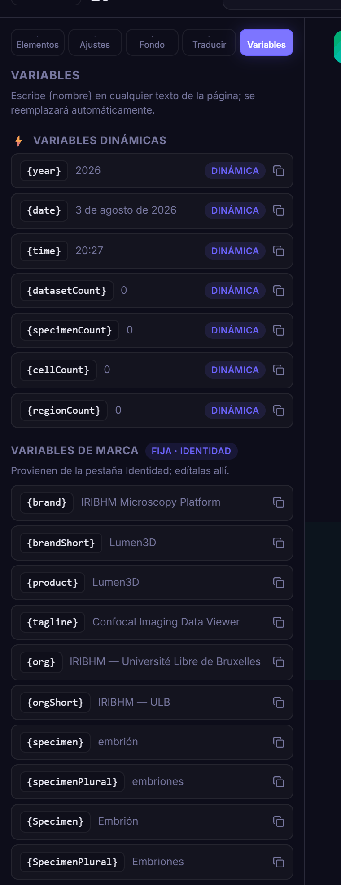

Una **variable** es un texto que define una vez y reutiliza en todas partes.

**Cómo funciona:**

1. en la pestaña **Variables**, cree una variable: un nombre (por ejemplo `contacto`) y un valor (`microscopy@ulb.be`);
2. en cualquier texto de la página, escriba `{contacto}`;
3. al mostrarse, aparece el valor.

**Para qué sirve:** el día que cambie la dirección, la corrige en un solo sitio y **todas las páginas se actualizan**. Ideal para una dirección de correo, un número de teléfono, el nombre de un responsable o una referencia de artículo.

Reglas de nombre: empiece por una letra, luego letras, cifras o `_`, 32 caracteres como máximo.

Ya existen variables para los datos de la pestaña Identidad: `{brand}` (el nombre del sitio), `{specimen}` (su objeto de estudio), `{org}` (la organización), `{year}` (el año). Se actualizan solas.

## 12.11. Crear una nueva página

1. en la pestaña **Páginas**, haga clic en **+ Nueva página**;
2. dele un título y una dirección corta (el *slug*, por ejemplo `protocolos`);
3. constrúyala en el editor;
4. **Publicar**;
5. para hacerla accesible desde el menú, vaya a **Identidad → Navegación**.

La página queda entonces accesible en `https://<su-sitio>/page.html?slug=protocolos`.

## 12.12. Procedimiento recomendado

1. **Editar con el editor**
2. Hacer sus modificaciones
3. **Borrador** con regularidad (como en un procesador de textos)
4. Comprobar en **vista previa móvil**
5. Completar la pestaña **Traducir**
6. **Publicar**
7. **Abrir** para comprobar el resultado en línea

---

# 13. Apariencia — los colores del sitio

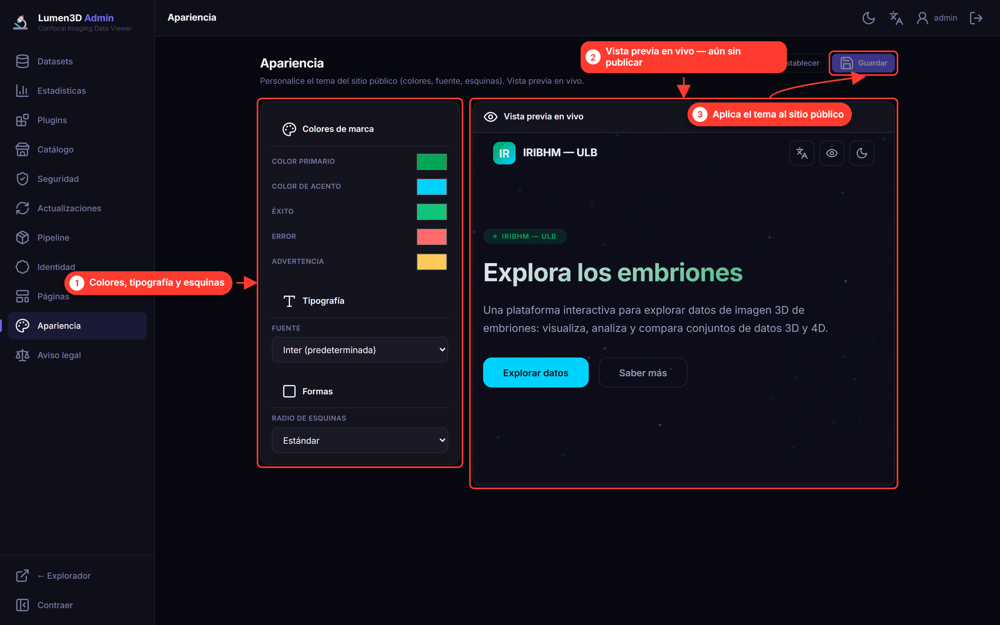

| | |
|---|---|
| **1** | Colores, tipografía y redondeo. |
| **2** | **Vista previa en vivo** — lo que ve **aún no está publicado**. |
| **3** | **Guardar** — aplica el tema al sitio público. |

## 13.1. Los colores

| Color | Dónde aparece |
|---|---|
| **Primario** | El color dominante: botones principales, enlaces, elementos activos |
| **Acento** | El color secundario, para destacar |
| **Éxito** | Las confirmaciones (verde por defecto) |
| **Error** | Los mensajes de error (rojo por defecto) |
| **Advertencia** | Las alertas (naranja por defecto) |

Haga clic en un cuadrado de color para abrir el selector. **La vista previa de la derecha se actualiza al instante**, así que puede probar sin riesgo.

> 💡 **Mantenga los colores Éxito / Error / Advertencia cerca del verde / rojo / naranja.** Son señales universales: un mensaje de error en verde desorienta a los visitantes.

## 13.2. Tipografía y formas

- **Fuente** — la tipografía del sitio público.
- **Radio de esquinas** — de anguloso a muy redondeado, en botones y tarjetas.

## 13.3. Publicar el tema

No se aplica nada al sitio público mientras no haga clic en **Guardar**. El botón **Restablecer** vuelve al tema original.

> ⚠️ **Compruebe el contraste.** Un color primario muy claro sobre fondo claro se vuelve ilegible. Después de guardar, abra el sitio público y compruebe que todo se lee bien, en tema claro **y** oscuro.

---

# 14. Aviso legal

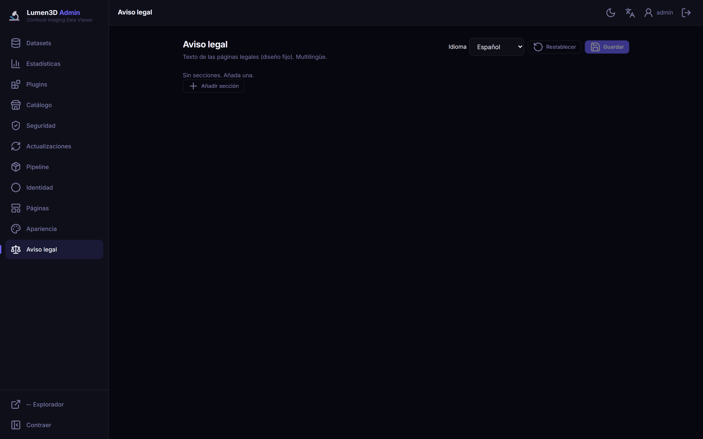

Un editor sencillo, de maquetación fija, para el texto legal del sitio.

**Funcionamiento:**

- **+ Añadir sección** crea un bloque: un **título** y un **texto**.
- Las secciones se muestran en el orden en que las crea.
- El selector **Idioma** de arriba permite redactar la versión de cada idioma.
- **Guardar** publica.

**Secciones habituales:** editor del sitio, alojamiento, propiedad intelectual, datos personales, contacto.

> ⚠️ **Dos cosas que no hay que olvidar:**
>
> 1. la página permanece invisible mientras no marque **«Mostrar Aviso legal»** en **Identidad → Navegación**;
> 2. el contenido jurídico depende de su país y de su institución — consulte al servicio competente en vez de copiar una plantilla encontrada en internet.

---

# Anexo A — Primera instalación

Este anexo solo concierne a la **primerísima puesta en servicio** de un sitio nuevo. Si su sitio ya funciona, nunca verá estas pantallas.

Cuando todavía no existe ninguna cuenta de administrador, abrir `admpan.html` lanza un asistente de **5 pasos**.

## Paso 1 — Cuenta de administrador

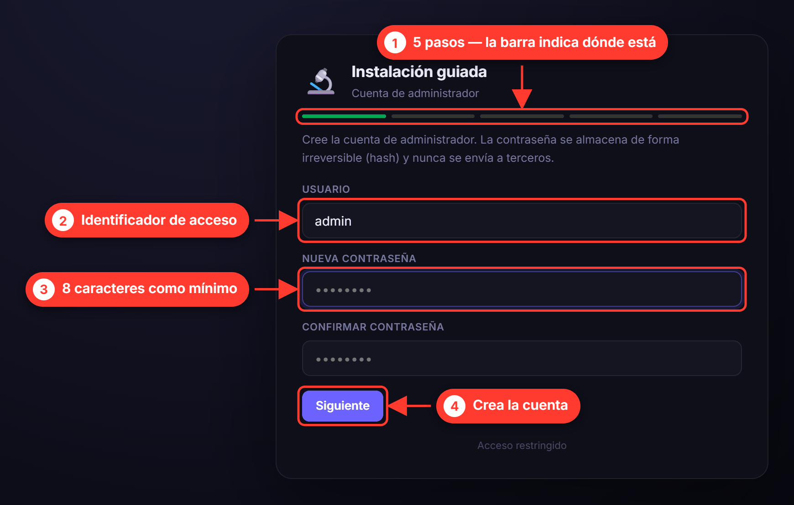

Es **el único paso obligatorio**. Los siguientes pueden omitirse y rehacerse más tarde desde las pestañas correspondientes.

La contraseña debe tener **8 caracteres como mínimo**.

> 🔒 **Esta creación es exclusiva:** nunca puede sobrescribir una cuenta existente. Si ya hay una contraseña configurada, esta pantalla no aparece en absoluto.

## Paso 2 — Identidad

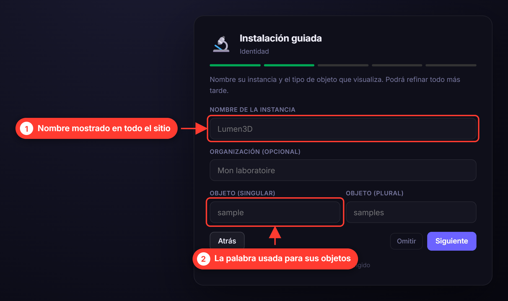

El nombre de la instancia, la organización y la palabra que designa sus objetos de estudio. Modificable después en **Identidad** (§11).

## Paso 3 — Tema

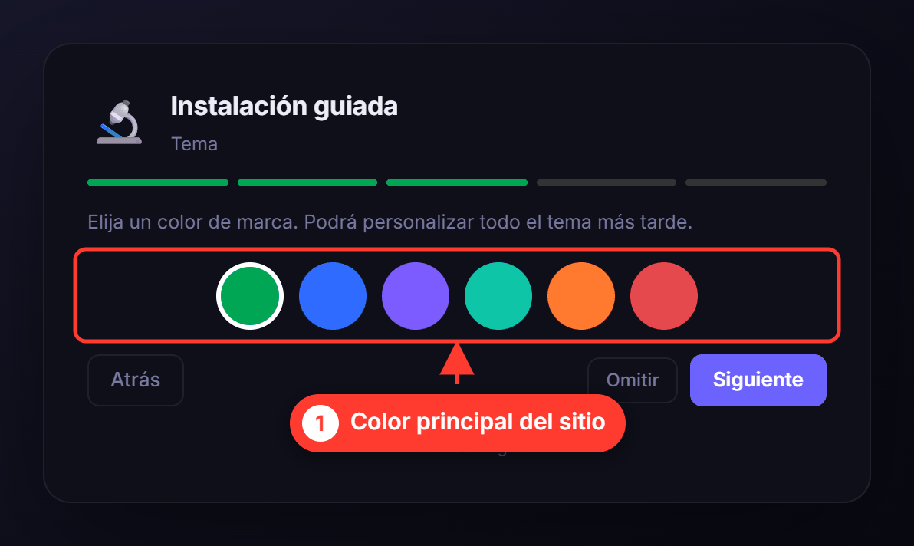

Un color dominante entre seis propuestas. Refinable después en **Apariencia** (§13).

## Paso 4 — Textos

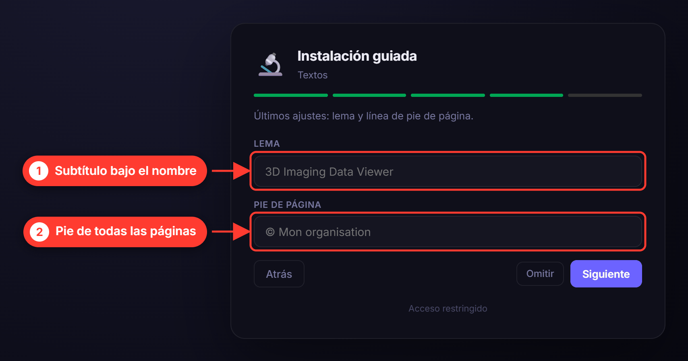

El lema y la mención del pie de página. Modificables después en **Identidad** (§11).

## Paso 5 — Plugins

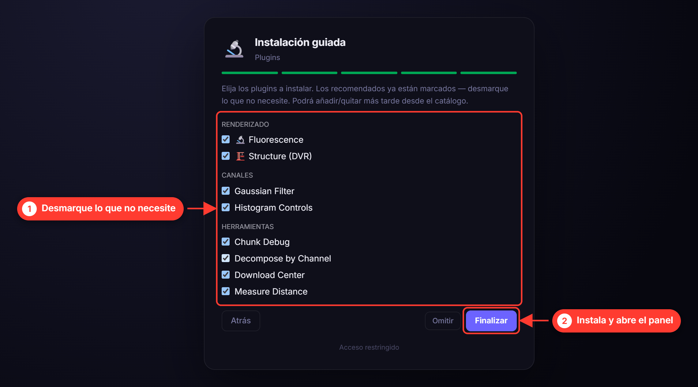

La selección de funciones que se instalarán. Las recomendadas ya están marcadas; desmarque lo que no necesite. Modificable después en **Catálogo** (§6) y **Plugins** (§5).

**Finalizar** instala la selección y abre el panel.

---

# Anexo B — Si algo va mal

### «He olvidado la contraseña de administrador»

Es **imposible** recuperarla: el servidor solo guarda una huella irreversible.

La solución requiere acceso a los archivos del servidor (FTP, SFTP, o el gestor de archivos del alojamiento):

1. borre — o mejor, **renombre** — el archivo `api/admin_credential.json`;
2. vuelva a abrir `admpan.html`: reaparece el asistente de primera instalación;
3. cree una nueva contraseña.

**No se pierde nada más**: ni los conjuntos de datos, ni las páginas, ni los ajustes.

> ⚠️ Durante ese breve lapso, cualquiera que abra la página podría crear la cuenta en su lugar. Hágalo de una sola vez.

### «He modificado algo y el sitio está roto»

| Pestaña | Cómo volver atrás |
|---|---|
| **Identidad** | Botón **Restablecer** |
| **Apariencia** | Botón **Restablecer** |
| **Páginas** | Botón **Predet.** en el editor, y luego **Publicar** |
| **Aviso legal** | Botón **Restablecer** |
| **Datasets** | Botón **↺ Restablecer** (antes de haber guardado) |

### «Un conjunto de datos no aparece en la lista»

1. compruebe que está realmente en `DATA_WEB/fixed/`, `DATA_WEB/live/` o `DATA_WEB/tracking/`;
2. compruebe que su carpeta contiene un archivo `metadata.json`;
3. recargue la página del panel.

**No hay ningún catálogo que regenerar**: la lista se reconstruye cada vez que se muestra.

### «Ha desaparecido una función del visor»

Mire la pestaña **Plugins**: el plugin correspondiente probablemente está desactivado, o ha pasado a **no fiable** tras una modificación de sus archivos. Véase §5.5.

### «Un guardado falla sin mensaje claro»

Pruebe **Seguridad → Reparar permisos** (§7.3). Es la causa más frecuente en alojamientos compartidos.

### «La actualización ha fallado»

Si el mensaje dice *«restauración automática realizada»*, **no hay nada que hacer**: el sitio ha vuelto a su versión anterior y funciona. Inténtelo más tarde, o comunique el mensaje de error.

### «El panel es ilegible / las listas desplegables son blancas sobre blanco»

Haga una **recarga forzada**: `Ctrl + Shift + R` (Windows) o `Cmd + Shift + R` (Mac). El navegador a veces conserva archivos antiguos tras una actualización.

---

# Anexo C — Pequeño glosario

| Término | Qué significa aquí |
|---|---|
| **Canal** | Un marcador fluorescente (DAPI, GFP, Pecam1…). Un conjunto de datos suele contener varios, superpuestos. |
| **Vóxel** | El equivalente de un píxel, en tres dimensiones. Su tamaño real lo da la calibración (§3.3). |
| **Bloque** | Un pequeño cubo de volumen (64×64×64 vóxeles). El sitio los carga bajo demanda, lo que le permite mostrar volúmenes de varios gigabytes sin descargarlo todo. |
| **LOD** | *Level of Detail*. Varias resoluciones del mismo volumen: el sitio muestra primero una versión basta y luego afina. |
| **Fixed / Live / Tracking** | Los tres tipos de conjuntos: volumen fijo, serie temporal 4D, trayectorias celulares. |
| **Plugin** | Un módulo que añade una función al visor (§5.1). |
| **Sandbox (entorno aislado)** | Un modo de ejecución aislado: el plugin funciona, pero no puede acceder al resto de la página. |
| **Huella** | Una firma del contenido exacto de un archivo. Si el archivo cambia en un solo carácter, la huella cambia. |
| **Slug** | La dirección corta de una página (`protocolos` en `page.html?slug=protocolos`). |
| **Sección / Columna / Elemento** | Los tres niveles de construcción de una página (§12.6). |
| **Borrador** | Una versión guardada pero **aún no visible** para el público. |
| **SEO** | Los textos que muestran los buscadores y las redes sociales. |

---

*Documento generado a partir de la versión **1.42.0** de la plataforma. Las capturas provienen de una instancia real; los colores pueden diferir si se ha modificado el tema.*
