# Cómo leer esta guía {.unnumbered}

::: lead
Este documento explica **todo lo que se puede hacer desde el panel de administración** del sitio.
Está escrito para alguien que **nunca ha visto este panel** y que **no sabe programar**: ningún comando, ningún archivo que editar; todo se hace con el ratón, desde un navegador.
:::

::: remember
**Dos reglas que conviene recordar antes de empezar**

1. **No se pierde nada mientras no haya hecho clic en [Guardar]{.ui}** (o en [Publicar]{.ui}). Puede hacer clic por todas partes para explorar. Las únicas excepciones, señaladas cada vez, son el ojo de visibilidad de un dataset, la adición de una imagen a la galería y las actualizaciones de datos, que actúan de inmediato.
2. **El panel nunca modifica los píxeles de sus imágenes.** Los valores del nivel nativo se conservan vóxel a vóxel. Ajusta nombres, textos, colores y visibilidad; también puede **añadir o reconstruir archivos derivados** (importación, actualización de datos, galería), siempre a petición suya.
:::

## El panel en cuatro grupos

El menú de la izquierda reparte las 15 pestañas en **cuatro grupos**, según lo que esté haciendo. Esta guía sigue el mismo orden.

| Grupo | Pestañas | Capítulos |
|---|---|---|
| **Primeros pasos** | Conexión, recorrido del panel | 1 – 2 |
| **Datos** | Datasets · Importar · Actualizaciones de datos · Tipos de datos · Estadísticas | 3 – 7 |
| **Sitio público** | Identidad · Apariencia · Páginas · Aviso legal | 8 – 11 |
| **Extensiones** | Plugins · Catálogo | 12 – 13 |
| **Sistema** | Actualizaciones (y página *Notas de versión*) · Pipeline · Seguridad · Documentación | 14 – 17 |
| **Anexos** | Primera instalación · Si algo va mal · Glosario | A – C |

## Cómo leer esta guía

:::: cards
::: card
#### 🚀 Acabo de llegar
Capítulos **1 y 2**, y luego el **anexo B** («Si algo va mal»). Diez minutos bastan.
:::
::: card
#### 📦 Tengo datos nuevos
Capítulo **4** (Importar) y después el **3** (Datasets) para darles nombre y hacerlos públicos.
:::
::: card
#### 🛠 Mantengo el sitio
Capítulos **5**, **12 a 14**: actualizaciones de datos, plugins, versión de la plataforma.
:::
::::

Las palabras entre corchetes azules, como [Guardar]{.ui}, son **los textos exactos que aparecen en pantalla**. Los círculos rojos numerados de las capturas remiten a la tabla situada justo debajo. Todas las capturas muestran un conjunto de datos de demostración.

# 1. Conectarse al panel

::: chapter-intro
- Ningún enlace del sitio público lleva al panel: hay que **teclear su dirección**.
- Un usuario, una contraseña, y ya tiene **8 horas** de sesión.
- Tras demasiados intentos fallidos, el panel le hace **esperar 15 minutos**.
:::

## 1.1. La dirección

Al panel de administración **no** se accede desde un enlace del sitio público: a propósito no hay ningún botón «Admin» en las páginas visibles, y el panel pide a los buscadores que no lo indexen.

Para entrar, hay que **teclear la dirección a mano** en la barra del navegador:

```
https://<direccion-del-sitio>/admpan.html
```

Sustituya `<direccion-del-sitio>` por la dirección habitual del sitio. Por ejemplo, si el sitio público es `https://microscopy.example.be`, el panel está en `https://microscopy.example.be/admpan.html`.

::: tip
Guarde esta dirección en los marcadores de su navegador: así no tendrá que recordarla.
:::

## 1.2. Las credenciales

::: note
**Credenciales de acceso**

- **Usuario:** [ ]{.field-line}
- **Contraseña:** [ ]{.field-line}

*(Para completar. Comparta esta información solo con las personas que realmente deban administrar el sitio.)*
:::

En la versión PDF de esta guía puede imprimir esta página y escribir a mano, o guardar el archivo en un lugar seguro.

## 1.3. La pantalla de conexión

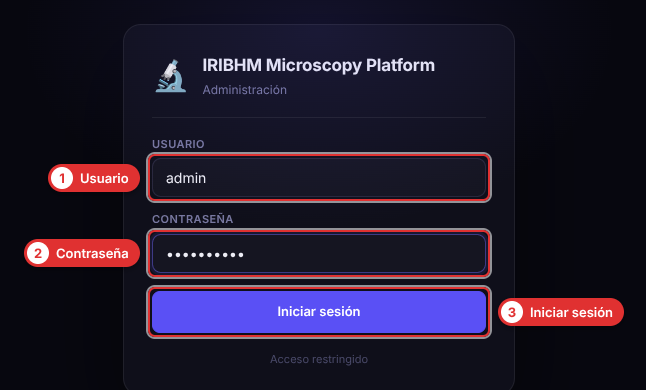{.shot width=62%}

::: legend
| n | qué es |
|-|----------------------|
| 1 | Su **usuario** (`admin` por defecto). |
| 2 | Su **contraseña**. |
| 3 | [Iniciar sesión]{.ui} abre el panel. La tecla <kbd>Intro</kbd> hace lo mismo. |
:::

Es un formulario de verdad: el gestor de contraseñas de su navegador (Chrome, Firefox…) puede memorizar y rellenar **el usuario y la contraseña**.

Si las credenciales son incorrectas, aparece el mensaje «Credenciales incorrectas.» encima de los campos.

## 1.4. Intentos repetidos y duración de la sesión

::: warning
**El panel se protege de los intentos repetidos.** Cada fallo se cuenta **antes** de comprobar la contraseña, por dirección: tras **10 fallos en 15 minutos**, el acceso queda bloqueado durante **15 minutos** («Demasiados intentos. Inténtelo de nuevo más tarde.»). Un tope global de 200 intentos por 15 minutos protege además el sitio contra un ataque procedente de varias direcciones.
:::

- Un usuario incorrecto cuesta **el mismo tiempo** que una contraseña incorrecta: no se puede adivinar qué cuentas existen.
- La sesión dura **8 horas**; después hay que volver a iniciar sesión. También termina con cada cambio de contraseña.
- El identificador de sesión **no** es legible por las páginas del sitio; desaparece al cerrar la sesión.

::: tech
Detrás de un servidor «proxy inverso», el servidor debe conocer la dirección del proxy (opción `--trusted-proxy`, variable `LUMEN_TRUSTED_PROXIES` o archivo `api/trusted-proxies.json`). Si no, todos los visitantes se parecen al proxy y comparten el mismo contador de intentos. Es un ajuste del alojamiento, que debe pedir a la persona que gestiona el servidor.
:::

::: warning
**La contraseña no está escrita en ningún sitio del servidor.** Se transforma en una huella irreversible (véase el capítulo 16). Nadie, ni siquiera el proveedor de alojamiento, puede recuperarla. **Si la pierde**, la única solución se describe en el [anexo B](#anexo-b--si-algo-va-mal).
:::

# 2. El recorrido del propietario

::: chapter-intro
- Un menú a la izquierda en **4 grupos**, una barra superior y una zona de trabajo.
- Una pastilla naranja le avisa cuando **tiene cambios sin guardar**.
- <kbd>Ctrl</kbd> + <kbd>S</kbd> guarda la pestaña abierta.
:::

Una vez conectado, la pantalla se divide en tres zonas que nunca cambian: el **menú**, la **barra superior** y la **zona de trabajo**, donde se muestra la pestaña elegida.

## 2.1. El menú de la izquierda

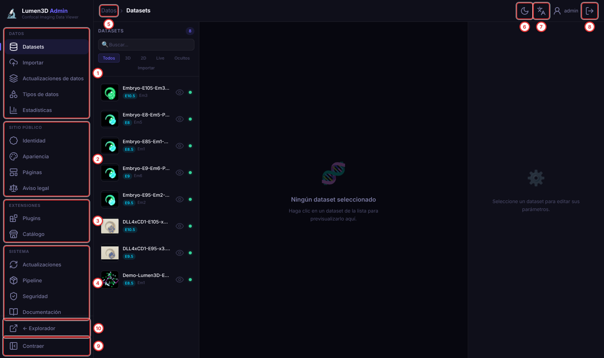{.shot width=88%}

::: legend
| n | qué es |
|-|----------------------|
| 1 | Grupo **Datos**: Datasets, Importar, Actualizaciones de datos, Tipos de datos, Estadísticas. |
| 2 | Grupo **Sitio público**: Identidad, Apariencia, Páginas, Aviso legal. |
| 3 | Grupo **Extensiones**: Plugins, Catálogo. |
| 4 | Grupo **Sistema**: Actualizaciones, Pipeline, Seguridad, Documentación. |
| 5 | **Ruta de navegación**: «grupo › pestaña» abierta. |
| 6 | **Tema** claro / oscuro del panel (solo su pantalla). |
| 7 | **Idioma** del panel: francés, inglés, español, neerlandés. |
| 8 | **Cerrar sesión.** |
| 9 | [Contraer]{.ui}: pliega el menú en iconos para ganar espacio (la elección se recuerda). |
| 10 | [← Explorador]{.ui}: abre el sitio público en una pestaña nueva, práctico para comprobar el efecto de un cambio. |
:::

El botón [Contraer]{.ui} pliega el menú en iconos solos. Aparece un **pequeño punto de color** junto a [Actualizaciones]{.ui} cuando existe una nueva versión de la plataforma. Aparece otro junto a [Importar]{.ui} cuando hay una transferencia en curso.

En un teléfono, el menú se convierte en un cajón (botón [Menú]{.ui}). El panel sigue pensado para una **pantalla ancha**, en especial el editor de datasets.

## 2.2. La barra superior

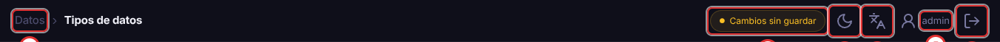{.shot width=88%}

::: legend
| n | qué es |
|-|----------------------|
| 1 | La **ruta de navegación**: grupo y luego pestaña. |
| 2 | La pastilla naranja **«Cambios sin guardar»**. |
| 3 | El **tema** del panel. |
| 4 | El **idioma** del panel. |
| 5 | Su **nombre de usuario**. |
| 6 | **Cerrar sesión**. |
:::

## 2.3. Los cambios sin guardar

En cuanto cambia algo sin guardarlo, aparece la pastilla naranja. Es un **recordatorio**, no un error: mientras esté ahí, sus cambios solo los ve usted.

- Se calcula **pestaña por pestaña** (Datasets, Tipos de datos, Identidad, Apariencia, Aviso legal, Páginas). Ya no se enciende solo porque haya **abierto** un dataset.
- Si cambia de pestaña con cambios pendientes: «Cambios sin guardar. ¿Continuar sin guardar?». Responder que sí **descarta de verdad** los cambios.
- <kbd>Ctrl</kbd> + <kbd>S</kbd> (<kbd>Cmd</kbd> + <kbd>S</kbd> en Mac) **guarda la pestaña visible**: Datasets, Tipos de datos, Identidad, Apariencia, Aviso legal.

::: note
**¿Sesión caducada mientras trabaja?** El panel vuelve a mostrar la pantalla de conexión con el mensaje «Sesión caducada: se conservan sus cambios sin guardar. Inicie sesión de nuevo.». Las pestañas siguen en su sitio detrás: tras volver a conectarse, recupera su trabajo.
:::

Cuando hay una **importación en curso**, cerrar la sesión y los enlaces que salen del panel piden confirmación (capítulo 4). Las pestañas se cargan la primera vez que se abren: una primera visita puede tardar una fracción de segundo.

## 2.4. Las pestañas de un vistazo

| Pestaña | Para qué sirve | Frecuencia |
|---|---|---|
| **Datasets** | Nombrar, describir, orientar, mostrar u ocultar cada conjunto de datos | Habitual |
| **Importar** | Enviar la carpeta producida por el pipeline, desde el navegador | Habitual |
| **Actualizaciones de datos** | Llevar los conjuntos de datos publicados al formato de datos actual | Ocasional |
| **Tipos de datos** | El nombre público de las tres categorías (3D, 2D, Live) | Raro |
| **Estadísticas** | Ver la frecuentación del sitio | Ocasional |
| **Identidad** | Nombre del sitio, vocabulario, pie de página, menú | Raro |
| **Apariencia** | Colores, fuente y esquinas redondeadas del sitio público | Raro |
| **Páginas** | Modificar el contenido de las páginas (inicio, acerca de…) | Habitual |
| **Aviso legal** | Texto legal | Raro |
| **Plugins** | Activar, desactivar y aprobar las funciones del visor | Raro |
| **Catálogo** | Instalar, actualizar y desinstalar funciones | Raro |
| **Actualizaciones** | Actualizar la **plataforma**, los plugins y el paquete Pipeline | Ocasional |
| **Pipeline** | Descargar la herramienta que prepara los datos nuevos | Raro |
| **Seguridad** | Contraseña y permisos | Raro |
| **Documentación** | Leer y descargar las guías publicadas | Ocasional |

::: warning
**Dos pestañas empiezan por «Actualizaciones», y no hacen lo mismo.** [Actualizaciones de datos]{.ui} (grupo Datos) lleva al día el **formato de los conjuntos de datos** publicados. [Actualizaciones]{.ui} (grupo Sistema) actualiza **el software**: plataforma, plugins, paquete de procesamiento.
:::

# 3. Datasets — los conjuntos de datos

::: chapter-intro
- Es la pestaña que más abrirá: **describe** los conjuntos de datos y decide **cuáles son públicos**.
- Tres columnas: la **lista**, la **vista previa** (el visor de verdad) y los **ajustes**.
- Un dataset llega por la pestaña **Importar** (o por FTP); aquí se deja presentable.
:::

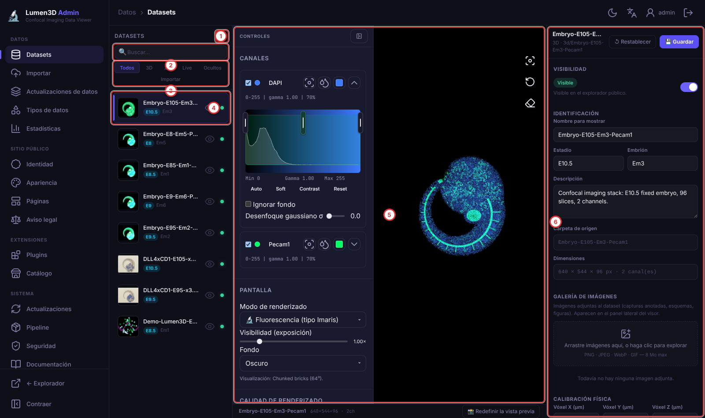{.shot width=88%}

::: legend
| n | qué es |
|-|----------------------|
| 1 | El número total de conjuntos de datos. |
| 2 | La **búsqueda**: nombre, estadio, espécimen. |
| 3 | Los **filtros** por tipo (véase §3.2). |
| 4 | El dataset seleccionado en la lista. |
| 5 | La **vista previa**: el visor de verdad, con la barra lateral de canales. |
| 6 | Los **ajustes** del dataset (columna de la derecha). |
:::

::: analogy
**Una biblioteca y sus fichas.** Los volúmenes son los libros, colocados en las estanterías por el pipeline. Esta pestaña no escribe los libros: rellena **la ficha** de cada uno (título legible, descripción, orientación, imagen de portada) y decide si está **en la estantería pública** o en el almacén.
:::

## 3.1. ¿Cómo llega un conjunto de datos hasta aquí?

Usted no **crea** un conjunto de datos desde el panel. Hay dos vías:

::: steps
1. Las imágenes brutas del microscopio las procesa el **pipeline** (capítulo 15).
2. La carpeta producida se envía al servidor: o bien por la pestaña **Importar** (arrastrar y soltar en el navegador, capítulo 4), o bien copiándola en `DATA_WEB` por FTP.
3. **Aparece de inmediato** en esta lista: no hay nada que regenerar, ningún botón en el que hacer clic.
:::

::: warning
Un dataset **publicado desde Importar** llega **oculto** del explorador público. Hay que venir aquí, abrirlo y activar [Visibilidad]{.ui} (o hacer clic en el ojo de su fila). Un dataset copiado por FTP, en cambio, es visible desde el principio.
:::

## 3.2. La columna de la izquierda: encontrar un conjunto de datos

:::::: cols-wide-right
::::: col
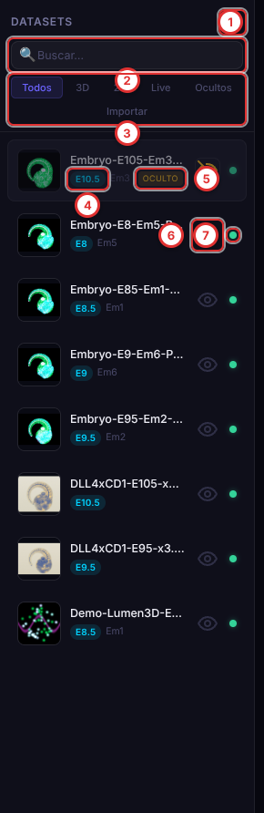{.shot width=100%}
:::::
::::: col
::: legend
| n | qué es |
|-|----------------------|
| 1 | El **número** de conjuntos de datos. |
| 2 | La **búsqueda**: un trozo del nombre y la lista se filtra en directo; la cruz borra. |
| 3 | Los **filtros**: [Todos]{.ui}, **un filtro por tipo de datos** ([3D]{.ui}, [2D]{.ui}, [Live]{.ui}), [Ocultos]{.ui} e [Importar]{.ui}. |
| 4 | El **estadio** del embrión. |
| 5 | La insignia **oculto**: este dataset no es público. |
| 6 | El **ojo**: muestra u oculta el dataset **de inmediato**, sin pasar por [Guardar]{.ui}. |
| 7 | El **punto de color**: [Configurado]{.ui} (verde) o [Sin configurar]{.ui} (ámbar). |
:::
:::::
::::::

- Los nombres de los filtros de tipo son **los que haya elegido** en la pestaña Tipos de datos (capítulo 6). Hay **tres** tipos: el seguimiento de células es una capa de un dataset *Live*, no un tipo aparte.
- El filtro [Importar]{.ui} muestra los datasets cuya transferencia no está publicada (§3.10).
- El **punto de color no es un control de integridad**: verde significa que el dataset ya se guardó al menos una vez desde este panel (o tiene una miniatura); ámbar, que nunca se ha guardado.

::: note
El ojo cambia la visibilidad **al instante** (aviso «Dataset ocultado del explorador.» o «Dataset visible en el explorador.»). Es la única modificación de un dataset que no pasa por [Guardar]{.ui}.
:::

Una lista vacía muestra «No se encontró ningún dataset.». Si la lista no se puede cargar: «No se pudieron cargar los datasets. Compruebe que PHP esté activo.» y un botón [Reintentar]{.ui}.

## 3.3. La columna central: la vista previa

:::::: cols-wide-right
::::: col
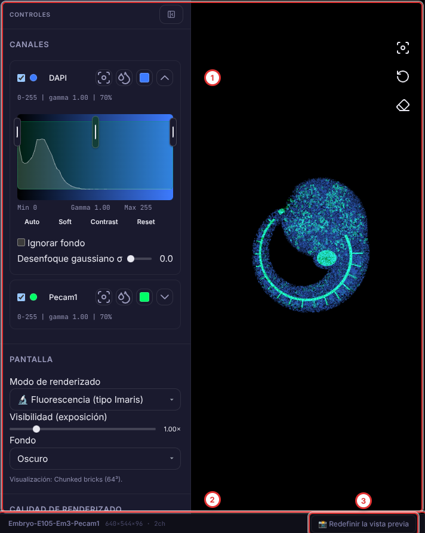{.shot width=100%}
:::::
::::: col
::: legend
| n | qué es |
|-|----------------------|
| 1 | El **visor 3D** (o 2D para una fotografía), tal como lo ve un visitante. |
| 2 | El nombre del dataset y sus **dimensiones** (`X×Y×Z · n canales`, o `X×Y px`). |
| 3 | [📸 Redefinir la vista previa]{.ui}: fija la vista actual como **miniatura** del dataset en el explorador. |
:::
:::::
::::::

Puede hacer girar el volumen, cambiar los colores, ajustar el contraste: exactamente igual que un visitante. La carga de un volumen grande tarda unos segundos (los datos llegan en pequeños bloques).

::: note
Solo se cargan en la vista previa los plugins que aceptan ser **incrustados** (contexto «panel»): Presentation Mode, Download Center, Screenshot y algunos más no aparecen. **No es un error** (véase el capítulo 12).
:::

::: tip
**Redefinir la vista previa**: oriente el volumen como quiere que aparezca en el explorador y haga clic. El botón pasa por «Capturando…» y luego «Guardando…»; un aviso confirma «Vista previa actualizada ✓».
:::

### Lo que la vista previa guarda y lo que olvida

El panel **recupera** algunos ajustes hechos en la vista previa y los guarda cuando hace clic en [Guardar]{.ui}:

- los **ajustes de canales**: nombre, color, mín / máx / gamma, mostrado u oculto;
- el **brillo** (Exposición);
- la **orientación**, si la está definiendo (§3.8).

Todo lo demás —posición de la cámara, modo de renderizado, calidad, fondo, plano de corte— sirve para mirar y **no se conserva**.

## 3.4. La columna de la derecha: los ajustes

:::::: cols-wide-right
::::: col
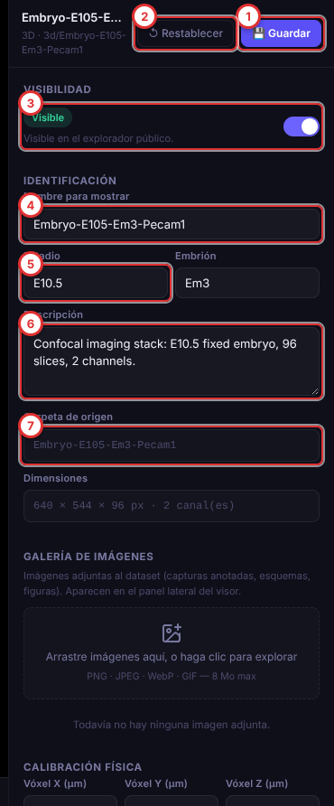{.shot width=100%}
:::::
::::: col
::: legend
| n | qué es |
|-|----------------------|
| 1 | [Guardar]{.ui} (<kbd>Ctrl</kbd> + <kbd>S</kbd>): guarda el formulario. |
| 2 | [↺ Restablecer]{.ui}: descarta sus cambios sin guardar. |
| 3 | **Visibilidad**: el interruptor se aplica **de inmediato**. |
| 4 | **Nombre para mostrar**: el nombre que verán los visitantes. |
| 5 | **Estadio** (y **Embrión**, al lado): las etiquetas de filtrado. |
| 6 | **Descripción**: texto libre de la ficha pública. |
| 7 | **Carpeta de origen** (y **Dimensiones**): en gris, no modificables. |
:::
:::::
::::::

Encabezado de la columna: el nombre del dataset y, debajo, «tipo · identificador» (por ejemplo «3D · 3d/Embryo-E105-Em3-Pecam1»).

**Visibilidad** — una pastilla [Visible]{.ui} («Visible en el explorador público.») u [Oculto]{.ui} («No se muestra en el explorador público.»). Un dataset oculto sigue en el servidor y sigue siendo accesible por su dirección exacta, pero ya no aparece en las listas. Útil durante una comprobación, o para un artículo aún no publicado.

**Identificación**

- **Nombre para mostrar** — sustituye al nombre técnico de la carpeta. Si lo **vacía**, se conserva el nombre anterior.
- **Estadio** y **Embrión** (la etiqueta toma la palabra de su Terminología) — rellenados a partir del nombre de la carpeta; corrija si la detección se ha equivocado. El estadio numérico se recalcula al guardar.
- **Descripción** — lo que ayude a un colega: marcajes, condiciones, particularidades.
- **Carpeta de origen** y **Dimensiones** — leídas de los archivos. Para un volumen: «X × Y × Z px · n canal(es)»; para una fotografía: «X × Y px · 0,xxx µm/px» o «sin calibrar».

::: tech
[Guardar]{.ui} **fusiona** el formulario en `metadata.json` (escritura atómica, bajo bloqueo). El **tipo** y el **identificador** de un dataset nunca se modifican desde el panel. Resultado: aviso «Dataset guardado ✓» o «Error al guardar.».
:::

Un dataset mal formado se **rechaza** en lugar de montarse torcido: aviso «Dataset mal formado, montaje rechazado (motivo)», con un motivo entre: respuesta vacía, identificador faltante, tipo no válido, dimensiones faltantes o no válidas, canales faltantes, falta el bloque de imagen o bloque de imagen no válido.

## 3.5. La galería de imágenes

Una galería permite adjuntar a un dataset **capturas anotadas, esquemas y figuras**. Aparecen en el visor, abajo a la derecha, como miniaturas que se amplían al hacer clic.

:::::: cols-wide-right
::::: col
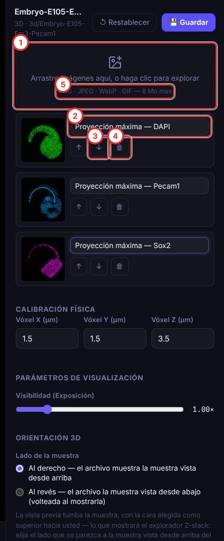{.shot width=100%}
:::::
::::: col
::: legend
| n | qué es |
|-|----------------------|
| 1 | La **zona de depósito**: arrastre imágenes, o haga clic para explorar. |
| 2 | La **leyenda** (opcional, 400 caracteres). |
| 3 | ↑ ↓: **mover** la imagen en el orden de visualización. |
| 4 | 🗑: **eliminar** la imagen (confirmación y luego «Imagen eliminada ✓»). |
| 5 | Formatos: PNG, JPEG, WebP, GIF — 8 MB como máximo. |
:::
:::::
::::::

- **40 imágenes como máximo** por dataset («Máximo 40 imágenes por dataset.»).
- Los **bytes se envían de inmediato** al añadir. El **orden** y las **leyendas** se guardan con [Guardar]{.ui}.
- El formato se reconoce por el **contenido real** del archivo, nunca por su nombre. El tope de 8 MB sigue el límite del servidor si este es más bajo.
- Las miniaturas (320 px) las fabrica el servidor para que la lista siga siendo ligera.
- Un dataset **reimportado como sustitución conserva su galería** (capítulo 4).
- En una importación no publicada, la zona está desactivada: «Publique la importación para poder adjuntarle imágenes.».

Errores posibles: «“X”: formato no admitido (PNG, JPEG, WebP, GIF).», «“X” supera 8 MB.», «No se pudo enviar “X”: …», «No se pudo eliminar la imagen.».

## 3.6. Calibración física y visualización

:::::: cols-wide-right
::::: col
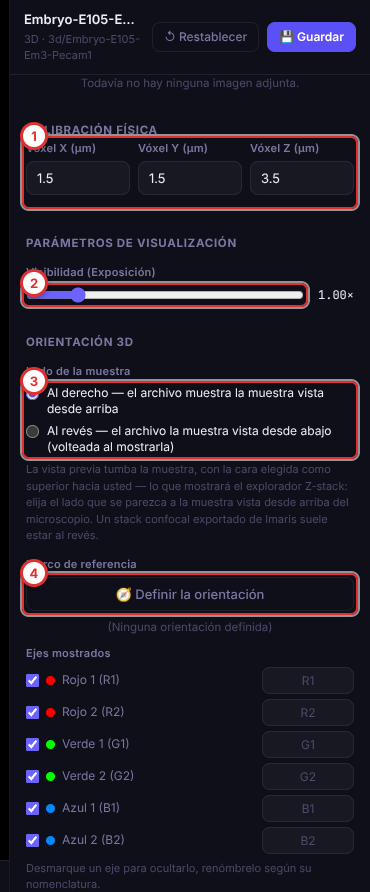{.shot width=100%}
:::::
::::: col
::: legend
| n | qué es |
|-|----------------------|
| 1 | **Vóxel X / Y / Z**: el tamaño real de un vóxel, en µm. |
| 2 | **Visibilidad (Exposición)**: el brillo al abrir. |
| 3 | **Lado de la muestra** (§3.8). |
| 4 | [🧭 Definir la orientación]{.ui} (§3.8). |
:::
:::::
::::::

**Calibración física — el campo más importante.** Los tres valores `Vóxel X / Y / Z` (paso de 0,001) dan el tamaño real de un punto de la imagen, en micrómetros. **Todas las mediciones de los visitantes dependen de ellos**: herramienta de distancia, barra de escala, dimensiones mostradas.

::: warning
Estos valores se leen del archivo del microscopio y normalmente son correctos. **No los modifique salvo que tenga un motivo preciso para creerlos erróneos**: un valor equivocado falsea todas las mediciones publicadas, sin ningún aviso. Un valor vacío o 0 se ignora (se conserva el anterior).
:::

`Vóxel Z` suele ser mucho mayor que X e Y (por ejemplo `0,52 / 0,52 / 3,40`): es normal, la separación entre dos cortes supera la resolución en el plano.

**Parámetros de visualización** — el control deslizante **Visibilidad (Exposición)** (de 0,20× a 5,00×) ajusta el brillo al abrir; sigue al de la vista previa. Si un dataset parece demasiado oscuro, súbalo: los visitantes siempre podrán ajustarlo.

Estas dos secciones están **ocultas para una fotografía 2D** (§3.9).

## 3.7. Configurar los canales

Un volumen contiene varios **canales**, uno por marcaje fluorescente. Aquí decide su aspecto **por defecto**. Los ajustes se hacen en la **barra lateral de la vista previa** y se guardan con [Guardar]{.ui}.

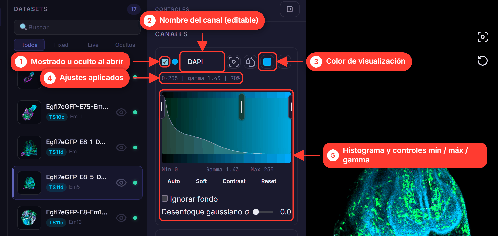{.shot width=70%}

::: legend
| n | qué es |
|-|----------------------|
| 1 | La **casilla**: canal mostrado u oculto al abrir. |
| 2 | El **nombre** del canal: haga clic y escriba para renombrarlo. |
| 3 | El **color** de visualización. |
| 4 | El **resumen** de los ajustes (mín–máx, gamma, opacidad). |
| 5 | El **panel detallado**: histograma y controles deslizantes, mediante el chevrón. |
:::

- **El nombre.** Los canales llegan nombrados «Canal 1», «Canal 2»… Sustitúyalos por el marcaje real: `DAPI`, `GFP`, `Pecam1`.
- **El color.** Algunos se asignan según el nombre: `DAPI` pasa a azul, `GFP` a verde, `Pecam1` a magenta. Si no, colores de reserva: verde, magenta, azul, rojo.
- **Mostrado u oculto.** Desmarque un canal poco informativo (vacío, autofluorescencia): sigue disponible, pero el visitante no lo ve al principio.
- **Mín / máx / gamma.** El histograma muestra el reparto de las intensidades; los tiradores ajustan el umbral bajo, el umbral alto y el gamma. [Auto]{.ui}, [Soft]{.ui} y [Contrast]{.ui} ofrecen ajustes ya preparados; [Restablecer]{.ui} vuelve al punto de partida.
- **Aislar el canal** es un interruptor: una segunda pulsación restablece la visualización anterior.

::: warning
**Estos ajustes son cosméticos, no destructivos.** Cambian la *visualización*, nunca los datos. No olvide [Guardar]{.ui}: sin él, los ajustes de canales se pierden al cambiar de dataset.
:::

## 3.8. La orientación del espécimen

La sección **Orientación 3D** tiene cuatro ajustes, de arriba abajo: el **lado de la muestra**, el **marco de referencia**, los **ejes mostrados** y la **vista por defecto**.

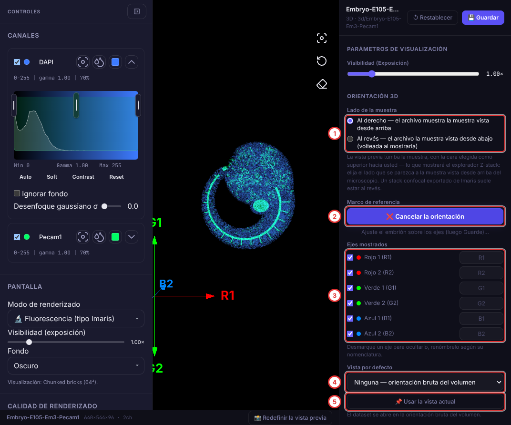{.shot width=88%}

::: legend
| n | qué es |
|-|----------------------|
| 1 | **Lado de la muestra**: dos botones de opción. |
| 2 | [🧭 Definir la orientación]{.ui}: coloca el gizmo de ejes en la vista previa. |
| 3 | **Ejes mostrados**: marcar, ocultar, renombrar. |
| 4 | **Vista por defecto**: la pose de apertura del dataset. |
| 5 | [📌 Usar la vista actual]{.ui}: captura la pose de la vista previa. |
:::

### Lado de la muestra

Dos opciones: «Al derecho — el archivo muestra la muestra vista desde arriba» (por defecto) o «Al revés — el archivo la muestra vista desde abajo (volteada al mostrarla)».

::: tip
Un stack confocal exportado de Imaris suele estar **al revés**. Elija el lado que se parezca a la muestra **vista desde arriba del microscopio**.
:::

En cuanto marca una opción, la vista previa **se tumba** (animación de aproximadamente un segundo), con la cara elegida como *superior* hacia usted: es lo que mostrará el Z-stack browser.

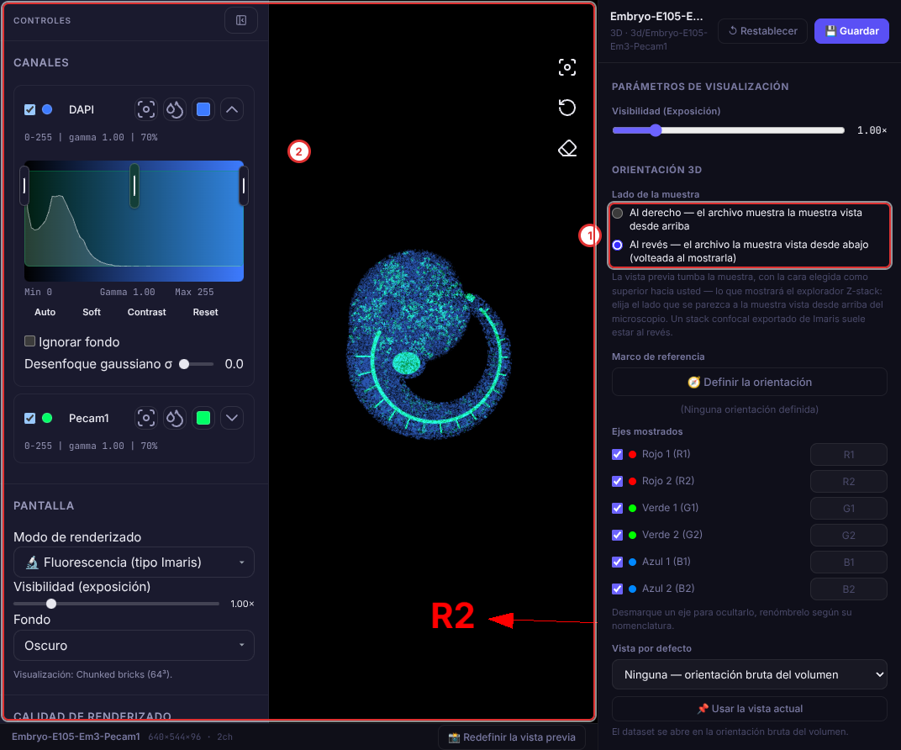{.shot width=88%}

El lado lo tienen en cuenta la vista inicial, el botón de restablecimiento de la vista, la vista «3d» y el Z-stack browser. **No modifica ni el marco ni la vista por defecto**.

### Marco de referencia y ejes

El botón [🧭 Definir la orientación]{.ui} (que pasa a ser [❌ Cancelar la orientación]{.ui}) sirve para indicar dónde están el frente, la parte superior y la derecha del espécimen. Parte de la alineación ya guardada. Aparecen tres ejes de color sobre el volumen, en la vista previa (véase la figura anterior).

| Eje | Color | Mostrado |
|---|---|---|
| **Rojo 1 / Rojo 2** | rojo | R1 / R2 |
| **Verde 1 / Verde 2** | verde | G1 / G2 |
| **Azul 1 / Azul 2** | azul | B1 / B2 |

Los ejes **no imponen ninguna nomenclatura**: en la lista **Ejes mostrados**, desmarque un eje para ocultarlo o renómbrelo (12 caracteres, por ejemplo «anterior», «dorsal»). Los cambios se ven en directo en la vista previa.

**Cómo hacerlo:**

::: steps
1. Haga clic en [🧭 Definir la orientación]{.ui} (estado: «Ajuste el espécimen sobre los ejes (luego Guarde)...»).
2. Haga girar el volumen hasta que el espécimen quede alineado con los ejes.
3. Haga clic en [💾 Guardar]{.ui}. El estado pasa a «Orientación definida ✓».
:::

[❌ Cancelar la orientación]{.ui} sale sin cambiar nada. Sin orientación: «(Ninguna orientación definida)».

### Vista por defecto

La lista **Vista por defecto** elige cómo **se abre** el dataset: «Ninguna — orientación bruta del volumen», o uno de los seis preajustes «frente a la cámara, arriba» que usan **sus nombres de ejes** (por ejemplo «Rojo 1 frente a la cámara, Verde 1 arriba»), o «Personalizada (vista capturada)».

El botón [📌 Usar la vista actual]{.ui} captura la pose hecha en la vista previa (aviso «Vista por defecto definida — guarde para aplicarla.»). Con una vista por defecto, el dataset se abre **directamente en esa pose, sin mostrar los ejes**.

::: note
Los ajustes de orientación dependen del plugin **Orientation Axes** (capítulo 12): si falta, el panel lo indica («El plugin “Orientation Axes” no responde — instálelo para definir una vista por defecto.»). La vista se guarda como una pose *anatómica*: afinar el marco más tarde no la deja obsoleta.
:::

::: warning
Un dataset cuyo lado se cambió con la versión 1.55.7 de la plataforma tiene el marco falseado: **vuelva a definir su orientación**.
:::

## 3.9. Las fotografías 2D

Un dataset de tipo **2D** es **una fotografía calibrada** de estereomicroscopio. La vista previa abre la página 2D; la columna de la derecha se adapta.

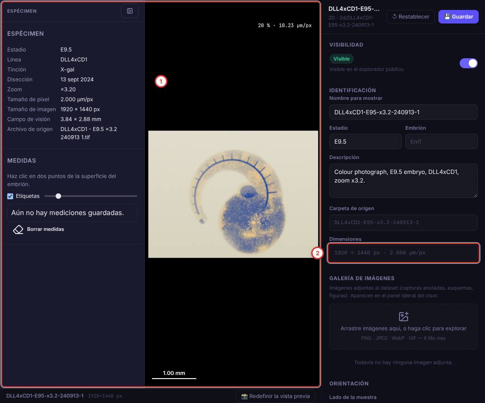{.shot width=88%}

::: legend
| n | qué es |
|-|----------------------|
| 1 | La **vista previa 2D**: fotografía, barra de escala, panel «Espécimen». |
| 2 | **Dimensiones**: «X × Y px · 0,xxx µm/px» (o «sin calibrar»). |
:::

- **Calibración física** y **Parámetros de visualización** están **ausentes**.
- La sección se llama **Orientación**: rotación y espejo (plugin Orientation 2D), sin ejes ni vista por defecto.
- Sin canales: no se fabrica ninguno al guardar.

## 3.10. Los datasets en curso de importación

Un dataset que se está enviando aparece **en esta lista** (filtro [Importar]{.ui}), con una pastilla de estado en lugar del ojo. Abrirlo muestra un **banner de estado** en la parte superior de la columna de la derecha.

:::::: cols-wide-right
::::: col
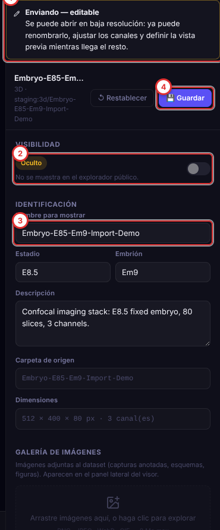{.shot width=100%}
:::::
::::: col
::: legend
| n | qué es |
|-|----------------------|
| 1 | El **banner de estado** (icono, estado, frase de ayuda). |
| 2 | **Visibilidad**: en gris, una importación aún no es pública. |
| 3 | Los campos de identificación: **modificables** en cuanto el estado es «editable». |
| 4 | [Guardar]{.ui}. |
:::
:::::
::::::

| Estado | Lo que puede hacer en la pestaña Datasets |
|---|---|
| **Enviando — no editable** | Nada: formulario bloqueado, vista previa sustituida por un mensaje. |
| **Enviando — editable** | Editarlo todo **salvo** Visibilidad y Galería. |
| **Enviado — listo para publicar** | Lo mismo. La publicación se hace en la pestaña Importar. |
| **Interrumpido** | Nada: formulario bloqueado. |

El banner y el formulario se **actualizan solos** cuando cambia el estado. El botón [Editar]{.ui} de la pestaña Importar abre directamente el dataset correcto, aquí.

## 3.11. Cuando no hay ningún conjunto de datos seleccionado

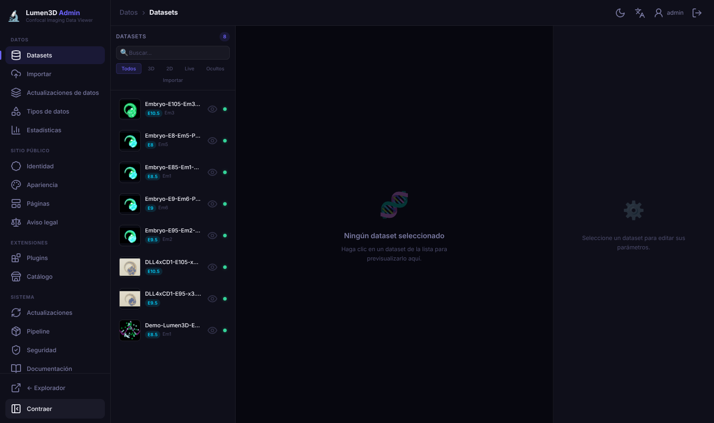{.shot width=80%}

Es la pantalla de inicio de la pestaña: «Ningún dataset seleccionado — Haga clic en un dataset de la lista para previsualizarlo aquí.». **No** existe botón para eliminar un dataset ni para «regenerar el catálogo»: eliminar es una operación sobre los archivos del servidor, a propósito, y la lista se recalcula cada vez que se muestra.

# 4. Importar — enviar datos desde el navegador

::: chapter-intro
- **Arrastre la carpeta** producida por el pipeline: ya no hace falta FTP.
- La transferencia se **reanuda** donde se detuvo y se **verifica** byte a byte.
- Nada es público antes de su clic en [Publicar]{.ui} (y luego en el ojo, en Datasets).
:::

::: analogy
**Un paquete con seguimiento, entregado en una consigna.** Sus archivos viajan a una zona privada del servidor, inaccesible por URL. A la llegada, el servidor **pesa y controla** el paquete. Solo usted decide después **ponerlo en la estantería** (Publicar) y luego **abrirlo al público** (el ojo).
:::

## 4.1. La pestaña vacía

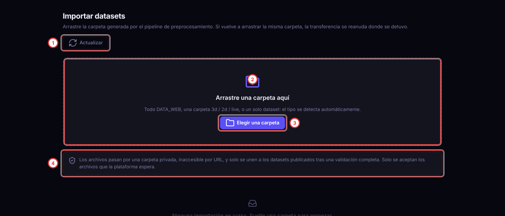{.shot width=88%}

::: legend
| n | qué es |
|-|----------------------|
| 1 | [Actualizar]{.ui}: vuelve a leer las importaciones pendientes en el servidor. |
| 2 | La **zona de depósito**: suelte aquí una carpeta (o haga clic en cualquier punto de ella). |
| 3 | [Elegir una carpeta]{.ui}: el selector de carpetas del navegador. |
| 4 | El **banner de seguridad**: zona privada, validación antes de publicar, solo los archivos esperados. |
:::

Puede soltar **todo `DATA_WEB`**, una carpeta `3d` / `2d` / `live`, o **un solo dataset**: el tipo se lee del `metadata.json` de cada dataset, a cualquier profundidad. Hay que soltar **la carpeta del dataset, no su contenido**: el nombre de la carpeta pasa a ser el identificador.

::: tip
Una carpeta soltada **al lado** de la zona se ignora: el navegador no abandona la página y la transferencia en curso no se pierde.
:::

## 4.2. Una transferencia en curso

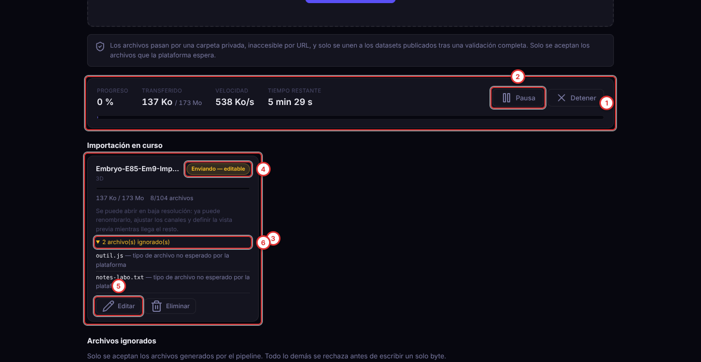{.shot width=88%}

::: legend
| n | qué es |
|-|----------------------|
| 1 | El **progreso global**: [Progreso]{.ui}, [Transferido]{.ui}, [Velocidad]{.ui}, [Tiempo restante]{.ui}, y la barra. |
| 2 | [Pausa]{.ui} (pasa a [Reanudar]{.ui}); al lado, [Detener]{.ui}. |
| 3 | La **tarjeta de un dataset**: nombre, tipo, bytes, número de archivos. |
| 4 | La **pastilla de estado** (véase §4.3). |
| 5 | [Editar]{.ui}: abre el dataset en la pestaña Datasets, antes del final de la transferencia. |
| 6 | El menú **«n archivo(s) ignorado(s)»**: lo que se ha rechazado en este dataset. |
:::

- [Detener]{.ui} pide confirmación: «¿Detener la transferencia? Los archivos ya enviados se conservan y la transferencia se reanudará si vuelve a arrastrar la carpeta.».
- [Reintentar]{.ui} aparece si quedan archivos con error.
- Si cae la red: «Conexión perdida: la transferencia se reanudará sola cuando vuelva la red.».
- La mención «ya publicado» aparece si un dataset publicado lleva el mismo nombre.

## 4.3. Los cinco estados de una importación

| Estado | Qué significa | Qué hacer |
|---|---|---|
| **Enviando — no editable** | Aún no han llegado todos los archivos indispensables para abrirlo (metadatos, manifiesto, miniatura, nivel más grueso). | Esperar. |
| **Enviando — editable** | «Se puede abrir en baja resolución: ya puede renombrarlo, ajustar los canales y definir la vista previa mientras llega el resto.» | [Editar]{.ui}, [Guardar]{.ui}. |
| **Enviado — listo para publicar** | «Transferencia completa e integridad verificada. Publíquelo para moverlo a los datasets publicados.» | [Editar]{.ui}, [Verificar]{.ui}, [Publicar]{.ui}, [Eliminar]{.ui}. |
| **Interrumpido** | «Vuelva a arrastrar la misma carpeta para reanudar donde se detuvo la transferencia.» | Volver a arrastrar la **misma carpeta**. |
| **Publicado** | Movido a los datasets publicados, **oculto** del público hasta que lo active. | Ir a Datasets. |

::: warning
Una importación **interrumpida** no se guarda indefinidamente: la tarjeta muestra «purga en {d}» y, pasados **7 días** sin reanudarla, el servidor libera el espacio. Una importación «Enviado — listo para publicar», en cambio, **nunca** se purga automáticamente.
:::

::: why
**¿Por qué «editable» tan pronto?** Los archivos salen por **niveles de prioridad**: primero `metadata.json`, el manifiesto y la miniatura; luego el nivel más grueso de cada canal, los niveles intermedios, el nativo y, por último, `planes/`, `mips/` y `download/`. Tras los dos primeros niveles, un dataset se puede abrir y editar **minutos** después del comienzo de una transferencia que puede durar horas. El `metadata.json` que usted edita queda entonces **bloqueado**: el resto de la transferencia no lo sobrescribe.
:::

## 4.4. Cuando la transferencia ha terminado

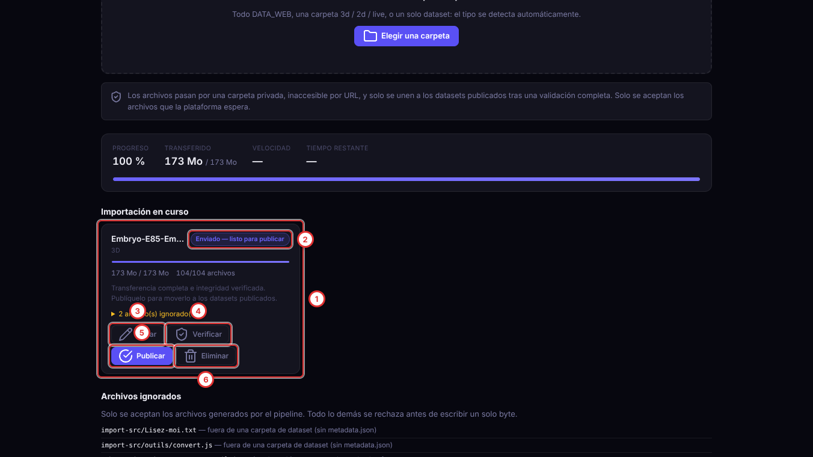{.shot width=88%}

::: legend
| n | qué es |
|-|----------------------|
| 1 | La tarjeta del dataset: 100 %, todos los archivos. |
| 2 | El estado **Enviado — listo para publicar**. |
| 3 | [Editar]{.ui}: renombrar, ajustar canales y orientación. |
| 4 | [Verificar]{.ui}: lanza la validación de integridad. |
| 5 | [Publicar]{.ui}: mueve el dataset a los datasets publicados. |
| 6 | [Eliminar]{.ui}: borra los archivos ya enviados. |
:::

**[Verificar]{.ui}** vuelve a leer todo lo que ha llegado y comprueba que cada índice de ladrillos (bricks) apunta a paquetes realmente presentes. Aviso «Dataset válido ✓», o «Validación fallida: » seguido de códigos (por ejemplo `missing_pack:…`: falta un paquete; `truncated_pack:…`: un paquete está truncado; `incomplete_files`; `stray_files`; `index_hash_mismatch`).

**[Publicar]{.ui}**: aviso «Dataset publicado ✓ (oculto del explorador: actívelo en la pestaña Datasets)».

::: warning
**Publicar no hace público el dataset.** Llega **oculto**. Vaya a Datasets, ábralo y active [Visibilidad]{.ui}.
:::

**Sustituir un dataset ya publicado**: si el nombre ya existe, el panel pregunta «Ya hay un dataset publicado con este nombre. ¿Reemplazarlo? Su galería y los campos que rellenó (nombre, orientación, leyendas…) se conservan si la nueva importación no los aporta.». Tras la sustitución, un aviso enumera lo que se ha conservado (la galería, etc.). Atención: un `metadata.json` producido por el pipeline siempre contiene un nombre, así que se muestra **el nuevo nombre**. La orientación y la galería sí se conservan de la versión anterior.

**[Eliminar]{.ui}**: «¿Eliminar definitivamente los archivos ya enviados de este dataset?» y luego «Importación eliminada.». Disponible en todos los estados salvo **Publicado**.

## 4.5. Los archivos ignorados

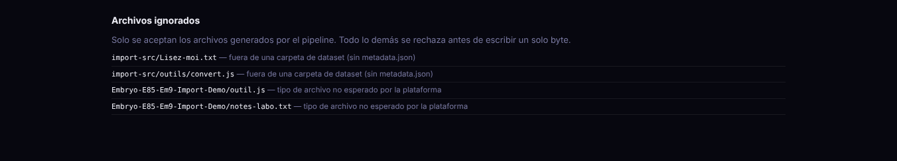{.shot width=88%}

Solo se aceptan los archivos que produce el pipeline. **Todo lo demás se rechaza antes de escribir un solo byte**: los `.php` y `.js`, los archivos ocultos, las rutas ascendentes (`../`) y los archivos fuera de una carpeta de dataset.

| Motivo mostrado | Qué significa |
|---|---|
| tipo de archivo no esperado por la plataforma | El pipeline no escribe este tipo de archivo. |
| fuera de una carpeta de dataset (sin metadata.json) | El archivo no está dentro de un dataset. |
| ruta rechazada, tamaño no válido | Nombre o tamaño inaceptable. |
| elemento(s) ilegible(s) al leer la carpeta | Hay que revisar los permisos locales. |

Son **advertencias**, no bloqueos: el resto de la importación continúa.

## 4.6. El dock flotante

En cuanto hay una importación que señalar, un pequeño **dock** se ancla abajo a la derecha, **en todas las pestañas**: puede trabajar en otra parte mientras se envía. Tiene tres tamaños, que el navegador recuerda.

:::: cols
::: col
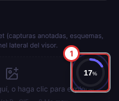{.shot width=70%}

| n | qué es |
|-|----------------------|
| 1 | Anillo de progreso y porcentaje. Un clic lo agranda. |
:::
::: col
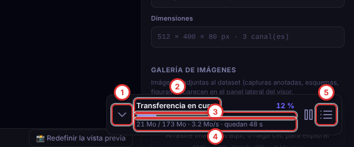{.shot width=88%}

| n | qué es |
|-|----------------------|
| 1 | Chevrón: reducir a burbuja. |
| 2–4 | Título de estado, barra, velocidad y tiempo restante. |
| 5 | [Detalles]{.ui}: abre el panel. |
:::
::::

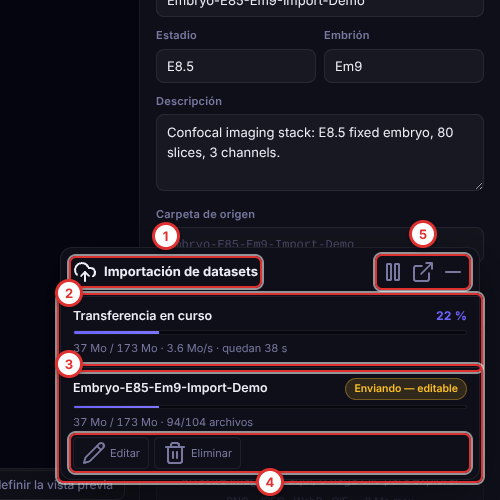{.shot width=70%}

::: legend
| n | qué es |
|-|----------------------|
| 1 | Título «Importación de datasets». |
| 2 | El progreso global. |
| 3 | Una **línea por dataset**: nombre, estado, barra, bytes, archivos. |
| 4 | [Editar]{.ui}, [Publicar]{.ui}, [Eliminar]{.ui}. |
| 5 | Abrir la pestaña Importar, reducir. |
:::

Títulos de estado del dock: «Transferencia en curso», «Transferencia en pausa», «Transferencia completada», «Terminado con {n} archivo(s) con error», «Conexión perdida, reanudación automática», «Importaciones pendientes»…

## 4.7. Salir durante una transferencia

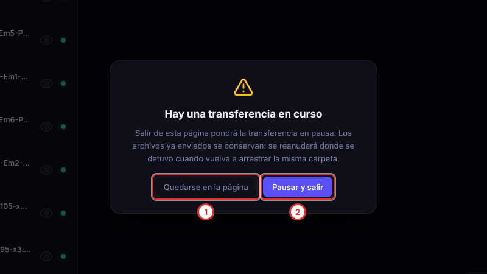{.shot width=70%}

::: legend
| n | qué es |
|-|----------------------|
| 1 | [Quedarse en la página]{.ui}: la transferencia continúa. |
| 2 | [Pausar y salir]{.ui}: la transferencia se pone en pausa y los archivos enviados se conservan. |
:::

Este mensaje aparece cuando hace clic en **cerrar sesión** o en un enlace que sale del panel. Cerrar o recargar la pestaña activa el cuadro de diálogo habitual del navegador; antes, la transferencia se pone en pausa. Para reanudar: **vuelva a arrastrar la misma carpeta**.

## 4.8. Bajo el capó

::: tech
- La transferencia corre en un **Web Worker**: la interfaz sigue fluida. Bloques brutos de **8 MiB** (reducidos en un alojamiento PHP con límites estrictos: «Tamaño de bloque reducido a {n}: vuelva a soltar la carpeta para reanudar.»), **4 bloques en paralelo**.
- Cada bloque lleva una **huella SHA-256** verificada **antes** de escribir. Un **registro del servidor** recuerda los bloques recibidos: volver a arrastrar la misma carpeta reanuda **al bloque exacto**; un archivo ya completo no se reenvía.
- El registro es el mismo con los dos servidores (Python o PHP): una importación empezada con uno puede reanudarse con el otro.
- Formatos aceptados: los **formatos 2 a 4** (`planes/`, `mips/`, ladrillos v3 e `index.bin`).
:::

## 4.9. Si algo sale mal

| Mensaje | Qué hacer |
|---|---|
| No se detectó ningún archivo en esta acción. | La carpeta está vacía o es ilegible: vuelva a soltarla. |
| No se encontró ningún dataset: la carpeta debe contener un metadata.json. | Suelte la carpeta producida por el pipeline. |
| Suelte la CARPETA del dataset, no su contenido… | Vuelva a arrastrar la carpeta superior. |
| Tipo de dataset no encontrado… | `metadata.json` debe declarar `"type"`: `3d`, `2d` o `live`. |
| Las importaciones requieren una conexión segura (HTTPS o localhost). | Abra el panel en `https://`: las huellas SHA-256 lo exigen. |
| Espacio en disco insuficiente en el servidor (… necesarios, … libres) | Libere espacio. El control se hace **antes** de enviar. |
| «X» supera el tamaño que el servidor acepta para un archivo. | Límite del servidor, a consultar con el proveedor de alojamiento. |
| Sesión expirada: vuelva a iniciar sesión y arrastre la carpeta de nuevo. | Vuelva a conectarse y arrastre de nuevo. |
| Fallo en {ruta} / {n} archivo(s) no se pudieron enviar. | [Reintentar]{.ui}, o vuelva a arrastrar la carpeta. |
| El servidor no responde… / El motor de transferencia no pudo iniciarse. | Compruebe la conexión, recargue la página y vuelva a arrastrar. |
| Todo está ya enviado: nada que transferir. | Información: el dataset ya está completo. |

# 5. Actualizaciones de datos — el formato de los conjuntos de datos

::: chapter-intro
- Un conjunto de datos publicado tiene un **formato** (1 a 4). El formato actual es el **4**.
- Esta pestaña los lleva al día **en el sitio**, como una actualización de software.
- Usted elige **quién trabaja**: este navegador o el servidor. Nada es obligatorio.
:::

::: analogy
**La mudanza de una biblioteca a estanterías nuevas.** Los libros (sus píxeles) no cambian; se añaden **índices** y **baldas mejor organizadas** para que salgan más deprisa. Si la mudanza se interrumpe, se retoma en la caja donde se había quedado.
:::

## 5.1. Por qué y para quién

Cada dataset volumétrico (`3d`, `live`) lleva un **formato de datos** (`formatVersion`; ausente = formato 1). Un dataset salido del pipeline **0.21.0** ya está en **formato 4**: **no** tiene nada que hacer. Las **fotografías 2D** nunca están afectadas.

::: note
**Las actualizaciones de datos no son necesarias para que el sitio funcione.** El visor siempre lee los formatos 1, 2, 3 y 4; el Studio recurre a los ladrillos (bricks) si falta `planes/`. **Aceleran** algunas operaciones del Studio y **mejoran** la calidad de visualización.
:::

## 5.2. Los tres pasos

Se encadenan en orden: un dataset en formato 1 recibe los tres.

| Paso | Título en pantalla | Qué crea | Qué aporta |
|---|---|---|---|
| **1 → 2** | Copia por planos del nivel nativo (cortes XY rápidos en el Studio) | `planes/`: un archivo por plano z, teselas PNG de 512² sin pérdida (≈ 1,3× el nivel nativo en espacio de disco). Los ladrillos no se tocan. | Un corte XY nativo lee **un plano** en lugar de una capa de 64 planos: decenas de veces menos bytes, resultado idéntico al píxel. |
| **2 → 3** | Proyecciones máximas de cada capa de ladrillos (figuras z-stack de toda la pila rápidas) | `mips/`: una proyección máxima por capa de 64 planos. | Una figura z-stack sobre toda la pila lee ~3 paquetes en lugar de unos 150. |
| **3 → 4** | Pirámide de ladrillos v3: reducida también en Z, borde de un vóxel, índice binario | **Reconstruye** `bricks/`: ladrillos 66³ con borde, niveles reducidos también en Z, `index.bin`. | Filtrado sin costuras, detalle local («Zoom detail»), atlas más ligeros para 1 a 2 canales. |

::: warning
**El paso 3 → 4 reconstruye el árbol `bricks/`.** El **nivel nativo se conserva vóxel a vóxel**; los niveles más gruesos se recalculan. El árbol antiguo se elimina **después** del cambio de versión. Para datos valiosos, guarde una copia de seguridad, como en cualquier operación sobre archivos.
:::

## 5.3. Vista general de la pestaña

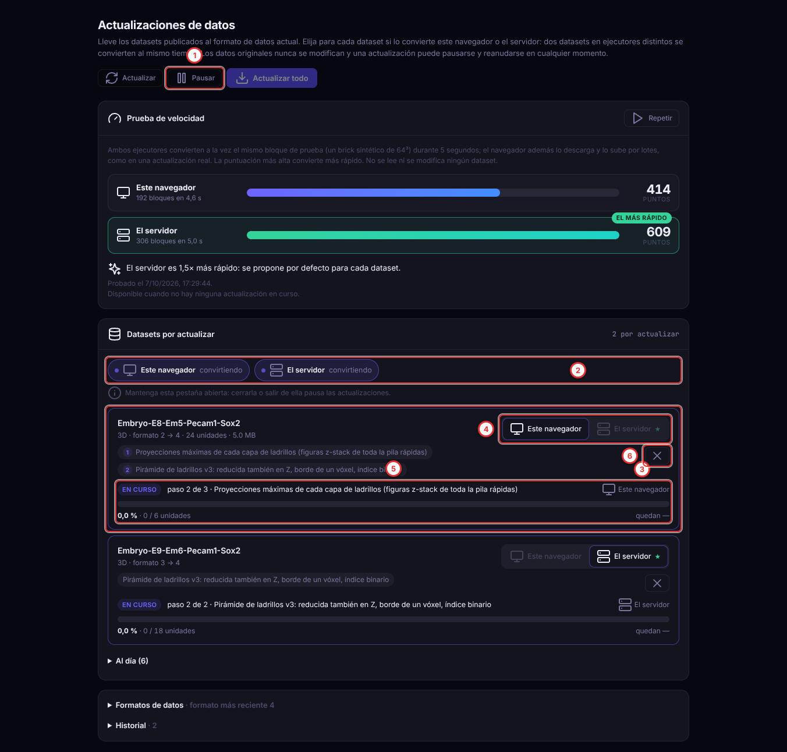{.shot width=88%}

::: legend
| n | qué es |
|-|----------------------|
| 1 | [Pausa]{.ui} (o [Reanudar]{.ui}); al lado [Actualizar]{.ui} y [Actualizar todo]{.ui}. |
| 2 | La **banda de las dos colas**: una pastilla por ejecutor, con su estado. |
| 3 | La **tarjeta de un dataset**: nombre, tipo, «formato 1 → 4», unidades y tamaño estimados, **pasos** numerados. |
| 4 | El **selector de ejecutor**: [Este navegador]{.ui} o [El servidor]{.ui}. |
| 5 | La zona de **progreso**: «paso i de n», barra, porcentaje, unidades hechas, **tiempo restante**, unidades por minuto. |
| 6 | La cruz: **cancelar**: «¿Descartar el progreso de esta actualización? El conjunto de datos queda como estaba.» |
:::

De arriba abajo: el encabezado y sus botones, la tarjeta **Prueba de velocidad**, la tarjeta **Datasets por actualizar** y tres paneles plegables: **Al día**, **Formatos de datos** e **Historial**. [Actualizar todo]{.ui} procesa todos los datasets listos, uno por ejecutor a la vez.

Todo al día: «Todos los datasets están en el formato más reciente.». Ningún volumen publicado: «Ningún conjunto de datos volumétrico publicado.».

## 5.4. ¿Este navegador o el servidor?

Dos «ejecutores» pueden hacer el trabajo:

| Ejecutor | Quién calcula | Qué hace falta |
|---|---|---|
| **Este navegador** | Su navegador descarga los ladrillos, los recompone (Web Workers) y devuelve el resultado **unidad por unidad**. | Un navegador que sepa comprimir, releer los PNG de forma idéntica y codificar WebP sin pérdida. |
| **El servidor** | El servidor convierte por sí mismo, con pequeñas peticiones limitadas en el tiempo. Adaptado a los alojamientos compartidos. | Decodificación (y, para el paso 3 → 4, codificación) de WebP sin pérdida (GD de PHP o Pillow de Python), zlib, NumPy en el lado de Python, al menos 128 MiB por petición y 10 s de ejecución. |

- La elección se hace **por dataset**, **antes** de empezar; queda **bloqueada durante la ejecución** y se puede modificar entre dos ejecuciones.
- Un ejecutor incapaz aparece **en gris**, con una información emergente que dice por qué (por ejemplo «el servidor no puede decodificar imágenes WebP sin pérdida»).
- Cada ejecutor tiene **su propia cola**: un dataset en el navegador y otro en el servidor se convierten **al mismo tiempo**.
- Un paso que el ejecutor elegido no sabe hacer se confía al otro. Si ninguno puede: «sin ejecutor» en rojo.
- La pastilla **★** marca el ejecutor **más rápido en la prueba de velocidad**.
- Ambos escriben en **el mismo registro** del servidor: se puede cambiar de ejecutor y reanudar.

::: tip
En un alojamiento compartido donde la opción [El servidor]{.ui} aparece en gris, **[Este navegador]{.ui} funciona siempre**: es él quien trabaja y el servidor solo almacena.
:::

## 5.5. La prueba de velocidad

Un solo botón: [Lanzar la prueba (5 s)]{.ui} (y luego [Repetir]{.ui}). Durante 5 segundos (dos barras en carrera, una por ejecutor), el navegador **y** el servidor convierten **a la vez** el mismo bloque sintético (un ladrillo 64³ incluido con la plataforma). **No se lee ni se modifica ningún dataset.**

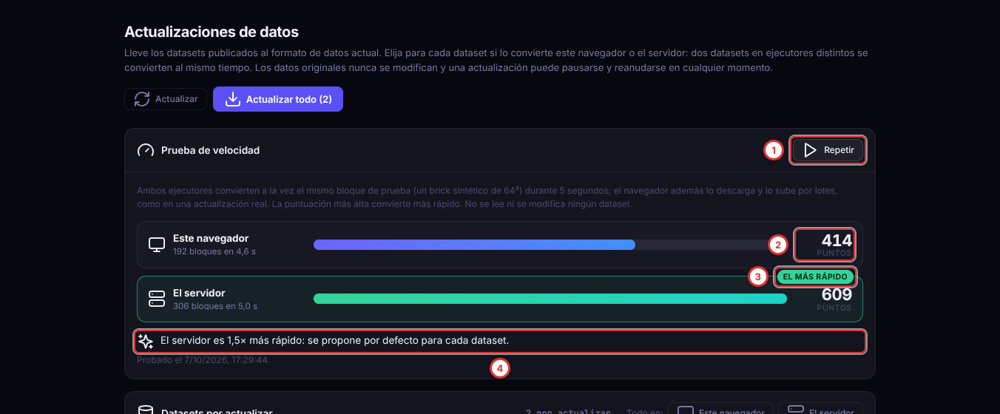{.shot width=88%}

::: legend
| n | qué es |
|-|----------------------|
| 1 | [Repetir]{.ui} la prueba. |
| 2 | La puntuación de **Este navegador**. |
| 3 | La insignia **El más rápido**. |
| 4 | El **veredicto**: «El servidor es 1,2× más rápido: se propone por defecto para cada dataset.» |
:::

Si ambos son igual de rápidos: «Ambos ejecutores son igual de rápidos: elija cualquiera.». Un lado inutilizable muestra **su motivo** en lugar de una puntuación. El resultado se conserva en este navegador («Probado el …»). La prueba no está disponible durante una actualización.

## 5.6. Lanzar una actualización, paso a paso

::: steps
1. (Opcional) Lance la **prueba de velocidad**.
2. Para cada dataset, elija el **ejecutor** (la ★ se propone de oficio).
3. Haga clic en [Actualizar]{.ui}, o en [Actualizar todo ({n})]{.ui}.
4. **Mantenga la pestaña abierta** hasta el final: «Mantenga esta pestaña abierta: cerrarla o salir de ella pausa las actualizaciones.»
5. Un aviso «{nombre} actualizado al formato {v}» confirma cada dataset terminado.
:::

El botón principal se llama [Reparar]{.ui} si el dataset se declara al día pero su estructura falta o no es válida (pastilla «reparación»), [Reanudar]{.ui} si un trabajo está en pausa y [Reintentar]{.ui} tras un fallo.

## 5.7. Durante la conversión

Estados mostrados: **Esperando su turno** («siguiente en el servidor»), **En curso**, **Pausando…**, **En pausa** (con la causa: pestaña abandonada, página cerrada, sesión caducada, servidor inalcanzable), **Ensamblando** («Ensamblando planos x/y», «ensamblando y publicando…»), **Error** (con la causa).

- **[Pausa]{.ui}** pone en pausa todas las colas; **[Reanudar]{.ui}** retoma donde se habían detenido.
- **Abandonar la pestaña**: «Hay una actualización en curso. Salir de esta pestaña la pausa (podrá reanudarla después). ¿Salir?». **No se pierde nada**: el registro del servidor permite reanudar tras una recarga, un corte o un cambio de ejecutor.

::: warning
**No lance la misma actualización en varias pestañas**, y no la relance en bucle. En la versión 1.59.1, una avalancha de peticiones llevó a un proveedor de alojamiento a **bloquear la dirección** de un operador. Desde la 1.59.2, **todas** las peticiones de la pestaña pasan por un **regulador** (6 en vuelo como máximo; desde la 1.59.3, de 4 a 6 por segundo, porque cada unidad lee todos sus datos de entrada en una sola petición; reduce el ritmo y hace una pausa cuando el host responde con lentitud o devuelve 429 / 503). Puede ver: «El servidor responde con lentitud: las solicitudes se ralentizan para que no bloquee esta dirección.» o «Conexión perdida: esperando la red, no se pierde nada.». **Deje que actúe.**
:::

## 5.8. Los paneles de abajo

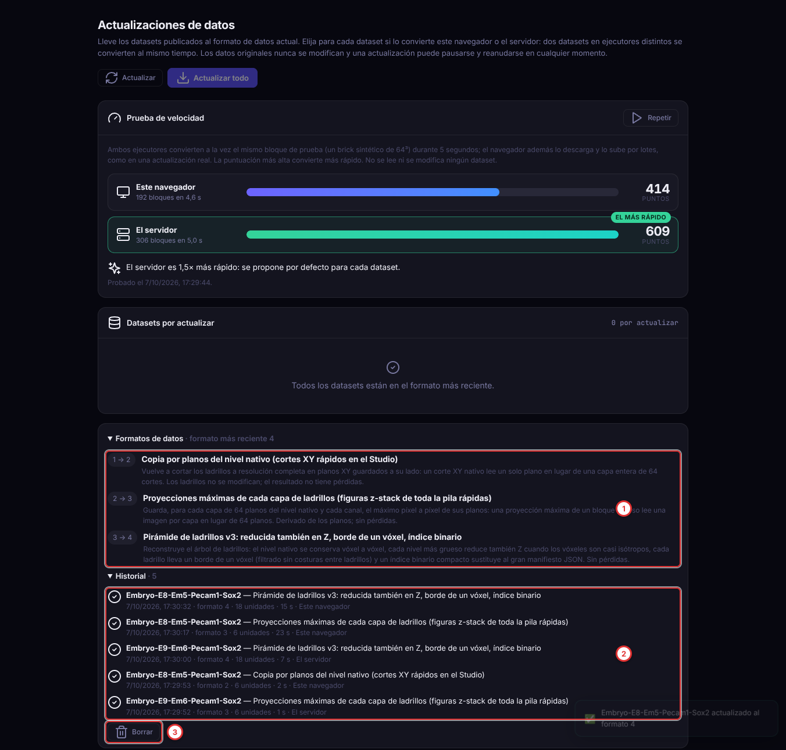{.shot width=88%}

::: legend
| n | qué es |
|-|----------------------|
| 1 | **Formatos de datos**: el formato más reciente (4) y la lista de las tres actualizaciones («1 → 2»…). |
| 2 | **Historial**: las 20 últimas operaciones, guardadas en este navegador. |
| 3 | [Borrar]{.ui}: vacía el historial. |
:::

Una línea del historial indica «formato {v} · {n} unidades · {duración} · {ejecutor}», o el **motivo del fallo**. El panel **Al día (n)** enumera los datasets que ya tienen el formato correcto.

## 5.9. Salvaguardas y errores

- **Disco**: el panel se niega a empezar si el resultado no cabe («espacio en disco insuficiente en el servidor (necesario / libre)»).
- **Datos de origen**: nunca se modifican antes del cambio final; el paso final es **reanudable** y se hace bajo el mismo bloqueo que el editor de datasets.
- **Dataset reprocesado entretanto**: «el conjunto de datos se reprocesó desde que empezó la actualización» → [Reintentar]{.ui} parte de cero. Un dataset eliminado **nunca se vuelve a crear**.
- **Servidor demasiado lento para una unidad** (alojamiento compartido): el paso pasa solo **al navegador** tras dos peticiones fallidas.

| Mensaje | Qué hacer |
|---|---|
| Sesión caducada: vuelva a iniciar sesión y reanude. | Vuelva a conectarse y pulse [Reanudar]{.ui}. |
| La actualización de {nombre} falló: … | Lea la causa; [Reintentar]{.ui}, o cambie de ejecutor. |
| Ningún ejecutor puede realizar todos los pasos de: … | Pruebe [Este navegador]{.ui}, o reprocese con el pipeline. |
| Actualización de {nombre} detenida: el servidor no puede convertir una unidad dentro de su límite de tiempo | Vuelva a lanzarla en este navegador. |
| No se pudo leer el estado de las actualizaciones. | [Actualizar]{.ui}. |

# 6. Tipos de datos — el nombre público de cada categoría

::: chapter-intro
- La plataforma clasifica cada dataset en una de **tres categorías**: 3D, 2D, Live.
- Usted decide la **palabra** que ve el público para cada una.
- Solo cambia **nombres mostrados**: nunca una carpeta, una dirección o un archivo.
:::

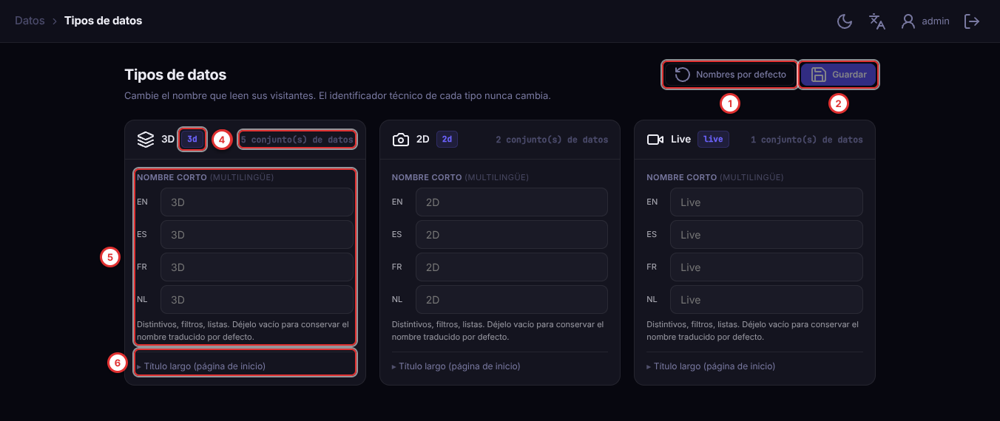{.shot width=88%}

::: legend
| n | qué es |
|-|----------------------|
| 1 | [Nombres por defecto]{.ui}: vacía los campos (después hay que [Guardar]{.ui}). |
| 2 | [Guardar]{.ui} (<kbd>Ctrl</kbd> + <kbd>S</kbd>), activo solo si hay una modificación. |
| 3 | El **identificador técnico** del tipo (`3d`, `2d`, `live`): no modificable. |
| 4 | El número de **conjuntos de datos** publicados de este tipo. |
| 5 | **Nombre corto (multilingüe)**: una línea por idioma (EN, FR, ES, NL). |
| 6 | **Título largo (página de inicio)**: panel plegable. |
:::

| Categoría | Qué contiene | Nombre por defecto (español) |
|---|---|---|
| **3D** (`3d`) | Un volumen fijo: pila de imágenes 3D multicanal | 3D · «Imagen 3D» |
| **2D** (`2d`) | Una fotografía calibrada de estereomicroscopio | 2D · «Imagen 2D» |
| **Live** (`live`) | Una serie temporal 4D, con el seguimiento de sus células si lo hay | Live · «Imagen en vivo» |

- **Nombre corto** — insignias, filtros, listas. **Título largo** — tarjetas grandes de la página de inicio.
- **Deje un campo vacío para conservar el nombre por defecto**: la plataforma recurre entonces a su propia traducción, en el idioma del visitante.
- [Nombres por defecto]{.ui} pregunta «¿Restaurar los nombres traducidos por defecto para todos los tipos?». **Vacía** los campos, no escribe ningún texto fijo.
- Resultado: aviso «Nombres de los tipos guardados.» (o «No se pudo guardar.»).

::: note
**Lo que esta pestaña no cambia.** Ni las carpetas del servidor (`DATA_WEB/3d/`, `DATA_WEB/2d/`, `DATA_WEB/live/`), ni las direcciones de las páginas, ni los enlaces que sus visitantes ya hayan guardado, ni nada dentro de los datasets. **No crea** ninguna categoría: los tres tipos son los que el software sabe mostrar. El seguimiento celular **no** es un tipo: es una capa de un dataset Live.
:::

Las variables de página `{type3d}`, `{type2d}` y `{typeLive}` (capítulo 10) toman estos nombres. La pestaña solo escribe el bloque `datasetTypes` de la configuración: no sobrescribe lo que haya hecho en Identidad. Le avisa si sale con cambios sin guardar.

# 7. Estadísticas — quién consulta qué

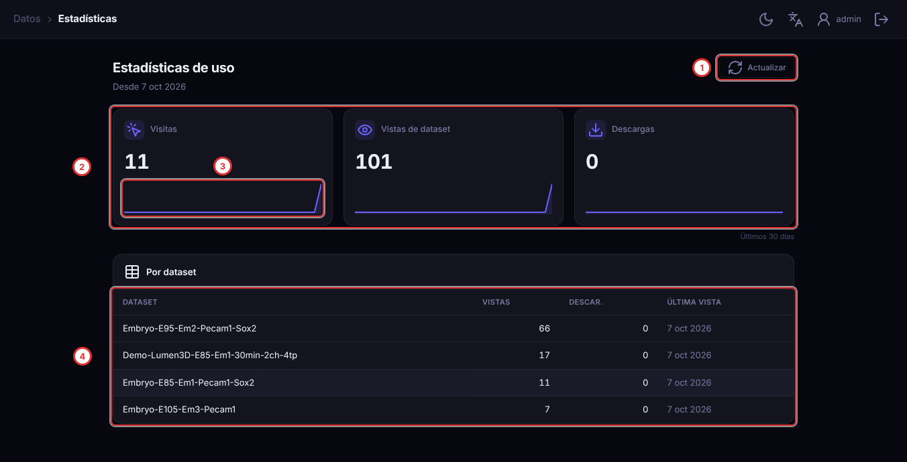{.shot width=88%}

::: legend
| n | qué es |
|-|----------------------|
| 1 | [Actualizar]{.ui}: recarga las cifras. |
| 2 | Tres **contadores** acumulados desde la instalación. |
| 3 | La pequeña curva de los **últimos 30 días**. |
| 4 | El detalle **por conjunto de datos**; haga clic en un encabezado (Dataset, Vistas, Descar.) para ordenar. |
:::

- **Visitas** — aperturas de la página de inicio, contadas una vez por pestaña del navegador.
- **Vistas de dataset** — veces que se ha abierto un conjunto de datos en el visor: el indicador más elocuente.
- **Descargas** — archivos recuperados desde el Download Center.

La tabla «Por dataset» da vistas, descargas y última consulta. Sin datos: «Aún no hay datos de uso.». Cambiar el nombre de un tipo no altera estas cifras.

::: note
**No se recoge ningún dato personal.** Son simples contadores: ni cookie de seguimiento, ni dirección IP registrada, ni servicio externo. Nada sale del servidor. Además, el servidor limita el ritmo de las señales de estadísticas.
:::

# 8. Identidad — el nombre y el vocabulario del sitio

::: chapter-intro
- Cambie **por completo** el nombre del sitio, sin tocar el código.
- La **palabra** que designa sus objetos de estudio (embrión, muestra, órgano…) se usa en **todas partes**.
- Cada texto existe **por idioma**: EN, FR, ES, NL.
:::

Esto es lo que permite que la misma plataforma sirva a un laboratorio de embriología o a un instituto de neurociencias. Título real de la página: «Identidad y personalización».

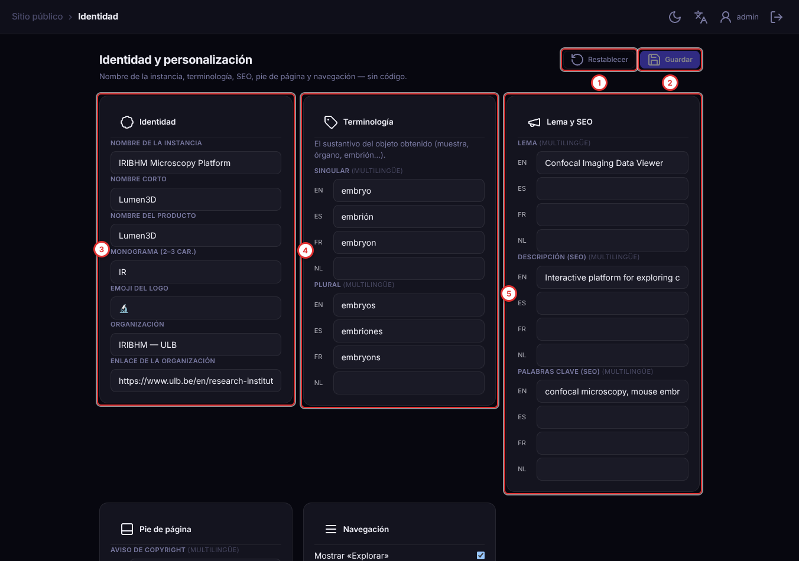{.shot width=88%}

::: legend
| n | qué es |
|-|----------------------|
| 1 | [Restablecer]{.ui}: vuelve a los valores por defecto («Se eliminará el contenido específico.»). |
| 2 | [Guardar]{.ui}: activo en cuanto cambia un campo. |
| 3 | Tarjeta **Identidad**: los nombres de su sitio. |
| 4 | Tarjeta **Terminología**: la palabra que designa sus objetos de estudio. |
| 5 | Tarjeta **Lema y SEO**. |
| 6 | Un campo **multilingüe**: una línea por idioma. |
:::

## 8.1. Los campos multilingües

Los campos **(multilingüe)** muestran **una línea por idioma disponible**: `EN`, `FR`, `ES`, `NL`.

::: tip
**Rellene siempre `EN` como mínimo.** Es la versión de reserva: si un visitante lee el sitio en neerlandés y `NL` está vacío, ve el texto en inglés, nunca un hueco.
:::

## 8.2. Tarjeta «Identidad»

| Campo | Para qué sirve | Ejemplo |
|---|---|---|
| **Nombre de la instancia** | El nombre completo, usado en los títulos de página | `IRIBHM Microscopy Platform` |
| **Nombre corto** | Se usa donde falta espacio | `Lumen3D` |
| **Nombre del producto** | El nombre del software en los textos | `Lumen3D` |
| **Monograma (2–3 car.)** | Las letras de la pastilla del logo | `IR` |
| **Emoji del logo** | El emoji mostrado junto al nombre | 🔬 |
| **Organización** | Su laboratorio o institución | `IRIBHM — ULB` |
| **Enlace de la organización** | La dirección de su sitio | `https://…` |

## 8.3. Tarjeta «Terminología» — la más útil

Usted define **la palabra que designa lo que fotografía** («El sustantivo del objeto obtenido (muestra, órgano, embrión…).»), en **singular** y en **plural**, en cada idioma.

Esa palabra se usa después **automáticamente** en toda la interfaz pública: títulos, filtros, estadísticas, descripciones. Escriba `embrión / embriones` y el sitio hablará de embriones; escriba `muestra / muestras` y hablará de muestras. En todas partes, sin ninguna otra modificación. En el editor de Datasets, el campo se llama «Embrión» o «Muestra»… según su elección.

## 8.4. Tarjetas «Lema y SEO», «Pie de página» y «Navegación»

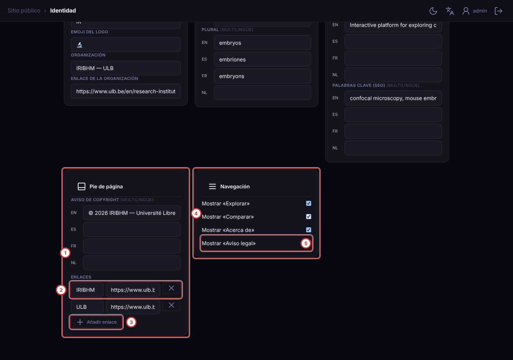{.shot width=88%}

::: legend
| n | qué es |
|-|----------------------|
| 1 | Tarjeta **Pie de página**: el aviso de copyright (por idioma). |
| 2 | Un **enlace** del pie de página: [Etiqueta]{.ui} + dirección; la cruz lo quita. |
| 3 | [Añadir enlace]{.ui}. |
| 4 | Tarjeta **Navegación**. |
| 5 | Las casillas que deciden las entradas del menú público. |
:::

- **Lema** — el subtítulo mostrado bajo el nombre del sitio.
- **Descripción (SEO)** — el resumen que muestran Google y las redes sociales: bastan dos frases claras.
- **Palabras clave (SEO)** — algunos términos separados por comas.
- **Navegación** — las casillas «Mostrar “Explorar”», «Mostrar “Comparar”», «Mostrar “Acerca de”», «Mostrar “Aviso legal”». Desmarcar quita la entrada del menú **sin eliminar la página**.

::: warning
**«Aviso legal» está desmarcada por defecto.** Si redacta su aviso (capítulo 11), vuelva aquí para marcarla: si no, la página sigue invisible.
:::

::: note
Las **páginas personalizadas** creadas en la pestaña Páginas se añaden **solas** al menú en su primera publicación (capítulo 10): ya no hay nada que marcar aquí para ellas.
:::

Restablecer pregunta «Restablecer la identidad a los valores predeterminados? Se eliminará el contenido específico.». Avisos: «Identidad guardada.» / «Identidad restablecida.». El guardado **solo reescribe las claves de esta pestaña**: una modificación hecha entretanto en Tipos de datos o Páginas no se sobrescribe. <kbd>Ctrl</kbd> + <kbd>S</kbd> guarda; aparece una advertencia si sale con cambios sin guardar.

# 9. Apariencia — los colores del sitio

::: chapter-intro
- Colores, fuente y esquinas redondeadas del **sitio público**, con **vista previa en vivo**.
- Nada se aplica antes de [Guardar]{.ui}.
- Los botones siguen siendo **legibles**: el contraste se calcula por usted.
:::

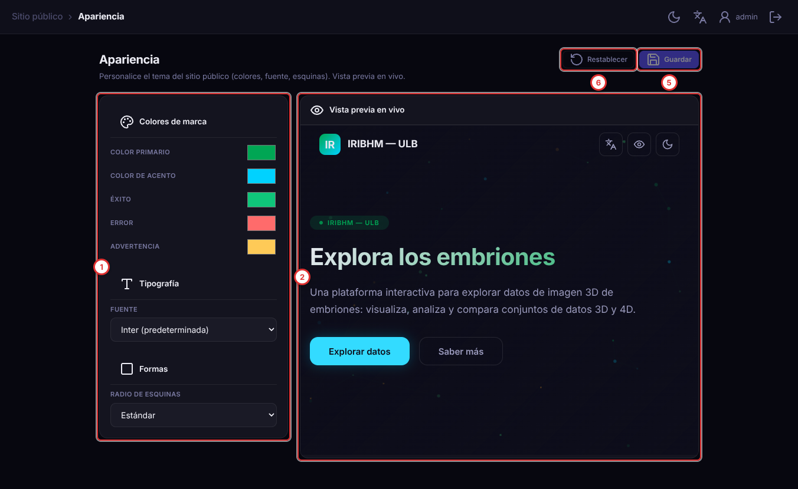{.shot width=88%}

::: legend
| n | qué es |
|-|----------------------|
| 1 | **Colores de marca**. |
| 2 | **Tipografía**: la fuente. |
| 3 | **Formas**: el redondeo de las esquinas. |
| 4 | **Vista previa en vivo**: aún no publicada. |
| 5 | [Guardar]{.ui}: aplica el tema al sitio público. |
| 6 | [Restablecer]{.ui}: «¿Restablecer el tema a los valores predeterminados?». |
:::

## 9.1. Los colores

| Color | Dónde aparece |
|---|---|
| **Color primario** | El dominante: botones principales, enlaces, elementos activos |
| **Color de acento** | El secundario, para los realces |
| **Éxito** | Las confirmaciones (verde por defecto) |
| **Error** | Los mensajes de error (rojo por defecto) |
| **Advertencia** | Las alertas (naranja por defecto) |

Haga clic en un cuadrado de color para abrir el selector: **la vista previa se actualiza al instante**. Los botones principales se derivan del color de la instancia y buscan el contraste **WCAG AA** (sin garantizarlo para todos los colores: un texto blanco sobre un naranja o un turquesa vivo queda por debajo; compruebe la legibilidad en la vista previa); el tema guardado se aplica antes de la primera visualización.

::: tip
Mantenga Éxito / Error / Advertencia **cerca del verde / rojo / naranja**: son referencias universales.
:::

## 9.2. Tipografía y formas

- **Fuente** — Inter (predeterminada), Sistema, Grotesca, Serif, Redondeada.
- **Radio de esquinas** — Estándar, Recto, Suave, Redondo: de angular a muy redondeado, en botones y tarjetas.

## 9.3. Publicar el tema

Nada se aplica al sitio público antes de [Guardar]{.ui} («Tema guardado.» / «Error al guardar el tema.»). <kbd>Ctrl</kbd> + <kbd>S</kbd> funciona; la pestaña le avisa si sale con cambios sin guardar.

::: warning
**Compruebe el contraste.** Un color primario muy claro sobre fondo claro resulta ilegible. Tras guardar, abra el sitio público y compruebe que todo se lee, en tema claro **y** oscuro.
:::

# 10. Páginas — el editor visual

::: chapter-intro
- Modifique el contenido de las páginas del sitio **como en un programa de maquetación**.
- Borrador guardado solo; **nada es público antes de [Publicar]{.ui}**.
- 27 elementos, secciones, columnas, traducción, variables: sin escribir una línea de código.
:::

Es la función más completa del panel.

## 10.1. Elegir una página

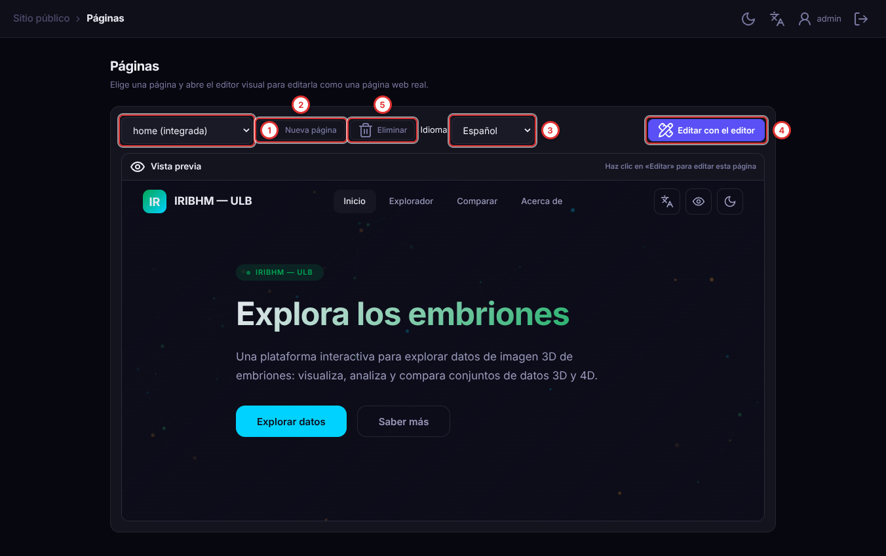{.shot width=88%}

::: legend
| n | qué es |
|-|----------------------|
| 1 | La **página** que se va a modificar. |
| 2 | [Nueva página]{.ui}. |
| 3 | El **idioma** que está editando. |
| 4 | [Editar con el editor]{.ui}: abre el editor a pantalla completa. |
| 5 | [Eliminar]{.ui}: borra una página que usted ha creado. |
:::

Existen dos páginas de origen: **`home`** (el inicio) y **`about`** (Acerca de). La mención *(integrada)* significa que aún usan la plantilla suministrada: desde su primera publicación, su versión toma el relevo. **No** se pueden eliminar («Las páginas integradas no se pueden eliminar (restablézcalas).»; restablézcalas desde el editor).

Las plantillas de inicio y Acerca de ya no contienen tarjeta «Tracking» ni «Wholemount»: esas categorías ya no existen.

## 10.2. El editor

El editor se abre **en su propia pestaña** para disponer de toda la pantalla.

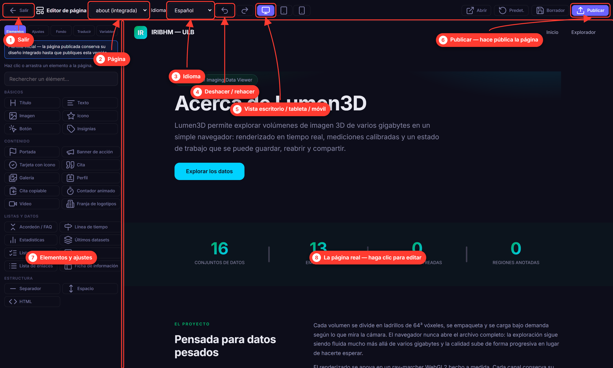{.shot width=88%}

::: legend
| n | qué es |
|-|----------------------|
| 1 | **Salir**: vuelve al panel. |
| 2 | La página que se está editando. |
| 3 | El idioma editado. |
| 4 | **Deshacer / Rehacer** (<kbd>Ctrl</kbd> + <kbd>Z</kbd> / <kbd>Ctrl</kbd> + <kbd>Y</kbd>). |
| 5 | Vista previa de **ordenador / tableta / móvil**. |
| 6 | **Publicar**: hace visible la versión al público. |
| 7 | La **barra lateral**: elementos que insertar, ajustes de la selección. |
| 8 | **La página real**: su menú real, su pie de página real, su tema real. |
:::

### La barra superior

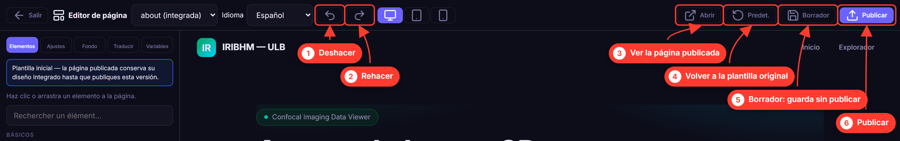{.shot width=88%}

::: legend
| n | qué es |
|-|----------------------|
| 1 – 2 | **Deshacer** y **Rehacer**. |
| 3 | **Abrir**: muestra la página publicada en una pestaña nueva, para comparar. |
| 4 | **Predet.**: vuelve a la plantilla de origen. Borra su diseño. |
| 5 | **Borrador**: guarda sin publicar. |
| 6 | **Publicar**: pone su versión en línea. |
:::

::: remember
**Borrador ≠ Publicar.** Mientras no haya hecho clic en [Publicar]{.ui}, los visitantes ven la versión anterior. Puede trabajar varios días sin romper nada.
:::

### El indicador de guardado

El editor guarda **automáticamente el borrador**, nunca la versión publicada. Una pastilla indica en qué punto está:

| Pastilla | Significado |
|---|---|
| ● No guardado | Hay modificaciones pendientes. |
| ✓ Guardado hh:mm | El borrador está al día. |
| ⚠ Falló el guardado automático, haga clic para reintentar | Nuevo intento automático, y al volver la red. |
| 🔒 Abierta en otra pestaña, haga clic para tomar el control | Bloqueo entre dos pestañas de edición de la **misma página**. |
| ⚠ Página ilegible, recargue antes de editar | No se pudo leer el contenido. |

- Recuperar el control de una página abierta en otra parte pide «Esta página está abierta en otra pestaña. Guardar aquí sobrescribirá sus cambios. ¿Continuar?».
- Un guardado procedente de una pestaña **obsoleta** se **rechaza** en lugar de sobrescribir una versión más reciente.
- Cambiar de página guarda primero la anterior; si falla: «No se pudieron guardar los últimos cambios de esta página. ¿Cambiar de página de todos modos?». Salir: «Cambios sin guardar. ¿Salir sin publicar?».

## 10.3. Añadir un elemento

La pestaña **Elementos** de la barra lateral contiene todo lo que se puede colocar en una página.

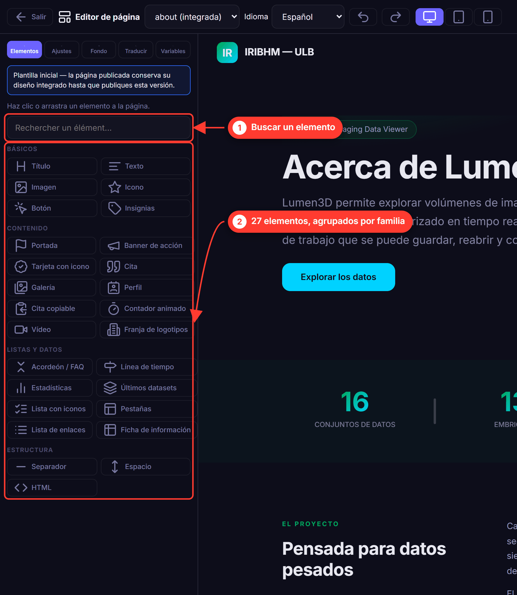{.shot width=50%}

- **Haga clic** en un elemento: se añade al final de la página.
- **Arrástrelo** al lugar deseado: aparecen zonas de colocación.

El campo **Buscar un elemento…** filtra la lista: hay **27**.

**Básicos**

| Elemento | Qué es |
|---|---|
| **Título** | Un título de sección |
| **Texto** | Un párrafo |
| **Imagen** | Una imagen |
| **Icono** | Un pictograma |
| **Botón** | Un botón en el que se puede hacer clic |
| **Insignias** | Pequeñas etiquetas de color |

**Contenido**

| Elemento | Qué es |
|---|---|
| **Portada** | El gran banner de introducción |
| **Banner de acción** | Un recuadro que invita a hacer clic |
| **Tarjeta con icono** | Icono + título + texto |
| **Cita** | Una cita destacada |
| **Galería** | Varias imágenes en cuadrícula |
| **Perfil** | La ficha de una persona |
| **Cita copiable** | Una referencia con botón «copiar» |
| **Contador animado** | Una cifra que va subiendo |
| **Vídeo** | Un vídeo integrado |
| **Franja de logotipos** | Una fila de logotipos de socios |

**Listas y datos**

| Elemento | Qué es |
|---|---|
| **Acordeón / FAQ** | Preguntas que se despliegan |
| **Línea de tiempo** | Una sucesión de etapas fechadas |
| **Estadísticas** | Una fila de cifras clave |
| **Últimos datasets** | **Se rellena solo** con sus conjuntos de datos recientes |
| **Lista con iconos** | Una lista de viñetas ilustradas |
| **Pestañas** | Contenido repartido en pestañas |
| **Lista de enlaces** | Una lista de enlaces |
| **Ficha de información** | Una tabla etiqueta / valor |

**Estructura**

| Elemento | Qué es |
|---|---|
| **Separador** | Una línea horizontal |
| **Espacio** | Un espacio vacío ajustable |
| **HTML** | Código HTML libre — **reservado a usuarios avanzados** |

::: tip
**Los elementos que se rellenan solos.** *Últimos datasets* y *Estadísticas* extraen sus datos del sitio: número de conjuntos de datos, de especímenes, de células seguidas. La cifra se actualiza cuando añade datos.
:::

::: note
El elemento **HTML** se depura mediante **lista blanca**: se conservan enlaces, vídeo/audio y bordes de tabla; se eliminan scripts, gestores de eventos, SVG y enlaces peligrosos.
:::

## 10.4. Modificar un elemento existente

**Haga clic en él dentro de la página**: se rodea de verde y la barra lateral pasa a sus ajustes.

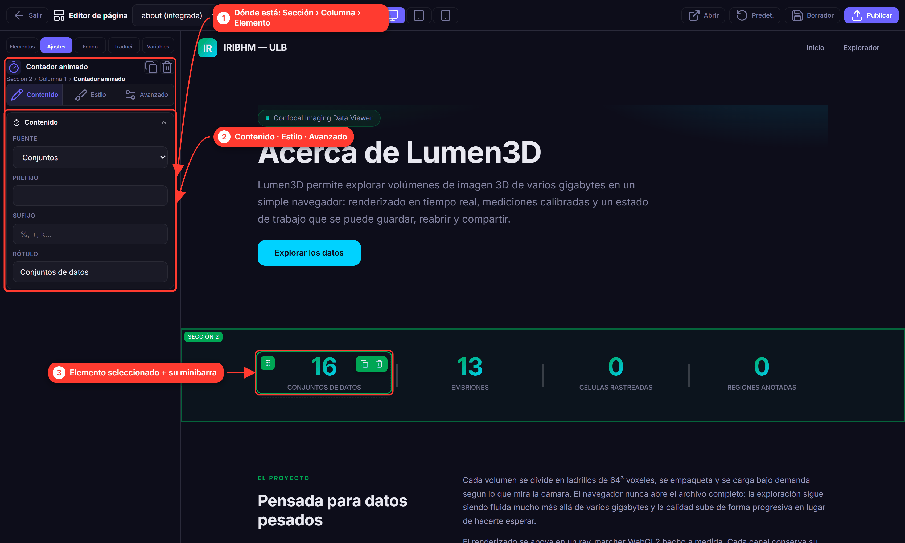{.shot width=88%}

::: legend
| n | qué es |
|-|----------------------|
| 1 | La **ruta de navegación**: `Sección 2 › Columna 1 › Contador animado`. Cada nivel se puede pulsar. |
| 2 | Las tres pestañas de ajustes: **Contenido**, **Estilo**, **Avanzado**. |
:::

### Las minibarras de herramientas

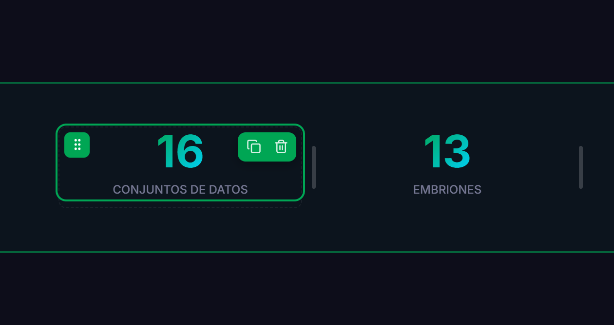{.shot width=60%}

**Solo se ve una barra a la vez**: la del nivel más interior bajo su cursor (elemento, luego columna, luego sección).

| Nivel | Botones |
|---|---|
| **Elemento** | ⠿ asa de movimiento · ⧉ duplicar · 🗑 eliminar |
| **Columna** | ‹ › mover · ⚙ ajustes · ⧉ · 🗑 |
| **Sección** | ⌃ ⌄ subir / bajar · ▥ añadir una columna · ⚙ ajustes · ⧉ · 🗑 |

### Las tres pestañas de ajustes

**Contenido** — lo que está escrito: textos, imágenes, enlaces, fuente de los datos. **Estilo** — colores, tamaños, espaciados, alineación, redondeos. **Avanzado** — márgenes, comportamiento al pasar el cursor, **visibilidad según el dispositivo**, CSS personalizado.

:::: cols
::: col
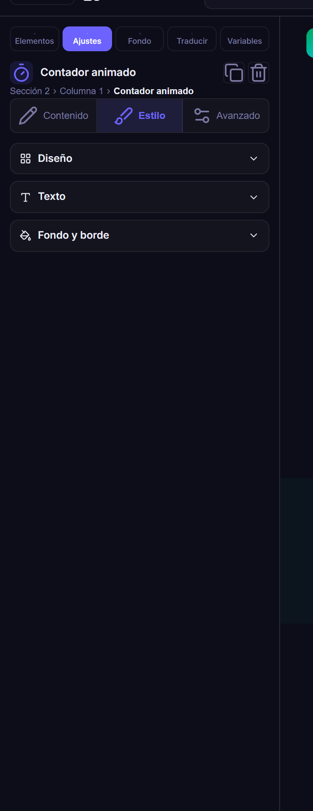{.shot width=88%}
:::
::: col
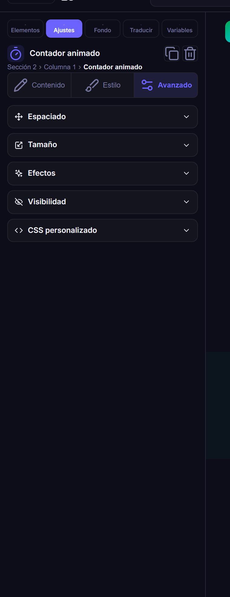{.shot width=88%}
:::
::::

::: tip
Para modificar un texto más deprisa, **haga doble clic** en él dentro de la página y escriba. <kbd>Intro</kbd> valida, <kbd>Esc</kbd> cancela.
:::

### Los atajos de teclado

| Atajo | Acción |
|---|---|
| <kbd>Ctrl</kbd> + <kbd>Z</kbd> | Deshacer |
| <kbd>Ctrl</kbd> + <kbd>Y</kbd> (o <kbd>Ctrl</kbd> + <kbd>Mayús</kbd> + <kbd>Z</kbd>) | Rehacer |
| <kbd>Ctrl</kbd> + <kbd>S</kbd> | Guardar un borrador |
| <kbd>Ctrl</kbd> + <kbd>D</kbd> | Duplicar el elemento seleccionado |
| <kbd>Ctrl</kbd> + <kbd>C</kbd> / <kbd>V</kbd> | Copiar / pegar un elemento |
| <kbd>Supr</kbd> (o <kbd>Retroceso</kbd>) | Eliminar el elemento |
| <kbd>Esc</kbd> | Deseleccionar |

En Mac, sustituya <kbd>Ctrl</kbd> por <kbd>Cmd</kbd>. Los atajos se desactivan mientras escribe en un campo.

## 10.5. Secciones, columnas y móvil

Una página se construye en tres niveles: **Sección** (una banda de ancho completo) › **Columna** (una división vertical) › **Elemento**.

Seis disposiciones de columnas: **1** (ancho completo), **2**, **3**, **4** columnas iguales, **⅔ ⅓** y **⅓ ⅔**. En un teléfono, las columnas **se apilan automáticamente una debajo de otra**.

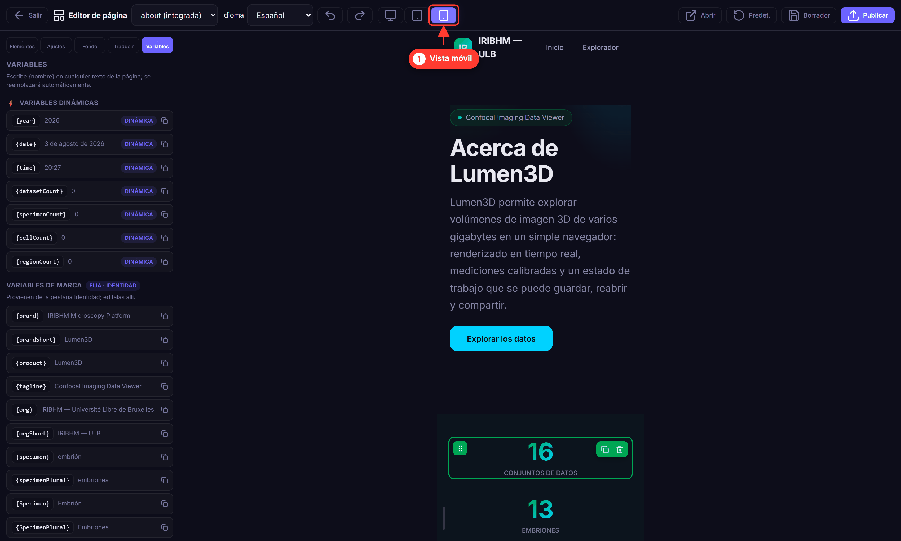{.shot width=70%}

Los tres iconos (ordenador / tableta / móvil) cambian el tamaño de la vista previa. **Compruebe en móvil antes de publicar**: buena parte de los visitantes usan teléfono.

## 10.6. Fondo animado, traducción, variables

:::: cols3
::: col
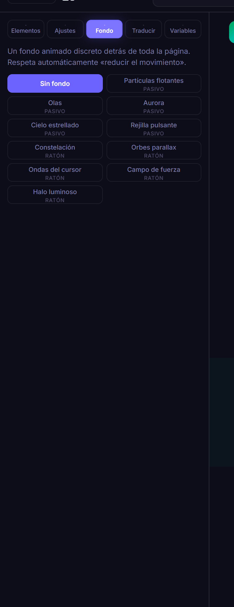{.shot width=88%}

**Fondo**: *Sin fondo*, *Ratón* (reacciona al cursor), *Pasivo* (se despliega solo). Respeta la preferencia «reducir las animaciones».
:::
::: col
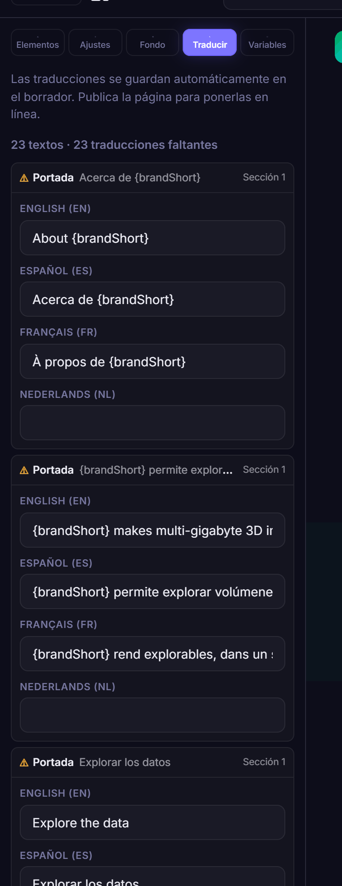{.shot width=88%}

**Traducir** enumera **todos los textos** de la página y señala los que faltan («24 textos · 7 traducciones faltantes»).
:::
::: col
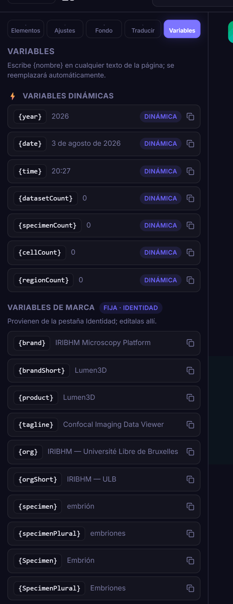{.shot width=88%}

**Variables**: un texto definido **una vez**, reutilizado en todas partes con `{nombre}`.
:::
::::

**Método recomendado para traducir**: redacte toda la página en un idioma y luego pase a la pestaña Traducir para traducirla de una vez.

**Las variables** — cree una (nombre, por ejemplo `contacto`; valor, `microscopy@ulb.be`), escriba `{contacto}` en cualquier texto y se mostrará el valor. El día en que cambie la dirección, la corrige en **un solo sitio**. Reglas del nombre: una letra y luego letras, cifras o `_`, 32 caracteres como máximo.

Ya existen algunas variables: `{brand}` (nombre del sitio), `{specimen}` (su objeto de estudio), `{org}`, `{year}` y, para las categorías, `{type3d}`, `{type2d}`, `{typeLive}` (capítulo 6).

## 10.7. Crear una página nueva

::: steps
1. En la pestaña **Páginas**, haga clic en [Nueva página]{.ui}.
2. Responda a las **dos preguntas**: «Identificador de la página (letras, dígitos, guiones):» (minúsculas, cifras, `-`, `_`, 64 caracteres) y luego «Etiqueta del menú:».
3. Construya la página en el editor.
4. Haga clic en **Publicar**.
:::

Aviso: «Página creada.». La página se añade al menú **oculta**; pasa a ser **visible en la primera publicación**: **no hay nada que marcar en Identidad**. Queda entonces en la dirección `https://<su-sitio>/page.html?slug=protocolos` (para el identificador `protocolos`).

Errores: «Identificador no válido.», «Esta página ya existe.». Eliminar pide «Eliminar esta página?» y borra de verdad el archivo de configuración.

## 10.8. Procedimiento recomendado

::: steps
1. **Editar con el editor** y hacer las modificaciones.
2. **Borrador** de vez en cuando (además del guardado automático).
3. Comprobar en la **vista previa móvil**.
4. Completar la pestaña **Traducir**.
5. **Publicar** y luego **Abrir** para comprobar el resultado en línea.
:::

# 11. Aviso legal

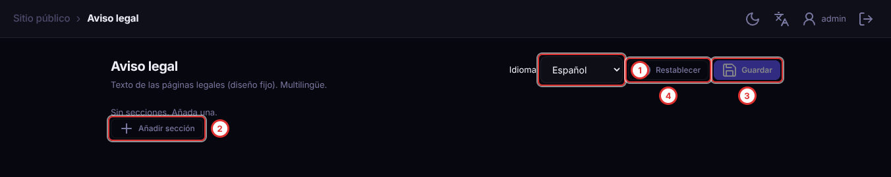{.shot width=88%}

::: legend
| n | qué es |
|-|----------------------|
| 1 | El selector de **Idioma**. |
| 2 | [Añadir sección]{.ui}: un **título** y un **texto**. |
| 3 | [Guardar]{.ui}: publica. |
| 4 | [Restablecer]{.ui}. |
:::

Un editor sencillo, de diseño fijo, para el texto legal. Las secciones se muestran en el orden en que las crea; cada una tiene un «Título de la sección», un «Texto…» y un botón [Eliminar]{.ui}. Sin secciones: «Sin secciones. Añada una.». Resultado: «Aviso legal guardado.». <kbd>Ctrl</kbd> + <kbd>S</kbd> guarda.

**Secciones habituales:** editor del sitio, proveedor de alojamiento, propiedad intelectual, datos personales, contacto.

::: warning
**Dos cosas que no hay que olvidar.** (1) La página sigue invisible mientras la casilla «Mostrar “Aviso legal”» no esté marcada en **Identidad › Navegación**. (2) El contenido jurídico depende de su país y de su institución: acuda al servicio competente en lugar de copiar una plantilla encontrada en línea.
:::

# 12. Plugins — las funciones del visor

::: chapter-intro
- Casi todo lo que puede hacer un visitante lo proporciona un **plugin**, un pequeño módulo independiente.
- **Por defecto, un plugin no tiene derecho a ejecutarse**: usted es quien lo autoriza.
- Puede **quitar** lo que no sirve y **añadir** más adelante.
:::

Es el capítulo más técnico, pero también el que da más control. Dedique tiempo a leer el §12.1: el resto se deduce de él.

## 12.1. ¿Qué es un plugin, aquí?

::: analogy
**Un banco de trabajo y sus herramientas.** El visor es un banco de trabajo mínimo. Medir una distancia, hacer una captura, ajustar un histograma, elegir un modo de renderizado: cada función es **una herramienta guardada en el banco**. Usted decide cuáles están encima.
:::

Cada plugin ocupa uno de los **tres emplazamientos**:

| Emplazamiento | Dónde aparece para el visitante | Ejemplos |
|---|---|---|
| **Herramientas** (barra de herramientas) | Los botones en la parte superior del visor | Medida de distancia, captura de pantalla, modo presentación |
| **Canales** (por canal) | Los ajustes bajo cada canal de fluorescencia | Histograma, desenfoque gaussiano |
| **Modos de renderizado** (shaders) | El menú desplegable que elige cómo se dibuja el volumen | Fluorescence, Natural Fluorescence, Structure (DVR) |

## 12.2. La pantalla

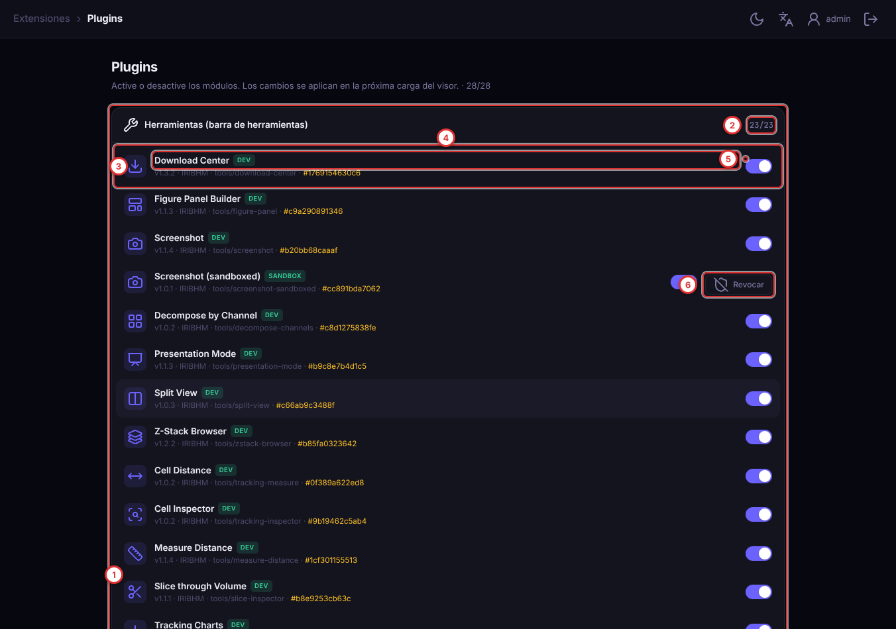{.shot width=88%}

::: legend
| n | qué es |
|-|----------------------|
| 1 | Una **tarjeta por emplazamiento** (Herramientas, Canales, Modos de renderizado). |
| 2 | El contador `activos / total` de la tarjeta. |
| 3 | Una **línea por plugin**. |
| 4 | El **nombre** y el **nivel de confianza**. |
| 5 | El **interruptor** activo / inactivo. |
| 6 | **Revocar** (en un plugin que usted ha aprobado). |
:::

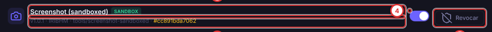{.shot width=88%}

::: legend
| n | qué es |
|-|----------------------|
| 1 | El **nombre** del plugin. |
| 2 | Su **nivel de confianza**. |
| 3 | Versión · autor · carpeta · **huella** del código. |
| 4 | El interruptor que **activa o desactiva**. |
| 5 | [Revocar]{.ui}: retira la autorización (§12.5). Ausente en un plugin `integrado`. |
:::

Lista vacía: «Ningún plugin instalado — Los plugins se instalan bajo demanda desde el catálogo.» con un botón [Abrir el catálogo]{.ui}. Si la lista no carga: «No se pudo cargar la lista de plugins.» y [Reintentar]{.ui}.

## 12.3. Activar o desactivar un plugin

Pulse el interruptor. El cambio se guarda de inmediato y surte efecto **en la próxima carga del visor**: pida a un visitante que recargue su página, o recargue la vista previa de la pestaña Datasets. Desactivar no elimina nada: puede volver a activarlo en cualquier momento.

::: warning
**El interruptor no siempre está.** Un plugin **no fiable** no lo tiene: primero hay que aprobarlo (§12.5). Un plugin **protegido** (el último modo de renderizado activo) o **incompatible** lo tiene, en gris.
:::

::: note
**Una sola protección**: siempre debe quedar **al menos un modo de renderizado activo**. Si intenta desactivar el último: «Al menos un modo de renderizado debe permanecer activo.».
:::

## 12.4. Los niveles de confianza — por qué existen

Un plugin es **código de verdad** que se ejecuta en el navegador de los visitantes. Un plugin malicioso podría mostrar cualquier cosa. Por eso la plataforma parte del principio contrario al habitual: **por defecto, un plugin no tiene derecho a ejecutarse**. Cada plugin lleva una etiqueta:

| Etiqueta | Significado | Qué implica |
|---|---|---|
| **`integrado`** | Entregado con la versión oficial del sitio, código idéntico al publicado | De confianza. Nada que hacer. |
| **`aprobado`** | Usted lo ha autorizado a ejecutarse en la página | De confianza porque **usted** lo decidió. |
| **`sandbox`** | Autorizado, pero **encerrado en un entorno aislado**: separado del resto de la página y del panel | El modo más seguro. |
| **`dev`** | Plugin local de una máquina de desarrollo lanzada con la opción `--dev-trust-local` | No existe en un sitio en producción. Sin esa opción, un clon no tiene **ningún** plugin local de confianza. |
| **`no fiable`** | **Rechazado**: el plugin no se carga en absoluto | Véase §12.5. |
| **`protegido`** | El último modo de renderizado activo | El interruptor está en gris. |
| **`incompatible`** | Pide otra versión de la plataforma | En gris; véase el capítulo 14. |
| **`actualización disponible`** | Existe una versión más reciente y compatible | Véase §12.6. |

**La huella** (el código del tipo `#06c7945439b8`, bajo cada nombre) firma el contenido exacto de los archivos. Su autorización está **ligada a esa huella precisa**: si alguien modifica un solo carácter del plugin, la huella cambia, la autorización caduca y el plugin vuelve a ser **no fiable**. Un plugin aprobado no se puede reemplazar a escondidas.

## 12.5. Aprobar un plugin no fiable

Verá este caso si alguien deposita un plugin en el servidor (por FTP) en lugar de pasar por el Catálogo.

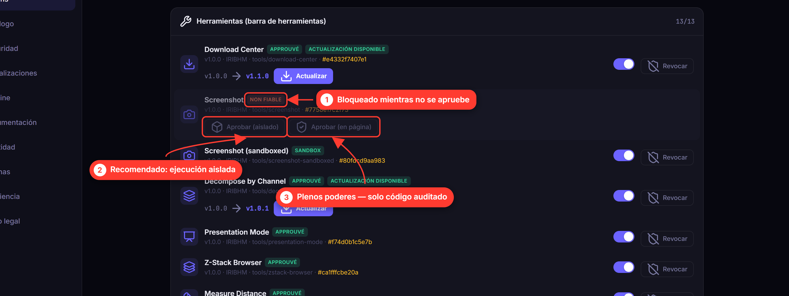{.shot width=88%}

::: legend
| n | qué es |
|-|----------------------|
| 1 | La etiqueta roja **NO FIABLE**: el plugin no se carga. |
| 2 | [Aprobar (aislado)]{.ui}: el plugin se ejecuta aislado. **Opción recomendada.** |
| 3 | [Aprobar (en página)]{.ui}: el plugin se ejecuta con todos los poderes de la página. |
:::

::: steps
1. Haga clic en uno de los dos botones.
2. Una ventana resume lo que está aprobando: **huella** del código y **capacidades** concedidas.
3. El panel le pide que **vuelva a teclear su contraseña**: «Confirme su contraseña de administrador para aprobar:».
4. «Plugin aprobado ✓ (recargue el visor)»: activo en la próxima carga.
:::

::: why
**¿Por qué volver a pedir la contraseña?** Aprobar es la única acción que autoriza la ejecución de código externo. Aunque alguien se sentara ante su pantalla abierta, no podría aprobar sin su contraseña.
:::

::: warning
**¿«En página» en lugar de «aislado»?** Casi nunca, salvo que haya leído el código o venga de una persona de confianza. Los plugins de **canal** y de **modo de renderizado** técnicamente no pueden ejecutarse aislados: dialogan directamente con la tarjeta gráfica.
:::

Mensajes: «Contraseña incorrecta.», «El contenido del plugin cambió — recargue la lista y vuelva a verificar.» (la huella cambió entretanto), «Aprobación revocada ✓» tras [Revocar]{.ui}.

## 12.6. Actualizar un plugin

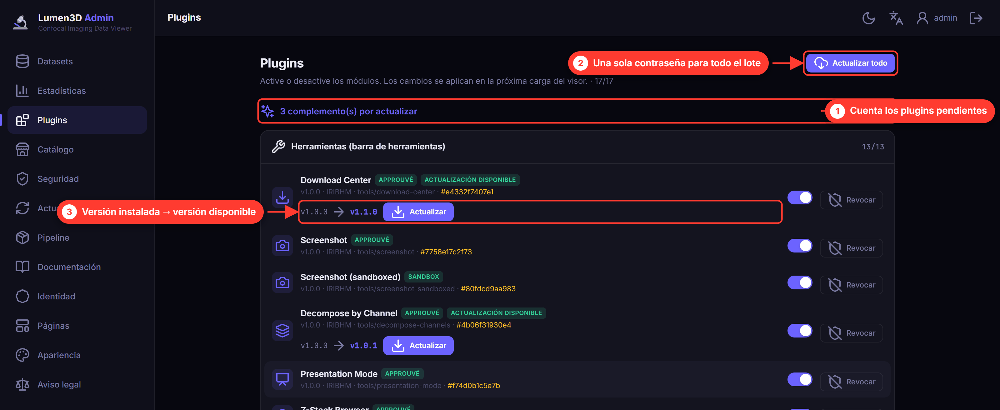{.shot width=88%}

::: legend
| n | qué es |
|-|----------------------|
| 1 | El **banner** cuenta los plugins afectados. |
| 2 | [Actualizar todo]{.ui}: a partir de dos plugins; **una sola contraseña** para el lote. |
| 3 | La línea: etiqueta **actualización disponible**, recorrido `v1.0.0 → v1.1.0`, botón. |
:::

El botón solo aparece si **existe una versión más reciente Y se declara compatible** con su plataforma. Si no, se muestra el motivo: actualice primero la plataforma (capítulo 14).

La copia que funciona se **aparta, no se borra**: si algo falla después, se vuelve a colocar. La misma acción existe en el **Catálogo** y en **Actualizaciones**: las tres pestañas leen la misma fuente.

## 12.7. En un panel, una vista dividida, la vista previa

Un plugin debe declarar que sabe **ser dirigido desde fuera** para cargarse cuando la página está **incrustada**: vista previa de la pestaña Datasets, paneles de la página *Comparar*, paneles de la vista dividida. Si no, solo se carga en la página completa.

Los plugins **«solo página»** —Presentation Mode, Download Center, Decompose by Channel, Screenshot, Chunk Debug, Split View, Figure Panel Builder, Tracking Charts, Cell Distance— no aparecen, por tanto, en la vista previa. **No es un error.**

Un plugin también puede estar **limitado a ciertos tipos** de datos: los cinco plugins 2D solo se cargan en una fotografía; los cinco plugins de seguimiento, únicamente en un dataset Live que tenga seguimiento.

## 12.8. Los 28 plugins del catálogo

Estos plugins **no** se entregan con el sitio: se instalan bajo demanda (asistente de primera instalación, paso 5, o pestaña Catálogo). Una instalación nueva en la que se hubiera desmarcado todo no tendría ninguno.

**Modos de renderizado**

| Plugin | Qué hace para el visitante |
|---|---|
| **Fluorescence** | El renderizado por defecto: cada canal emite su color, como en un microscopio de fluorescencia |
| **Natural Fluorescence** | Cada fluoróforo brilla con su color; las estructuras densas tapan lo que hay detrás |
| **Structure (DVR)** | Renderizado volumétrico con profundidad y sombreado, que hace resaltar las formas |

**Canales**

| Plugin | Qué hace |
|---|---|
| **Histogram Controls** | El histograma de intensidad y los controles deslizantes mín / máx / gamma |
| **Gaussian Filter** | Un control de desenfoque para suavizar el ruido de un canal |

**Herramientas (volúmenes y series temporales)**

| Plugin | Qué hace |
|---|---|
| **Measure Distance** | Hacer clic en dos puntos para obtener la distancia real en µm |
| **Slice through Volume** | Un corte plano orientable a través del volumen |
| **Z-Stack Browser** | Recorrer los cortes: apertura plana animada, muesca 3D, recorte superior / inferior, barra de grosor ajustable, control «Rotación» |
| **Decompose by Channel** | Mostrar los canales lado a lado |
| **Download Center** | Recuperar archivos, mediciones, metadatos, exportaciones |
| **Screenshot** | Capturar la vista 3D en PNG |
| **Screenshot (sandboxed)** | La misma captura, aislada: el ejemplo de plugin aislado |
| **Presentation Mode** | Pantalla completa sin interfaz, para proyectar |
| **Orientation Axes** | El marco rojo / verde / azul 1-2, renombrables (§3.8) |
| **Toggle Grid**, **Toggle Axes**, **Hide / Show 3D Volume** | Mostrar u ocultar la cuadrícula, los ejes, el volumen |
| **Chunk Debug** | Diagnóstico técnico. **Se puede desactivar sin riesgo** en producción |

**Herramientas de las fotografías 2D**

| Plugin | Qué hace |
|---|---|
| **Calibrated Grid** | Una cuadrícula calibrada en µm o mm sobre la fotografía |
| **Display Adjustments** | Brillo, contraste, gamma (solo visualización) |
| **Orientation 2D** | Rotación y espejo de la fotografía |
| **Split View** | Dos vistas lado a lado |
| **Figure Panel Builder** | Componer varias fotografías en una figura a escala común |

**Herramientas del seguimiento celular (series Live con seguimiento)**

| Plugin | Qué hace |
|---|---|
| **Tracking Trails** | Las trayectorias sobre el volumen |
| **Tracking Surface** | La superficie del embrión dentro del volumen |
| **Cell Inspector** | Métricas, linaje, vecinos de una célula |
| **Tracking Charts** | Gráficos de población, velocidad, mitosis |
| **Cell Distance** | Distancias entre células |

::: note
**Slice through Volume** y **Z-Stack Browser** son **exclusivos**: abrir uno cierra el otro.
:::

# 13. Catálogo — instalar nuevos plugins

::: chapter-intro
- El Catálogo funciona como una **tienda de aplicaciones**: plugins oficiales, firmados.
- Instalar = un clic + su **contraseña**; el plugin se verifica, se instala y se **aprueba**.
- Una instalación se **cancela** ante la menor diferencia con lo que anuncia el catálogo.
:::

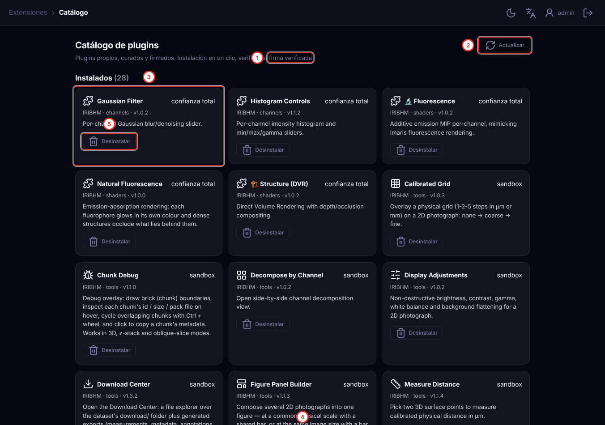{.shot width=88%}

::: legend
| n | qué es |
|-|----------------------|
| 1 | **Firma verificada**: el catálogo está autenticado. |
| 2 | [Actualizar]{.ui}. |
| 3 | Una **tarjeta de plugin** (nombre, emplazamiento, versión, descripción). |
| 4 | Las **capacidades** solicitadas. |
| 5 | [Desinstalar]{.ui}. |
:::

Los plugins se reparten en secciones: **Para actualizar** (primero, si los hay), **Instalados**, **Disponibles** y, eventualmente, **Incompatibles**.

## 13.1. Instalar un plugin

::: steps
1. Busque la tarjeta del plugin en **Disponibles**.
2. Haga clic en [⬇ Instalar]{.ui}.
3. «¿Instalar este plugin? Confirme con su contraseña de administrador:».
4. «Instalando (descarga + verificación)…» y luego «Plugin instalado y aprobado ✓».
:::

El servidor comprueba que el archivo coincide **bit a bit** con lo que anuncia el catálogo. Ante la menor diferencia, la instalación se **cancela** («Error de instalación (verificación fallida).»). Otros mensajes: «Contraseña incorrecta.», «Ya instalado.».

En la parte superior de la página, **«firma verificada»** (catálogo autenticado) o **«sin firmar»** (ninguna clave configurada: solo se controla la huella sha256).

::: why
**Catálogo más antiguo rechazado (antirretroceso).** Cada catálogo firmado lleva un **número de serie creciente**. El servidor rechaza un catálogo más antiguo que uno ya aceptado: «Catálogo rechazado: es más antiguo (n.º …) que uno ya aceptado por este servidor (n.º …). Podría reinstalar versiones de plugins corregidas desde entonces.». No hay **nada que hacer** por su parte, y este mensaje no se puede eludir.
:::

## 13.2. Actualizar, desinstalar

Un plugin instalado para el que existe una versión más reciente **y** compatible pasa a **Para actualizar**: su tarjeta muestra `v1.0.0 → v1.1.0` y un botón [Actualizar]{.ui} junto a [Desinstalar]{.ui} (compruebe en cuál hace clic). [Actualizar todo]{.ui} procesa el lote con una sola contraseña.

[🗑 Desinstalar]{.ui} pide «¿Desinstalar este plugin?» y luego «Plugin desinstalado.»; los archivos se retiran del servidor y puede reinstalarlo después. **Una sola negativa**: el **último modo de renderizado** («No se puede: último modo de render.»).

## 13.3. Las etiquetas de las tarjetas

| Etiqueta | Significado |
|---|---|
| **`sandbox`** | «Se ejecuta aislado (sandbox)»: es el caso de los plugins de la barra de herramientas. |
| **`confianza total`** | «Confianza total en página (shaders/canales)»: inevitable para los modos de renderizado y los ajustes de canales, que dirigen la tarjeta gráfica. |
| **`actualización disponible`** | Existe una versión más reciente y compatible. |
| **`incompatible`** | Solo aparece en un plugin **no instalado**: pide otra versión de la plataforma. El botón de instalación está en gris: actualice la plataforma (capítulo 14). |

::: note
Un plugin **ya instalado** nunca lleva la etiqueta `incompatible`: el que funciona en su sitio funciona; solo su versión siguiente puede esperar. Un paquete que declara un tipo de datos exige una plataforma **reciente** (1.51 a 1.53): un sitio sin actualizar verá «incompatible» en los plugins recientes.
:::

Estados del catálogo: «Catálogo no disponible: …», «Catálogo inaccesible.», «No hay plugins en el catálogo.», «No hay fuente de catálogo configurada…».

# 14. Actualizaciones — hacer evolucionar el sitio

::: chapter-intro
- Esta pestaña actualiza **el software**: la plataforma y los plugins, y le señala el **paquete Pipeline**.
- Antes de la instalación, un **informe de comprobación** dice qué se verá afectado.
- Una versión que no arranca se **sustituye automáticamente** por la anterior.
:::

::: warning
**No la confunda** con la pestaña [Actualizaciones de datos]{.ui} (capítulo 5), que lleva al día el **formato** de sus conjuntos de datos.
:::

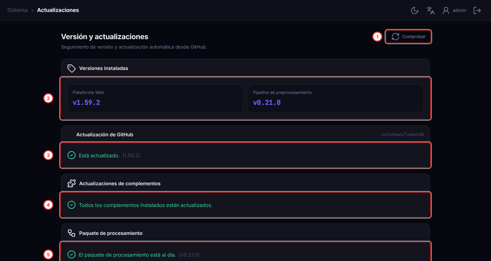{.shot width=88%}

::: legend
| n | qué es |
|-|----------------------|
| 1 | [Comprobar]{.ui}: relanza los tres controles. |
| 2 | **Versiones instaladas**: Plataforma Web y Pipeline de preprocesamiento. |
| 3 | **Actualización de GitHub**: «Está actualizado.» o «Actualización disponible: vX». |
| 4 | **Actualizaciones de complementos**. |
| 5 | **Paquete de procesamiento**: ¿está al día el paquete Pipeline? |
:::

Se muestran dos números de versión, dos componentes independientes: **Plataforma Web** (el sitio: **es el que cuenta**) y **Pipeline de preprocesamiento** (la herramienta del capítulo 15, que evoluciona a su ritmo). Un valor desconocido no se muestra.

## 14.1. Lanzar una actualización de la plataforma

Cuando existe una nueva versión, se muestran sus **notas de versión**. Léalas: describen lo que cambia.

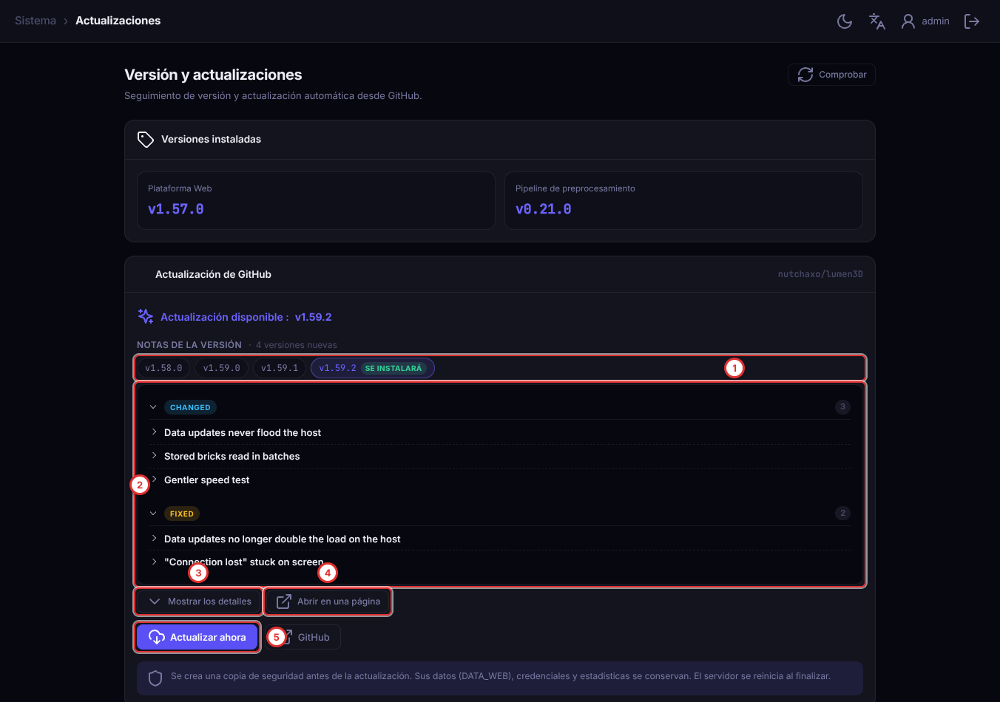{.shot width=88%}

::: legend
| n | qué es |
|-|----------------------|
| 1 | Una **pastilla por versión** aportada; la última está marcada «se instalará». |
| 2 | Las notas de la versión elegida, en **árbol plegable** (ADDED, OPTIMIZED, FIXED, CHANGED). |
| 3 | [Mostrar los detalles]{.ui} / [Solo los títulos]{.ui}. |
| 4 | [Abrir en una página]{.ui}: la página *Notas de versión* (§14.3). |
| 5 | [Actualizar ahora]{.ui}. |
:::

Si su sitio **se ha saltado varias versiones**, cada una tiene su pastilla («4 versiones nuevas»): lee lo que aporta **cada** versión, no solo la última. Las notas están en **inglés** desde la 1.55.0 (las más antiguas están en francés).

::: steps
1. Haga clic en [Actualizar ahora]{.ui}.
2. Aparece el **informe de comprobación** (más abajo).
3. Haga clic en [Confirmar actualización]{.ui}.
4. Deje que actúe: avanza una barra de etapas.
:::

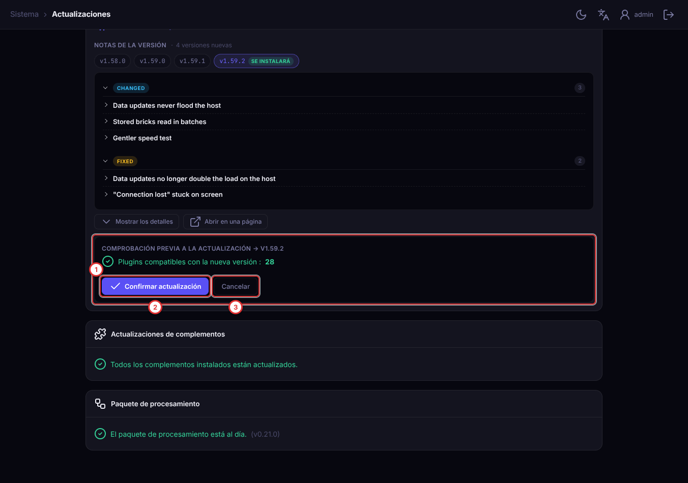{.shot width=88%}

::: legend
| n | qué es |
|-|----------------------|
| 1 | El **informe**: plugins compatibles con la nueva versión, plugins puestos en cuarentena, bloqueo eventual. |
| 2 | [Confirmar actualización]{.ui}: no aparece si algo **bloquea**. |
| 3 | [Cancelar]{.ui}. |
:::

El informe indica, **antes** de instalar nada: cuántos plugins seguirán siendo compatibles; cuáles se **pondrán en cuarentena** porque aún no funcionan con la nueva versión (no se eliminan y **se reactivan solos** en cuanto una actualización los hace compatibles); y si algo bloquea.

Las etapas que avanzan: **Comprobaciones → Copia de seguridad → Descarga → Integridad → Preparación → Control de arranque → Plan de cambio → Conmutación → Reinicio del servidor**. El servidor se reinicia: **vuelva a iniciar sesión**. El éxito solo se anuncia cuando la **nueva versión responde de verdad**.

## 14.2. Las salvaguardas

- **Se hace una copia de seguridad completa** antes de nada.
- **El archivo descargado se verifica**, y es **obligatorio**: solo se aplica el archivo con el nombre de la versión, listado en el `SHA256SUMS` firmado (firma Ed25519, clave fijada). Nunca el zip «source» de GitHub. Si no: «Esta versión no se puede verificar (sin suma de control para su archivo) y no se aplicó.» con el motivo.
- **La nueva versión se prueba antes de ponerla en servicio.** Si no arranca: «restauración automática realizada»: el sitio sigue funcionando, nada que reparar.
- **Sus datos se conservan**: `DATA_WEB`, credenciales, estadísticas, ajustes de Identidad / Páginas / Apariencia. No se exige ningún reprocesamiento de los conjuntos de datos.
- **Cada versión publicada ha pasado toda la batería de pruebas** antes de construirse.

::: tech
La **primera** actualización a una versión ≥ 1.57 se verifica solo por suma de control (la clave de firma aún no estaba en la versión antigua); las siguientes verifican la firma. Las líneas `.htaccess` **fuera** del bloque `# BEGIN LUMEN3D` / `# END LUMEN3D` sobreviven a las actualizaciones; la actualización a la 1.57 sustituye **una vez** el `.htaccess` raíz (vuelva entonces a introducir una eventual línea del proveedor de alojamiento, tipo `AddHandler`).
:::

| Mensaje | Qué significa |
|---|---|
| Está actualizado. | Nada que hacer. |
| Límite de la API de GitHub alcanzado | Demasiadas comprobaciones en poco tiempo; inténtelo de nuevo en unos minutos. |
| No se pudo contactar con GitHub. | Problema de red en el lado del servidor; inténtelo de nuevo más tarde. |
| Aún no hay ninguna versión publicada en GitHub. | Todavía no se ha publicado ninguna versión. |
| El almacén de certificados de PHP no es utilizable en este alojamiento | A comunicar a la persona que gestiona el servidor (archivo `cacert.pem` que subir). |
| Actualización completada. El servidor se reinició — vuelva a iniciar sesión. | Éxito; [Entendido]{.ui} cierra la tarjeta «Última actualización». |
| La nueva versión no arrancó — restauración automática realizada. La versión anterior está en funcionamiento. | El sitio ha vuelto a la versión anterior; no hay nada que reparar. |
| El servidor no responde. Revise logs/update-pivot-*.log y recargue la página. | Recargue; comuníquelo si persiste. |

## 14.3. La página «Notas de versión»

El botón [Abrir en una página]{.ui} abre, en una pestaña nueva, `admpan.html?changelog=1`: una página **sin menú**, para leer con comodidad.

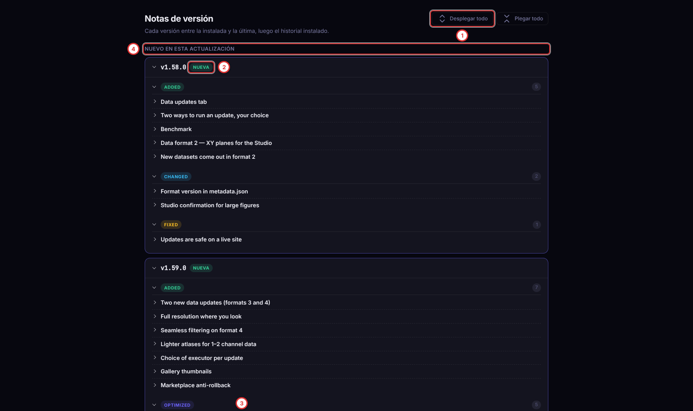{.shot width=88%}

::: legend
| n | qué es |
|-|----------------------|
| 1 | [Desplegar todo]{.ui} (y [Plegar todo]{.ui}). |
| 2 | La etiqueta **nueva**: una versión por venir. |
| 3 | La etiqueta **se instalará**: la más reciente. |
| 4 | El grupo «Nuevo en esta actualización». |
:::

Si está al día: «Nada que instalar: está al día.». Cada versión, cada sección y cada entrada se pliega por separado. Durante la carga: «Cargando las notas de versión…»; en caso de fallo: «Notas de versión no disponibles.».

## 14.4. Actualizar los plugins

Una tarjeta **Actualizaciones de complementos** responde a la misma pregunta para los módulos: «{n} complemento(s) por actualizar», con [Actualizar todo]{.ui} (una sola contraseña). Un plugin cuya nueva versión exige una plataforma más reciente aparece en una segunda lista, **«Actualizaciones a la espera de la plataforma»**, con el motivo: no se oculta.

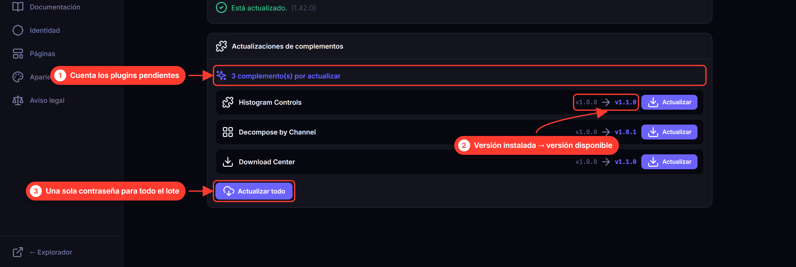{.shot width=88%}

::: legend
| n | qué es |
|-|----------------------|
| 1 | El **número** de plugins que hay que procesar. |
| 2 | Para cada uno: la versión instalada y la versión a la que se iría. |
| 3 | [Actualizar todo]{.ui}: una sola contraseña para el lote. |
:::

## 14.5. El paquete de procesamiento

La tarjeta **Paquete de procesamiento** compara el paquete Pipeline **instalado aquí** con el adjunto a la **última versión de GitHub**. Estados: «El paquete de procesamiento está al día.» (v0.21.0) o «Nuevo paquete de procesamiento: vX (aquí: vY)» con [Descargar el paquete]{.ui}.

Se instala **en el puesto de procesamiento, no en este servidor**: descárguelo y sustituya la carpeta que se usa allí. **No hace falta actualizar la plataforma** para obtener un paquete más reciente. Si GitHub es inalcanzable: «No se ha podido contactar con GitHub para comprobar el paquete de procesamiento.».

# 15. Pipeline — preparar datos nuevos

::: chapter-intro
- Esta pestaña **no** procesa nada en el servidor: le hace **descargar un paquete**.
- El paquete se ejecuta en un **ordenador potente**, normalmente el puesto de análisis.
- La carpeta producida se envía después por la pestaña **Importar**.
:::

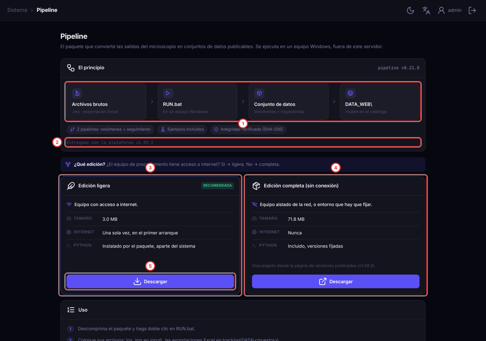{.shot width=88%}

::: legend
| n | qué es |
|-|----------------------|
| 1 | El **recorrido de los datos** en cuatro etapas. |
| 2 | «Entregado con la plataforma vX»: la versión del paquete entregada con este sitio. |
| 3 | **Edición ligera** (recomendada). |
| 4 | **Edición completa** (sin conexión). |
| 5 | [Descargar]{.ui}. |
:::

**¿Por qué separarlo?** Convertir un volumen requiere muchísima memoria RAM: cuente con unos **32 GB de RAM** para un volumen de 3789 × 3789 × 178. Ningún servidor web compartido puede hacerlo.

## 15.1. El principio

| Etapa | Qué es |
|---|---|
| **Archivos brutos** | Lo que sale del microscopio: `.ims` para los volúmenes, exportación Excel para el seguimiento, `.tif` para las fotografías |
| **`RUN.bat`** | El lanzador, en un equipo Windows |
| **Conjunto de datos** | Lo que produce el paquete: volúmenes troceados, fotografía, trayectorias |
| **`DATA_WEB\`** | La carpeta del servidor: el dataset aparece enseguida en el catálogo |

El paquete contiene **dos pipelines** (volúmenes con tracking, análisis de tracking), la **importación de fotografías 2D**, ejemplos de entrada (utilizables de inmediato para familiarizarse) y un lanzador que **verifica su propia integridad** (SHA-256).

::: note
**Dos números, y es normal.** El encabezado muestra `pipeline v0.21.0`: la versión **del paquete**, no la del sitio. El pipeline 0.21.0 escribe **directamente el formato 4** (no hay que hacer ninguna actualización de datos sobre sus salidas), **conserva la curación** hecha en el panel cuando se reprocesa un dataset (oculto, nombre, orientación…) y **publica todo o nada**.
:::

Cuando se publica una versión más reciente del paquete, aparece un **banner** en la parte superior: «Nueva versión del paquete: v… — Este servidor ofrece la v…. Descargue la nueva más abajo: no hace falta actualizar la plataforma para esto.» con [Descargar la v…]{.ui}; para la edición ligera, [Versión instalada]{.ui} mantiene accesible el paquete del servidor.

## 15.2. Qué edición elegir

Una sola pregunta: **¿tiene el equipo de procesamiento acceso a internet?**

| | **Edición ligera** *(recomendada)* | **Edición completa** *(sin conexión)* |
|---|---|---|
| Para quién | Equipo conectado a internet | Equipo aislado de la red, o entorno que hay que fijar |
| Tamaño | ~3 MB | ~70 MB (≈ 200 MB descomprimido) |
| Internet | **una sola vez**, en el primer arranque | **nunca** |
| Python | instalado por el paquete, aparte del sistema | incluido, versiones fijadas |

La edición ligera **nunca** modifica el Python ya instalado en el equipo.

::: warning
La edición completa se adjunta a la versión publicada en GitHub, no al sitio. Si no está disponible, el panel lo dice («Esta edición no está adjunta a la última versión publicada. Utilice la edición ligera, o publique el paquete completo desde el repositorio.») y la edición ligera sigue siendo descargable.
:::

## 15.3. Cómo usarlo

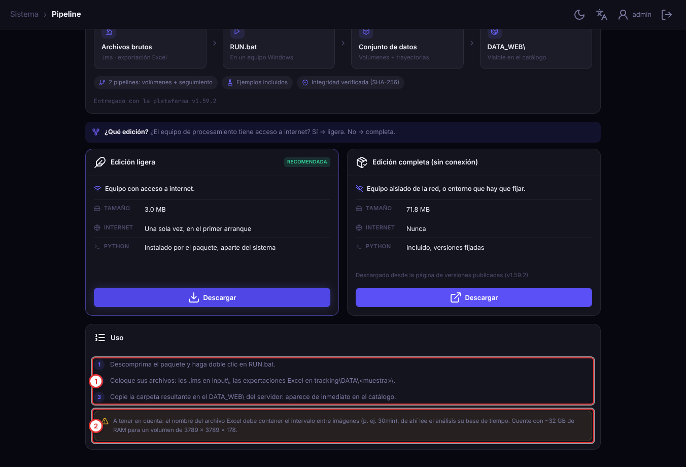{.shot width=88%}

::: legend
| n | qué es |
|-|----------------------|
| 1 | Los tres pasos de **uso**. |
| 2 | La advertencia: el nombre del archivo Excel debe contener el intervalo entre imágenes. |
:::

::: steps
1. Descomprima el archivo en el equipo de procesamiento y haga doble clic en **`RUN.bat`**.
2. Coloque los `.ims` en `input\` y las exportaciones Excel en `tracking\DATA\<muestra>\`.
3. Copie la carpeta producida en el `DATA_WEB\` del servidor, **o, sin acceso FTP, arrástrela a la pestaña Importar** (capítulo 4). Aparece enseguida en el catálogo.
:::

::: warning
**El nombre del archivo Excel debe contener el intervalo entre imágenes** (por ejemplo `30min`): el análisis lee de ahí su base de tiempos.
:::

El menú del lanzador ofrece: **[1]** Preprocesamiento de volúmenes Imaris (`.ims` → `output\`, tracking incluido); **[2]** Análisis de tracking Imaris (Excel → `tracking\OUTPUT\`); **[3]** Importación de fotografías 2D (`.tif` → `output\2d\`); **[4]** Adjuntar un tracking a un dataset ya procesado; **[5]** Solo verificar el entorno; **[0]** Salir.

::: see
El detalle de lo que hace cada etapa (limpieza del ruido, pirámide, ladrillos, seguimiento) está en la **documentación completa**, capítulos 4 a 8.
:::

# 16. Seguridad — contraseña y permisos

::: chapter-intro
- Cambiar la contraseña exige la **anterior**.
- Un cambio **desconecta todas sus demás sesiones**.
- La contraseña **nunca** se almacena en claro.
:::

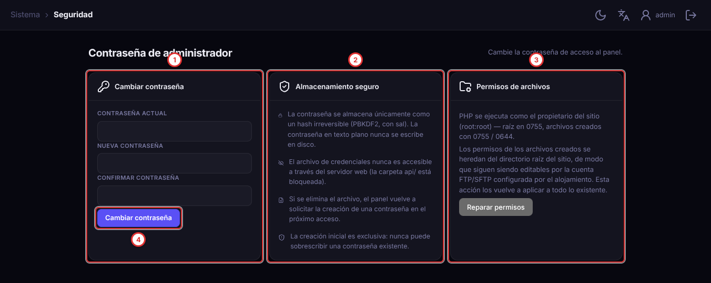{.shot width=88%}

::: legend
| n | qué es |
|-|----------------------|
| 1 | **Cambiar la contraseña**: actual, nueva, confirmación. |
| 2 | **Almacenamiento seguro**: cómo se guarda. |
| 3 | **Permisos de archivos**: el estado, y [Reparar permisos]{.ui}. |
| 4 | [Cambiar contraseña]{.ui}. |
:::

## 16.1. Cambiar la contraseña

Rellene los tres campos y haga clic en [Cambiar contraseña]{.ui}. Hay que conocer la anterior: así se evita que alguien que encuentre su sesión abierta le deje fuera.

- **8 caracteres como mínimo** («Contraseña demasiado corta (mínimo 8 caracteres).»).
- Otros mensajes: «Las contraseñas no coinciden.», «La contraseña actual es incorrecta.», «Error al cambiar la contraseña.» y, al final, «Contraseña modificada ✓».
- Usted **sigue conectado**, pero **se cierran todas las demás sesiones**. Las contraseñas ya almacenadas se vuelven a convertir en huella con un coste mayor en la próxima conexión.

::: tip
Procure usar **12 caracteres o más**. Una frase fácil de recordar vale más que una palabra complicada: `microscopio-embrion-2026` es mucho más sólida que `M1cr0!`.
:::

## 16.2. Cómo se almacena la contraseña

- **Nunca en claro.** El servidor solo guarda una huella irreversible (PBKDF2 con sal). A partir de la huella no se puede llegar a la contraseña.
- **El archivo de credenciales nunca se sirve.** Aunque se teclee su dirección exacta, se obtiene un error.
- **Si se elimina el archivo**, el panel vuelve a proponer la creación de una contraseña: es la puerta de emergencia (anexo B).
- **La creación inicial nunca puede sobrescribir** una contraseña existente.
- **Los intentos repetidos se frenan** (§1.4) y las sesiones duran 8 horas.

## 16.3. Reparar los permisos

Útil en algunos alojamientos compartidos, donde el sitio funciona con una cuenta del sistema distinta de la del FTP: los archivos creados por el sitio pasan a ser ilegibles o no modificables. **Síntoma:** un guardado falla sin motivo aparente.

La línea de estado dice, por ejemplo, «PHP (www-data) ≠ propietario del sitio (…)» o «PHP se ejecuta como el propietario del sitio (…)». En el primer caso, haga clic en [Reparar permisos]{.ui}: la operación es inofensiva y vuelve a aplicar los derechos correctos (aviso «{n} entradas corregidas ({failed} fallos).»). En un servidor Windows: «Host Windows: los permisos POSIX no se aplican.»: nada que hacer.

# 17. Documentación — las guías de la plataforma

::: chapter-intro
- Aquí encontrará **este documento** y todos los que se publiquen.
- Vienen del **repositorio del proyecto**: una guía corregida llega **sin actualizar el sitio**.
- **Su idioma** se elige de oficio.
:::

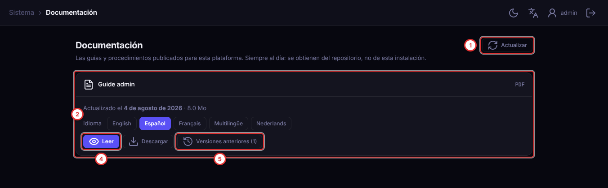{.shot width=88%}

::: legend
| n | qué es |
|-|----------------------|
| 1 | [Actualizar]{.ui}: vuelve a leer la lista desde el repositorio. |
| 2 | Una **tarjeta por documento**, todos los idiomas y versiones juntos. |
| 3 | El **idioma** propuesto (el suyo se elige de oficio). |
| 4 | [Leer]{.ui}: abre el documento en el panel; al lado, [Descargar]{.ui}. |
| 5 | [Versiones anteriores]{.ui}. |
:::

## 17.1. De dónde vienen estos documentos

No de esta instalación: se publican en el repositorio y se recuperan al mostrar la pestaña. Si el servidor no puede contactar con GitHub, la lista no se muestra y un banner le dice por qué («No se puede contactar con GitHub para leer la lista de documentos.»); no es una avería del sitio, solo de esa lista. Otros mensajes: «Límite de la API de GitHub alcanzado. Reinténtelo en unos minutos.», «La carpeta DOCS/ todavía no existe en el repositorio.».

La lista se guarda en memoria **diez minutos**: un documento recién publicado puede tardar un momento en aparecer. [Actualizar]{.ui} fuerza la relectura.

## 17.2. Elegir el idioma y leer

Los idiomas disponibles (Français, English, Nederlands, Español, Deutsch, Italiano, Português, Multilingüe) se muestran como botones. La elección se hace en este orden: **su idioma de interfaz**, si no **el inglés**, si no **Multilingüe**, si no el primero disponible: nunca una tarjeta vacía porque falte una traducción.

[Versiones anteriores]{.ui} despliega las ediciones antiguas: un documento corregido **no sustituye** al anterior, se añade. [Leer]{.ui} muestra el documento en el panel; [Nueva pestaña]{.ui} lo abre a tamaño grande y [Cerrar]{.ui} lo cierra.

::: note
**No todos los formatos se muestran.** PDF, imágenes (`png`, `jpg`) y texto (`txt`, `md`) se leen en el panel. Los demás (Word, hoja de cálculo, archivo comprimido) no tienen botón [Leer]{.ui}: se descargan. Es una decisión de seguridad.
:::

## 17.3. Publicar un documento

Reservado a la persona que gestiona el repositorio, pero conviene saberlo para pedir lo correcto. Un documento se publica depositando un archivo en la carpeta `DOCS/` del repositorio, con un nombre que sigue una regla estricta:

```
261007 - GUIDE-ADMIN - ES.pdf
└─┬──┘   └────┬────┘   └┬┘
  │           │         └── el idioma
  │           └──────────── el identificador del documento, el mismo de una versión a otra
  └──────────────────────── la fecha AAMMDD: es el número de versión
```

- **La fecha** ordena las versiones: la más reciente se propone y las demás siguen siendo accesibles. Esta guía, fechada el **7 de octubre de 2026**, pasa a ser «la más reciente» frente a las ediciones de agosto de 2026.
- **El identificador** debe seguir siendo **idéntico** de una versión a otra; si no, el panel ve dos documentos distintos.
- Un archivo que no sigue la regla se **señala como ignorado** («Archivos ignorados (nombre no válido)») al pie de la pestaña: un error de tecleo se nota.

# Anexo A — Primera instalación

::: chapter-intro
- Solo afecta a la **primerísima puesta en marcha** de un sitio nuevo.
- Un asistente de **5 pasos**; solo el primero es obligatorio.
- La contraseña del paso 1 sirve también para las instalaciones de plugins del paso 5.
:::

Cuando no existe ninguna cuenta de administrador, abrir `admpan.html` activa la **Instalación guiada**. Una barra de 5 segmentos muestra el avance; abajo: [Atrás]{.ui}, [Omitir]{.ui}, [Siguiente]{.ui} (y luego [Finalizar]{.ui}). Si hace clic en [Omitir]{.ui}, el asistente termina de inmediato: los valores ya introducidos se conservan, **los pasos siguientes no se hacen** (por tanto, **no se instala ningún plugin** si omite antes del paso 5: hágalo en Catálogo).

## Paso 1 — Cuenta de administrador

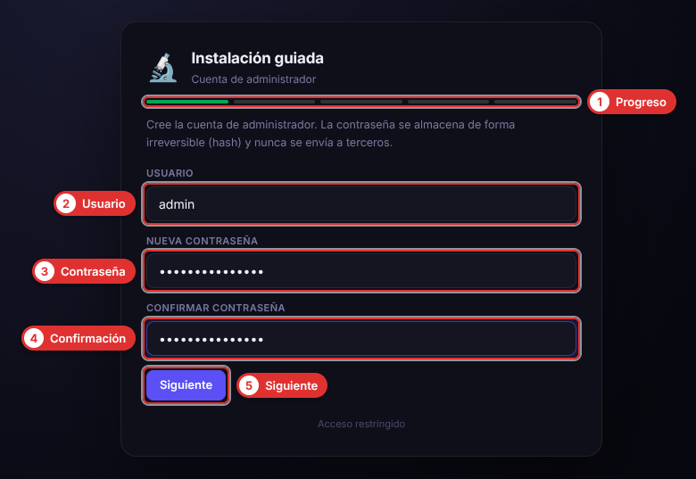{.shot width=75%}

::: legend
| n | qué es |
|-|----------------------|
| 1 | La **progresión** (5 segmentos). |
| 2 | **Usuario** (`admin` por defecto). |
| 3 | **Nueva contraseña**: **8 caracteres como mínimo**. |
| 4 | **Confirmar contraseña**. |
| 5 | [Siguiente]{.ui}. |
:::

Es **el único paso obligatorio**. La creación es **exclusiva**: nunca puede sobrescribir una cuenta existente («Ya existe una contraseña. Recargue la página para iniciar sesión.»). La sesión se abre a continuación: no tiene que volver a conectarse. Errores: «Contraseña demasiado corta (mínimo 8 caracteres).», «Las contraseñas no coinciden.».

## Paso 2 — Identidad

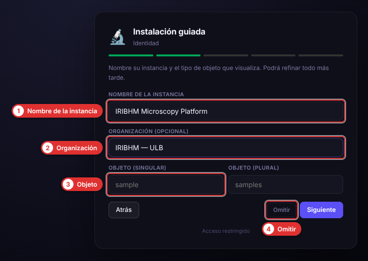{.shot width=75%}

::: legend
| n | qué es |
|-|----------------------|
| 1 | **Nombre de la instancia**. |
| 2 | **Organización (opcional)**. |
| 3 | **Objeto (singular)** y **Objeto (plural)**: la palabra que designa sus objetos de estudio. |
| 4 | [Omitir]{.ui}. |
:::

Modificable después en **Identidad** (capítulo 8).

## Paso 3 — Tema

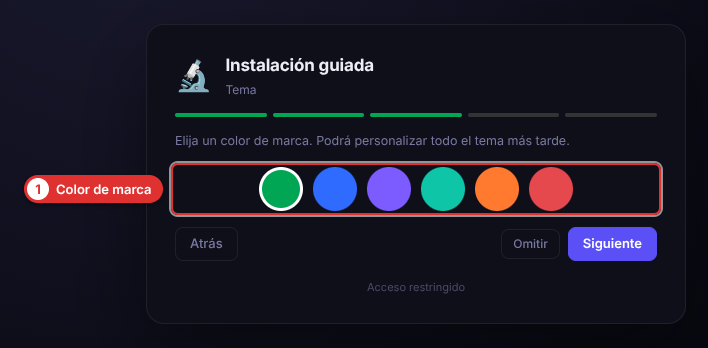{.shot width=75%}

Un **color de marca** entre seis (verde preseleccionado). Se puede afinar después en **Apariencia** (capítulo 9).

## Paso 4 — Textos

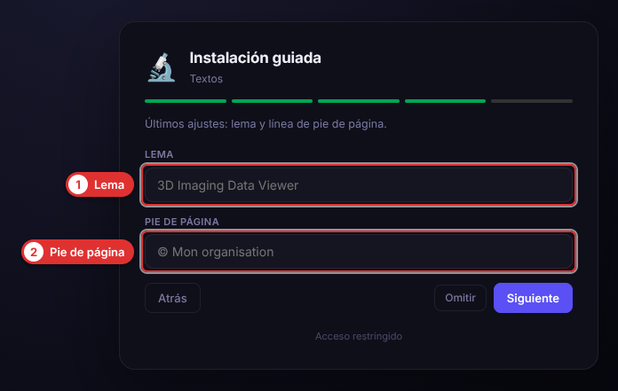{.shot width=75%}

El **lema** y el **pie de página**. Modificables después en **Identidad**.

## Paso 5 — Plugins

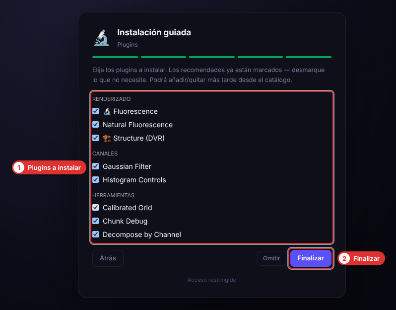{.shot width=75%}

La lista, agrupada en **Renderizado / Canales / Herramientas**, procede del catálogo firmado («Cargando el catálogo…»). Los plugins recomendados ya están **marcados**; desmarque los que no necesite. Un plugin incompatible aparece en gris «(incompatible)». Si el catálogo es inalcanzable: «Catálogo no disponible — podrá instalar plugins más tarde desde la pestaña Catálogo.».

[Finalizar]{.ui} instala la selección («Instalando plugins…», «{n} plugin(s) instalado(s).») y abre el panel. **La contraseña del paso 1 autoriza estas instalaciones**: no se pide nada dos veces.

::: note
El asistente solo escribe la marca, el objeto, la organización, el pie de página y el tema elegido.
:::

# Anexo B — Si algo va mal

::: chapter-intro
- Casi todo se **deshace** con un botón «Restablecer» o «Reset».
- Una transferencia interrumpida **se reanuda** si vuelve a arrastrar la misma carpeta.
- Los mensajes «restauración automática realizada» **no piden nada**.
:::

### «He olvidado la contraseña de administrador»

Es **imposible** recuperarla: el servidor solo guarda una huella irreversible. La solución requiere acceso a los archivos del servidor (FTP, SFTP, gestor de archivos del proveedor de alojamiento):

::: steps
1. Elimine, o mejor **renombre**, el archivo `api/admin_credential.json`.
2. Vuelva a abrir `admpan.html`: reaparece el asistente de primera instalación.
3. Cree una contraseña nueva.
:::

**No se pierde nada más**: ni datasets, ni páginas, ni ajustes. Durante ese breve lapso, cualquiera que abriera la página podría crear la cuenta en su lugar: hágalo de una sola vez.

### «Demasiados intentos. Inténtelo de nuevo más tarde.»

Tras 10 fallos en 15 minutos, el acceso queda bloqueado 15 minutos. Espere y vuelva a intentarlo con la contraseña correcta. Detrás de un proxy, véase el §1.4.

### «He modificado algo y el sitio se ha roto»

| Pestaña | Cómo volver atrás |
|---|---|
| **Identidad** | [Restablecer]{.ui} |
| **Apariencia** | [Restablecer]{.ui} |
| **Páginas** | [Predet.]{.ui} en el editor y luego **Publicar** |
| **Aviso legal** | [Restablecer]{.ui} |
| **Tipos de datos** | [Nombres por defecto]{.ui} y luego [Guardar]{.ui} |
| **Datasets** | [↺ Restablecer]{.ui} (antes de haber guardado); el ojo se vuelve a conmutar |
| **Actualizaciones de datos** | La cruz **cancelar**: el dataset queda como estaba |
| **Importar** | [Eliminar]{.ui} borra los archivos enviados (nunca un dataset publicado) |

### «Un conjunto de datos no aparece en la lista»

1. Mire los filtros: [Ocultos]{.ui} e [Importar]{.ui} esconden líneas; vuelva a [Todos]{.ui}.
2. Si viene de una **importación**: [Publicar]{.ui} y luego **active la visibilidad** (un dataset publicado desde Importar está oculto por defecto).
3. Compruebe que está en `DATA_WEB/3d/`, `DATA_WEB/2d/` o `DATA_WEB/live/` (nombres de carpeta obligatorios; renombrar un *tipo* solo cambia la visualización) y que su carpeta contiene un `metadata.json`.
4. Recargue la página. **No hay ningún catálogo que regenerar**.

En un alojamiento PHP, si la pestaña está totalmente vacía, es que la respuesta de la lista no se pudo leer: pida a la persona que gestiona el servidor que compruebe `api/datasets.php?action=list`.

### «Mi importación se detuvo» / «Conexión perdida»

- **Conexión perdida**: nada que hacer, la transferencia se reanuda sola cuando vuelve la red.
- **Importación interrumpida** (pestaña cerrada, avería): **vuelva a arrastrar la misma carpeta**. Se reanuda al bloque exacto. Si no se reanuda, el servidor libera el espacio a los **7 días**.
- **Espacio en disco insuficiente**: libere espacio y vuelva a arrastrar.
- **Falla una validación** (`missing_pack`, `truncated_pack`…): vuelva a arrastrar la carpeta para reenviar lo que falta y luego [Verificar]{.ui} de nuevo.

### «La opción El servidor está en gris en Actualizaciones de datos»

El alojamiento no sabe decodificar (o codificar) WebP sin pérdida, no tiene NumPy o zlib, o limita demasiado la memoria o el tiempo. La información emergente da el motivo. **Use [Este navegador]{.ui}**: funciona en todas partes.

### «Mi dirección ha sido bloqueada por el proveedor de alojamiento durante una actualización de datos»

Deje **una sola pestaña** abierta, no relance en bucle y espere: el regulador de red reduce el ritmo solo (6 peticiones en vuelo como máximo) y reanuda. Si el bloqueo persiste, contacte con el proveedor de alojamiento.

### «Una función ha desaparecido del visor»

Mire la pestaña **Plugins**: lo más probable es que el plugin esté desactivado, o que haya pasado a **no fiable** tras una modificación de sus archivos (§12.5). En la vista previa de Datasets, los plugins «solo página» no están: es normal (§12.7).

### «Un guardado falla sin mensaje claro»

Pruebe **Seguridad › [Reparar permisos]{.ui}** (§16.3): es la causa más frecuente en los alojamientos compartidos.

### «La actualización ha fallado»

Si el mensaje dice «restauración automática realizada», **no hay nada que hacer**: el sitio ha vuelto a su versión anterior. Inténtelo de nuevo más tarde, o comunique el mensaje de error.

### «El panel es ilegible / los menús desplegables están en blanco sobre blanco»

Haga una **recarga forzada**: <kbd>Ctrl</kbd> + <kbd>Mayús</kbd> + <kbd>R</kbd> (Windows) o <kbd>Cmd</kbd> + <kbd>Mayús</kbd> + <kbd>R</kbd> (Mac). El navegador a veces conserva archivos antiguos en memoria.

Una pestaña que no carga muestra «No se pudo cargar esta pestaña. Recargue la página.».

# Anexo C — Pequeño glosario

::: chapter-intro
- Las palabras técnicas que aparecen en esta guía, **en una línea cada una**.
- Ordenadas por tema: datos, extensiones, páginas, seguridad.
:::

### Los datos

| Término | Qué significa aquí |
|---|---|
| **Canal** | Un marcaje fluorescente (DAPI, GFP, Pecam1…). Un conjunto de datos suele contener varios, superpuestos. |
| **Vóxel** | El equivalente de un píxel en tres dimensiones. Su tamaño real lo da la calibración (§3.6). |
| **Ladrillo (brick)** | Un pequeño cubo de volumen (64×64×64 vóxeles, o 66³ con borde en el formato 4). El sitio los carga bajo demanda para mostrar volúmenes de varios gigabytes sin descargarlo todo. |
| **LOD** | *Level of Detail*: varias resoluciones del mismo volumen. El sitio muestra primero una versión gruesa y luego afina. |
| **Tipo de conjunto de datos** | Una de las tres categorías: `3d` (volumen fijo), `2d` (fotografía calibrada), `live` (serie temporal 4D, con el seguimiento de sus células si lo hay). Son las carpetas del servidor; el nombre que ve el público se ajusta en **Tipos de datos** (capítulo 6). |
| **Formato de datos** (`formatVersion`) | El «nivel de acondicionamiento» de un dataset publicado, de 1 a 4 (actual: 4). Se lleva al día en **Actualizaciones de datos**. |
| **Planos** (`planes/`) | Formato 2: una copia del nivel nativo **plano a plano** (PNG sin pérdida), para cortes XY rápidos en el Studio. |
| **Proyecciones de capa** (`mips/`) | Formato 3: la proyección máxima de cada capa de 64 planos, para figuras z-stack rápidas. |
| **Pirámide de ladrillos v3** | Formato 4: ladrillos 66³ con borde de un vóxel, niveles reducidos también en Z, `index.bin`. Aporta el filtrado sin costuras y el «Zoom detail». |
| **Lado de la muestra** | Ajuste que dice si el archivo muestra la muestra vista desde arriba («al derecho») o desde abajo («al revés»). |
| **Vista por defecto** | La pose en la que se abre un dataset, guardada desde la vista previa. |

### Las transferencias y las actualizaciones de datos

| Término | Qué significa aquí |
|---|---|
| **Staging / importación pendiente** | La zona privada donde llegan los archivos de una importación, nunca servida por URL, antes de su clic en [Publicar]{.ui}. |
| **Ejecutor** | Quien hace el cálculo de una actualización de datos: **este navegador** o **el servidor**. Cada uno tiene su cola. |
| **Regulador de red** | La salvaguarda que limita el número de peticiones enviadas al proveedor de alojamiento (6 en vuelo, de 4 a 6 por segundo) para evitar que bloquee su dirección. |
| **Registro** | El cuaderno que lleva el servidor de lo que ya ha llegado o se ha convertido: permite **reanudar** en el punto exacto. |

### Las extensiones, las páginas, la seguridad

| Término | Qué significa aquí |
|---|---|
| **Plugin** | Un módulo que añade una función al visor (§12.1). |
| **Sandbox (entorno aislado)** | Un modo de ejecución aislado: el plugin funciona, pero no puede acceder al resto de la página. |
| **Huella** | Una firma del contenido exacto de un archivo: si el archivo cambia un solo carácter, la huella cambia. |
| **Slug** | La dirección corta de una página (`protocolos` en `page.html?slug=protocolos`). |
| **Sección / Columna / Elemento** | Los tres niveles de construcción de una página (§10.5). |
| **Borrador** | Una versión guardada pero **aún no visible** para el público. |
| **SEO** | Los textos que muestran los buscadores y las redes sociales. |

---

*Documento escrito para la versión **1.59.3** de la plataforma (pipeline 0.21.0, formato de datos 4). Las capturas de pantalla muestran un conjunto de datos de demostración (embriones sintéticos); los colores pueden diferir si se ha modificado el tema.*
