# Handleiding voor de beheerder

**Lumen3D-platform — IRIBHM Microscopy Platform**

---

Dit document legt uit **wat u allemaal kunt doen vanuit het beheerpaneel** van de site.

Het is geschreven voor iemand die **dit paneel nog nooit heeft gezien** en die **niet kan programmeren**. Geen commando's, geen bestanden om te bewerken: alles wat hier staat, doet u met de muis, vanuit een browser.

> **Twee regels om te onthouden voordat u begint**
>
> 1. **Er gaat niets verloren zolang u niet op "Opslaan" hebt geklikt** (of "Publiceren"). U mag gerust overal klikken om rond te kijken.
> 2. **Het paneel raakt uw beelden nooit aan.** De microscopiebestanden zijn alleen-lezen; het paneel wijzigt enkel instellingen (namen, teksten, kleuren, zichtbaarheid).

---

## Inhoud

**Aan de slag**

- [1. Inloggen op het paneel](#1-inloggen-op-het-paneel)
- [2. Een rondleiding](#2-een-rondleiding)

**De tabbladen, één voor één**

- [3. Datasets](#3-datasets)
- [4. Statistieken — wie bekijkt wat](#4-statistieken--wie-bekijkt-wat)
- [5. Plug-ins — de functies van de viewer](#5-plug-ins--de-functies-van-de-viewer)
- [6. Catalogus — nieuwe plug-ins installeren](#6-catalogus--nieuwe-plug-ins-installeren)
- [7. Beveiliging — wachtwoord en rechten](#7-beveiliging--wachtwoord-en-rechten)
- [8. Updates — de site laten meegroeien](#8-updates--de-site-laten-meegroeien)
- [9. Verwerkingsketen — nieuwe data voorbereiden](#9-verwerkingsketen--nieuwe-data-voorbereiden)
- [10. Identiteit — de naam en het vocabulaire van de site](#10-identiteit--de-naam-en-het-vocabulaire-van-de-site)
- [11. Pagina's — de visuele editor](#11-paginas--de-visuele-editor)
- [12. Vormgeving — de kleuren van de site](#12-vormgeving--de-kleuren-van-de-site)
- [13. Juridische informatie](#13-juridische-informatie)

**Bijlagen**

- [A. Eerste installatie (begeleide wizard)](#bijlage-a--eerste-installatie)
- [B. Als er iets misgaat](#bijlage-b--als-er-iets-misgaat)
- [C. Kleine woordenlijst](#bijlage-c--kleine-woordenlijst)

---
---

# 1. Inloggen op het paneel

## 1.1. Het adres

Het beheerpaneel is **niet** bereikbaar via een link op de publieke site: er staat bewust geen "Beheer"-knop op de pagina's die bezoekers zien, en het paneel vraagt zoekmachines ook om het niet te indexeren.

Om er te komen moet u **het adres met de hand intypen** in de adresbalk van de browser:

```
https://<adres-van-de-site>/admpan.html
```

Vervang `<adres-van-de-site>` door het gebruikelijke adres van de site. Als de publieke site bijvoorbeeld `https://microscopy.example.be` is, dan staat het paneel op `https://microscopy.example.be/admpan.html`.

> 💡 **Tip:** zet dit adres bij uw favorieten, dan hoeft u het nooit meer te onthouden.

## 1.2. De inloggegevens

<!-- ─────────────────────────────────────────────────────────────
     MET DE HAND IN TE VULLEN
     ───────────────────────────────────────────────────────────── -->

> **Toegangsgegevens**
>
> - **Gebruikersnaam:** `……………………`
> - **Wachtwoord:** `……………………`
>
> *(In te vullen. Geef deze gegevens alleen aan de mensen die de site echt moeten beheren.)*

In de PDF-versie van deze handleiding zijn die twee plekken **echte invulvelden**: klik erin, typ, en sla de PDF op (`Ctrl + S`) om te bewaren wat u hebt ingevuld.

## 1.3. Het inlogscherm

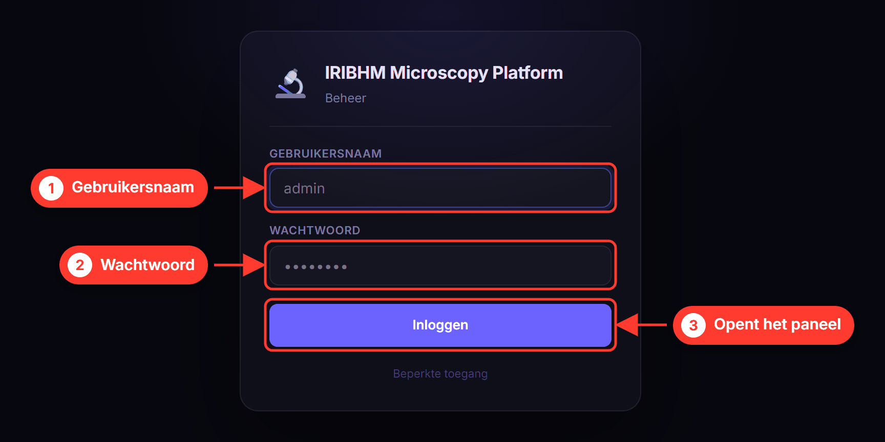

| | |
|---|---|
| **1** | Uw gebruikersnaam (standaard `admin`). |
| **2** | Uw wachtwoord. |
| **3** | Opent het paneel. De **Enter**-toets doet hetzelfde. |

Zijn de gegevens verkeerd, dan verschijnt er een rode melding boven de velden. Er volgt geen blokkering na meerdere pogingen: probeer gewoon opnieuw.

**Wat er daarna gebeurt:** de browser krijgt een sessietoken waarmee u ingelogd blijft. Dat token is **niet** leesbaar voor de pagina's van de site, en het verdwijnt zodra u uitlogt of de server herstart. Komt u de volgende dag terug, dan moet u waarschijnlijk opnieuw inloggen — dat is normaal.

> ⚠️ **Het wachtwoord staat nergens op de server.** Het wordt omgezet in een onomkeerbare vingerafdruk (zie §7). Niemand — ook de hoster niet — kan het terugvinden. **Raakt u het kwijt**, dan is de enige uitweg beschreven in [Bijlage B](#bijlage-b--als-er-iets-misgaat).

---

# 2. Een rondleiding

Zodra u bent ingelogd, valt het scherm uiteen in drie zones die nooit veranderen.

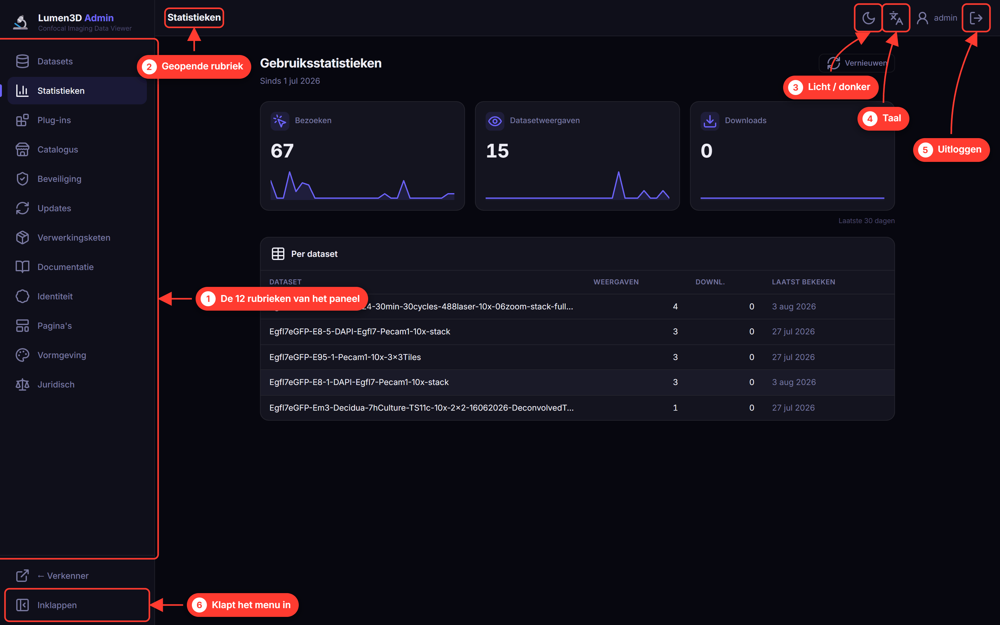

| | |
|---|---|
| **1** | **Het linkermenu** — de 11 rubrieken van het paneel. Dit is de ruggengraat: elk hoofdstuk van deze handleiding hoort bij één van deze items. |
| **2** | **De titel** herinnert u eraan welke rubriek open staat. |
| **3** | **Licht / donker thema** — verandert alleen *uw* beeld van het paneel, niet de publieke site. |
| **4** | **Taal** van het paneel (Nederlands, Engels, Frans, Spaans). |
| **5** | **Uitloggen.** |
| **6** | **Inklappen** — vouwt het menu terug tot pictogrammen om ruimte te winnen. |

Helemaal onderaan het menu opent de link **"← Verkenner"** de publieke site in een nieuw tabblad: handig om het effect van een wijziging te controleren.

## 2.1. De bovenbalk in detail

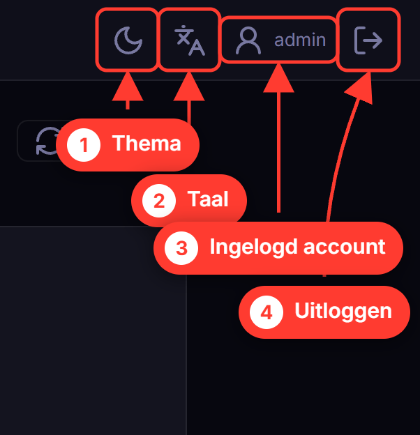

## 2.2. Het teken "Niet-opgeslagen wijzigingen"

Zodra u iets wijzigt zonder het op te slaan, verschijnt er bovenaan een oranje bolletje:

> ● Niet-opgeslagen wijzigingen

Dat is een **herinnering**, geen fout. Zolang het er staat, zijn uw wijzigingen alleen voor u zichtbaar. Verlaat u de pagina, dan zijn ze weg.

## 2.3. De tabbladen in één oogopslag

| Tabblad | Waarvoor het dient | Hoe vaak |
|---|---|---|
| **Datasets** | Elke dataset een naam geven, beschrijven, tonen of verbergen | Vaak |
| **Statistieken** | Zien hoeveel de site gebruikt wordt | Af en toe |
| **Plug-ins** | De functies van de 3D-viewer in- of uitschakelen | Zelden |
| **Catalogus** | Nieuwe functies installeren | Zelden |
| **Beveiliging** | Het wachtwoord wijzigen | Zelden |
| **Updates** | Een nieuwe versie van de site installeren | Af en toe |
| **Verwerkingsketen** | Het gereedschap downloaden dat nieuwe data voorbereidt | Zelden |
| **Identiteit** | Naam van de site, vocabulaire, voettekst, menu | Zelden |
| **Pagina's** | De inhoud van pagina's bewerken (start, over…) | Vaak |
| **Vormgeving** | Kleuren en lettertype van de publieke site | Zelden |
| **Juridisch** | Juridische tekst | Zelden |

---

# 3. Datasets

Dit is het tabblad dat u het vaakst zult openen. Hier **beschrijft** u de datasets en **kiest u welke zichtbaar zijn** voor het publiek.

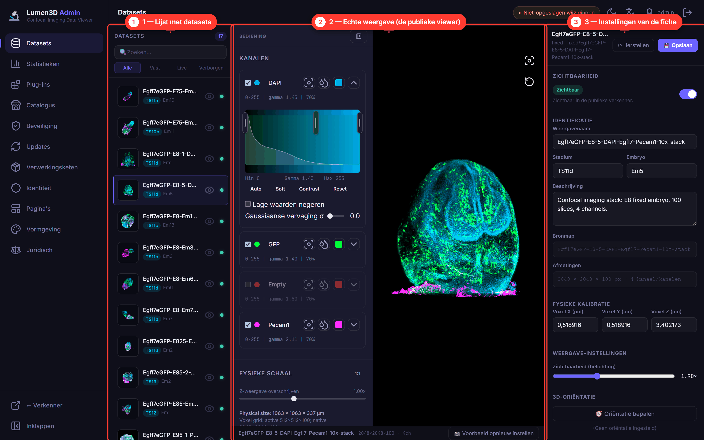

Het scherm is verdeeld in **drie kolommen**:

1. **de lijst** met alle datasets;
2. **de weergave** — de echte viewer, precies zoals een bezoeker die ziet;
3. **de instellingen** van de geselecteerde dataset.

> ### 📌 Hoe komt een dataset hier terecht?
>
> U maakt een dataset **niet** aan vanuit het paneel. Het verloop is:
>
> 1. de ruwe microscoopbeelden worden verwerkt door het voorbereidingsgereedschap (zie [§9](#9-verwerkingsketen--nieuwe-data-voorbereiden));
> 2. de resulterende map wordt naar de map `DATA_WEB` op de server gekopieerd (via FTP, of door wie de server beheert);
> 3. **hij verschijnt meteen in deze lijst** — er valt niets te regenereren, geen knop om op te drukken.
>
> Het paneel dient daarna om hem een presentabele naam te geven en te beslissen of hij publiek is.

## 3.1. De linkerkolom: een dataset vinden

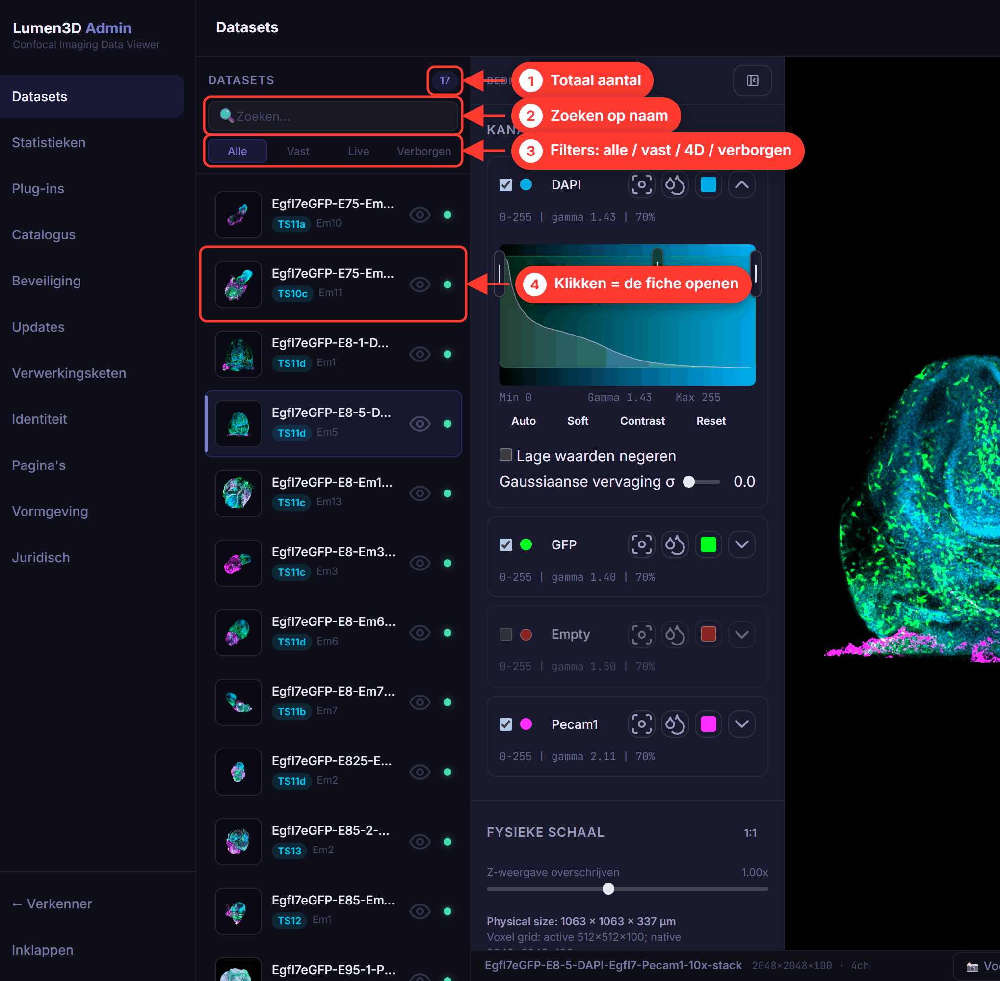

| | |
|---|---|
| **1** | Het totale aantal datasets op de server. |
| **2** | **Zoeken** — typ een stukje van een naam en de lijst filtert meteen mee. |
| **3** | **Filters** — `Alle`, `Vast` (stilstaande volumes), `Live` (4D-tijdreeksen), `Verborgen` (de niet-publieke). |
| **4** | **Klik op een miniatuur** om de fiche te openen. |

Op elke regel, rechts van de naam:

- **het oog** geeft aan of de dataset zichtbaar is voor het publiek;
- **het groene bolletje** betekent dat de bestanden volledig en leesbaar zijn.

## 3.2. De middelste kolom: de weergave

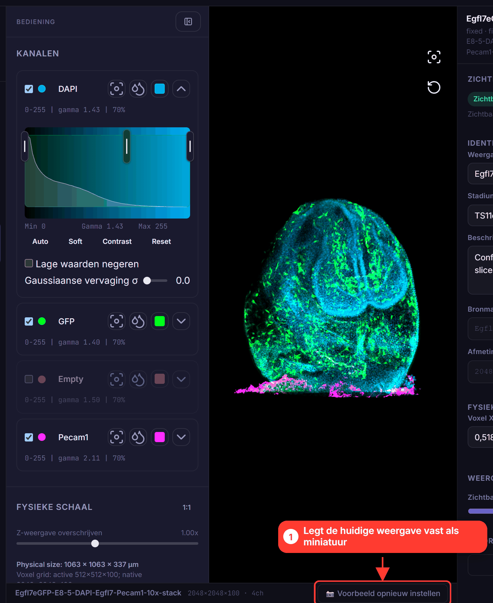

Dit is geen stilstaand beeld: het is **de echte 3D-viewer**, geladen binnen het paneel. U kunt het volume draaien, kanaalkleuren wijzigen, het contrast bijstellen — precies zoals een bezoeker.

> ### 📌 Deze weergave is meer dan een weergave
>
> Sommige instellingen die u hier maakt, worden **door het paneel overgenomen** en samen met de dataset bewaard wanneer u op **Opslaan** klikt:
>
> - de **kanaalinstellingen** — naam, kleur, min / max / gamma, getoond of verborgen (zie §3.4);
> - de **helderheid** (belichting);
> - de **oriëntatie** als u die op dat moment aan het bepalen bent (zie §3.5).
>
> Al de rest — camerastand, weergavemodus, kwaliteit, achtergrond, snijvlak — dient alleen om te kijken en **wordt niet bewaard**.
>
> Daarom kan het bolletje **"Niet-opgeslagen wijzigingen"** verschijnen enkel omdat u een schuifregelaar in de weergave hebt aangeraakt. Wilde u niets wijzigen, klik dan op **↺ Herstellen** in plaats van op Opslaan.

De knop **📸 Voorbeeld opnieuw instellen** (rechtsonder) **legt de huidige weergave vast** en gebruikt die als miniatuur van de dataset in de publieke verkenner. Draai het volume zoals u het wilt tonen en klik dan.

Een groot volume laden duurt enkele seconden — dat is normaal, de data beslaat meerdere gigabytes en wordt stuk voor stuk opgehaald.

## 3.3. De rechterkolom: de instellingen

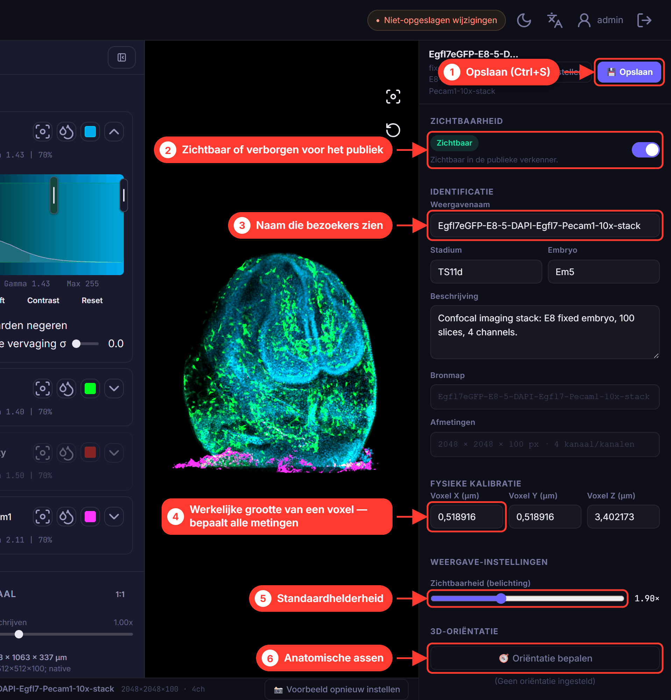

| | |
|---|---|
| **1** | **Opslaan** — bewaart uw wijzigingen. Sneltoets: **Ctrl + S**. De knop **↺ Herstellen** gooit niet-opgeslagen wijzigingen weg. |
| **2** | **Zichtbaarheid** — de schakelaar bepaalt of de dataset in de publieke verkenner verschijnt. |
| **3** | **Weergavenaam** — de naam die bezoekers te zien krijgen. |
| **4** | **Fysieke kalibratie** — de werkelijke grootte van één voxel in micrometer. |
| **5** | **Zichtbaarheid (belichting)** — de standaardhelderheid bij het openen. |
| **6** | **3D-oriëntatie** — zie §3.5. |

### Elk veld in detail

**Zichtbaarheid**
De schakelaar bovenaan. `Zichtbaar` = iedereen kan hem via de verkenner bereiken. Verborgen = hij blijft op de server staan en blijft bereikbaar als u het exacte adres kent, maar duikt niet meer op in lijsten. Handig voor een dataset die nog nagekeken wordt, of die bij een nog niet verschenen artikel hoort.

**Identificatie**

- **Weergavenaam** — vervang de technische mapnaam door iets leesbaars. Dit is de naam die overal op de publieke site verschijnt.
- **Stadium** en **Specimen** — de twee labels waarop in de verkenner gefilterd wordt. Ze worden automatisch ingevuld op basis van de mapnaam; verbeter ze als de herkenning het mis had.
- **Beschrijving** — vrije tekst op de publieke fiche. Schrijf wat een collega verder helpt: gebruikte markers, omstandigheden, bijzonderheden.
- **Bronmap** en **Afmetingen** — grijs, **niet bewerkbaar**. Ze worden uit de bestanden gelezen.

**Fysieke kalibratie — ⚠️ het belangrijkste veld**
De drie waarden `Voxel X / Y / Z` geven de werkelijke grootte van één beeldpunt, in micrometer. **Elke meting die bezoekers doen, hangt ervan af**: het afstandsgereedschap, de schaalbalk, de getoonde afmetingen.

Deze waarden worden automatisch uit het microscoopbestand gelezen en kloppen normaal gezien. **Wijzig ze alleen als u een concrete reden hebt om te denken dat ze fout zijn** — een verkeerde waarde maakt stilzwijgend elke meting ongeldig die op basis van die dataset gepubliceerd wordt.

Merk op dat `Voxel Z` vaak veel groter is dan X en Y (bijvoorbeeld `0,52 / 0,52 / 3,40`): dat is normaal, de afstand tussen twee doorsneden is groter dan de resolutie in het vlak.

**Weergave-instellingen**
De schuifregelaar **Zichtbaarheid (belichting)** bepaalt de helderheid bij het openen. Lijkt een dataset op het eerste gezicht te donker, zet hem dan hoger. Bezoekers kunnen hem nadien altijd zelf bijstellen.

## 3.4. De kanalen instellen

Een microscopiedataset bevat meerdere **kanalen** — één per fluorescerende marker. Hier bepaalt u hoe die er **standaard** uitzien, dus wat een bezoeker ziet die de dataset opent zonder iets aan te raken.

Deze instellingen maakt u in de **zijbalk van de weergave** (middelste kolom); ze worden samen met de rest van de fiche bewaard wanneer u op **💾 Opslaan** klikt.

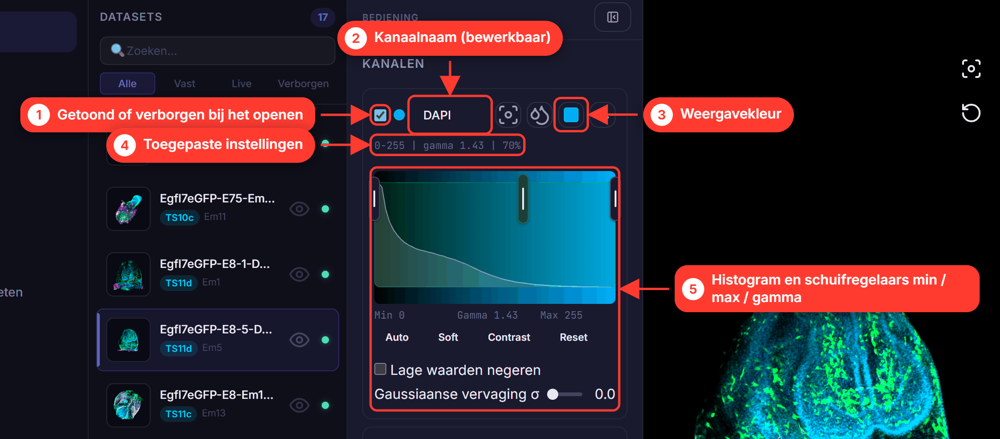

| | |
|---|---|
| **1** | **Het vinkje** — wordt het kanaal bij het openen getoond of verborgen? |
| **2** | **De naam van het kanaal** — klik erin en typ om hem te wijzigen. |
| **3** | **De weergavekleur** van het kanaal. |
| **4** | Het **overzicht** van de toegepaste instellingen (min–max, gamma, dekking). |
| **5** | Het **uitgebreide paneel**: histogram en schuifregelaars. Open het met het pijltje ⌄ rechts op de regel. |

### Wat u kunt instellen

**De naam.** Kanalen heten vaak `Channel 1`, `Channel 2`… Vervang ze door de echte marker — `DAPI`, `GFP`, `Pecam1`. Dat is de naam die bezoekers zien.

**De kleur.** De gekleurde knop opent een palet. Kies kleuren die de markers duidelijk uit elkaar houden.

> 💡 Sommige kleuren worden automatisch toegekend op basis van de kanaalnaam: een kanaal dat `DAPI` heet wordt blauw, `GFP` groen, `Pecam1` magenta. Een kanaal correct hernoemen volstaat dus vaak om de juiste kleur te krijgen.

**Getoond of verborgen.** Vink een weinig informatief kanaal uit (een leeg kanaal, een autofluorescentiekanaal): het blijft beschikbaar, maar de bezoeker ziet het niet meteen. Dit is veruit de nuttigste instelling voor een verzorgde eerste indruk.

**Min / max / gamma.** In het uitgebreide paneel toont het histogram hoe de intensiteiten verdeeld zijn, en de drie grepen stellen de ondergrens, de bovengrens en de gamma in. De knoppen **Auto**, **Zacht** en **Contrast** bieden kant-en-klare instellingen; **Herstellen** gaat terug naar het begin.

> ⚠️ **Deze instellingen zijn cosmetisch, niet destructief.** Ze veranderen hoe de data wordt *weergegeven*, nooit de data zelf. Een bezoeker kan alles zelf bijstellen; u legt enkel het vertrekpunt vast.

**Vergeet niet op 💾 Opslaan te klikken** in de rechterkolom: zonder dat zijn uw kanaalinstellingen weg zodra u van dataset wisselt.

## 3.5. De anatomische oriëntatie bepalen

Met de knop **🧭 Oriëntatie bepalen** geeft u aan waar de voorkant, de bovenkant en de rechterkant van het specimen zitten. Eenmaal ingesteld, zien bezoekers een assenstelsel met drie richtingen in de viewer.

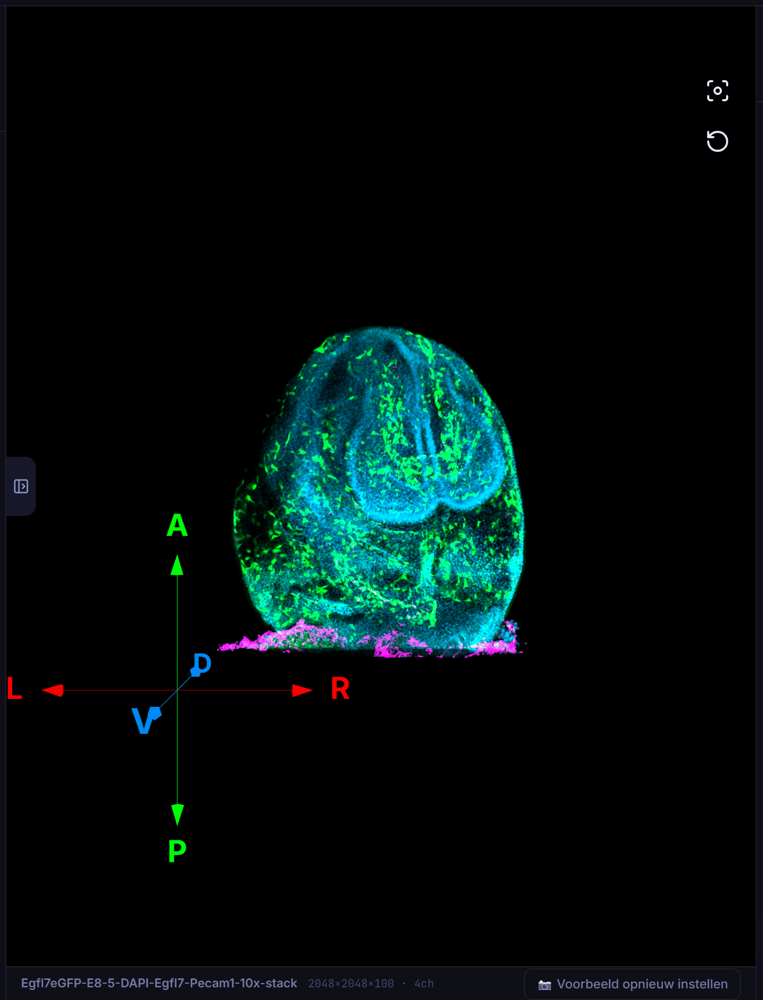

Er verschijnen drie gekleurde assen op het volume:

| As | Kleur | Betekenis |
|---|---|---|
| **A / P** | groen | Anterior ↔ Posterior (voor / achter) |
| **D / V** | blauw | Dorsaal ↔ Ventraal (rug / buik) |
| **L / R** | rood | Links ↔ Rechts |

**Zo gaat u te werk:**

1. klik op **🧭 Oriëntatie bepalen**;
2. draai het volume in de weergave tot het specimen goed uitgelijnd staat op de getoonde assen;
3. klik op **💾 Opslaan** bovenaan de rechterkolom.

De knop wordt intussen **✕ Oriëntatie annuleren**: daarmee stapt u eruit zonder iets te wijzigen.

## 3.6. Wanneer er geen dataset geselecteerd is

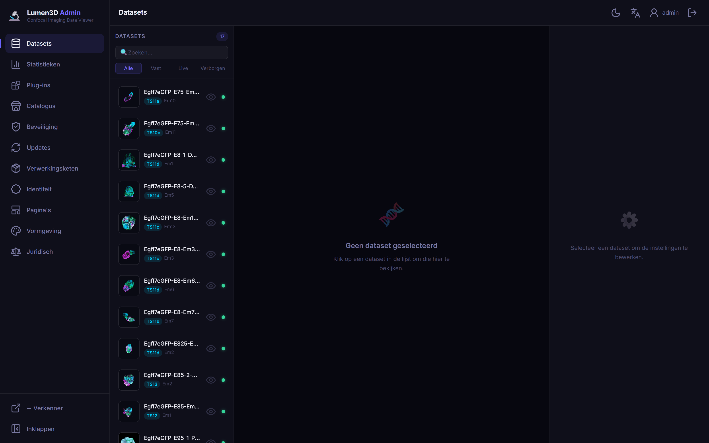

Dit is het startscherm van het tabblad. Klik gewoon links op een miniatuur.

---

# 4. Statistieken — wie bekijkt wat

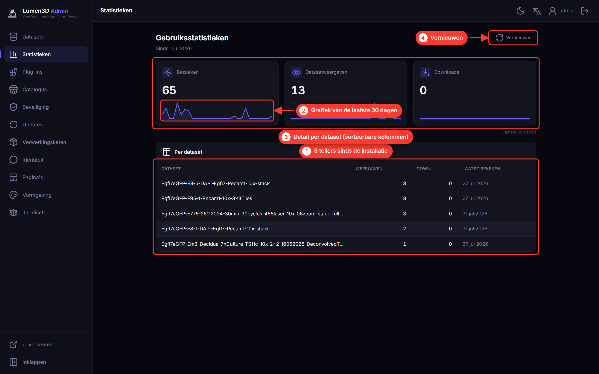

| | |
|---|---|
| **1** | Drie tellers, opgeteld sinds de installatie. |
| **2** | Het kleine lijntje toont de **laatste 30 dagen**. |
| **3** | Het overzicht **per dataset**. Klik op een kolomkop om te sorteren. |
| **4** | **Vernieuwen** — haalt de cijfers opnieuw op. |

**Wat de drie tellers tellen:**

- **Bezoeken** — hoe vaak een pagina van de site geopend is.
- **Datasetweergaven** — hoe vaak een dataset in de viewer geopend is. Dit is het meest zeggende cijfer.
- **Downloads** — hoeveel bestanden er uit het downloadcentrum gehaald zijn.

De tabel onderaan geeft per dataset het aantal weergaven, het aantal downloads en de datum van de laatste raadpleging.

> 🔒 **Er worden geen persoonsgegevens verzameld.** Dit zijn gewone tellers. Er is geen volgcookie, geen bewaard IP-adres, geen externe dienst (geen Google Analytics). Er verlaat niets de server.

---

# 5. Plug-ins — de functies van de viewer

Dit is het meest technische hoofdstuk, maar ook het hoofdstuk dat u de meeste controle geeft. Neem de tijd voor §5.1: de rest volgt eruit.

## 5.1. Wat is hier een plug-in?

De 3D-viewer is bewust gebouwd als een **minimale kern + modules**. Bijna alles wat een bezoeker kan doen — een afstand meten, een schermafbeelding maken, het histogram van een kanaal bijstellen, een weergavemodus kiezen — komt van een **plug-in**, dat wil zeggen een kleine, op zichzelf staande module.

Het voordeel: u kunt **weglaten wat uw labo niet gebruikt**, en later **nieuwe functies toevoegen** zonder aan de rest van de site te raken.

Elke plug-in neemt één van **drie mogelijke plaatsen** in:

| Plaats | Waar de bezoeker het ziet | Voorbeelden |
|---|---|---|
| **Gereedschap** (werkbalk) | De knoppen bovenaan de viewer | Afstandsmeting, schermafbeelding, presentatiemodus, downloadcentrum |
| **Kanalen** (per kanaal) | De regelaars onder elk fluorescentiekanaal, in de zijbalk | Histogram, gaussiaanse vervaging |
| **Weergavemodi** (shaders) | De keuzelijst die bepaalt hoe het volume getekend wordt | Fluorescentie, Structuur (DVR) |

## 5.2. Het scherm

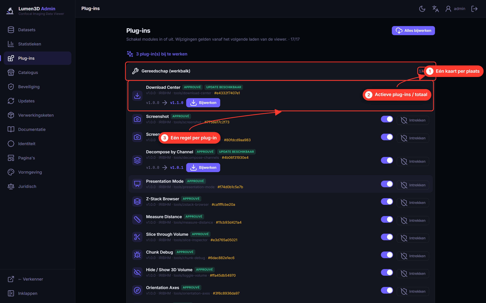

| | |
|---|---|
| **1** | Eén kaart per plaats (Gereedschap, Kanalen, Weergavemodi). |
| **2** | De teller `actief / totaal` van die categorie. |
| **3** | Eén regel per plug-in. |

Ingezoomd op één regel:

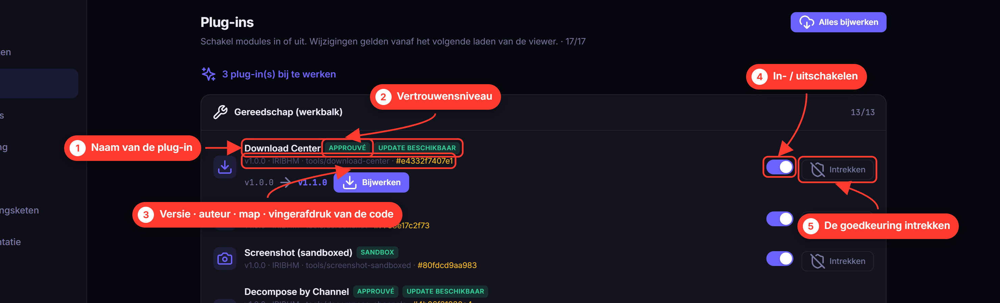

| | |
|---|---|
| **1** | De **naam** van de plug-in. |
| **2** | Het **vertrouwensniveau** (zie §5.4). |
| **3** | Versie · auteur · map · **vingerafdruk** van de code. |
| **4** | De schakelaar die de plug-in **in- of uitschakelt**. |
| **5** | **Intrekken** — neemt de toestemming om te draaien weg (zie §5.5). |

## 5.3. Een plug-in in- of uitschakelen

Zet gewoon de schakelaar om. De wijziging wordt meteen bewaard (onderaan verschijnt een korte bevestiging) en geldt **vanaf het volgende laden van de viewer** — vraag een bezoeker zijn pagina te herladen, of herlaad de weergave in het tabblad Datasets.

Een plug-in uitschakelen verwijdert hem niet: hij blijft op de server staan en u kunt hem op elk moment weer inschakelen.

> 🔒 **Er is precies één vangnet: er moet altijd minstens één weergavemodus actief blijven.** Probeert u de laatste uit te schakelen, dan weigert het paneel en toont het "Er moet minstens één weergavemodus actief blijven." Zonder weergavemodus zou de viewer niets meer hebben om het volume mee te tekenen.

## 5.4. De vertrouwensniveaus — waarom ze bestaan

Dit is het belangrijkste punt van dit hoofdstuk.

Een plug-in is **echte code die in de browser van uw bezoekers draait**. Een kwaadaardige plug-in zou van alles kunnen tonen, of kunnen kapen wat de pagina doet. Het platform neemt daarom het omgekeerde standpunt van wat gebruikelijk is: **standaard mag een plug-in niet draaien**. U, de beheerder, moet dat uitdrukkelijk toestaan.

Elke plug-in draagt dus een label:

| Label | Betekenis | Wat dat inhoudt |
|---|---|---|
| **`ingebouwd`** | Meegeleverd met de officiële versie van de site, en de code komt exact overeen met wat gepubliceerd is | Vertrouwd. Niets te doen. |
| **`goedgekeurd`** | U hebt hem toegestaan gewoon in de pagina te draaien | Vertrouwd omdat **u** dat beslist hebt. |
| **`sandbox`** | Toegestaan, maar **opgesloten in een sandbox**: hij draait geïsoleerd, zonder toegang tot de rest van de pagina of tot het paneel | De veiligste modus. |
| **`dev`** | Alleen op een ontwikkelmachine | Komt op een productiesite nooit voor. |
| **`niet vertrouwd`** | **Geweigerd.** De plug-in wordt helemaal niet geladen | Zie §5.5. |

**De vingerafdruk** (de code van het type `#06c7945439b8` onder elke naam) is een handtekening van de exacte bestandsinhoud. Uw goedkeuring is **aan die precieze vingerafdruk gekoppeld**. Wijzigt iemand ook maar één teken aan de plug-in, dan verandert de vingerafdruk, vervalt de goedkeuring en valt de plug-in automatisch terug op **niet vertrouwd**. Dat verhindert dat een goedgekeurde plug-in stilletjes door iets anders wordt vervangen.

## 5.5. Een niet-vertrouwde plug-in goedkeuren

U komt dit tegen als iemand een plug-in rechtstreeks op de server zet (via FTP bijvoorbeeld) in plaats van via de Catalogus te gaan.

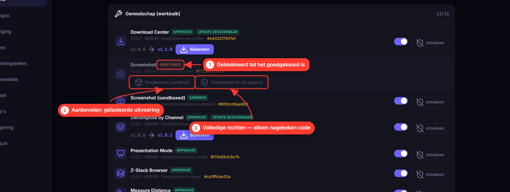

| | |
|---|---|
| **1** | Het rode label **NIET VERTROUWD**. Zolang dat er staat, wordt de plug-in **niet** geladen — voor bezoekers bestaat hij niet. |
| **2** | **Goedkeuren (sandbox)** — de plug-in draait geïsoleerd. **Dit is de aanbevolen keuze.** |
| **3** | **Goedkeuren (in de pagina)** — de plug-in draait met de volledige rechten van de pagina. |

**De procedure, stap voor stap:**

1. klik op een van beide knoppen;
2. een venster vat samen wat u goedkeurt en toont de **vingerafdruk** van de code;
3. het paneel vraagt u **uw beheerderswachtwoord opnieuw in te typen**;
4. de plug-in wordt actief bij het volgende laden van de viewer.

> ❓ **Waarom opnieuw naar het wachtwoord vragen?**
> Omdat een plug-in goedkeuren de enige handeling is die externe code laat draaien. Zelfs als iemand achter uw scherm zou gaan zitten terwijl u ingelogd bent, zou hij zonder uw wachtwoord geen plug-in kunnen goedkeuren.

> ⚠️ **Wanneer kiest u "in de pagina" in plaats van "sandbox"?**
> Bijna nooit, tenzij u de code zelf hebt gelezen of ze van iemand uit uw team komt die u vertrouwt. Let op: plug-ins van het type **kanaal** en **weergavemodus** kunnen technisch niet in een sandbox: ze moeten rechtstreeks met de grafische kaart praten. De lat ligt voor hen dus hoger.

**Een goedkeuring intrekken:** de knop **Intrekken** op de regel van de plug-in. Hij wordt meteen weer niet vertrouwd en wordt niet meer geladen.

## 5.6. De standaard meegeleverde plug-ins

| Plug-in | Plaats | Wat het de bezoeker biedt |
|---|---|---|
| **Fluorescentie** | Weergave | De standaardweergave: elk kanaal straalt zijn kleur uit, als op een fluorescentiemicroscoop |
| **Structuur (DVR)** | Weergave | Een volumeweergave met diepte en schaduw, die vormen beter laat uitkomen |
| **Histogram Controls** | Kanaal | Het intensiteitshistogram + de schuifregelaars min / max / gamma |
| **Gaussian Filter** | Kanaal | Een vervagingsregelaar om de ruis van een kanaal glad te strijken |
| **Measure Distance** | Gereedschap | Twee punten op het volume aanklikken om de werkelijke afstand in µm te krijgen |
| **Slice through Volume** | Gereedschap | Een vrij oriënteerbaar snijvlak door het volume |
| **Z-Stack Browser** | Gereedschap | De doorsneden één voor één doorlopen, als een stapel beelden |
| **Decompose by Channel** | Gereedschap | De kanalen naast elkaar tonen in plaats van over elkaar |
| **Download Center** | Gereedschap | De bestanden, metingen, metadata en exports van de dataset ophalen |
| **Screenshot** | Gereedschap | De 3D-weergave als PNG vastleggen |
| **Presentation Mode** | Gereedschap | Volledig scherm zonder interface, om te projecteren |
| **Orientation Axes** | Gereedschap | Het anatomische assenstelsel A/P · D/V · L/R (zie §3.5) |
| **Toggle Grid / Axes / Volume** | Gereedschap | Het raster, de assen of het volume tonen of verbergen |
| **Chunk Debug** | Gereedschap | Technisch diagnosegereedschap. **Kan zonder risico uitgeschakeld worden** op een productiesite |

---

# 6. Catalogus — nieuwe plug-ins installeren

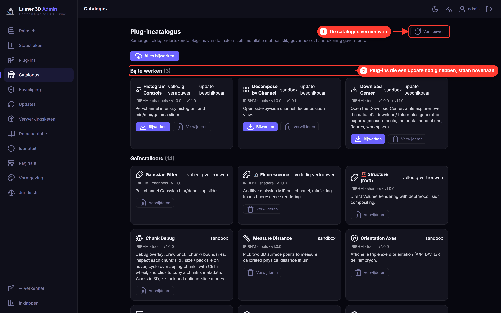

De Catalogus werkt als een appwinkel: hij toont de beschikbare officiële plug-ins, en u installeert ze met één klik.

De plug-ins staan in drie secties: **Geïnstalleerd**, **Beschikbaar**, en eventueel **Niet compatibel**.

## 6.1. Een plug-in installeren

1. zoek de kaart van de plug-in onder **Beschikbaar**;
2. klik op **⬇ Installeren**;
3. **typ uw beheerderswachtwoord opnieuw in**;
4. de plug-in wordt gedownload, gecontroleerd, geïnstalleerd en **automatisch goedgekeurd** — u hoeft niets te doen in het tabblad Plug-ins.

Tijdens de installatie controleert de server dat het gedownloade bestand tot op de bit overeenkomt met wat de catalogus aankondigt. Is er het minste verschil, dan **wordt de installatie afgebroken** in plaats van iets twijfelachtigs te installeren.

De vermelding **"handtekening geverifieerd"** bovenaan bevestigt dat de catalogus zelf authentiek is.

## 6.2. Verwijderen

De knop **🗑 Verwijderen** op de kaart van de plug-in, daarna bevestigen. De bestanden worden van de server gehaald. U kunt later altijd opnieuw installeren vanuit de Catalogus.

Er is precies één geval waarin dit geweigerd wordt: als het de **laatste geïnstalleerde weergavemodus** is (zelfde reden als in §5.3).

## 6.3. De labels op de kaarten

| Label | Betekenis |
|---|---|
| **`sandbox`** | Deze plug-in draait geïsoleerd. Dat geldt voor de plug-ins van de werkbalk. |
| **`volledig vertrouwen`** | Deze plug-in draait met de volledige rechten van de pagina. Onvermijdelijk voor weergavemodi en kanaalregelaars, die de grafische kaart rechtstreeks aansturen. |
| **`niet compatibel`** | Deze plug-in vraagt een nieuwere (of oudere) versie van de site dan de uwe. De installatieknop is grijs. Voer een update uit (zie §8) en hij wordt weer installeerbaar. |

---

# 7. Beveiliging — wachtwoord en rechten

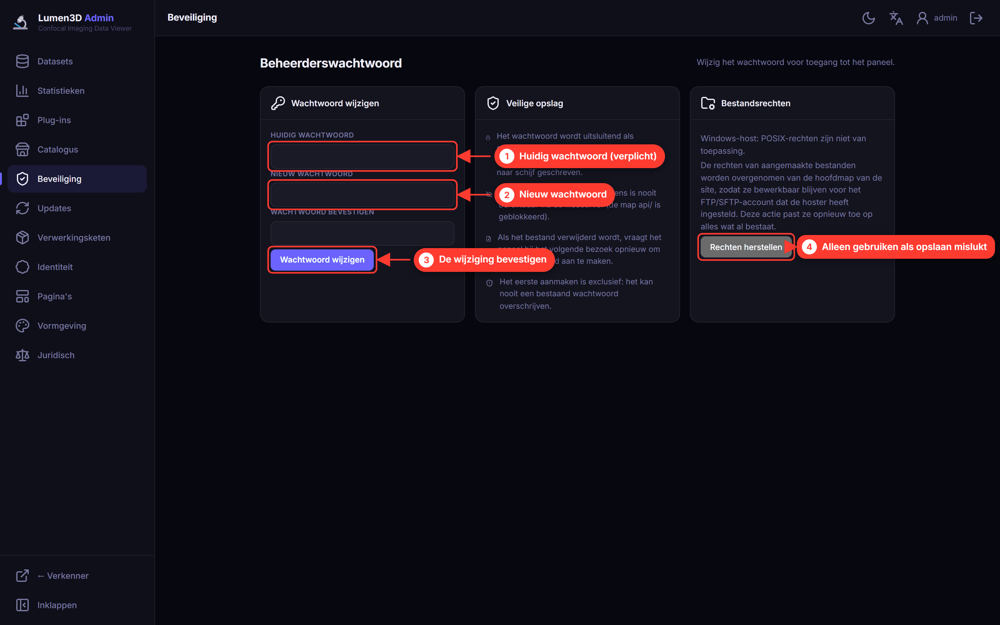

| | |
|---|---|
| **1** | Uw **huidige** wachtwoord — verplicht. |
| **2** | Het nieuwe wachtwoord, twee keer in te typen. |
| **3** | Bevestigen. |
| **4** | **Rechten herstellen** — alleen te gebruiken bij een probleem (§7.3). |

## 7.1. Het wachtwoord wijzigen

Vul de drie velden in en klik op **Wachtwoord wijzigen**. U moet het oude kennen: dat verhindert dat iemand die uw sessie open aantreft, u buitensluit.

U **blijft ingelogd** na de wijziging. Uw andere sessies worden echter niet automatisch afgesloten.

> 💡 **Advies bij het kiezen van een wachtwoord.** Het paneel aanvaardt technisch 4 tekens, maar mik eerder op **12 of meer**. Een makkelijk te onthouden zinnetje is beter dan een ingewikkeld woord: `microscoop-embryo-2026` is veel sterker dan `M1cr0!`.

## 7.2. Hoe het wachtwoord bewaard wordt

De kaart **Veilige opslag** vat de garanties samen, en die zijn de moeite waard om te begrijpen:

- **Het wachtwoord wordt nooit leesbaar weggeschreven.** De server bewaart er alleen een onomkeerbare vingerafdruk van (een standaardmethode: PBKDF2 met salt). Van die vingerafdruk kunt u niet terug naar het wachtwoord.
- **Het bestand met de inloggegevens wordt nooit door de site uitgeleverd.** Zelfs als u het exacte adres in een browser typt, krijgt u een foutmelding.
- **Wordt het bestand verwijderd**, dan biedt het paneel bij het volgende bezoek opnieuw aan een wachtwoord aan te maken. Dat is de nooduitgang als u het vergeet (zie [Bijlage B](#bijlage-b--als-er-iets-misgaat)).
- **Het eerste aanmaken is exclusief: het kan nooit een bestaand wachtwoord overschrijven.** Niemand kan er een installatie overheen zetten om u buiten te werken.

## 7.3. Rechten herstellen

Deze kaart is alleen nuttig op sommige gedeelde hostings, waar de site onder een ander systeemaccount draait dan het FTP-account. Gevolg: bestanden die de site aanmaakt worden onleesbaar of niet-bewerkbaar.

**Symptoom:** een opslagpoging mislukt zonder zichtbare reden in een ander tabblad.

Alleen in dat geval klikt u op **Rechten herstellen**. De bewerking is ongevaarlijk en zet de juiste toegangsrechten opnieuw op alle bestanden. Een melding geeft aan hoeveel items gecorrigeerd werden.

Op een Windows-server meldt de kaart gewoon dat POSIX-rechten niet van toepassing zijn — dat is normaal, er valt niets te doen.

---

# 8. Updates — de site laten meegroeien

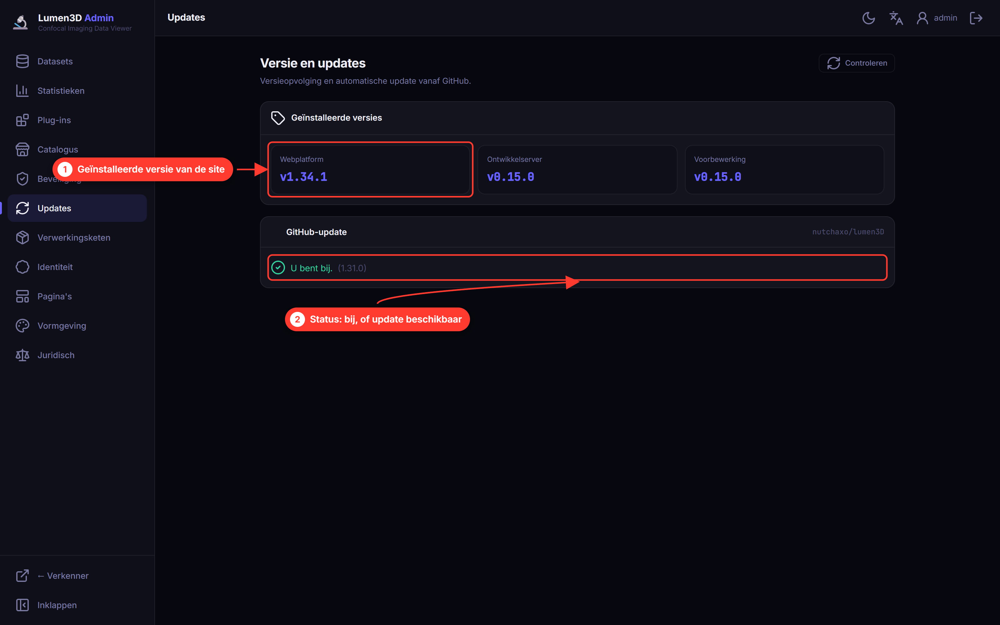

| | |
|---|---|
| **1** | De geïnstalleerde versie van het platform. |
| **2** | De status: *bij*, of *update beschikbaar*. |
| **3** | **Controleren** — voert de zoekopdracht meteen opnieuw uit. |

Er staan drie versienummers — dat is normaal, het zijn drie onafhankelijke onderdelen:

- **Webplatform** — de site zelf. **Dit is het nummer dat telt.**
- **Ontwikkelserver** — het lokale ontwikkelgereedschap.
- **Voorbewerking** — het gereedschap dat de data voorbereidt (zie §9).

## 8.1. Een update uitvoeren

Bestaat er een nieuwe versie, dan verschijnen de **versienotities**: lees ze, ze beschrijven wat er verandert.

1. klik op **⬇ Nu bijwerken**;
2. **er verschijnt een controlerapport** — een belangrijke stap, hieronder toegelicht;
3. klik op **✓ Update bevestigen**;
4. laat het lopen: er schuift een reeks stappen voorbij.

**Het controlerapport** vertelt u, vóór er iets geïnstalleerd wordt:

- hoeveel plug-ins compatibel blijven;
- welke er **in quarantaine** gaan omdat ze nog niet met de nieuwe versie werken. Ze worden niet verwijderd: ze schakelen zichzelf weer in zodra een update ze opnieuw compatibel maakt;
- of er iets de update **blokkeert**, in welk geval de bevestigingsknop niet verschijnt.

**De stappen die daarna voorbijschuiven:** Controles → Back-up → Downloaden → Integriteit → Voorbereiding → Opstartcontrole → Omschakelplan → Omschakelen → Server opnieuw opstarten.

De server start op het einde opnieuw op: **u zult opnieuw moeten inloggen.** Dat is normaal.

## 8.2. De vangnetten

De update is zo ontworpen dat een storing de site niet kan breken:

- **Er wordt eerst een volledige back-up gemaakt.**
- **Het gedownloade bestand wordt gecontroleerd** (vingerafdruk + elektronische handtekening van de auteur) vóór het gebruikt wordt. Een gemanipuleerd bestand wordt geweigerd.
- **De nieuwe versie wordt getest vóór ze in gebruik wordt genomen.** Start ze niet op, dan **keert de site automatisch terug naar de oude versie.** U ziet dan de melding "automatisch teruggezet" — de site werkt gewoon verder, er valt niets te herstellen.
- **Uw gegevens blijven behouden:** de datasets (`DATA_WEB`), uw inloggegevens, uw statistieken en uw instellingen voor Identiteit, Pagina's en Vormgeving worden bij een update nooit aangeraakt.

## 8.3. Mogelijke meldingen

| Melding | Wat het betekent |
|---|---|
| **U bent bij** | Niets te doen. |
| **Limiet van de GitHub-API bereikt** | Te veel controles in korte tijd. Probeer over enkele minuten opnieuw. Onschuldig. |
| **Kan GitHub niet bereiken** | Een netwerkprobleem aan serverzijde. Probeer het later opnieuw. |
| **Nog geen versie gepubliceerd** | Er is nog geen versie publiek gepubliceerd. |
| **De certificaatopslag is onbruikbaar** | Een instelling van de hoster. Meld dit aan wie de server beheert. |

---

# 9. Verwerkingsketen — nieuwe data voorbereiden

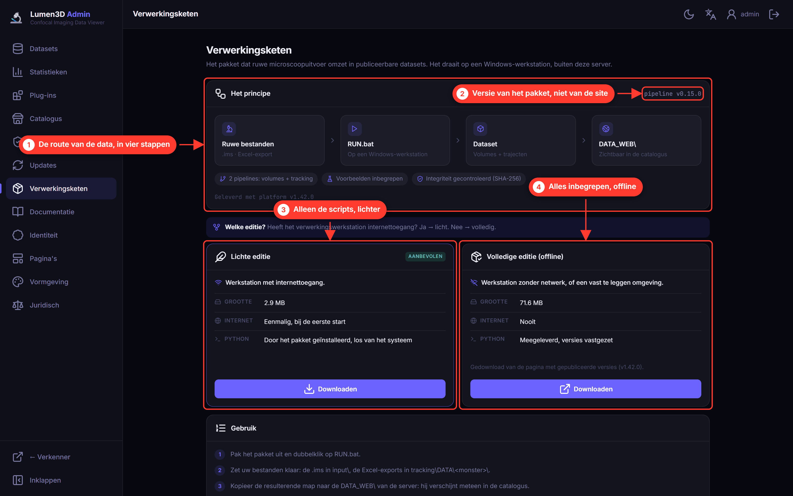

Dit tabblad verwerkt **niets** op de server. Het geeft u **gereedschap om te downloaden** en uit te voeren op een krachtige computer, doorgaans het analysewerkstation van het labo.

**Waarom gescheiden?** Een microscopievolume omzetten vraagt enorm veel werkgeheugen — reken op ongeveer **32 GB RAM** voor een volume van 3789 × 3789 × 178. Geen enkele gedeelde webserver kan dat aan.

## 9.1. Wat het pakket bevat

- **Volumeketen** — zet Imaris `.ims`-stapels om in datasets die in blokken zijn opgedeeld, met een detailniveaupiramide, miniatuur en metadata.
- **Trackingketen** — leest de Excel-export van Imaris, reconstrueert de celafstamming (mitosen inbegrepen), stabiliseert de trajecten en berekent de metingen.
- **Koppeling** — verbindt een geanalyseerde trackingreeks met een reeds verwerkte dataset, zodat de trajecten over de beelden liggen.
- **Eén voorbeeldinvoer per keten** — het pakket is meteen bruikbaar, zonder echte data, om het onder de knie te krijgen.
- **Een starter `RUN.bat`** die de integriteit van de bestanden nakijkt, de Python-installatie controleert en de gekozen keten uitvoert.

## 9.2. Welke editie kiezen

| | **Volledige editie** | **Lichte editie** |
|---|---|---|
| Grootte | ~70 MB (200 MB uitgepakt) | enkele MB |
| Internet | **Nooit nodig** | **Eenmalig** nodig, bij de eerste start |
| Python | Ingebouwd, versies vastgezet | Bij de eerste start opgehaald, in een geïsoleerde omgeving |
| Voor wie | Een werkstation zonder internet, of om identieke resultaten over installaties heen te garanderen | Een verbonden werkstation, dagelijks gebruik |

De lichte editie wijzigt **nooit** de Python die al op het werkstation staat: ze werkt in haar eigen hoekje.

## 9.3. Hoe het te gebruiken

1. pak het archief uit op het verwerkingswerkstation;
2. dubbelklik op **`RUN.bat`**;
3. zet de `.ims`-bestanden in `input\`, en de Excel-exports in `tracking\DATA\<monster>\`;
4. ⚠️ **de naam van het Excel-bestand moet het interval tussen de beelden bevatten** (bijvoorbeeld `30min`) — de analyse leest daar haar tijdbasis uit af;
5. kopieer de resulterende map naar `DATA_WEB\` op de server;
6. hij verschijnt meteen in het tabblad Datasets.

---

# 10. Identiteit — de naam en het vocabulaire van de site

Met dit tabblad hernoemt u de site volledig, zonder aan code te raken. Daardoor kan hetzelfde platform een embryologisch labo of een neurowetenschappelijk instituut bedienen.

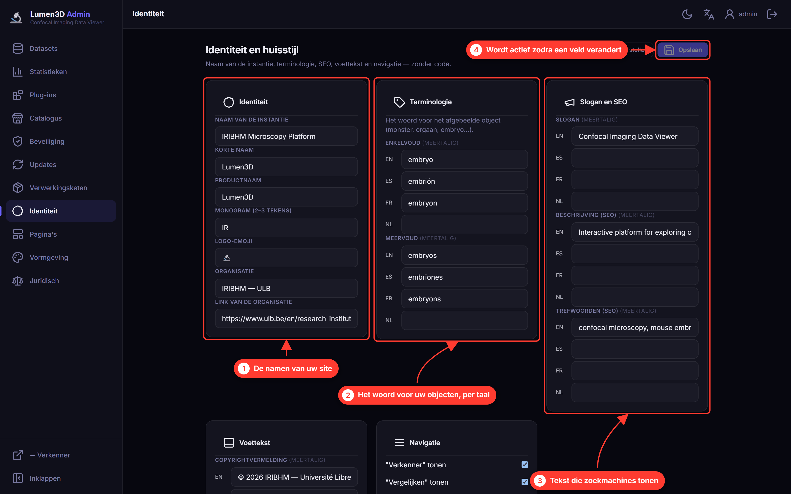

| | |
|---|---|
| **1** | De namen van uw site. |
| **2** | Het woord voor de objecten die u bestudeert, **per taal**. |
| **3** | De tekst die zoekmachines tonen. |
| **4** | **Opslaan** — wordt actief zodra een veld verandert. |

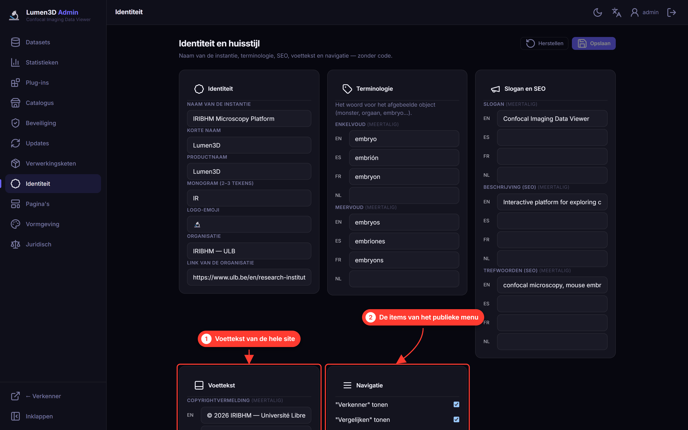

## 10.1. De meertalige velden

Velden met de vermelding **(MEERTALIG)** tonen één regel per taal: `EN`, `ES`, `FR`, `NL`.

**Vul minstens altijd `EN` in.** Dat is de terugvalversie: bekijkt een bezoeker de site in het Spaans en is het veld `ES` leeg, dan wordt de Engelse tekst getoond — nooit een leegte.

## 10.2. Kaart "Identiteit"

| Veld | Waarvoor het dient | Voorbeeld |
|---|---|---|
| **Naam van de instantie** | De volledige naam, gebruikt in paginatitels | `IRIBHM Microscopy Platform` |
| **Korte naam** | Gebruikt waar er weinig plaats is | `Lumen3D` |
| **Productnaam** | De naam van de software in lopende tekst | `Lumen3D` |
| **Monogram** | 2–3 letters voor het logobolletje | `IR` |
| **Logo-emoji** | De emoji naast de naam | 🔬 |
| **Organisatie** | Uw labo of instelling | `IRIBHM — ULB` |
| **Link van de organisatie** | Het adres van haar website | `https://…` |

## 10.3. Kaart "Terminologie" — de nuttigste

Hier past de site zich aan uw vakgebied aan. U bepaalt **het woord voor wat u in beeld brengt**, in enkelvoud en meervoud, in elke taal.

Dat woord wordt daarna **automatisch overgenomen in de hele publieke interface**: titels, filters, statistieken, beschrijvingen. Schrijft u `embryo / embryo's`, dan spreekt de site over embryo's. Schrijft u `monster / monsters`, dan spreekt ze over monsters — overal, zonder verdere wijziging.

## 10.4. Kaart "Slogan en SEO"

- **Slogan** — de ondertitel onder de naam van de site.
- **Beschrijving (SEO)** — de samenvatting die Google en de sociale netwerken tonen. Twee heldere zinnen volstaan.
- **Trefwoorden (SEO)** — enkele termen, gescheiden door komma's.

## 10.5. Kaart "Voettekst"

- **Copyrightvermelding** — de tekst onderaan elke pagina.
- **Links** — de links in de voettekst. **+ Link toevoegen** maakt er een aan (label + adres), het kruisje haalt er een weg.

## 10.6. Kaart "Navigatie"

De vakjes bepalen welke items in het menu van de publieke site verschijnen: *Verkenner*, *Vergelijken*, *Tracking*, *Over*, *Juridisch*.

Een vakje uitvinken haalt het item uit het menu zonder de pagina te verwijderen.

> ⚠️ **Let op bij "Juridisch".** Dat vakje staat standaard uit. Schrijft u uw juridische informatie (§13), kom dan hier terug om ze bereikbaar te maken.

---

# 11. Pagina's — de visuele editor

Dit is de rijkste functie van het paneel. Ermee **bewerkt u de inhoud van de pagina's zoals in een opmaakprogramma**, zonder één regel code te schrijven.

## 11.1. Een pagina kiezen

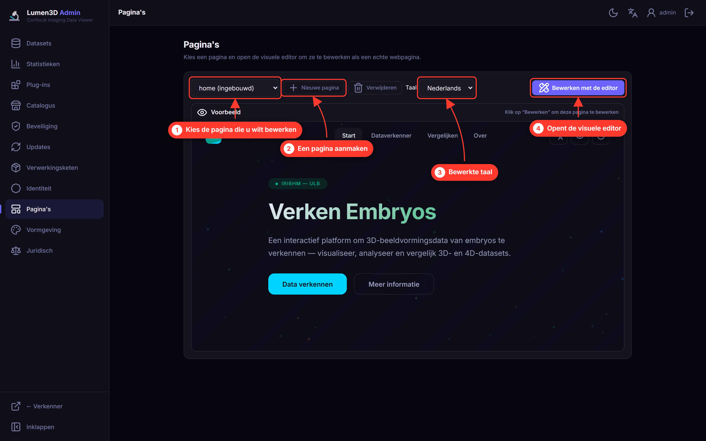

| | |
|---|---|
| **1** | De pagina die u wilt bewerken. |
| **2** | **Nieuwe pagina** — maakt een extra pagina aan. |
| **3** | De **taal** die u bewerkt. |
| **4** | **Bewerken met de editor** — opent de visuele editor. |

De knop **🗑 Verwijderen** wist een pagina die u zelf hebt aangemaakt. Hij blijft grijs bij `home` en `about`: die twee kunnen niet verwijderd worden, alleen vanuit de editor teruggezet op hun oorspronkelijke sjabloon.

Er bestaan van bij de start twee pagina's: **`home`** en **`about`**. De vermelding *(ingebouwd)* betekent dat ze nog het meegeleverde sjabloon gebruiken: vanaf uw eerste publicatie neemt uw versie het over.

## 11.2. De editor

De editor opent **in een eigen browsertabblad**, zodat hij het hele scherm heeft.

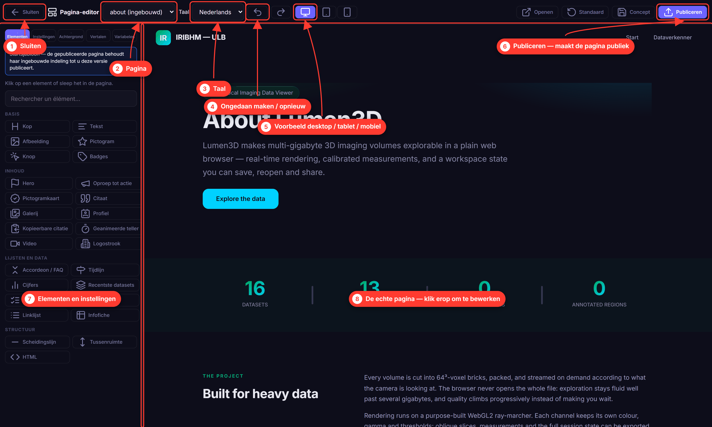

| | |
|---|---|
| **1** | **Sluiten** — terug naar het paneel. |
| **2** | De pagina die u bewerkt. |
| **3** | De taal die u bewerkt. |
| **4** | **Ongedaan maken / opnieuw** (`Ctrl+Z` / `Ctrl+Y`). |
| **5** | Voorbeeld **desktop / tablet / mobiel**. |
| **6** | **Publiceren** — maakt de versie zichtbaar voor het publiek. |
| **7** | De **zijbalk**: elementen om in te voegen, en de instellingen van wat geselecteerd is. |
| **8** | **De echte pagina.** Dit is geen maquette: het is uw werkelijke pagina, met haar echte menu, echte voettekst en echte thema. Wat u ziet, is exact wat bezoekers zullen zien. |

## 11.3. De bovenbalk in detail

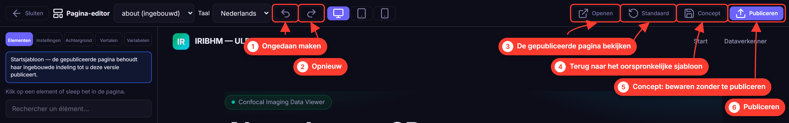

| | |
|---|---|
| **1 – 2** | **Ongedaan maken** en **Opnieuw**. |
| **3** | **Openen** — toont de gepubliceerde pagina in een nieuw tabblad, om te vergelijken. |
| **4** | **Standaard** — keert terug naar het oorspronkelijke sjabloon. ⚠️ Wist uw opmaak. |
| **5** | **Concept** — bewaart zonder te publiceren. U kunt sluiten en later verdergaan. |
| **6** | **Publiceren** — zet uw versie online. |

> 📌 **Het verschil om te onthouden: Concept ≠ Publiceren.**
> Zolang u niet op **Publiceren** hebt geklikt, blijven bezoekers de oude versie zien. U kunt dus dagenlang werken en concepten bewaren, zonder iets te breken.

## 11.4. Een element toevoegen

Het tabblad **Elementen** van de zijbalk bevat alles wat u in een pagina kunt zetten.

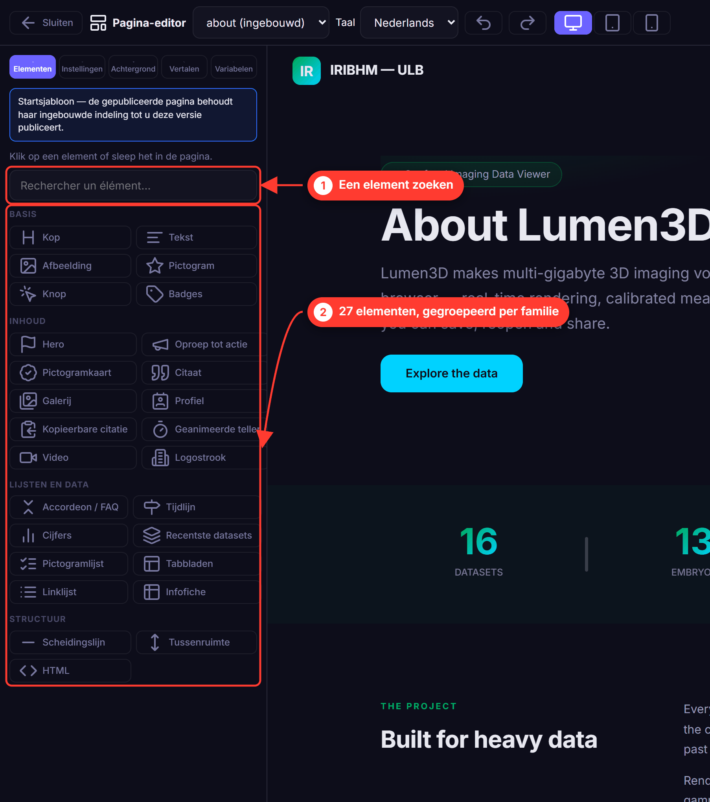

Twee manieren:

- **klikken** op een element: het wordt achteraan de pagina toegevoegd;
- **het slepen** naar de gewenste plek: tijdens het verplaatsen verschijnen er neerzetzones.

Het veld **Een element zoeken** filtert de lijst — handig, want er zijn er 27.

### De 27 beschikbare elementen

**Basis** — de elementaire bouwstenen

| Element | Wat het is |
|---|---|
| **Kop** | Een sectietitel |
| **Tekst** | Een alinea |
| **Afbeelding** | Een afbeelding |
| **Pictogram** | Een pictogram |
| **Knop** | Een aanklikbare knop |
| **Badges** | Kleine gekleurde labels |

**Inhoud** — de presentatieblokken

| Element | Wat het is |
|---|---|
| **Hero** | De grote openingsbanner bovenaan een pagina |
| **Oproep tot actie** | Een kader dat tot klikken uitnodigt |
| **Pictogramkaart** | Een kaart: pictogram + titel + tekst |
| **Citaat** | Een uitgelicht citaat |
| **Galerij** | Meerdere afbeeldingen in een raster |
| **Profiel** | Een fiche van een persoon (foto, naam, functie) |
| **Kopieerbare citatie** | Een bibliografische referentie met kopieerknop |
| **Geanimeerde teller** | Een getal dat bij het tonen omhoogloopt |
| **Video** | Een ingesloten video |
| **Logostrook** | Een rij logo's van partners |

**Lijsten en data**

| Element | Wat het is |
|---|---|
| **Accordeon / FAQ** | Vragen die openklappen |
| **Tijdlijn** | Een reeks gedateerde stappen |
| **Cijfers** | Een rij kerncijfers |
| **Recentste datasets** | **Vult zichzelf** met uw recente datasets |
| **Pictogramlijst** | Een geïllustreerde opsomming |
| **Tabbladen** | Inhoud verdeeld over tabbladen |
| **Linklijst** | Een lijst met links |
| **Infofiche** | Een tabel label / waarde |

**Structuur**

| Element | Wat het is |
|---|---|
| **Scheidingslijn** | Een horizontale lijn |
| **Tussenruimte** | Een instelbare lege ruimte |
| **HTML** | Vrije HTML-code — **alleen voor gevorderden** |

> 💡 **De elementen die zichzelf vullen.** *Recentste datasets* en *Cijfers* kunnen rechtstreeks uit de gegevens van de site putten: aantal datasets, specimens, gevolgde cellen, geannoteerde regio's. Het cijfer werkt zichzelf bij wanneer u data toevoegt — u hoeft de pagina nooit te komen corrigeren.

## 11.5. Een bestaand element bewerken

**Klik erop in de pagina.** Het krijgt een groene omlijning en de zijbalk schakelt over op zijn instellingen.

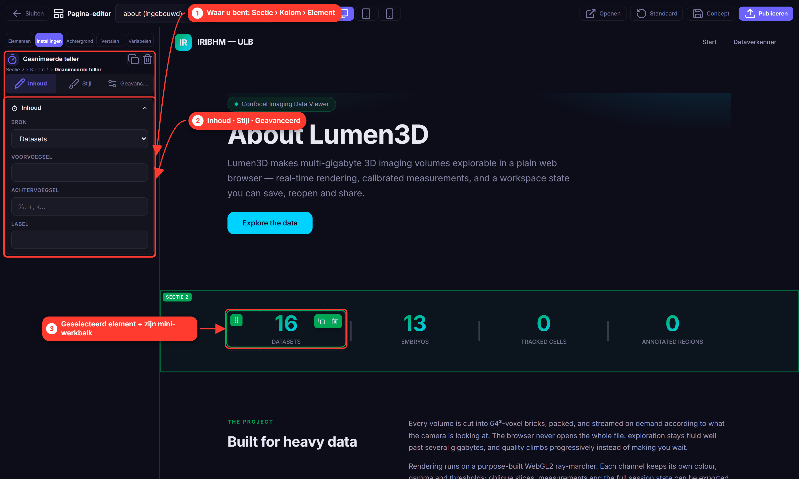

| | |
|---|---|
| **1** | Het **kruimelpad**: `Sectie 2 › Kolom 1 › Geanimeerde teller`. Het toont precies waar u bent, en elk niveau is aanklikbaar. |
| **2** | De drie instellingentabbladen: **Inhoud**, **Stijl**, **Geavanceerd**. |

### De mini-werkbalken

Op het blok onder uw muisaanwijzer verschijnt een groen balkje:

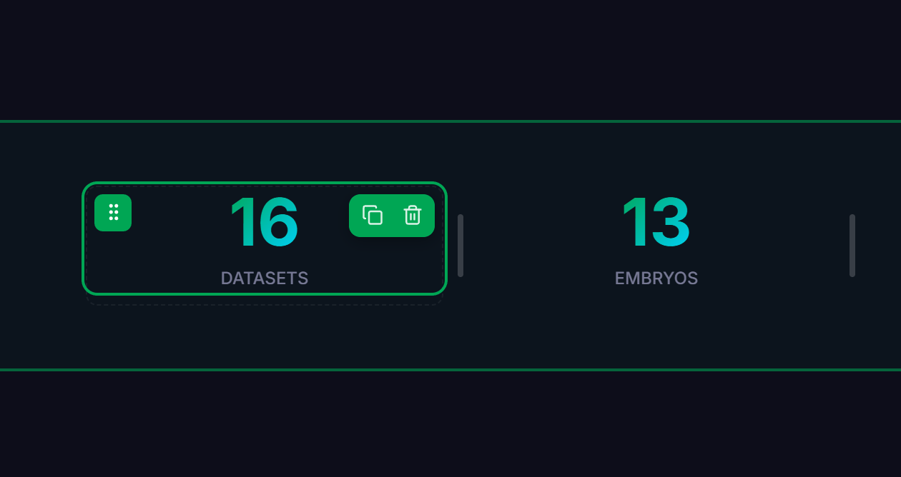

**Er is er altijd maar één tegelijk zichtbaar**: die van het binnenste niveau onder uw cursor. Wijst u een element aan, dan krijgt u de balk van het element; verlaat u het element maar blijft u in de kolom, dan die van de kolom; gaat u naar de marge van de sectie, dan die van de sectie.

**Balk van een element**

| Pictogram | Actie |
|---|---|
| **⠿** (stippen, links) | **Sleepgreep** — vasthouden en slepen om het element te verplaatsen |
| **⧉** | **Dupliceren** |
| **🗑** | **Verwijderen** |

**Balk van een kolom**

| Pictogram | Actie |
|---|---|
| **‹** **›** | De kolom naar links / rechts verplaatsen |
| **⚙** | Instellingen van de kolom |
| **⧉** · **🗑** | Dupliceren · Verwijderen |

**Balk van een sectie**

| Pictogram | Actie |
|---|---|
| **⌃** **⌄** | De sectie omhoog / omlaag verplaatsen in de pagina |
| **▥** | **Een kolom toevoegen** |
| **⚙** | Instellingen van de sectie |
| **⧉** · **🗑** | Dupliceren · Verwijderen |

> 💡 **Om een kolom of sectie te bereiken zonder de juiste aanwijszone te zoeken**, gebruikt u het **kruimelpad** in de zijbalk (aanduiding 1 hierboven): `Sectie 2 › Kolom 1 › Geanimeerde teller`. Elk niveau is aanklikbaar en selecteert dat blok rechtstreeks.

### De drie instellingentabbladen

**Inhoud** — wat er staat: de teksten, de afbeeldingen, de links, de gegevensbron. Dit tabblad zult u het meest gebruiken.

**Stijl** — het uiterlijk: kleuren, groottes, tussenruimtes, uitlijning, hoekafronding.

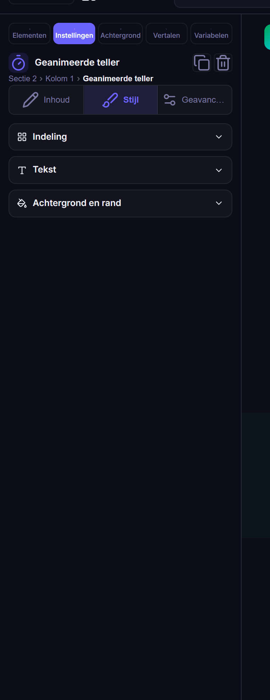

**Geavanceerd** — de fijne opties: marges, gedrag bij aanwijzen, **zichtbaarheid per apparaat** (een element verbergen op mobiel, bijvoorbeeld), eigen CSS.

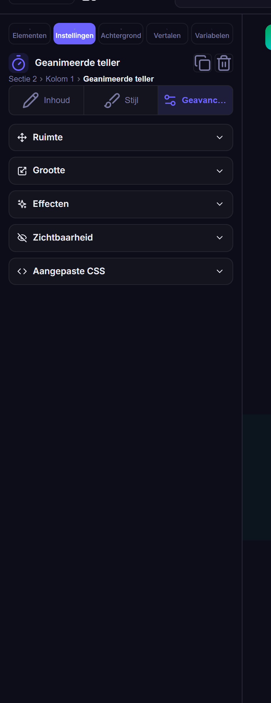

> 💡 **Nog sneller een tekst wijzigen:** dubbelklik rechtstreeks op de tekst in de pagina en typ. **Enter** bevestigt, **Esc** annuleert.

### De sneltoetsen van de editor

| Sneltoets | Actie |
|---|---|
| `Ctrl + Z` | Ongedaan maken |
| `Ctrl + Y` *(of `Ctrl + Shift + Z`)* | Opnieuw |
| `Ctrl + S` | Een concept bewaren |
| `Ctrl + D` | Het geselecteerde element dupliceren |
| `Ctrl + C` / `Ctrl + V` | Een element kopiëren / plakken |
| `Delete` *(of `Backspace`)* | Het geselecteerde element verwijderen |
| `Esc` | Selectie opheffen |

*(Op een Mac vervangt u `Ctrl` door `Cmd`.)* Deze sneltoetsen staan uit terwijl u in een tekstveld typt, zodat u gewoon kunt schrijven.

## 11.6. De pagina ordenen: secties en kolommen

Een pagina is op drie niveaus opgebouwd:

```
Pagina
 └─ Sectie          (een horizontale band over de volle breedte)
     └─ Kolom       (een verticale opdeling van de sectie)
         └─ Element (een kop, een afbeelding, een knop…)
```

Om een sectie in kolommen te verdelen, selecteert u ze (klik op haar zone, of gebruik het pijltje **›** vanaf een element) en gebruikt u het verdeelpictogram in haar werkbalk. Er zijn zes indelingen:

| | Indeling |
|---|---|
| **1** | Eén kolom over de volle breedte |
| **2** | Twee gelijke kolommen |
| **3** | Drie gelijke kolommen |
| **4** | Vier gelijke kolommen |
| **⅔ ⅓** | Een brede links, een smalle rechts |
| **⅓ ⅔** | Een smalle links, een brede rechts |

Op een telefoon komen de kolommen **automatisch onder elkaar te staan**. Daar hoeft u niets voor te doen.

## 11.7. Controleren op mobiel

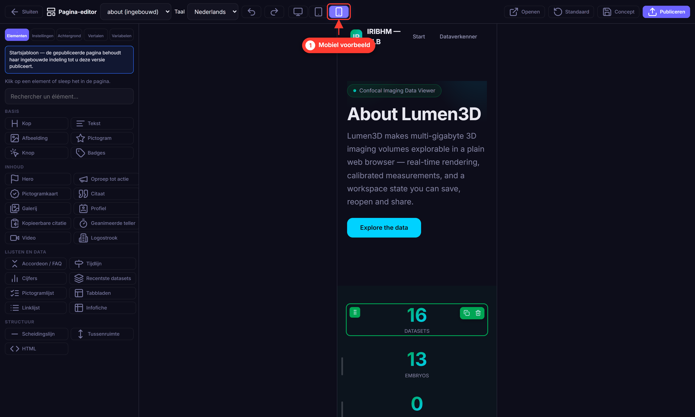

De drie pictogrammen (desktop / tablet / mobiel) passen de grootte van het voorbeeld aan. **Maak er een gewoonte van om vóór het publiceren op mobiel te kijken**: een groot deel van de bezoekers gebruikt een telefoon.

## 11.8. De geanimeerde achtergrond

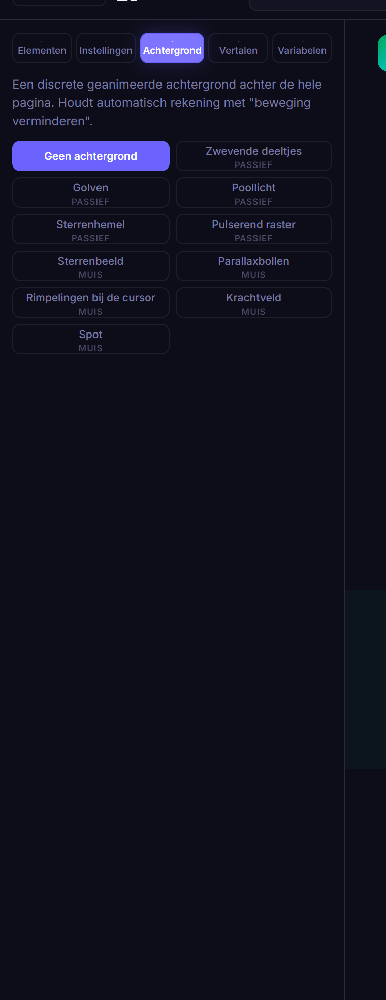

Het tabblad **Achtergrond** zet een discreet geanimeerd decor achter de hele pagina.

- **Geen achtergrond** — effen achtergrond.
- **Muis** — de animatie reageert op de beweging van de cursor.
- **Passief** — de animatie loopt vanzelf.

De instelling houdt automatisch rekening met de systeemvoorkeur "beweging verminderen" van mensen die gevoelig zijn voor beweging.

## 11.9. Een pagina vertalen

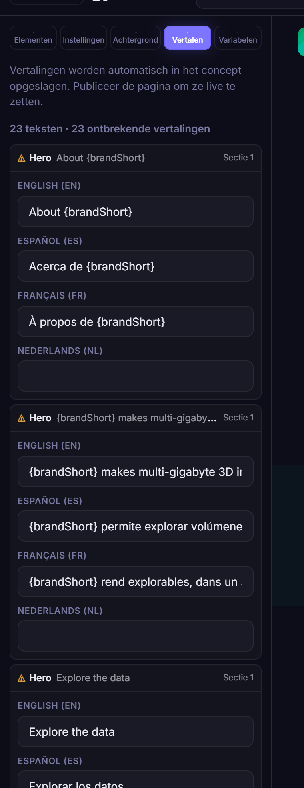

Het tabblad **Vertalen** somt **alle teksten van de pagina** op en duidt aan welke er in de andere talen ontbreken, met een teller als *"24 teksten · 7 ontbrekende vertalingen"*.

Dat scheelt echt tijd: in plaats van elk element één voor één te heropenen om te zoeken wat er niet vertaald is, ziet u alles in één keer en vult u het na elkaar in.

**Aanbevolen werkwijze:** schrijf de hele pagina in één taal en ga daarna naar dit tabblad om ze in één beweging te vertalen.

## 11.10. De variabelen

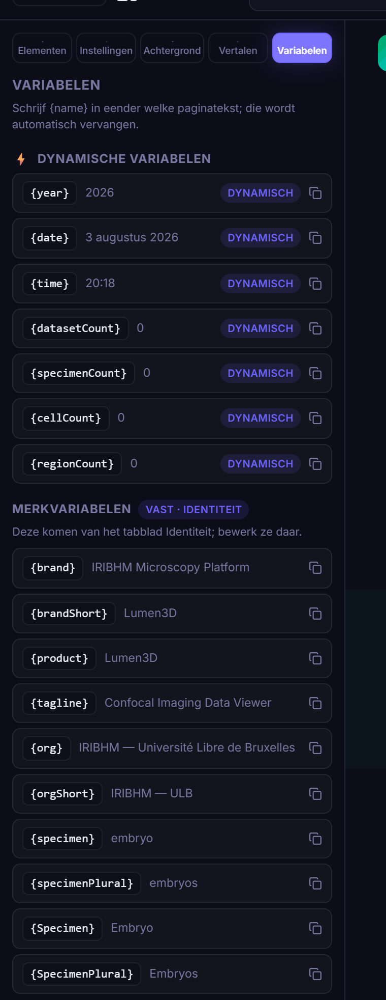

Een **variabele** is een stukje tekst dat u één keer vastlegt en overal hergebruikt.

**Hoe het werkt:**

1. maak in het tabblad **Variabelen** een variabele aan: een naam (bijvoorbeeld `contact`) en een waarde (`microscopy@ulb.be`);
2. schrijf in eender welke paginatekst `{contact}`;
3. bij het tonen verschijnt de waarde.

**Waarvoor het dient:** verandert het adres, dan verbetert u het op één plek en **worden alle pagina's bijgewerkt**. Ideaal voor een e-mailadres, een telefoonnummer, de naam van een verantwoordelijke of een artikelreferentie.

Naamregels: begin met een letter, daarna letters, cijfers of `_`, maximaal 32 tekens.

Er bestaan al variabelen voor de gegevens uit het tabblad Identiteit: `{brand}` (de naam van de site), `{specimen}` (uw studieobject), `{org}` (de organisatie), `{year}` (het jaar). Die werken zichzelf bij.

## 11.11. Een nieuwe pagina aanmaken

1. klik in het tabblad **Pagina's** op **+ Nieuwe pagina**;
2. geef ze een titel en een kort adres (de *slug*, bijvoorbeeld `protocollen`);
3. bouw ze op in de editor;
4. **Publiceren**;
5. om ze via het menu bereikbaar te maken, gaat u naar **Identiteit → Navigatie**.

De pagina is dan bereikbaar op `https://<uw-site>/page.html?slug=protocollen`.

## 11.12. Aanbevolen werkwijze

1. **Bewerken met de editor**
2. Uw wijzigingen aanbrengen
3. Regelmatig **Concept** (zoals in een tekstverwerker)
4. Het **mobiele voorbeeld** controleren
5. Het tabblad **Vertalen** aanvullen
6. **Publiceren**
7. **Openen** om het resultaat online te controleren

---

# 12. Vormgeving — de kleuren van de site

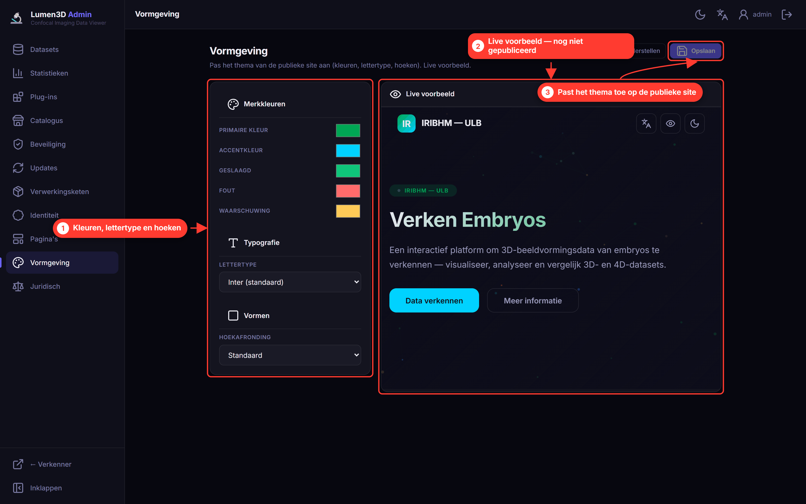

| | |
|---|---|
| **1** | Kleuren, lettertype en hoekafronding. |
| **2** | **Live voorbeeld** — wat u ziet is **nog niet gepubliceerd**. |
| **3** | **Opslaan** — past het thema toe op de publieke site. |

## 12.1. De kleuren

| Kleur | Waar ze verschijnt |
|---|---|
| **Primair** | De hoofdkleur: belangrijkste knoppen, links, actieve elementen |
| **Accent** | De tweede kleur, voor accenten |
| **Geslaagd** | Bevestigingen (standaard groen) |
| **Fout** | Foutmeldingen (standaard rood) |
| **Waarschuwing** | Waarschuwingen (standaard oranje) |

Klik op een kleurvakje om de kiezer te openen. **Het voorbeeld rechts werkt zich meteen bij**, zodat u zonder risico kunt proberen.

> 💡 **Houd de kleuren Geslaagd / Fout / Waarschuwing dicht bij groen / rood / oranje.** Dat zijn universele signalen: een foutmelding in het groen brengt bezoekers in de war.

## 12.2. Typografie en vormen

- **Lettertype** — het lettertype van de publieke site.
- **Hoekafronding** — van scherp tot sterk afgerond, op knoppen en kaarten.

## 12.3. Het thema publiceren

Er wordt niets op de publieke site toegepast zolang u niet op **Opslaan** hebt geklikt. De knop **Herstellen** keert terug naar het oorspronkelijke thema.

> ⚠️ **Controleer het contrast.** Een erg lichte primaire kleur op een lichte achtergrond wordt onleesbaar. Open na het opslaan de publieke site en controleer of alles goed leesbaar is, in het lichte **en** het donkere thema.

---

# 13. Juridische informatie

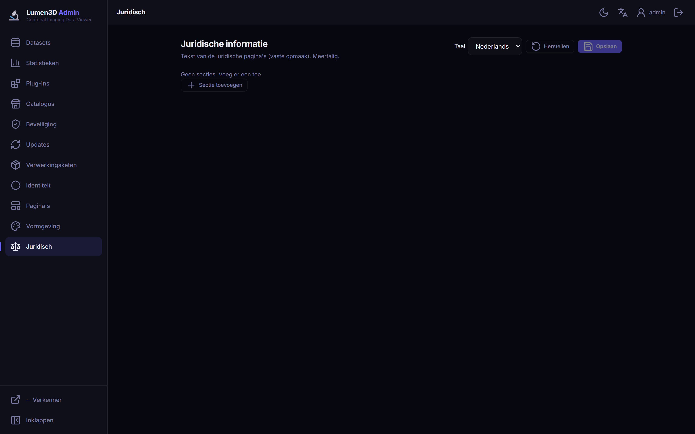

Een eenvoudige editor met vaste opmaak, voor de juridische tekst van de site.

**Hoe het werkt:**

- **+ Sectie toevoegen** maakt een blok: een **titel** en een **tekst**.
- De secties verschijnen in de volgorde waarin u ze aanmaakt.
- Met de keuzelijst **Taal** bovenaan schrijft u de versie voor elke taal.
- **Opslaan** publiceert.

**Gebruikelijke secties:** uitgever van de site, hoster, intellectuele eigendom, persoonsgegevens, contact.

> ⚠️ **Twee dingen niet vergeten:**
>
> 1. de pagina blijft onzichtbaar zolang u **"Juridisch tonen"** niet hebt aangevinkt onder **Identiteit → Navigatie**;
> 2. juridische inhoud hangt af van uw land en uw instelling — overleg met de bevoegde dienst in plaats van een online gevonden sjabloon over te nemen.

---
---

# Bijlage A — Eerste installatie

Deze bijlage gaat alleen over de **allereerste ingebruikname** van een nieuwe site. Draait uw site al, dan krijgt u deze schermen nooit te zien.

Zolang er nog geen beheerdersaccount bestaat, start het openen van `admpan.html` een wizard in **5 stappen**.

## Stap 1 — Beheerdersaccount

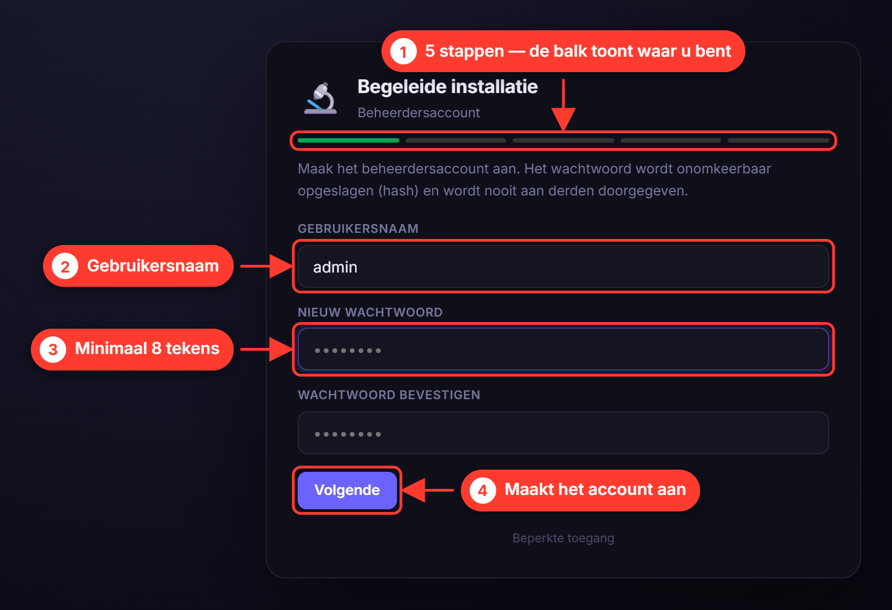

Dit is **de enige verplichte stap**. De volgende kunt u overslaan en later opnieuw doen vanuit de bijbehorende tabbladen.

Het wachtwoord moet **minstens 8 tekens** lang zijn.

> 🔒 **Dit aanmaken is exclusief:** het kan nooit een bestaand account overschrijven. Is er al een wachtwoord ingesteld, dan verschijnt dit scherm helemaal niet.

## Stap 2 — Identiteit

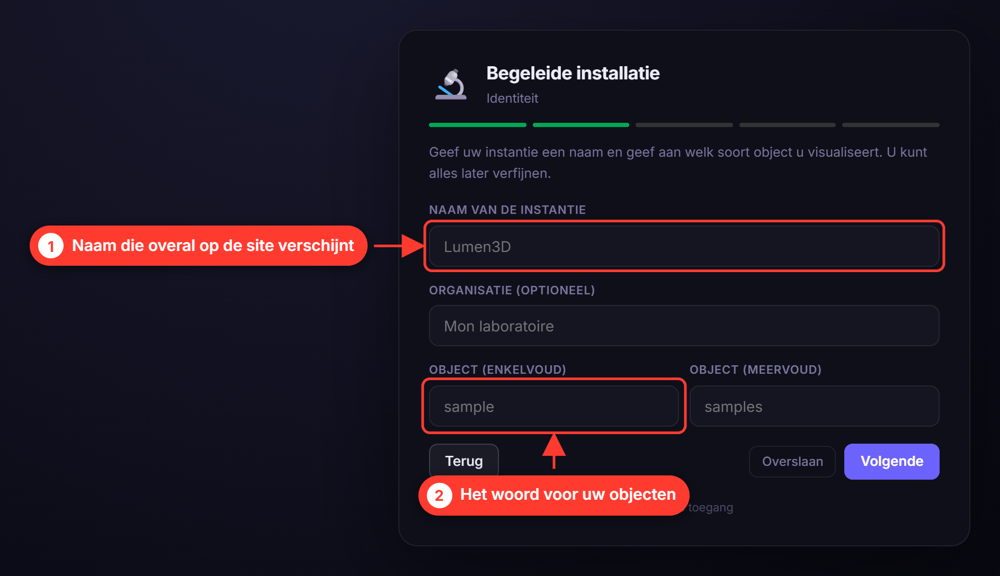

De naam van de instantie, de organisatie, en het woord voor uw studieobjecten. Nadien aanpasbaar onder **Identiteit** (§10).

## Stap 3 — Thema

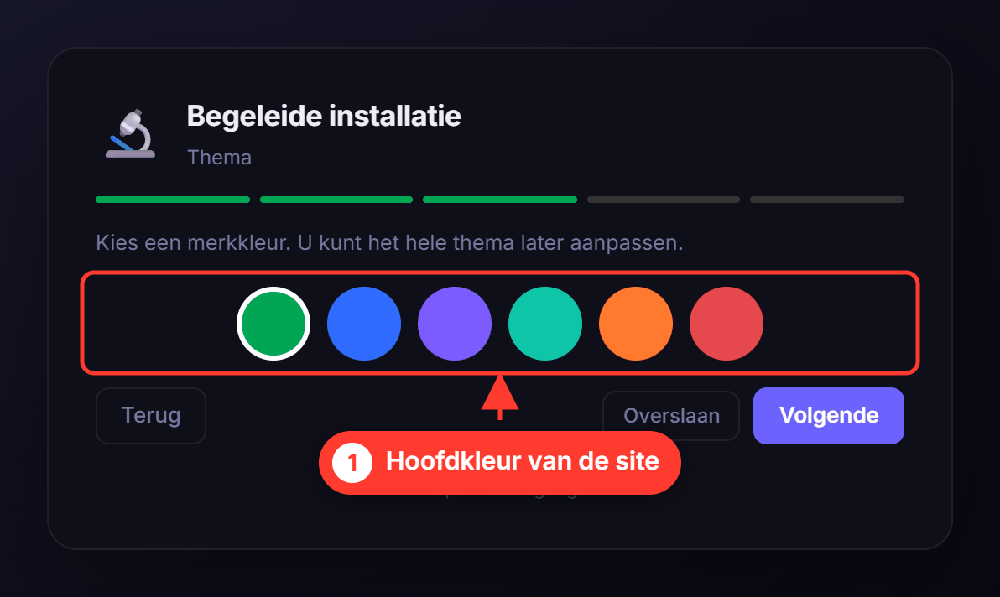

Eén hoofdkleur uit zes voorstellen. Nadien te verfijnen onder **Vormgeving** (§12).

## Stap 4 — Teksten

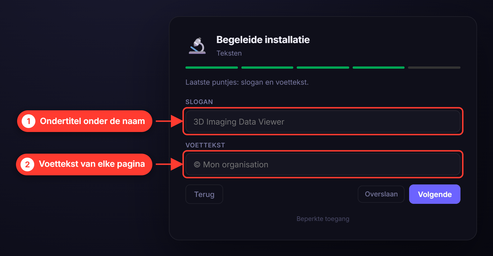

De slogan en de voettekst. Nadien aanpasbaar onder **Identiteit** (§10).

## Stap 5 — Plug-ins

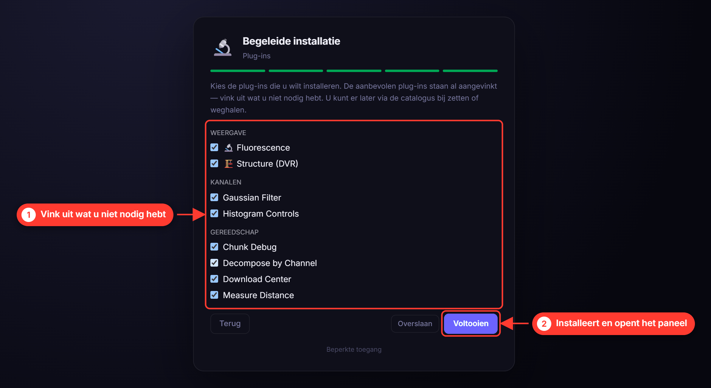

De keuze van de functies die geïnstalleerd worden. De aanbevolen staan al aangevinkt; vink uit wat u niet nodig hebt. Nadien aanpasbaar onder **Catalogus** (§6) en **Plug-ins** (§5).

**Voltooien** installeert de selectie en opent het paneel.

---

# Bijlage B — Als er iets misgaat

### "Ik ben het beheerderswachtwoord vergeten"

Het is **onmogelijk** terug te vinden: de server bewaart er alleen een onomkeerbare vingerafdruk van.

De oplossing vraagt toegang tot de bestanden van de server (FTP, SFTP, of de bestandsbeheerder van de hoster):

1. verwijder — of beter, **hernoem** — het bestand `api/admin_credential.json`;
2. open `admpan.html` opnieuw: de wizard voor de eerste installatie verschijnt weer;
3. maak een nieuw wachtwoord aan.

**Er gaat verder niets verloren**: niet de datasets, niet de pagina's, niet de instellingen.

> ⚠️ In dat korte tijdsbestek zou iedereen die de pagina opent het account in uw plaats kunnen aanmaken. Doe het in één beweging.

### "Ik heb iets gewijzigd en de site is stuk"

| Tabblad | Hoe u terugkeert |
|---|---|
| **Identiteit** | Knop **Herstellen** |
| **Vormgeving** | Knop **Herstellen** |
| **Pagina's** | Knop **Standaard** in de editor, daarna **Publiceren** |
| **Juridisch** | Knop **Herstellen** |
| **Datasets** | Knop **↺ Herstellen** (voordat u hebt opgeslagen) |

### "Een dataset verschijnt niet in de lijst"

1. controleer dat hij echt in `DATA_WEB/fixed/`, `DATA_WEB/live/` of `DATA_WEB/tracking/` staat;
2. controleer dat zijn map een bestand `metadata.json` bevat;
3. herlaad de pagina van het paneel.

Er is **geen catalogus om te regenereren**: de lijst wordt bij elke weergave opnieuw opgebouwd.

### "Een functie is uit de viewer verdwenen"

Kijk in het tabblad **Plug-ins**: de bijbehorende plug-in staat waarschijnlijk uit, of is op **niet vertrouwd** gevallen nadat zijn bestanden gewijzigd werden. Zie §5.5.

### "Opslaan mislukt zonder duidelijke melding"

Probeer **Beveiliging → Rechten herstellen** (§7.3). Dat is de vaakst voorkomende oorzaak op gedeelde hosting.

### "De update is mislukt"

Staat er *"automatisch teruggezet"*, dan **valt er niets te doen**: de site is naar de vorige versie teruggekeerd en werkt. Probeer het later opnieuw, of meld de foutmelding.

### "Het paneel is onleesbaar / keuzelijsten zijn wit op wit"

Doe een **geforceerde herlaadbeurt**: `Ctrl + Shift + R` (Windows) of `Cmd + Shift + R` (Mac). De browser houdt na een update soms oude bestanden vast.

---

# Bijlage C — Kleine woordenlijst

| Term | Wat het hier betekent |
|---|---|
| **Kanaal** | Een fluorescerende marker (DAPI, GFP, Pecam1…). Een dataset bevat er vaak meerdere, over elkaar. |
| **Voxel** | Het driedimensionale equivalent van een pixel. De werkelijke grootte komt uit de kalibratie (§3.3). |
| **Blok** | Een klein volumekubusje (64×64×64 voxels). De site laadt ze op aanvraag, en kan zo volumes van meerdere gigabytes tonen zonder alles te downloaden. |
| **LOD** | *Level of Detail*. Meerdere resoluties van hetzelfde volume: de site toont eerst een grove versie en verfijnt daarna. |
| **Fixed / Live / Tracking** | De drie soorten datasets: stilstaand volume, 4D-tijdreeks, celtrajecten. |
| **Plug-in** | Een module die een functie aan de viewer toevoegt (§5.1). |
| **Sandbox** | Een geïsoleerde uitvoeringsmodus: de plug-in werkt, maar kan niet aan de rest van de pagina. |
| **Vingerafdruk** | Een handtekening van de exacte inhoud van een bestand. Verandert het bestand met één teken, dan verandert de vingerafdruk. |
| **Slug** | Het korte adres van een pagina (`protocollen` in `page.html?slug=protocollen`). |
| **Sectie / Kolom / Element** | De drie niveaus waaruit een pagina is opgebouwd (§11.6). |
| **Concept** | Een versie die bewaard is maar **nog niet zichtbaar** voor het publiek. |
| **SEO** | De teksten die zoekmachines en sociale netwerken tonen. |

---

*Document gegenereerd op basis van versie **1.36.0** van het platform. De schermafbeeldingen komen van een echte installatie; de kleuren kunnen afwijken als het thema gewijzigd is.*
