# Hoe u deze handleiding leest {.unnumbered}

::: lead
Dit document legt uit **wat u allemaal kunt doen vanuit het beheerpaneel** van de site.
Het is geschreven voor iemand die **dit paneel nog nooit heeft gezien** en die **niet kan programmeren**: geen commando's, geen bestanden om te bewerken, alles gebeurt met de muis, in een browser.
:::

::: remember
**Twee regels om te onthouden voordat u begint**

1. **Er gaat niets verloren zolang u niet op [Opslaan]{.ui} hebt geklikt** (of op [Publiceren]{.ui}). U mag gerust overal klikken om rond te kijken. Enige uitzonderingen, telkens aangegeven: het oogje voor de zichtbaarheid van een dataset, het toevoegen van een afbeelding aan de galerij en de data-updates werken meteen.
2. **Het paneel wijzigt nooit de pixels van uw beelden.** De waarden van het oorspronkelijke niveau (native) blijven voxel voor voxel bewaard. Het paneel past namen, teksten, kleuren en zichtbaarheid aan; het kan ook **afgeleide bestanden toevoegen of opnieuw opbouwen** (import, data-updates, galerij), altijd op uw verzoek.
:::

## Het paneel in vier groepen

Het linkermenu ordent de 15 tabbladen in **vier groepen**, afhankelijk van wat u aan het doen bent. Deze handleiding volgt dezelfde volgorde.

| Groep | Tabbladen | Hoofdstukken |
|---|---|---|
| **Aan de slag** | Inloggen, rondleiding door het paneel | 1 – 2 |
| **Gegevens** | Datasets · Importeren · Data-updates · Soorten data · Statistieken | 3 – 7 |
| **Publieke site** | Identiteit · Vormgeving · Pagina's · Juridisch | 8 – 11 |
| **Extensies** | Plug-ins · Catalogus | 12 – 13 |
| **Systeem** | Updates (en de pagina *Versienotities*) · Verwerkingsketen · Beveiliging · Documentatie | 14 – 17 |
| **Bijlagen** | Eerste installatie · Als er iets misgaat · Woordenlijst | A – C |

## Hoe u deze handleiding gebruikt

:::: cards
::: card
#### 🚀 Ik ben net begonnen
Hoofdstukken **1 en 2**, daarna **bijlage B** (“Als er iets misgaat”). Tien minuten is genoeg.
:::
::: card
#### 📦 Ik heb nieuwe data
Hoofdstuk **4** (Importeren), daarna **3** (Datasets) om ze een naam te geven en openbaar te maken.
:::
::: card
#### 🛠 Ik onderhoud de site
Hoofdstukken **5**, **12 tot 14**: data-updates, plug-ins, versie van het platform.
:::
::::

De woorden tussen blauwe haken, zoals [Opslaan]{.ui}, zijn **de exacte teksten die op het scherm staan**. De genummerde rode cirkels op de schermafbeeldingen verwijzen naar de tabel direct eronder. Alle schermafbeeldingen tonen een demodataset.

# 1. Inloggen op het paneel

::: chapter-intro
- Het paneel is **nergens gelinkt** vanaf de publieke site: u typt het adres zelf in.
- Een gebruikersnaam, een wachtwoord, en u hebt **8 uur** sessie.
- Na te veel mislukte pogingen laat het paneel u **15 minuten wachten**.
:::

## 1.1. Het adres

Het beheerpaneel is **niet** bereikbaar via een link op de publieke site: er staat bewust geen knop “Beheer” op de zichtbare pagina's, en het paneel vraagt zoekmachines om het niet te indexeren.

Om er te komen moet u **het adres met de hand intypen** in de adresbalk van de browser:

```
https://<adres-van-de-site>/admpan.html
```

Vervang `<adres-van-de-site>` door het gebruikelijke adres van de site. Als de publieke site bijvoorbeeld `https://microscopy.example.be` is, dan staat het paneel op `https://microscopy.example.be/admpan.html`.

::: tip
Zet dit adres als bladwijzer in uw browser: dan hoeft u het niet te onthouden.
:::

## 1.2. De inloggegevens

::: note
**Toegangsgegevens**

- **Gebruikersnaam:** [ ]{.field-line}
- **Wachtwoord:** [ ]{.field-line}

*(Zelf in te vullen. Geef deze gegevens alleen door aan mensen die de site echt moeten beheren.)*
:::

In de pdf-versie van deze handleiding kunt u deze pagina afdrukken en met de hand invullen, of het bestand veilig bewaren.

## 1.3. Het inlogscherm

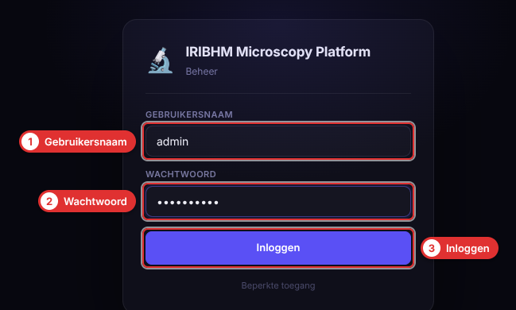{.shot width=62%}

::: legend
| n | wat het is |
|-|----------------------|
| 1 | Uw **gebruikersnaam** (standaard `admin`). |
| 2 | Uw **wachtwoord**. |
| 3 | [Inloggen]{.ui} opent het paneel. De toets <kbd>Enter</kbd> doet hetzelfde. |
:::

Het is een echt formulier: de wachtwoordbeheerder van uw browser (Chrome, Firefox…) kan **de gebruikersnaam en het wachtwoord** onthouden en invullen.

Zijn de gegevens onjuist, dan verschijnt boven de velden het bericht “Onjuiste inloggegevens.”.

## 1.4. Herhaalde pogingen en duur van de sessie

::: warning
**Het paneel beschermt zich tegen herhaalde pogingen.** Elke mislukte poging wordt geteld **vóór** de controle van het wachtwoord, per adres: na **10 mislukte pogingen in 15 minuten** is de toegang **15 minuten** geblokkeerd (de server antwoordt dan met het Franstalige bericht « Trop de tentatives. Réessayez plus tard. », dat wil zeggen “Te veel pogingen. Probeer het later opnieuw.”). Een algemene grens van 200 pogingen per 15 minuten beschermt de site bovendien tegen een aanval vanaf meerdere adressen.
:::

- Een verkeerde gebruikersnaam kost **evenveel tijd** als een verkeerd wachtwoord: niemand kan raden welke accounts bestaan.
- De sessie duurt **8 uur**, daarna moet u opnieuw inloggen. Ze eindigt ook bij elke wijziging van het wachtwoord.
- Het sessietoken is **niet** leesbaar voor de pagina's van de site; het verdwijnt bij het uitloggen.

::: tech
Achter een “reverse proxy” moet de server het adres van de proxy kennen (optie `--trusted-proxy`, variabele `LUMEN_TRUSTED_PROXIES` of bestand `api/trusted-proxies.json`). Anders lijken alle bezoekers op de proxy en delen ze dezelfde teller voor pogingen. Dit is een hostinginstelling: vraag het aan de persoon die de server beheert.
:::

::: warning
**Het wachtwoord staat nergens op de server.** Het wordt omgezet in een onomkeerbare vingerafdruk (zie hoofdstuk 16). Niemand, ook de hoster niet, kan het terugvinden. **Als u het kwijt bent**, staat de enige oplossing in [bijlage B](#bijlage-b--als-er-iets-misgaat).
:::

# 2. De rondleiding

::: chapter-intro
- Een linkermenu in **4 groepen**, een balk bovenaan, een werkgebied.
- Een oranje stip waarschuwt u als **u niet-opgeslagen wijzigingen hebt**.
- <kbd>Ctrl</kbd> + <kbd>S</kbd> slaat het geopende tabblad op.
:::

Na het inloggen is het scherm verdeeld in drie zones die nooit veranderen: het **menu**, de **bovenbalk** en het **werkgebied** waar het gekozen tabblad verschijnt.

## 2.1. Het linkermenu

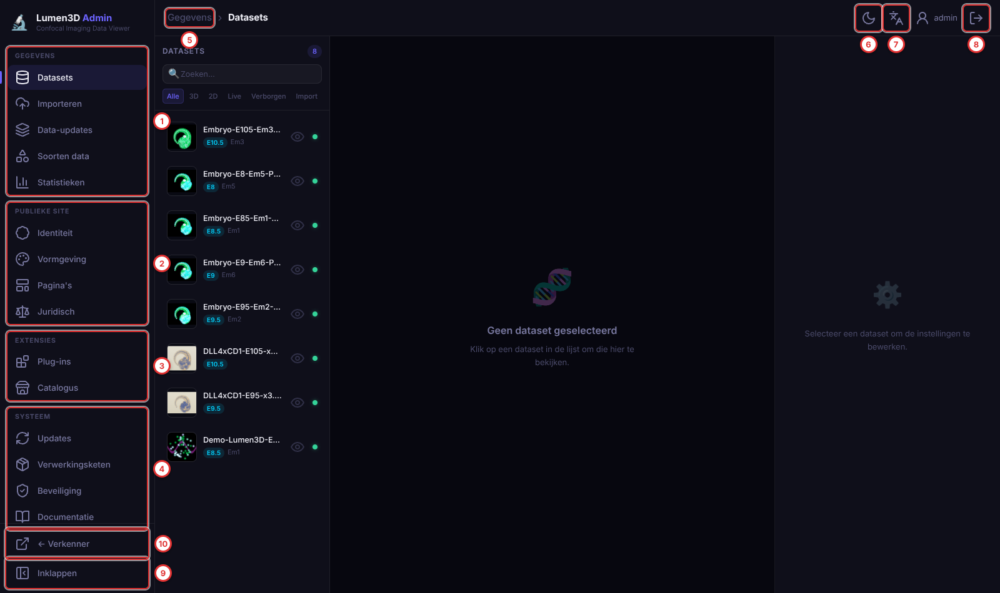{.shot width=88%}

::: legend
| n | wat het is |
|-|----------------------|
| 1 | Groep **Gegevens**: Datasets, Importeren, Data-updates, Soorten data, Statistieken. |
| 2 | Groep **Publieke site**: Identiteit, Vormgeving, Pagina's, Juridisch. |
| 3 | Groep **Extensies**: Plug-ins, Catalogus. |
| 4 | Groep **Systeem**: Updates, Verwerkingsketen, Beveiliging, Documentatie. |
| 5 | **Kruimelpad**: “groep › tabblad” dat open is. |
| 6 | Lichte of donkere **thema** van het paneel (alleen uw eigen weergave). |
| 7 | **Taal** van het paneel: Frans, Engels, Spaans, Nederlands. |
| 8 | **Uitloggen.** |
| 9 | [Inklappen]{.ui}: klapt het menu in tot pictogrammen om ruimte te winnen (de keuze wordt onthouden). |
| 10 | [← Verkenner]{.ui}: opent de publieke site in een nieuw tabblad, handig om het effect van een wijziging te controleren. |
:::

De knop [Inklappen]{.ui} klapt het menu in tot alleen pictogrammen. Een **klein gekleurd stipje** verschijnt naast [Updates]{.ui} wanneer er een nieuwe versie van het platform bestaat. Een ander verschijnt naast [Importeren]{.ui} wanneer er een overdracht bezig is.

Op een telefoon wordt het menu een lade (knop [Menu]{.ui}). Het paneel is bedoeld voor een **breed scherm**, vooral de datasetbewerker.

## 2.2. De bovenbalk

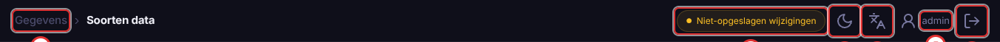{.shot width=88%}

::: legend
| n | wat het is |
|-|----------------------|
| 1 | Het **kruimelpad**: groep, dan tabblad. |
| 2 | De oranje stip **“Niet-opgeslagen wijzigingen”**. |
| 3 | Het **thema** van het paneel. |
| 4 | De **taal** van het paneel. |
| 5 | Uw **gebruikersnaam**. |
| 6 | **Uitloggen**. |
:::

## 2.3. Niet-opgeslagen wijzigingen

Zodra u iets wijzigt zonder op te slaan, verschijnt de oranje stip. Het is een **herinnering**, geen fout: zolang hij er staat, zijn uw wijzigingen alleen voor u zichtbaar.

- Hij wordt **per tabblad** berekend (Datasets, Soorten data, Identiteit, Vormgeving, Juridisch, Pagina's). Hij gaat niet meer branden alleen omdat u een dataset hebt **geopend**.
- Wisselt u van tabblad met wijzigingen in behandeling, dan verschijnt “Niet-opgeslagen wijzigingen. Doorgaan zonder op te slaan?”. Ja antwoorden **gooit de wijzigingen echt weg**.
- <kbd>Ctrl</kbd> + <kbd>S</kbd> (<kbd>Cmd</kbd> + <kbd>S</kbd> op Mac) **slaat het zichtbare tabblad op**: Datasets, Soorten data, Identiteit, Vormgeving, Juridisch.

::: note
**Sessie verlopen terwijl u werkt?** Het paneel toont het inlogscherm weer met het bericht “Sessie verlopen: uw niet-opgeslagen wijzigingen blijven bewaard. Meld u opnieuw aan.”. De tabbladen blijven erachter staan: na het opnieuw inloggen vindt u uw werk terug.
:::

Is er een **import bezig**, dan vragen uitloggen en links die het paneel verlaten om bevestiging (hoofdstuk 4). De tabbladen worden bij het eerste openen geladen: een eerste bezoek kan een fractie van een seconde duren.

## 2.4. De tabbladen in één oogopslag

| Tabblad | Waarvoor | Frequentie |
|---|---|---|
| **Datasets** | Elke dataset een naam geven, beschrijven, oriënteren, tonen of verbergen | Vaak |
| **Importeren** | De door de verwerkingsketen gemaakte map versturen, vanuit de browser | Vaak |
| **Data-updates** | De gepubliceerde datasets naar het huidige gegevensformaat brengen | Af en toe |
| **Soorten data** | De publieke naam van de drie categorieën (3D, 2D, Live) | Zelden |
| **Statistieken** | Zien hoeveel de site wordt bezocht | Af en toe |
| **Identiteit** | Naam van de site, vocabulaire, voettekst, menu | Zelden |
| **Vormgeving** | Kleuren, lettertype en hoeken van de publieke site | Zelden |
| **Pagina's** | De inhoud van de pagina's wijzigen (start, over…) | Vaak |
| **Juridisch** | Juridische tekst | Zelden |
| **Plug-ins** | De functies van de viewer in- en uitschakelen, goedkeuren | Zelden |
| **Catalogus** | Functies installeren, bijwerken, verwijderen | Zelden |
| **Updates** | Het **platform**, de plug-ins en het pakket van de verwerkingsketen bijwerken | Af en toe |
| **Verwerkingsketen** | Het hulpmiddel downloaden dat nieuwe data voorbereidt | Zelden |
| **Beveiliging** | Wachtwoord en rechten | Zelden |
| **Documentatie** | De gepubliceerde gidsen lezen en downloaden | Af en toe |

::: warning
**Twee tabbladen beginnen met “Updates” of lijken erop, en ze doen niet hetzelfde.** [Data-updates]{.ui} (groep Gegevens) brengt het **formaat van de datasets** op niveau. [Updates]{.ui} (groep Systeem) werkt **de software** bij: platform, plug-ins, verwerkingspakket.
:::

# 3. Datasets — de gegevensverzamelingen

::: chapter-intro
- Dit is het tabblad dat u het vaakst opent: het **beschrijft** de datasets en beslist **welke openbaar zijn**.
- Drie kolommen: de **lijst**, het **voorbeeld** (de echte viewer), de **instellingen**.
- Een dataset komt binnen via het tabblad **Importeren** (of via FTP); hier maakt u hem presentabel.
:::

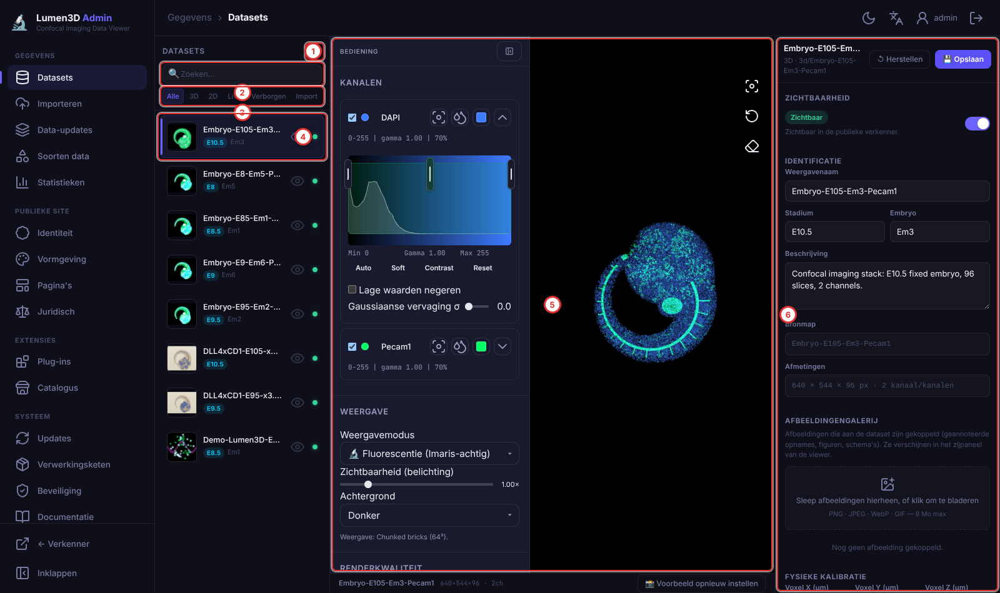{.shot width=88%}

::: legend
| n | wat het is |
|-|----------------------|
| 1 | Het totale aantal datasets. |
| 2 | Het **zoekveld**: naam, stadium, specimen. |
| 3 | De **filters** per soort (zie §3.2). |
| 4 | De geselecteerde dataset in de lijst. |
| 5 | Het **voorbeeld**: de echte viewer, met de zijbalk van de kanalen. |
| 6 | De **instellingen** van de dataset (rechterkolom). |
:::

::: analogy
**Een bibliotheek en haar fiches.** De volumes zijn de boeken, door de verwerkingsketen op de planken gezet. Dit tabblad schrijft de boeken niet: het vult **de fiche** van elk boek in (leesbare titel, beschrijving, oriëntatie, omslagafbeelding) en beslist of het **in het publieke rek** staat of in het magazijn.
:::

## 3.1. Hoe komt een dataset hier terecht?

U **maakt** geen dataset aan vanuit het paneel. Er zijn twee wegen:

::: steps
1. De ruwe microscoopbeelden worden verwerkt door de **verwerkingsketen** (hoofdstuk 15).
2. De geproduceerde map wordt naar de server gestuurd: ofwel via het tabblad **Importeren** (slepen en neerzetten in de browser, hoofdstuk 4), ofwel via FTP naar `DATA_WEB` gekopieerd.
3. Hij **verschijnt meteen** in deze lijst: er hoeft niets opnieuw te worden gegenereerd, er hoeft op geen knop te worden geklikt.
:::

::: warning
Een dataset die **via Importeren is gepubliceerd**, komt **verborgen** voor de publieke verkenner aan. U moet hier komen, hem openen en [Zichtbaarheid]{.ui} aanzetten (of op het oogje van zijn rij klikken). Een dataset die via FTP is gekopieerd, is wel meteen zichtbaar.
:::

## 3.2. De linkerkolom: een dataset vinden

:::::: cols-wide-right
::::: col
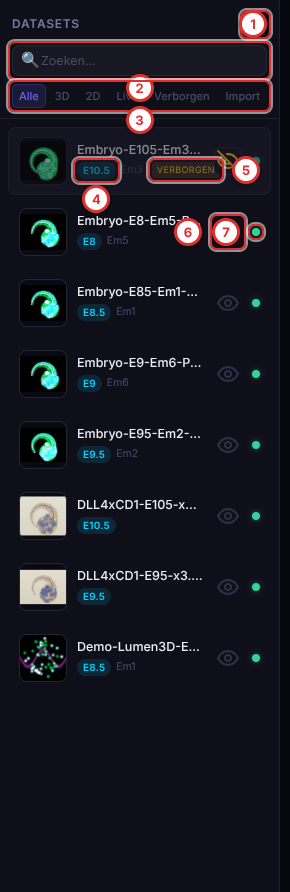{.shot width=100%}
:::::
::::: col
::: legend
| n | wat het is |
|-|----------------------|
| 1 | Het **aantal** datasets. |
| 2 | Het **zoekveld**: een stukje van een naam, de lijst filtert live; het kruisje wist. |
| 3 | De **filters**: [Alle]{.ui}, **één filter per soort data** ([3D]{.ui}, [2D]{.ui}, [Live]{.ui}), [Verborgen]{.ui} en [Import]{.ui}. |
| 4 | Het **stadium** van het embryo. |
| 5 | De badge **verborgen**: deze dataset is niet openbaar. |
| 6 | Het **oogje**: toont of verbergt de dataset **meteen**, zonder via [Opslaan]{.ui} te gaan. |
| 7 | Het **gekleurde puntje**: [Ingesteld]{.ui} (groen) of [Niet ingesteld]{.ui} (amber). |
:::
:::::
::::::

- De namen van de soortfilters zijn **die u zelf hebt gekozen** in het tabblad Soorten data (hoofdstuk 6). Er zijn **drie** soorten: celtracking is een laag van een *Live*-dataset, geen aparte soort.
- Het filter [Import]{.ui} toont de datasets waarvan de overdracht niet is gepubliceerd (§3.10).
- Het **gekleurde puntje is geen integriteitscontrole**: groen betekent dat de dataset al minstens één keer vanuit dit paneel is opgeslagen (of een miniatuur heeft); amber dat dit nog nooit is gebeurd.

::: note
Het oogje wijzigt de zichtbaarheid **meteen** (toast “Dataset verborgen in de verkenner.” of “Dataset zichtbaar in de verkenner.”). Het is de enige wijziging van een dataset die niet via [Opslaan]{.ui} loopt.
:::

Een lege lijst toont “Geen dataset gevonden.”. Kan de lijst niet worden geladen: “Kan de datasets niet laden. Controleer of PHP draait.” en een knop [Opnieuw proberen]{.ui}.

## 3.3. De middelste kolom: het voorbeeld

:::::: cols-wide-right
::::: col
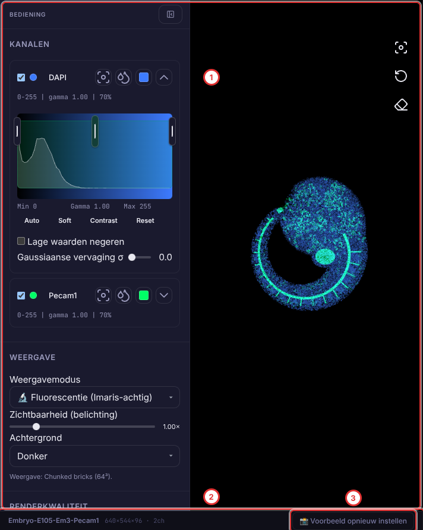{.shot width=100%}
:::::
::::: col
::: legend
| n | wat het is |
|-|----------------------|
| 1 | De **3D-viewer** (of 2D voor een foto), zoals een bezoeker hem ziet. |
| 2 | De naam van de dataset en zijn **afmetingen** (`X×Y×Z · n kanalen`, of `X×Y px`). |
| 3 | [📸 Voorbeeld opnieuw instellen]{.ui}: legt de huidige weergave vast als **miniatuur** van de dataset in de verkenner. |
:::
:::::
::::::

U kunt het volume laten draaien, de kleuren wijzigen, het contrast instellen: precies zoals een bezoeker. Het laden van een groot volume duurt enkele seconden (de data komen in kleine blokken binnen).

::: note
Alleen de plug-ins die **ingebed** mogen draaien (context “panel”) worden in het voorbeeld geladen: Presentation Mode, Download Center, Screenshot en enkele andere verschijnen er niet. **Dit is geen bug** (zie hoofdstuk 12).
:::

::: tip
**Voorbeeld opnieuw instellen**: oriënteer het volume zoals u het in de verkenner wilt laten verschijnen en klik dan. De knop toont achtereenvolgens “Vastleggen…” en “Opslaan…”; een toast bevestigt “Voorbeeld bijgewerkt ✓”.
:::

### Wat het voorbeeld bewaart, en wat het vergeet

Sommige instellingen in het voorbeeld worden **door het paneel opgepikt** en bewaard wanneer u op [Opslaan]{.ui} klikt:

- de **kanaalinstellingen**: naam, kleur, min / max / gamma, getoond of verborgen;
- de **helderheid** (belichting);
- de **oriëntatie** als u die aan het bepalen bent (§3.8).

Al de rest — cameraposisie, weergavemodus, kwaliteit, achtergrond, snijvlak — dient om te kijken en wordt **niet bewaard**.

## 3.4. De rechterkolom: de instellingen

:::::: cols-wide-right
::::: col
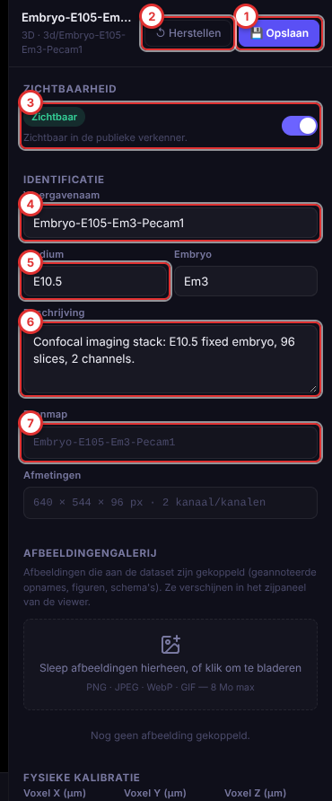{.shot width=100%}
:::::
::::: col
::: legend
| n | wat het is |
|-|----------------------|
| 1 | [💾 Opslaan]{.ui} (<kbd>Ctrl</kbd> + <kbd>S</kbd>): slaat het formulier op. |
| 2 | [↺ Herstellen]{.ui}: maakt uw niet-opgeslagen wijzigingen ongedaan. |
| 3 | **Zichtbaarheid**: de schakelaar werkt **meteen**. |
| 4 | **Weergavenaam**: de naam die bezoekers zien. |
| 5 | **Stadium** (en **Embryo**, ernaast): de filterlabels. |
| 6 | **Beschrijving**: vrije tekst van de publieke fiche. |
| 7 | **Bronmap** (en **Afmetingen**): grijs, niet te wijzigen. |
:::
:::::
::::::

Kop van de kolom: de naam van de dataset en daaronder “soort · id” (bijvoorbeeld “3D · 3d/Embryo-E105-Em3-Pecam1”).

**Zichtbaarheid** — een label [Zichtbaar]{.ui} (“Zichtbaar in de publieke verkenner.”) of [Verborgen]{.ui} (“Niet zichtbaar in de publieke verkenner.”). Een verborgen dataset blijft op de server en blijft bereikbaar via zijn exacte adres, maar verschijnt niet meer in de lijsten. Handig tijdens een controle, of voor een nog niet gepubliceerd artikel.

**Identificatie**

- **Weergavenaam** — vervangt de technische mapnaam. Maakt u het veld **leeg**, dan blijft de oude naam behouden.
- **Stadium** en **Embryo** (het label neemt het woord uit uw Terminologie over) — vooraf ingevuld op basis van de mapnaam; corrigeer als de herkenning fout zat. Het numerieke stadium wordt bij het opslaan herberekend.
- **Beschrijving** — wat een collega helpt: kleuringen, omstandigheden, bijzonderheden.
- **Bronmap** en **Afmetingen** — uit de bestanden gelezen. Voor een volume: “X × Y × Z px · n kanaal/kanalen”; voor een foto: “X × Y px · 0,xxx µm/px” of “niet gekalibreerd”.

::: tech
[Opslaan]{.ui} **voegt** het formulier **samen** met `metadata.json` (atomisch schrijven, onder een slot). De **soort** en de **id** van een dataset worden nooit vanuit het paneel gewijzigd. Resultaat: toast “Dataset opgeslagen ✓” of “Fout bij het opslaan.”.
:::

Een onjuist opgebouwde dataset wordt **geweigerd** in plaats van scheef geladen: toast “Onjuist opgebouwde dataset, laden geweigerd (reden)”, met een van deze redenen: leeg antwoord, identificatie ontbreekt, ongeldig type, afmetingen ontbreken of ongeldige afmetingen, kanalen ontbreken, afbeeldingsblok ontbreekt of ongeldig afbeeldingsblok.

## 3.5. De afbeeldingengalerij

Met een galerij kunt u aan een dataset **geannoteerde opnames, schema's en figuren** koppelen. Ze verschijnen in de viewer, rechtsonder, als miniaturen die bij een klik groter worden.

:::::: cols-wide-right
::::: col
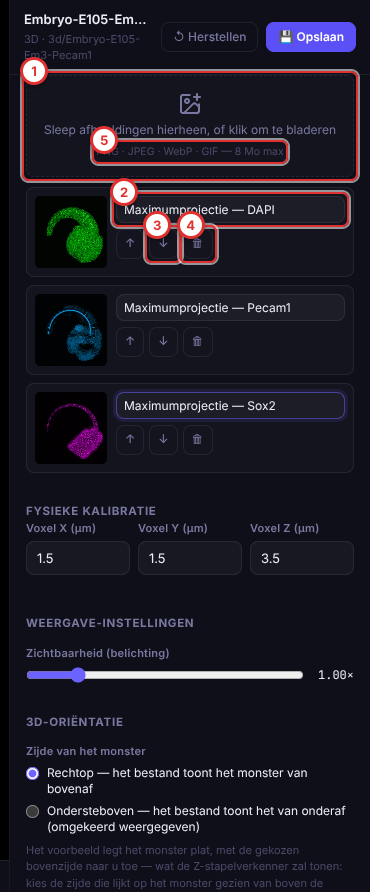{.shot width=100%}
:::::
::::: col
::: legend
| n | wat het is |
|-|----------------------|
| 1 | De **dropzone**: sleep afbeeldingen hierheen, of klik om te bladeren. |
| 2 | Het **bijschrift** (optioneel, 400 tekens). |
| 3 | ↑ ↓: de afbeelding in de weergavevolgorde **verplaatsen**. |
| 4 | 🗑: de afbeelding **verwijderen** (bevestiging, dan “Afbeelding verwijderd ✓”). |
| 5 | Formaten: PNG, JPEG, WebP, GIF — max. 8 MB. |
:::
:::::
::::::

- **Maximaal 40 afbeeldingen** per dataset (“Maximaal 40 afbeeldingen per dataset.”).
- De **bytes worden meteen verstuurd** bij het toevoegen. De **volgorde** en de **bijschriften** worden bewaard door [Opslaan]{.ui}.
- Het formaat wordt herkend aan de **werkelijke inhoud** van het bestand, nooit aan de naam. De grens van 8 MB volgt de limiet van de server als die lager is.
- De miniaturen (320 px) worden door de server gemaakt zodat de lijst licht blijft.
- Een dataset die **als vervanger opnieuw wordt geïmporteerd, behoudt zijn galerij** (hoofdstuk 4).
- Bij een niet-gepubliceerde import is de zone uitgeschakeld: “Publiceer de import voordat u er afbeeldingen aan koppelt.”.

Mogelijke fouten: ““X”: niet-ondersteund formaat (PNG, JPEG, WebP, GIF).”, ““X” is groter dan 8 MB.”, “Kan “X” niet uploaden: …”, “Kan de afbeelding niet verwijderen.”.

## 3.6. Fysieke kalibratie en weergave

:::::: cols-wide-right
::::: col
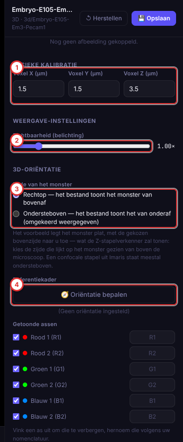{.shot width=100%}
:::::
::::: col
::: legend
| n | wat het is |
|-|----------------------|
| 1 | **Voxel X / Y / Z**: de werkelijke grootte van een voxel, in µm. |
| 2 | **Zichtbaarheid (belichting)**: de helderheid bij het openen. |
| 3 | **Zijde van het monster** (§3.8). |
| 4 | [🧭 Oriëntatie bepalen]{.ui} (§3.8). |
:::
:::::
::::::

**Fysieke kalibratie — het belangrijkste veld.** De drie waarden `Voxel X / Y / Z` (stappen van 0,001) geven de werkelijke grootte van een punt van het beeld, in micrometer. **Alle metingen van de bezoekers hangen ervan af**: afstandsmeting, schaalbalk, getoonde afmetingen.

::: warning
Deze waarden worden uit het microscoopbestand gelezen en zijn normaal juist. **Wijzig ze alleen als u een precieze reden hebt om ze onjuist te vinden**: een foute waarde vervalst alle gepubliceerde metingen, zonder enige waarschuwing. Een lege waarde of 0 wordt genegeerd (de oude blijft behouden).
:::

`Voxel Z` is vaak veel groter dan X en Y (bijvoorbeeld `0,52 / 0,52 / 3,40`): dat is normaal, de afstand tussen twee doorsneden is groter dan de resolutie in het vlak.

**Weergave-instellingen** — de schuifregelaar **Zichtbaarheid (belichting)** (van 0,20× tot 5,00×) stelt de helderheid bij het openen in; hij volgt die van het voorbeeld. Lijkt een dataset te donker, verhoog hem dan: bezoekers kunnen hem altijd nog bijstellen.

Deze twee secties zijn **verborgen bij een 2D-foto** (§3.9).

## 3.7. De kanalen instellen

Een volume bevat meerdere **kanalen**, één per fluorescente kleuring. Hier beslist u hoe ze er **standaard** uitzien. De instellingen doet u in de **zijbalk van het voorbeeld** en ze worden bewaard door [Opslaan]{.ui}.

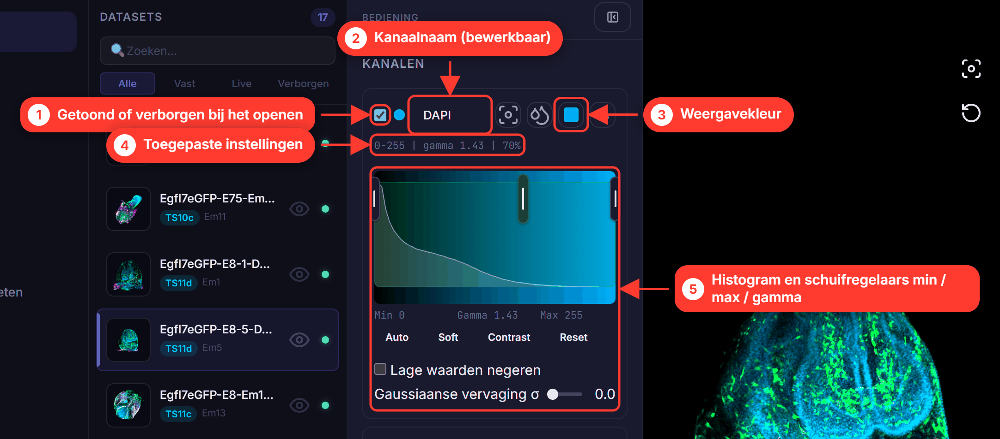{.shot width=70%}

::: legend
| n | wat het is |
|-|----------------------|
| 1 | Het **selectievakje**: kanaal getoond of verborgen bij het openen. |
| 2 | De **naam** van het kanaal: klik en typ om te hernoemen. |
| 3 | De weergave**kleur**. |
| 4 | De **samenvatting** van de instellingen (min–max, gamma, dekking). |
| 5 | Het **gedetailleerde paneel**: histogram en schuifregelaars, via de punthaak. |
:::

- **De naam.** De kanalen komen binnen als “Canal 1”, “Canal 2”… Vervang ze door de werkelijke kleuring: `DAPI`, `GFP`, `Pecam1`.
- **De kleur.** Sommige worden op basis van de naam toegekend: `DAPI` wordt blauw, `GFP` groen, `Pecam1` magenta. Anders gelden reservekleuren: groen, magenta, blauw, rood.
- **Getoond of verborgen.** Vink een weinig informatief kanaal uit (leeg, autofluorescentie): het blijft beschikbaar, maar de bezoeker ziet het eerst niet.
- **Min / max / gamma.** Het histogram toont de verdeling van de intensiteiten; de handvatten stellen de lage drempel, de hoge drempel en de gamma in. [Auto]{.ui}, [Soft]{.ui}, [Contrast]{.ui} bieden kant-en-klare instellingen, [Reset]{.ui} keert terug naar het begin.
- **Kanaal solo** is een schakelaar: een tweede druk herstelt de vorige weergave.

::: warning
**Deze instellingen zijn cosmetisch, niet destructief.** Ze wijzigen de *weergave*, nooit de data. Vergeet [Opslaan]{.ui} niet: zonder gaan de kanaalinstellingen verloren als u van dataset wisselt.
:::

## 3.8. De oriëntatie van het specimen

De sectie **3D-oriëntatie** heeft vier instellingen, van boven naar beneden: de **zijde van het monster**, het **referentiekader**, de **getoonde assen** en de **standaardweergave**.

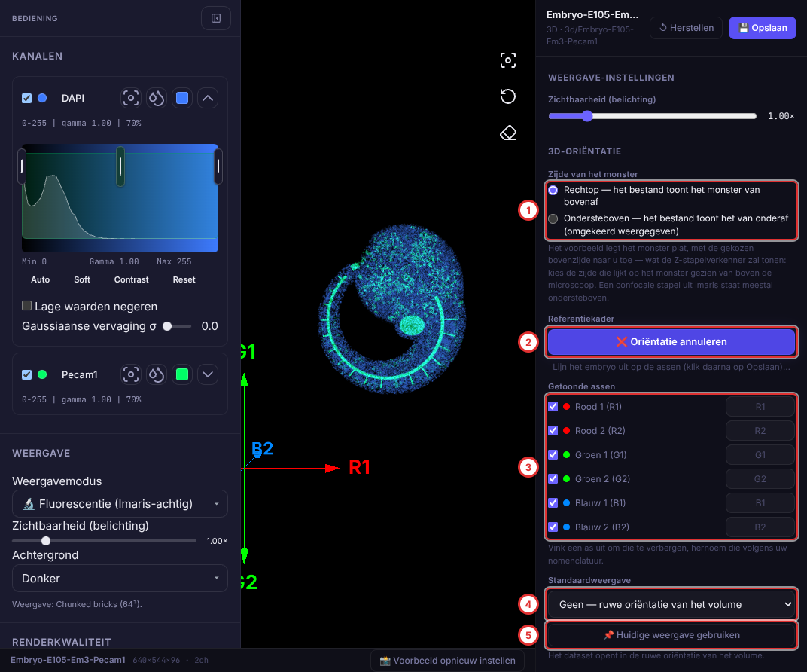{.shot width=88%}

::: legend
| n | wat het is |
|-|----------------------|
| 1 | **Zijde van het monster**: twee keuzerondjes. |
| 2 | [🧭 Oriëntatie bepalen]{.ui}: plaatst de assengizmo in het voorbeeld. |
| 3 | **Getoonde assen**: aanvinken, verbergen, hernoemen. |
| 4 | **Standaardweergave**: de openingspositie van de dataset. |
| 5 | [📌 Huidige weergave gebruiken]{.ui}: legt de stand van het voorbeeld vast. |
:::

### Zijde van het monster

Twee keuzes: “Rechtop — het bestand toont het monster van bovenaf” (standaard) of “Ondersteboven — het bestand toont het van onderaf (omgekeerd weergegeven)”.

::: tip
Een uit Imaris geëxporteerde confocale stapel staat **meestal ondersteboven**. Kies de zijde die lijkt op het monster **gezien van boven de microscoop**.
:::

Zodra u een keuze aanvinkt, **gaat het voorbeeld plat liggen** (animatie van ongeveer een seconde), met de als *bovenkant* gekozen zijde naar u toe: dat zal de Z-Stack Browser tonen.

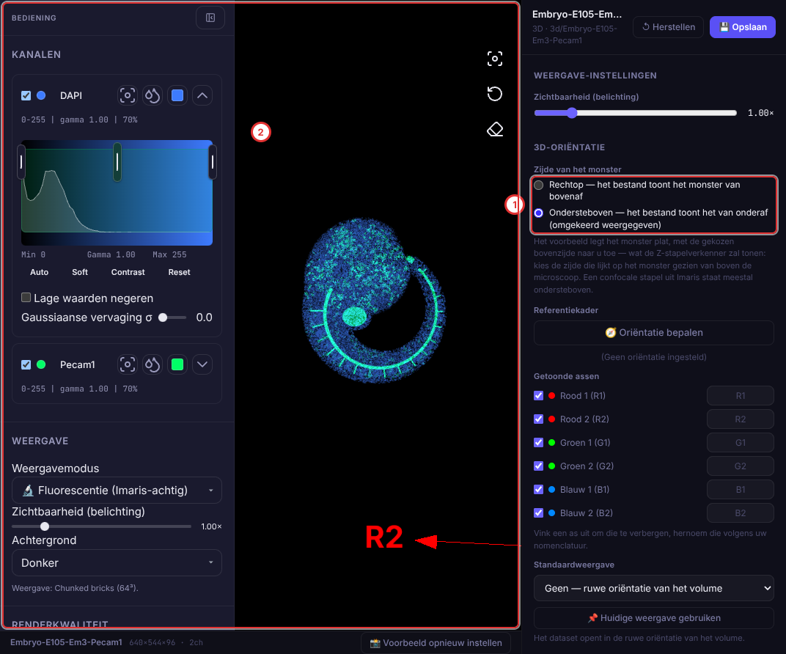{.shot width=88%}

De zijde wordt gebruikt door de beginweergave, de knop om de weergave te herstellen, de “3d”-weergave en de Z-Stack Browser. Ze **wijzigt noch het referentiekader noch de standaardweergave**.

### Referentiekader en assen

De knop [🧭 Oriëntatie bepalen]{.ui} (die [❌ Oriëntatie annuleren]{.ui} wordt) dient om aan te geven waar voor, boven en rechts van het specimen liggen. Hij vertrekt van de reeds opgeslagen uitlijning. Drie gekleurde assen verschijnen op het volume in het voorbeeld (zie de figuur hierboven).

| As | Kleur | Getoond |
|---|---|---|
| **Rood 1 / Rood 2** | rood | R1 / R2 |
| **Groen 1 / Groen 2** | groen | G1 / G2 |
| **Blauw 1 / Blauw 2** | blauw | B1 / B2 |

De assen **leggen geen enkele nomenclatuur op**: vink in de lijst **Getoonde assen** een as uit om hem te verbergen, of hernoem hem (12 tekens, bijvoorbeeld “anterieur”, “dorsaal”). De wijzigingen zijn live te zien in het voorbeeld.

**Zo gaat het:**

::: steps
1. Klik op [🧭 Oriëntatie bepalen]{.ui} (status: “Lijn het specimen uit op de assen (klik daarna op Opslaan)…”).
2. Draai het volume tot het specimen op de assen is uitgelijnd.
3. Klik op [💾 Opslaan]{.ui}. De status wordt “Oriëntatie ingesteld ✓”.
:::

[❌ Oriëntatie annuleren]{.ui} sluit af zonder iets te wijzigen. Zonder oriëntatie: “(Geen oriëntatie ingesteld)”.

### Standaardweergave

De lijst **Standaardweergave** kiest hoe de dataset **opent**: “Geen — ruwe oriëntatie van het volume”, of een van de zes voorinstellingen “naar de camera, boven” die **uw asnamen** overnemen (bijvoorbeeld “Rood 1 naar de camera, Groen 1 boven”), of “Aangepast (vastgelegde weergave)”.

De knop [📌 Huidige weergave gebruiken]{.ui} legt de stand vast die u in het voorbeeld hebt gemaakt (toast “Standaardweergave ingesteld — sla op om die toe te passen.”). Met een standaardweergave opent de dataset **meteen in die stand, zonder de assen te tonen**.

::: note
De oriëntatie-instellingen hangen af van de plug-in **Orientation Axes** (hoofdstuk 12): ontbreekt die, dan meldt het paneel dat (“De plug-in “Orientation Axes” reageert niet — installeer die om een standaardweergave in te stellen.”). De weergave wordt bewaard als een *anatomische* stand: het referentiekader later verfijnen maakt haar niet ongeldig.
:::

::: warning
Een dataset waarvan de zijde onder versie 1.55.7 van het platform is omgeschakeld, heeft een vertekend referentiekader: **bepaal zijn oriëntatie opnieuw**.
:::

## 3.9. De 2D-foto's

Een dataset van het soort **2D** is **een gekalibreerde foto** van een stereomicroscoop. Het voorbeeld opent de 2D-pagina; de rechterkolom past zich aan.

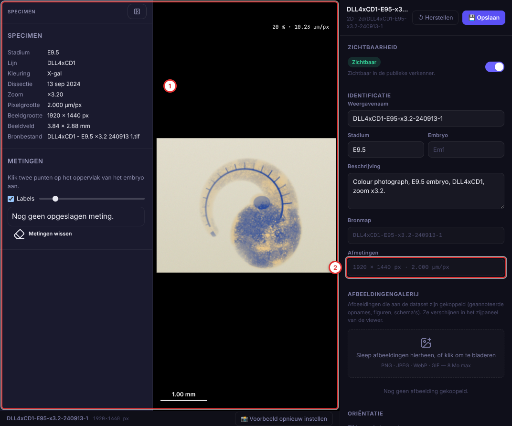{.shot width=88%}

::: legend
| n | wat het is |
|-|----------------------|
| 1 | Het **2D-voorbeeld**: foto, schaalbalk, paneel “Specimen”. |
| 2 | **Afmetingen**: “X × Y px · 0,xxx µm/px” (of “niet gekalibreerd”). |
:::

- **Fysieke kalibratie** en **Weergave-instellingen** zijn **afwezig**.
- De sectie heet **Oriëntatie**: rotatie en spiegeling (plug-in Orientation 2D), geen assen of standaardweergave.
- Geen kanalen: er wordt er bij het opslaan geen gemaakt.

## 3.10. Datasets die nog worden geïmporteerd

Een dataset die wordt verstuurd, verschijnt **in deze lijst** (filter [Import]{.ui}), met een statuslabel in plaats van het oogje. Hem openen toont een **statusbanner** bovenaan de rechterkolom.

:::::: cols-wide-right
::::: col
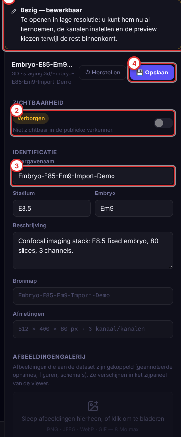{.shot width=100%}
:::::
::::: col
::: legend
| n | wat het is |
|-|----------------------|
| 1 | De **statusbanner** (pictogram, status, hulpzin). |
| 2 | **Zichtbaarheid**: grijs, een import is nog niet openbaar. |
| 3 | De identificatievelden: **bewerkbaar** zodra de status “bewerkbaar” is. |
| 4 | [Opslaan]{.ui}. |
:::
:::::
::::::

| Status | Wat u kunt doen in het tabblad Datasets |
|---|---|
| **Bezig — niet bewerkbaar** | Niets: formulier vergrendeld, voorbeeld vervangen door een bericht. |
| **Bezig — bewerkbaar** | Alles bewerken **behalve** Zichtbaarheid en Galerij. |
| **Verzonden — klaar om te publiceren** | Idem. Publiceren doet u in het tabblad Importeren. |
| **Onderbroken** | Niets: formulier vergrendeld. |

De banner en het formulier **werken zichzelf bij** wanneer de status verandert. De knop [Bewerken]{.ui} van het tabblad Importeren opent hier meteen de juiste dataset.

## 3.11. Als er geen dataset is geselecteerd

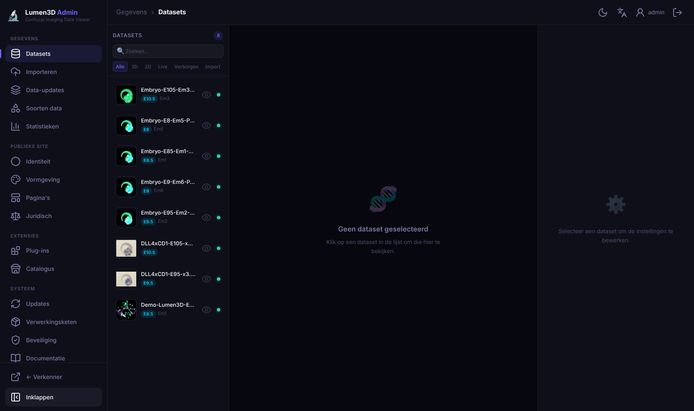{.shot width=80%}

Dit is het beginscherm van het tabblad: “Geen dataset geselecteerd — Klik op een dataset in de lijst om die hier te bekijken.”. Er is **geen** knop om een dataset te verwijderen en ook geen “catalogus opnieuw genereren”: verwijderen is een bewerking op de bestanden van de server, bewust zo, en de lijst wordt bij elke weergave opnieuw berekend.

# 4. Importeren — data versturen vanuit de browser

::: chapter-intro
- U **sleept de map** die de verwerkingsketen heeft gemaakt: geen FTP meer nodig.
- De overdracht wordt **hervat** waar ze stopte en **byte voor byte gecontroleerd**.
- Niets is openbaar vóór u op [Publiceren]{.ui} klikt (en daarna op het oogje, in Datasets).
:::

::: analogy
**Een traceerbaar pakket, afgeleverd in een afhaalkluis.** Uw bestanden reizen door een privézone van de server, niet bereikbaar via een URL. Bij aankomst **weegt en controleert** de server het pakket. Daarna beslist alleen u om het **in het rek te zetten** (Publiceren) en voor het publiek te **openen** (het oogje).
:::

## 4.1. Het lege tabblad

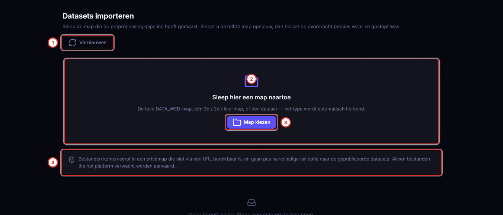{.shot width=88%}

::: legend
| n | wat het is |
|-|----------------------|
| 1 | [Vernieuwen]{.ui}: leest de wachtende imports aan serverzijde opnieuw. |
| 2 | De **dropzone**: sleep er een map in (of klik ergens binnenin). |
| 3 | [Map kiezen]{.ui}: de mapkiezer van de browser. |
| 4 | De **veiligheidsbanner**: privézone, validatie vóór publicatie, alleen verwachte bestanden. |
:::

U kunt **de hele `DATA_WEB`** neerzetten, een map `3d` / `2d` / `live`, of **één enkele dataset**: het soort wordt gelezen uit de `metadata.json` van elke dataset, op elke diepte. U moet **de map van de dataset neerzetten, niet de inhoud ervan**: de mapnaam wordt de id.

::: tip
Een map die u **naast** de zone loslaat, wordt genegeerd: de browser verlaat de pagina niet en een lopende overdracht gaat niet verloren.
:::

## 4.2. Een overdracht bezig

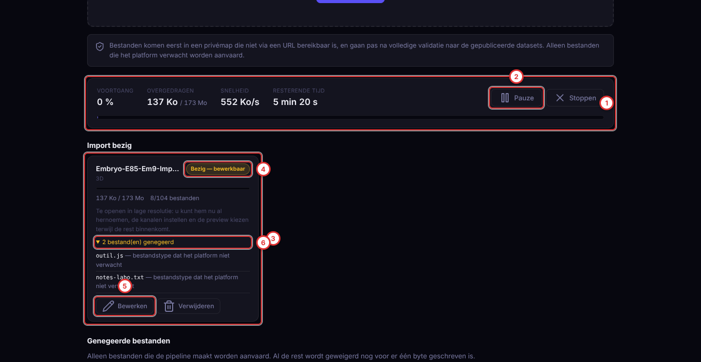{.shot width=88%}

::: legend
| n | wat het is |
|-|----------------------|
| 1 | De **globale voortgang**: [Voortgang]{.ui}, [Overgedragen]{.ui}, [Snelheid]{.ui}, [Resterende tijd]{.ui}, en de balk. |
| 2 | [Pauze]{.ui} (wordt [Hervatten]{.ui}); ernaast [Stoppen]{.ui}. |
| 3 | De **kaart van een dataset**: naam, soort, bytes, aantal bestanden. |
| 4 | Het **statuslabel** (zie §4.3). |
| 5 | [Bewerken]{.ui}: opent de dataset in het tabblad Datasets, vóór het einde van de overdracht. |
| 6 | Het menu **“n bestand(en) genegeerd”**: wat in deze dataset is geweigerd. |
:::

- [Stoppen]{.ui} vraagt bevestiging: “Overdracht stoppen? Al verzonden bestanden blijven bewaard en de overdracht hervat zodra u de map opnieuw sleept.”.
- [Opnieuw proberen]{.ui} verschijnt als er nog mislukte bestanden zijn.
- Valt het netwerk weg: “Verbinding verbroken: de overdracht hervat vanzelf zodra het netwerk terug is.”.
- De vermelding “al gepubliceerd” verschijnt als een gepubliceerde dataset dezelfde naam draagt.

## 4.3. De vijf toestanden van een import

| Status | Wat het betekent | Wat te doen |
|---|---|---|
| **Bezig — niet bewerkbaar** | De bestanden die nodig zijn om te openen zijn nog niet allemaal aangekomen (metadata, manifest, miniatuur, grofste niveau). | Wachten. |
| **Bezig — bewerkbaar** | “Te openen in lage resolutie: u kunt hem nu al hernoemen, de kanalen instellen en de preview kiezen terwijl de rest binnenkomt.” | [Bewerken]{.ui}, [Opslaan]{.ui}. |
| **Verzonden — klaar om te publiceren** | “Overdracht volledig en integriteit gecontroleerd. Publiceer hem om hem naar de gepubliceerde datasets te verplaatsen.” | [Bewerken]{.ui}, [Controleren]{.ui}, [Publiceren]{.ui}, [Verwijderen]{.ui}. |
| **Onderbroken** | “Sleep dezelfde map opnieuw om te hervatten waar de overdracht stopte.” | **Dezelfde map** opnieuw slepen. |
| **Gepubliceerd** | Verplaatst naar de gepubliceerde datasets, voor het publiek **verborgen** tot u hem inschakelt. | Naar Datasets gaan. |

::: warning
Een **onderbroken** import wordt niet eeuwig bewaard: de kaart toont “wordt gewist over {d}”, en na **7 dagen** zonder hervatting maakt de server de ruimte vrij. Een import “Verzonden — klaar om te publiceren” wordt daarentegen **nooit** automatisch gewist.
:::

::: why
**Waarom zo vroeg “bewerkbaar”?** De bestanden vertrekken in **stappen**: eerst `metadata.json`, het manifest en de miniatuur, dan het grofste niveau van elk kanaal, de tussenliggende niveaus, het native niveau, ten slotte `planes/`, `mips/` en `download/`. Na de eerste twee stappen is een dataset te openen en te bewerken, **minuten** na het begin van een overdracht die uren kan duren. De `metadata.json` die u bewerkt, wordt dan **vergrendeld**: de rest van de overdracht overschrijft hem niet.
:::

## 4.4. Wanneer de overdracht klaar is

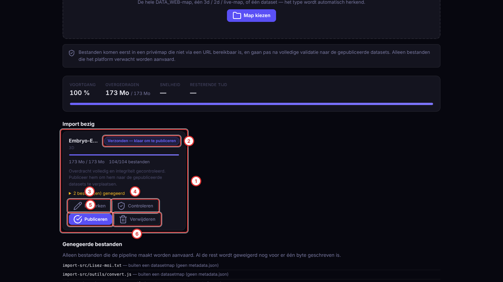{.shot width=88%}

::: legend
| n | wat het is |
|-|----------------------|
| 1 | De kaart van de dataset: 100 %, alle bestanden. |
| 2 | De status **Verzonden — klaar om te publiceren**. |
| 3 | [Bewerken]{.ui}: hernoemen, kanalen en oriëntatie instellen. |
| 4 | [Controleren]{.ui}: start de integriteitsvalidatie. |
| 5 | [Publiceren]{.ui}: verplaatst de dataset naar de gepubliceerde datasets. |
| 6 | [Verwijderen]{.ui}: wist de reeds verzonden bestanden. |
:::

**[Controleren]{.ui}** leest alles wat is aangekomen opnieuw en controleert of elke brick-index naar aanwezige pakketten verwijst. Toast “Dataset geldig ✓”, of “Validatie mislukt:” gevolgd door codes (bijvoorbeeld `missing_pack:…`: een pakket ontbreekt; `truncated_pack:…`: een pakket is afgekapt; `incomplete_files`; `stray_files`; `index_hash_mismatch`).

**[Publiceren]{.ui}**: toast “Dataset gepubliceerd ✓ (verborgen in de verkenner — schakel hem in via het tabblad Datasets)”.

::: warning
**Publiceren maakt de dataset niet openbaar.** Hij komt **verborgen** aan. Ga naar Datasets, open hem en zet [Zichtbaarheid]{.ui} aan.
:::

**Een reeds gepubliceerde dataset vervangen**: bestaat de naam al, dan vraagt het paneel “Er bestaat al een gepubliceerde dataset met deze naam. Vervangen? De afbeeldingengalerij en de velden die u invulde (naam, oriëntatie, bijschriften…) blijven behouden als de nieuwe import ze niet levert.”. Na de vervanging somt een toast op wat behouden bleef (de galerij, enz.).

**[Verwijderen]{.ui}**: “De al verzonden bestanden van deze dataset definitief verwijderen?”, daarna “Import verwijderd.”. Beschikbaar in alle statussen behalve **Gepubliceerd**.

## 4.5. De genegeerde bestanden

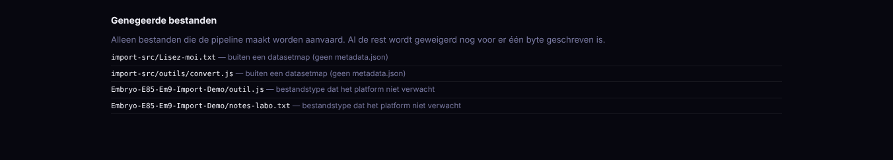{.shot width=88%}

Alleen de bestanden die de verwerkingsketen maakt worden aanvaard. **Al de rest wordt geweigerd nog voor er één byte is geschreven**: `.php`- en `.js`-bestanden, verborgen bestanden, opklimmende paden (`../`), bestanden buiten een datasetmap.

| Getoonde reden | Wat het betekent |
|---|---|
| bestandstype dat het platform niet verwacht | De verwerkingsketen schrijft dit soort bestand niet. |
| buiten een datasetmap (geen metadata.json) | Het bestand zit niet in een dataset. |
| pad geweigerd, ongeldige grootte | Onaanvaardbare naam of grootte. |
| item(s) onleesbaar bij het lezen van de map | Lokale rechten controleren. |

Het zijn **waarschuwingen**, geen blokkades: de rest van de import gaat door.

## 4.6. De zwevende dock

Zodra er een import te melden is, hangt rechtsonder een kleine **dock**, **in alle tabbladen**: u kunt elders werken terwijl het wordt verstuurd. Hij heeft drie formaten, die in de browser worden onthouden.

:::: cols
::: col
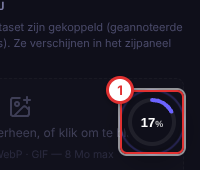{.shot width=70%}

| n | wat het is |
|-|----------------------|
| 1 | Voortgangsring en percentage. Een klik vergroot hem. |
:::
::: col
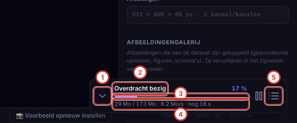{.shot width=88%}

| n | wat het is |
|-|----------------------|
| 1 | Punthaak: inklappen tot een bel. |
| 2–4 | Statustitel, balk, snelheid en resterende tijd. |
| 5 | [Details]{.ui}: opent het paneel. |
:::
::::

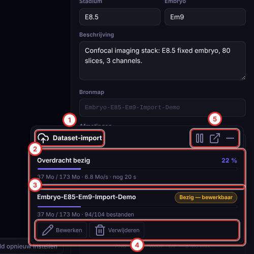{.shot width=70%}

::: legend
| n | wat het is |
|-|----------------------|
| 1 | Titel “Dataset-import”. |
| 2 | De globale voortgang. |
| 3 | Een **regel per dataset**: naam, status, balk, bytes, bestanden. |
| 4 | [Bewerken]{.ui}, [Publiceren]{.ui}, [Verwijderen]{.ui}. |
| 5 | Het tabblad Importeren openen, inklappen. |
:::

Statustitels van de dock: “Overdracht bezig”, “Overdracht gepauzeerd”, “Overdracht voltooid”, “Voltooid met {n} mislukte bestand(en)”, “Verbinding verbroken, hervat automatisch”, “Wachtende imports”…

## 4.7. Weggaan tijdens een overdracht

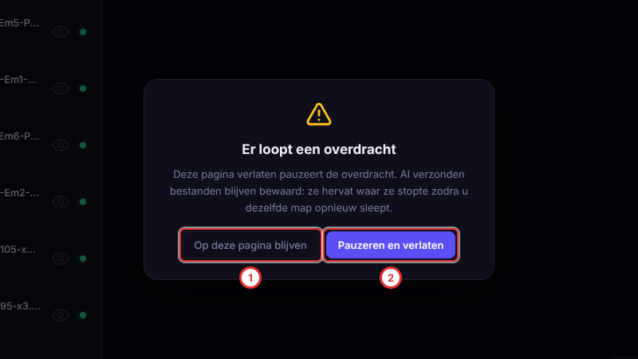{.shot width=70%}

::: legend
| n | wat het is |
|-|----------------------|
| 1 | [Op deze pagina blijven]{.ui}: de overdracht gaat door. |
| 2 | [Pauzeren en verlaten]{.ui}: de overdracht wordt gepauzeerd, de verzonden bestanden blijven bewaard. |
:::

Dit bericht verschijnt wanneer u op **uitloggen** klikt of op een link die het paneel verlaat. Het tabblad sluiten of herladen roept het gebruikelijke dialoogvenster van de browser op; de overdracht wordt daarvoor gepauzeerd. Om te hervatten: **sleep dezelfde map opnieuw**.

## 4.8. Onder de motorkap

::: tech
- De overdracht draait in een **Web Worker**: de interface blijft vloeiend. Ruwe blokken van **8 MiB** (kleiner op een PHP-host met strenge limieten: “Blokgrootte verlaagd naar {n} — sleep de map opnieuw om te hervatten.”), **4 blokken tegelijk**.
- Elk blok draagt een **SHA-256-vingerafdruk** die **vóór** het schrijven wordt gecontroleerd. Een **serverjournaal** onthoudt de ontvangen blokken: dezelfde map opnieuw slepen hervat **tot op het blok nauwkeurig**; een al volledig bestand wordt niet opnieuw verstuurd.
- Het journaal is hetzelfde onder beide servers (Python of PHP): een import die onder de ene is begonnen, kan onder de andere hervat worden.
- Aanvaarde formaten: **formaten 2 tot 4** (`planes/`, `mips/`, bricks v3 en `index.bin`).
:::

## 4.9. Als er iets misgaat

| Bericht | Wat te doen |
|---|---|
| Geen bestand gevonden in deze actie. | De map is leeg of onleesbaar: zet haar opnieuw neer. |
| Geen dataset gevonden: de map moet een metadata.json bevatten. | Zet de door de verwerkingsketen gemaakte map neer. |
| Sleep de MAP van de dataset, niet de inhoud ervan… | Sleep de bovenliggende map. |
| Datasetsoort niet gevonden… | `metadata.json` moet `"type"` declareren: `3d`, `2d` of `live`. |
| Imports vereisen een beveiligde verbinding (HTTPS of localhost). | Open het paneel via `https://`: de SHA-256-vingerafdrukken vereisen dat. |
| Onvoldoende schijfruimte op de server ({needed} nodig, {free} vrij) | Maak ruimte vrij. De controle gebeurt **vóór** het versturen. |
| “X” is groter dan de server voor één bestand accepteert. | Limiet van de server, te bespreken met de hoster. |
| Sessie verlopen — meld u opnieuw aan en sleep de map nogmaals. | Log opnieuw in en sleep opnieuw. |
| Mislukt bij {pad} ({reden}) / {n} bestand(en) konden niet worden verzonden. | [Opnieuw proberen]{.ui}, of sleep de map opnieuw. |
| De server reageert niet… / De overdrachtsmotor kon niet starten. | Controleer de verbinding, herlaad de pagina, sleep opnieuw. |
| Alles is al verzonden — niets over te dragen. | Informatie: de dataset is al volledig. |

# 5. Data-updates — het formaat van de datasets

::: chapter-intro
- Een gepubliceerde dataset heeft een **formaat** (1 tot 4). Het huidige formaat is **4**.
- Dit tabblad brengt ze **ter plekke** op niveau, zoals een software-update.
- U kiest **wie het werk doet**: deze browser of de server. Niets is verplicht.
:::

::: analogy
**De verhuizing van een bibliotheek naar nieuwe rekken.** De boeken (uw pixels) veranderen niet; er komen **indexen** en **beter geordende planken** bij zodat ze sneller tevoorschijn komen. Wordt de verhuizing onderbroken, dan gaat u verder bij de doos waar u was gebleven.
:::

## 5.1. Waarom en voor wie

Elke volumedataset (`3d`, `live`) heeft een **gegevensformaat** (`formatVersion`, afwezig = formaat 1). Een dataset uit de verwerkingsketen **0.21.0** is al in **formaat 4**: hij hoeft **niets**. De **2D-foto's** worden nooit geraakt.

::: note
**Data-updates zijn niet nodig om de site te laten werken.** De viewer leest altijd de formaten 1, 2, 3 en 4; de Studio valt terug op de bricks als `planes/` ontbreekt. Ze **versnellen** bepaalde bewerkingen van de Studio en **verbeteren** de weergavekwaliteit.
:::

## 5.2. De drie stappen

Ze volgen elkaar in volgorde op: een dataset in formaat 1 krijgt ze alle drie.

| Stap | Titel op het scherm | Wat ze aanmaakt | Wat het oplevert |
|---|---|---|---|
| **1 → 2** | Kopie per vlak van het native niveau (snelle XY-sneden in de Studio) | `planes/`: één bestand per z-vlak, verliesloze PNG-tegels van 512² (≈ 1,3× het native niveau in schijfruimte). De bricks worden niet aangeraakt. | Een native XY-snede leest **één vlak** in plaats van een laag van 64 vlakken: tientallen keren minder bytes, resultaat pixelidentiek. |
| **2 → 3** | Maximumprojecties van elke brick-laag (snelle z-stackfiguren over de hele stapel) | `mips/`: één maximumprojectie per laag van 64 vlakken. | Een z-stackfiguur over de hele stapel leest ~3 pakketten in plaats van ongeveer 150. |
| **3 → 4** | Brick-piramide v3: ook in Z gehalveerd, rand van één voxel, binaire index | **Bouwt** `bricks/` **opnieuw op**: bricks van 66³ met rand, ook in Z gehalveerde niveaus, `index.bin`. | Naadloze filtering, lokaal detail (“Detail bij inzoomen”), lichtere atlassen voor 1 tot 2 kanalen. |

::: warning
**Stap 3 → 4 bouwt de boom `bricks/` opnieuw op.** Het **native niveau blijft voxel voor voxel behouden**; de grovere niveaus worden herberekend. De oude boom wordt verwijderd **nadat** de versie is omgezet. Bewaar bij kostbare data een reservekopie, zoals bij elke bewerking op bestanden.
:::

## 5.3. Overzicht van het tabblad

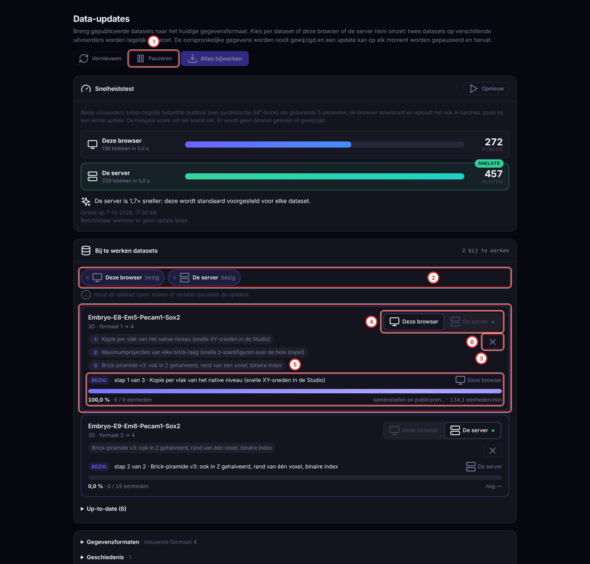{.shot width=88%}

::: legend
| n | wat het is |
|-|----------------------|
| 1 | [Pauzeren]{.ui} (of [Hervatten]{.ui}); ernaast [Vernieuwen]{.ui} en [Alles bijwerken]{.ui}. |
| 2 | De **strook met de twee wachtrijen**: een label per uitvoerder, met zijn status. |
| 3 | De **kaart van een dataset**: naam, soort, “formaat 1 → 4”, geschatte eenheden en grootte, genummerde **stappen**. |
| 4 | De **uitvoerderskiezer**: [Deze browser]{.ui} of [De server]{.ui}. |
| 5 | Het **voortgangsgebied**: “stap i van n”, balk, percentage, voltooide eenheden, **resterende tijd**, eenheden per minuut. |
| 6 | Het kruisje: **annuleren**: “De voortgang van deze update verwijderen? De dataset blijft zoals hij was.” |
:::

Van boven naar beneden: de kop met zijn knoppen, de kaart **Snelheidstest**, de kaart **Bij te werken datasets**, daarna drie inklapbare blokken: **Up-to-date**, **Gegevensformaten**, **Geschiedenis**. [Alles bijwerken]{.ui} verwerkt alle datasets die klaar zijn, één per uitvoerder tegelijk.

Alles bijgewerkt: “Alle datasets hebben het nieuwste formaat.”. Geen gepubliceerd volume: “Geen gepubliceerde volumedataset.”.

## 5.4. Deze browser of de server?

Twee “uitvoerders” kunnen het werk doen:

| Uitvoerder | Wie rekent | Wat nodig is |
|---|---|---|
| **Deze browser** | Uw browser downloadt de bricks, zet ze opnieuw samen (Web Workers) en stuurt het resultaat **eenheid voor eenheid** terug. | Een browser die kan comprimeren, PNG-tegels exact terug kan lezen en verliesloze WebP kan coderen. |
| **De server** | De server converteert zelf, via kleine verzoeken met een tijdslimiet. Geschikt voor gedeelde hosting. | Decoderen (en, voor stap 3 → 4, coderen) van verliesloze WebP (GD van PHP of Pillow van Python), zlib, NumPy aan Python-kant, minstens 128 MiB per verzoek en 10 s uitvoertijd. |

- De keuze gebeurt **per dataset**, **vóór** het starten; ze is **tijdens de uitvoering vergrendeld** en tussen twee uitvoeringen te wijzigen.
- Een uitvoerder die het niet kan, is **grijs**, met een tooltip die zegt waarom (bijvoorbeeld “de server kan lossless WebP-afbeeldingen niet decoderen”).
- Elke uitvoerder heeft **zijn eigen wachtrij**: een dataset op de browser en een andere op de server worden **tegelijk** geconverteerd.
- Een stap die de gekozen uitvoerder niet kan, wordt aan de andere toevertrouwd. Kan geen van beide het: “geen uitvoerder” in het rood.
- Het label **★** markeert de uitvoerder die **het snelst was in de snelheidstest**.
- Beide schrijven in **hetzelfde journaal** aan serverzijde: u kunt van uitvoerder wisselen en hervatten.

::: tip
Staat op een gedeelde hosting de optie [De server]{.ui} op grijs, dan **werkt [Deze browser]{.ui} altijd**: hij doet het werk, de server bewaart alleen.
:::

## 5.5. De snelheidstest

Eén knop: [Test starten (5 s)]{.ui} (daarna [Opnieuw]{.ui}). Gedurende 5 seconden (twee balken in een race, één per uitvoerder) zetten de browser **en** de server **tegelijk** hetzelfde synthetische blok om (een 64³-brick die met het platform wordt meegeleverd). **Er wordt geen dataset gelezen of gewijzigd.**

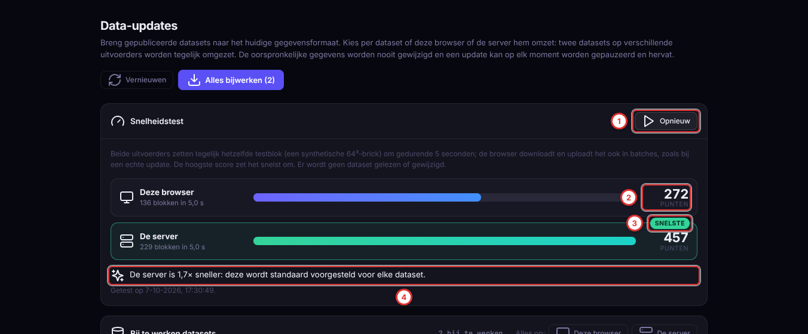{.shot width=88%}

::: legend
| n | wat het is |
|-|----------------------|
| 1 | De test [Opnieuw]{.ui} uitvoeren. |
| 2 | De score van **Deze browser**. |
| 3 | De badge **Snelste**. |
| 4 | Het **oordeel**: “De server is 1,2× sneller: deze wordt standaard voorgesteld voor elke dataset.” |
:::

Zijn beide even snel: “Beide uitvoerders zijn even snel: kies er een.”. Een onbruikbare kant toont **zijn reden** in plaats van een score. Het resultaat wordt in deze browser bewaard (“Getest op …”). De test is niet beschikbaar tijdens een update.

## 5.6. Een update starten, stap voor stap

::: steps
1. (Optioneel) Start de **snelheidstest**.
2. Kies voor elke dataset de **uitvoerder** (de ★ wordt vanzelf voorgesteld).
3. Klik op [Bijwerken]{.ui}, of op [Alles bijwerken (n)]{.ui}.
4. **Houd het tabblad open** tot het einde: “Houd dit tabblad open: sluiten of verlaten pauzeert de updates.”
5. Een toast “{naam} bijgewerkt naar formaat {v}” bevestigt elke voltooide dataset.
:::

De hoofdknop heet [Herstellen]{.ui} als de dataset zegt up-to-date te zijn maar zijn structuur ontbreekt of ongeldig is (label “herstel”), [Hervatten]{.ui} als een taak gepauzeerd is, [Opnieuw proberen]{.ui} na een mislukking.

## 5.7. Tijdens de conversie

Getoonde statussen: **Wacht op zijn beurt** (“volgende op de server”), **Bezig**, **Pauzeren…**, **Gepauzeerd** (met de oorzaak: tabblad verlaten, pagina gesloten, sessie verlopen, server onbereikbaar), **Samenstellen** (“Vlakken samenstellen x/y”, “samenstellen en publiceren…”), **Mislukt** (met de oorzaak).

- **[Pauzeren]{.ui}** pauzeert alle wachtrijen; **[Hervatten]{.ui}** gaat verder waar ze waren gebleven.
- **Het tabblad verlaten**: “Er loopt een update. Dit tabblad verlaten pauzeert hem (u kunt later hervatten). Verlaten?”. **Er gaat niets verloren**: dankzij het serverjournaal kunt u hervatten na een herlaadbeurt, een onderbreking of een wissel van uitvoerder.

::: warning
**Start dezelfde update niet in meerdere tabbladen**, en herstart niet in een lus. In versie 1.59.1 leidde een stortvloed aan verzoeken ertoe dat een hoster het **adres van een operator blokkeerde**. Sinds 1.59.2 lopen **alle** verzoeken van het tabblad via een **regelaar** (maximaal 6 tegelijk; sinds 1.59.3 4 tot 6 per seconde, omdat elke eenheid al haar invoergegevens in één verzoek leest; hij vertraagt en pauzeert wanneer de host traag antwoordt of 429 / 503 teruggeeft). U kunt zien: “De host antwoordt traag: verzoeken worden vertraagd zodat hij dit adres niet blokkeert.” of “Verbinding verbroken — wachten op het netwerk, er gaat niets verloren.”. **Laat het gewoon gebeuren.**
:::

## 5.8. De onderste blokken

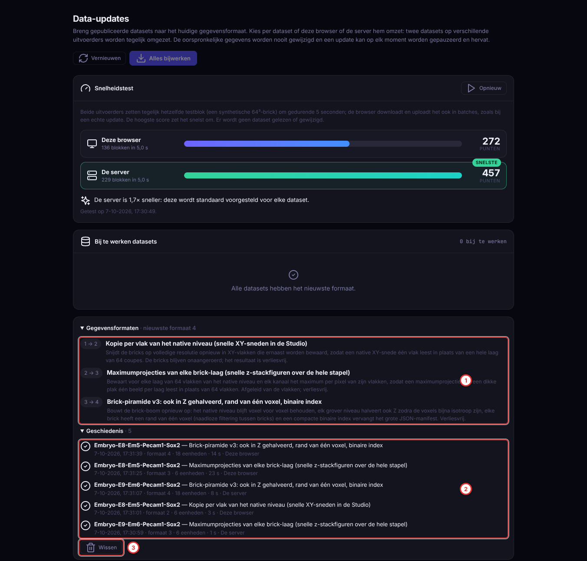{.shot width=88%}

::: legend
| n | wat het is |
|-|----------------------|
| 1 | **Gegevensformaten**: het nieuwste formaat (4) en de lijst van de drie updates (“1 → 2”…). |
| 2 | **Geschiedenis**: de laatste 20 bewerkingen, onthouden in deze browser. |
| 3 | [Wissen]{.ui}: maakt de geschiedenis leeg. |
:::

Een geschiedenisregel toont “formaat {v} · {n} eenheden · {duur} · {uitvoerder}”, of de **reden van de mislukking**. Het blok **Up-to-date (n)** somt de datasets op die al het juiste formaat hebben.

## 5.9. Beveiligingen en fouten

- **Schijf**: het paneel weigert te starten als het resultaat niet past (“onvoldoende schijfruimte op de server (nodig / vrij)”).
- **Oorspronkelijke data**: nooit gewijzigd vóór de laatste omschakeling; de eindstap is **hervatbaar** en gebeurt onder hetzelfde slot als de datasetbewerker.
- **Intussen opnieuw verwerkte dataset**: “de dataset is opnieuw verwerkt sinds de update begon” → [Opnieuw proberen]{.ui} begint van nul. Een verwijderde dataset wordt **nooit opnieuw aangemaakt**.
- **Server te traag voor een eenheid** (gedeelde hosting): de stap schakelt vanzelf **over naar de browser** na twee dode verzoeken.

| Bericht | Wat te doen |
|---|---|
| Sessie verlopen — meld u opnieuw aan en hervat. | Log opnieuw in, [Hervatten]{.ui}. |
| Update van {naam} mislukt: … | Lees de oorzaak; [Opnieuw proberen]{.ui}, of wissel van uitvoerder. |
| Geen enkele uitvoerder kan alle stappen uitvoeren van: … | Probeer [Deze browser]{.ui}, of verwerk opnieuw met de verwerkingsketen. |
| Update van {naam} gestopt: de server kan een eenheid niet binnen zijn tijdslimiet converteren. | Start hem opnieuw in deze browser. |
| De updatestatus kon niet worden gelezen. | [Vernieuwen]{.ui}. |

# 6. Soorten data — de publieke naam van elke categorie

::: chapter-intro
- Het platform deelt elke dataset in bij een van **drie categorieën**: 3D, 2D, Live.
- U beslist over het **woord** dat het publiek voor elk ziet.
- U wijzigt **alleen getoonde namen**: nooit een map, een adres of een bestand.
:::

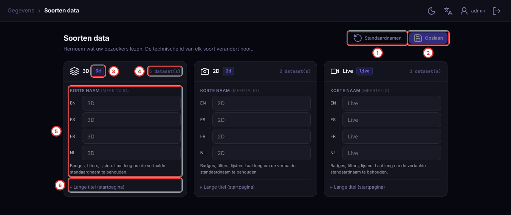{.shot width=88%}

::: legend
| n | wat het is |
|-|----------------------|
| 1 | [Standaardnamen]{.ui}: maakt de velden leeg (daarna moet u nog [Opslaan]{.ui}). |
| 2 | [Opslaan]{.ui} (<kbd>Ctrl</kbd> + <kbd>S</kbd>), alleen actief als er een wijziging is. |
| 3 | De **technische id** van het soort (`3d`, `2d`, `live`): niet te wijzigen. |
| 4 | Het aantal gepubliceerde **datasets** van dit soort. |
| 5 | **Korte naam (meertalig)**: een regel per taal (EN, FR, ES, NL). |
| 6 | **Lange titel (startpagina)**: inklapbaar blok. |
:::

| Categorie | Wat ze bevat | Standaardnaam (Nederlands) |
|---|---|---|
| **3D** (`3d`) | Een vast volume: meerkanaals 3D-beeldstapel | 3D · “3D-beeldvorming” |
| **2D** (`2d`) | Een gekalibreerde stereomicroscoopfoto | 2D · “2D-beeldvorming” |
| **Live** (`live`) | Een 4D-tijdreeks, eventueel met de tracking van zijn cellen | Live · “Live beeldvorming” |

- **Korte naam** — labels, filters, lijsten. **Lange titel** — grote kaarten van de startpagina.
- **Laat een veld leeg om de standaardnaam te behouden**: het platform valt dan terug op zijn eigen vertaling, in de taal van de bezoeker.
- [Standaardnamen]{.ui} vraagt “De vertaalde standaardnamen voor alle soorten herstellen?”. Het **maakt** de velden **leeg**, het schrijft geen vaste tekst.
- Resultaat: toast “Namen van de soorten opgeslagen.” (of “Opslaan mislukt.”).

::: note
**Wat dit tabblad niet wijzigt.** Niet de mappen van de server (`DATA_WEB/3d/`, `DATA_WEB/2d/`, `DATA_WEB/live/`), niet de adressen van de pagina's, niet de links die uw bezoekers al hebben opgeslagen, niets in de datasets. Het **maakt geen** categorie aan: de drie soorten zijn die welke de software kan tonen. Celtracking is **geen** soort: het is een laag van een Live-dataset.
:::

De paginavariabelen `{type3d}`, `{type2d}` en `{typeLive}` (hoofdstuk 10) nemen deze namen over. Het tabblad schrijft alleen het blok `datasetTypes` van de configuratie: het overschrijft niet wat u in Identiteit hebt gedaan. Het waarschuwt u als u het verlaat met wijzigingen.

# 7. Statistieken — wie bekijkt wat

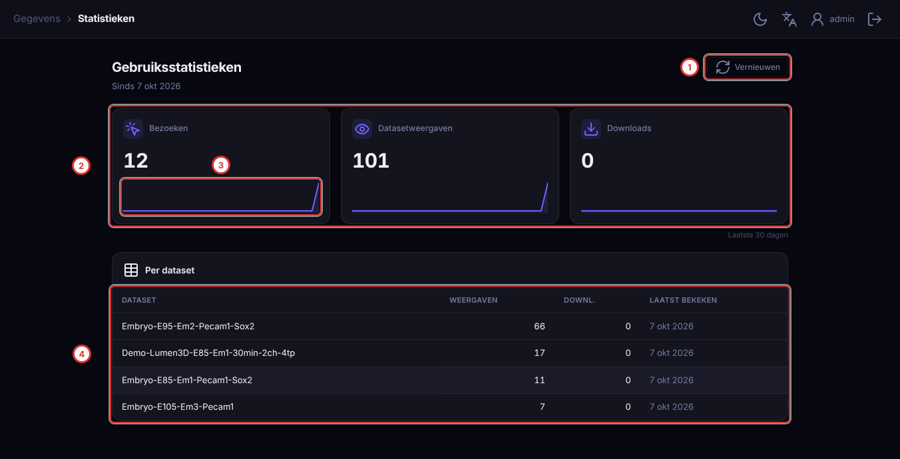{.shot width=88%}

::: legend
| n | wat het is |
|-|----------------------|
| 1 | [Vernieuwen]{.ui}: laadt de cijfers opnieuw. |
| 2 | Drie **tellers**, opgeteld sinds de installatie. |
| 3 | De kleine curve van de **laatste 30 dagen**. |
| 4 | Het detail **per dataset**; klik op een kop (Dataset, Weergaven, Downl.) om te sorteren. |
:::

- **Bezoeken** — keren dat een pagina van de site is geopend.
- **Datasetweergaven** — keren dat een dataset in de viewer is geopend: de meest veelzeggende indicator.
- **Downloads** — bestanden opgehaald via het Download Center.

De tabel “Per dataset” geeft weergaven, downloads en laatste raadpleging. Zonder gegevens: “Nog geen gebruiksgegevens.”. Een soort hernoemen verandert deze cijfers niet.

::: note
**Er worden geen persoonsgegevens verzameld.** Het zijn gewone tellers: geen trackingcookie, geen opgeslagen IP-adres, geen externe dienst. Er verlaat niets de server. De server beperkt bovendien de snelheid van de statistiekbakens.
:::

# 8. Identiteit — de naam en het vocabulaire van de site

::: chapter-intro
- De site **volledig** hernoemen, zonder aan de code te komen.
- Het **woord** voor uw studieobjecten (embryo, monster, orgaan…) wordt **overal** overgenomen.
- Elke tekst bestaat **per taal**: EN, FR, ES, NL.
:::

Hierdoor kan hetzelfde platform een embryologielab of een neurowetenschappelijk instituut dienen. Werkelijke paginatitel: “Identiteit en huisstijl”.

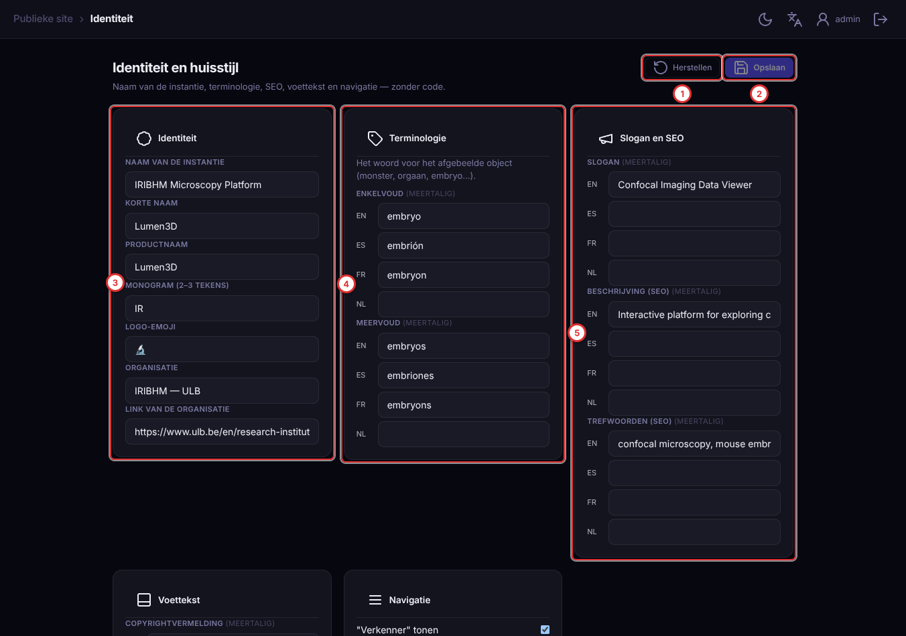{.shot width=88%}

::: legend
| n | wat het is |
|-|----------------------|
| 1 | [Herstellen]{.ui}: keert terug naar de standaardwaarden (“De eigen inhoud gaat verloren.”). |
| 2 | [Opslaan]{.ui}: actief zodra een veld verandert. |
| 3 | Kaart **Identiteit**: de namen van uw site. |
| 4 | Kaart **Terminologie**: het woord voor uw studieobjecten. |
| 5 | Kaart **Slogan en SEO**. |
| 6 | Een **meertalig** veld: een regel per taal. |
:::

## 8.1. De meertalige velden

De velden **(MEERTALIG)** tonen **een regel per beschikbare taal**: `EN`, `FR`, `ES`, `NL`.

::: tip
**Vul altijd minstens `EN` in.** Het is de reserveversie: leest een bezoeker de site in het Nederlands en is `NL` leeg, dan ziet hij de Engelse tekst, nooit een lege plek.
:::

## 8.2. Kaart “Identiteit”

| Veld | Waarvoor | Voorbeeld |
|---|---|---|
| **Naam van de instantie** | De volledige naam, gebruikt in paginatitels | `IRIBHM Microscopy Platform` |
| **Korte naam** | Gebruikt waar de ruimte ontbreekt | `Lumen3D` |
| **Productnaam** | De naam van de software in de teksten | `Lumen3D` |
| **Monogram (2–3 tekens)** | De letters van het logolabel | `IR` |
| **Logo-emoji** | De emoji naast de naam | 🔬 |
| **Organisatie** | Uw lab of instelling | `IRIBHM — ULB` |
| **Link van de organisatie** | Het adres van haar site | `https://…` |

## 8.3. Kaart “Terminologie” — de nuttigste

U legt vast **het woord voor wat u afbeeldt** (“Het woord voor het afgebeelde object (monster, orgaan, embryo…).”), in het **enkelvoud** en het **meervoud**, in elke taal.

Dit woord wordt daarna **automatisch** overgenomen in de hele publieke interface: titels, filters, statistieken, beschrijvingen. Schrijft u `embryo / embryo's`, dan spreekt de site over embryo's; schrijft u `monster / monsters`, dan over monsters. Overal, zonder verdere wijziging. In de Datasets-bewerker heet het veld “Embryo” of “Monster”… naargelang uw keuze.

## 8.4. Kaarten “Slogan en SEO”, “Voettekst” en “Navigatie”

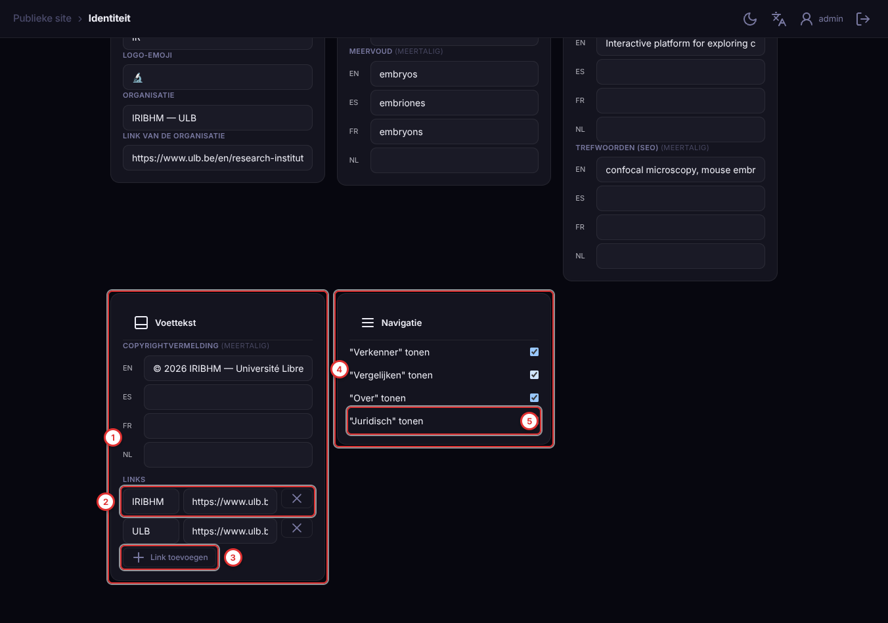{.shot width=88%}

::: legend
| n | wat het is |
|-|----------------------|
| 1 | Kaart **Voettekst**: de copyrightvermelding (per taal). |
| 2 | Een **link** van de voettekst: [Label]{.ui} + adres; het kruisje verwijdert hem. |
| 3 | [Link toevoegen]{.ui}. |
| 4 | Kaart **Navigatie**. |
| 5 | De vakjes die de ingangen van het publieke menu bepalen. |
:::

- **Slogan** — de ondertitel onder de naam van de site.
- **Beschrijving (SEO)** — de samenvatting die Google en sociale netwerken tonen: twee duidelijke zinnen volstaan.
- **Trefwoorden (SEO)** — enkele termen, gescheiden door komma's.
- **Navigatie** — de vakjes ““Verkenner” tonen”, ““Vergelijken” tonen”, ““Over” tonen”, ““Juridisch” tonen”. Uitvinken haalt de ingang uit het menu **zonder de pagina te verwijderen**.

::: warning
**“Juridisch” is standaard uitgevinkt.** Schrijft u uw juridische informatie (hoofdstuk 11), kom dan hier terug om het aan te vinken: anders blijft de pagina onzichtbaar.
:::

::: note
De **eigen pagina's** die u in het tabblad Pagina's maakt, worden bij hun eerste publicatie **vanzelf** aan het menu toegevoegd (hoofdstuk 10): hier hoeft u er niets meer voor aan te vinken.
:::

Herstellen vraagt “Identiteit terugzetten op de standaardwaarden? De eigen inhoud gaat verloren.”. Toasts: “Identiteit opgeslagen.” / “Identiteit hersteld.”. Het opslaan herschrijft **alleen de sleutels van dit tabblad**: een intussen gedane wijziging in Soorten data of Pagina's wordt niet overschreven. <kbd>Ctrl</kbd> + <kbd>S</kbd> slaat op; een waarschuwing verschijnt als u weggaat met wijzigingen.

# 9. Vormgeving — de kleuren van de site

::: chapter-intro
- Kleuren, lettertype en hoeken van de **publieke site**, met **live voorbeeld**.
- Niets wordt toegepast vóór [Opslaan]{.ui}.
- De knoppen blijven **leesbaar**: het contrast wordt voor u berekend.
:::

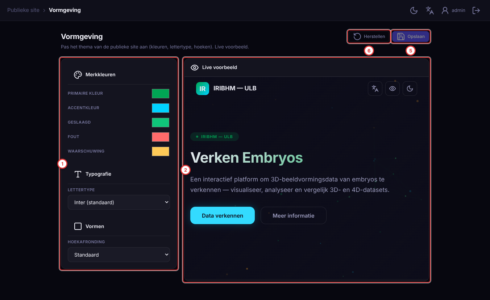{.shot width=88%}

::: legend
| n | wat het is |
|-|----------------------|
| 1 | **Merkkleuren**. |
| 2 | **Typografie**: het lettertype. |
| 3 | **Vormen**: de afronding van de hoeken. |
| 4 | **Live voorbeeld**: nog niet gepubliceerd. |
| 5 | [Opslaan]{.ui}: past het thema toe op de publieke site. |
| 6 | [Herstellen]{.ui}: “Thema terugzetten op de standaardwaarden?”. |
:::

## 9.1. De kleuren

| Kleur | Waar ze voorkomt |
|---|---|
| **Primaire kleur** | De dominante: hoofdknoppen, links, actieve elementen |
| **Accentkleur** | De tweede, voor accenten |
| **Geslaagd** | De bevestigingen (standaard groen) |
| **Fout** | De foutmeldingen (standaard rood) |
| **Waarschuwing** | De waarschuwingen (standaard oranje) |

Klik op een kleurvlak om de kiezer te openen: **het voorbeeld wordt direct bijgewerkt**. De hoofdknoppen worden afgeleid van de kleur van de instantie en respecteren het **WCAG AA**-contrast; het opgeslagen thema wordt toegepast vóór de eerste weergave.

::: tip
Houd Geslaagd / Fout / Waarschuwing **dicht bij groen / rood / oranje**: het zijn universele herkenningspunten.
:::

## 9.2. Typografie en vormen

- **Lettertype** — Inter (standaard), Systeem, Grotesk, Schreef, Afgerond.
- **Hoekafronding** — Standaard, Scherp, Zacht, Rond: van hoekig tot sterk afgerond, op knoppen en kaarten.

## 9.3. Het thema publiceren

Niets wordt op de publieke site toegepast vóór [Opslaan]{.ui} (“Thema opgeslagen.” / “Opslaan van het thema mislukt.”). <kbd>Ctrl</kbd> + <kbd>S</kbd> werkt; het tabblad waarschuwt u als u het verlaat met wijzigingen.

::: warning
**Controleer het contrast.** Een zeer lichte primaire kleur op een lichte achtergrond wordt onleesbaar. Open na het opslaan de publieke site en controleer of alles leesbaar is, in het lichte **én** het donkere thema.
:::

# 10. Pagina's — de visuele editor

::: chapter-intro
- De inhoud van de pagina's van de site wijzigen **zoals in opmaaksoftware**.
- Concept wordt vanzelf opgeslagen; **niets is openbaar vóór [Publiceren]{.ui}**.
- 27 elementen, secties, kolommen, vertaling, variabelen: zonder één regel code te schrijven.
:::

Dit is de rijkste functie van het paneel.

## 10.1. Een pagina kiezen

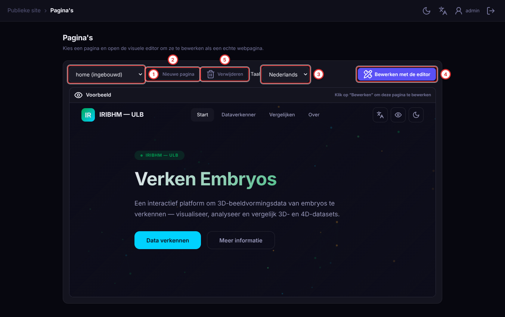{.shot width=88%}

::: legend
| n | wat het is |
|-|----------------------|
| 1 | De te bewerken **pagina**. |
| 2 | [Nieuwe pagina]{.ui}. |
| 3 | De **taal** die u bewerkt. |
| 4 | [Bewerken met de editor]{.ui}: opent de editor op volledig scherm. |
| 5 | [Verwijderen]{.ui}: wist een pagina die u zelf hebt gemaakt. |
:::

Er bestaan twee pagina's van het begin af: **`home`** (de startpagina) en **`about`** (Over). De vermelding *(ingebouwd)* betekent dat ze nog het meegeleverde sjabloon gebruiken: vanaf uw eerste publicatie neemt uw versie het over. Ze kunnen **niet** worden verwijderd (“zet ze terug op standaard” vanuit de editor).

De sjablonen van start en Over bevatten geen kaart “Tracking” of “Wholemount” meer: die categorieën bestaan niet meer.

## 10.2. De editor

De editor opent **in een eigen tabblad** zodat u het hele scherm hebt.

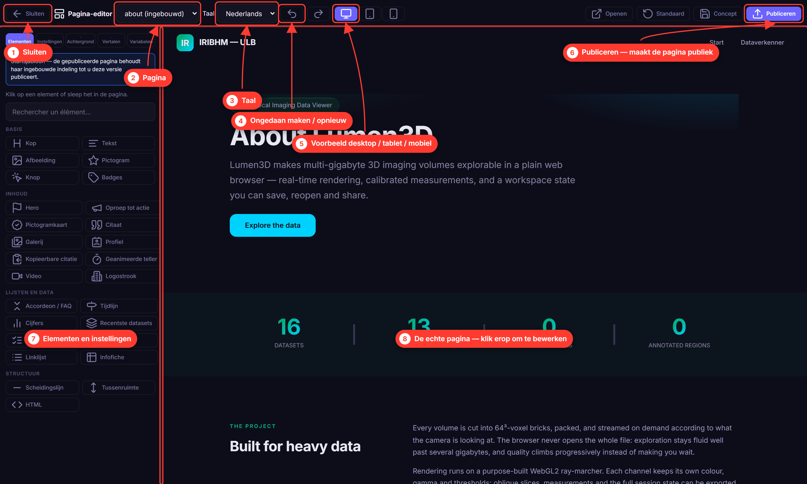{.shot width=88%}

::: legend
| n | wat het is |
|-|----------------------|
| 1 | **Sluiten**: keert terug naar het paneel. |
| 2 | De pagina die u bewerkt. |
| 3 | De bewerkte taal. |
| 4 | **Ongedaan maken / Opnieuw** (<kbd>Ctrl</kbd> + <kbd>Z</kbd> / <kbd>Ctrl</kbd> + <kbd>Y</kbd>). |
| 5 | Voorbeeld **computer / tablet / mobiel**. |
| 6 | **Publiceren**: maakt de versie zichtbaar voor het publiek. |
| 7 | De **zijbalk**: in te voegen elementen, instellingen van de selectie. |
| 8 | **De echte pagina**: haar echte menu, haar echte voettekst, haar echte thema. |
:::

### De bovenbalk

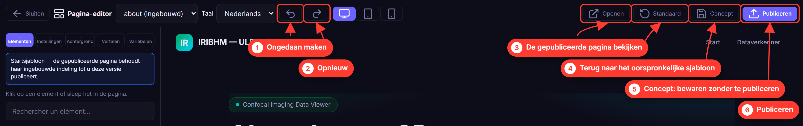{.shot width=88%}

::: legend
| n | wat het is |
|-|----------------------|
| 1 – 2 | **Ongedaan maken** en **Opnieuw**. |
| 3 | **Openen**: toont de gepubliceerde pagina in een nieuw tabblad, om te vergelijken. |
| 4 | **Standaard**: keert terug naar het oorspronkelijke sjabloon. Wist uw opmaak. |
| 5 | **Concept**: slaat op zonder te publiceren. |
| 6 | **Publiceren**: zet uw versie online. |
:::

::: remember
**Concept ≠ Publiceren.** Zolang u niet op [Publiceren]{.ui} hebt geklikt, zien bezoekers de oude versie. U kunt dagenlang werken zonder iets stuk te maken.
:::

### De opslagindicator

De editor slaat **automatisch het concept** op, nooit de gepubliceerde versie. Een label zegt waar u staat:

| Label | Betekenis |
|---|---|
| ● Niet opgeslagen | Er wachten wijzigingen. |
| ✓ Opgeslagen uu:mm | Het concept is bijgewerkt. |
| ⚠ Automatisch opslaan mislukt, klik om opnieuw te proberen | Automatische nieuwe poging, ook zodra het netwerk terug is. |
| 🔒 Open in een ander tabblad, klik om over te nemen | Slot tussen twee bewerkingstabbladen van **dezelfde pagina**. |
| ⚠ Pagina onleesbaar, herlaad voor het bewerken | De inhoud kon niet worden gelezen. |

- De controle terugnemen over een elders geopende pagina vraagt “Deze pagina is open in een ander tabblad. Hier opslaan overschrijft de wijzigingen daar. Doorgaan?”.
- Een opslag vanuit een **verouderd** tabblad wordt **geweigerd** in plaats van een recentere versie te overschrijven.
- Van pagina wisselen slaat eerst de oude op; mislukt dat: “De laatste wijzigingen aan deze pagina konden niet worden opgeslagen. Toch van pagina wisselen?”. Weggaan: “Niet-opgeslagen wijzigingen. Sluiten zonder te publiceren?”.

## 10.3. Een element toevoegen

Het tabblad **Elementen** van de zijbalk bevat alles wat in een pagina kan worden geplaatst.

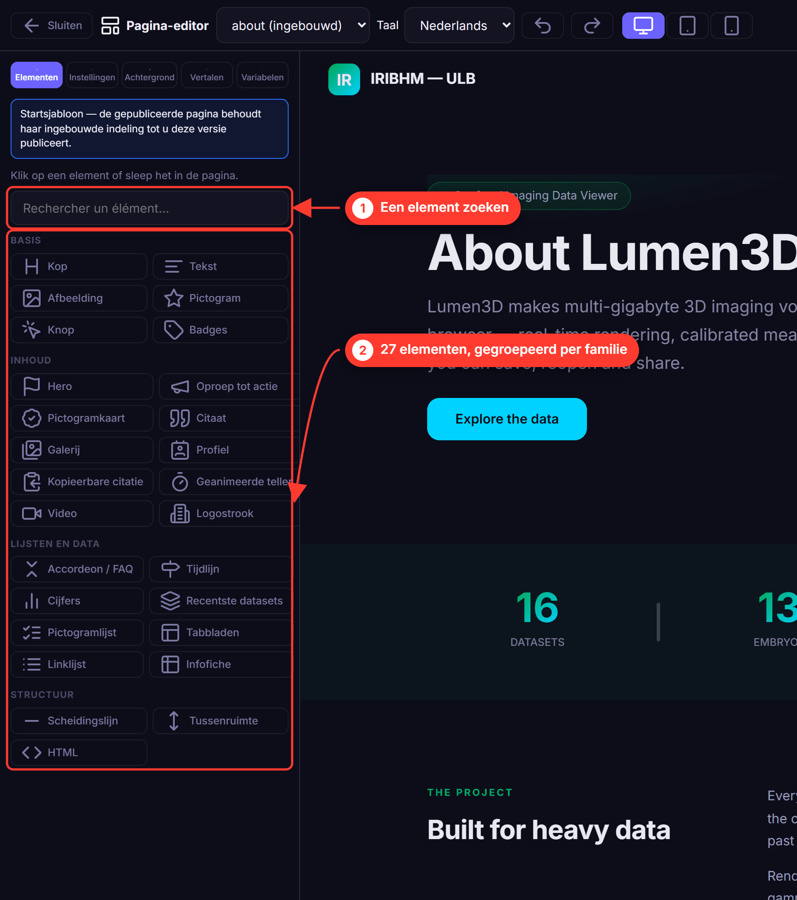{.shot width=50%}

- **Klik** op een element: het wordt aan het einde van de pagina toegevoegd.
- **Sleep het** naar de gewenste plek: er verschijnen neerzetzones.

Het veld **Een element zoeken…** filtert de lijst: er zijn er **27**.

**Basis**

| Element | Wat het is |
|---|---|
| **Kop** | Een sectiekop |
| **Tekst** | Een alinea |
| **Afbeelding** | Een afbeelding |
| **Pictogram** | Een pictogram |
| **Knop** | Een klikbare knop |
| **Badges** | Kleine gekleurde labels |

**Inhoud**

| Element | Wat het is |
|---|---|
| **Hero** | De grote introductiebanner |
| **Oproep tot actie** | Een blok dat uitnodigt om te klikken |
| **Pictogramkaart** | Pictogram + titel + tekst |
| **Citaat** | Een uitgelicht citaat |
| **Galerij** | Meerdere afbeeldingen in een raster |
| **Profiel** | De fiche van een persoon |
| **Kopieerbare citatie** | Een verwijzing met een knop “kopiëren” |
| **Geanimeerde teller** | Een getal dat oploopt |
| **Video** | Een ingebedde video |
| **Logostrook** | Een rij logo's van partners |

**Lijsten en data**

| Element | Wat het is |
|---|---|
| **Accordeon / FAQ** | Vragen die openklappen |
| **Tijdlijn** | Een reeks gedateerde stappen |
| **Cijfers** | Een rij kerncijfers |
| **Recentste datasets** | **Vult zichzelf** met uw recente datasets |
| **Pictogramlijst** | Een lijst met geïllustreerde opsommingstekens |
| **Tabbladen** | Inhoud verdeeld over tabbladen |
| **Linklijst** | Een lijst met links |
| **Infofiche** | Een tabel label / waarde |

**Structuur**

| Element | Wat het is |
|---|---|
| **Scheidingslijn** | Een horizontale lijn |
| **Tussenruimte** | Een instelbare lege ruimte |
| **HTML** | Vrije HTML-code — **voorbehouden aan gevorderde gebruikers** |

::: tip
**De elementen die zichzelf vullen.** *Recentste datasets* en *Cijfers* putten uit de gegevens van de site: aantal datasets, specimens, getrackte cellen. Het getal wordt bijgewerkt wanneer u data toevoegt.
:::

::: note
Het element **HTML** wordt gezuiverd via een **witte lijst**: links, video/audio en tabelranden blijven behouden; scripts, gebeurtenishandlers, SVG en gevaarlijke links worden verwijderd.
:::

## 10.4. Een bestaand element wijzigen

**Klik erop in de pagina**: het krijgt een groene omlijning en de zijbalk schakelt naar zijn instellingen.

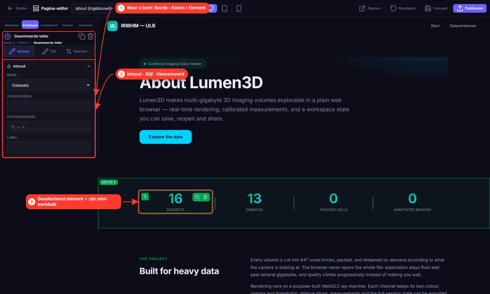{.shot width=88%}

::: legend
| n | wat het is |
|-|----------------------|
| 1 | Het **kruimelpad**: `Sectie 2 › Kolom 1 › Geanimeerde teller`. Elk niveau is klikbaar. |
| 2 | De drie tabbladen met instellingen: **Inhoud**, **Stijl**, **Geavanceerd**. |
:::

### De mini-werkbalken

{.shot width=60%}

**Er is steeds maar één balk zichtbaar**: die van het binnenste niveau onder uw cursor (element, dan kolom, dan sectie).

| Niveau | Knoppen |
|---|---|
| **Element** | ⠿ verplaatsgreep · ⧉ dupliceren · 🗑 verwijderen |
| **Kolom** | ‹ › verplaatsen · ⚙ instellingen · ⧉ · 🗑 |
| **Sectie** | ⌃ ⌄ omhoog / omlaag · ▥ een kolom toevoegen · ⚙ instellingen · ⧉ · 🗑 |

### De drie tabbladen met instellingen

**Inhoud** — wat er staat: teksten, afbeeldingen, links, gegevensbron. **Stijl** — kleuren, groottes, ruimtes, uitlijning, afrondingen. **Geavanceerd** — marges, gedrag bij aanwijzen, **zichtbaarheid per apparaat**, aangepaste CSS.

:::: cols
::: col
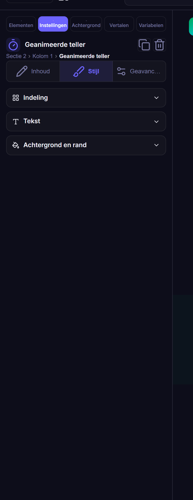{.shot width=88%}
:::
::: col
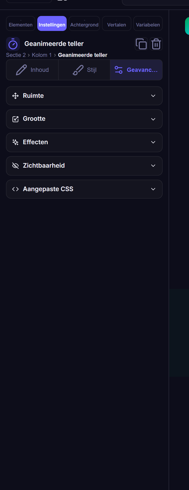{.shot width=88%}
:::
::::

::: tip
Om een tekst sneller te wijzigen, **dubbelklikt** u erop in de pagina en typt. <kbd>Enter</kbd> bevestigt, <kbd>Esc</kbd> annuleert.
:::

### De sneltoetsen

| Sneltoets | Actie |
|---|---|
| <kbd>Ctrl</kbd> + <kbd>Z</kbd> | Ongedaan maken |
| <kbd>Ctrl</kbd> + <kbd>Y</kbd> (of <kbd>Ctrl</kbd> + <kbd>Shift</kbd> + <kbd>Z</kbd>) | Opnieuw |
| <kbd>Ctrl</kbd> + <kbd>S</kbd> | Een concept opslaan |
| <kbd>Ctrl</kbd> + <kbd>D</kbd> | Het geselecteerde element dupliceren |
| <kbd>Ctrl</kbd> + <kbd>C</kbd> / <kbd>V</kbd> | Een element kopiëren / plakken |
| <kbd>Del</kbd> (of <kbd>Backspace</kbd>) | Het element verwijderen |
| <kbd>Esc</kbd> | Selectie opheffen |

Vervang op Mac <kbd>Ctrl</kbd> door <kbd>Cmd</kbd>. De sneltoetsen zijn uitgeschakeld terwijl u in een veld typt.

## 10.5. Secties, kolommen en mobiel

Een pagina is opgebouwd uit drie niveaus: **Sectie** (een strook over de volle breedte) › **Kolom** (een verticale indeling) › **Element**.

Zes kolomindelingen: **1** (volle breedte), **2**, **3**, **4** gelijke kolommen, **⅔ ⅓** en **⅓ ⅔**. Op een telefoon **komen de kolommen vanzelf onder elkaar te staan**.

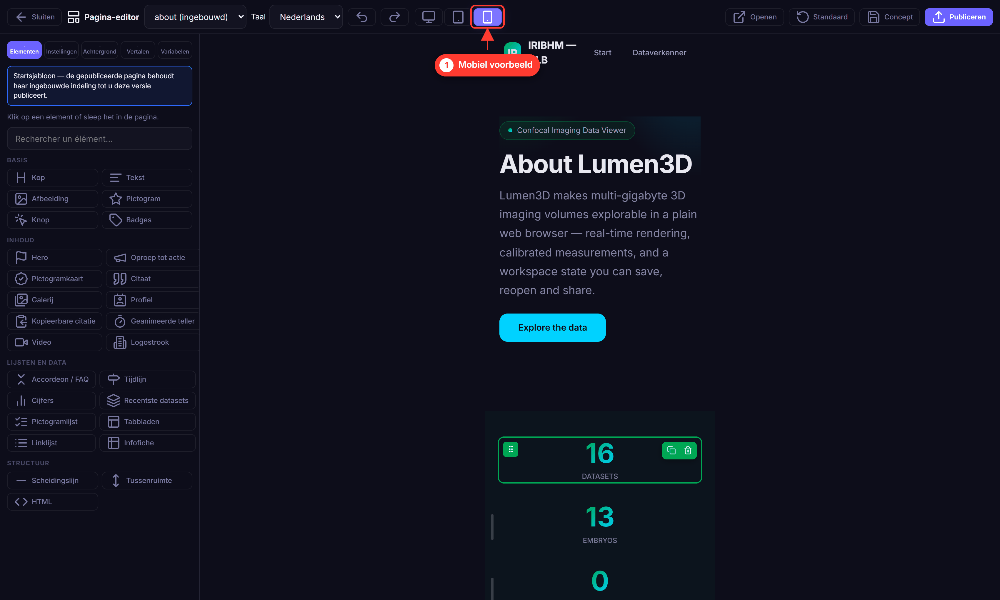{.shot width=70%}

De drie pictogrammen (computer / tablet / mobiel) wijzigen het formaat van het voorbeeld. **Controleer in mobiele weergave vóór u publiceert**: een flink deel van de bezoekers zit op een telefoon.

## 10.6. Geanimeerde achtergrond, vertaling, variabelen

:::: cols3
::: col
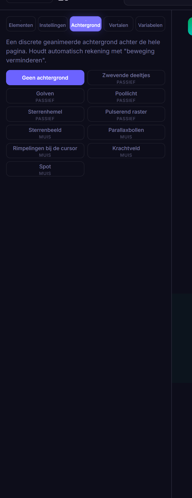{.shot width=88%}

**Achtergrond**: *Geen achtergrond*, *Muis* (reageert op de cursor), *Passief* (loopt vanzelf). Houdt rekening met de voorkeur “beweging verminderen”.
:::
::: col
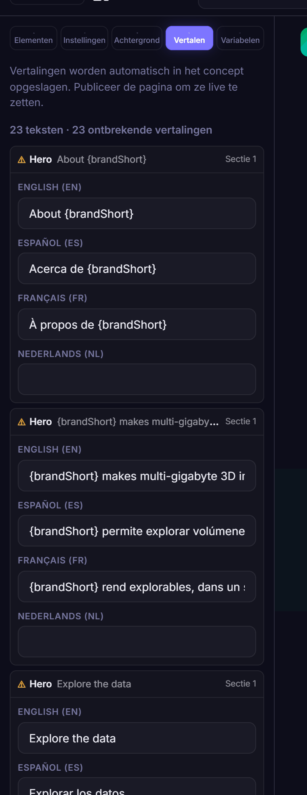{.shot width=88%}

**Vertalen** somt **alle teksten** van de pagina op en geeft aan welke ontbreken (“24 teksten · 7 ontbrekende vertalingen”).
:::
::: col
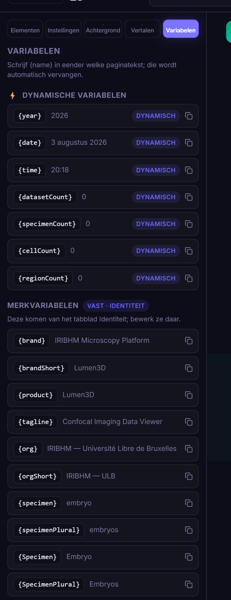{.shot width=88%}

**Variabelen**: een tekst die u **één keer** definieert en overal hergebruikt met `{naam}`.
:::
::::

**Aanbevolen methode om te vertalen**: schrijf de hele pagina in één taal en ga dan naar het tabblad Vertalen om haar in één keer te vertalen.

**De variabelen** — maak er een aan (naam, bijvoorbeeld `contact`; waarde, `microscopy@ulb.be`), schrijf `{contact}` in eender welke tekst, en de waarde verschijnt. De dag dat het adres verandert, corrigeert u het op **één enkele plek**. Regels voor de naam: een letter, dan letters, cijfers of `_`, hoogstens 32 tekens.

Er bestaan al variabelen: `{brand}` (naam van de site), `{specimen}` (uw studieobject), `{org}`, `{year}`, en voor de categorieën `{type3d}`, `{type2d}`, `{typeLive}` (hoofdstuk 6).

## 10.7. Een nieuwe pagina maken

::: steps
1. Klik in het tabblad **Pagina's** op [Nieuwe pagina]{.ui}.
2. Beantwoord de **twee vragen**: “Identificatie van de pagina (letters, cijfers, koppeltekens):” (kleine letters, cijfers, `-`, `_`, 64 tekens) en daarna “Menulabel:”.
3. Bouw de pagina in de editor.
4. Klik op **Publiceren**.
:::

Toast: “Pagina aangemaakt. Ze verschijnt na publicatie in het menu.”. De pagina wordt **verborgen** aan het menu toegevoegd; ze wordt **zichtbaar bij de eerste publicatie**: **er hoeft niets te worden aangevinkt in Identiteit**. Ze staat dan op het adres `https://<uw-site>/page.html?slug=protocollen` (voor de id `protocollen`).

Fouten: “Ongeldige identificatie.”, “Deze pagina bestaat al.”. Verwijderen vraagt “Deze pagina verwijderen?” en wist echt het configuratiebestand.

## 10.8. Aanbevolen werkwijze

::: steps
1. **Bewerken met de editor**, uw wijzigingen aanbrengen.
2. Af en toe een **Concept** (naast het automatisch opslaan).
3. Controleren in het **mobiele voorbeeld**.
4. Het tabblad **Vertalen** aanvullen.
5. **Publiceren**, daarna **Openen** om het resultaat online te controleren.
:::

# 11. Juridisch

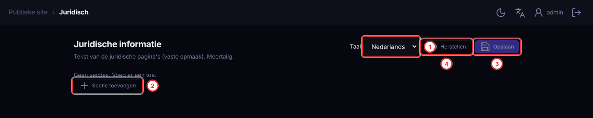{.shot width=88%}

::: legend
| n | wat het is |
|-|----------------------|
| 1 | De keuzelijst **Taal**. |
| 2 | [Sectie toevoegen]{.ui}: een **titel** en een **tekst**. |
| 3 | [Opslaan]{.ui}: publiceert. |
| 4 | [Herstellen]{.ui}. |
:::

Een eenvoudige editor met vaste opmaak voor de juridische tekst. De secties worden getoond in de volgorde waarin u ze maakt; elk heeft een “Titel van de sectie”, een “Tekst…” en een knop [Verwijderen]{.ui}. Zonder sectie: “Geen secties. Voeg er een toe.”. Resultaat: “Juridische informatie opgeslagen.”. <kbd>Ctrl</kbd> + <kbd>S</kbd> slaat op. De titel van het tabblad is “Juridische informatie”.

**Gebruikelijke secties:** uitgever van de site, hoster, intellectueel eigendom, persoonsgegevens, contact.

::: warning
**Twee dingen om niet te vergeten.** (1) De pagina blijft onzichtbaar zolang het vakje ““Juridisch” tonen” niet is aangevinkt in **Identiteit › Navigatie**. (2) De juridische inhoud hangt af van uw land en uw instelling: wend u tot de bevoegde dienst in plaats van een online gevonden sjabloon over te nemen.
:::

# 12. Plug-ins — de functies van de viewer

::: chapter-intro
- Bijna alles wat een bezoeker kan doen, wordt geleverd door een **plug-in**, een kleine zelfstandige module.
- **Standaard mag een plug-in niet draaien**: u geeft toestemming.
- U kunt wat niet nuttig is **verwijderen** en later iets **toevoegen**.
:::

Dit is het technischste hoofdstuk, maar ook dat met de meeste controle. Neem de tijd om §12.1 te lezen: de rest volgt eruit.

## 12.1. Wat is een plug-in, hier?

::: analogy
**Een werkbank en haar gereedschap.** De viewer is een minimale werkbank. Een afstand meten, een opname maken, een histogram instellen, een weergavemodus kiezen: elke functie is **een stuk gereedschap op de werkbank**. U beslist welke erop liggen.
:::

Elke plug-in neemt een van de **drie plaatsen** in:

| Plaats | Waar het voor de bezoeker verschijnt | Voorbeelden |
|---|---|---|
| **Gereedschap** (werkbalk) | De knoppen bovenaan de viewer | Afstandsmeting, schermopname, presentatiemodus |
| **Kanalen** (per kanaal) | De instellingen onder elk fluorescentiekanaal | Histogram, gaussiaans filter |
| **Weergavemodi** (shaders) | Het keuzemenu dat bepaalt hoe het volume wordt getekend | Fluorescence, Natural Fluorescence, Structure (DVR) |

## 12.2. Het scherm

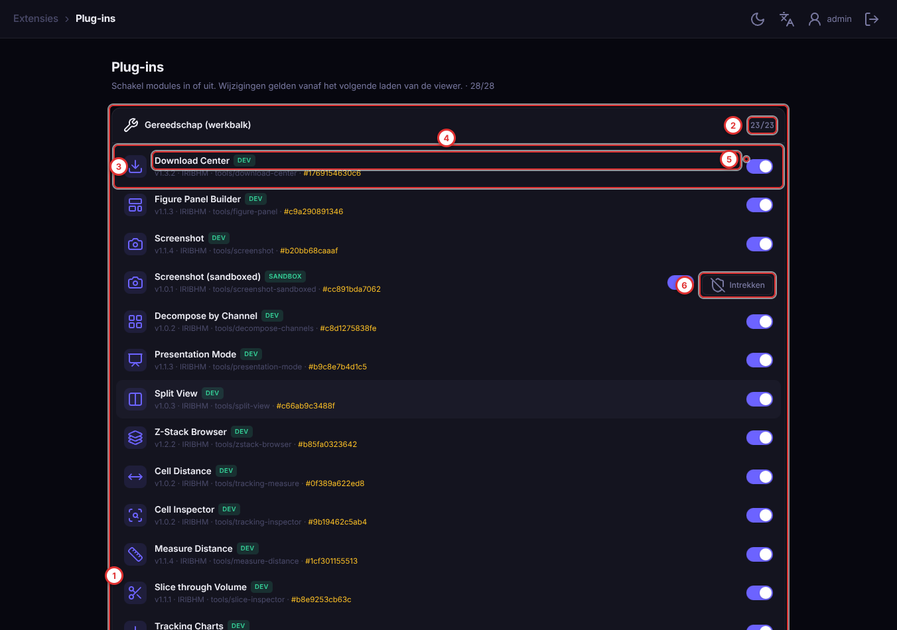{.shot width=88%}

::: legend
| n | wat het is |
|-|----------------------|
| 1 | Een **kaart per plaats** (Gereedschap, Kanalen, Weergavemodi). |
| 2 | De teller `actief / totaal` van de kaart. |
| 3 | Een **regel per plug-in**. |
| 4 | De **naam** en het **vertrouwensniveau**. |
| 5 | De **schakelaar** actief / inactief. |
| 6 | **Intrekken** (bij een plug-in die u hebt goedgekeurd). |
:::

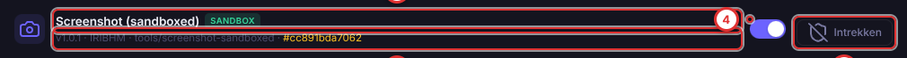{.shot width=88%}

::: legend
| n | wat het is |
|-|----------------------|
| 1 | De **naam** van de plug-in. |
| 2 | Zijn **vertrouwensniveau**. |
| 3 | Versie · auteur · map · **vingerafdruk** van de code. |
| 4 | De schakelaar die **in- of uitschakelt**. |
| 5 | [Intrekken]{.ui}: trekt de toestemming in (§12.5). Afwezig bij een plug-in `ingebouwd`. |
:::

Lege lijst: “Geen plug-ins geïnstalleerd — Plug-ins worden op aanvraag vanuit de catalogus geïnstalleerd.” met een knop [Catalogus openen]{.ui}. Laadt de lijst niet: “Kan de lijst met plug-ins niet laden.” en [Opnieuw proberen]{.ui}.

## 12.3. Een plug-in in- of uitschakelen

Zet de schakelaar om. De wijziging wordt meteen opgeslagen en gaat in **bij de eerstvolgende lading van de viewer**: vraag een bezoeker zijn pagina te herladen, of herlaad het voorbeeld van het tabblad Datasets. Uitschakelen verwijdert niets: u kunt op elk moment weer inschakelen.

::: warning
**De schakelaar is er niet altijd.** Een **niet-vertrouwde** plug-in heeft er geen: hij moet eerst worden goedgekeurd (§12.5). Een **beschermde** plug-in (de laatste actieve weergavemodus) of **niet-compatibele** heeft er een, maar grijs.
:::

::: note
**Eén enkele bescherming**: er moet altijd **minstens één weergavemodus actief** blijven. Probeert u de laatste uit te schakelen: “Er moet minstens één weergavemodus actief blijven.”
:::

## 12.4. De vertrouwensniveaus — waarom ze bestaan

Een plug-in is **echte code** die in de browser van de bezoekers draait. Een kwaadaardige plug-in zou van alles kunnen tonen. Het platform gaat dus uit van het omgekeerde van de gewoonte: **standaard mag een plug-in niet draaien**. Elke plug-in draagt een label:

| Label | Betekenis | Wat het inhoudt |
|---|---|---|
| **`ingebouwd`** | Meegeleverd met de officiële versie van de site, code identiek aan de gepubliceerde | Vertrouwd. Niets te doen. |
| **`goedgekeurd`** | U hebt hem toestemming gegeven om in de pagina te draaien | Vertrouwd omdat **u** het hebt beslist. |
| **`sandbox`** | Toegestaan, maar **opgesloten in een zandbak**: geïsoleerd van de rest van de pagina en van het paneel | De veiligste modus. |
| **`dev`** | Lokale plug-in van een ontwikkelmachine die met de vlag `--dev-trust-local` is gestart | Bestaat niet op een productiesite. Zonder die vlag heeft een kloon **geen enkele** vertrouwde lokale plug-in. |
| **`niet vertrouwd`** | **Geweigerd**: de plug-in wordt helemaal niet geladen | Zie §12.5. |
| **`beschermd`** | De laatste actieve weergavemodus | De schakelaar is grijs. |
| **`niet compatibel`** | Hij vraagt een andere versie van het platform | Grijs; zie hoofdstuk 14. |
| **`update beschikbaar`** | Er bestaat een nieuwere, compatibele versie | Zie §12.6. |

**De vingerafdruk** (de code van het type `#06c7945439b8`, onder elke naam) ondertekent de exacte inhoud van de bestanden. Uw toestemming is **aan precies die vingerafdruk gebonden**: wijzigt iemand één teken van de plug-in, dan verandert de vingerafdruk, vervalt de toestemming en valt de plug-in terug op **niet vertrouwd**. Een goedgekeurde plug-in kan dus niet stiekem worden vervangen.

## 12.5. Een niet-vertrouwde plug-in goedkeuren

U ziet dit geval als iemand een plug-in op de server zet (via FTP) in plaats van via de Catalogus.

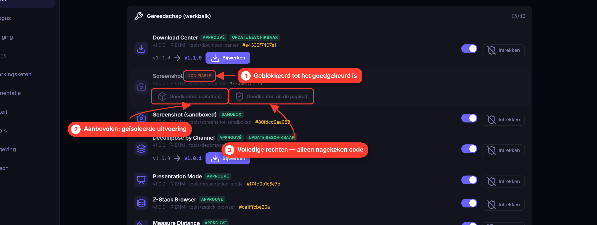{.shot width=88%}

::: legend
| n | wat het is |
|-|----------------------|
| 1 | Het rode label **NIET VERTROUWD**: de plug-in wordt niet geladen. |
| 2 | [Goedkeuren (sandbox)]{.ui}: de plug-in draait geïsoleerd. **Aanbevolen keuze.** |
| 3 | [Goedkeuren (in de pagina)]{.ui}: de plug-in draait met de volledige rechten van de pagina. |
:::

::: steps
1. Klik op een van de twee knoppen.
2. Een venster vat samen wat u goedkeurt: **vingerafdruk** van de code en toegekende **rechten**.
3. Het paneel vraagt u **uw wachtwoord opnieuw te typen**: “Bevestig uw beheerderswachtwoord om goed te keuren:”.
4. “Plug-in goedgekeurd ✓ (herlaad de viewer)”: actief bij de volgende lading.
:::

::: why
**Waarom het wachtwoord opnieuw vragen?** Goedkeuren is de enige actie die externe code laat draaien. Zelfs als iemand voor uw geopende scherm zou gaan zitten, kan hij zonder uw wachtwoord niets goedkeuren.
:::

::: warning
**“In de pagina” in plaats van “sandbox”?** Bijna nooit, behalve als u de code hebt gelezen of ze van een vertrouwd persoon komt. Plug-ins voor **kanalen** en **weergavemodi** kunnen technisch niet in een zandbak draaien: ze praten rechtstreeks met de grafische kaart.
:::

Berichten: “Onjuist wachtwoord.”, “De inhoud van de plug-in is gewijzigd — herlaad de lijst en controleer opnieuw.” (de vingerafdruk is intussen veranderd), “Goedkeuring ingetrokken ✓” na [Intrekken]{.ui}.

## 12.6. Een plug-in bijwerken

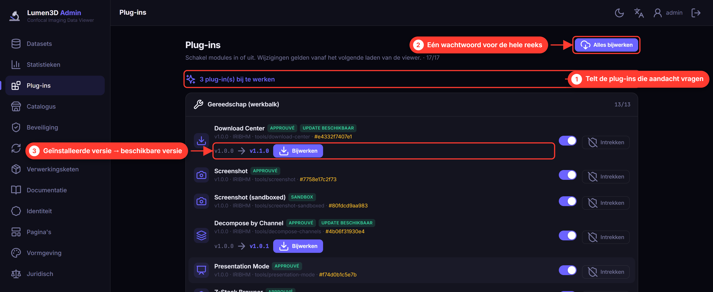{.shot width=88%}

::: legend
| n | wat het is |
|-|----------------------|
| 1 | De **banner** telt de betrokken plug-ins. |
| 2 | [Alles bijwerken]{.ui}: vanaf twee plug-ins; **één wachtwoord** voor de reeks. |
| 3 | De regel: label **update beschikbaar**, traject `v1.0.0 → v1.1.0`, knop. |
:::

De knop verschijnt alleen als **er een nieuwere versie bestaat EN die zich compatibel verklaart** met uw platform. Anders wordt de reden getoond: werk eerst het platform bij (hoofdstuk 14).

Het exemplaar dat werkt, wordt **opzij gezet, niet verwijderd**: mislukt er daarna iets, dan wordt het teruggezet. Dezelfde actie bestaat in de **Catalogus** en in **Updates**: de drie tabbladen lezen dezelfde bron.

## 12.7. In een paneel, een gesplitste weergave, het voorbeeld

Een plug-in moet verklaren dat hij **van buitenaf kan worden aangestuurd** om te worden geladen wanneer de pagina **ingebed** is: voorbeeld van het tabblad Datasets, panelen van de pagina *Vergelijken*, vlakken van de gesplitste weergave. Anders wordt hij alleen op de volledige pagina geladen.

De plug-ins **“alleen pagina”** — Presentation Mode, Download Center, Decompose by Channel, Screenshot, Chunk Debug, Split View, Figure Panel Builder, Tracking Charts, Cell Distance — verschijnen dus niet in het voorbeeld. **Dit is geen bug.**

Een plug-in kan ook **beperkt zijn tot bepaalde soorten** data: de vijf 2D-plug-ins worden alleen op een foto geladen; de vijf trackingplug-ins alleen op een Live-dataset die tracking heeft.

## 12.8. De 28 plug-ins van de catalogus

Deze plug-ins worden **niet** met de site meegeleverd: ze worden op aanvraag geïnstalleerd (wizard voor de eerste installatie, stap 5, of tabblad Catalogus). Een nieuwe installatie waarbij alles is uitgevinkt, zou er geen hebben.

**Weergavemodi**

| Plug-in | Wat het voor de bezoeker doet |
|---|---|
| **Fluorescence** | De standaardweergave: elk kanaal geeft zijn kleur af, zoals in een fluorescentiemicroscoop |
| **Natural Fluorescence** | Elk fluorofoor gloeit in zijn kleur; dichte structuren verbergen wat erachter ligt |
| **Structure (DVR)** | Volumeweergave met diepte en schaduw, die vormen laat uitkomen |

**Kanalen**

| Plug-in | Wat het doet |
|---|---|
| **Histogram Controls** | Het intensiteitshistogram en de schuifregelaars min / max / gamma |
| **Gaussian Filter** | Een vervagingsschuifregelaar om de ruis van een kanaal glad te strijken |

**Gereedschap (volumes en tijdreeksen)**

| Plug-in | Wat het doet |
|---|---|
| **Measure Distance** | Twee punten aanklikken voor de werkelijke afstand in µm |
| **Slice through Volume** | Een richtbare vlakke snede door het volume |
| **Z-Stack Browser** | Door de doorsneden bladeren: geanimeerde vlakke opening, 3D-inkeping, bijsnijden boven / onder, instelbare dikteband, schuifregelaar “Rotatie” |
| **Decompose by Channel** | De kanalen naast elkaar tonen |
| **Download Center** | Bestanden, metingen, metadata, exports ophalen |
| **Screenshot** | De 3D-weergave als PNG vastleggen |
| **Screenshot (sandboxed)** | Dezelfde opname, in een zandbak: het voorbeeld van een geïsoleerde plug-in |
| **Presentation Mode** | Volledig scherm zonder interface, om te projecteren |
| **Orientation Axes** | Het rood / groen / blauw 1-2-referentiekader, hernoembaar (§3.8) |
| **Toggle Grid**, **Toggle Axes**, **Hide / Show 3D Volume** | Het raster, de assen, het volume tonen of verbergen |
| **Chunk Debug** | Technische diagnose. **In productie zonder risico uit te schakelen** |

**Gereedschap voor 2D-foto's**

| Plug-in | Wat het doet |
|---|---|
| **Calibrated Grid** | Een in µm of mm gekalibreerd raster op de foto |
| **Display Adjustments** | Helderheid, contrast, gamma (alleen weergave) |
| **Orientation 2D** | Rotatie en spiegeling van de foto |
| **Split View** | Twee weergaven naast elkaar |
| **Figure Panel Builder** | Meerdere foto's tot één figuur samenstellen met een gemeenschappelijke schaal |

**Gereedschap voor celtracking (Live-reeksen met tracking)**

| Plug-in | Wat het doet |
|---|---|
| **Tracking Trails** | De trajecten op het volume |
| **Tracking Surface** | Het oppervlak van het embryo in het volume |
| **Cell Inspector** | Metrieken, afstamming, buren van een cel |
| **Tracking Charts** | Grafieken van populatie, snelheid, mitosen |
| **Cell Distance** | Afstanden tussen cellen |

::: note
**Slice through Volume** en **Z-Stack Browser** sluiten elkaar **uit**: de een openen sluit de ander.
:::

# 13. Catalogus — nieuwe plug-ins installeren

::: chapter-intro
- De Catalogus werkt als een **appwinkel**: officiële, ondertekende plug-ins.
- Installeren = een klik + uw **wachtwoord**; de plug-in wordt geverifieerd, geïnstalleerd en **goedgekeurd**.
- Een installatie wordt **afgebroken** bij het minste verschil met wat de catalogus aankondigt.
:::

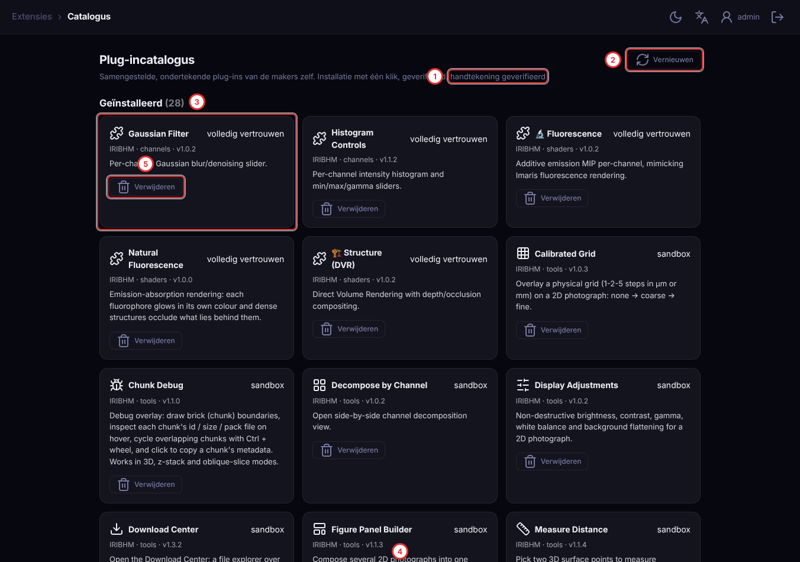{.shot width=88%}

::: legend
| n | wat het is |
|-|----------------------|
| 1 | **Handtekening geverifieerd**: de catalogus is geauthenticeerd. |
| 2 | [Vernieuwen]{.ui}. |
| 3 | Een **plug-inkaart** (naam, plaats, versie, beschrijving). |
| 4 | De gevraagde **rechten**. |
| 5 | [Verwijderen]{.ui}. |
:::

De plug-ins zijn verdeeld in secties: **Bij te werken** (eerst, indien aanwezig), **Geïnstalleerd**, **Beschikbaar**, eventueel **Niet compatibel**.

## 13.1. Een plug-in installeren

::: steps
1. Zoek de kaart van de plug-in in **Beschikbaar**.
2. Klik op [Installeren]{.ui}.
3. “Deze plug-in installeren? Bevestig met uw beheerderswachtwoord:”.
4. “Bezig met installeren (downloaden + verifiëren)…” en daarna “Plug-in geïnstalleerd en goedgekeurd ✓”.
:::

De server controleert of het bestand **tot op de bit** overeenkomt met wat de catalogus aankondigt. Bij het minste verschil wordt de installatie **afgebroken** (“Installatie mislukt (verificatie mislukt).”). Andere berichten: “Verkeerd wachtwoord.”, “Al geïnstalleerd.”.

Bovenaan de pagina staat **“handtekening geverifieerd”** (catalogus geauthenticeerd) of **“niet ondertekend”** (geen sleutel geconfigureerd: alleen de sha256-vingerafdruk wordt gecontroleerd).

::: why
**Oudere catalogus geweigerd (tegen terugdraaien).** Elke ondertekende catalogus draagt een **oplopend serienummer**. De server weigert een catalogus die ouder is dan een reeds aanvaarde: “Catalogus geweigerd: ouder (nr. …) dan een catalogus die deze server al aanvaardde (nr. …). Hij kan sindsdien gecorrigeerde pluginversies opnieuw installeren.”. Er is aan uw kant **niets te doen**, en dit bericht is niet te omzeilen.
:::

## 13.2. Bijwerken, verwijderen

Een geïnstalleerde plug-in waarvoor een nieuwere **én** compatibele versie bestaat, komt in **Bij te werken**: zijn kaart toont `v1.0.0 → v1.1.0` en een knop [Bijwerken]{.ui} naast [Verwijderen]{.ui} (kijk op welke u klikt). [Alles bijwerken]{.ui} verwerkt de reeks met één wachtwoord.

[Verwijderen]{.ui} vraagt “Deze plug-in verwijderen?” en daarna “Plug-in verwijderd.”; de bestanden worden van de server gehaald en u kunt daarna opnieuw installeren. **Eén enkele weigering**: de **laatste weergavemodus** (“Niet mogelijk: laatste weergavemodus.”).

## 13.3. De labels op de kaarten

| Label | Betekenis |
|---|---|
| **`sandbox`** | “Draait geïsoleerd (sandbox)”: dat is het geval bij de plug-ins van de werkbalk. |
| **`volledig vertrouwen`** | “Volledig vertrouwen in de pagina (shaders/kanalen)”: onvermijdelijk voor weergavemodi en kanaalinstellingen, die de grafische kaart aansturen. |
| **`update beschikbaar`** | Er bestaat een nieuwere, compatibele versie. |
| **`niet compatibel`** | Verschijnt alleen bij een **niet-geïnstalleerde** plug-in: hij vraagt een andere versie van het platform. De installatieknop is grijs: werk het platform bij (hoofdstuk 14). |

::: note
Een **al geïnstalleerde** plug-in draagt nooit het label `niet compatibel`: die bij u draait, werkt; alleen zijn volgende versie kan wachten. Een pakket dat een soort data declareert, vereist een **recent** platform (1.51 tot 1.53): een niet-bijgewerkte site ziet “niet compatibel” bij de recente plug-ins.
:::

Toestanden van de catalogus: “Catalogus niet beschikbaar: …”, “Catalogus onbereikbaar.”, “Geen plug-ins in de catalogus.”, “Geen catalogusbron ingesteld…”.

# 14. Updates — de site laten meegroeien

::: chapter-intro
- Dit tabblad werkt **de software** bij: het platform, de plug-ins, en meldt het **pakket van de verwerkingsketen**.
- Vóór de installatie zegt een **controlerapport** wat er geraakt wordt.
- Een versie die niet start, wordt **automatisch vervangen** door de oude.
:::

::: warning
**Verwar het niet** met het tabblad [Data-updates]{.ui} (hoofdstuk 5), dat het **formaat** van uw datasets op niveau brengt.
:::

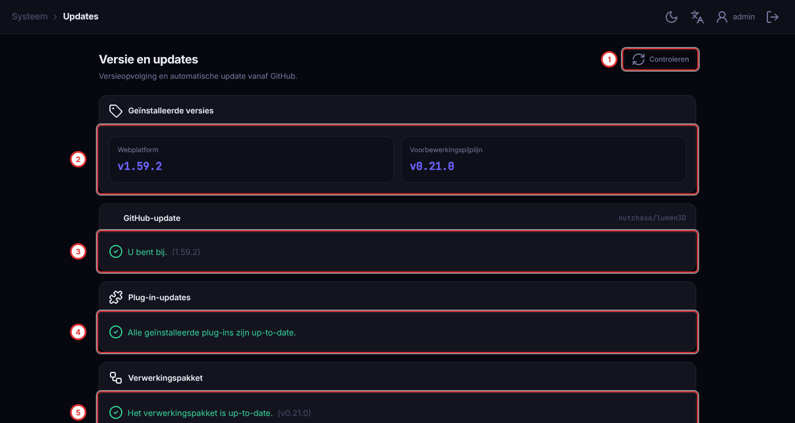{.shot width=88%}

::: legend
| n | wat het is |
|-|----------------------|
| 1 | [Controleren]{.ui}: start de drie controles opnieuw. |
| 2 | **Geïnstalleerde versies**: Webplatform en Voorbewerkingspijplijn. |
| 3 | **GitHub-update**: “U bent bij.” of “Update beschikbaar: vX”. |
| 4 | **Plug-in-updates**. |
| 5 | **Verwerkingspakket**: is het pakket van de verwerkingsketen up-to-date? |
:::

Er worden twee versienummers getoond, twee onafhankelijke onderdelen: **Webplatform** (de site: **dat telt**) en **Voorbewerkingspijplijn** (het hulpmiddel uit hoofdstuk 15, dat zijn eigen tempo volgt). Een onbekende waarde wordt niet getoond.

## 14.1. Een update van het platform starten

Als er een nieuwe versie bestaat, worden de **versienotities** getoond. Lees ze: ze beschrijven wat er verandert.

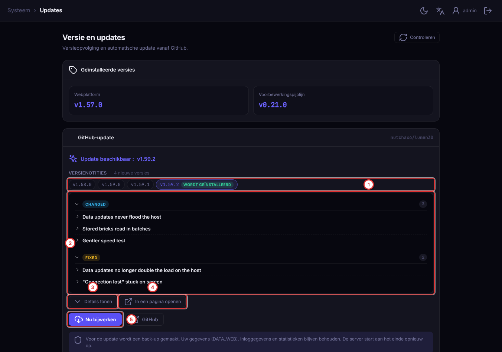{.shot width=88%}

::: legend
| n | wat het is |
|-|----------------------|
| 1 | Een **label per versie** die de update brengt; de laatste is gemarkeerd “wordt geïnstalleerd”. |
| 2 | De notities van de gekozen versie, als **inklapbare boom** (ADDED, OPTIMIZED, FIXED, CHANGED). |
| 3 | [Details tonen]{.ui} / [Alleen de titels]{.ui}. |
| 4 | [In een pagina openen]{.ui}: de pagina *Release notes* (§14.3). |
| 5 | [Nu bijwerken]{.ui}. |
:::

Heeft uw site **meerdere versies overgeslagen**, dan heeft elke zijn label (“4 nieuwe versies”): u leest wat **elke** versie brengt, niet alleen de laatste. De notities zijn sinds 1.55.0 in het **Engels** (de oudste zijn in het Frans).

::: steps
1. Klik op [Nu bijwerken]{.ui}.
2. Het **controlerapport** verschijnt (hieronder).
3. Klik op [Update bevestigen]{.ui}.
4. Laat het gebeuren: een stappenbalk loopt door.
:::

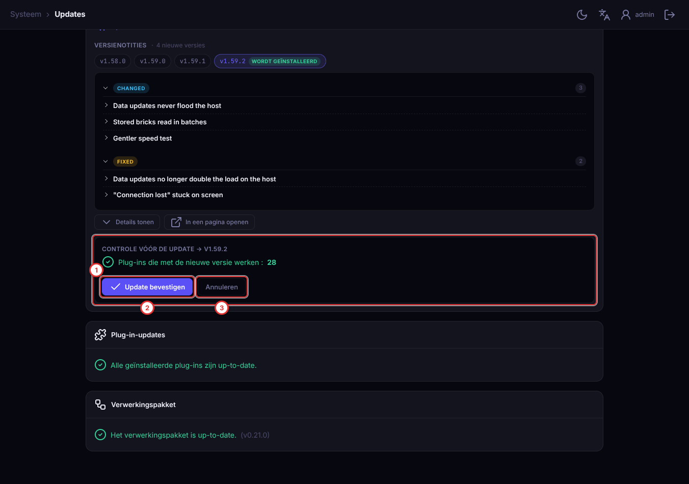{.shot width=88%}

::: legend
| n | wat het is |
|-|----------------------|
| 1 | Het **rapport**: plug-ins die met de nieuwe versie werken, plug-ins in quarantaine, eventuele blokkade. |
| 2 | [Update bevestigen]{.ui}: verschijnt niet als er iets **blokkeert**. |
| 3 | [Annuleren]{.ui}. |
:::

Het rapport vermeldt, **voordat** er iets is geïnstalleerd: hoeveel plug-ins compatibel blijven; welke **in quarantaine** gaan omdat ze nog niet met de nieuwe versie werken (ze worden niet verwijderd en **worden vanzelf weer ingeschakeld** zodra een update ze compatibel maakt); of er iets blokkeert.

De stappen die voorbijkomen: **Controles → Back-up → Downloaden → Integriteit → Voorbereiding → Opstartcontrole → Omschakelplan → Omschakelen → Server opnieuw opstarten**. De server herstart: **log opnieuw in**. Het succes wordt pas gemeld wanneer de **nieuwe versie echt antwoordt**.

## 14.2. De beveiligingen

- **Een volledige back-up** wordt vooraf gemaakt.
- **Het gedownloade bestand wordt gecontroleerd**, en dat is **verplicht**: alleen het archief dat naar de versie is genoemd en in de ondertekende `SHA256SUMS` staat (Ed25519-handtekening, vastgezette sleutel) wordt toegepast. Nooit de “source”-zip van GitHub. Anders: “Deze release kan niet worden geverifieerd (geen controlesom voor het archief) en is niet toegepast.” met de reden.
- **De nieuwe versie wordt getest voordat ze in gebruik wordt genomen.** Start ze niet: “De nieuwe versie startte niet — automatisch teruggezet.”: de site werkt nog steeds, er valt niets te herstellen.
- **Uw data blijven behouden**: `DATA_WEB`, inloggegevens, statistieken, instellingen van Identiteit / Pagina's / Vormgeving. Het opnieuw verwerken van datasets is niet nodig.
- **Elke gepubliceerde versie is door de hele testreeks gegaan** voordat ze werd gebouwd.

::: tech
De **eerste** update naar een versie ≥ 1.57 wordt alleen met een controlesom geverifieerd (de ondertekeningssleutel zat nog niet in de oude versie); de volgende controleren de handtekening. De `.htaccess`-regels **buiten** het blok `# BEGIN LUMEN3D` / `# END LUMEN3D` overleven de updates; de update naar 1.57 vervangt **eenmalig** de `.htaccess` in de hoofdmap (typ dan een eventuele regel van de hoster opnieuw in, zoals `AddHandler`).
:::

| Bericht | Wat het betekent |
|---|---|
| U bent bij | Niets te doen. |
| Limiet van de GitHub-API bereikt | Te veel controles in korte tijd; probeer over enkele minuten opnieuw. |
| Kan GitHub niet bereiken | Netwerkprobleem aan serverzijde; probeer later opnieuw. |
| Nog geen versie gepubliceerd op GitHub | Er is nog geen versie gepubliceerd. |
| De certificaatopslag van PHP op deze host is onbruikbaar | Melden aan de persoon die de server beheert (bestand `cacert.pem` te uploaden). |
| Update met succes voltooid. De server is opnieuw opgestart — log opnieuw in. | Succes; [Begrepen]{.ui} sluit de kaart “Laatste update”. |
| De nieuwe versie startte niet — automatisch teruggezet. | De site is teruggekeerd naar de oude versie; er valt niets te herstellen. |
| De server antwoordt niet. Bekijk logs/update-pivot-*.log. | Herlaad; melden als het blijft duren. |

## 14.3. De pagina “Release notes”

De knop [In een pagina openen]{.ui} opent in een nieuw tabblad `admpan.html?changelog=1`: een pagina **zonder menu**, om op uw gemak te lezen.

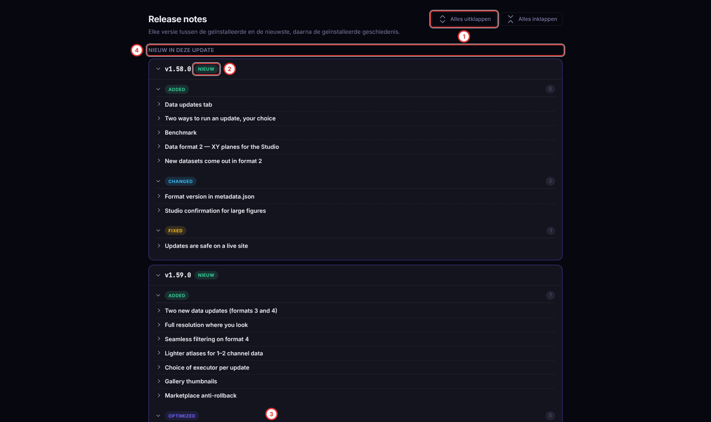{.shot width=88%}

::: legend
| n | wat het is |
|-|----------------------|
| 1 | [Alles uitklappen]{.ui} (en [Alles inklappen]{.ui}). |
| 2 | Het label **nieuw**: een komende versie. |
| 3 | Het label **wordt geïnstalleerd**: de nieuwste. |
| 4 | De groep “Nieuw in deze update”. |
:::

Bent u bij: “Niets te installeren: u bent up-to-date.”. Elke versie, elke sectie en elk item klapt apart in. Tijdens het laden: “Release notes laden…”; bij mislukking: “Release notes niet beschikbaar.”.

## 14.4. De plug-ins bijwerken

Een kaart **Plug-in-updates** beantwoordt dezelfde vraag voor de modules: “{n} plug-in(s) bij te werken”, met [Alles bijwerken]{.ui} (één wachtwoord). Een plug-in waarvan de nieuwe versie een recenter platform vereist, staat in een tweede lijst, **“Updates die op het platform wachten”**, met de reden: hij wordt niet weggemoffeld.

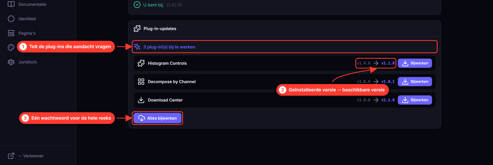{.shot width=88%}

::: legend
| n | wat het is |
|-|----------------------|
| 1 | Het **aantal** te verwerken plug-ins. |
| 2 | Per plug-in: de geïnstalleerde versie en de versie waarnaar zou worden gegaan. |
| 3 | [Alles bijwerken]{.ui}: één wachtwoord voor de reeks. |
:::

## 14.5. Het verwerkingspakket

De kaart **Verwerkingspakket** vergelijkt het pakket van de verwerkingsketen dat **hier is geïnstalleerd** met dat bij de **laatste GitHub-release**. Toestanden: “Het verwerkingspakket is up-to-date. (v0.21.0)” of “Nieuw verwerkingspakket: vX (hier: vY)” met [Het pakket downloaden]{.ui}.

Het wordt **op het verwerkingswerkstation geïnstalleerd, niet op deze server**: download het en vervang de map die daar wordt gebruikt. **Het platform hoeft niet te worden bijgewerkt** om een nieuwer pakket te krijgen. Is GitHub onbereikbaar: “GitHub kon niet worden bereikt om het verwerkingspakket te controleren.”.

# 15. Verwerkingsketen — nieuwe data voorbereiden

::: chapter-intro
- Dit tabblad verwerkt **niets** op de server: u **downloadt een pakket**.
- Het pakket draait op een **krachtige computer**, meestal het analysewerkstation.
- De geproduceerde map stuurt u daarna via het tabblad **Importeren**.
:::

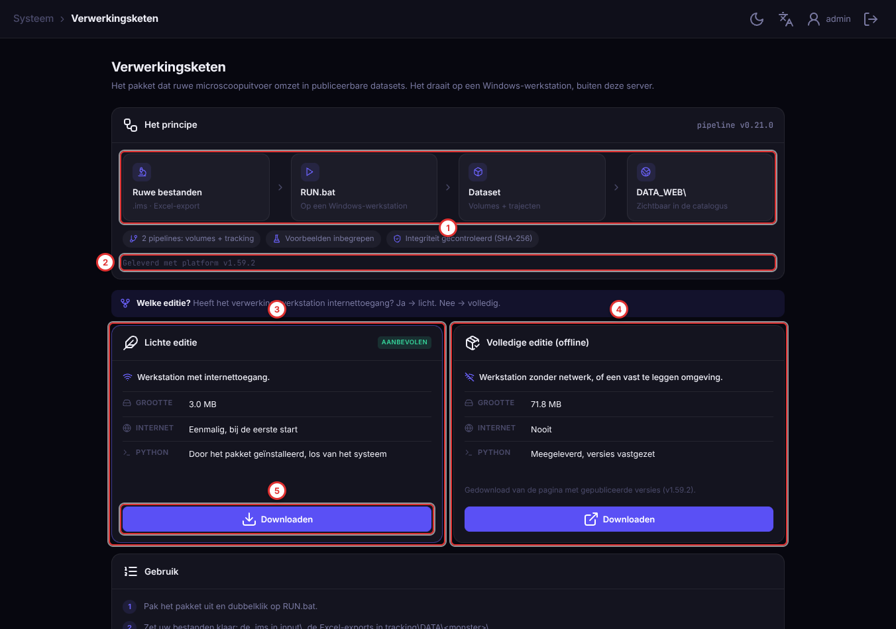{.shot width=88%}

::: legend
| n | wat het is |
|-|----------------------|
| 1 | Het **traject van de data** in vier stappen. |
| 2 | “Geleverd met platform vX”: de versie van het pakket die met deze site wordt meegeleverd. |
| 3 | **Lichte editie** (aanbevolen). |
| 4 | **Volledige editie** (offline). |
| 5 | [Downloaden]{.ui}. |
:::

**Waarom scheiden?** Een volume converteren vraagt enorm veel werkgeheugen: reken op ongeveer **32 GB RAM** voor een volume van 3789 × 3789 × 178. Geen enkele gedeelde webserver kan dat.

## 15.1. Het principe

| Stap | Wat het is |
|---|---|
| **Ruwe bestanden** | Wat uit de microscoop komt: `.ims` voor volumes, Excel-export voor tracking, `.tif` voor foto's |
| **`RUN.bat`** | De starter, op een Windows-werkstation |
| **Dataset** | Wat het pakket produceert: opgedeelde volumes, foto, trajecten |
| **`DATA_WEB\`** | De map van de server: de dataset verschijnt meteen in de catalogus |

Het pakket bevat **twee pipelines** (volumes met tracking, trackinganalyse), de **import van 2D-foto's**, voorbeeldinvoer (meteen bruikbaar om te oefenen) en een starter die **zijn eigen integriteit controleert** (SHA-256).

::: note
**Twee nummers, en dat is normaal.** De kop toont `pipeline v0.21.0`: de versie **van het pakket**, niet die van de site. De pipeline 0.21.0 schrijft **rechtstreeks formaat 4** (geen data-update nodig op zijn uitvoer), **behoudt de curatie** die in het paneel is gedaan wanneer een dataset opnieuw wordt verwerkt (verborgen, naam, oriëntatie…) en **publiceert alles of niets**.
:::

Wanneer een nieuwere versie van het pakket wordt gepubliceerd, verschijnt bovenaan een **banner**: “Nieuwe versie van het pakket: v… — Deze server biedt v… aan. Download hieronder de nieuwe versie; het platform zelf hoeft hiervoor niet te worden bijgewerkt.” met [Download v…]{.ui}; voor de lichte editie houdt [Geïnstalleerde versie]{.ui} het pakket van de server bereikbaar.

## 15.2. Welke editie kiezen

Eén vraag: **heeft het verwerkingswerkstation internettoegang?**

| | **Lichte editie** *(aanbevolen)* | **Volledige editie** *(offline)* |
|---|---|---|
| Voor wie | Werkstation met internet | Werkstation zonder netwerk, of een vast te leggen omgeving |
| Grootte | ~3 MB | ~70 MB (≈ 200 MB uitgepakt) |
| Internet | **eenmalig**, bij de eerste start | **nooit** |
| Python | door het pakket geïnstalleerd, los van het systeem | meegeleverd, versies vastgezet |

De lichte editie wijzigt **nooit** de Python die al op het werkstation staat.

::: warning
De volledige editie is bij de op GitHub gepubliceerde versie gevoegd, niet bij de site. Is ze niet beschikbaar, dan meldt het paneel dat (“Deze editie is niet bijgevoegd bij de laatst gepubliceerde versie. Gebruik de lichte editie…”) en blijft de lichte editie te downloaden.
:::

## 15.3. Hoe u het gebruikt

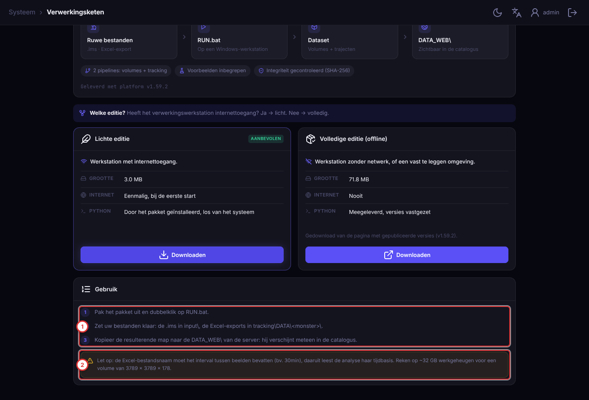{.shot width=88%}

::: legend
| n | wat het is |
|-|----------------------|
| 1 | De drie stappen van het **gebruik**. |
| 2 | De waarschuwing: de naam van het Excel-bestand moet het interval tussen beelden bevatten. |
:::

::: steps
1. Pak het archief uit op het verwerkingswerkstation en dubbelklik op **`RUN.bat`**.
2. Zet de `.ims` in `input\` en de Excel-exports in `tracking\DATA\<monster>\`.
3. Kopieer de geproduceerde map naar de `DATA_WEB\` van de server, **of sleep haar, zonder FTP-toegang, naar het tabblad Importeren** (hoofdstuk 4). Ze verschijnt meteen in de catalogus.
:::

::: warning
**De naam van het Excel-bestand moet het interval tussen beelden bevatten** (bijvoorbeeld `30min`): de analyse leest daaruit haar tijdbasis.
:::

Het menu van de starter biedt: **[1]** Preprocessing van Imaris-volumes (`.ims` → `output\`, tracking inbegrepen); **[2]** Imaris-trackinganalyse (Excel → `tracking\OUTPUT\`); **[3]** Import van 2D-foto's (`.tif` → `output\2d\`); **[4]** Een tracking aan een reeds verwerkte dataset koppelen; **[5]** Alleen de omgeving controleren; **[0]** Afsluiten.

::: see
Het detail van wat elke stap doet (ruisverwijdering, piramide, bricks, tracking) staat in de **volledige documentatie**, hoofdstukken 4 tot 8.
:::

# 16. Beveiliging — wachtwoord en rechten

::: chapter-intro
- Het wachtwoord wijzigen vraagt het **oude**.
- Een wijziging **logt al uw andere sessies uit**.
- Het wachtwoord wordt **nooit** leesbaar opgeslagen.
:::

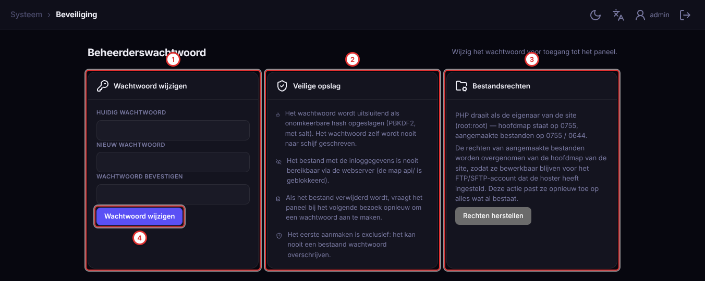{.shot width=88%}

::: legend
| n | wat het is |
|-|----------------------|
| 1 | **Wachtwoord wijzigen**: huidig, nieuw, bevestiging. |
| 2 | **Veilige opslag**: hoe het wordt bewaard. |
| 3 | **Bestandsrechten**: de status, en [Rechten herstellen]{.ui}. |
| 4 | [Wachtwoord wijzigen]{.ui}. |
:::

## 16.1. Het wachtwoord wijzigen

Vul de drie velden in en klik op [Wachtwoord wijzigen]{.ui}. U moet het oude kennen: zo kan iemand die uw geopende sessie vindt u niet buitensluiten.

- **Minstens 8 tekens** (“Wachtwoord te kort (minimaal 8 tekens).”).
- Andere berichten: “De wachtwoorden komen niet overeen.”, “Het huidige wachtwoord is onjuist.”, “Wijzigen van het wachtwoord mislukt.”, daarna “Wachtwoord gewijzigd ✓”.
- U **blijft ingelogd**, maar **alle andere sessies worden gesloten**. De reeds opgeslagen wachtwoorden worden bij de volgende aanmelding opnieuw gehasht met een hogere kost.

::: tip
Mik op **12 tekens of meer**. Een zin die u makkelijk onthoudt is beter dan een ingewikkeld woord: `microscoop-embryo-2026` is veel sterker dan `M1cr0!`.
:::

## 16.2. Hoe het wachtwoord wordt opgeslagen

- **Nooit leesbaar.** De server bewaart er alleen een onomkeerbare vingerafdruk van (PBKDF2 met salt). Uit de vingerafdruk komt men niet terug bij het wachtwoord.
- **Het bestand met de inloggegevens wordt nooit geserveerd.** Zelfs door zijn exacte adres te typen krijgt men een fout.
- **Wordt het bestand verwijderd**, dan stelt het paneel voor een wachtwoord aan te maken: dat is de nooduitgang (bijlage B).
- **Het eerste aanmaken kan nooit** een bestaand wachtwoord **overschrijven**.
- **Herhaalde pogingen worden afgeremd** (§1.4) en sessies duren 8 uur.

## 16.3. De rechten herstellen

Nuttig bij sommige gedeelde hostings, waar de site onder een ander systeemaccount draait dan dat van de FTP: door de site aangemaakte bestanden worden onleesbaar of niet wijzigbaar. **Symptoom:** een opslag mislukt zonder duidelijke reden.

De statusregel zegt bijvoorbeeld “PHP (www-data) ≠ eigenaar van de site (…)” of “PHP draait als de eigenaar van de site (…)”. Klik in het eerste geval op [Rechten herstellen]{.ui}: de bewerking is ongevaarlijk en past de juiste rechten opnieuw toe (toast “{n} items gecorrigeerd ({failed} mislukt).”). Op een Windows-server: “Windows-host: POSIX-rechten zijn niet van toepassing.”: niets te doen.

# 17. Documentatie — de gidsen van het platform

::: chapter-intro
- Hier vindt u **dit document**, en alle andere die worden gepubliceerd.
- Ze komen uit de **repository van het project**: een gecorrigeerde gids komt aan **zonder update van de site**.
- **Uw taal** wordt vanzelf gekozen.
:::

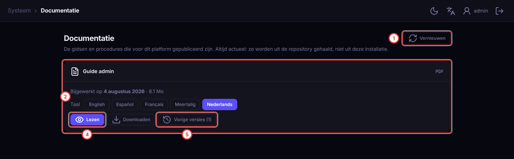{.shot width=88%}

::: legend
| n | wat het is |
|-|----------------------|
| 1 | [Vernieuwen]{.ui}: leest de lijst opnieuw uit de repository. |
| 2 | Een **kaart per document**, alle talen en versies samen. |
| 3 | De voorgestelde **taal** (de uwe wordt vanzelf gekozen). |
| 4 | [Lezen]{.ui}: opent het document in het paneel; ernaast [Downloaden]{.ui}. |
| 5 | [Vorige versies]{.ui}. |
:::

## 17.1. Waar die documenten vandaan komen

Niet van deze installatie: ze worden in de repository gepubliceerd en bij het tonen opgehaald. Kan de server GitHub niet bereiken, dan wordt de lijst niet getoond en zegt een banner waarom (“Kan GitHub niet bereiken om de lijst met documenten te lezen.”); dat is geen storing van de site, alleen van deze lijst. Andere berichten: “Limiet van de GitHub-API bereikt…”, “De map DOCS/ bestaat nog niet in de repository.”.

De lijst wordt **tien minuten** in het geheugen bewaard: een zojuist gepubliceerd document kan even op zich laten wachten. [Vernieuwen]{.ui} dwingt het opnieuw lezen af.

## 17.2. De taal kiezen en lezen

De beschikbare talen (Français, English, Nederlands, Español, Deutsch, Italiano, Português, Meertalig) verschijnen als knoppen. De keuze volgt deze volgorde: **uw interfacetaal**, anders **Engels**, anders **Meertalig**, anders de eerste beschikbare: nooit een lege kaart omdat een vertaling ontbreekt.

[Vorige versies]{.ui} klapt de oudere edities uit: een gecorrigeerd document **vervangt de oude niet**, het komt erbij. [Lezen]{.ui} toont het document in het paneel; [Nieuw tabblad]{.ui} opent het groot, [Sluiten]{.ui} sluit weer.

::: note
**Niet alle formaten kunnen worden getoond.** Pdf, afbeeldingen (`png`, `jpg`) en tekst (`txt`, `md`) lees je in het paneel. De andere (Word, rekenblad, archief) hebben geen knop [Lezen]{.ui}: ze worden gedownload. Dit is een veiligheidskeuze.
:::

## 17.3. Een document publiceren

Voorbehouden aan de persoon die de repository beheert, maar goed om te weten om het juiste te vragen. Een document wordt gepubliceerd door een bestand in de map `DOCS/` van de repository te zetten, met een strenge naamregel:

```
261007 - GUIDE-ADMIN - NL.pdf
└─┬──┘   └────┬────┘   └┬┘
  │           │         └── de taal
  │           └──────────── de id van het document, dezelfde van versie tot versie
  └──────────────────────── de datum JJMMDD: dat is het versienummer
```

- **De datum** rangschikt de versies: de recentste wordt voorgesteld, de andere blijven bereikbaar. Deze handleiding, gedateerd **7 oktober 2026**, wordt “de recentste” ten opzichte van de edities van augustus 2026.
- **De id** moet van versie tot versie **identiek** blijven, anders ziet het paneel er twee verschillende documenten in.
- Een bestand dat de regel niet volgt, wordt onderaan het tabblad **als genegeerd gemeld** (“Genegeerde bestanden (naam voldoet niet)”): een tikfout valt op.

# Bijlage A — Eerste installatie

::: chapter-intro
- Ze geldt alleen voor de **allereerste ingebruikname** van een nieuwe site.
- Een wizard in **5 stappen**; alleen de eerste is verplicht.
- Het wachtwoord van stap 1 dient ook voor de plug-ininstallaties van stap 5.
:::

Als er geen beheerdersaccount bestaat, start het openen van `admpan.html` de **Begeleide installatie**. Een balk van 5 segmenten toont de voortgang; onderaan: [Terug]{.ui}, [Overslaan]{.ui}, [Volgende]{.ui} (daarna [Voltooien]{.ui}). Klikt u op [Overslaan]{.ui}, dan eindigt de wizard meteen: de reeds ingevoerde waarden blijven behouden, **de volgende stappen worden niet uitgevoerd** (dus **er wordt geen plug-in geïnstalleerd** als u vóór stap 5 overslaat: doe dat in Catalogus).

## Stap 1 — Beheerdersaccount

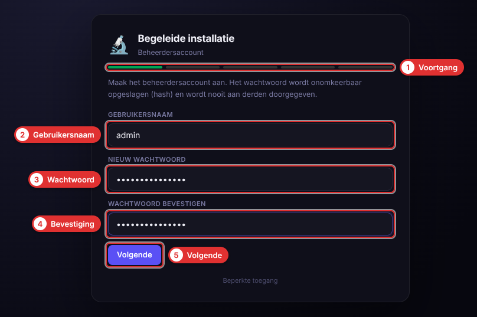{.shot width=75%}

::: legend
| n | wat het is |
|-|----------------------|
| 1 | De **voortgang** (5 segmenten). |
| 2 | **Gebruikersnaam** (standaard `admin`). |
| 3 | **Nieuw wachtwoord**: **minstens 8 tekens**. |
| 4 | **Wachtwoord bevestigen**. |
| 5 | [Volgende]{.ui}. |
:::

Dit is **de enige verplichte stap**. Het aanmaken is **exclusief**: het kan nooit een bestaand account overschrijven (“Er bestaat al een wachtwoord. Herlaad de pagina om in te loggen.”). Daarna wordt de sessie geopend: u hoeft niet opnieuw in te loggen. Fouten: “Wachtwoord te kort (minimaal 8 tekens).”, “De wachtwoorden komen niet overeen.”.

## Stap 2 — Identiteit

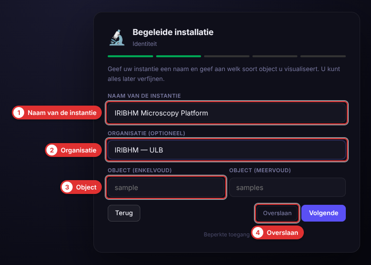{.shot width=75%}

::: legend
| n | wat het is |
|-|----------------------|
| 1 | **Naam van de instantie**. |
| 2 | **Organisatie** (optioneel). |
| 3 | **Object (enkelvoud)** en **(meervoud)**: het woord voor uw studieobjecten. |
| 4 | [Overslaan]{.ui}. |
:::

Later te wijzigen in **Identiteit** (hoofdstuk 8).

## Stap 3 — Thema

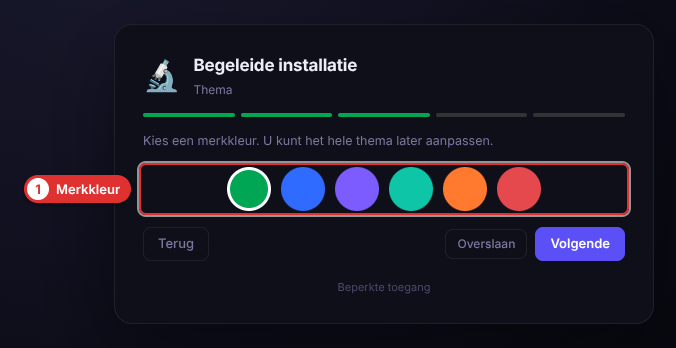{.shot width=75%}

Een **merkkleur** uit zes (groen voorgeselecteerd). Later te verfijnen in **Vormgeving** (hoofdstuk 9).

## Stap 4 — Teksten

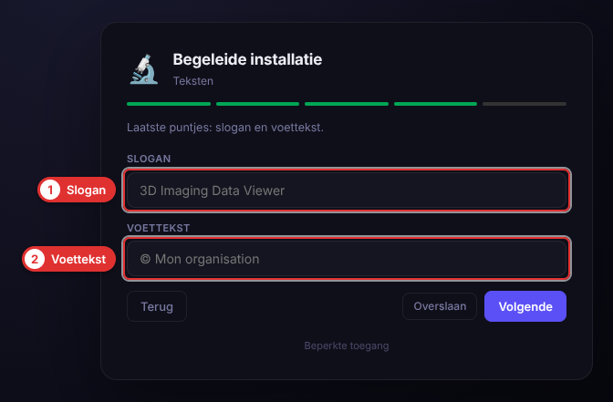{.shot width=75%}

De **slogan** en de **voettekst**. Later te wijzigen in **Identiteit**.

## Stap 5 — Plug-ins

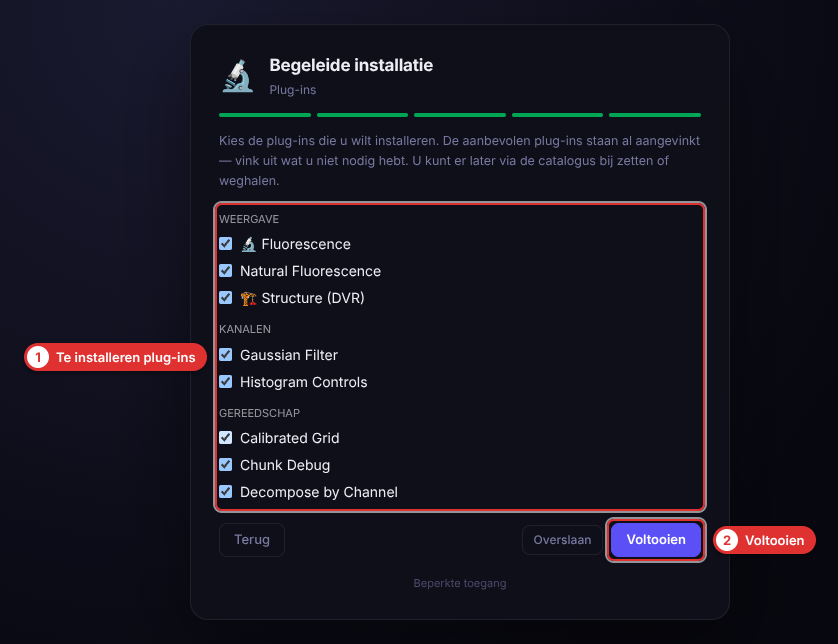{.shot width=75%}

De lijst, gegroepeerd per **Weergave / Kanalen / Gereedschap**, komt uit de ondertekende catalogus (“Catalogus laden…”). De aanbevolen plug-ins staan **al aangevinkt**; vink uit wat u niet nodig hebt. Een niet-compatibele plug-in is grijs “(niet compatibel)”. Is de catalogus onbereikbaar: “Catalogus niet beschikbaar — u kunt plug-ins later installeren via het tabblad Catalogus.”.

[Voltooien]{.ui} installeert de selectie (“Plug-ins installeren…”, “{n} plug-in(s) geïnstalleerd.”) en opent het paneel. **Het wachtwoord van stap 1 machtigt deze installaties**: er wordt niets tweemaal gevraagd.

::: note
De wizard schrijft alleen het merk, het object, de organisatie, de voettekst en het gekozen thema.
:::

# Bijlage B — Als er iets misgaat

::: chapter-intro
- Bijna alles is **terug te draaien** met een knop “Herstellen” of “Reset”.
- Een onderbroken overdracht **hervat** als u dezelfde map opnieuw sleept.
- De berichten “automatisch teruggezet” **vragen niets** van u.
:::

### “Ik ben het beheerderswachtwoord vergeten”

Het is **onmogelijk** het terug te vinden: de server bewaart er alleen een onomkeerbare vingerafdruk van. De oplossing vereist toegang tot de bestanden van de server (FTP, SFTP, bestandsbeheer van de hoster):

::: steps
1. Verwijder, of liever **hernoem**, het bestand `api/admin_credential.json`.
2. Open `admpan.html` opnieuw: de wizard voor de eerste installatie verschijnt weer.
3. Maak een nieuw wachtwoord aan.
:::

**Er gaat verder niets verloren**: geen datasets, geen pagina's, geen instellingen. In dat korte tijdsbestek zou iedereen die de pagina opent het account in uw plaats kunnen aanmaken: doe het dus in één keer.

### “Te veel pogingen. Probeer het later opnieuw.”

Na 10 mislukte pogingen in 15 minuten is de toegang 15 minuten geblokkeerd (het bericht « Trop de tentatives. Réessayez plus tard. » is Franstalig). Wacht en ga dan verder met het juiste wachtwoord. Achter een proxy: zie §1.4.

### “Ik heb iets gewijzigd en de site is stuk”

| Tabblad | Hoe terug te gaan |
|---|---|
| **Identiteit** | [Herstellen]{.ui} |
| **Vormgeving** | [Herstellen]{.ui} |
| **Pagina's** | [Standaard]{.ui} in de editor, daarna **Publiceren** |
| **Juridisch** | [Herstellen]{.ui} |
| **Soorten data** | [Standaardnamen]{.ui}, daarna [Opslaan]{.ui} |
| **Datasets** | [↺ Herstellen]{.ui} (vóór het opslaan); het oogje schakelt u weer om |
| **Data-updates** | Het kruisje **annuleren**: de dataset blijft zoals hij was |
| **Importeren** | [Verwijderen]{.ui} wist de verzonden bestanden (nooit een gepubliceerde dataset) |

### “Een dataset verschijnt niet in de lijst”

1. Kijk naar de filters: [Verborgen]{.ui} en [Import]{.ui} verbergen rijen; ga terug naar [Alle]{.ui}.
2. Komt hij van een **import**: [Publiceren]{.ui}, **zet daarna de zichtbaarheid aan** (een via Importeren gepubliceerde dataset is standaard verborgen).
3. Controleer of hij echt in `DATA_WEB/3d/`, `DATA_WEB/2d/` of `DATA_WEB/live/` staat (opgelegde mapnamen; een *soort* hernoemen verandert alleen de weergave) en of zijn map een `metadata.json` bevat.
4. Herlaad de pagina. Er is **geen catalogus om opnieuw te genereren**.

Als op een PHP-hosting het tabblad volledig leeg is, kon het antwoord van de lijst niet worden gelezen: vraag de persoon die de server beheert `api/datasets.php?action=list` te controleren.

### “Mijn import is gestopt” / “Verbinding verbroken”

- **Verbinding verbroken**: niets te doen, de overdracht hervat vanzelf zodra het netwerk terug is.
- **Onderbroken import** (tabblad gesloten, storing): **sleep dezelfde map opnieuw**. Hij hervat tot op het blok nauwkeurig. Zonder hervatting maakt de server de ruimte na **7 dagen** vrij.
- **Onvoldoende schijfruimte**: maak ruimte vrij en sleep dan opnieuw.
- **Een validatie mislukt** (`missing_pack`, `truncated_pack`…): sleep de map opnieuw om te versturen wat ontbreekt, en klik daarna opnieuw op [Controleren]{.ui}.

### “De optie De server is grijs in Data-updates”

De hosting kan verliesloze WebP niet decoderen (of coderen), heeft geen NumPy of zlib, of beperkt het geheugen of de tijd te sterk. De tooltip geeft de reden. **Gebruik [Deze browser]{.ui}**: die werkt overal.

### “Mijn adres is door de hoster geblokkeerd tijdens een data-update”

Laat **één enkel tabblad** open, herstart niet in een lus, wacht: de netwerkregelaar vertraagt vanzelf (maximaal 6 verzoeken tegelijk) en gaat weer door. Houdt de blokkade aan, neem dan contact op met de hoster.

### “Een functie is uit de viewer verdwenen”

Kijk in het tabblad **Plug-ins**: de plug-in is waarschijnlijk uitgeschakeld, of na een wijziging van zijn bestanden **niet vertrouwd** geworden (§12.5). In het voorbeeld van Datasets ontbreken de plug-ins “alleen pagina”: dat is normaal (§12.7).

### “Een opslag mislukt zonder duidelijk bericht”

Probeer **Beveiliging › [Rechten herstellen]{.ui}** (§16.3): het is de meest voorkomende oorzaak bij gedeelde hostings.

### “De update is mislukt”

Zegt het bericht “automatisch teruggezet”, dan **hoeft u niets te doen**: de site is teruggekeerd naar zijn vorige versie. Probeer het later opnieuw, of meld het foutbericht.

### “Het paneel is onleesbaar / de keuzemenu's zijn wit op wit”

Doe een **geforceerde herlaadbeurt**: <kbd>Ctrl</kbd> + <kbd>Shift</kbd> + <kbd>R</kbd> (Windows) of <kbd>Cmd</kbd> + <kbd>Shift</kbd> + <kbd>R</kbd> (Mac). De browser bewaart soms oude bestanden in het geheugen.

Een tabblad dat niet laadt, toont “Dit tabblad kon niet worden geladen. Herlaad de pagina.”.

# Bijlage C — Kleine woordenlijst

::: chapter-intro
- De technische woorden die in deze handleiding voorkomen, **elk in één regel**.
- Gerangschikt per thema: data, extensies, pagina's, beveiliging.
:::

### De data

| Term | Wat het hier betekent |
|---|---|
| **Kanaal** | Een fluorescente kleuring (DAPI, GFP, Pecam1…). Een dataset bevat er vaak meerdere, over elkaar heen gelegd. |
| **Voxel** | Het equivalent van een pixel in drie dimensies. Zijn werkelijke grootte wordt door de kalibratie gegeven (§3.6). |
| **Brick** | Een kleine volumekubus (64×64×64 voxels, of 66³ met rand in formaat 4). De site laadt ze op aanvraag om volumes van meerdere gigabytes te tonen zonder alles te downloaden. |
| **LOD** | *Level of Detail*: meerdere resoluties van hetzelfde volume. De site toont eerst een grove versie en verfijnt dan. |
| **Soort dataset** | Een van de drie categorieën: `3d` (vast volume), `2d` (gekalibreerde foto), `live` (4D-tijdreeks, eventueel met de tracking van zijn cellen). Dit zijn de mappen van de server; de naam die het publiek ziet, stelt u in bij **Soorten data** (hoofdstuk 6). |
| **Gegevensformaat** (`formatVersion`) | Het “inrichtingsniveau” van een gepubliceerde dataset, van 1 tot 4 (huidig: 4). Wordt op niveau gebracht in **Data-updates**. |
| **Vlakken** (`planes/`) | Formaat 2: een kopie van het native niveau **vlak voor vlak** (verliesloze PNG), voor snelle XY-sneden in de Studio. |
| **Laagprojecties** (`mips/`) | Formaat 3: de maximumprojectie van elke laag van 64 vlakken, voor snelle z-stackfiguren. |
| **Brick-piramide v3** | Formaat 4: bricks van 66³ met een rand van één voxel, ook in Z gehalveerde niveaus, `index.bin`. Brengt naadloze filtering en “Detail bij inzoomen”. |
| **Zijde van het monster** | Instelling die zegt of het bestand het monster van bovenaf (“rechtop”) of van onderaf (“ondersteboven”) toont. |
| **Standaardweergave** | De stand waarin een dataset opent, vastgelegd vanuit het voorbeeld. |

### De overdrachten en de data-updates

| Term | Wat het hier betekent |
|---|---|
| **Staging / wachtende import** | De privézone waar de bestanden van een import aankomen, nooit via URL geserveerd, vóór u op [Publiceren]{.ui} klikt. |
| **Uitvoerder** | Wie de berekening van een data-update doet: **deze browser** of **de server**. Elk heeft zijn wachtrij. |
| **Netwerkregelaar** | De beveiliging die het aantal naar de hoster gestuurde verzoeken beperkt (6 tegelijk, 4 tot 6 per seconde) om te voorkomen dat hij uw adres blokkeert. |
| **Journaal** | Het schrift dat de server bijhoudt van wat al is aangekomen of omgezet: het maakt het **hervatten** op de juiste plek mogelijk. |

### De extensies, de pagina's, de beveiliging

| Term | Wat het hier betekent |
|---|---|
| **Plug-in** | Een module die een functie aan de viewer toevoegt (§12.1). |
| **Sandbox (zandbak)** | Een geïsoleerde uitvoeringsmodus: de plug-in werkt, maar heeft geen toegang tot de rest van de pagina. |
| **Vingerafdruk** | Een handtekening van de exacte inhoud van een bestand: verandert het bestand met één teken, dan verandert de vingerafdruk. |
| **Slug** | Het korte adres van een pagina (`protocollen` in `page.html?slug=protocollen`). |
| **Sectie / Kolom / Element** | De drie bouwniveaus van een pagina (§10.5). |
| **Concept** | Een opgeslagen versie die **nog niet zichtbaar** is voor het publiek. |
| **SEO** | De teksten die zoekmachines en sociale netwerken tonen. |

---

*Document geschreven voor versie **1.59.3** van het platform (pipeline 0.21.0, gegevensformaat 4). De schermafbeeldingen tonen een demodataset (synthetische embryo's); de kleuren kunnen afwijken als het thema is gewijzigd.*
