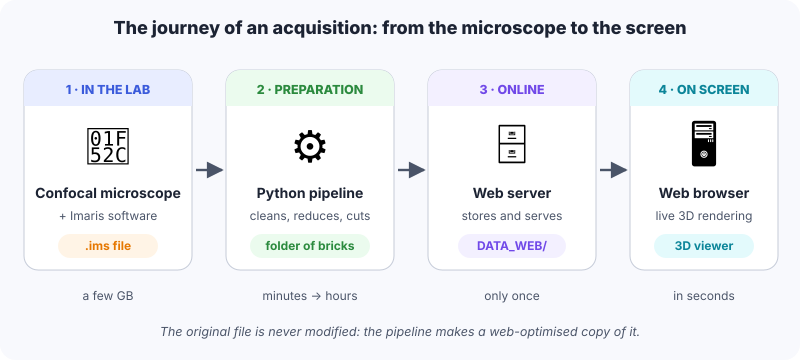
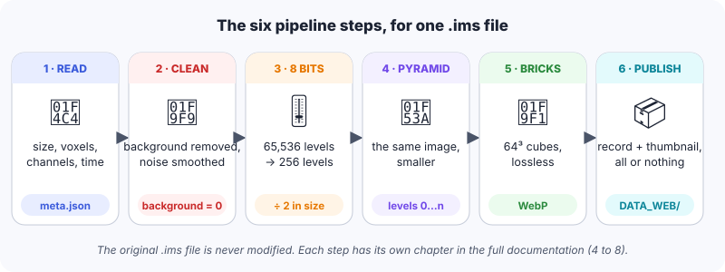
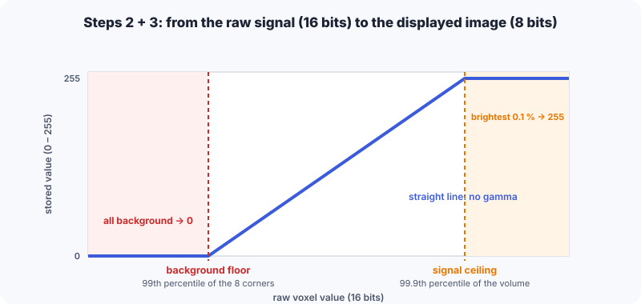
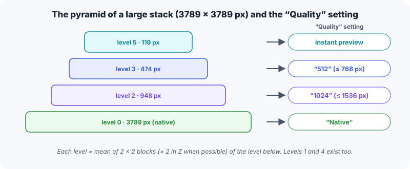
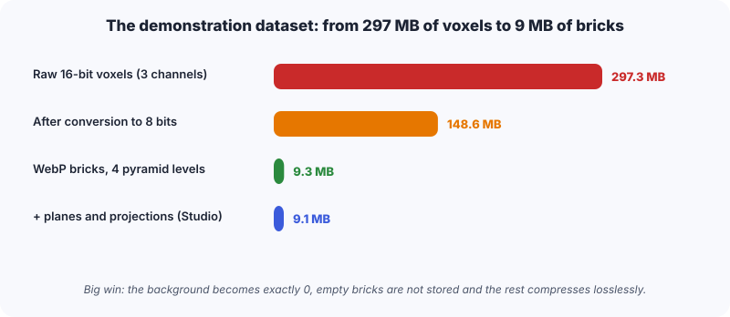
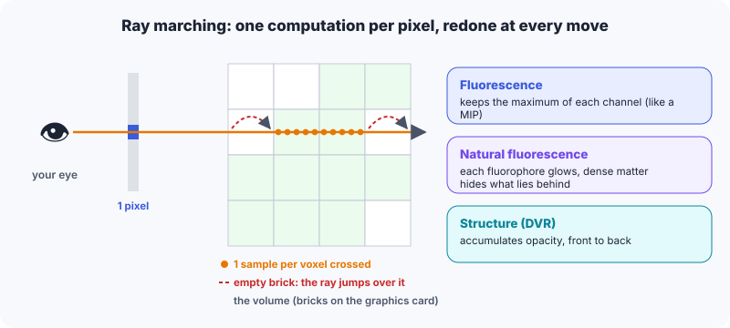
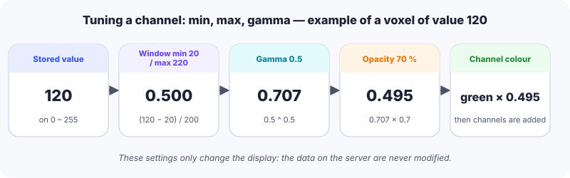

# 1. Lumen3D on one page

::: tldr
- Lumen3D displays confocal volumes of **several gigabytes** in a plain web browser, with nothing to install.
- A **pipeline** prepares each Imaris file **once**; the original file is never modified.
- The **viewer** downloads only what the screen needs, then computes the 3D image on the graphics card.
:::

{width=100%}

:::: cards
::: card
#### 3D
A confocal volume: a stack of optical sections, up to 4 channels displayed.
:::
::: card
#### Live
A time series (timelapse); it may carry **cell tracking**.
:::
::: card
#### 2D
A calibrated photograph (for instance an X-gal staining).
:::
::::

::: note
This document is a summary. The **→ chapter N** references point to the
**full documentation** ("Lumen3D from A to Z"), published in the same place.
The volume pictures come from a **synthetic demonstration embryo**.
:::

# 2. Your Imaris file: what is read

::: tldr
- An `.ims` file is a **binder** (HDF5 format) that holds the image and its information.
- The pipeline reads the **dimensions**, the **voxel size in µm**, the **channel names** and the **time stamps**.
- Only the full-resolution image is used; the calibration is **never invented**.
:::

:::: cols
::: col
**What is read**

| Information | Example (demonstration dataset) |
|---|---|
| Voxels X × Y × Z | 768 × 576 × 112 |
| Physical extent | 921.6 × 691.2 × 336 µm |
| Voxel size | 1.2 × 1.2 × 3.0 µm |
| Channels | DAPI, Pecam1, Sox2 |
| Timepoints | 1 (3D) or n (Live) |
:::
::: col
::: example
**The voxel size** is not copied, it is **computed**:
extent ÷ number of voxels.

921.6 µm ÷ 768 voxels = **1.2 µm** per voxel along X.

nm and mm are converted to µm. If the extent is missing, the dataset is marked
"uncalibrated": no scale bar, no measurement in µm.
:::
:::
::::

::: tip
**The file name matters.** Stage and embryo are read from it:
`…-E85-Em1-…` → stage **E8.5**, embryo **Em1**; `E8-5` and `E8.5` also give **E8.5**;
`E105` gives **E10.5**. You can correct these values afterwards in the administration panel.
:::

::: see
→ chapter 4 (voxels, channels, the structure of an `.ims`) and chapter 8 (reading the file name).
:::

# 3. Cleaning: removing the background

::: tldr
- The **noise floor** is measured in the **8 corners** of the volume, where there is no embryo.
- Around the signal nothing is touched; **outside the signal**, noise is smoothed (median filter).
- The image is then converted to **8 bits** by a simple rule of three: the background becomes **0**.
:::

{width=100%}

## 3.1 How the background is removed

::: steps
1. **Background floor**: 8 small cubes (up to 32 × 32 × 32 voxels) are taken at the 8 corners of the volume. The floor = the value below which **99 %** of these corner voxels lie.
2. **Signal ceiling**: the value below which **99.9 %** of the voxels lie (one voxel out of 4 in each direction is examined).
3. **Signal mask**: every voxel above **1.1 × the floor**. Isolated hot pixels are removed (opening), then the mask is **grown by 3 voxels** to protect the natural halo of the cells.
4. **Outside the mask only**: each voxel is replaced by the **median** of its 3 × 3 × 3 neighbourhood. Inside the mask, voxels keep **exactly** their original value.
5. **Conversion to 8 bits**: a straight line from the floor (→ 0) to the ceiling (→ 255).
:::

{width=92%}

::: example
Floor = 4,000, ceiling = 34,000 (raw values). A raw voxel of **19,000** becomes
255 × (19,000 − 4,000) ÷ (34,000 − 4,000) = **127** (the decimal part is dropped).
A voxel at 3,500 (below the floor) becomes **0**; a voxel at 40,000 becomes **255**.
:::

::: why
An automatic thresholding method (Otsu) and a neural-network denoiser (Noise2Void) were
tried and then **removed** (version 0.12.0): they created artificial coloured "blobs". The
current method only removes the camera background.
:::

::: see
→ chapter 5: each step shown on a real slice, the shared window of timelapses, the
tiling of very large volumes.
:::

# 4. Reducing the size without loss

::: tldr
- **8 bits** instead of 16: half the bytes.
- A **pyramid** of smaller and smaller versions shows the volume quickly, then refines it.
- The volume is cut into **bricks** of 64 × 64 × 64 voxels, compressed **losslessly** (WebP); empty bricks are **not stored**.
:::

{width=100%}

:::: cols
::: col
::: analogy
Like an online map: you never download the whole world, only the visible **tiles**,
blurry first and then sharp. Bricks are the tiles of a volume.
:::
:::
::: col
::: example
A block of 2 × 2 voxels worth 10, 11, 12 and 14 becomes, one level up,
(10 + 11 + 12 + 14 + 2) ÷ 4 = **12** (integer mean, rounded).
:::
:::
::::

{width=95%}

::: why
**Lossless**, because these are measurements: a lossy format (JPEG) would change the
intensities. **WebP** rather than PNG because it is more compact at identical quality and the
browser decodes it very fast. Each brick is laid flat as **one image** (its 66 slices arranged
in a 9 × 8 grid, one-voxel border included).
:::

::: see
→ chapter 6 (pyramid, compression, empty bricks) and chapter 7 (bricks, mosaics, packs,
planes for fast slices).
:::

# 5. Publication

::: tldr
- The pipeline writes a **record** (`metadata.json`): dimensions, calibration, channels, stage.
- For a timelapse, it attaches the **cell tracking** when it finds one.
- The dataset is built aside and published **in one go**: never a half-copied dataset.
:::

| Published file | Role |
|---|---|
| `metadata.json` | the dataset record (name, stage, channels, µm…) |
| `thumbnail.webp` | the explorer thumbnail (false-colour maximum projection) |
| `bricks/` | the bricks of every level + their index |
| `planes/`, `mips/` | XY planes and per-layer projections, for the Studio |
| `tracks.json`, `model.glb` | cell tracking and the embryo surface (timelapses) |
| `download/` | (option) the original `.ims`, an ImageJ TIFF, PNG projections |

::: note
**Cell tracking.** The pipeline looks, in this order, for: a `.imaris_track` file, the
*Spots/Tracks* objects inside the `.ims` itself, then the Imaris Excel export. Positions are
**stabilised**: a rigid motion (rotation + translation, no deformation) cancels the drift of
the embryo between two timepoints.
:::

::: tip
To put a dataset online: copy the produced folder into the server's `DATA_WEB/`, **or** drag
it into the **Import** tab of the administration panel (resumable, verified transfer). An
imported dataset stays **hidden** until you show it. If you re-process a dataset, your settings
(name, colours, orientation…) are kept.
:::

::: see
→ chapter 8, and the Administrator guide (Datasets and Import tabs).
:::

# 6. On screen: the 3D viewer

::: tldr
- The viewer first loads the **coarsest level** (instant picture), then the requested level, **starting from the centre**.
- The **512 / 1024 / Native** choice selects the pyramid level; if the graphics card lacks memory, a lighter level is used and a message says so.
- The image is **computed** for every pixel by casting a ray through the volume.
:::

{width=100%}

| Mode | What you see | Good for… |
|---|---|---|
| **Fluorescence** (default) | the maximum of each channel along the ray, colours added | spotting all the signal, like a MIP |
| **Natural fluorescence** | each fluorophore glows; dense matter hides what lies behind | perceiving depth and shapes |
| **Structure (DVR)** | opacity accumulated from front to back | surfaces and solid volumes |

::: analogy
The processor is a head chef; the **graphics card** is a team of thousands of kitchen
assistants who all make the same small gesture at the same time. Computing a pixel = one
gesture: this is why the 3D image can be recomputed dozens of times per second.
:::

::: see
→ chapter 9 (Three.js, ray marching, the formulas of each mode) and chapter 10 (streaming,
graphics-card memory, timelapses).
:::

# 7. Tuning how a channel looks

::: tldr
- Each channel has a **min**, a **max**, a **gamma**, an **opacity** and a **colour**; channels are **added**.
- The histogram shows how the **0–255** values of the coarsest level are spread (64 bars).
- These settings change **only the display**, never the data.
:::

{width=100%}

:::: cols
::: col
**The histogram handles**

- **Min / Max**: everything below *min* turns black, above *max* full colour.
- **Middle handle**: the level displayed at **50 %**; it sets the gamma
  (gamma = ln 0.5 ÷ ln *m*).
- **Auto**: clips the darkest 0.5 % and the brightest 0.5 %.
:::
::: col
::: warning
Before your settings, the viewer also sets the weakest values of a channel to **0**
(a "floor" between 6 and 48 estimated from the histogram). And at most **4 channels**
are displayed at once.
:::
:::
::::

::: see
→ chapter 11 (transfer function, histograms, Gaussian filter, colour-vision simulation).
:::

# 8. Measuring, slicing, exporting

::: tldr
- **Measurements** use the real voxel size: the result is in **µm**, even when voxels are longer in Z.
- **Oblique slice**, **Z-stack browser**, **Studio** and the **Compare** page produce publication-ready figures.
- Everything exports: an image at any size, a Studio figure, measurements as CSV, a sharing link.
:::

::: example
Two points 10 voxels apart in X and 4 voxels apart in Z, with 1.2 × 1.2 × 3 µm voxels:
√((10 × 1.2)² + (4 × 3)²) = √(144 + 144) = **17 µm** — not √(10² + 4²) ≈ 10.8 "voxels".
:::

| Tool | What for |
|---|---|
| **Measure distance** | click two points on the volume; the point lands on the first visible structure along the ray (a click in empty space is refused) |
| **Oblique slice** | see the volume cut along any plane, with an exact scale bar |
| **Z-stack browser** | browse the sections from above, set the thickness, trim top and bottom |
| **Studio** | compose a figure (arrows, text, scale bar, distances) at full resolution |
| **Compare** | up to 4 datasets side by side, synchronised (camera, time, slices, channels) |
| **Cell tracking** (Live) | trajectories, surface, cell sheet, charts, cell-to-cell distances |

::: warning
The **scale bar of the 3D view** is exact only at the depth of the **centre of the
specimen** (perspective view: what is closer looks bigger). For a precise measurement, use
the measuring tool or a slice.
:::

::: see
→ chapter 12 (every tool illustrated, keyboard shortcuts, the 2D page and X-gal stain isolation).
:::

# 9. Keep in mind when interpreting your images

::: remember
- **Grey levels are relative.** Each channel of each dataset has its own window
  (floor → ceiling): do not compare an intensity between two channels or two datasets.
  For a timelapse, the window is **shared by all timepoints**: a drop in intensity
  (photobleaching) stays visible, as in reality.
- **Outside the signal, noise is smoothed** (3 × 3 × 3 median); **inside the signal**, nothing is changed.
- **8 bits** are enough to see morphology; to quantify, go back to the original `.ims`
  (downloadable from `download/` when that option was enabled).
- **Empty bricks** (no non-zero voxel after cleaning) are not stored: these areas really
  are 0, no data was lost.
- **Calibration**: without a voxel size in the file, no measurement in µm is offered.
:::

## Frequently asked questions

| Question | Short answer |
|---|---|
| My dataset looks blurry at first | Normal: the coarse level arrives first, detail follows (progress bar). |
| "Native" gives me another level | The graphics card lacks memory: a lighter level is shown, with a message. |
| My colours changed | Channel settings are made in the viewer; default colours are set in the administration panel. |
| The dataset is not in the explorer | It may be hidden or still importing: see the Administrator guide. |
| Can I share a view? | Yes: the page link keeps the state of the view; the Compare page can also save a workspace. |

::: see
**Full documentation**: 15 chapters, about 100 pages, every step illustrated.
**Administrator guide**: every screen of the panel, step by step.
:::
