# 1. Lumen3D in two pages

::: tldr
- Lumen3D shows confocal volumes of **several gigabytes** in a plain web browser, with nothing to install.
- A **pipeline** prepares each Imaris file **once**; the original file is never modified.
- The **viewer** downloads only what the screen needs, then computes the 3D image on the graphics card.
:::

{width=100%}

## 1.1 Why a preparation step is essential

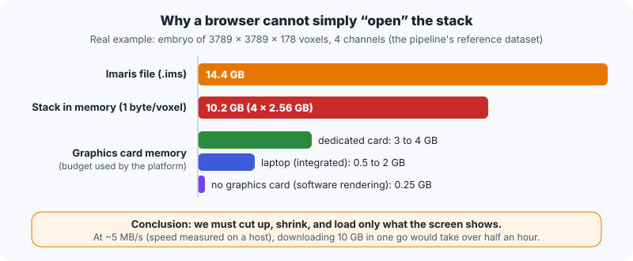{width=88%}

## 1.2 Three kinds of datasets

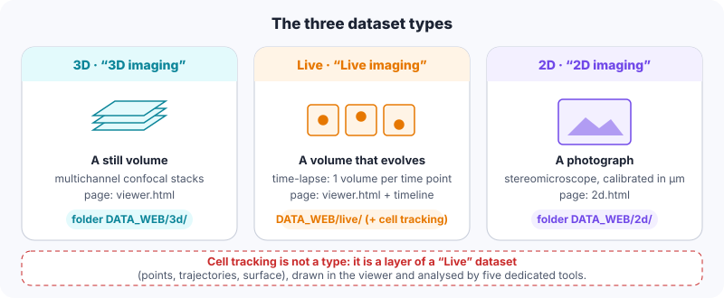{width=92%}

| Type | What it is | Page | Special feature |
|---|---|---|---|
| **3D** | a confocal stack, up to 4 channels displayed | 3D viewer | measuring tools, slices, Studio |
| **Live** | a time series (timelapse) | 3D viewer + timeline | can carry a **cell tracking** |
| **2D** | a calibrated photograph (stereomicroscope) | 2D page | X-gal staining isolation |

::: note
This document summarises the **full documentation** (“Lumen3D, from A to Z”, 21 chapters).
The pointers **→ ch. N** lead to the chapter that explains everything in detail. The volume images come
from **synthetic demonstration embryos**, processed by the real pipeline.
:::

# 2. Before the pipeline: prepare your acquisition

::: tldr
- The **file name** gives the stage and the embryo number: choose it carefully.
- The **calibration** (voxel size) and the **channel names** are read from the Imaris file: check them before exporting.
- For a tracked timelapse, prepare the **tracking source** (one of the three accepted formats).
:::

## 2.1 The file name: stage and embryo

The pipeline reads the stage (`E…`) and the embryo (`Em…`) from the name. The exact rules:

| In the name | Stage read | Embryo read |
|---|---|---|
| `…-E8.5-Em1-…` or `…-E8,5-…` | E8.5 | Em1 |
| `…-E8-5-…` (dash: 25, 5 or 75 only) | E8.5 | — |
| `…-E85-…` · `…-E105-…` · `…-E95-…` (compact form) | E8.5 · E10.5 · E9.5 | — |
| `…-E8-1-DAPI…` (the “1” is not a fraction) | E8 | Em1 |
| `…-E95-2-…` | E9.5 | Em2 |
| no `E…` recognised | “Unknown” | — |

The published folder name is the file name, cleaned (characters other than letters, digits, `.`, `_`, `-` replaced by `-`).
All of this can be corrected later in the administration. → ch. 8

## 2.2 What Imaris must contain

:::: cols
::: col
**Check in Imaris before exporting:**

- **the calibration** (voxel size in X, Y, Z): without it, no scale bar and no measurement in µm;
- **the name of each channel** (DAPI, Pecam1…): an empty name becomes “Channel 1”, “Channel 2”…;
- for a timelapse, **the time** of each frame: the interval kept is the median of the gaps.
:::
::: col
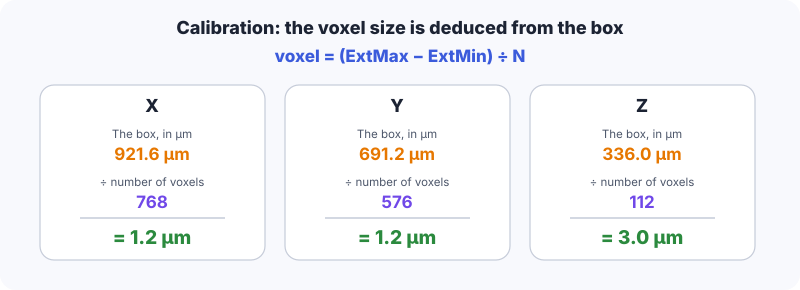{width=100%}
:::
::::

::: example
The pipeline reads the **physical extent** (ExtMin → ExtMax) and divides it by the number of voxels.
921.6 µm over 768 voxels → **1.2 µm** per voxel in X. 336 µm over 112 slices → **3.0 µm** in Z.
nm and mm are converted to µm. A missing calibration is **never invented**.
:::

## 2.3 Colours, channels, 8- or 16-bit data

- Imaris **colours** are not carried over: each channel gets a default colour (green, sky blue, magenta, red…), which the administrator then changes.
- **8- or 16-bit** files: both are accepted. The published image is always 8-bit (§ 4).
- More than **4 channels**: all are processed, but the viewer displays only the first 4.

## 2.4 Timelapse with cell tracking

The pipeline looks for the tracking automatically, **in this order**:

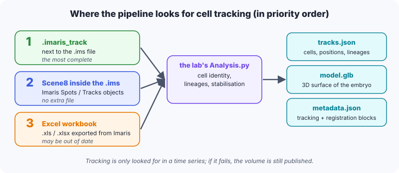{width=92%}

::: warning
The Excel workbook exported from Imaris can be **stale** (measured on a lab dataset: 155 of the 172 spots).
Its name must contain the interval between two frames (e.g. `30min`): the analysis reads it from the name.
Prefer the *Spots/Tracks* objects saved inside the `.ims` itself.
:::

# 3. Running the pipeline

::: tldr
- Everything starts from **`RUN.bat`**, on a Windows PC, from the **Pipeline pack** downloaded in the *Pipeline* tab of the administration.
- The `.ims` files go into `input\`, the result comes out in `output\`.
- The dataset is built aside and appears only once **entirely** finished.
:::

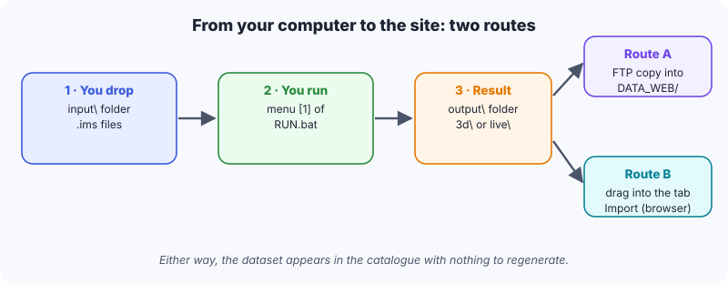{width=100%}

| `RUN.bat` menu choice | What it does |
|---|---|
| `[1]` | Process Imaris volumes (`.ims` → `output\`, cell tracking included) |
| `[2]` | Imaris tracking analysis (Excel → `tracking\OUTPUT\`) |
| `[3]` | Import 2D photographs (`.tif` → `output\2d\`) |
| `[4]` | Attach a tracking to an already processed dataset |
| `[5]` | Check the environment only |

::: tip
Two editions of the pack: **light** (~3 MB, downloads Python on first run) and **full offline**
(~70 MB, everything included). Library versions are pinned: two computers produce the
**same bytes** from the same `.ims`. Reprocessing a dataset that is already published **keeps** your settings
(name, colours, orientation, default view, gallery, visibility). → ch. 8
:::

# 4. Cleaning the image

::: tldr
- The **camera noise** is measured in the **8 corners** of the volume, where there is no embryo.
- **Inside the signal**, nothing is changed; **outside the signal**, the noise is smoothed.
- The image is then converted to **8 bits** by a simple rule of three: the background becomes exactly **0**.
:::

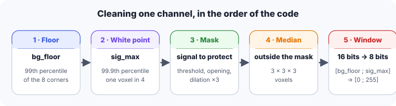{width=90%}

## 4.1 Floor and ceiling

::: steps
1. **Background floor**: 8 small cubes (up to 32 × 32 × 32 voxels) at the 8 corners. The floor = the value below which **99 %** of these corner voxels lie.
2. **Signal ceiling**: the value below which **99.9 %** of the voxels lie (one voxel in 4 in each direction is examined). The brightest 0.1 % saturate.
:::

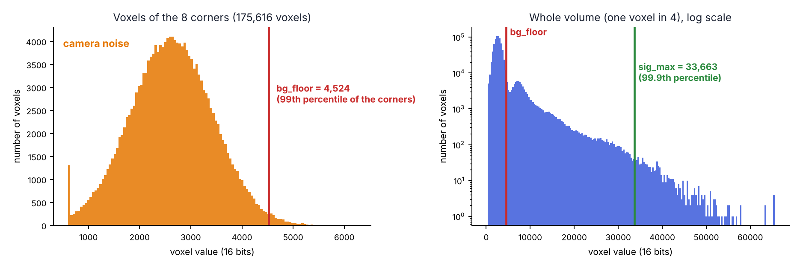{width=75%}

## 4.2 The mask: protecting the real signal

::: steps
1. Every voxel **above 1.1 × the floor** is marked “signal”.
2. An **opening** removes isolated hot pixels (a lone white dot is not a cell).
3. The mask is **widened by 3 voxels** to protect the natural halo around cells.
4. **Outside the mask only**, each voxel is replaced by the **median** of its 27 neighbours (3 × 3 × 3).
:::

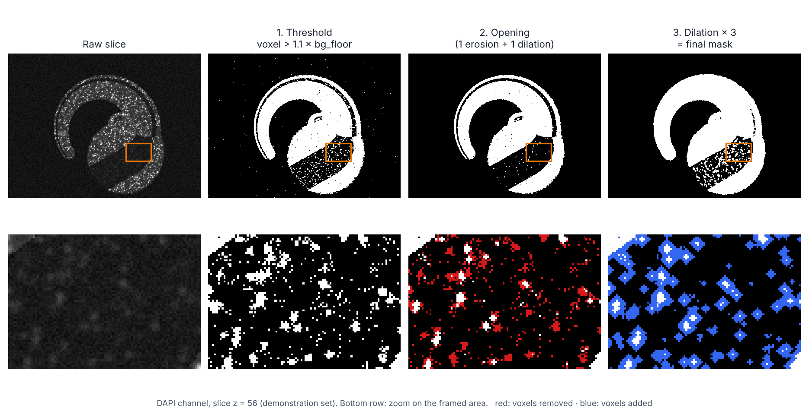{width=78%}

## 4.3 Conversion to 8 bits

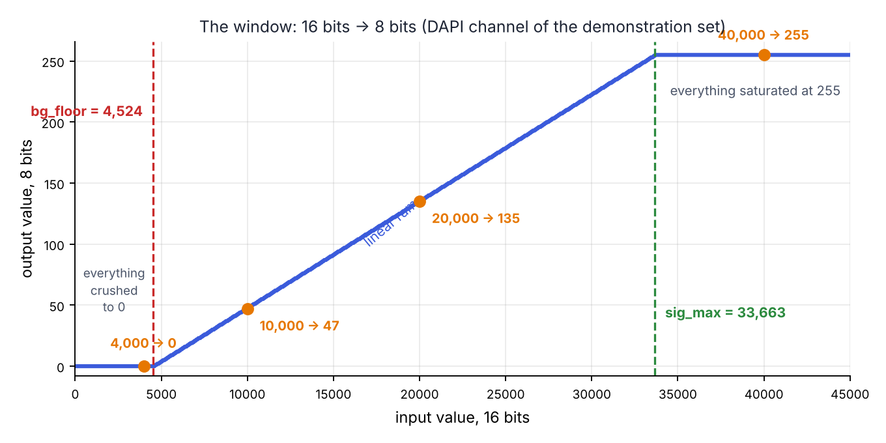{width=80%}

::: example
On the DAPI channel of the demonstration dataset: floor = 4,524, ceiling = 33,663.
A raw voxel of **20,000** becomes 255 × (20,000 − 4,524) ÷ (33,663 − 4,524) = **135** (decimal part truncated).
A voxel at 4,000 becomes **0**; a voxel at 40,000 becomes **255**. Result: **88 %** of the voxels are 0.
:::

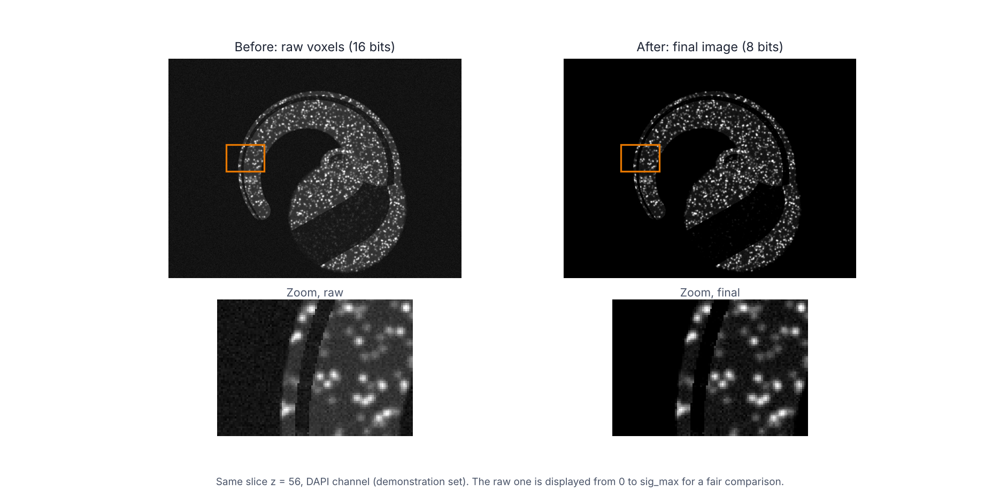{width=75%}

## 4.4 For a timelapse: one shared window

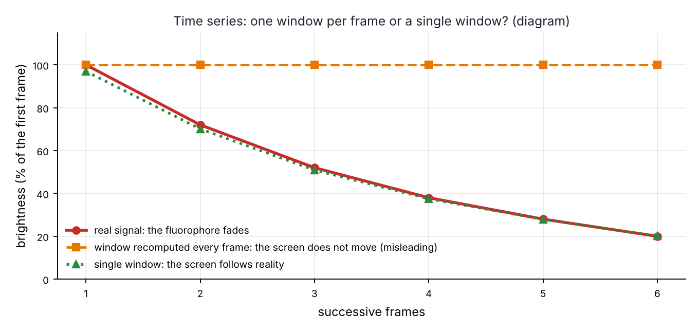{width=70%}

The floor and ceiling are computed over **up to 8 frames** spread across the series. The signal level of
each frame is **recorded** in `metadata.json`, but no viewer setting uses it yet: a fading series is
really displayed darker.

::: why
An automatic thresholding method (Otsu) and a neural-network denoiser (Noise2Void) were
tried and then **removed** in version 0.12.0: they created artificial coloured “blobs”. → ch. 5
:::

# 5. Reducing the size without loss

::: tldr
- **8 bits** instead of 16: half as many bytes.
- A **pyramid** of smaller and smaller versions shows something fast, then refines it.
- The volume is cut into **bricks** of 64³ voxels compressed **losslessly**; empty bricks are **not stored**.
:::

## 5.1 The pyramid

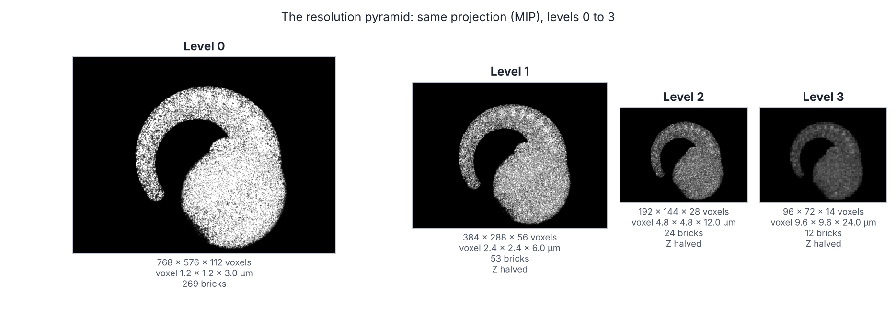{width=85%}

- X and Y are halved at each level; **Z only as long as** the Z voxel does not become more than 1.5 times larger than in XY.
- The average is an **integer, rounded to the nearest**. The pyramid stops when the longest side is 128 voxels or less.
- Level 0 is the cleaned image as it is, **never resampled**. → ch. 6

## 5.2 Lossless compression

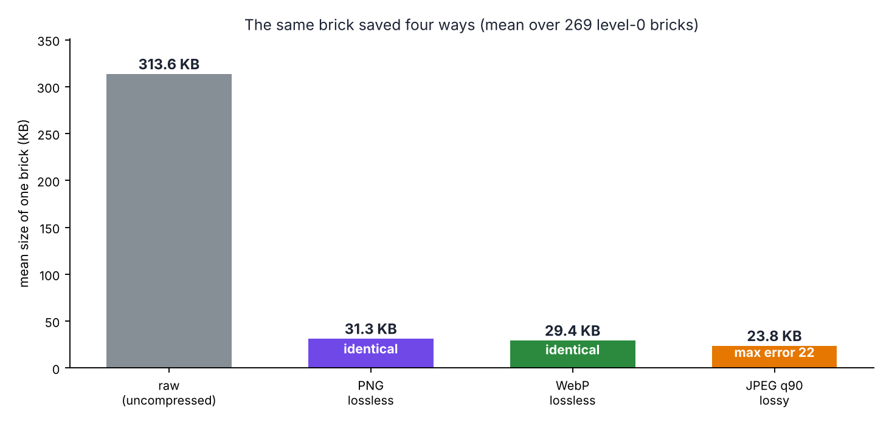{width=65%}

| Format | Average size | Exact values? |
|---|---|---|
| Raw | 313.6 KB | yes |
| PNG (best compression) | 31.3 KB | yes |
| **Lossless WebP** (chosen) | **29.4 KB** | yes |
| JPEG quality 90 | 23.8 KB | **no**: up to 22 levels off, 11.7 % of voxels changed |

::: why
These are **measurements**: lossy compression would invent signal (2.2 % of the voxels at 0 become non-zero in JPEG).
WebP is a little more compact than PNG and the browser decodes it very fast. → ch. 6
:::

## 5.3 Empty bricks are not stored

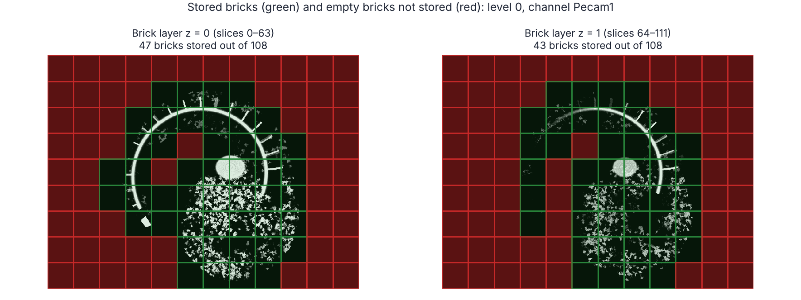{width=70%}

A brick is stored only if **at least one voxel** of its interior is 1 or more.
On the demonstration dataset: **358 bricks stored out of 777** possible.

{width=85%}

# 6. Bricks and formats

::: tldr
- A brick = **64³ useful voxels** + a **one-voxel border**, laid out flat in **one** WebP image.
- Bricks are grouped into **packs**; a small **index** says where to find each one.
- XY **planes** and **per-layer projections** speed up the Studio's figures.
:::

:::: cols
::: col
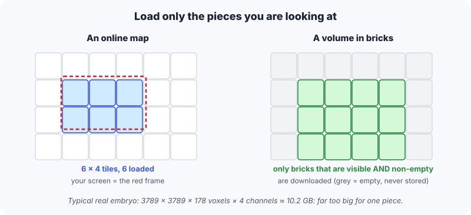{width=100%}
:::
::: col
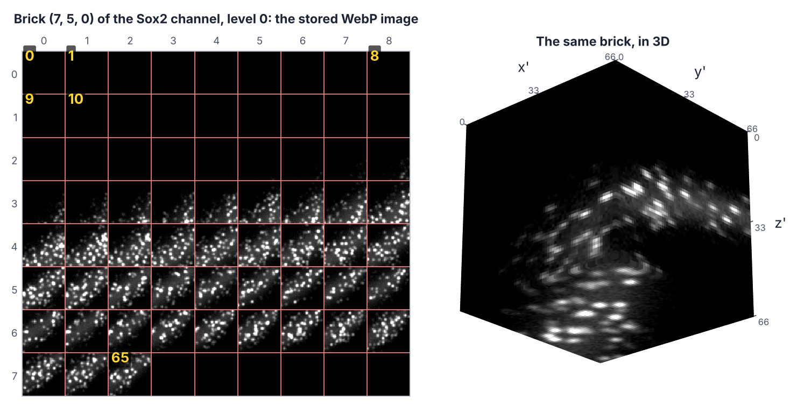{width=100%}
:::
::::

- **The border** copies the neighbouring voxel: the image can be smoothed with no visible seam between two bricks. → ch. 7
- **The planes** (`planes/`): a full-resolution XY slice reads **94 KB instead of 5,078 KB** on the demonstration dataset.
- **The formats**: a dataset carries a format number (1 to 4, the latest is 4). Pipeline 0.21.0 writes
  format 4 directly. An older dataset is upgraded from the *Data updates* tab, without reprocessing. → ch. 17

# 7. The end of the pipeline

::: tldr
- The pipeline writes a **record** (`metadata.json`), a **thumbnail**, the channel **histograms**.
- It attaches the **cell tracking** of a timelapse and **stabilises** the positions.
- It publishes **all or nothing**: never a half-copied dataset.
:::

| Published file | Role |
|---|---|
| `metadata.json` | the record: name, stage, dimensions, calibration, channels, format |
| `thumbnail.webp` | the explorer thumbnail (false-colour maximum projection) |
| `bricks/` | the bricks of every level and their index |
| `planes/`, `mips/` | XY planes and per-layer projections of 64 planes |
| `tracks.json`, `model.glb` | cell tracking and embryo surface (timelapses) |
| `download/` | (option) the original `.ims`, an ImageJ TIFF, PNG projections, a README |

:::: cols
::: col
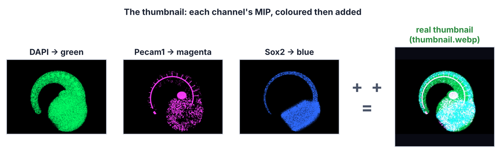{width=100%}
:::
::: col
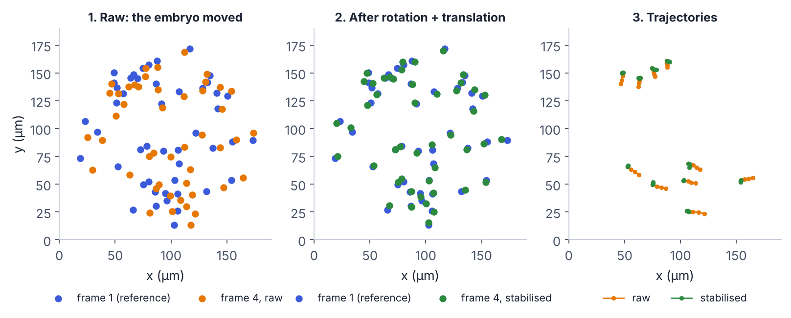{width=100%}
:::
::::

::: note
**Stabilisation.** The embryo moves during the acquisition. For each time point, the pipeline computes the
**rigid** displacement that best superimposes the cells (Kabsch method, at least 3 reference
cells). The viewer applies this displacement **to the view**, not to the voxels: no voxel is resampled. → ch. 8 and 13
:::

# 8. Putting the dataset online and setting it up

::: tldr
- Two routes: **copy** the folder into `DATA_WEB/` on the server, or **drag** it into the *Import* tab of the administration.
- An imported dataset is **hidden** until you show it.
- The administration sets the name, stage, colours, calibration, **orientation** and **default view**.
:::

{.shot width=70%}

- The transfer **resumes by itself** after an interruption: just drag the same folder again (within 7 days).
- The upload order is designed for you: the record, the thumbnail and the **coarsest level** go first,
  so the dataset can be **set up within minutes**, while the rest arrives.
- Only files produced by the pipeline are accepted. → Administrator guide, ch. 4

## 8.1 The settings that matter to you

{.shot width=55%}

| Setting | What it is for |
|---|---|
| **Name, stage, embryo, description** | what visitors read in the explorer |
| **Channel colours** | the default colour of each channel when the dataset opens |
| **Calibration** | fix a missing or wrong voxel size |
| **Sample side** | “Upside down” for a stack seen from below (common for an Imaris export): the Z-stack browser will show the right face |
| **Define orientation** | align the red / green / blue axes with the anatomy, then rename them (anterior, dorsal…) |
| **Default view** | the pose in which the dataset opens |
| **Gallery** | attach annotated figures, visible in the viewer |
| **Visibility** | show or hide the dataset in the public explorer |

# 9. Exploring in 3D

::: tldr
- Open a dataset from the **explorer** (search, filters by type and stage).
- The viewer first shows a **coarse image**, then the detail arrives **starting from the centre**.
- Three **render modes** for three different questions.
:::

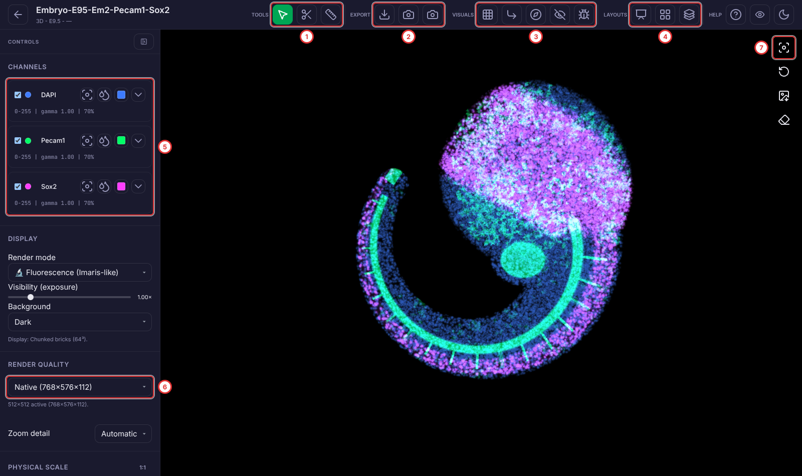{.shot width=70%}

## 9.1 Quality and loading

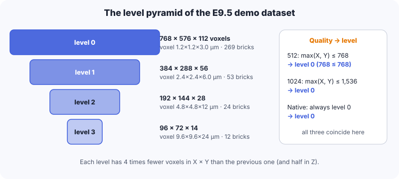{width=72%}

| Quality | Level loaded |
|---|---|
| **512** (default) | the finest level whose longest XY side is at most **768** px |
| **1024** | the finest level whose longest side is at most **1,536** px |
| **Native** | level 0, full resolution |

If the graphics card does not have enough memory, the viewer takes **the next lighter level** and says so
in a message. A progress line shows the quality, the percentage and the current step. → ch. 10

## 9.2 How the image is computed

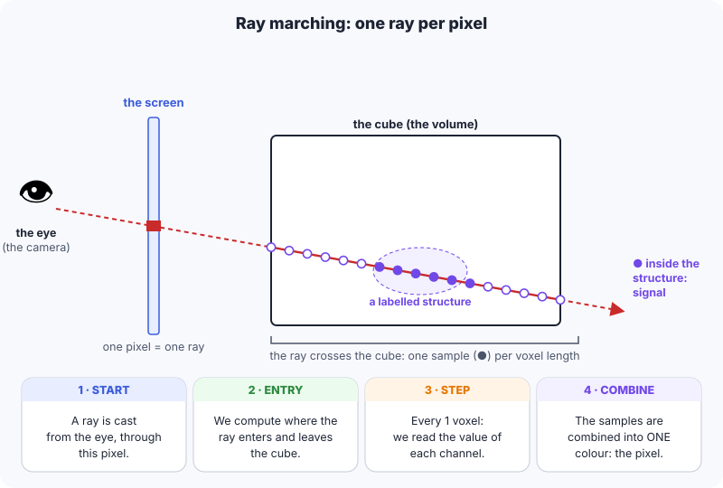{width=85%}

The image is not a photo: it is **recomputed** at every movement by the graphics card, thousands
of pixels in parallel (Three.js + WebGL2). While you rotate, the definition drops a little to
stay smooth; at rest, it returns to the maximum (one sample per voxel). Empty bricks are skipped. → ch. 9

## 9.3 The three render modes

:::: cols3
::: col
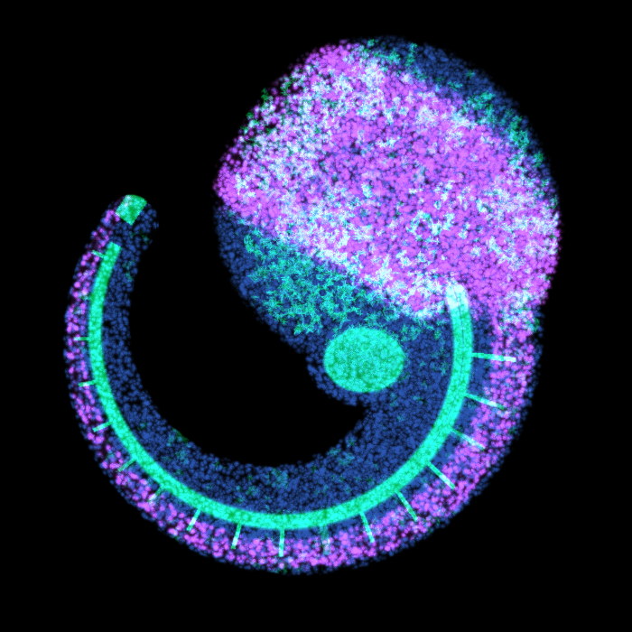{width=100%}
:::
::: col
{width=100%}
:::
::: col
{width=100%}
:::
::::

| Mode | What you see | Good for… |
|---|---|---|
| **Fluorescence** | the **maximum** of each channel along the ray, colours added, no depth | seeing all the signal, like a MIP |
| **Natural fluorescence** | each fluorophore glows; what is dense **hides** what lies behind | perceiving shape and depth |
| **Structure (DVR)** | an opacity accumulated from front to back | surfaces and solid volumes |

# 10. Adjusting how a channel is displayed

::: tldr
- Each channel has a **min**, a **max**, a **gamma**, an **opacity** and a **colour**; channels are **added**.
- The **histogram** shows how the 0–255 values of the coarsest level are spread, in 64 bars.
- These settings change **only the display**, never the data.
:::

:::: cols-wide-right
::: col
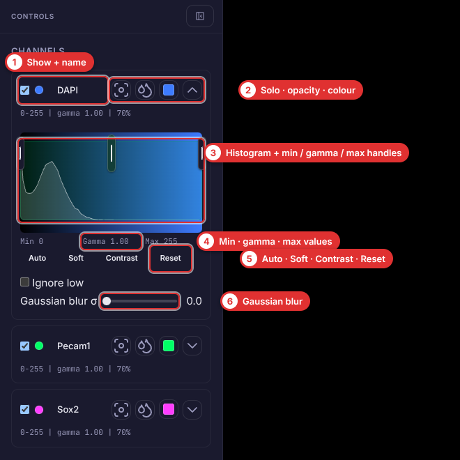{.shot width=100%}
:::
::: col
{width=100%}

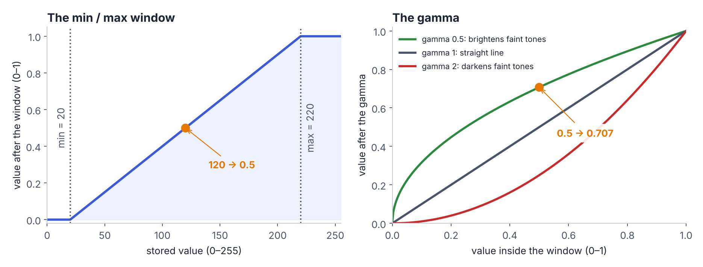{width=100%}
:::
::::

- **Min / Max**: everything below *min* becomes black, above *max* full colour.
- **Middle handle**: the level displayed at 50 %; it sets the gamma (gamma = ln 0.5 ÷ ln *m*).
- **Auto** clips the darkest and brightest 0.5 %; **Soft**, **Contrast** and **Reset** are presets.
- **Opacity**: 70 %, 42 % or 100 %; **Exposure**: from 0.2× to 5× for all channels; **Solo** isolates one channel.
- **Gaussian blur**: plane-by-plane smoothing (σ in voxels), available at qualities that fit in a single texture.
- A **colour-blindness simulation filter** checks that a figure stays readable.

::: warning
**A hidden setting.** Before your settings, the viewer also sets the faintest values of each channel to 0
(a “floor” between 6 and 48, estimated from the histogram), then stretches the rest. This is why the residual
noise disappears on screen. → ch. 11
:::

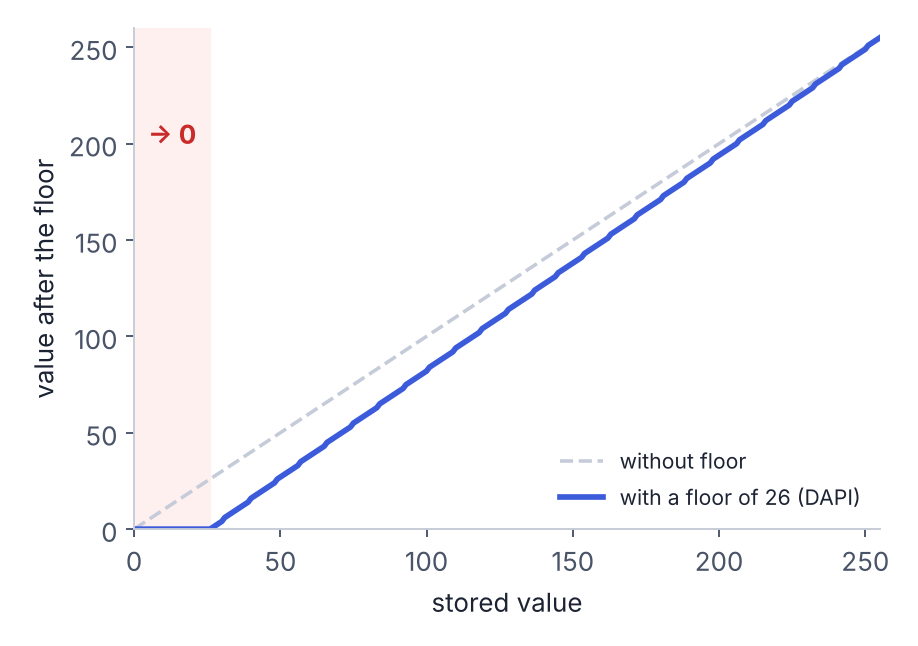{width=60%}

# 11. Measuring and exploring the inside

::: tldr
- **Measurements** are in **µm**, with the true voxel size, on the first visible structure under the click.
- **Oblique slice** and **Z-stack browser** show the inside, with an exact scale bar.
- The scale bar of the **3D view** is exact only at the depth of the sample's centre.
:::

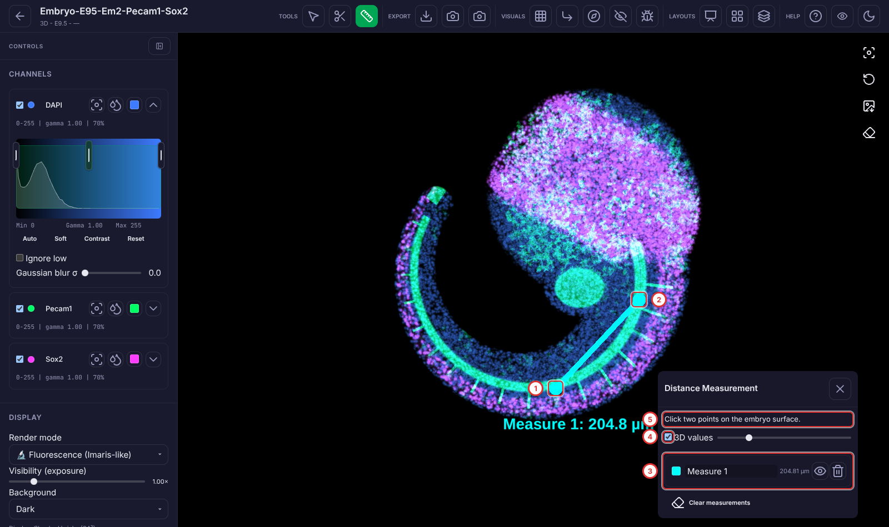{.shot width=70%}

:::: cols
::: col
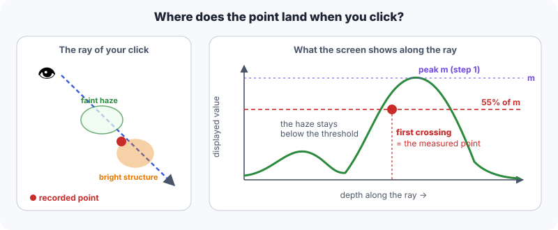{width=100%}
:::
::: col
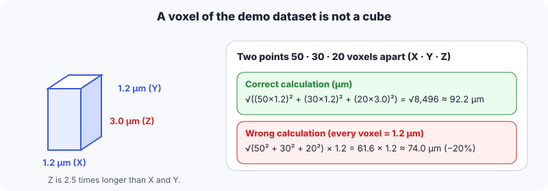{width=100%}
:::
::::

::: example
Two points 10 voxels apart in X and 4 voxels apart in Z, with voxels of 1.2 × 1.2 × 3 µm:
√((10 × 1.2)² + (4 × 3)²) = √(144 + 144) = **17 µm** — not √(10² + 4²) ≈ 10.8 “voxels”.
:::

::: warning
**Measurements are not saved on the server**: closing the tab erases them. Keep them by copying
the page address (they travel in the link) or by downloading the **measurements CSV** from the Download Center.
:::

:::: cols
::: col
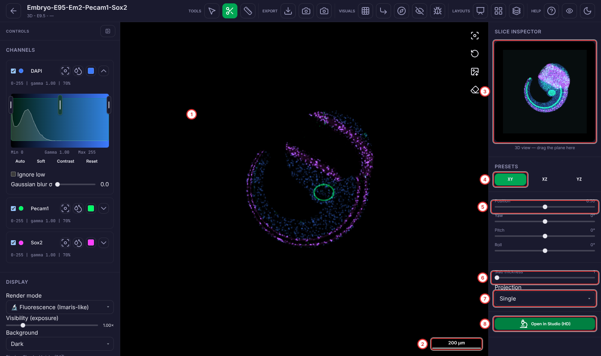{.shot width=100%}
:::
::: col
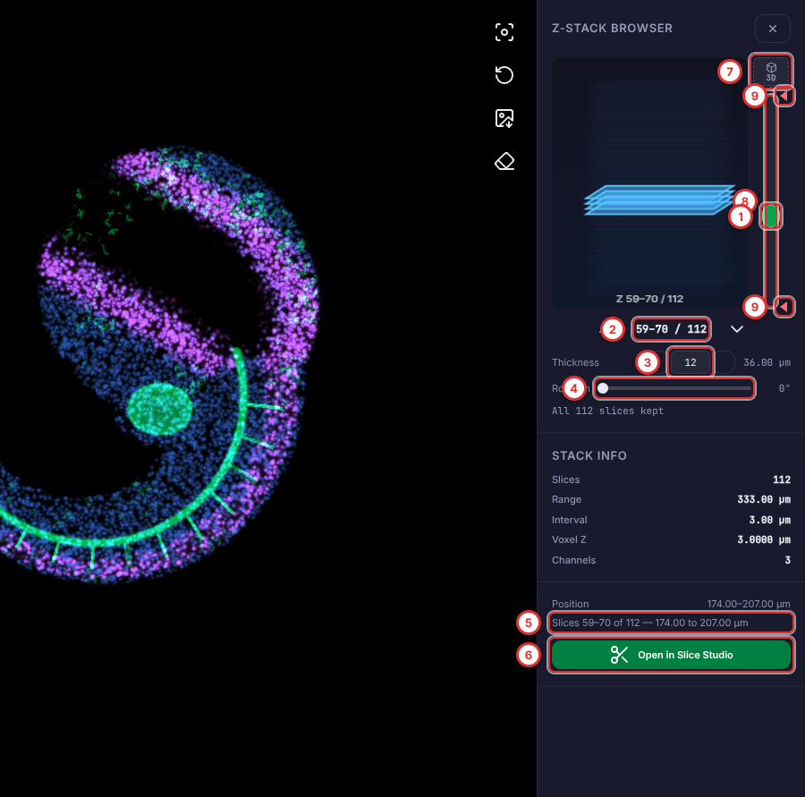{.shot width=100%}
:::
::::

- **Oblique slice**: a plane in any direction, shown large with an exact scale bar.
- **Z-stack browser**: it lays the stack flat (top face toward you), an adjustable thickness bar,
  handles to trim the top and bottom, a rotation from 0 to 360°. It is exclusive with the oblique slice.
- **Orientation axes**: the red / green / blue compass (R1/R2, G1/G2, B1/B2) defined by the administrator.

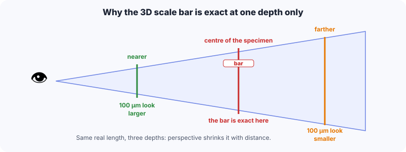{width=65%}

# 12. Making figures and exporting

::: tldr
- The **Studio** composes an annotated figure at **full resolution** (arrows, text, distances, scale bar).
- The 3D view exports **at any size**, with a transparent background if needed.
- **Compare** puts up to 4 datasets side by side, synchronised.
:::

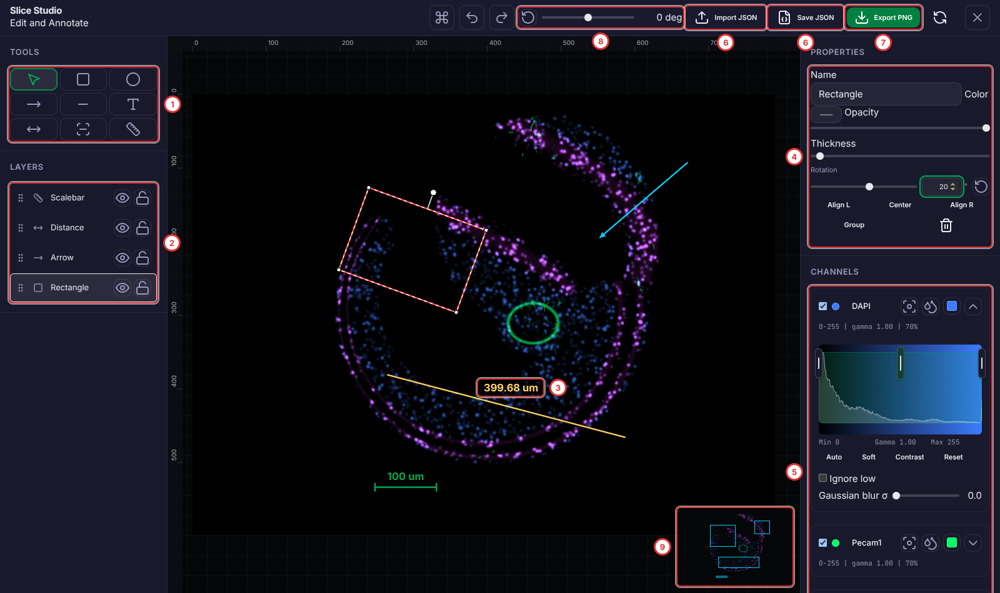{.shot width=70%}

- Opening a slice in the Studio reloads it **at native level** (XY planes or byte ranges), with a progress bar.
- **Channel colours** can be adjusted in the Studio without touching the annotations.
- Export as **PNG** (the figure) or **JSON** (to resume it later); above 5 MB, the export is refused with a message.

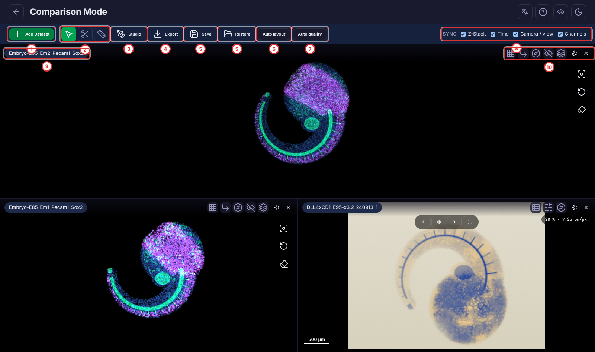{.shot width=70%}

| To… | Use |
|---|---|
| get a large, sharp image of the 3D view | **Export view** (rendered in 2,048 px tiles, transparent background possible) |
| take a quick capture | **Screenshot** |
| get the original files (`.ims`, TIFF, MIP) | **Download Center** (if the `download/` folder exists) |
| compare embryos or channels | **Compare** and **Decompose by channel** |
| share exactly what you see | the **page address**, or the workspace saved in Compare |

# 13. Timelapses and cell tracking

::: tldr
- The **timeline** plays the series at 0.5 to 20 frames per second; a bar shows the time points already loaded.
- The **cell tracking** is overlaid on the volume: cells, trajectories, embryo surface.
- Five analysis tools: trajectories, surface, cell inspector, charts, distance between cells.
:::

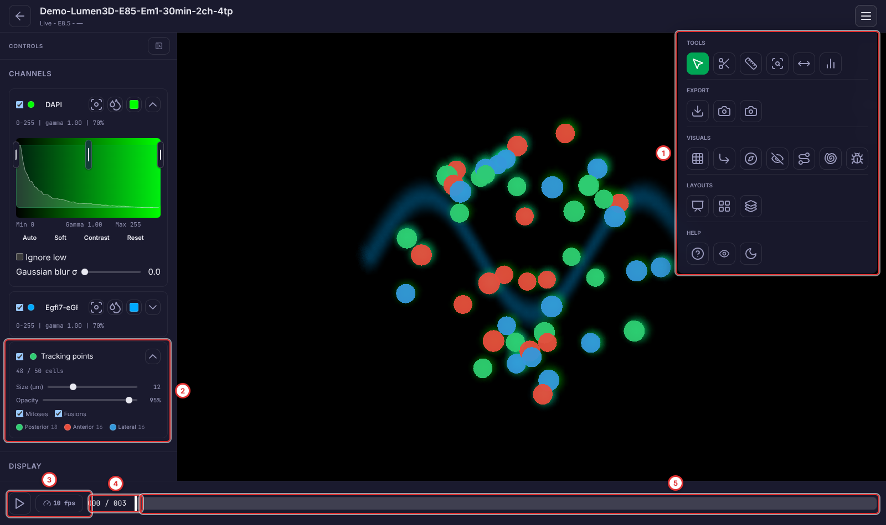{.shot width=70%}

:::: cols
::: col
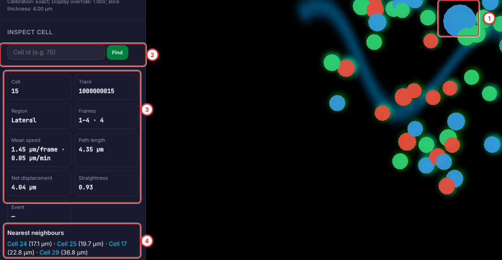{.shot width=100%}
:::
::: col
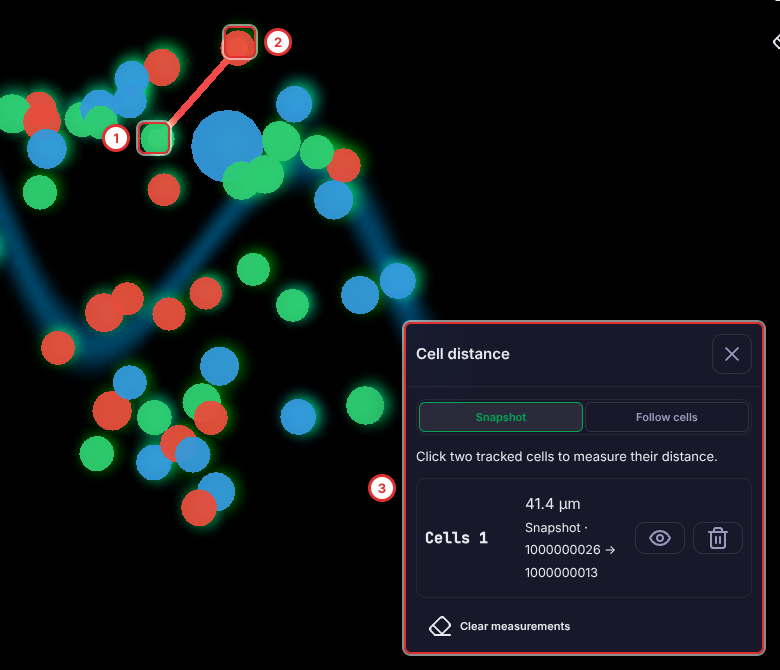{.shot width=100%}
:::
::::

- Playback **waits** for frames that have not arrived yet: it never silently skips a time point.
- The positions shown are the **stabilised** positions (§ 7); mitoses and fusions are marked.
- Charts (population, speed, neighbours, mitoses) and tables can be exported. → ch. 12 and 13

# 14. 2D photographs

::: tldr
- One calibrated photograph per dataset: zoom, scale bar, measurements in µm or mm.
- **Isolate the staining** brings out the X-gal staining (blue) on the tissue (yellow).
- A contact sheet browses every photograph of the collection.
:::

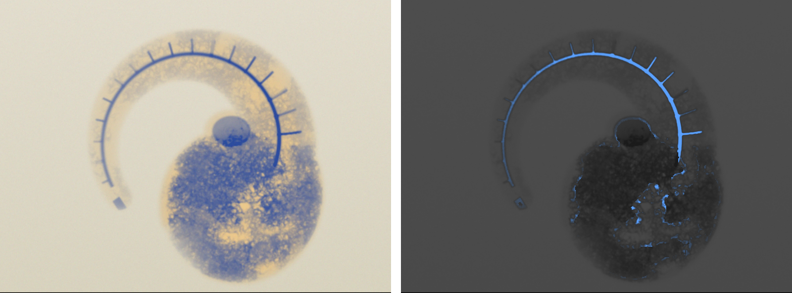{.shot width=75%}

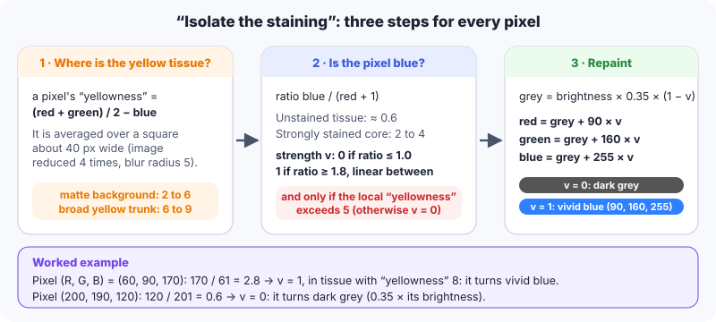{width=95%}

::: note
The photograph is stored as **lossy WebP (quality 90)** by default; the `--lossless` option keeps every
pixel exact, useful if you want to quantify the blue / red ratio. The calibration comes from the TIFF metadata
(ImageJ / Leica); without it, no scale bar. → ch. 13
:::

# 15. Interpreting what you see correctly

::: remember
- **Grey levels are relative.** Each channel of each dataset has its own window (floor → ceiling):
  an intensity cannot be compared between two channels or between two datasets. In a timelapse, the window is
  **shared by all time points**: a drop in intensity stays visible, as in reality.
- **Inside the signal, nothing is changed**; **outside the signal**, the noise is smoothed (3 × 3 × 3 median).
- **8 bits** are enough for morphology; to **quantify**, go back to the original `.ims` (in `download/` if the option was enabled).
- **Bricks that are not stored** are areas that really are 0 after cleaning, not lost data.
- **The display floor** (6 to 48) hides the faintest values on screen: lowering *min* will not bring them back.
- **At most 4 channels** are displayed at the same time.
- **Without calibration** in the file, no measurement in µm is offered.
- **The 3D view is in perspective**: measure with the measuring tool or on a slice, not with the 3D scale bar.
:::

## 15.1 What the platform does not do

| Not available | Why / what to do |
|---|---|
| Absolute intensity quantification | windowed 8-bit data: use the original `.ims` |
| Segmentation, automatic counting | do the analysis in Imaris or Fiji |
| Deconvolution | to be done before the Imaris export |
| Photobleaching compensation | measured by the pipeline, but not yet applied by the viewer |
| Editing voxels | everything is read-only; only the display can be adjusted |

→ ch. 20 (appendix “What Lumen3D does not do”)

# 16. What happens if… ?

| Situation | What the platform does | What you can do |
|---|---|---|
| The image is blurry at first | the coarse level arrives first, the detail follows | wait for the progress to finish |
| “Native” shows another level | not enough graphics memory: lighter level + message | choose 1024, close other 3D tabs |
| The graphics card “crashes” | the viewer reloads the view with reduced memory (at most 3 times in 2 minutes) | lower the quality, reload the page |
| A brick is corrupt | it is shown empty and counted, never shown wrong | tell the administrator |
| The import transfer stops | it resumes as soon as the network is back | drag the same folder again if needed |
| The dataset is not in the explorer | it is hidden, or still being imported | ask the administrator to publish / show it |
| A measurement click is refused | nothing visible under the cursor | click on a visible structure |
| The Gaussian blur is greyed out | the chosen quality is too large for a single texture | choose a lower quality |

→ ch. 19 (more than 60 situations in detail)

# 17. Words to know

::: glossary
Voxel
: The “pixel” of a volume: a small box, here 1.2 × 1.2 × 3.0 µm. → ch. 4

Channel
: The image of one fluorophore (DAPI, Pecam1…). → ch. 4

Floor / ceiling
: The two values that define the conversion to 8 bits: below the floor → 0, above the ceiling → 255. → ch. 5

Mask
: The voxels recognised as signal; only those outside the mask are smoothed. → ch. 5

Pyramid (levels)
: The smaller and smaller versions of the volume; level 0 is full resolution. → ch. 6

Brick
: A cube of 64³ voxels, the unit of cutting and downloading. → ch. 7

Lossless WebP
: The image format that stores the bricks while keeping every value exact. → ch. 6

MIP
: Maximum intensity projection: the strongest value along an axis is kept. → ch. 7 and 9

Ray casting
: The drawing method: one ray per pixel crosses the volume and combines the values it meets. → ch. 9

Gamma
: The exponent that brightens (< 1) or darkens (> 1) the mid-tones. → ch. 11

Histogram
: The chart that counts how many voxels have each value. → ch. 11

Stabilisation
: The rigid displacement that compensates for the embryo's drift in a timelapse. → ch. 8 and 13

Studio
: The workshop for annotated figures at full resolution. → ch. 12 and 13

Data format
: The version number of how a dataset's files are organised (1 to 4). → ch. 17
:::

::: see
**Full documentation** (“Lumen3D, from A to Z”): 21 chapters, more than 350 pages, every step illustrated.
**Administrator guide**: every screen of the panel, step by step. Both are published in the
*Documentation* tab of the administration panel.
:::
