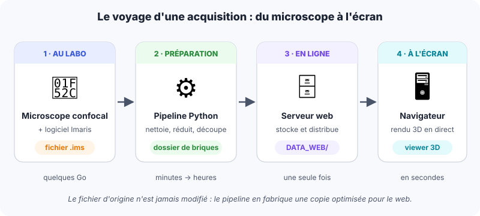
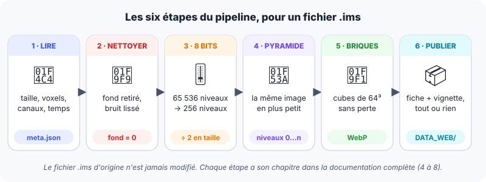
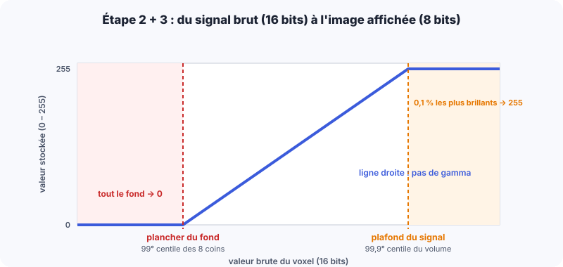
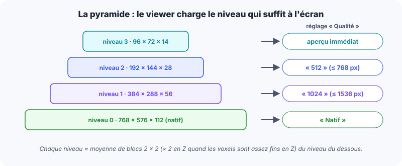
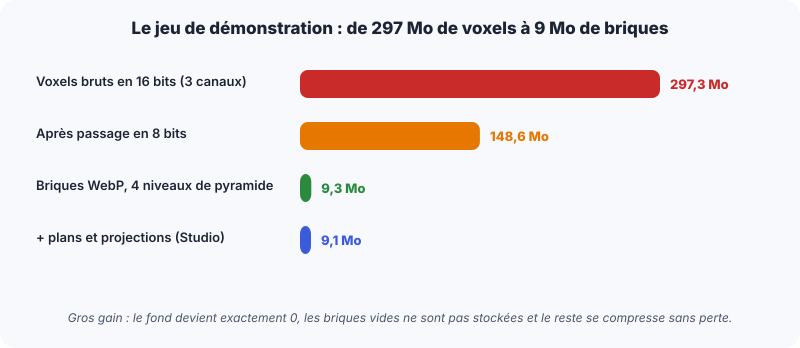
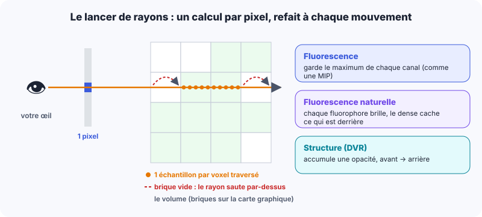
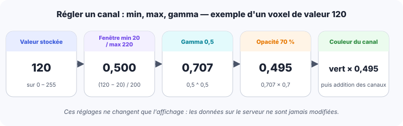

# 1. Lumen3D en une page

::: tldr
- Lumen3D affiche des volumes confocaux de **plusieurs gigaoctets** dans un simple navigateur, sans rien installer.
- Un **pipeline** prépare chaque fichier Imaris **une seule fois** ; le fichier d'origine n'est jamais modifié.
- Le **viewer** ne télécharge que ce dont l'écran a besoin, puis calcule l'image en 3D sur la carte graphique.
:::

{width=100%}

:::: cards
::: card
#### 3D
Un volume confocal : une pile de coupes, jusqu'à 4 canaux affichés.
:::
::: card
#### Live
Une série temporelle (timelapse) ; peut porter un **suivi cellulaire**.
:::
::: card
#### 2D
Une photographie calibrée (par exemple une coloration X-gal).
:::
::::

::: note
Ce document est un résumé. Les renvois **→ chapitre N** pointent vers la
**documentation complète** (« Lumen3D, de A à Z »), publiée au même endroit.
Les illustrations de volumes proviennent d'un **embryon de démonstration synthétique**.
:::

# 2. Votre fichier Imaris : ce qui est lu

::: tldr
- Un fichier `.ims` est un **classeur** (format HDF5) qui range l'image et ses informations.
- Le pipeline lit les **dimensions**, la **taille du voxel en µm**, les **noms des canaux** et les **heures** des temps.
- Seule l'image à pleine résolution est utilisée ; la calibration n'est **jamais inventée**.
:::

:::: cols
::: col
**Ce qui est lu**

| Information | Exemple (jeu de démonstration) |
|---|---|
| Voxels X × Y × Z | 768 × 576 × 112 |
| Étendue physique | 921,6 × 691,2 × 336 µm |
| Taille d'un voxel | 1,2 × 1,2 × 3,0 µm |
| Canaux | DAPI, Pecam1, Sox2 |
| Temps | 1 (3D) ou n (Live) |
:::
::: col
::: example
**La taille du voxel** n'est pas recopiée, elle est **calculée** :
étendue ÷ nombre de voxels.

921,6 µm ÷ 768 voxels = **1,2 µm** par voxel en X.

Les unités nm et mm sont converties en µm. Si l'étendue manque, le dataset est
marqué « non calibré » : pas de barre d'échelle, pas de mesure en µm.
:::
:::
::::

::: tip
**Le nom du fichier compte.** Le stade et l'embryon en sont extraits :
`…-E85-Em1-…` → stade **E8.5**, embryon **Em1** ; `E8-5` et `E8.5` donnent aussi **E8.5** ;
`E105` donne **E10.5**. Vous pouvez corriger ces valeurs ensuite dans le panneau d'administration.
:::

::: see
→ chapitre 4 (le voxel, les canaux, la structure d'un `.ims`) et chapitre 8 (lecture du nom de fichier).
:::

# 3. Le nettoyage : retirer le bruit de fond

::: tldr
- Le **plancher du bruit** est mesuré dans les **8 coins** du volume, là où il n'y a pas d'embryon.
- Autour du signal, rien n'est touché ; **hors du signal**, le bruit est lissé (filtre médian).
- L'image passe ensuite en **8 bits** par une simple règle de trois : le fond devient **0**.
:::

{width=100%}

## 3.1 Comment le fond est retiré

::: steps
1. **Plancher du fond** : on prend 8 petits cubes (jusqu'à 32 × 32 × 32 voxels) aux 8 coins du volume. Le plancher = la valeur sous laquelle se trouvent **99 %** de ces voxels de coin.
2. **Plafond du signal** : la valeur sous laquelle se trouvent **99,9 %** des voxels (un voxel sur 4 dans chaque direction est examiné).
3. **Masque du signal** : tout voxel qui dépasse **1,1 × le plancher**. Les pixels chauds isolés sont retirés (ouverture), puis le masque est **élargi de 3 voxels** pour protéger le halo naturel des cellules.
4. **Hors du masque** seulement : chaque voxel est remplacé par la **médiane** de son voisinage 3 × 3 × 3. Dans le masque, les voxels gardent **exactement** leur valeur d'origine.
5. **Passage en 8 bits** : ligne droite du plancher (→ 0) au plafond (→ 255).
:::

{width=92%}

::: example
Plancher = 4 000, plafond = 34 000 (valeurs brutes). Un voxel brut de **19 000** devient
255 × (19 000 − 4 000) ÷ (34 000 − 4 000) = **127** (la partie décimale est tronquée).
Un voxel à 3 500 (sous le plancher) devient **0** ; un voxel à 40 000 devient **255**.
:::

::: why
Une méthode automatique de seuillage (Otsu) et un débruitage par réseau de neurones
(Noise2Void) ont été essayés puis **retirés** (version 0.12.0) : ils créaient des
« taches » colorées artificielles. La méthode actuelle ne fait que retirer le fond de la caméra.
:::

::: see
→ chapitre 5 : chaque étape illustrée sur une vraie coupe, la fenêtre commune des timelapses,
le découpage en tuiles des très gros volumes.
:::

# 4. Réduire la taille sans perte

::: tldr
- **8 bits** au lieu de 16 : deux fois moins d'octets.
- Une **pyramide** de versions de plus en plus petites permet d'afficher vite, puis de préciser.
- Le volume est coupé en **briques** de 64 × 64 × 64 voxels, compressées **sans perte** (WebP) ; les briques vides ne sont **pas stockées**.
:::

{width=100%}

:::: cols
::: col
::: analogy
Comme une carte en ligne : on ne télécharge pas le monde entier, seulement les
**tuiles** visibles, d'abord floues puis nettes. Les briques sont les tuiles d'un volume.
:::
:::
::: col
::: example
Un bloc de 2 × 2 voxels valant 10, 11, 12 et 14 devient, au niveau du dessus,
(10 + 11 + 12 + 14 + 2) ÷ 4 = **12** (moyenne entière arrondie).
:::
:::
::::

{width=95%}

::: why
**Sans perte**, parce que ce sont des mesures : un format avec perte (JPEG) modifierait
les intensités. **WebP** plutôt que PNG parce qu'il est plus compact à qualité identique
et que le navigateur le décode très vite. Chaque brique est mise à plat en **une image**
(ses 66 coupes rangées en grille 9 × 8, bordure d'un voxel comprise).
:::

::: see
→ chapitre 6 (pyramide, compression, briques vides) et chapitre 7 (briques, mosaïques,
paquets, plans pour les coupes rapides).
:::

# 5. La publication

::: tldr
- Le pipeline écrit une **fiche** (`metadata.json`) : dimensions, calibration, canaux, stade.
- Pour un timelapse, il attache le **suivi cellulaire** s'il le trouve.
- Le dataset est construit à part puis publié **en une fois** : jamais de dataset à moitié copié.
:::

| Fichier publié | Rôle |
|---|---|
| `metadata.json` | la fiche du dataset (nom, stade, canaux, µm…) |
| `thumbnail.webp` | la vignette de l'explorateur (projection maximale en fausses couleurs) |
| `bricks/` | les briques de tous les niveaux + leur index |
| `planes/`, `mips/` | les coupes XY et les projections par couche, pour le Studio |
| `tracks.json`, `model.glb` | le suivi cellulaire et la surface de l'embryon (timelapses) |
| `download/` | (option) le `.ims` d'origine, un TIFF ImageJ, des projections PNG |

::: note
**Suivi cellulaire.** Le pipeline cherche, dans l'ordre : un fichier `.imaris_track`, les
objets *Spots/Tracks* dans le `.ims` lui-même, puis l'export Excel d'Imaris. Les positions sont
**stabilisées** : un déplacement rigide (rotation + translation, sans déformation) compense la
dérive de l'embryon entre deux temps.
:::

::: tip
Pour mettre un dataset en ligne : copier le dossier produit dans `DATA_WEB/` du serveur,
**ou** le glisser dans l'onglet **Import** du panneau d'administration (transfert reprenable,
vérifié). Un dataset importé est **masqué** jusqu'à ce que vous l'affichiez.
Si vous retraitez un dataset, vos réglages (nom, couleurs, orientation…) sont conservés.
:::

::: see
→ chapitre 8, et le Guide de l'administrateur (onglets Datasets et Import).
:::

# 6. À l'écran : le viewer 3D

::: tldr
- Le viewer charge d'abord le **niveau le plus grossier** (image immédiate), puis le niveau demandé, **en partant du centre**.
- Le choix **512 / 1024 / Natif** fixe le niveau de la pyramide ; si la carte graphique manque de mémoire, un niveau plus léger est pris et un message l'indique.
- L'image est **calculée** pour chaque pixel en lançant un rayon à travers le volume.
:::

{width=100%}

| Mode | Ce que vous voyez | Bon pour… |
|---|---|---|
| **Fluorescence** (par défaut) | le maximum de chaque canal le long du rayon, couleurs additionnées | repérer tout le signal, comme une MIP |
| **Fluorescence naturelle** | chaque fluorophore brille ; le dense cache ce qui est derrière | percevoir la profondeur et les formes |
| **Structure (DVR)** | une opacité accumulée de l'avant vers l'arrière | des surfaces et des volumes pleins |

::: analogy
Le processeur est un chef cuisinier ; la **carte graphique** est une brigade de milliers
de commis qui font tous le même petit geste en même temps. Calculer un pixel = un geste :
c'est pour cela que l'image 3D peut être recalculée des dizaines de fois par seconde.
:::

::: see
→ chapitre 9 (Three.js, lancer de rayons, formules des modes) et chapitre 10 (streaming,
mémoire de la carte graphique, timelapses).
:::

# 7. Régler l'affichage d'un canal

::: tldr
- Chaque canal a un **min**, un **max**, un **gamma**, une **opacité** et une **couleur** ; les canaux sont **additionnés**.
- L'histogramme montre la répartition des valeurs **0–255** du niveau le plus grossier (64 barres).
- Ces réglages ne changent **que l'affichage**, jamais les données.
:::

{width=100%}

:::: cols
::: col
**Les poignées de l'histogramme**

- **Min / Max** : tout ce qui est sous *min* devient noir, au-dessus de *max* pleine couleur.
- **Poignée du milieu** : le niveau affiché à **50 %** ; elle fixe le gamma
  (gamma = ln 0,5 ÷ ln *m*).
- **Auto** : coupe les 0,5 % les plus sombres et les 0,5 % les plus clairs.
:::
::: col
::: warning
Avant vos réglages, le viewer met aussi à **0** les valeurs les plus faibles d'un canal
(un « plancher » entre 6 et 48 estimé sur l'histogramme). Et au maximum **4 canaux**
sont affichés à la fois.
:::
:::
::::

::: see
→ chapitre 11 (fonction de transfert, histogrammes, filtre gaussien, simulation des daltonismes).
:::

# 8. Mesurer, couper, exporter

::: tldr
- La **mesure** utilise la vraie taille des voxels : le résultat est en **µm**, même si les voxels sont plus longs en Z.
- **Coupe oblique**, **navigateur Z-stack**, **Studio** et page **Comparer** donnent des figures prêtes à publier.
- Tout s'exporte : image à n'importe quelle taille, figure du Studio, mesures en CSV, lien de partage.
:::

::: example
Deux points séparés de 10 voxels en X et 4 voxels en Z, avec des voxels de 1,2 × 1,2 × 3 µm :
√((10 × 1,2)² + (4 × 3)²) = √(144 + 144) = **17 µm** — et non √(10² + 4²) ≈ 10,8 « voxels ».
:::

| Outil | Pour quoi faire |
|---|---|
| **Mesurer une distance** | cliquer deux points sur le volume ; le point est pris sur la première structure visible le long du rayon (un clic dans le vide est refusé) |
| **Coupe oblique** | voir le volume tranché selon n'importe quel plan, avec barre d'échelle exacte |
| **Navigateur Z-stack** | parcourir les coupes du dessus, régler l'épaisseur, rogner le haut et le bas |
| **Studio** | composer une figure (flèches, textes, barre d'échelle, distances) à pleine résolution |
| **Comparer** | jusqu'à 4 datasets côte à côte, synchronisés (caméra, temps, coupes, canaux) |
| **Suivi cellulaire** (Live) | trajectoires, surface, fiche d'une cellule, graphiques, distances entre cellules |

::: warning
La **barre d'échelle de la vue 3D** n'est exacte qu'à la profondeur du **centre de
l'échantillon** (vue en perspective : ce qui est plus proche paraît plus grand). Pour une
mesure précise, utilisez l'outil de mesure ou une coupe.
:::

::: see
→ chapitre 12 (chaque outil illustré, raccourcis clavier, page 2D et isolation de la coloration X-gal).
:::

# 9. À garder en tête pour interpréter vos images

::: remember
- **Les niveaux de gris sont relatifs.** Chaque canal de chaque dataset a sa propre fenêtre
  (plancher → plafond) : on ne compare pas une intensité entre deux canaux ou deux datasets.
  Pour un timelapse, la fenêtre est **commune à tous les temps** : une baisse d'intensité
  (photoblanchiment) reste visible, comme dans la réalité.
- **Hors du signal, le bruit est lissé** (médiane 3 × 3 × 3) ; **dans le signal**, rien n'est modifié.
- **8 bits** suffisent pour voir la morphologie ; pour quantifier, repartez du `.ims`
  d'origine (téléchargeable dans `download/` si l'option a été activée).
- **Les briques vides** (aucun voxel non nul après nettoyage) ne sont pas stockées : ce sont
  des zones réellement à 0, pas des données perdues.
- **Calibration** : sans taille de voxel dans le fichier, aucune mesure en µm n'est proposée.
:::

## Questions fréquentes

| Question | Réponse courte |
|---|---|
| Mon dataset s'affiche flou au début | Normal : le niveau grossier arrive d'abord, le détail suit (barre de progression). |
| « Natif » me donne un autre niveau | La carte graphique n'a pas assez de mémoire : un niveau plus léger est affiché, avec un message. |
| Mes couleurs ont changé | Les réglages de canal se font dans le viewer ; les couleurs par défaut se règlent dans l'administration. |
| Le dataset n'apparaît pas dans l'explorateur | Il est peut-être masqué ou encore en import : voir le Guide de l'administrateur. |
| Puis-je partager une vue ? | Oui : le lien de la page conserve l'état de la vue ; la page Comparer sait aussi enregistrer un espace de travail. |

::: see
**Documentation complète** : 15 chapitres, environ 100 pages, chaque étape illustrée.
**Guide de l'administrateur** : tous les écrans du panneau, pas à pas.
:::
