# 1. Lumen3D en deux pages

::: tldr
- Lumen3D affiche des volumes confocaux de **plusieurs gigaoctets** dans un simple navigateur, sans rien installer.
- Un **pipeline** prépare chaque fichier Imaris **une seule fois** ; le fichier d'origine n'est jamais modifié.
- Le **viewer** ne télécharge que ce dont l'écran a besoin, puis calcule l'image 3D sur la carte graphique.
:::

{width=100%}

## 1.1 Pourquoi une préparation est indispensable

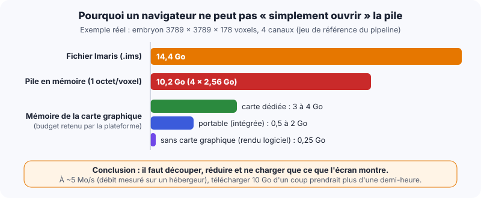{width=88%}

## 1.2 Trois types de jeux de données

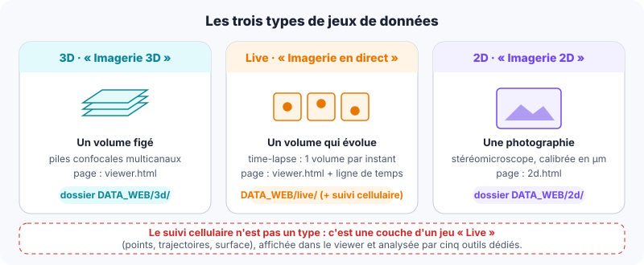{width=92%}

| Type | Ce que c'est | Page | Particularité |
|---|---|---|---|
| **3D** | une pile confocale, jusqu'à 4 canaux affichés | viewer 3D | outils de mesure, coupes, Studio |
| **Live** | une série temporelle (timelapse) | viewer 3D + frise | peut porter un **suivi cellulaire** |
| **2D** | une photographie calibrée (stéréomicroscope) | page 2D | isolation de la coloration X-gal |

::: note
Ce document est le résumé de la **documentation complète** (« Lumen3D, de A à Z », 21 chapitres).
Les renvois **→ ch. N** pointent vers le chapitre qui explique tout en détail. Les images de volumes
proviennent d'**embryons de démonstration synthétiques**, traités par le vrai pipeline.
:::

# 2. Avant le pipeline : préparer son acquisition

::: tldr
- Le **nom du fichier** donne le stade et le numéro d'embryon : choisissez-le bien.
- La **calibration** (taille du voxel) et le **nom des canaux** sont lus dans le fichier Imaris : vérifiez-les avant d'exporter.
- Pour un timelapse suivi, préparez la **source du suivi** (un des trois formats acceptés).
:::

## 2.1 Le nom du fichier : stade et embryon

Le pipeline lit le stade (`E…`) et l'embryon (`Em…`) dans le nom. Les règles exactes :

| Dans le nom | Stade lu | Embryon lu |
|---|---|---|
| `…-E8.5-Em1-…` ou `…-E8,5-…` | E8.5 | Em1 |
| `…-E8-5-…` (tiret : 25, 5 ou 75 seulement) | E8.5 | — |
| `…-E85-…` · `…-E105-…` · `…-E95-…` (forme compacte) | E8.5 · E10.5 · E9.5 | — |
| `…-E8-1-DAPI…` (le « 1 » n'est pas une fraction) | E8 | Em1 |
| `…-E95-2-…` | E9.5 | Em2 |
| aucun `E…` reconnu | « Unknown » | — |

Le nom du dossier publié est le nom du fichier, nettoyé (caractères autres que lettres, chiffres, `.`, `_`, `-` remplacés par `-`).
Tout cela se corrige ensuite dans l'administration. → ch. 8

## 2.2 Ce qu'Imaris doit contenir

:::: cols
::: col
**Vérifiez dans Imaris avant l'export :**

- **la calibration** (taille du voxel en X, Y, Z) : sans elle, pas de barre d'échelle ni de mesure en µm ;
- **le nom de chaque canal** (DAPI, Pecam1…) : un nom vide devient « Channel 1 », « Channel 2 »… ;
- pour un timelapse, **les heures** de chaque instant : l'intervalle retenu est la médiane des écarts.
:::
::: col
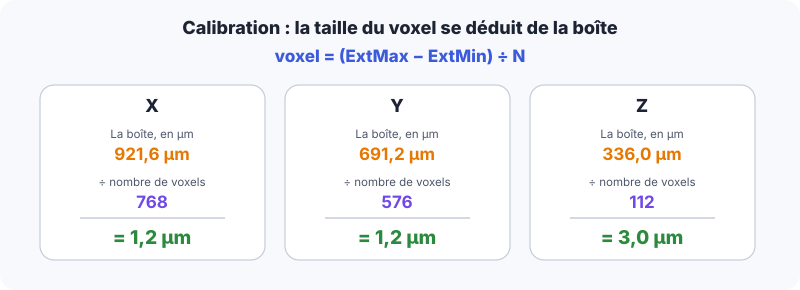{width=100%}
:::
::::

::: example
Le pipeline lit l'**étendue physique** (ExtMin → ExtMax) et la divise par le nombre de voxels.
921,6 µm sur 768 voxels → **1,2 µm** par voxel en X. 336 µm sur 112 coupes → **3,0 µm** en Z.
Les unités nm et mm sont converties en µm. Une calibration absente n'est **jamais inventée**.
:::

## 2.3 Couleurs, canaux, données 8 ou 16 bits

- Les **couleurs** d'Imaris ne sont pas reprises : chaque canal reçoit une couleur par défaut (vert, bleu ciel, magenta, rouge…), que l'administrateur change ensuite.
- Fichiers **8 ou 16 bits** : les deux sont acceptés. L'image publiée est toujours en 8 bits (§ 4).
- Plus de **4 canaux** : tous sont traités, mais le viewer n'en affiche que les 4 premiers.

## 2.4 Timelapse avec suivi cellulaire

Le pipeline cherche le suivi automatiquement, **dans cet ordre** :

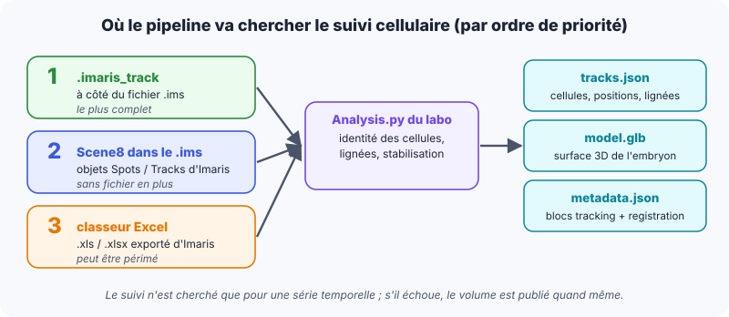{width=92%}

::: warning
Le classeur Excel exporté d'Imaris peut être **périmé** (mesuré sur un jeu du laboratoire : 155 des 172 spots).
Son nom doit contenir l'intervalle entre deux images (par ex. `30min`) : l'analyse le lit dans le nom.
Préférez les objets *Spots/Tracks* enregistrés dans le `.ims` lui-même.
:::

# 3. Lancer le pipeline

::: tldr
- Tout se lance avec **`RUN.bat`**, sur un PC Windows, depuis le **pack Pipeline** téléchargé dans l'onglet *Pipeline* de l'administration.
- Les `.ims` vont dans `input\`, le résultat sort dans `output\`.
- Le dataset est construit à part et n'apparaît qu'une fois **entièrement** terminé.
:::

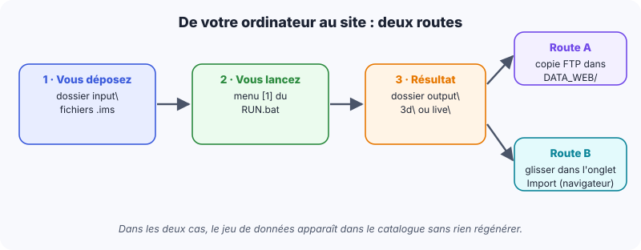{width=100%}

| Choix du menu `RUN.bat` | Ce que cela fait |
|---|---|
| `[1]` | Traiter des volumes Imaris (`.ims` → `output\`, suivi cellulaire inclus) |
| `[2]` | Analyse de tracking Imaris (Excel → `tracking\OUTPUT\`) |
| `[3]` | Importer des photographies 2D (`.tif` → `output\2d\`) |
| `[4]` | Attacher un suivi à un dataset déjà traité |
| `[5]` | Vérifier l'environnement seulement |

::: tip
Deux éditions du pack : **légère** (~3 Mo, télécharge Python au premier lancement) et **complète hors-ligne**
(~70 Mo, tout est embarqué). Les versions des bibliothèques sont figées : deux ordinateurs produisent les
**mêmes octets** à partir du même `.ims`. Retraiter un dataset déjà publié **conserve** vos réglages
(nom, couleurs, orientation, vue par défaut, galerie, visibilité). → ch. 8
:::

# 4. Le nettoyage de l'image

::: tldr
- Le pipeline pose **une seule question** à chaque voxel : *fait-il partie de l'embryon ?*
- **Oui** → sa valeur n'est **pas modifiée**. **Non** → il est remplacé par la **médiane** de ses voisins, ce qui le ramène presque toujours à **0**.
- Puis tout passe en **8 bits** par une simple règle de trois : le fond devient exactement **0**.
:::

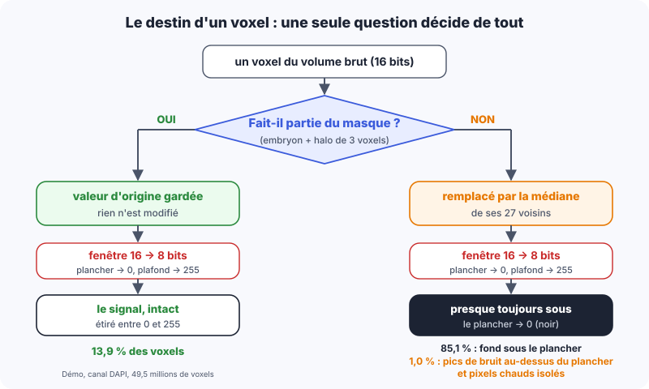{width=88%}

## 4.1 Les cinq repères, en une phrase chacun

| | Question | Réponse du pipeline |
|---|---|---|
| **Plancher** | À partir d'où est-ce du signal ? | la valeur sous laquelle se trouvent **99 %** des voxels des **8 coins** du volume (là où il n'y a pas d'embryon) |
| **Plafond** | Où mettre le blanc ? | la valeur sous laquelle se trouvent **99,9 %** des voxels (1 sur 4 dans chaque direction est examiné) |
| **Masque** | Où est l'embryon ? | les voxels **au-dessus de 1,1 × plancher**, **sans les points isolés**, plus un **halo de 3 voxels** |
| **Médiane** | Que faire du reste ? | chaque voxel hors masque prend la **valeur du milieu** de ses 27 voisins (cube 3 × 3 × 3) |
| **Fenêtre** | Comment passer en 8 bits ? | plancher → **0**, plafond → **255**, une ligne droite entre les deux |

::: example
Sur le canal DAPI du jeu de démonstration : plancher = **4 524**, plafond = **33 663**.
Un voxel brut de **20 000** devient 255 × (20 000 − 4 524) ÷ (33 663 − 4 524) = **135** (partie décimale tronquée).
Un voxel à 4 000 devient **0** ; un voxel à 40 000 devient **255**.
:::

## 4.2 Un exemple complet, voxel par voxel

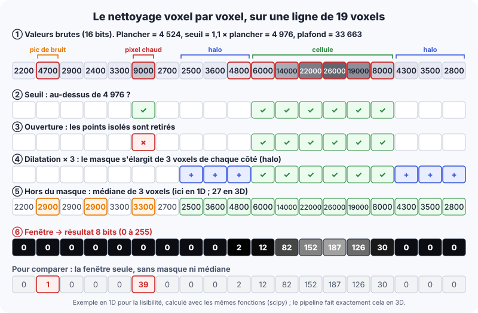{width=100%}

::: steps
1. **Seuil** : seuls la cellule et le pixel chaud (9 000) dépassent 4 976. Le pic de bruit (4 700) ne passe pas.
2. **Ouverture** : le pixel chaud est **seul**, il est retiré. La cellule, assez large, reste.
3. **Halo** : le masque s'élargit de 3 voxels autour de la cellule ; son bord faible (4 800) est protégé.
4. **Médiane** hors du masque : le pic de bruit 4 700 → 2 900, le pixel chaud 9 000 → 3 300.
5. **Fenêtre** : tout ce qui est sous le plancher → 0. La cellule va de 12 à 187, son bord faible donne 2.
:::

Dernière ligne de la figure : **sans masque ni médiane**, le pic de bruit et le pixel chaud resteraient visibles (1 et 39). Sur le volume entier, masque + médiane éliminent **97 %** de ces points parasites (341 674 → 10 069). → ch. 5

## 4.3 Sur une vraie coupe

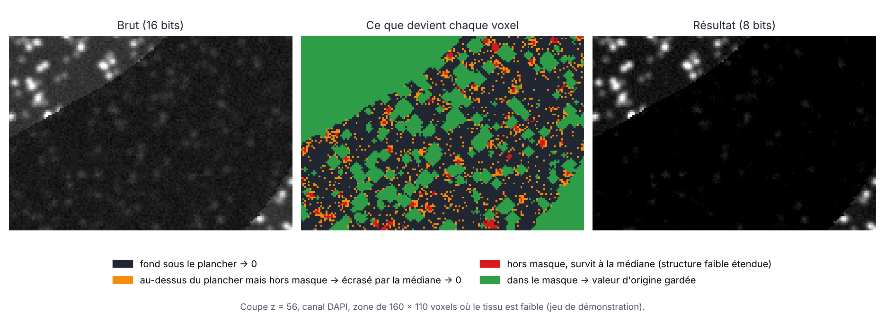{width=100%}

## 4.4 La limite à connaître : la taille minimale

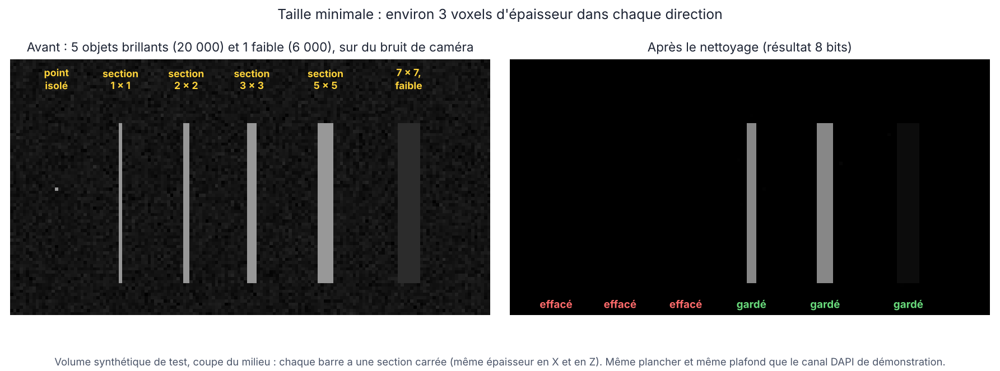{width=88%}

::: warning
**Un objet plus fin qu'environ 3 voxels dans une direction est effacé, même très brillant** (un point, un fil, une feuille d'un voxel d'épaisseur). Avec des voxels de 1,2 × 1,2 × 3 µm, cela fait **3,6 µm en X et Y, 9 µm en Z** : un objet présent sur une ou deux coupes seulement peut disparaître. Calculez avec **vos** tailles de voxel ; en cas de doute, comparez avec le `.ims` d'origine. Un objet fin **collé** (à moins de 3 voxels) à un objet plus épais est protégé par le halo. → ch. 5
:::

## 4.5 Pour un timelapse : une fenêtre commune

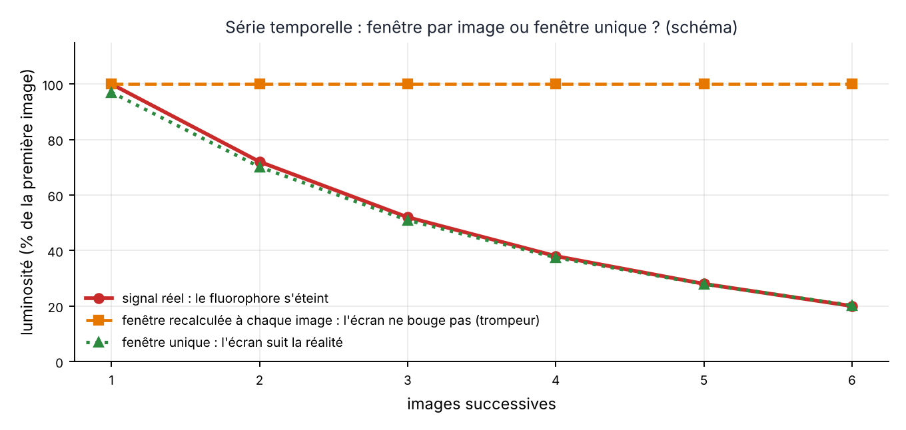{width=70%}

Le plancher et le plafond sont calculés sur **jusqu'à 8 instants** répartis dans la série. Le niveau de
signal de chaque instant est **enregistré** dans `metadata.json`, mais aucun réglage du viewer ne l'utilise
encore : une série qui s'éteint s'affiche réellement plus sombre.

::: why
Une méthode de seuillage automatique (Otsu) et un débruitage par réseau de neurones (Noise2Void) ont été
essayés puis **retirés** en version 0.12.0 : ils créaient des « taches » colorées artificielles. → ch. 5
:::

# 5. Réduire la taille sans perte

::: tldr
- **8 bits** au lieu de 16 : deux fois moins d'octets.
- Une **pyramide** de versions de plus en plus petites permet d'afficher vite, puis de préciser.
- Le volume est coupé en **briques** de 64³ voxels compressées **sans perte** ; les briques vides ne sont **pas stockées**.
:::

## 5.1 La pyramide

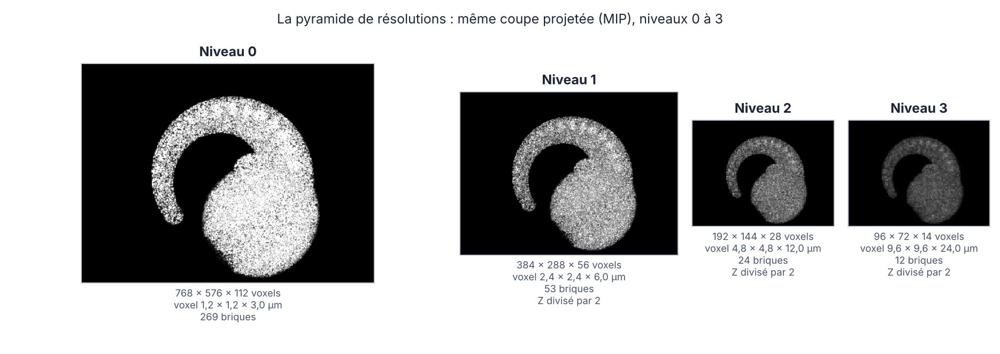{width=85%}

- X et Y sont divisés par 2 à chaque niveau ; **Z seulement tant que** le voxel en Z ne devient pas plus de 1,5 fois plus grand qu'en XY.
- La moyenne est **entière, arrondie au plus proche**. On s'arrête quand le plus grand côté fait 128 voxels ou moins.
- Le niveau 0 est l'image nettoyée telle quelle, **jamais rééchantillonnée**. → ch. 6

## 5.2 Compression sans perte

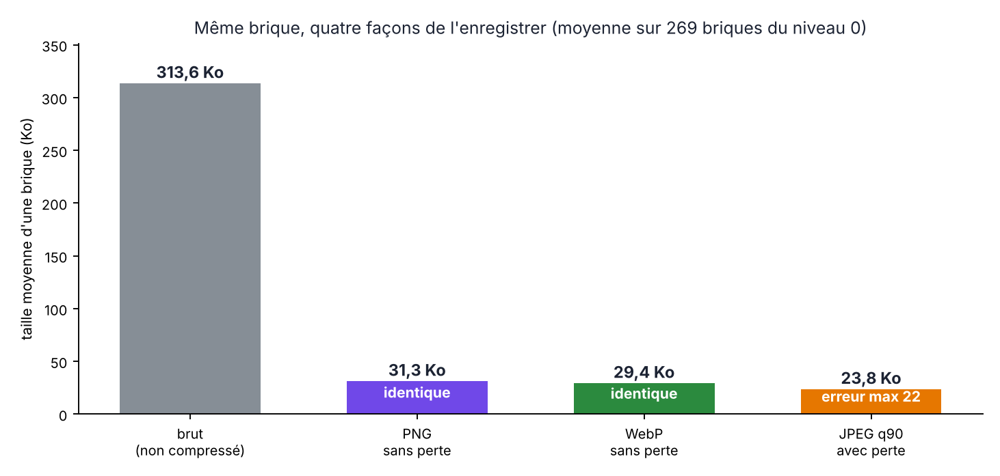{width=65%}

| Format | Taille moyenne | Valeurs exactes ? |
|---|---|---|
| Brut | 313,6 Ko | oui |
| PNG (meilleure compression) | 31,3 Ko | oui |
| **WebP sans perte** (choisi) | **29,4 Ko** | oui |
| JPEG qualité 90 | 23,8 Ko | **non** : jusqu'à 22 niveaux d'écart, 11,7 % des voxels modifiés |

::: why
Ce sont des **mesures** : une compression avec perte inventerait du signal (2,2 % des voxels à 0 deviennent non nuls en JPEG).
Le WebP est un peu plus compact que le PNG et le navigateur le décode très vite. → ch. 6
:::

## 5.3 Les briques vides ne sont pas stockées

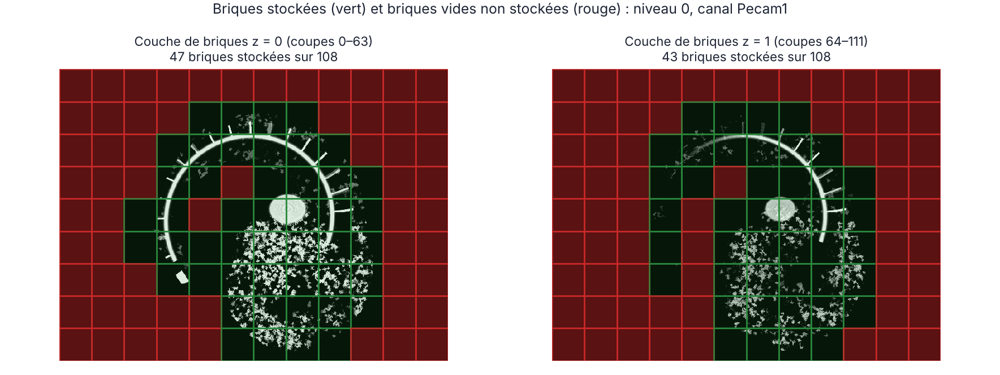{width=70%}

Une brique n'est stockée que si **au moins un voxel** de son intérieur vaut 1 ou plus.
Sur le jeu de démonstration : **358 briques stockées sur 777** possibles.

{width=85%}

# 6. Les briques et les formats

::: tldr
- Une brique = **64³ voxels** utiles + une **bordure d'un voxel**, rangée à plat dans **une image** WebP.
- Les briques sont regroupées en **paquets** ; un petit **index** dit où trouver chacune.
- Des **plans** XY et des **projections par couche** accélèrent les figures du Studio.
:::

:::: cols
::: col
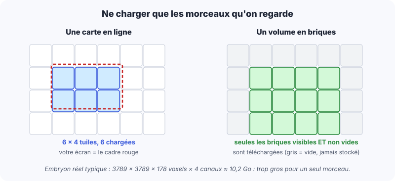{width=100%}
:::
::: col
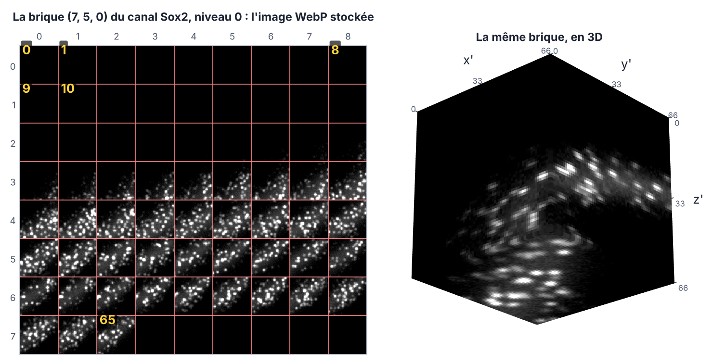{width=100%}
:::
::::

- **La bordure** copie le voxel voisin : l'image peut être lissée sans couture visible entre deux briques. → ch. 7
- **Les plans** (`planes/`) : une coupe XY à pleine résolution lit **94 Ko au lieu de 5 078 Ko** sur le jeu de démonstration.
- **Les formats** : un dataset porte un numéro de format (1 à 4, le plus récent est 4). Le pipeline 0.21.0 écrit
  directement le format 4. Un ancien dataset se met à jour depuis l'onglet *Mises à jour des données*, sans retraitement. → ch. 17

# 7. La fin du pipeline

::: tldr
- Le pipeline écrit une **fiche** (`metadata.json`), une **vignette**, les **histogrammes** des canaux.
- Il attache le **suivi cellulaire** d'un timelapse et **stabilise** les positions.
- Il publie **tout ou rien** : jamais de dataset à moitié copié.
:::

| Fichier publié | Rôle |
|---|---|
| `metadata.json` | la fiche : nom, stade, dimensions, calibration, canaux, format |
| `thumbnail.webp` | la vignette de l'explorateur (projection maximale en fausses couleurs) |
| `bricks/` | les briques de tous les niveaux et leur index |
| `planes/`, `mips/` | plans XY et projections par couche de 64 plans |
| `tracks.json`, `model.glb` | suivi cellulaire et surface de l'embryon (timelapses) |
| `download/` | (option) le `.ims` d'origine, un TIFF ImageJ, des projections PNG, un README |

:::: cols
::: col
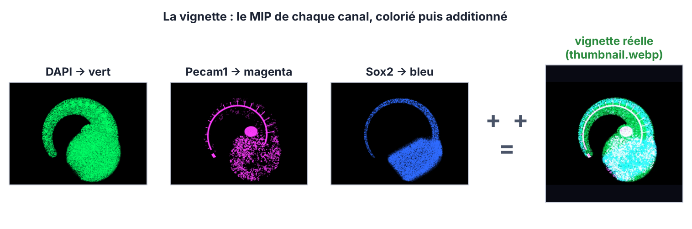{width=100%}
:::
::: col
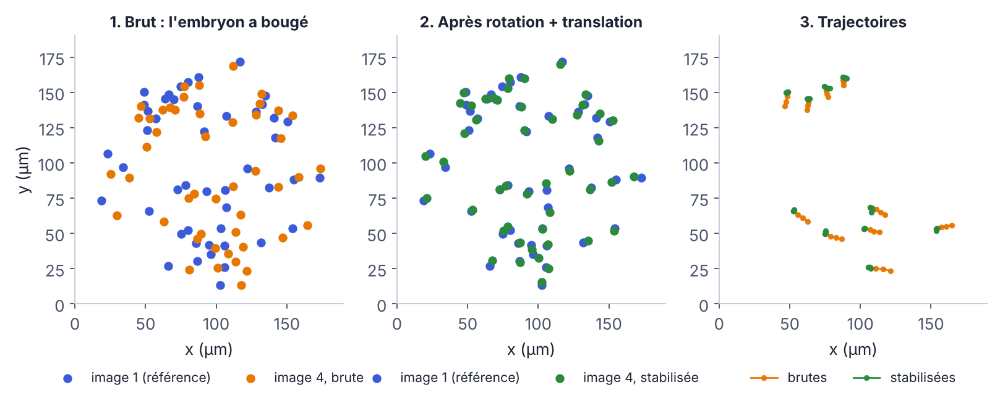{width=100%}
:::
::::

::: note
**Stabilisation.** L'embryon bouge pendant l'acquisition. Pour chaque instant, le pipeline calcule le
déplacement **rigide** qui superpose au mieux les cellules (méthode de Kabsch, au moins 3 cellules de
référence). Le viewer applique ce déplacement **au regard**, pas aux voxels : aucun voxel n'est rééchantillonné. → ch. 8 et 13
:::

# 8. Mettre en ligne et régler le dataset

::: tldr
- Deux voies : **copier** le dossier dans `DATA_WEB/` du serveur, ou le **glisser** dans l'onglet *Import* de l'administration.
- Un dataset importé est **masqué** jusqu'à ce que vous l'affichiez.
- L'administration règle le nom, le stade, les couleurs, la calibration, l'**orientation** et la **vue par défaut**.
:::

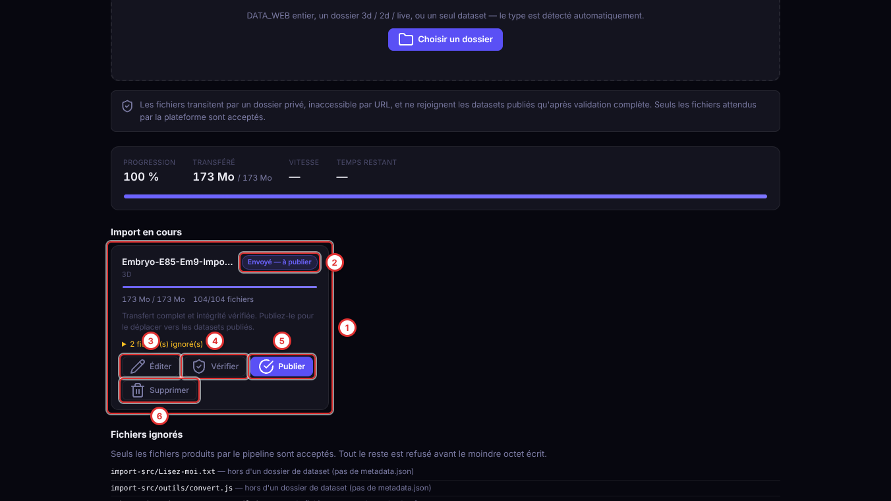{.shot width=70%}

- Le transfert **reprend tout seul** après une coupure : il suffit de reglisser le même dossier (pendant 7 jours).
- L'ordre d'envoi est pensé pour vous : la fiche, la vignette et le **niveau le plus grossier** partent en premier,
  si bien que le dataset est **réglable en quelques minutes**, pendant que le reste arrive.
- Seuls les fichiers produits par le pipeline sont acceptés. → Guide de l'administrateur, ch. 4

## 8.1 Les réglages qui comptent pour vous

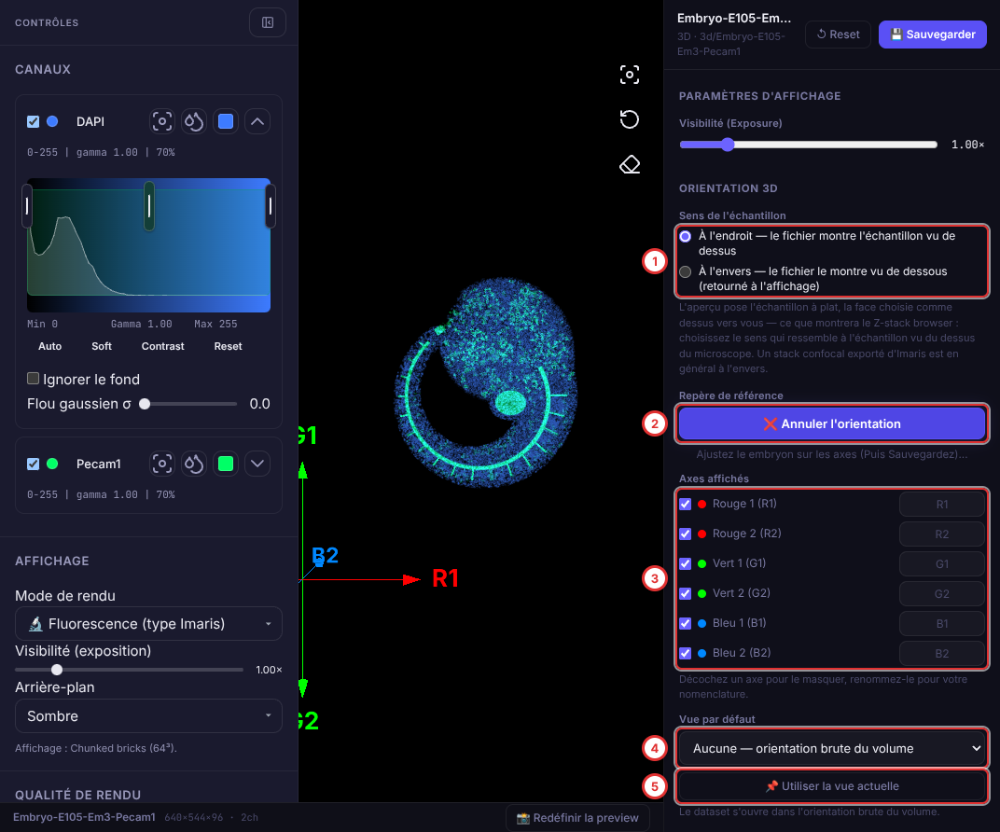{.shot width=55%}

| Réglage | À quoi il sert |
|---|---|
| **Nom, stade, embryon, description** | ce que lisent les visiteurs dans l'explorateur |
| **Couleurs des canaux** | la couleur par défaut de chaque canal à l'ouverture |
| **Calibration** | corriger une taille de voxel absente ou fausse |
| **Sens de l'échantillon** | « À l'envers » pour une pile vue de dessous (cas fréquent d'un export Imaris) : le navigateur Z-stack montrera la bonne face |
| **Définir l'orientation** | aligner les axes rouge / vert / bleu sur l'anatomie, puis les renommer (antérieur, dorsal…) |
| **Vue par défaut** | la pose dans laquelle le dataset s'ouvre |
| **Galerie** | joindre des figures annotées, visibles dans le viewer |
| **Visibilité** | afficher ou masquer le dataset dans l'explorateur public |

# 9. Explorer en 3D

::: tldr
- Ouvrez un dataset depuis l'**explorateur** (recherche, filtres par type et par stade).
- Le viewer affiche d'abord une **image grossière**, puis le détail arrive **en partant du centre**.
- Trois **modes de rendu** pour trois questions différentes.
:::

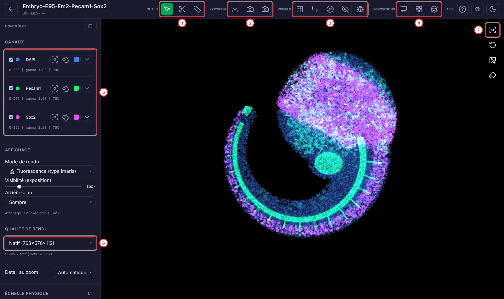{.shot width=70%}

## 9.1 Qualité et chargement

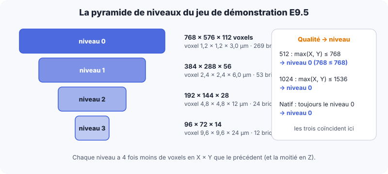{width=72%}

| Qualité | Niveau chargé |
|---|---|
| **512** (par défaut) | le niveau le plus fin dont le grand côté XY ne dépasse pas **768** px |
| **1024** | le niveau le plus fin dont le grand côté ne dépasse pas **1 536** px |
| **Natif** | le niveau 0, pleine résolution |

Si la carte graphique n'a pas assez de mémoire, le viewer prend **le niveau suivant plus léger** et le dit
dans un message. Une ligne de progression indique la qualité, le pourcentage et l'étape en cours. → ch. 10

## 9.2 Comment l'image est calculée

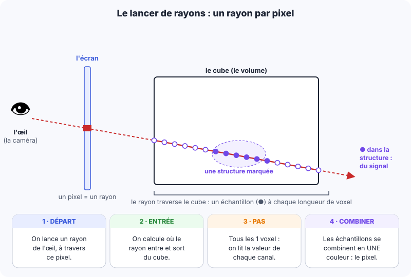{width=85%}

L'image n'est pas une photo : elle est **recalculée** à chaque mouvement par la carte graphique, des milliers
de pixels en parallèle (Three.js + WebGL2). Pendant que vous faites tourner, la définition baisse un peu pour
rester fluide ; à l'arrêt, elle revient au maximum (un échantillon par voxel). Les briques vides sont sautées. → ch. 9

## 9.3 Les trois modes de rendu

:::: cols3
::: col
{width=100%}
:::
::: col
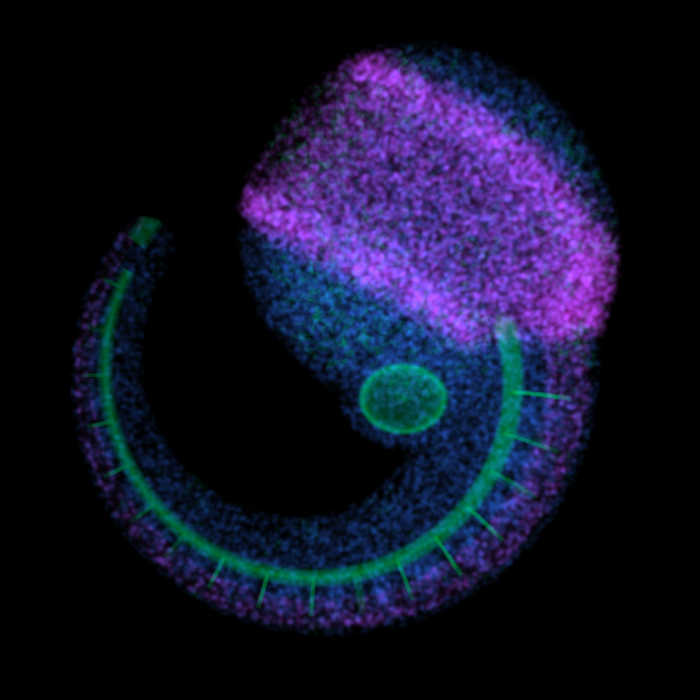{width=100%}
:::
::: col
{width=100%}
:::
::::

| Mode | Ce que vous voyez | Bon pour… |
|---|---|---|
| **Fluorescence** | le **maximum** de chaque canal le long du rayon, couleurs additionnées, sans profondeur | voir tout le signal, comme une MIP |
| **Fluorescence naturelle** | chaque fluorophore brille ; ce qui est dense **cache** ce qui est derrière | percevoir la forme et la profondeur |
| **Structure (DVR)** | une opacité accumulée de l'avant vers l'arrière | des surfaces et des volumes pleins |

# 10. Régler l'affichage d'un canal

::: tldr
- Chaque canal a un **min**, un **max**, un **gamma**, une **opacité** et une **couleur** ; les canaux sont **additionnés**.
- L'**histogramme** montre la répartition des valeurs 0–255 du niveau le plus grossier, en 64 barres.
- Ces réglages ne changent **que l'affichage**, jamais les données.
:::

:::: cols-wide-right
::: col
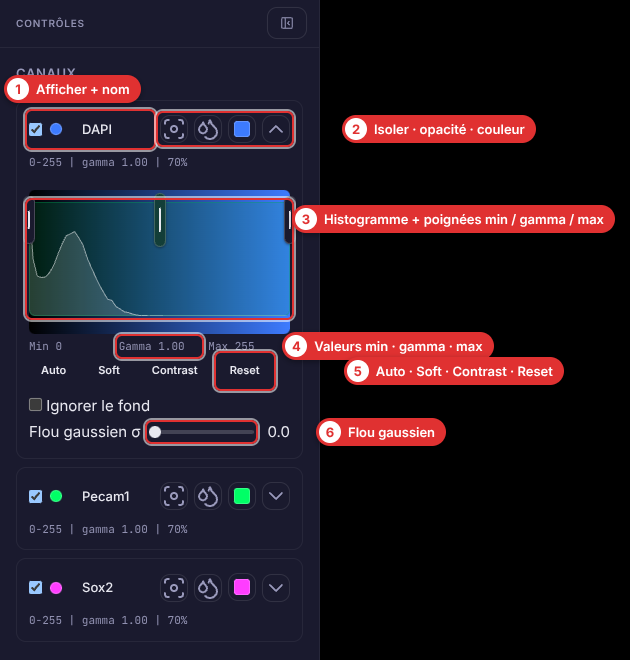{.shot width=100%}
:::
::: col
{width=100%}

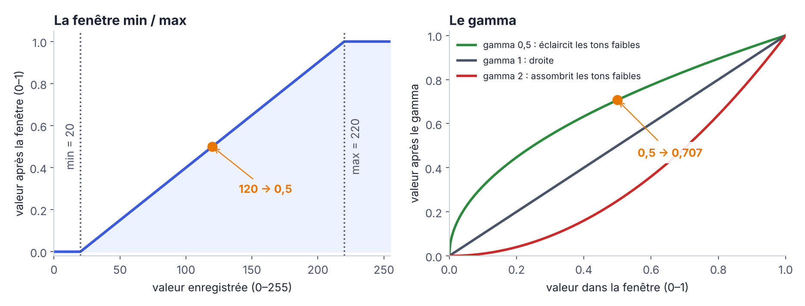{width=100%}
:::
::::

- **Min / Max** : tout ce qui est sous *min* devient noir, au-dessus de *max* pleine couleur.
- **Poignée du milieu** : le niveau affiché à 50 % ; elle règle le gamma (gamma = ln 0,5 ÷ ln *m*).
- **Auto** coupe les 0,5 % les plus sombres et les plus clairs ; **Doux**, **Contraste** et **Réinit.** sont des préréglages.
- **Opacité** : 70 %, 42 % ou 100 % ; **Exposition** : de 0,2× à 5× pour tous les canaux ; **Solo** isole un canal.
- **Flou gaussien** : lissage plan par plan (σ en voxels), disponible aux qualités qui tiennent en une seule texture.
- Un **filtre de simulation des daltonismes** vérifie qu'une figure reste lisible.

::: warning
**Un réglage caché.** Avant vos réglages, le viewer met aussi à 0 les valeurs les plus faibles de chaque canal
(un « plancher » entre 6 et 48, estimé sur l'histogramme), puis étire le reste. C'est pourquoi le bruit résiduel
disparaît à l'écran. → ch. 11
:::

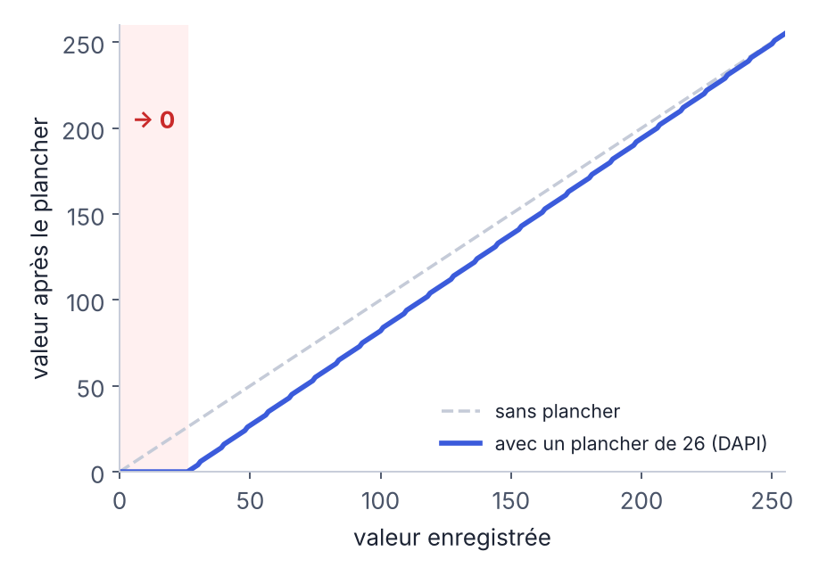{width=60%}

# 11. Mesurer et explorer l'intérieur

::: tldr
- La **mesure** se fait en **µm**, avec la vraie taille des voxels, sur la première structure visible sous le clic.
- **Coupe oblique** et **navigateur Z-stack** montrent l'intérieur, avec une barre d'échelle exacte.
- La barre d'échelle de la **vue 3D** n'est exacte qu'à la profondeur du centre de l'échantillon.
:::

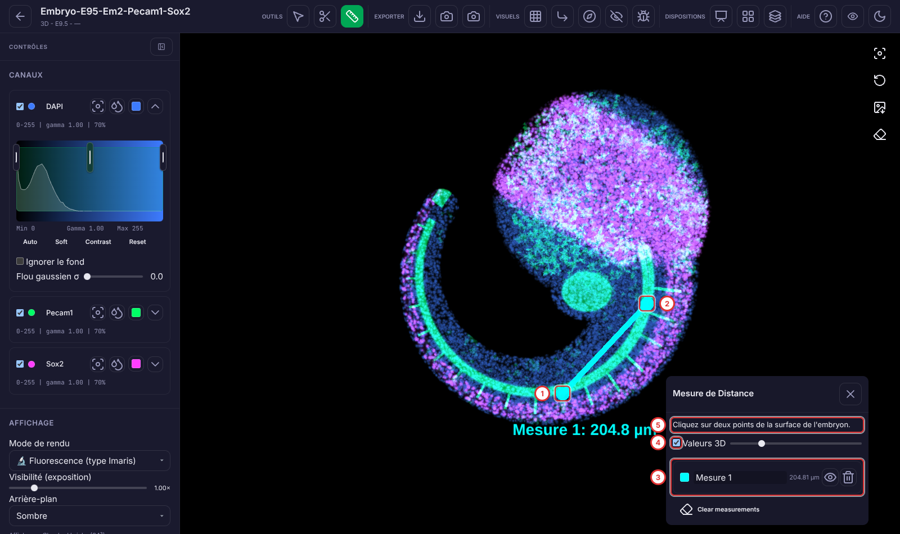{.shot width=70%}

:::: cols
::: col
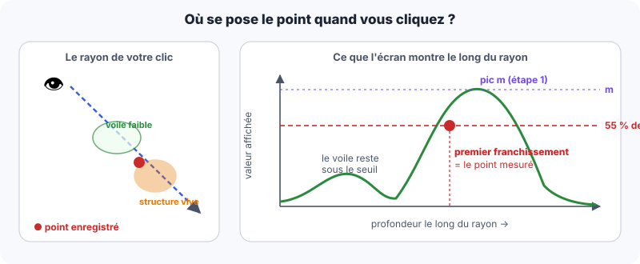{width=100%}
:::
::: col
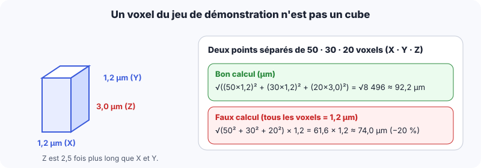{width=100%}
:::
::::

::: example
Deux points séparés de 10 voxels en X et 4 voxels en Z, avec des voxels de 1,2 × 1,2 × 3 µm :
√((10 × 1,2)² + (4 × 3)²) = √(144 + 144) = **17 µm** — et non √(10² + 4²) ≈ 10,8 « voxels ».
:::

::: warning
**Les mesures ne sont pas sauvegardées sur le serveur** : fermer l'onglet les efface. Gardez-les en copiant
l'adresse de la page (elles voyagent dans le lien) ou en téléchargeant le **CSV des mesures** dans le Centre de téléchargement.
:::

:::: cols
::: col
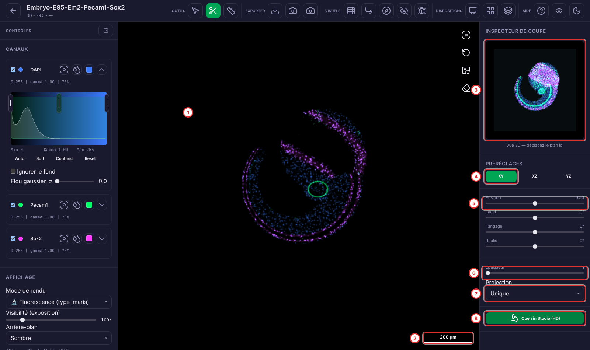{.shot width=100%}
:::
::: col
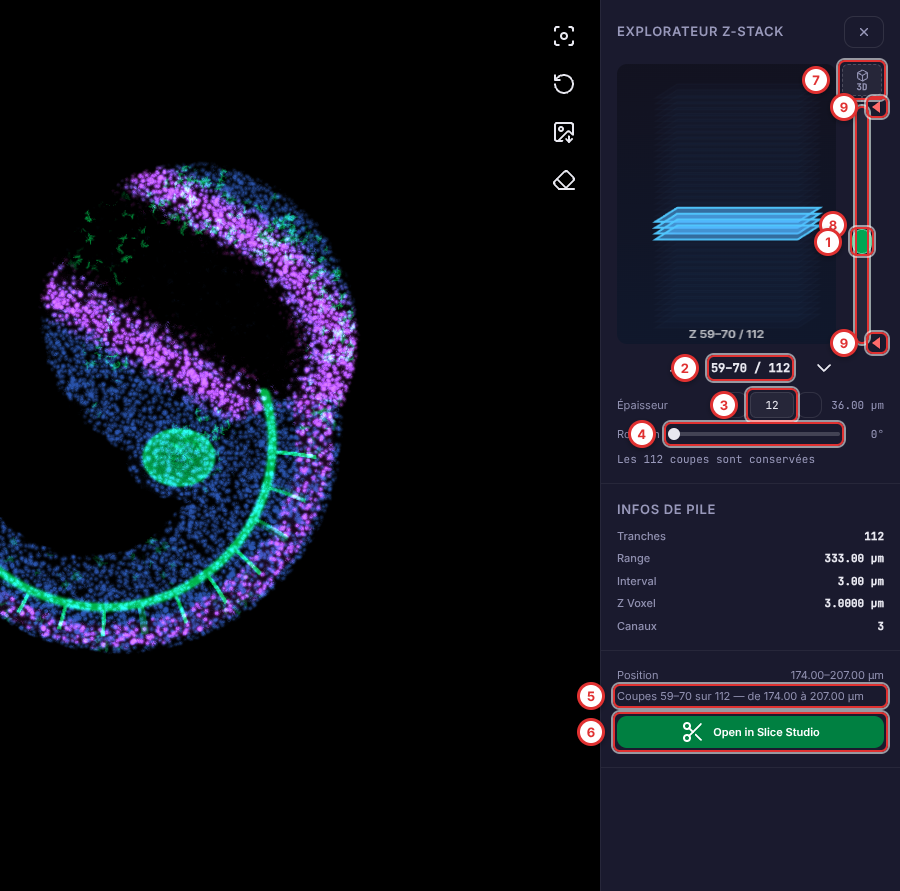{.shot width=100%}
:::
::::

- **Coupe oblique** : un plan dans n'importe quelle direction, affiché en grand avec une barre d'échelle exacte.
- **Navigateur Z-stack** : il couche la pile à plat (face du dessus vers vous), une barre d'épaisseur réglable,
  des poignées pour rogner le haut et le bas, une rotation de 0 à 360°. Il est exclusif avec la coupe oblique.
- **Axes d'orientation** : la boussole rouge / vert / bleu (R1/R2, G1/G2, B1/B2) définie par l'administrateur.

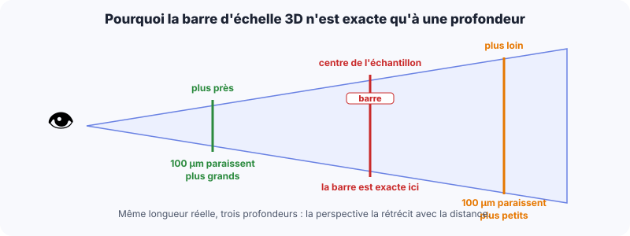{width=65%}

# 12. Faire des figures et exporter

::: tldr
- Le **Studio** compose une figure annotée à **pleine résolution** (flèches, textes, distances, barre d'échelle).
- La vue 3D s'exporte **à n'importe quelle taille**, avec fond transparent si besoin.
- **Comparer** met jusqu'à 4 jeux côte à côte, synchronisés.
:::

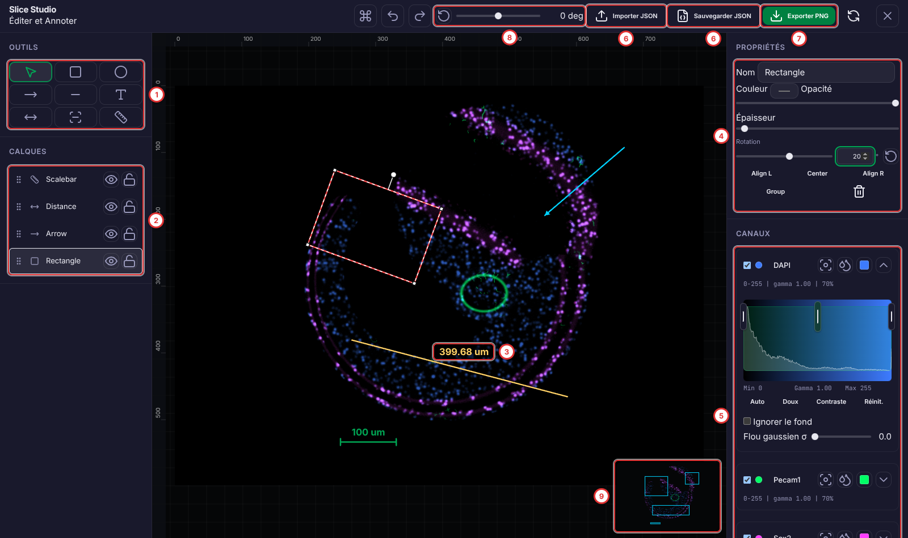{.shot width=70%}

- Ouvrir une coupe dans le Studio la recharge **au niveau natif** (plans XY ou plages d'octets), avec une progression.
- Les **couleurs des canaux** se règlent dans le Studio sans toucher aux annotations.
- Export **PNG** (la figure) ou **JSON** (pour la reprendre plus tard) ; au-delà de 5 Mo, l'export est refusé avec un message.

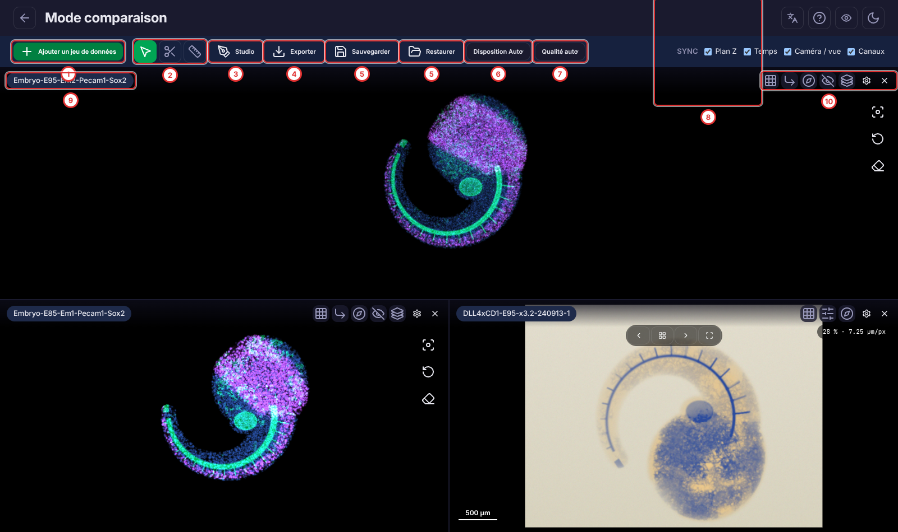{.shot width=70%}

| Pour… | Utilisez |
|---|---|
| une image de la vue 3D, grande et nette | **Exporter la vue** (rendu par tuiles de 2 048 px, fond transparent possible) |
| une capture rapide | **Capture d'écran** |
| les fichiers d'origine (`.ims`, TIFF, MIP) | **Centre de téléchargement** (si le dossier `download/` existe) |
| comparer des embryons ou des canaux | **Comparer** et **Décomposer par canal** |
| partager exactement ce que vous voyez | l'**adresse de la page** ou l'espace de travail enregistré dans Comparer |

# 13. Timelapses et suivi cellulaire

::: tldr
- La **frise** lit la série de 0,5 à 20 images par seconde ; une barre montre les instants déjà chargés.
- Le **suivi cellulaire** se superpose au volume : cellules, trajectoires, surface de l'embryon.
- Cinq outils d'analyse : trajectoires, surface, inspecteur de cellule, graphiques, distance entre cellules.
:::

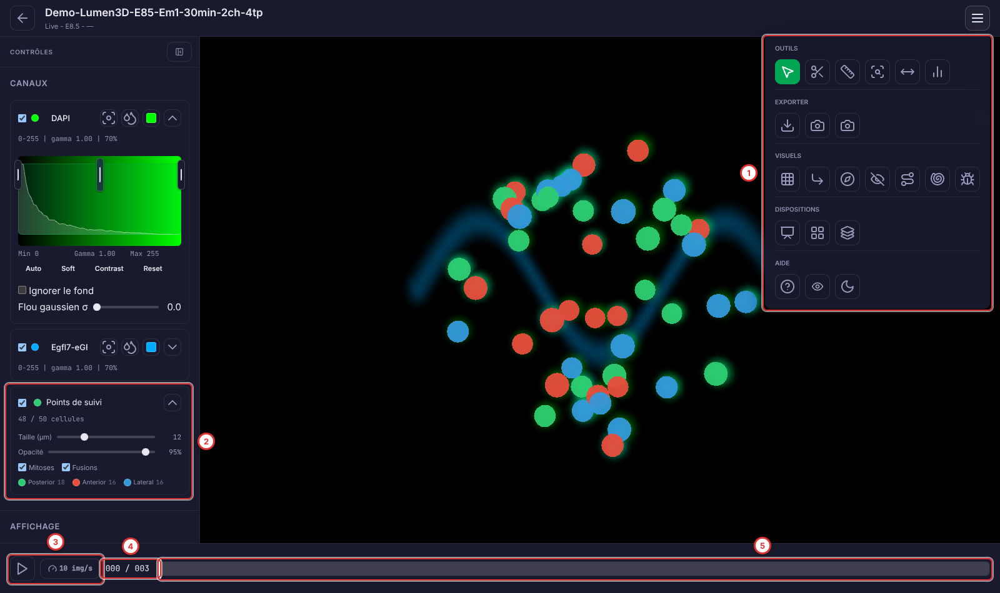{.shot width=70%}

:::: cols
::: col
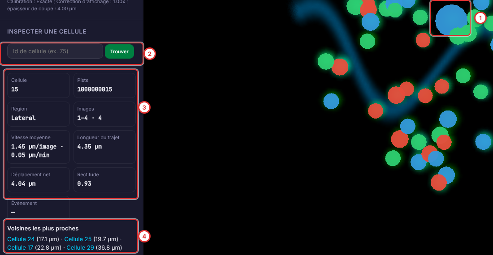{.shot width=100%}
:::
::: col
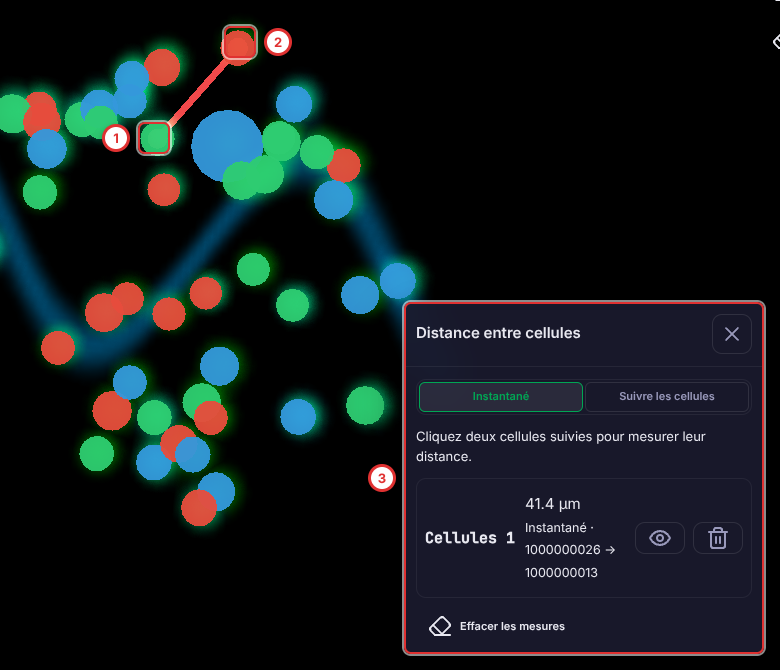{.shot width=100%}
:::
::::

- La lecture **attend** les images qui ne sont pas encore arrivées : elle ne saute jamais un instant en silence.
- Les positions affichées sont les positions **stabilisées** (§ 7) ; les mitoses et fusions sont marquées.
- Les graphiques (population, vitesse, voisins, mitoses) et les tableaux s'exportent. → ch. 12 et 13

# 14. Les photographies 2D

::: tldr
- Une photographie calibrée par dataset : zoom, barre d'échelle, mesures en µm ou mm.
- **Isoler le marquage** fait ressortir la coloration X-gal (bleue) sur le tissu (jaune).
- Une planche-contact parcourt toutes les photographies de la collection.
:::

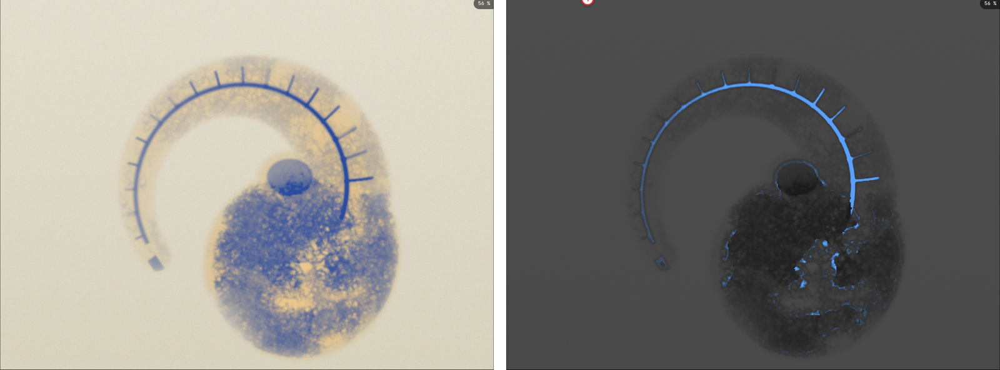{.shot width=75%}

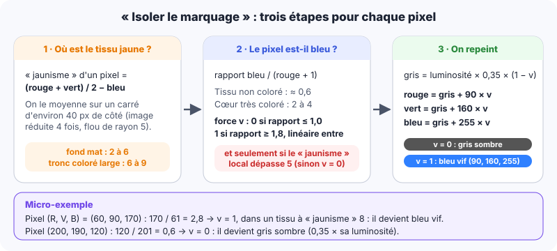{width=95%}

::: note
La photographie est stockée en **WebP avec perte (qualité 90)** par défaut ; l'option `--lossless` garde chaque
pixel exact, utile si l'on veut quantifier le rapport bleu / rouge. La calibration vient des métadonnées du TIFF
(ImageJ / Leica) ; sans elle, pas de barre d'échelle. → ch. 13
:::

# 15. Interpréter correctement ce que l'on voit

::: remember
- **Les niveaux de gris sont relatifs.** Chaque canal de chaque dataset a sa propre fenêtre (plancher → plafond) :
  on ne compare pas une intensité entre deux canaux ni entre deux datasets. Dans un timelapse, la fenêtre est
  **commune à tous les instants** : une baisse d'intensité reste visible, comme dans la réalité.
- **Dans le signal, rien n'est modifié** ; **hors du signal**, le bruit est lissé (médiane 3 × 3 × 3).
- **Un objet plus fin qu'environ 3 voxels** dans une direction est effacé par le nettoyage, même brillant (§ 4.4).
- **8 bits** suffisent pour la morphologie ; pour **quantifier**, repartez du `.ims` d'origine (dans `download/` si l'option a été activée).
- **Les briques non stockées** sont des zones réellement à 0 après nettoyage, pas des données perdues.
- **Le plancher d'affichage** (6 à 48) masque les valeurs les plus faibles à l'écran : baissez *min* ne les fera pas revenir.
- **Au plus 4 canaux** sont affichés en même temps.
- **Sans calibration** dans le fichier, aucune mesure en µm n'est proposée.
- **La vue 3D est en perspective** : mesurez avec l'outil de mesure ou sur une coupe, pas avec la barre d'échelle 3D.
:::

## 15.1 Ce que la plateforme ne fait pas

| Non disponible | Pourquoi / que faire |
|---|---|
| Quantification d'intensité absolue | données en 8 bits fenêtrées : utiliser le `.ims` d'origine |
| Segmentation, comptage automatique | faire l'analyse dans Imaris ou Fiji |
| Déconvolution | à faire avant l'export Imaris |
| Compensation du photoblanchiment | mesurée par le pipeline, mais pas encore appliquée par le viewer |
| Modifier les voxels | tout est en lecture seule ; seul l'affichage se règle |

→ ch. 20 (annexe « Ce que Lumen3D ne fait pas »)

# 16. Que se passe-t-il si… ?

| Situation | Ce que fait la plateforme | Ce que vous pouvez faire |
|---|---|---|
| L'image est floue au début | le niveau grossier arrive d'abord, le détail suit | attendre la fin de la progression |
| « Natif » affiche un autre niveau | mémoire graphique insuffisante : niveau plus léger + message | choisir 1024, fermer d'autres onglets 3D |
| La carte graphique « plante » | le viewer recharge la vue à mémoire réduite (3 fois en 2 minutes au plus) | baisser la qualité, recharger la page |
| Une brique est corrompue | elle est affichée vide et comptée, jamais montrée fausse | prévenir l'administrateur |
| Le transfert d'import s'arrête | il reprend dès que le réseau revient | reglisser le même dossier si besoin |
| Le dataset n'est pas dans l'explorateur | il est masqué, ou encore en import | demander à l'administrateur de le publier / l'afficher |
| Un clic de mesure est refusé | rien de visible sous le curseur | cliquer sur une structure visible |
| Le flou gaussien est grisé | la qualité choisie est trop grande pour une seule texture | choisir une qualité plus basse |

→ ch. 19 (plus de 60 situations détaillées)

# 17. Les mots à connaître

::: glossary
Voxel
: Le « pixel » d'un volume : un petit pavé, ici 1,2 × 1,2 × 3,0 µm. → ch. 4

Canal
: L'image d'un fluorophore (DAPI, Pecam1…). → ch. 4

Plancher / plafond
: Les deux valeurs qui définissent la conversion en 8 bits : sous le plancher → 0, au-dessus du plafond → 255. → ch. 5

Masque
: Les voxels reconnus comme signal ; seuls ceux hors du masque sont lissés. → ch. 5

Pyramide (niveaux)
: Les versions de plus en plus petites du volume ; le niveau 0 est la pleine résolution. → ch. 6

Brique
: Un cube de 64³ voxels, l'unité de découpage et de téléchargement. → ch. 7

WebP sans perte
: Le format d'image qui stocke les briques en gardant chaque valeur exacte. → ch. 6

MIP
: Projection d'intensité maximale : on garde la valeur la plus forte le long d'un axe. → ch. 7 et 9

Lancer de rayons
: La méthode de dessin : un rayon par pixel traverse le volume et combine les valeurs rencontrées. → ch. 9

Gamma
: L'exposant qui éclaircit (< 1) ou assombrit (> 1) les tons moyens. → ch. 11

Histogramme
: Le graphique qui compte combien de voxels ont chaque valeur. → ch. 11

Stabilisation
: Le déplacement rigide qui compense la dérive de l'embryon dans un timelapse. → ch. 8 et 13

Studio
: L'atelier de figures annotées à pleine résolution. → ch. 12 et 13

Format de données
: Le numéro de version de l'organisation des fichiers d'un dataset (1 à 4). → ch. 17
:::

::: see
**Documentation complète** (« Lumen3D, de A à Z ») : 21 chapitres, plus de 350 pages, chaque étape illustrée.
**Guide de l'administrateur** : tous les écrans du panneau, pas à pas. Les deux sont publiés dans l'onglet
*Documentation* du panneau d'administration.
:::
