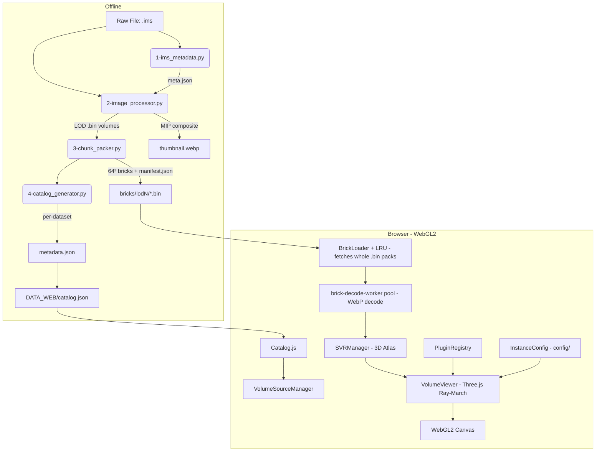

# lumen3D — Light-Based Unified Microscopy Exploration in 3D

[](https://www.khronos.org/webgl/)
[-000000?style=for-the-badge&logo=three.js)](https://threejs.org/)
[](https://www.python.org/)
[](#-security--offline)
[](LICENCE)
[](#-internationalization-i18n)

**lumen3D** is a high-performance, **white-label** web platform for interactive exploration of multi-gigabyte 3D and 4D biological microscopy datasets. It streams and renders massive confocal volumes (fixed embryos, immunofluorescence, live imaging, cell tracking) directly in the browser at **60 FPS** — no desktop software, no high-end local workstation required.

It was originally built for the **IRIBHM** (Institut de Recherche Interdisciplinaire en Biologie Humaine et Moléculaire) at the **Université Libre de Bruxelles (ULB)** — the reference deployment, imaging mouse embryos — and has since been **decoupled from that domain** into a reusable product: brand, texts, theme, pages, legal notices, navigation, and the installed plugin set are all configured **no-code** from an admin panel, with neutral defaults out of the box.

The platform bridges raw scientific data and seamless web exploration through a **Python preprocessing pipeline** (Imaris `.ims` → brick-packed LOD pyramids) and a **vanilla-JS / Three.js client** with a custom WebGL2 ray-marcher and sparse 3D atlas streaming. It is **offline-capable** (all JS libraries self-hosted, no CDN) and ships with a **signed self-updater** and a **signed plugin marketplace**.

> **Current versions** — Web platform `1.13.8` · Preprocessing tool `0.14.1`.
> The web version is defined solely by the newest `changelog/changelog_X.Y.Z.md` (there is **no** source `__version__` constant for the platform); the preprocessing tool tracks its own `__version__` in `preprocess/run_preprocess.py`.

---

## 🌟 Key Features

### 1. High-Fidelity 3D Volume Rendering
*   **WebGL2 Ray-Marching**: Custom volume shader built on **Three.js**, with multi-channel composition (up to 4+ channels) and per-channel LUT, min/max, gamma, and opacity controls. Render modes (fluorescence, structural DVR) are plugins in the shader dropdown.
*   **Sparse Volume Renderer (SVR)**: A cascading 3D-texture atlas manager (`js/core/svr-manager.js`) allocates GPU pages from 4096 → 256 slots depending on available VRAM, gracefully degrading instead of crashing the tab.
*   **Progressive Level-of-Detail (LOD)**: Instant first paint with low-resolution previews (`512×512`, `1024×1024`), then background streaming of higher-resolution bricks up to `native` quality.

### 2. Smart Slicing & Volume Navigation
*   **Off-Thread Brick Decoding**: `.bin` pack files (fetched whole — no HTTP range) are sliced and their WebP tiles decoded (`createImageBitmap` + un-mosaic 64³ blocks) in a dedicated decode-worker pool (`js/core/brick-decode-worker.js`), keeping the UI thread reserved for Three.js and DOM.
*   **AABB Plane Intersection**: A pure-JS slab-method intersector (`js/core/aabb-intersector.js`) selects only the bricks crossing the current slicing plane, enabling sub-millisecond chunk picking for thousands of bricks.
*   **Oblique / orthogonal slicing + Z-stack browser**: Extract arbitrary 2D cut planes from the volume (`js/viewers/volume-slicer.js`, `slice-inspector` tool) or step through Z-slices in high resolution (`zstack-browser` tool).
*   **Empty Space Skipping**: Bricks with occupancy below the ESS threshold are dropped at preprocessing time (`3-chunk_packer.py`), shrinking the streamed dataset by orders of magnitude.

### 3. Scientific Studio (Measurement & Analysis)
*   **Calibrated Measurements**: Pick two 3D surface points; the platform converts to physical µm using the dataset's voxel size metadata (`measure-distance` plugin, `js/core/measurement-store.js`).
*   **Annotation Layer**: Vector primitives stored per-dataset in browser LocalStorage (`js/core/annotation-manager.js`).
*   **Production Slice Studio**: In-viewer figure export (rectangle / line / arrow / distance / scale-bar / text layers) for publication-ready slice captures (`js/components/studio-editor.js`).
*   **Multi-Panel Compare**: Side-by-side dataset comparison with camera + slicer-plane sync across iframes via `postMessage` (`compare.html`).
*   **Workspace Persistence**: Save and restore the full viewer state (camera, channels, tools) per dataset (`js/core/workspace-state.js`, `js/core/export-manager.js`).

### 4. Python Preprocessing Pipeline
*   **Imaris (`.ims`) input**: Reads HDF5-based Imaris files via `h5py` and extracts metadata, dimensions, and per-channel calibration.
*   **Scientific Image Processing**: **Corner-sampling percentile background subtraction** (`bg_floor` = 99th percentile of the 8 volume corners, `sig_max` = 99.9th percentile of a subsampled volume), `binary_opening` + `binary_dilation` mask cleanup to kill sensor hot-pixels while preserving the fluorescent fade-out, masked median filtering, window leveling, and per-LOD downscaling (`scipy.ndimage`, `PIL`). *(Otsu thresholding was tried and deliberately removed in v0.12.0.)*
*   **Web-Optimized Brick Format**: 64³ chunks mosaicked 8×8 into 512² WebP-lossless tiles and packed into binary `.bin` pack files with a `manifest.json` index (packs fetched whole, decoded off-thread).
*   **False-Color Thumbnails & optional download bundles**: MIP composite WebP thumbnails per dataset; with `--with-downloads`, a per-dataset `download/` folder (`_web.zip`, original `.ims`, calibrated OME-TIFF, per-channel MIP PNGs). See [`preprocess/README.md`](preprocess/README.md).

### 5. Extensible Plugin Architecture + Signed Marketplace
*   **Auto-discovered plugins**: A central `PluginRegistry` (`js/core/plugin-registry.js`) discovers tools, channel controls, and shader render modes at runtime. Adding a plugin means dropping a `js/modules/<placement>/<id>/` folder with `plugin.json` + `index.js` — **auto-discovered at load, no manifest to edit and no build step** (since v1.1.0).
*   **App-store model**: Plugins are **not** bundled in a release; they install on demand from a curated **Ed25519-signed marketplace** (`marketplace/`) via the admin **Catalog** tab. Publish with a single command — `python tools/publish_plugin.py <dir> --push` (see [`marketplace/README.md`](marketplace/README.md)).
*   **Compatibility gating**: `platformCompat` in `plugin.json` (list/range) is resolved by twin implementations in `js/core/compat.js`, `dev_server.py`, and `api/_admin_lib.php`.

### 6. White-Label & No-Code Administration
*   **Instance configuration** (`config/`): brand, specimen noun, SEO, footer, and navigation live in a public `config/` store (`instance.json`, `theme.json` → compiled `theme.css`, `pages/<slug>.json`, `legal.json`; neutral defaults under `config/defaults/neutral/`), read by `js/core/instance-config.js`. The document `<head>` / brand is injected server-side via `{{SITE:path|fallback}}` placeholders; i18n interpolates `{brand}` / `{specimen}` tokens.
*   **No-code admin editors** (`admpan.html`): **Identity** (branding), **Appearance** (theme editor → live palette/font/radius), **Pages** (an Elementor-style block builder → `js/core/page-renderer.js` + `page.html?slug=`), **Legal** (→ `legal.html`), plus datasets, stats, plugins, security, updates, and the marketplace Catalog.
*   **Guided first-run setup wizard**: On a fresh install the admin panel runs a 5-step wizard (account → identity → theme → texts → plugin picker) — `js/pages/admin/shell.js`.

### 7. Deployment, Self-Update & Security
*   **One-file installer** (`install.php`) and a **robust self-updater** (`dev_server.py`): Blue-Green staging swap, health-gated restart, and automatic rollback, driven from the admin **Updates** tab.
*   **Signed releases**: CI (`tools/build_release.py`) produces a curated `lumen3d-web-X.Y.Z.zip` + `version.json` + `SHA256SUMS`, Ed25519-signed (`SHA256SUMS.sig`) using a vendored RFC 8032 verifier (`ed25519_pure.py`, stdlib-only). The updater and installer verify **fail-closed** against a pinned publisher key.
*   **Offline & hardened**: see [§ Security & Offline](#-security--offline).

---

## 🏗️ Technical Architecture

The architecture splits into **Data Preprocessing** (Python, offline) and **Visual Client** (vanilla JS + Three.js, in the browser), served by a Python dev server (`dev_server.py`) with a PHP twin (`api/*.php`) for legacy hosts.



---

## 📂 Codebase Organization

```
├── api/                       # Auth + dataset/site CRUD (PHP legacy; dev_server.py re-implements these routes)
│   ├── auth.php               # Login/setup/logout/session (PBKDF2 admin credential)
│   ├── datasets.php           # Dataset metadata read/write, catalog rebuild
│   ├── site.php               # White-label config persistence (instance/theme/pages/legal)
│   └── _admin_lib.php         # Shared admin helpers (compat, marketplace, trust)
│                              #   NOTE: api/admin_credential.json (PBKDF2 hash) is gitignored + never served
├── config/                    # PUBLIC white-label store (read by js/core/instance-config.js)
│   ├── instance.json          # Brand, specimen noun, SEO, footer, navigation
│   ├── theme.json → theme.css # Palette/font/radius, server-compiled to CSS
│   ├── pages/<slug>.json      # Custom-page layouts (block builder)
│   ├── legal.json             # Legal notices
│   └── defaults/neutral/      # Neutral, domain-agnostic defaults
├── marketplace/               # Ed25519-SIGNED plugin catalog (app-store); plugins install on demand
├── changelog/                 # Web platform versions (0.3.x → 1.x) — [ADDED]/[OPTIMIZED]/[FIXED]
│   └── archive/               # Older lines (≤ 1.2.x + all 0.x); excluded from version computation
├── css/                       # Stylesheets (variables → themes → base → components → layout → page → tools)
├── js/                        # Frontend (vanilla JS, no bundler, IIFE singletons)
│   ├── components/            # UI panels (channel-panel, timeline, studio-editor, chart-studio, ...)
│   ├── core/                  # Engines & stores (plugin-registry, svr-manager, brick-loader, catalog,
│   │                          #   i18n, instance-config, page-renderer, compat, plugin-trust, plugin-sandbox, ...)
│   ├── modules/               # Plugin tree: tools/ | channels/ | shaders/ (each: plugin.json + index.js)
│   ├── pages/                 # Per-page controllers (viewer.js is the main one)
│   │   └── admin/             # Admin SPA — ESM tabs (datasets, stats, plugins, security, updates,
│   │                          #   branding, pages, appearance, legal, marketplace) + shell.js wizard
│   ├── vendor/                # SELF-HOSTED libs w/ SRI (Three.js, Lucide, OpenSeadragon, Plotly) — no CDN
│   ├── viewers/               # Three.js renderers (volume-viewer, volume-slicer, volume-grid, tracking-viewer)
│   └── workers/               # Web Workers (gaussian-blur-worker, ...)
├── lang/                      # Translation bundles (en.json, fr.json, es.json) — drop-in discoverable
├── preprocess/                # Python pipeline (see preprocess/README.md)
│   ├── 1-ims_metadata.py      # Imaris metadata extractor (h5py)
│   ├── 2-image_processor.py   # Corner-sampling percentile bg subtraction + masked median (scipy)
│   ├── 3-chunk_packer.py      # 64³ bricks, WebP mosaic 512² (8×8), pack into .bin
│   ├── 4-catalog_generator.py # metadata.json + catalog entry
│   ├── run_preprocess.py      # Unified runner (orchestrates 1 → 4, optional download bundles)
│   ├── requirements.txt       # Python dependencies (h5py, numpy, scipy, Pillow, tqdm)
│   └── changelog/             # Preprocessing tool versions (0.11.x → 0.14.x)
├── tools/                     # build_release.py, publish_plugin.py, gen_signing_key.py, check_version.py, ...
├── DOCS/                      # Design specs (update-system/, plugin-sandbox/, whitelabel/)
├── DATA_WEB/                  # Generated dataset bundles (gitignored, except catalog.json)
│   ├── catalog.json
│   └── fixed/<dataset>/{metadata.json, thumbnail.webp, bricks/, download/(optional)}
├── page.html / legal.html     # White-label custom pages + legal notices renderer
├── admpan.html                # Admin panel (ESM entry — the one carve-out from the no-ESM rule)
├── install.php                # One-file installer (signature-verified)
├── ed25519_pure.py            # Vendored RFC 8032 Ed25519 verify/sign (stdlib-only)
├── dev_server.py              # Recommended dev server (static + Python-native API + self-updater)
├── fast_server.py             # Multi-threaded no-cache static server (no API)
├── LICENCE                    # PolyForm Noncommercial License 1.0.0
└── README.md
```

---

## ⚡ Quick Start

### 1. Run the Web Client

Requires **Python 3.10+** for the dev server (handles static files, the admin API, and the self-updater).

```bash
python dev_server.py --port 8080
```

Then open <http://localhost:8080>.

`fast_server.py` and `start.bat` are static-only fallbacks (no admin API) useful for perf tests.

### 2. First-Run Setup (no default password)

There is **no default admin password**. On a fresh install, open the admin panel (`/admpan.html`) — a **guided setup wizard** walks you through creating the admin account and configuring identity, theme, texts, and the initial plugin set. Credentials are stored as a one-way **salted PBKDF2-HMAC-SHA256** hash in `api/admin_credential.json` (gitignored, never served over HTTP).

Change the password later from the admin **Security** tab (requires the current password), or via an operator override:

```bash
python dev_server.py --set-password
```

### 3. Preprocess Raw Microscopy Datasets

The pipeline currently ingests **Imaris `.ims`** files (HDF5). On Windows, the self-contained launcher `preprocess/run_preprocess.bat` needs **nothing pre-installed** (it provisions a local Python + deps). For the CLI:

```bash
# 1. Install Python dependencies (recommend a venv or conda env)
pip install -r preprocess/requirements.txt

# 2. Point the runner at a directory of .ims files and the DATA_WEB output root
python preprocess/run_preprocess.py --input /path/to/raw_ims_directory --output ./DATA_WEB

# Optional: process only a subset, and/or also build per-dataset download/ bundles
python preprocess/run_preprocess.py --input /path/to/raw --output ./DATA_WEB --only "*E8*" --with-downloads
```

The unified runner executes: metadata extraction → background subtraction + downscaling → MIP thumbnail → 64³ brick packing → catalog entry (→ optional download bundle). Full algorithmic reference: [`preprocess/README.md`](preprocess/README.md).

---

## 🎨 White-Label Configuration

Everything user-facing is configured **without touching code**, from the admin panel, and persisted to the public `config/` store:

| What | Admin tab | Stored in | Rendered by |
|---|---|---|---|
| Brand, specimen noun, SEO, footer, nav | **Identity** | `config/instance.json` | `js/core/instance-config.js` + server `{{SITE:…}}` injection |
| Palette, font, corner radius | **Appearance** | `config/theme.json` → `config/theme.css` | linked after `themes.css` on every public page |
| Custom pages (block builder) | **Pages** | `config/pages/<slug>.json` | `js/core/page-renderer.js` + `page.html?slug=` |
| Legal notices | **Legal** | `config/legal.json` | `legal.html` |

Neutral, domain-agnostic defaults live under `config/defaults/neutral/`, so a fresh instance is generic until you brand it. Design notes: [`DOCS/whitelabel/PLAN.md`](DOCS/whitelabel/PLAN.md).

---

## 🔒 Security & Offline

The platform assumes **no user auth on the public side** but is defensive by design, and runs **fully offline**:

*   **Self-hosted dependencies, no CDN**: all JS libraries (Three.js `0.147.0`, Lucide `0.344.0`, OpenSeadragon `3.0.0`, Plotly `2.27.0`) are vendored under `js/vendor/` and loaded with SRI `integrity` from `'self'`. The only remote dependency is Google Fonts (CSS/fonts). Do **not** re-introduce a CDN `<script src>` — it is blocked by the enforced CSP.
*   **Enforced strict CSP**: a per-request nonce is injected server-side (`dev_server.py:_serve_html`, with PHP/`.htaccess` twins) — `script-src 'self' 'nonce-…'`, `style-src-elem 'self' 'nonce-…'` (no `unsafe-inline`). Inline handlers are replaced by `data-action` delegation (`js/core/ui-actions.js`).
*   **Third-party plugin isolation**: a default-deny **trust gate** (`js/core/plugin-trust.js`) pins operator approval to a content hash; untrusted plugins are excluded from the API. Approved-sandboxed UI plugins run in a null-origin **iframe sandbox** (`js/core/plugin-sandbox.js`) with capability-scoped `postMessage`.
*   **Release authenticity**: releases are Ed25519-signed (`SHA256SUMS.sig`) and verified **fail-closed** by both the updater (`dev_server.py`) and the installer (`install.php`) against a pinned publisher key.
*   **Data hygiene**: dataset structure is validated on load (dimensions, channel count, manifest integrity); a malformed `metadata.json` is rejected, not partially mounted. Study data is never POSTed to third parties.

Design specs: [`DOCS/update-system/`](DOCS/update-system/), [`DOCS/plugin-sandbox/`](DOCS/plugin-sandbox/).

---

## 🔄 Updates & Releases

*   **In-panel updates**: the admin **Updates** tab drives a health-gated Blue-Green update (staging swap + auto-rollback on failure) implemented in `dev_server.py`.
*   **Publishing a release**: CI (`.github/workflows/`) runs `tools/build_release.py` (allowlist → curated zip + `version.json` + `SHA256SUMS`, signed to `SHA256SUMS.sig`) and `tools/check_version.py --tag` (a `vX.Y.Z` tag must equal the newest `changelog/` file). Operational runbook: [`DOCS/update-system/RELEASING.md`](DOCS/update-system/RELEASING.md).
*   **Publishing a plugin**: `python tools/publish_plugin.py <plugin-dir> --push` packages, signs, and pushes to the marketplace catalog in one command.

---

## 📈 Performance & Telemetry

A lightweight runtime probe (`js/core/perf-telemetry.js`, `PerfTelemetry.start/end/event/setContext`) provides in-session instrumentation from `viewer.js`. Tracked KPIs include time-to-first-paint on the preview LOD, sustained framerate during camera rotation, and per-LOD brick load latency. *(The historical `DOCS/perf_baseline_*.json` snapshots have been removed from the repo — regenerate locally if needed.)*

The streaming layer uses an **LRU brick cache** of 200 bricks plus a 128-entry pack-file cache (`js/core/brick-loader.js`), with concurrent fetches. The SVR atlas auto-sizes to available VRAM via cascading configurations (4096 → 256 slots).

---

## 🌐 Internationalization (i18n)

Full runtime language switching with no reload. Platform translation bundles live under `lang/`:

* `lang/en.json` (English — the fallback locale)
* `lang/fr.json` (French)
* `lang/es.json` (Spanish)

Loaded and indexed dynamically by `js/core/i18n.js` (`I18n.t('dotted.key', {params})`). HTML translates via `data-i18n` / `data-i18n-title` / `data-i18n-placeholder` / `data-i18n-aria` attributes. White-label tokens (`{brand}`, `{specimen}`, …) are interpolated per-locale.

**Drop-in languages.** The set of *selectable* languages is discovered at runtime — `GET /api/languages` → `lang/manifest.json` → embedded default — so dropping `lang/zh.json` adds "🇨🇳 中文" to the switcher with no code edit (display name/flag/RTL come from the `LANG_META` registry in `i18n.js`). The switcher itself is generated by `Utils.populateLanguageMenu()`. Regenerate the static manifest for pure-static hosts with `python tools/gen_lang_manifest.py`.

**Translatable plugins.** Each plugin carries its own `lang/<code>.json` under `js/modules/<placement>/<id>/lang/`, merged into the i18n tree under `plugins.<id>`. In plugin code, call `ctx.i18n.t('key')` (auto-namespaced). Fallback rules:

* A platform locale a plugin does **not** ship falls back to the plugin's **English** (the rest of the UI stays in the active language).
* A locale a plugin ships but the platform does **not** is simply never offered — it cannot be used until the platform also ships `lang/<code>.json`.

List a plugin's shipped locales in its `plugin.json` as `"i18nLanguages": ["en", "fr", …]` (the dev server keeps this in sync by scanning the folder). Toolbar/shader labels resolve `i18nTitle` against the plugin's own dictionary first, then the platform.

---

## 🤝 Contributing

Follow the **autonomous versioning** routine described in [CLAUDE.md](CLAUDE.md). Every substantive change bumps the appropriate component:

* **Plateforme Web** → add a new `changelog/changelog_X.Y.Z.md` (sections `[ADDED]` / `[OPTIMIZED]` / `[FIXED]`). There is **no** source `__version__` constant for the web platform — the version *is* the newest changelog filename (`dev_server.py:__version__` tracks the dev-server tool and has drifted; don't use it as the platform version).
* **Outil de Preprocessing** → bump `preprocess/run_preprocess.py:__version__` and add a `preprocess/changelog/changelog_X.Y.Z.md`.

---

## ⚖️ License

This project is licensed under the **PolyForm Noncommercial License 1.0.0** (see [LICENCE](LICENCE)).

* **Permitted**: non-commercial research, personal study, evaluation, testing, and education.
* For commercial use: contact **IRIBHM** / **Université Libre de Bruxelles**.
