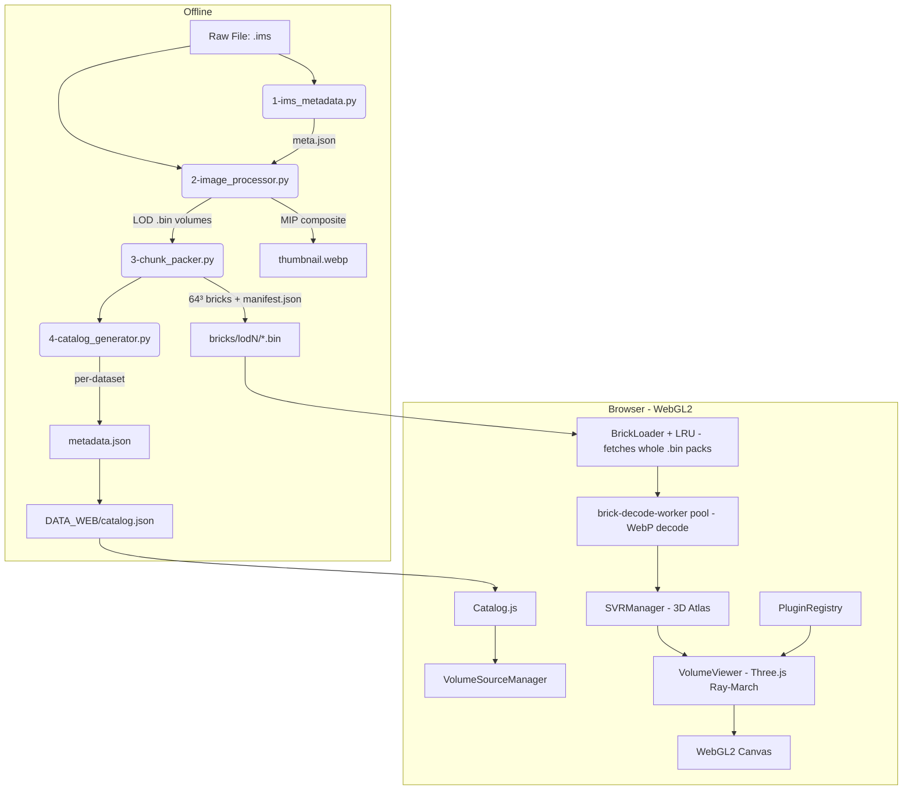

# lumen3D — Light-Based Unified Microscopy Exploration in 3D

[](https://www.khronos.org/webgl/)
[](https://threejs.org/)
[](https://www.python.org/)
[](LICENCE)
[](#-internationalization-i18n)

**lumen3D** is a high-performance web platform for interactive exploration of multi-gigabyte 3D and 4D biological microscopy datasets. Developed for the **IRIBHM** (Institut de Recherche Interdisciplinaire en Biologie Humaine et Moléculaire) at the **Université Libre de Bruxelles (ULB)**, lumen3D streams and renders massive confocal volumes (mouse embryos, immunofluorescence, live imaging) directly in the browser at **60 FPS** — no desktop software, no high-end local workstation required.

The platform bridges raw scientific data and seamless web exploration through a **Python preprocessing pipeline** (Imaris `.ims` → brick-packed LOD pyramids) and a **vanilla-JS / Three.js client** with a custom WebGL2 ray-marcher and sparse 3D atlas streaming.

---

## 🌟 Key Features

### 1. High-Fidelity 3D Volume Rendering
*   **WebGL2 Ray-Marching**: Custom volume shader built on **Three.js**, with multi-channel composition (up to 4+ channels) and per-channel LUT, min/max, gamma, and opacity controls.
*   **Sparse Volume Renderer (SVR)**: A cascading 3D-texture atlas manager (`js/core/svr-manager.js`) allocates GPU pages from 4096 → 256 slots depending on available VRAM, gracefully degrading instead of crashing the tab.
*   **Progressive Level-of-Detail (LOD)**: Instant first paint with low-resolution previews (`512×512`, `1024×1024`), then background streaming of higher-resolution bricks up to `native` quality.

### 2. Smart Slicing & Oblique Cuts
*   **Off-Thread Brick Decoding**: `.bin` pack files (fetched whole — no HTTP range) are sliced and their WebP tiles decoded (`createImageBitmap` + un-mosaic 64³ blocks) in a dedicated decode-worker pool (`js/core/brick-decode-worker.js`), keeping the UI thread reserved for Three.js and DOM.
*   **AABB Plane Intersection**: A pure-JS slab-method intersector (`js/core/aabb-intersector.js`) selects only the bricks crossing the current slicing plane, enabling sub-millisecond chunk picking for thousands of bricks.
*   **Empty Space Skipping**: Bricks with occupancy `< 0.05%` are dropped at preprocessing time (`3-chunk_packer.py`), shrinking the streamed dataset by orders of magnitude.

### 3. Microscopy Studio (2D Annotation & Analysis)
*   **Calibrated Measurements**: Pick two 3D surface points; the platform converts to physical µm using the dataset's voxel size metadata (`measure-distance` plugin).
*   **Annotation Layer**: Vector primitives stored per-dataset in browser LocalStorage (`js/core/annotation-manager.js`, `js/core/measurement-store.js`).
*   **Multi-Panel Compare**: Side-by-side dataset comparison with camera + slicer-plane sync across iframes via `postMessage` (`compare.html`).
*   **Workspace Persistence**: Save and restore the full viewer state (camera, channels, tools) per dataset (`workspace-state.js`).

### 4. 2D DeepZoom Mode
*   **Pyramid Navigation**: Multi-scale pan/zoom through gigapixel 2D image pyramids when the dataset provides a 2D-tiles source (`tools/deepzoom-2d`).
*   **Z-Stack Browser**: Step through Z-slices in high resolution via the `zstack-browser` tool.

### 5. Python Preprocessing Pipeline
*   **Imaris (`.ims`) input**: Reads HDF5-based Imaris files via `h5py` and extracts metadata, dimensions, and per-channel calibration.
*   **Scientific Image Processing**: Otsu thresholding, morphological opening to suppress sensor hot pixels, window leveling, and per-LOD downscaling (`scipy.ndimage`, `skimage`, `PIL`).
*   **Web-Optimized Brick Format**: 64³ chunks mosaicked 8×8 into 512² WebP tiles and packed into binary `.bin` pack files with a `manifest.json` index (packs fetched whole, decoded off-thread).
*   **False-Color Thumbnails**: Maximum Intensity Projection (MIP) composite WebP thumbnails generated per dataset.

### 6. Extensible Plugin Architecture
A central `PluginRegistry` (`js/core/plugin-registry.js`) discovers tools, channel controls, and shader render modes at runtime via `plugin.json` manifests under `js/modules/`. Adding a new tool requires only a new directory and a one-line manifest update — no build step.

---

## 🏗️ Technical Architecture

The architecture splits into **Data Preprocessing** (Python, offline) and **Visual Client** (vanilla JS + Three.js, in the browser).



---

## 📂 Codebase Organization

```
├── api/                       # Auth + dataset CRUD (PHP legacy + Python equivalent in dev_server.py)
│   ├── auth.php               # Login/logout/session
│   ├── config.json            # SHA-256 hashed admin credentials
│   └── datasets.php           # Dataset metadata read/write, catalog rebuild
├── changelog/                 # Web platform versions (0.3.x → 1.x) — [ADDED]/[OPTIMIZED]/[FIXED]
├── css/                       # Stylesheets (variables → themes → base → components → layout → page → tools)
├── js/                        # Frontend (vanilla JS, no bundler, IIFE singletons)
│   ├── components/            # UI panels (channel-panel, timeline, studio-editor, deepzoom-viewer, ...)
│   ├── core/                  # Engines & stores (plugin-registry, svr-manager, brick-loader, catalog, i18n, ...)
│   ├── modules/               # Plugin tree: tools/ | channels/ | shaders/ (each with plugin.json + index.js)
│   ├── pages/                 # Per-page controllers (viewer.js is the main one)
│   ├── viewers/               # Three.js renderers (volume-viewer, volume-slicer, volume-grid, tracking-viewer)
│   └── workers/               # Web Workers (gaussian-blur-worker, ...)
├── lang/                      # Translation bundles (en.json, fr.json, es.json)
├── preprocess/                # Python pipeline
│   ├── 1-ims_metadata.py      # Imaris metadata extractor (h5py)
│   ├── 2-image_processor.py   # Normalization, Otsu thresholding, morphological opening (scipy/skimage)
│   ├── 3-chunk_packer.py      # 64³ bricks, WebP mosaic 512² (8×8), pack into .bin
│   ├── 4-catalog_generator.py # metadata.json + catalog entry
│   ├── run_preprocess.py      # Unified runner (orchestrates 1 → 4)
│   ├── requirements.txt       # Python dependencies
│   └── changelog/             # Preprocessing tool versions (0.11.x → 0.12.x)
├── DATA_WEB/                  # Generated dataset bundles (gitignored, except catalog.json)
│   ├── catalog.json
│   └── fixed/<dataset>/{metadata.json, thumbnail.webp, bricks/}
├── dev_server.py              # Recommended dev server (Python; serves static + Python-native API routes)
├── fast_server.py             # Multi-threaded no-cache static server (no API)
├── start.bat                  # Windows quick launcher (port 8000)
├── LICENCE                    # PolyForm Noncommercial License 1.0.0
└── README.md
```

---

## ⚡ Quick Start

### 1. Run the Web Client

Requires **Python 3.8+** for the dev server (handles both static files and the admin API).

```bash
python dev_server.py --port 8080
```

Then open <http://localhost:8080>.

On Windows you can also double-click `start.bat` (port 8000, no admin API).

### 2. Preprocess Raw Microscopy Datasets

The pipeline currently ingests **Imaris `.ims`** files (HDF5).

```bash
# 1. Install Python dependencies (recommend a venv or conda env)
pip install -r preprocess/requirements.txt

# 2. Point the runner at a directory of .ims files and the DATA_WEB output root
python preprocess/run_preprocess.py --input /path/to/raw_ims_directory --output ./DATA_WEB

# Optional: process only a subset matching a glob
python preprocess/run_preprocess.py --input /path/to/raw --output ./DATA_WEB --only "*E8*"
```

The unified runner executes: metadata extraction → normalization + downscaling → MIP thumbnail → 64³ brick packing → catalog entry.

### 3. (Optional) Configure the Admin Panel

Admin auth is stored in `api/config.json` (SHA-256). To change the password:

```bash
python dev_server.py --set-password
```

---

## 📈 Performance & Telemetry

A lightweight runtime probe (`js/core/perf-telemetry.js`) measures viewer lifecycle KPIs and writes JSON baselines under `DOCS/perf_baseline_*.json`. Tracked metrics include:

* **Time-to-first-paint** on the preview quality LOD.
* **Sustained framerate** during camera rotation under the ray-march shader.
* **Brick load latency** per LOD, per dataset.

The streaming layer uses an **LRU brick cache** of 200 bricks plus a 128-entry pack file cache (`js/core/brick-loader.js`), with up to 24 concurrent fetches. The SVR atlas auto-sizes to available VRAM via cascading configurations (4096 → 256 slots).

---

## 🌐 Internationalization (i18n)

Full runtime language switching with no reload. Platform translation bundles live under `lang/`:

* `lang/en.json` (English — the fallback locale)
* `lang/fr.json` (French)
* `lang/es.json` (Spanish)

Loaded and indexed dynamically by `js/core/i18n.js` (`I18n.t('dotted.key', {params})`). HTML translates via `data-i18n` / `data-i18n-title` / `data-i18n-placeholder` / `data-i18n-aria` attributes.

**Drop-in languages.** The set of *selectable* languages is discovered at runtime — `GET /api/languages` → `lang/manifest.json` → embedded default — so dropping `lang/zh.json` adds “🇨🇳 中文” to the switcher with no code edit (display name/flag/RTL come from the `LANG_META` registry in `i18n.js`). The switcher itself is generated by `Utils.populateLanguageMenu()`. Regenerate the static manifest for pure-static hosts with `python tools/gen_lang_manifest.py`.

**Translatable plugins.** Each plugin carries its own `lang/<code>.json` under `js/modules/<placement>/<id>/lang/`, merged into the i18n tree under `plugins.<id>`. In plugin code, call `ctx.i18n.t('key')` (auto-namespaced). Fallback rules:

* A platform locale a plugin does **not** ship falls back to the plugin's **English** (the rest of the UI stays in the active language).
* A locale a plugin ships but the platform does **not** is simply never offered — it cannot be used until the platform also ships `lang/<code>.json`.

List a plugin's shipped locales in its `plugin.json` as `"i18nLanguages": ["en", "fr", …]` (the dev server keeps this in sync by scanning the folder). Toolbar/shader labels resolve `i18nTitle` against the plugin's own dictionary first, then the platform.

---

## 🤝 Contributing

Internal IRIBHM contributors: follow the **autonomous versioning** routine described in [CLAUDE.md](CLAUDE.md). Every substantive change bumps the appropriate component (`Plateforme Web` or `Outil de Preprocessing`), writes a `changelog_X.Y.Z.md`, and updates the relevant `__version__` constant.

---

## ⚖️ License

This project is licensed under the **PolyForm Noncommercial License 1.0.0** (see [LICENCE](LICENCE)).

* **Permitted**: non-commercial research, personal study, evaluation, testing, and education.
* For commercial use: contact **IRIBHM** / **Université Libre de Bruxelles**.
