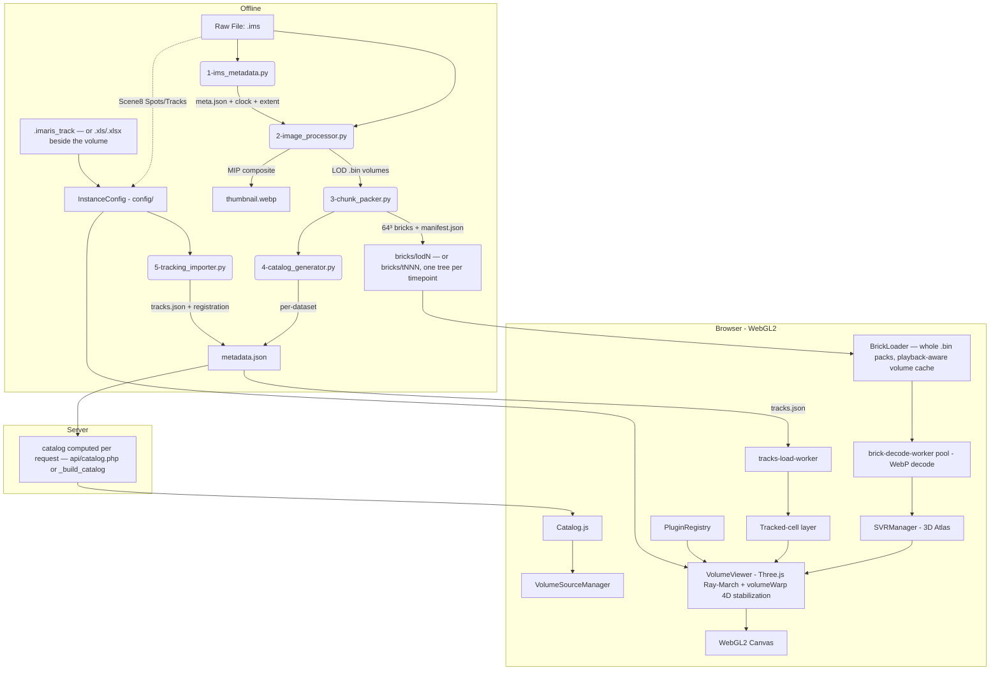

# lumen3D — Light-Based Unified Microscopy Exploration in 3D

[](https://www.khronos.org/webgl/)
[-000000?style=for-the-badge&logo=three.js)](https://threejs.org/)
[](https://www.python.org/)
[](#-security--offline)
[](LICENCE)
[](#-internationalization-i18n)

**lumen3D** is a high-performance, **white-label** web platform for interactive exploration of multi-gigabyte 3D and 4D biological microscopy datasets. It streams and renders massive confocal volumes (fixed embryos, immunofluorescence, live imaging, cell tracking) directly in the browser at **60 FPS** — no desktop software, no high-end local workstation required.

It was originally built for the **IRIBHM** (Institut de Recherche Interdisciplinaire en Biologie Humaine et Moléculaire) at the **Université Libre de Bruxelles (ULB)** — the reference deployment, imaging mouse embryos — and has since been **decoupled from that domain** into a reusable product: brand, texts, theme, pages, legal notices, navigation, and the installed plugin set are all configured **no-code** from an admin panel, with neutral defaults out of the box.

The platform bridges raw scientific data and seamless web exploration through a **Python preprocessing pipeline** (Imaris `.ims` → brick-packed LOD pyramids, 3D **and 4D**) and a **vanilla-JS / Three.js client** with a custom WebGL2 ray-marcher and sparse 3D atlas streaming. It is **offline-capable** (all JS libraries self-hosted, no CDN) and ships with a **signed self-updater** and a **signed plugin marketplace**.

> **Current versions** — Web platform `1.42.0` · Preprocessing tool `0.15.0`.
> The web version is defined solely by the newest `changelog/changelog_X.Y.Z.md` (there is **no** source `__version__` constant for the platform); the preprocessing tool tracks its own `__version__` in `preprocess/run_preprocess.py`.

---

## 🌟 Key Features

### 1. High-Fidelity 3D Volume Rendering
*   **WebGL2 Ray-Marching**: Custom volume shader built on **Three.js**, with multi-channel composition (up to 4+ channels) and per-channel LUT, min/max, gamma, and opacity controls. Render modes (fluorescence, structural DVR) are plugins in the shader dropdown.
*   **Sparse Volume Renderer (SVR)**: A cascading 3D-texture atlas manager (`js/core/svr-manager.js`) allocates GPU pages from 4096 → 256 slots depending on available VRAM, gracefully degrading instead of crashing the tab.
*   **Progressive Level-of-Detail (LOD)**: Instant first paint with low-resolution previews (`512×512`, `1024×1024`), then background streaming of higher-resolution bricks up to `native` quality.
*   **VRAM-proportional allocation**: single-channel volumes are uploaded as `R8` rather than `RGBA8` — a 4× memory saving that is what lets a full 4D series fit in VRAM (v1.28.0).

### 2. Smart Slicing & Volume Navigation
*   **Off-Thread Brick Decoding**: `.bin` pack files (fetched whole — no HTTP range) are sliced and their WebP tiles decoded (`createImageBitmap` + un-mosaic 64³ blocks) in a dedicated decode-worker pool (`js/core/brick-decode-worker.js`), keeping the UI thread reserved for Three.js and DOM.
*   **AABB Plane Intersection**: A pure-JS slab-method intersector (`js/core/aabb-intersector.js`) selects only the bricks crossing the current slicing plane, enabling sub-millisecond chunk picking for thousands of bricks.
*   **Oblique / orthogonal slicing + Z-stack browser**: Extract arbitrary 2D cut planes from the volume (`js/viewers/volume-slicer.js`, `slice-inspector` tool) or step through Z-slices in high resolution (`zstack-browser` tool).
*   **Empty Space Skipping**: Bricks with occupancy below the ESS threshold are dropped at preprocessing time (`3-chunk_packer.py`), shrinking the streamed dataset by orders of magnitude.
*   **Touch navigation (tablet & phone)**: one finger orbits, **two fingers pan and zoom in the same gesture**, with the zoom anchored on the pinched point — what sits between the fingers stays there for the whole gesture. The two-finger gesture takes priority over the active tool, so the volume stays reachable in measure or slice mode (v1.35.0; the same anchored-pinch model was added to the Slice Studio in v1.37.0, where one finger keeps drawing).

### 3. 4D Timelapse & Cell Tracking
*   **Real 4D datasets**: timelapse acquisitions are packed as one self-contained brick tree per timepoint (`bricks/t000/`, `t001/`, …) with per-timepoint empty-space skipping and per-timepoint histograms, and routed to `DATA_WEB/live/` (preprocessing v0.15.0). The viewer drives them from a timeline scrubber.
*   **Render-time stabilization — no voxel is ever resampled**: a timelapse drifts and rotates during acquisition. Because the accompanying tracking stabilization is an exact **rigid** motion, the same transform re-expresses the volume in the stabilized frame. The viewer applies it to the **sampling coordinate in the shader** (`volumeWarp` mat4, `hitBoxWarped()`), so the specimen stays still while the imaged box moves around it — exact, free, and reversible. It is enabled only for datasets whose registration was verified rigid at import (`registration.qcSummary.rigid`); everything else compiles the exact same shader as before (v1.26.0).
*   **Playback paced by the loader, not by the wall clock**: the playhead freezes while the frame it already asked for is still streaming (`Timeline.setStalled()`), with a 250 ms clock-step clamp and a 15 s stall escape hatch. The transition cube is hidden during a timepoint change, so the previous frame stays on screen at full quality until the atomic swap — no more watching chunks fill in (v1.30.0).
*   **Playback-aware cache, and a real buffer**: eviction is no longer LRU — cyclic playback over a series larger than the cache is the textbook LRU worst case (~0 % hit rate, full re-stream every frame). The victim is now the frame whose *cyclic forward distance* from the playhead is greatest, and the budget is counted **in bytes** rather than in entries, so one native frame no longer evicts the cheap 256/512 ones (v1.33.0). On top of that, **background preloading** fills the buffer without displaying anything, like a video player — measured 30/30 frames buffered at 512 without playing a single frame (v1.34.0).
*   **Tracked-cell overlay**: a dataset carrying a `tracking` block gains a **layer** in the channel sidebar (visibility, colour, µm size, opacity, region legend with counts) — a layer, deliberately not a pseudo-channel, so channel indexing and workspace serialization stay 1:1 with the real channels. Points are instanced spheres scaled in micrometres (not `gl_POINTS`, which is a pixel count, driver-clamped and square), they follow the shader's clipping test exactly, and the 1 MB `tracks.json` is fetched, gunzipped and packed into typed arrays off-thread (`js/workers/tracks-load-worker.js`) (v1.31.0).

### 4. Scientific Studio (Measurement & Analysis)
*   **Calibrated Measurements**: Pick two 3D surface points; the platform converts to physical µm using the dataset's voxel size metadata (`measure-distance` plugin, `js/core/measurement-store.js`).
*   **Annotation Layer**: Vector primitives stored per-dataset in browser LocalStorage (`js/core/annotation-manager.js`).
*   **Production Slice Studio**: In-viewer figure export (rectangle / line / arrow / distance / scale-bar / text layers) for publication-ready slice captures (`js/components/studio-editor.js`), with two-finger navigation on the figure surface (one finger keeps drawing).
*   **Multi-Panel Compare**: Side-by-side dataset comparison with camera + slicer-plane sync across iframes via `postMessage` (`compare.html`).
*   **Workspace Persistence**: Save and restore the full viewer state (camera, channels, tools) per dataset (`js/core/workspace-state.js`, `js/core/export-manager.js`).

### 5. Python Preprocessing Pipeline
*   **Imaris (`.ims`) input**: Reads HDF5-based Imaris files via `h5py` and extracts metadata, dimensions, per-channel calibration, the acquisition clock (real per-frame timestamps, median interval) and the stage-frame physical extent — the frame in which Imaris-derived objects (spots, surfaces, tracks) live, and without which no registration is verifiable.
*   **Scientific Image Processing**: **Corner-sampling percentile background subtraction** (`bg_floor` = 99th percentile of the 8 volume corners, `sig_max` = 99.9th percentile of a subsampled volume), `binary_opening` + `binary_dilation` mask cleanup to kill sensor hot-pixels while preserving the fluorescent fade-out, masked median filtering, window leveling, and per-LOD downscaling (`scipy.ndimage`, `PIL`). *(Otsu thresholding was tried and deliberately removed in v0.12.0.)*
*   **Series-global intensity normalization (4D)**: leveling each frame on its own percentiles makes a series flicker — as the specimen bleaches, a per-frame window re-stretches a dying signal, so apparent brightness stays constant while the real one collapses. Percentiles are pooled over 8 sampled timepoints into a **single window**, so frames darken exactly as much as the specimen does. Photobleaching is *measured and published* (`intensityNormalization.signalLevels`), never baked into the voxels. The single-timepoint path is unchanged, so already-published `fixed` datasets reproduce byte-for-byte.
*   **Web-Optimized Brick Format**: 64³ chunks mosaicked 8×8 into 512² WebP-lossless tiles and packed into binary `.bin` pack files with a `manifest.json` index (packs fetched whole, decoded off-thread). For 4D, one pack tree per timepoint plus a `timepoints` table in the manifest.
*   **Tracking import (step 5)**: `5-tracking_importer.py` attaches an Imaris tracking analysis (`.imaris_track`) to a volume — writes `tracks.json` (+ `.gz`), `model.glb`, and a `registration` block in `metadata.json`. The stabilization transform is read as declared or **recovered by orthogonal Procrustes** on raw/stabilized pairs; the fit residual is measured and published (`qcSummary.maxResidualUm` — 1.2 × 10⁻¹² µm on the reference set). A non-rigid fit sets `appliedToVolume: false` and is refused rather than approximated.
*   **False-Color Thumbnails & optional download bundles**: MIP composite WebP thumbnails per dataset; with `--with-downloads`, a per-dataset `download/` folder (`_web.zip`, original `.ims`, calibrated OME-TIFF, per-channel MIP PNGs). See [`preprocess/README.md`](preprocess/README.md).

### 6. Extensible Plugin Architecture + Signed Marketplace
*   **Auto-discovered plugins**: A central `PluginRegistry` (`js/core/plugin-registry.js`) discovers tools, channel controls, and shader render modes at runtime. Adding a plugin means dropping a `js/modules/<placement>/<id>/` folder with `plugin.json` + `index.js` — **auto-discovered at load, no manifest to edit and no build step** (since v1.1.0).
*   **App-store model**: Plugins are **not** bundled in a release; they install on demand from a curated **Ed25519-signed marketplace** (`marketplace/`) via the admin **Catalog** tab. Publish with a single command — `python tools/publish_plugin.py <dir> --push` (see [`marketplace/README.md`](marketplace/README.md)).
*   **One-click plugin updates, from wherever you are looking**: the **Updates**, **Plugins** and **Catalog** tabs all offer the same action, backed by one shared implementation (`js/pages/admin/plugin-update.js`) and one server-side verdict — no tab re-derives "up to date" from version strings. The button appears only when a newer version exists **and** declares itself compatible with the installed platform; blocked updates are *shown with their reason*, not hidden. The swap is safe: the working copy is **set aside, not deleted**, until the new one is installed and re-approved, and any failure after that point restores it (v1.40.0, v1.41.0).
*   **Compatibility gating**: `platformCompat` in `plugin.json` (list/range) is resolved by twin implementations in `js/core/compat.js`, `dev_server.py`, and `api/_admin_lib.php`.

### 7. White-Label & No-Code Administration
*   **Instance configuration** (`config/`): brand, specimen noun, SEO, footer, and navigation live in a public `config/` store (`instance.json`, `theme.json` → compiled `theme.css`, `pages/<slug>.json`, `legal.json`; neutral defaults under `config/defaults/neutral/`), read by `js/core/instance-config.js`. The document `<head>` / brand is injected server-side via `{{SITE:path|fallback}}` placeholders; i18n interpolates `{brand}` / `{specimen}` tokens.
*   **Twelve admin tabs** (`admpan.html`): **Identity** (branding), **Appearance** (theme editor → live palette/font/radius), **Pages**, **Legal** (→ `legal.html`), **Datasets**, **Stats**, **Plugins**, **Catalog** (marketplace), **Security**, **Updates**, **Pipeline**, **Documentation**.
*   **Full-page visual editor**: the **Pages** tab opens the *real* page in an iframe as a WYSIWYG surface (real nav, footer and theme) — model *section → column → widget*, **27 widget types**, Content / Style / Advanced panels per widget, draft vs. publish, per-language text, variables, keyboard shortcuts, undo/redo and autosave (`js/core/page-renderer.js`, `js/core/page-edit-frame.js`, `js/pages/admin/tab-pages.js`). The default **About** page is itself an editor document (`js/core/page-templates.js`), so what visitors see and what the operator opens in the editor cannot drift apart.
*   **Pipeline tab**: ships both processing pipelines as a **self-contained downloadable pack** — the volume pipeline, the Imaris tracking pipeline, a coherent demo dataset for each, and a `RUN.bat` that verifies the pack's own integrity and checks Python + dependencies before starting. Two editions, chosen on one question (does that machine have internet access?): *light* (~3 MB, served by the host, creates an isolated `.runtime\venv` rather than installing into the user's Python) and *complete* (~70 MB with a pre-installed runtime, attached to the GitHub release and fetched from there). **The pack carries the preprocessing version, not the platform's** (`lumen3d-pipeline-leger-0.15.0.zip`) — it *is* that component; the platform it shipped with stays recorded in its `VERSION.json` for traceability, and the server picks the pack matching the installed platform rather than trusting the filename (v1.32.0, v1.42.0).
*   **Documentation tab**: the document library published in the repository's `DOCS/` folder, readable in-panel and downloadable. Documents are **not** bundled in a release — fixing a guide means dropping a file in `DOCS/`, and every installation sees it on the next load. The filename *is* the metadata: `YYMMDD - IDENTIFIER - LANG.pdf`, where the date versions and sorts, the identifier makes two files the same document, and the language decides what opens (UI language → English → `MULTI` → first available). A file that breaks the rule is reported as ignored rather than silently absorbed (v1.39.0).
*   **Guided first-run setup wizard**: On a fresh install the admin panel runs a 5-step wizard (account → identity → theme → texts → plugin picker) — `js/pages/admin/shell.js`.
*   **Illustrated administrator guide** in **four languages** (FR / EN / NL / ES), each with its own set of 39 annotated screenshots captured in that language — `DOCS/admin-guide/`, plus four separate PDFs and a 247-page combined edition opening on a language-choice page with internal links and PDF bookmarks (v1.34.1, v1.38.x).

### 8. Deployment, Self-Update & Security
*   **One-file installer** (`install.php`) and a **robust self-updater** (`dev_server.py`): Blue-Green staging swap, health-gated restart, and automatic rollback, driven from the admin **Updates** tab. PHP hosts self-update in one click through a synchronous twin (`api/_admin_lib.php:admin_update_apply_php`).
*   **Signed releases**: CI (`tools/build_release.py`) produces a curated `lumen3d-web-X.Y.Z.zip` + `version.json` + `SHA256SUMS`, Ed25519-signed (`SHA256SUMS.sig`) using a vendored RFC 8032 verifier (`ed25519_pure.py`, stdlib-only). The updater and installer verify **fail-closed** against a pinned publisher key.
*   **Offline & hardened**: see [§ Security & Offline](#-security--offline).

### 9. Zero-Touch Dataset Catalog
Adding a dataset means dropping a folder containing a `metadata.json` — over SFTP, or from the admin panel. **The catalog index is computed per request, never stored** (`api/catalog.php` on PHP hosts, `dev_server.py:_build_catalog` on Python): every field is either copied from the dataset's `metadata.json`, derived from it, or probed from the folder. A persisted copy of a pure projection could only be right by accident — so a dropped dataset shows up on the very next request, and a removed one disappears the same way, with no "regenerate" step and no cache to invalidate. Measured cost: **3.6–6.7 ms** for 16 datasets (v1.27.0).

---

## 🏗️ Technical Architecture

The architecture splits into **Data Preprocessing** (Python, offline) and **Visual Client** (vanilla JS + Three.js, in the browser), served by a Python dev server (`dev_server.py`) with a PHP twin (`api/*.php`) for legacy hosts.


```mermaid
graph TD
    subgraph Preprocessing Pipeline [Offline]
        A[Raw File: .ims] --> B(1-ims_metadata.py)
        A --> C(2-image_processor.py)
        B -->|meta.json + clock + extent| C
        C -->|LOD .bin volumes| D(3-chunk_packer.py)
        C -->|MIP composite| E[thumbnail.webp]
        D -->|64³ bricks + manifest.json| F["bricks/lodN — or bricks/tNNN, one tree per timepoint"]
        D --> G(4-catalog_generator.py)
        G -->|per-dataset| H[metadata.json]
        A -.->|Scene8 Spots/Tracks| S(tracking_sources.py)
        T[".imaris_track — or .xls/.xlsx beside the volume"] --> S
        S --> U(5-tracking_importer.py)
        U -->|tracks.json + registration| H
    end

    subgraph Server
        H --> I["catalog computed per request — api/catalog.php or _build_catalog"]
    end

    subgraph Client [Browser - WebGL2]
        I --> J[Catalog.js]
        J --> K[VolumeSourceManager]
        F --> L["BrickLoader — whole .bin packs, playback-aware volume cache"]
        L --> N[brick-decode-worker pool - WebP decode]
        N --> O[SVRManager - 3D Atlas]
        O --> P["VolumeViewer - Three.js Ray-March + volumeWarp 4D stabilization"]
        P --> Q[WebGL2 Canvas]
        H -->|tracks.json| V[tracks-load-worker]
        V --> W[Tracked-cell layer]
        W --> P
        R[PluginRegistry] --> P
        S[InstanceConfig - config/] --> P
    end
```

---

## 📂 Codebase Organization

```
├── api/                       # Auth + dataset/site CRUD (PHP legacy; dev_server.py re-implements these routes)
│   ├── auth.php               # Login/setup/logout/session (PBKDF2 admin credential, per-IP lockout)
│   ├── catalog.php            # Dataset index COMPUTED per request (nothing stored on disk)
│   ├── datasets.php           # Dataset metadata read/write (auth before dispatch, CSRF bound to the action)
│   ├── site.php               # White-label config persistence (instance/theme/pages/legal)
│   ├── page-drafts/           # Unpublished page drafts — 0600, denied by 3 independent mechanisms
│   ├── ca-bundle.pem          # Shipped CA store, last-resort fallback for hosts with a broken trust store
│   └── _admin_lib.php         # Shared admin helpers (compat, marketplace, trust, PHP self-update, pipeline)
│                              #   NOTE: api/admin_credential.json (PBKDF2 hash) is gitignored + never served
├── config/                    # PUBLIC white-label store (read by js/core/instance-config.js)
│   ├── instance.json          # Brand, specimen noun, SEO, footer, navigation
│   ├── theme.json → theme.css # Palette/font/radius, server-compiled to CSS
│   ├── pages/<slug>.json      # Custom-page layouts (block builder)
│   ├── legal.json             # Legal notices
│   └── defaults/neutral/      # Neutral, domain-agnostic defaults
├── marketplace/               # Ed25519-SIGNED plugin catalog (app-store); plugins install on demand
├── changelog/                 # Web platform versions (0.3.x → 1.x) — [ADDED]/[OPTIMIZED]/[FIXED]
│   └── archive/               # Older lines (≤ 1.2.x + all 0.x); excluded from version computation
├── css/                       # Stylesheets (variables → themes → base → components → layout → page → tools)
├── js/                        # Frontend (vanilla JS, no bundler, IIFE singletons)
│   ├── components/            # UI panels (channel-panel, timeline, studio-editor, chart-studio, ...)
│   ├── core/                  # Engines & stores (plugin-registry, svr-manager, brick-loader, catalog,
│   │                          #   i18n, instance-config, page-renderer, compat, plugin-trust, plugin-sandbox, ...)
│   ├── modules/               # Plugin tree: tools/ | channels/ | shaders/ (each: plugin.json + index.js)
│   ├── pages/                 # Per-page controllers (viewer.js is the main one)
│   │   └── admin/             # Admin SPA — 12 ESM tabs (datasets, stats, plugins, security, updates,
│   │                          #   branding, pages, appearance, legal, marketplace, pipeline, docs)
│   │                          #   + shell.js wizard + plugin-update.js (shared update mechanics)
│   ├── vendor/                # SELF-HOSTED libs w/ SRI (Three.js, Lucide, OpenSeadragon, Plotly) — no CDN
│   ├── viewers/               # Three.js renderers (volume-viewer, volume-slicer, volume-grid, tracking-viewer)
│   └── workers/               # Web Workers (gaussian-blur-worker, tracks-load-worker)
├── lang/                      # Translation bundles (en/fr/es/nl.json) — drop-in discoverable
├── preprocess/                # Python pipeline (see preprocess/README.md)
│   ├── 1-ims_metadata.py      # Imaris metadata extractor (h5py) — dims, calibration, clock, stage extent
│   ├── 2-image_processor.py   # Corner-sampling percentile bg subtraction + masked median (scipy),
│   │                          #   series-global intensity window on 4D
│   ├── 3-chunk_packer.py      # 64³ bricks, WebP mosaic 512² (8×8), pack into .bin; one tree per timepoint
│   ├── 4-catalog_generator.py # metadata.json (+ per-timepoint histograms on 4D)
│   ├── 5-tracking_importer.py # tracking → tracks.json + model.glb + registration block
│   ├── tracking_sources.py    # Finds the tracking: .imaris_track, the .ims Scene8 objects, or .xls/.xlsx
│   ├── run_preprocess.py      # Unified runner (orchestrates 1 → 5, routes 4D to live/, download bundles)
│   ├── requirements.txt       # Python dependencies (h5py, numpy, scipy, Pillow, tqdm)
│   └── changelog/             # Preprocessing tool versions (0.11.x → 0.16.x)
├── SCRIPTS/                   # Imaris tracking-analysis scripts (shipped in the Pipeline pack)
├── tools/                     # build_release.py, build_pipeline_bundle.py, gen_pipeline_examples.py,
│                              #   publish_plugin.py, gen_signing_key.py, check_version.py, ...
├── DOCS/                      # Published document library (served by the admin Documentation tab)
│   ├── admin-guide/           # Illustrated admin guide — FR/EN/NL/ES + 4 screenshot sets + PDFs
│   └── update-system/ plugin-sandbox/ whitelabel/ plugins/    # Design specs
├── DATA_WEB/                  # Generated dataset bundles (gitignored) — NO stored catalog.json
│   ├── fixed/<dataset>/{metadata.json, thumbnail.webp, bricks/, download/(optional)}
│   ├── live/<dataset>/        # 4D timelapse — bricks/tNNN/ per timepoint (+ tracks.json when tracked)
│   └── tracking/<dataset>/    # Cell-tracking trajectories
├── page.html / legal.html     # White-label custom pages + legal notices renderer
├── admpan.html                # Admin panel (ESM entry — the one carve-out from the no-ESM rule)
├── install.php                # One-file installer (signature-verified)
├── ed25519_pure.py            # Vendored RFC 8032 Ed25519 verify/sign (stdlib-only)
├── dev_server.py              # Recommended dev server (static + Python-native API + self-updater)
├── fast_server.py             # Multi-threaded no-cache static server (no API)
├── LICENCE                    # PolyForm Noncommercial License 1.0.0
└── README.md
```

---

## ⚡ Quick Start

### 1. Run the Web Client

Requires **Python 3.10+** for the dev server (handles static files, the admin API, and the self-updater).

```bash
python dev_server.py --port 8080
```

Then open <http://localhost:8080>.

`fast_server.py` and `start.bat` are static-only fallbacks (no admin API) useful for perf tests. `fast_server.py` binds **loopback by default** since v1.29.0 — pass an explicit host as its second argument to expose it deliberately.

### 2. Deploy on a Shared PHP Host (`install.php`)

For hosting without Python, drop the single file [`install.php`](install.php) into an **empty web directory** and open it in a browser. The wizard checks the environment, downloads the latest release from GitHub, verifies it (sha256 + Ed25519 when a publisher key is pinned), extracts it safely, and creates the admin account — then self-locks. Nothing is written before the archive is verified, and every step is resumable.

#### Troubleshooting — "Cannot reach the GitHub API" on a host that *is* online

**Symptom.** The requirements screen passes every row but the last banner reads *"Cannot reach the GitHub API. Check the server's outbound connectivity."* The detail line underneath shows `error setting certificate file: /usr/share/php/cacert.pem` (or a bare `network`).

**Cause.** The host's `php.ini` sets `curl.cainfo` (and/or `openssl.cafile`) to a CA bundle that was **never installed**. cURL then aborts *before opening the socket*, so every outbound HTTPS call from PHP fails — the network itself is fine. An `open_basedir` that hides `/etc/ssl` from PHP produces the same dead end, because the system bundle becomes unreadable too.

**Automatic repair — nothing to do** (since web v1.23.0). The installer detects an unusable trust store and hands cURL/OpenSSL a real bundle, searched in this order:

1. `cacert.pem` next to `install.php` — the operator override, if you want to pin your own;
2. the distribution locations (`/etc/ssl/certs/ca-certificates.crt`, `/etc/pki/tls/certs/ca-bundle.crt`, `/etc/ssl/ca-bundle.pem`, `/etc/ssl/cert.pem`, …);
3. **its own embedded copy of the Mozilla bundle**, written to `.lumen-ca-seed.pem` — so a host with nothing usable still installs, with no manual step.

**Peer verification is never disabled** at any point. The *CA certificates* row in the requirements list shows which store was selected.

The platform then carries the same bundle at **`api/ca-bundle.pem`**, shipped in every release and refreshed by every update, and uses it as the same last-resort fallback. So the **marketplace** and **one-click updates** keep working on such a host without the operator having to keep any file around — deleting `cacert.pem` is harmless from v1.23.0 on. (On v1.22.x it was not: `cacert.pem` was the only store, and removing it broke update checks.)

If the *CA certificates* row still reads `?`, the installer could not write its bundle — the directory is read-only. Fix the write permission, or upload <https://curl.se/ca/cacert.pem> as `cacert.pem` next to `install.php`.

*Same failure on the Python server?* It does not apply: `dev_server.py` uses the system trust store through Python, not `php.ini`.

#### Files created by the platform must stay editable over FTP/SFTP

On many shared hosts, PHP runs as a **different system user** (`www-data`, `apache`, a php-fpm pool) than the FTP/SFTP account. Everything the installer and the admin panel create then belongs to *that* user — and since POSIX takes the right to delete a file from its **parent directory**, the account can neither upload into those directories nor remove anything inside them. A freshly installed `DATA_WEB/fixed/` looks untouchable.

Since web v1.24.0 the platform **inherits the mode of the web root** for everything it creates: directories get the root's mode (with `u+rwx` guaranteed), files get the same minus the execute bits. The root is what the hosting account was set up with, so it already encodes how the site is shared — `0770` (PHP and the SFTP login being different users of the same group, the common shared-hosting layout) yields `0770` / `0660`, `0755` stays `0755` / `0644`. World-writable `0777` / `0666` is used only in the one case inheritance cannot cover: a root writable by nobody but its owner while PHP is not that owner. Secrets (`api/*.json`) always keep `0600`; deleting them only needs the parent directory. Both modes can be forced with the `LUMEN_DIR_MODE` / `LUMEN_FILE_MODE` environment variables.

- **Installed before v1.23.0?** Admin panel → **Security** → *File permissions* → **Repair permissions**. The card also shows which user PHP runs as, who owns the site, and the modes in effect.
- **What the repair touches**: every directory and file under the web root, recursively — `DATA_WEB/` and its dataset trees included. Exceptions, by design: symbolic links are skipped (never followed), `api/*.json` secrets keep `0600` (deleting them only needs the parent directory), the web root itself is left alone (it already belongs to the account), and entries already at the target mode are skipped — which makes a second run nearly instant. A large `DATA_WEB` full of brick packs can take a while on the first pass; the time limit is raised to 5 minutes and the walk is capped at 200 000 entries, so re-run it if the report shows the cap was hit.
- **Trade-off**: PHP cannot `chown`/`chgrp` (root only), so the only lever is the mode. Inheriting the root keeps that lever as narrow as the host itself made it — group-shared hosting gets group permissions, not world ones. World-writable remains possible in the single case above; the clean fix there is asking the host to run PHP as the site account (suEXEC / dedicated pool).
- Datasets go into `DATA_WEB/<type>/<name>/` — that is the whole procedure. Since v1.27.0 the catalog is **computed per request**, so a folder dropped by SFTP shows up on the next page load; there is nothing to regenerate and no `catalog.json` to hand-edit. (The former *Rebuild catalog* button was removed for exactly that reason — it wrote a file nobody reads any more, and kept alive the idea that a manual step was still needed.)

### 3. First-Run Setup (no default password)

There is **no default admin password**. On a fresh install, open the admin panel (`/admpan.html`) — a **guided setup wizard** walks you through creating the admin account and configuring identity, theme, texts, and the initial plugin set. Credentials are stored as a one-way **salted PBKDF2-HMAC-SHA256** hash in `api/admin_credential.json` (gitignored, never served over HTTP).

Change the password later from the admin **Security** tab (requires the current password), or via an operator override:

```bash
python dev_server.py --set-password
```

### 4. Preprocess Raw Microscopy Datasets

The pipeline currently ingests **Imaris `.ims`** files (HDF5), 3D or 4D. On Windows, the self-contained launcher `preprocess/run_preprocess.bat` needs **nothing pre-installed** (it provisions a local Python + deps) — and the admin **Pipeline** tab serves the same thing as a ready-made pack with a menu-driven `RUN.bat`, both pipelines and a demo dataset for each. For the CLI:

```bash
# 1. Install Python dependencies (recommend a venv or conda env)
pip install -r preprocess/requirements.txt

# 2. Point the runner at a directory of .ims files and the DATA_WEB output root
python preprocess/run_preprocess.py --input /path/to/raw_ims_directory --output ./DATA_WEB

# Optional: process only a subset, and/or also build per-dataset download/ bundles
python preprocess/run_preprocess.py --input /path/to/raw --output ./DATA_WEB --only "*E8*" --with-downloads
```

The unified runner executes: metadata extraction → background subtraction + downscaling → MIP thumbnail → 64³ brick packing → catalog entry (→ optional download bundle). An acquisition with more than one timepoint is routed to `DATA_WEB/live/` instead of `fixed/`, which is what turns on the viewer's timeline. Attaching an Imaris tracking analysis is a fifth step:

```bash
python preprocess/5-tracking_importer.py /path/to/analysis.imaris_track ./DATA_WEB/live/<name>
```

Full algorithmic reference: [`preprocess/README.md`](preprocess/README.md).

---

## 🎨 White-Label Configuration

Everything user-facing is configured **without touching code**, from the admin panel, and persisted to the public `config/` store:

| What | Admin tab | Stored in | Rendered by |
|---|---|---|---|
| Brand, specimen noun, SEO, footer, nav | **Identity** | `config/instance.json` | `js/core/instance-config.js` + server `{{SITE:…}}` injection |
| Palette, font, corner radius | **Appearance** | `config/theme.json` → `config/theme.css` | linked after `themes.css` on every public page |
| Custom pages (full-page visual editor, 27 widgets) | **Pages** | `config/pages/<slug>.json` (drafts in `api/page-drafts/`) | `js/core/page-renderer.js` + `page.html?slug=` |
| Legal notices | **Legal** | `config/legal.json` | `legal.html` |

Neutral, domain-agnostic defaults live under `config/defaults/neutral/`, so a fresh instance is generic until you brand it. Design notes: [`DOCS/whitelabel/PLAN.md`](DOCS/whitelabel/PLAN.md); operator manual: [`DOCS/admin-guide/`](DOCS/admin-guide/).

**Drafts are private.** Published page documents are served statically, so an inline `draft` block would have made "publish" a meaningless privacy boundary — anyone could read unpublished content and, since the editor autosaves about once a second, *watch the operator type* by polling that URL. Drafts now live in `api/page-drafts/<slug>.json`, written `0600` and denied by three independent mechanisms (`api/.htaccess`, `router.php`, the Python static filter); only an authenticated session gets them back. A one-time migration moves pre-split documents at startup, and **never deletes a draft it could not file away** — the public copy is the only extant one (v1.29.0).

---

## 🔒 Security & Offline

The platform assumes **no user auth on the public side** but is defensive by design, and runs **fully offline**:

*   **Self-hosted dependencies, no CDN**: all JS libraries (Three.js `0.147.0`, Lucide `0.344.0`, OpenSeadragon `3.0.0`, Plotly `2.27.0`) are vendored under `js/vendor/` and loaded with SRI `integrity` from `'self'`. The only remote dependency is Google Fonts (CSS/fonts). Do **not** re-introduce a CDN `<script src>` — it is blocked by the enforced CSP.
*   **Enforced strict CSP**: a per-request nonce is injected server-side (`dev_server.py:_serve_html`, with PHP/`.htaccess` twins) — `script-src 'self' 'nonce-…'`, `style-src-elem 'self' 'nonce-…'` (no `unsafe-inline`). Inline handlers are replaced by `data-action` delegation (`js/core/ui-actions.js`).
*   **Third-party plugin isolation**: a default-deny **trust gate** (`js/core/plugin-trust.js`) pins operator approval to a content hash; untrusted plugins are excluded from the API. Approved-sandboxed UI plugins run in a null-origin **iframe sandbox** (`js/core/plugin-sandbox.js`) with capability-scoped `postMessage`. The trust vouch travels on a **separate channel** from the plugin's own metadata (`/api/plugins` only, never a static manifest or a `plugin.json`) — otherwise a plugin could grade its own trust level, since the hash cannot help when the vouch and the bytes have the same author (v1.29.0).
*   **Release authenticity**: releases are Ed25519-signed (`SHA256SUMS.sig`) and verified **fail-closed** by both the updater (`dev_server.py`) and the installer (`install.php`) against a pinned publisher key.
*   **Static-file lockdown**: the deny list covers `api/`, `secrets/`, `logs/`, `backups/` and `.git/` consistently across `dev_server.py`, `fast_server.py`, the root `.htaccess` and `router.php` — matched **after** percent-decoding and path normalization, and enforced in `translate_path` itself so no code path can route around it. `fast_server.py` binds loopback by default (v1.29.0).
*   **Admin API discipline**: authentication runs before dispatch and CSRF is bound to the **action**, not to the HTTP method; every dataset `id` is validated before a path is derived from it; the brute-force lockout is keyed per client address (a global counter was a denial-of-service lever, not a defence); `login` is POST-only so credentials never reach a URL (v1.29.0).
*   **Data hygiene**: dataset structure is validated on load (dimensions, channel count, manifest integrity); a malformed `metadata.json` is rejected, not partially mounted. Study data is never POSTed to third parties.

Design specs: [`DOCS/update-system/`](DOCS/update-system/), [`DOCS/plugin-sandbox/`](DOCS/plugin-sandbox/).

---

## 🔄 Updates & Releases

*   **In-panel updates**: the admin **Updates** tab drives a health-gated Blue-Green update (staging swap + auto-rollback on failure) implemented in `dev_server.py`, with a synchronous one-request twin for PHP hosts (`api/_admin_lib.php`).
*   **In-panel plugin updates**: the same tab lists plugins with a newer *compatible* version in the signed catalog, one-click each or **Update all** under a single password. Updates that require a newer platform are listed separately with their reason. The **Plugins** and **Catalog** tabs expose the same action (shared `js/pages/admin/plugin-update.js`, module-level lock so two tabs can't swap plugin folders at once). Installed plugins are never marked "incompatible" for a *future* catalog version they don't run.
*   **Publishing a release**: CI (`.github/workflows/`) runs `tools/build_release.py` (allowlist → curated zip + `version.json` + `SHA256SUMS`, signed to `SHA256SUMS.sig`) and `tools/check_version.py --tag` (a `vX.Y.Z` tag must equal the newest `changelog/` file). Operational runbook: [`DOCS/update-system/RELEASING.md`](DOCS/update-system/RELEASING.md).
*   **Publishing a plugin**: `python tools/publish_plugin.py <plugin-dir> --push` packages, signs, and pushes to the marketplace catalog in one command.
*   **Publishing a document**: drop a file named `YYMMDD - IDENTIFIER - LANG.pdf` in `DOCS/`. Every installation lists it in the admin **Documentation** tab on the next load — no release, no redeploy.

---

## 📈 Performance & Telemetry

A lightweight runtime probe (`js/core/perf-telemetry.js`, `PerfTelemetry.start/end/event/setContext`) provides in-session instrumentation from `viewer.js`. Tracked KPIs include time-to-first-paint on the preview LOD, sustained framerate during camera rotation, and per-LOD brick load latency. *(The historical `DOCS/perf_baseline_*.json` snapshots have been removed from the repo — regenerate locally if needed.)*

The streaming layer uses an **LRU brick cache** of 200 bricks plus a 128-entry pack-file cache (`js/core/brick-loader.js`), with concurrent fetches. The SVR atlas auto-sizes to available VRAM via cascading configurations (4096 → 256 slots).

**Volume cache (4D).** A separate byte-budgeted cache (768 MiB) holds decoded timepoints. Eviction is **playback-aware**, not LRU: the victim is the frame whose cyclic forward distance from the playhead is greatest, so what survives is a contiguous buffer *ahead* of the head. Measured on the 30-timepoint reference series: the whole series buffers at 256 and 512, 14/30 frames at native — and the status line states the real capacity instead of drawing a full bar that isn't. Native playback went from a full ~600 ms re-stream per frame to a **147 ms median with a continuous frame sequence** (v1.33.0, v1.34.0).

---

## 🌐 Internationalization (i18n)

Full runtime language switching with no reload. Platform translation bundles live under `lang/`:

* `lang/en.json` (English — the fallback locale)
* `lang/fr.json` (French)
* `lang/es.json` (Spanish)
* `lang/nl.json` (Dutch — added in v1.36.0)

All four are at **full key parity** (1458 keys, identical sets, interpolation tokens preserved), covering the public site and the whole admin panel; the 17 plugin dictionaries ship the same locales.

Loaded and indexed dynamically by `js/core/i18n.js` (`I18n.t('dotted.key', {params})`). HTML translates via `data-i18n` / `data-i18n-title` / `data-i18n-placeholder` / `data-i18n-aria` attributes. White-label tokens (`{brand}`, `{specimen}`, …) are interpolated per-locale.

**Drop-in languages.** The set of *selectable* languages is discovered at runtime — `GET /api/languages` → `lang/manifest.json` → embedded default — so dropping `lang/zh.json` adds "🇨🇳 中文" to the switcher with no code edit (display name/flag/RTL come from the `LANG_META` registry in `i18n.js`). The switcher itself is generated by `Utils.populateLanguageMenu()`. Regenerate the static manifest for pure-static hosts with `python tools/gen_lang_manifest.py`.

**Translatable plugins.** Each plugin carries its own `lang/<code>.json` under `js/modules/<placement>/<id>/lang/`, merged into the i18n tree under `plugins.<id>`. In plugin code, call `ctx.i18n.t('key')` (auto-namespaced). Fallback rules:

* A platform locale a plugin does **not** ship falls back to the plugin's **English** (the rest of the UI stays in the active language).
* A locale a plugin ships but the platform does **not** is simply never offered — it cannot be used until the platform also ships `lang/<code>.json`.

List a plugin's shipped locales in its `plugin.json` as `"i18nLanguages": ["en", "fr", …]` (the dev server keeps this in sync by scanning the folder). Toolbar/shader labels resolve `i18nTitle` against the plugin's own dictionary first, then the platform.

---

## 🤝 Contributing

Follow the **autonomous versioning** routine described in [CLAUDE.md](CLAUDE.md). Every substantive change bumps the appropriate component:

* **Plateforme Web** → add a new `changelog/changelog_X.Y.Z.md` (sections `[ADDED]` / `[OPTIMIZED]` / `[FIXED]`). There is **no** source `__version__` constant for the web platform — the version *is* the newest changelog filename (`dev_server.py:__version__` tracks the dev-server tool and has drifted; don't use it as the platform version).
* **Outil de Preprocessing** → bump `preprocess/run_preprocess.py:__version__` and add a `preprocess/changelog/changelog_X.Y.Z.md`.

---

## ⚖️ License

This project is licensed under the **PolyForm Noncommercial License 1.0.0** (see [LICENCE](LICENCE)).

* **Permitted**: non-commercial research, personal study, evaluation, testing, and education.
* For commercial use: contact **IRIBHM** / **Université Libre de Bruxelles**.
